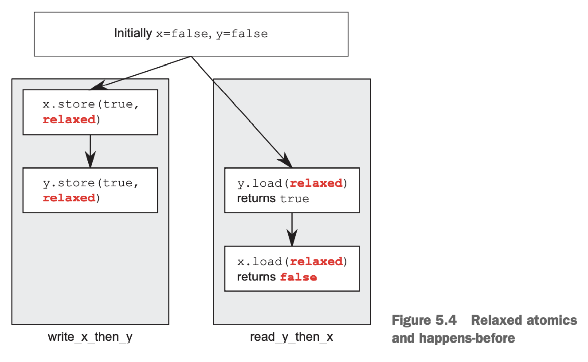

有两个线程，第一个往某个数据结构写数据，第二个从里面读数据。为了避免条件竞争，第一个线程写完数据之后设置一个标记，第二个线程在该标记设置之前不会尝试读数据。
```cpp
#include <vector>
#include <atomic>
#include <iostream>
std::vector<int> data;
std::atomic<bool> data_ready(false);

void reader_thread()
{
    while (!data_ready.load())
    {
        std::this_thread::sleep(std::chrono::milliseconds(1));
    }

    std::cout << "The answer =" << data[0] << "\n";
}

void writer_thread()
{
    data.push_back(42);
    data_ready = true;
}
```
如果想要读和写不发生竞争，必须要求他们按照先后顺序执行，而这一点是由 `atomic<bool> data_ready` 保证的，这是通过内存模型的关系 `happens-before` `synchronizes-with` 提供了顺序功能。写数据发生在 `data_ready` 设置之前，读标记发生在读数据之前。`happens-before` 具有传递性，那么读数据发生在写数据之前。整个流程如下图所示：


### The synchronizes-with relationship
`synchronizes-with` 是一种只能有原子操作提供的关系。

在合适的内存模型下，一个原子写操作 `W`，与一个原子读操作 `R` 同步，意味着 `R` 读到的是 1）`W` 写的；2）同一个线程 `W` 之后某个原子写操作的数据；3）任意线程执行的 `read-modify-write` 操作所修改的数据。`synchronizes-with` 关系就是在某个线程写和某个线程读之间的顺序关系。

### The happens-before relationship
`happens-before` 和 `strongly-happens-before` 是构建程序执行顺序的基石，意思是某个操作能够看到其他操作的影响。同一个线程内，一个操作在某个操作之前，即 `sequenced-before`，那么也就是 `happens-before`，也是 `strongly-happens-before`。`sequenced-before` 往往指一个线程内的情况。一般地，在前的语句和在后面的语句就有 `sequenced-before` 的关系。在一个语句中，则没有 `happens-before` 的关系。比如下面的程序输出 "1, 2" 或者 "2, 1" 都是有可能的。
```cpp
#include <iostream>
void foo(int a, int b)
{
    std::cout << a << ", " << b << std::endl;
}

int get_num()
{
    static int i = 0;
    return ++i;
}

int main()
{
    foo(get_num(), get_num());
}
```
一般情况下，同一个语句内的操作是没有确定的顺序关系的，不过，在一个语句中的所有操作都发生在后续语句的操作之前。

`inter-thread happens-before` 用来表示两个不同线程的操作的先后关系。

一般情况下，`inter-thread happens-before` 简单地依赖于 `synchronizes-with` 关系。一个线程的 A 操作和另一个线程的 B 操作同步，那么 A 操作发生在 B 操作之前。`inter-thread happens-before` 关系也有传递性。

`inter-thread happens-before` 可以和 `sequenced-before` 结合。比如 A 在 B 之前发生，B 在另一个线程 C 之前发生，那么 A 在 C 之前发生（`sequenced-before`）；或者 A 与 B 同步，B 在 C 之前发生，那么 A 在 C 之前发生。在一个线程内有一系列操作，想让另一个线程后续操作可见，只需要同步一次即可。

`strongly-happens-before` 有略微不同。A 和 B 如果是 `synchronizes-with` 或者 `sequenced-before` 关系，那么就是 `strongly-happens-before`。`strongly-happens-before` 也有传递性。`memory_order_consume` 内存模型下，`inter-thread-happens-before` 并不一定有 `strongly-happens-before`。大量代码并不会用这种内存模型，所以实际中不用太关心这个差别。

### Memory ordering for atomic operations
有六种内存顺序，`memory_order_relaxed`, `memory_order_consume`, `memory_order_acquire`, `memory_order_release`, `memory_order_acq_rel`, `memory_order_seq_cst`，默认情况下使用`memory_order_seq_cst`，这是最严格的类型。这六种可以分成三类：`sequentially consistent` 顺序（`memory_order_seq_cst`）, `acquire-release` 顺序（`memory_order_consume`, `memory_order_acquire`, `memory_order_release`, `memory_order_acq_rel`）,和 `relaxed ordering` 顺序（`memory_order_relaxed`）。

在不同的 CPU 架构上，不同的内存顺序有很大的性能差别。比如在一些体系上，为了让一个处理器上的修改能让其他处理器看见，为了实现 `sequentially consistent` 而不是 `acquire-release` 或 `relaxed ordering`，或者是为了实现 `acquire-release` 而不是 `relaxed ordering` ，需要一些额外的指令。如果处理器数量很大，这个开销会变大从而影响性能。对于 x86 架构的 CPU 而言，写操作都会有一个很小的额外开销，使得不管是哪一种内存顺序，都没有额外的指令。

不同的内存顺序使专家可以选择更小粒度更合适的内存模型以提升性能。

为了正确选择内存顺序，或者理解使用的这些内存顺序的代码，我们需要知道这些内存顺序是如何影响程序行为的。

#### SEQUENTIALLY CONSISTENT ORDERING
顺序一致（`sequentially consistent`）是默认值，它意味着程序的行为与按序执行是一致的。如果所有在原子类型上的操作都是顺序一致的，那么多线程执行就和以某种特定顺序在单个线程上执行是一样的。这是最简单的模型：所有的线程看到的顺序都是一样的。我们可以穷举所有可能的顺序，消除有矛盾的之后，那么程序的行为必定是其中之一。不能重新排序，如果一个执行在另一个线程的某个操作之前，那么所有的线程看到的都是这个顺序。

从同步的角度看，对同一个原子变量的写和读同步，那么读到的一定是刚写的值。这使得多线程操作有顺序约束。更重要的是，如果所有操作都是顺序一致，读在写之后，那么在读之后的操作，也必定在其他线程写之后。下面的例子会解释这一点。对于 `relaxed ordering`，这一点不成立，不同的线程可能会看到不同的顺序。

这种模型的代价是对于弱序（`weakly-ordered`）架构的机器来说，多个处理器之间会有昂贵的同步开销，因为为了让所有的处理器看到同样的顺序，需要大量（昂贵！）的同步指令。不过 x86 架构的同步相对轻量一些。

下面的代码读写 `x, y` 都显式地使用了 `memory_order_seq_cst`，尽管这不是必须的。
```cpp
#include <atomic>
#include <thread>
#include <assert.h>

std::atomic<bool> x, y;
std::atomic<int> z;

void write_x()
{
    x.store(true, std::memory_order_seq_cst);
}

void write_y()
{
    y.store(true, std::memory_order_seq_cst);
}

void read_x_then_y()
{
    while (!x.load(std::memory_order_seq_cst))
        ;
    if (y.load(std::memory_order_seq_cst))
        ++z;
}

void read_y_then_x()
{
    while (!y.load(std::memory_order_seq_cst))
        ;
    if (x.load(std::memory_order_seq_cst))
        ++z;
}

int main()
{
    x = false;
    y = false;
    z = 0;
    std::thread a(write_x);
    std::thread b(write_y);
    std::thread c(read_x_then_y);
    std::thread d(read_y_then_x);
    a.join();
    b.join();
    c.join();
    d.join();
    assert(z.load() != 0);
}
```
最后的 `assert` 永远为真，因为写 `x` 或者 `y` 一定有一个会先执行。假定 `read_x_then_y` 中检查 `y` 返回了 `false`，这意味着 `x` 一定被设置为了 `true`，那么在 `read_y_then_x` 中，等到 `y` 为 `true` 之后检查 `x` 就一定是 `true`。`memory_order_seq_cst` 保持全局顺序一致，一个线程看到 `x` 是 `true` 而 `y` 是 `false`，那么所有线程看到的都是这个顺序，也就意味着 `x` 比 `y` 先设置。

对称情况也是有可能的。另外一种可能是 `z` 是 2，这时 `assert` 条件也是成立的。

下图展示了上面详细描述的这种情况。虚线表示两者之间有顺序关系：为了出现我们描述的行为，`load` 一定比 `store` 先发生。


顺序执行最直观也最容易理解，但是可能会有很大的同步开销。为了消除这个开销，有时可以使用其他内存顺序。

#### NON-SEQUENTIALLY CONSISTENT MEMORY ORDERINGS
一旦走出顺序一致的世界，事情就变得复杂很多。核心就是不再有一个全局一致的事件顺序。大脑中关于线程交织执行的图像需要扔到一边。不仅仅真的并行执行，同时，所有线程并不会对事件顺序达成一致。写（甚至仅仅是理解）不用默认内存顺序的代码，始终要牢记这一点。即使多个线程同时执行同一个代码段，多个操作之间没有额外的约束，也就不会达成一致，这是因为不同 CPU 的缓存对同一个内存持有不同的值。再一次强调：没有全局一致的事件顺序。

线程交织执行要扔到一边，编译器或者处理器的乱序执行也要扔到一边。由于没有顺序约束，多个线程达成的唯一共识就是每一个独立变量的修改顺序是一致的。假设通过一些附加的顺序约束使得看到的值是一致的，不同线程上不同的操作仍旧以不同顺序出现。

首先看最松散的 `memory_order_relaxed` 内存顺序，之后再看其他类型，这样比较容易理解。

#### RELAXED ORDERING
宽松顺序（`relaxed ordering`）顺序不参与 `synchronizes-with` 关系。同一个线程内的 `happens-before` 关系是有的，除此之外，线程间几乎没有约束。一个线程内访问同一个原子变量不能乱序。一旦一个线程看到某个值，之后的操作不会再读到更早的值。对同一个变量的修改顺序达成一致外，多个线程之间看到的顺序就没有其他约束了。

下面的例子说明了宽松顺序的影响。
```cpp
#include <atomic>
#include <thread>
#include <assert.h>

std::atomic<bool> x, y;
std::atomic<int> z;

void write_x_then_y()
{
    x.store(true, std::memory_order_relaxed);
    y.store(true, std::memory_order_relaxed);
}

void read_y_then_x()
{
    while (!y.load(std::memory_order_relaxed))
        ;
    if (x.load(std::memory_order_relaxed))
        ++z;
}

int main()
{
    x = false;
    y = false;
    z = 0;
    std::thread a(write_x_then_y);
    std::thread b(read_y_then_x);
    a.join();
    b.join();
    assert(z.load() != 0);
}
```
最后的 `assert` 条件可能为 `false`。在一个线程中，我们先写 `x` 再写 `y`，再另一个线程中先确保 `y` 为真再读 `x`，但是后读 `x` 仍旧可能为 `false`。这是因为 `x, y` 是不同变量，不保证在所有线程看到的顺序都一样。

只要在约束下（比如同一个线程内）保证 `happens-before` 关系，不同变量之间可以任意重新排序。`synchronizes-with` 关系并没有被引入进来。下图是一种 `assert` 条件为 `false` 的情况。



尽管两个 `load` 和两个 `store` 之间有顺序保证，但是任意一个 `load` 和任意一个 `store` 之间是没有顺序保证的。

下面看一个更复杂的例子，涉及三个变量和五个线程。
```cpp
#include <thread>
#include <atomic>
#include <iostream>

std::atomic<int> x(0), y(0), z(0);
std::atomic<bool> go(false);
unsigned const loop_count = 10;

struct read_values
{
    int x, y, z;
};

read_values values1[loop_count];
read_values values2[loop_count];
read_values values3[loop_count];
read_values values4[loop_count];
read_values values5[loop_count];

void increment(std::atomic<int> *var_to_inc, read_values *values)
{
    while (!go)
        std::this_thread::yield();

    for (unsigned i = 0; i < loop_count; ++i)
    {
        values[i].x = x.load(std::memory_order_relaxed);
        values[i].y = y.load(std::memory_order_relaxed);
        values[i].z = z.load(std::memory_order_relaxed);
        var_to_inc->store(i + 1, std::memory_order_relaxed);
        std::this_thread::yield();
    }
}

void read_vals(read_values *values)
{
    while (!go)
        std::this_thread::yield();

    for (unsigned i = 0; i < loop_count; ++i)
    {
        values[i].x = x.load(std::memory_order_relaxed);
        values[i].y = y.load(std::memory_order_relaxed);
        values[i].z = z.load(std::memory_order_relaxed);
        std::this_thread::yield();
    }
}

void print(read_values *v)
{
    for (unsigned i = 0; i < loop_count; ++i)
    {
        if (i)
            std::cout << ",";
        std::cout << "(" << v[i].x << "," << v[i].y << "," << v[i].z << ")";
    }
    std::cout << std::endl;
}

int main()
{
    std::thread t1(increment, &x, values1);
    std::thread t2(increment, &y, values2);
    std::thread t3(increment, &z, values3);
    std::thread t4(read_vals, values4);
    std::thread t5(read_vals, values5);
    go = true;
    t5.join();
    t4.join();
    t3.join();
    t2.join();
    t1.join();
    print(values1);
    print(values2);
    print(values3);
    print(values4);
    print(values5);
}
```
程序包含三个全局原子变量，五个线程。每个线程循环 10 次，使用 `memory_order_relaxed` 内存顺序读取原子变量的值写到对应的数组中。其中三个会每次对其中一个原子变量进行加一。

`go` 原子变量的目的是让这几个线程尽可能的同时开始，而不会出现一个线程都运行完了另一个还没有初始化完成。

一种可能得输出如下所示：
```
(0,0,0),(1,0,0),(2,0,0),(3,0,0),(4,0,0),(5,7,0),(6,7,8),(7,9,8),(8,9,8),(9,9,10)
(0,0,0),(0,1,0),(0,2,0),(1,3,5),(8,4,5),(8,5,5),(8,6,6),(8,7,9),(10,8,9),(10,9,10)
(0,0,0),(0,0,1),(0,0,2),(0,0,3),(0,0,4),(0,0,5),(0,0,6),(0,0,7),(0,0,8),(0,0,9)
(1,3,0),(2,3,0),(2,4,1),(3,6,4),(3,9,5),(5,10,6),(5,10,8),(5,10,10),(9,10,10),(10,10,10)
(0,0,0),(0,0,0),(0,0,0),(6,3,7),(6,5,7),(7,7,7),(7,8,7),(8,8,7),(8,8,9),(8,8,9)
```
* 前面三行分别对应前三个线程，每行对应 `x,y,z` 中的一个原子变量依次加一。
* 在 `x` 增加的线程中 `y,z` 的增加是非均匀的。其他线程也是类似的。
* 第三个线程貌似只递增 `z` 没有看到其他变量的更新，但是这不影响其他线程能看到 `z` 的更新。

这只是一种可能性，还有很多其他的可能性。不过都遵循从小到大的规律，同时，前三个线程对于 `x, y, z` 的自增是严格的 0 到 9。

#### UNDERSTANDING RELAXED ORDERING
书中给了一个形象的例子来说明这个问题。

想想一个房间有一个人，他有一个笔记本，依次记录一些数字。你可以打电话告诉他一个数，也可以问询一个数。一旦告诉你某个数字，他下一次会告诉同一个结果或者下方的数字，绝对不会回复上面的数字。

你和另一个人，比如 Carl 一同打电话。比如 Carl 要求写下 23 后你打电话要求写下 42，这个数字不一定会在下次 Carl 查询的时候被告知对法。

进而考虑不是一个房间，而是一堆房间。问题就更复杂了，不过房间中的人的原则是不变的。这个房间就是原子变量，你和 Carl 就是不同的线程，上述的原则就是 `memory_order_relaxed` 内存模型。`exchange` 函数就是写下一个数字并且告诉我上一个数字是多少，`compare_exchange_strong` 函数就是如果笔记本底部数字是多少就写下多少，否则告诉我最后一个值是多少。

宽松顺序会使得问题复杂很多，不建议使用。最早的例子只有两个原子变量就会有意想不到的结果，可以想象，如果设计更多的原子变量会更复杂。

#### ACQUIRE-RELEASE ORDERING
获得释放（`acquire-release`）顺序也没有全局一致的顺序，但是引入了一些同步。原子加载（`load`）是获得（`acquire`）操作（`memory_order_acquire`），原子存储（`store`）是释放（`release`）操作（`memory_order_release`），原子地读修改写（`fetch_add()`, `exchange()`）是其中之一或者都是（`memory_order_acq_rel`）。同步是成对出现的，一个线程释放，另一个线程获得。一个释放操作和一个获得操作同步，意味着读到的是刚写的值。多个线程之间看到的顺序不同，但是这个顺序是受到约束的。下面是使用获得释放顺序的例子。
```cpp
#include <atomic>
#include <thread>
#include <assert.h>

std::atomic<bool> x, y;
std::atomic<int> z;

void write_x()
{
    x.store(true, std::memory_order_release);
}

void write_y()
{
    y.store(true, std::memory_order_release);
}

void read_x_then_y()
{
    while (!x.load(std::memory_order_acquire))
        ;
    if (y.load(std::memory_order_acquire))
        ++z;
}

void read_y_then_x()
{
    while (!y.load(std::memory_order_acquire))
        ;
    if (x.load(std::memory_order_acquire))
        ++z;
}

int main()
{
    x = false;
    y = false;
    z = 0;
    std::thread a(write_x);
    std::thread b(write_y);
    std::thread c(read_x_then_y);
    std::thread d(read_y_then_x);
    a.join();
    b.join();
    c.join();
    d.join();
    assert(z.load() != 0);
}
```
最后的 `assert` 也是出现失败的情况，这和宽松顺序一样。`x, y` 分别在不同的线程更新，释放获得操作成对出现且不会影响其他线程，所以 `x, y` 都可能读到 `false`。

下图展示了这一点。读 `x` 的事件和写 `x` 的事件之间没有约束，也没有 `happens-before` 关系。


为了看到获得释放顺序的好处，可以将写放到一个线程。把前面宽松顺序的例子改写一下。使用 `memory_order_release, memory_order_acquire` 内存模型。
```cpp
#include <atomic>
#include <thread>
#include <assert.h>

std::atomic<bool> x, y;
std::atomic<int> z;

void write_x_then_y()
{
    x.store(true, std::memory_order_relaxed);
    y.store(true, std::memory_order_release);
}

void read_y_then_x()
{
    while (!y.load(std::memory_order_acquire))
        ;
    if (x.load(std::memory_order_relaxed))
        ++z;
}

int main()
{
    x = false;
    y = false;
    z = 0;
    std::thread a(write_x_then_y);
    std::thread b(read_y_then_x);
    a.join();
    b.join();
    assert(z.load() != 0);
}
```
由于采用了获得释放顺序同步，那么读到 `y` 是 `true` 那么表明写 `true` 发生在这之前。由于写 `x` 在写 `y` 之前，读 `x` 在读 `y` 之后，所以读 `x` 在写 `x` 之后，所以读到的一定是 `true`，`assert` 不会被触发。如果读 `y` 不在循环中，可能会读到 `false`，同时也没有顺序同步的保证，那么读 `x` 时也有可能读到 `false`。获得释放要成对出现，如果写 `y` 或者读 `y` 有一处使用宽松顺序，那么读 `x` 是没有顺序保证的。

#### TRANSITIVE SYNCHRONIZATION WITH ACQUIRE-RELEASE ORDERING
研究传递性至少需要三个线程。第一个线程以 `release` 写某个值，第二个线程以 `acquire` 读该值，然后以 `release` 写另一个值，第三个线程以 `acquire` 读另一个值。这些都是同步操作，那么第三个线程能够看到第一个线程在写某个值之前的操作，尽管第二个线程压根没有接触这些值。
```cpp
std::atomic<int> data[5];
std::atomic<bool> sync1(false), sync2(false);

void thread_1()
{
    data[0].store(42, std::memory_order_relaxed);
    data[1].store(97, std::memory_order_relaxed);
    data[2].store(17, std::memory_order_relaxed);
    data[3].store(-141, std::memory_order_relaxed);
    data[4].store(2003, std::memory_order_relaxed);
    sync1.store(true, std::memory_order_release);
}

void thread_2()
{
    while (!sync1.load(std::memory_order_acquire))
        ;
    sync2.store(true, std::memory_order_release);
}

void thread_3()
{
    while (!sync2.load(std::memory_order_acquire))
        ;
    assert(data[0].load(std::memory_order_relaxed) == 42);
    assert(data[1].load(std::memory_order_relaxed) == 97);
    assert(data[2].load(std::memory_order_relaxed) == 17);
    assert(data[3].load(std::memory_order_relaxed) == -141);
    assert(data[4].load(std::memory_order_relaxed) == 2003);
}
```
由于传递性，`assert` 不会失败。

这个例子中，第二个线程可以以 `memory_order_acq_rel` 进行读修改写操作。下面的例子中使用 `compare_exchange_strong()` 达到相同的目的。
```cpp
std::atomic<int> sync(0);
void thread_1()
{
    // ...
    sync.store(1, std::memory_order_release);
}

void thread_2()
{
    int expected = 1;
    while (!sync.compare_exchange_strong(expected, 2,
                                         std::memory_order_acq_rel))
        expected = 1;
}

void thread_3()
{
    while (sync.load(std::memory_order_acquire) < 2)
        ;
    // ...
}
```
使用读修改写操作，选择合适的顺序语义是非常重要的。这里即需要获得语义，也需要释放语义，所以使用 `memory_order_acq_rel`。如果 `fetch_sub` 使用 `memory_order_acquire` 的话不会同步，因为写操作不是释放操作。同样地，如果 `fetch_or` 使用 `memory_order_release` 的话也不会同步，因为读操作不是获得操作。`memory_order_acq_rel` 具备这两个语义，所以和上一个写操作同步，也和下一个读操作同步。

宽松顺序仍旧是宽松的，不过由于引入了获得释放语义的顺序，那么这些操作受到一些限制，和一些操作有 `happens-before` 关系。

### Release sequences and synchronizes-with
对原子类型进行读写操作要选择合适的内存序，如果每一对都符合释放获得语义，后一个读操作读到的就是前一个写操作写的值，那么就是释放序列（`release sequence`）。

下面的例子使用 `atomic<int>` 记录 `count` 来同步消费者和生产者。
```cpp
#include <atomic>
#include <thread>

std::vector<int> queue_data;
std::atomic<int> count;

void populate_queue()
{
    unsigned const number_of_items = 20;
    queue_data.clear();
    for (unsigned i = 0; i < number_of_items; ++i)
    {
        queue_data.push_back(i);
    }

    count.store(number_of_items, std::memory_order_release);
}

void consume_queue_items()
{
    while (true)
    {
        int item_index;
        if ((item_index = count.fetch_sub(1, std::memory_order_acquire)) <= 0)
        {
            wait_for_more_items();
            continue;
        }

        process(queue_data[item_index - 1]);
    }
}

int main()
{
    std::thread a(populate_queue);
    std::thread b(consume_queue_items);
    std::thread c(consume_queue_items);
    a.join();
    b.join();
    c.join();
}
```
如果只有一个消费者是没有问题的，`fetch_sub` 是 `memory_order_acquire` 语义而写操作是 `memory_order_release`。不过有多个消费者就不是这样了，第二个消费者不见得能够看到第一个消费者修改之后的值，那么就会出错。正确的做法是每个消费者改写的时候也要有 `memory_order_release` 语义。

### Fences
围栏（`fence`），也称为内存屏障（`memory barriers`），是一个全局操作，可以影响同一个线程的其他原子操作顺序。将前面使用宽松顺序的例子加上围栏，加上一些限制，使得有 `happens-before` 和 `synchronizes-with` 的关系。
```cpp
#include <atomic>
#include <thread>
#include <assert.h>

std::atomic<bool> x, y;
std::atomic<int> z;

void write_x_then_y()
{
    x.store(true, std::memory_order_relaxed);
    std::atomic_thread_fence(std::memory_order_release);
    y.store(true, std::memory_order_relaxed);
}

void read_y_then_x()
{
    while (!y.load(std::memory_order_relaxed))
        ;
    std::atomic_thread_fence(std::memory_order_acquire);
    if (x.load(std::memory_order_relaxed))
        ++z;
}

int main()
{
    x = false;
    y = false;
    z = 0;
    std::thread a(write_x_then_y);
    std::thread b(read_y_then_x);
    a.join();
    b.join();
    assert(z.load() != 0);
}
```
释放围栏和获得围栏成对出现，使得写 `x` 一定发生在读 `x` 之前，所以 `assert` 不会失败。注意，两处围栏都是必要的：在一个线程线程释放操作，在另一个线程获得操作。

在这个 case 中，释放围栏的效果相当于写 `y` 时使用 `memory_order_release` 而不是 `memory_order_relaxed`。类似的，获得围栏相当于读 `y` 时使用 `memory_order_acquire`。

尽管围栏同步依赖于在围栏前面读写数据的顺序，但是同步点是围栏本身。如果把写 `x` 挪到围栏之后，那么 `assert` 可能会失败。
```cpp
void write_x_then_y()
{
    std::atomic_thread_fence(std::memory_order_release);
    x.store(true, std::memory_order_relaxed);
    y.store(true, std::memory_order_relaxed);
}
```
这两个写操作没有被围栏分开，也就不会被围栏强加一个顺序。

### Ordering non-atomic operations with atomics
将上一个小节的例子用非原子 `bool` 改写，效果也是一样的。
```cpp
#include <atomic>
#include <thread>
#include <assert.h>

bool x = false;
std::atomic<bool> y;
std::atomic<int> z;

void write_x_then_y()
{
    // 围栏使得写 x 和 y 之前有了顺序保证
    x = true;
    std::atomic_thread_fence(std::memory_order_release);
    y.store(true, std::memory_order_relaxed);
}

void read_y_then_x()
{
    while (!y.load(std::memory_order_relaxed))
        ;
    // 围栏使得读也有先后顺序
    std::atomic_thread_fence(std::memory_order_acquire);
    if (x)
        ++z;
}

int main()
{
    x = false;
    y = false;
    z = 0;
    std::thread a(write_x_then_y);
    std::thread b(read_y_then_x);
    a.join();
    b.join();
    assert(z.load() != 0);
}
```
围栏的使用使得 `x, y` 读写之前有 `happens-before` 的关系，所以 `assert` 也不会失败。`y` 必须是原子类型，否则读写 `y` 会产生竞争。围栏对 `x` 操作强加了顺序，那么能看到 `y` 已经是 `true` 了，那么再读 `x` 是安全的，强加的顺序保证读写 `x` 不会有竞争。

### Ordering non-atomic operations
使用原子操作对非原子操作加一个顺序是 `sequence-before` 的重要应用。如果一个非原子操作 `sequenced-before` 一个原子操作，一个原子操作又 `happens before` 另一个线程的某个操作，那么非原子操作在某个操作发生之前。这也是上一节中非原子操作起作用的原因。同时，这也是 C++ 同步库的基础。下面分析最简单的自旋锁的例子。

`lock()` 操作使用 `std::memory_order_acquire` 顺序循环调用 `flag.test_and_set()`，`unlock()` 使用 `std::memory_order_release` 顺序调用 `flag.clear()`。当第一个线程调用 `lock()` 时初始状态是清除状态，所以 `test_and_set()` 设置标记位并返回 `false`，终止循环，也就是拿到了锁。这个线程开始修改保护的数据。其他线程调用 `lock()` 发现标记位被设置了，一直处于循环状态。

当第一个程序修改完被保护的数据时，调用 `unlock()`，以 `std::memory_order_release` 内存顺序调用 `flag.clear()`。这和其他调用 `lock()` 的线程是同步的，因为调用 `lock()` 的线程是以 `std::memory_order_acquire` 顺序调用 `test_and_set()`。第一个线程修改数据是 `sequence before` `unlock()` 操作，而这个操作又 `happens before` 其他线程的 `lock()` 操作，其他线程在 `lock()` 之后再修改被保护的数据。所以修改数据的操作也是同步的。

其他互斥操作有其他内部操作，不过基本原理都是一样的。二、三、四章介绍的同步机制都提供了顺序保证，即有 `synchronizes-with` 关系。
