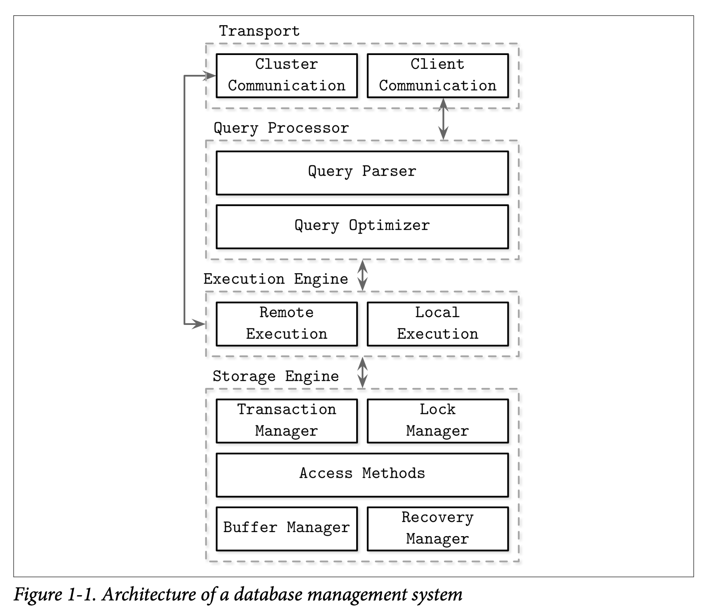
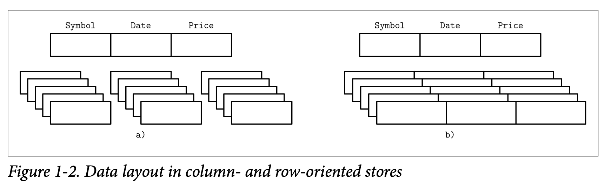
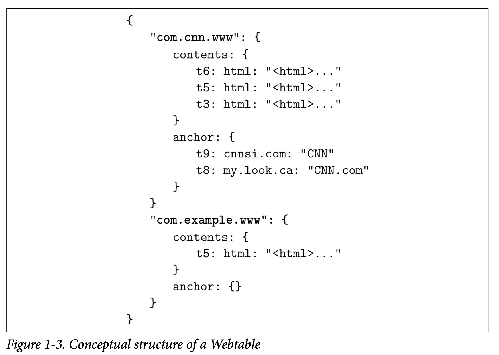
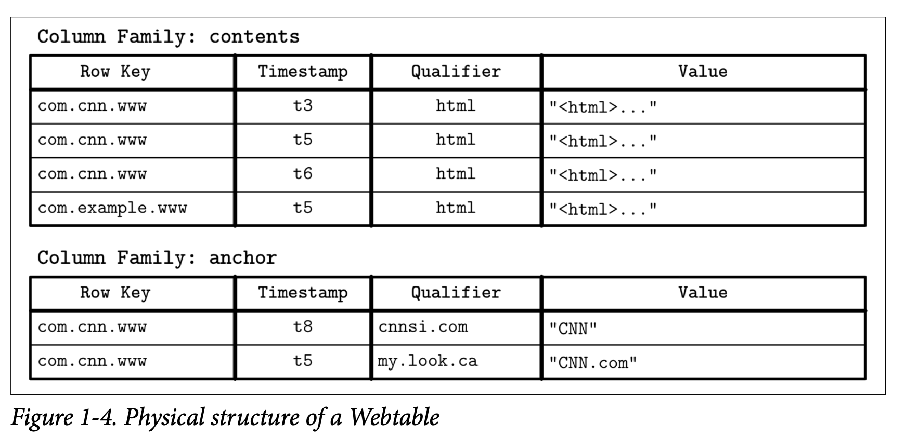
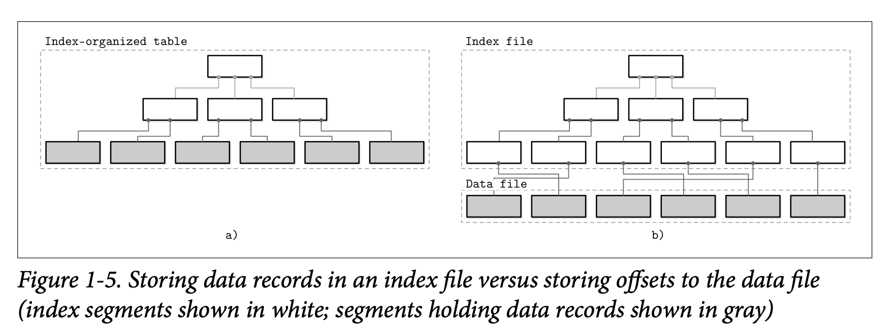
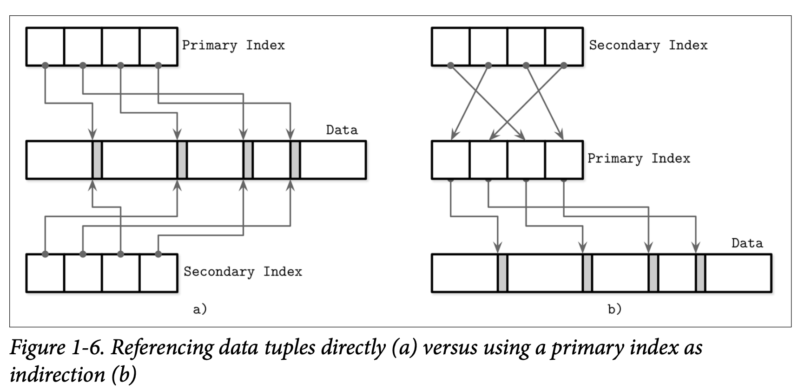

数据库通常用于不同的目的：有一些放临时的热数据、一些服务于长期的冷数据，一些处理复杂的分析查询，一些只能通过 key 访问，有的为时序数据做了专门优化，一些放大对象非常高效。为了理解这些数据库的不同，从一些分类和概述开始，这会帮助我们进一步的讨论。

我们首先会看一下数据库的架构，然后分析使用不同存储介质的数据库和数据布局不同的数据库。

上述两种分类是不完整的。有时会根据场景将数据库分为三类 OLTP（`Online transaction processing`）、OLAP（`Online analytical processing`） 和 HTAP（`Hybrid transactional and analytical processing`）。还有一些分类，比如 kv 数据库，关系数据库，文档数据库、图数据库。

第一部分聚焦于存储和索引，本节也会做简要的介绍。

## DBMS Architecture
数据库并没有统一的架构，各个数据库会有略微的差别，组件之间的界限也没有那么清晰。即使原始文档中有边界，实际代码中为了优化、特殊情况等等也会有耦合在一起的情况。

下图是一个数据库的架构，能够代表大部分的数据库。

数据库使用 client/server 模型，数据库节点（`node`）承担 server 的角色，应用是 client。客户端通过传输子系统，将查询发送到服务器端，传输子系统负责和数据库内部节点通信。

接着是查询处理模块。parser 解析、解释、验证查询。访问控制也要检查。然后优化器进行优化，消除查询中冗余的部分，根据内部统计信息（比如索引基数、估算交集大小等）尝试寻找最优的方式来执行这个查询。查询通常会被表示成执行计划（`execution plan`）或查询计划（`query plan`），是一系列的操作来得到最后的结果。由于使用一些不高效的执行计划都能满足查询，因此优化器需要选择最佳的可行计划。

执行引擎（`execution engine`）来执行计划。`remote execution` 需要从远端节点接受数据或者发送数据到其他节点。

存储引擎（`storage engine`）执行本地查询。负责下面这些角色的指责：

* 事务管理（`transaction manager`）：调度事务，不会使得数据库处于逻辑不一致的状态。
* 锁管理（`lock manager`）：为事务锁住数据库某个粒度的对象，确保并发操作不会破坏数据完整性。
* 访问方法（`access methods`）：访问和组织磁盘上的数据，包括 heap 文件和类似 B 树这种存储结构。
* 缓存管理（`buffer manager`）：数据页在内存中的缓存。
* 恢复管理（`recovery manager`）：维护操作日志并在失败时恢复系统状态。

事务管理和锁管理实现了并发控制，在尽可能高效并发的同时，确保逻辑上和物理上数据的完整性。

## Memory- Versus Disk-Based DBMS
数据库在内存和磁盘上存储数据。内存数据库（`in-memory database management systems`）主要使用内存存放数据使用磁盘存储日志、进行恢复。基于磁盘的数据库大部分数据都放在磁盘上，内存存放磁盘内容的缓存或作为临时存储。两者都要使用磁盘，不过内存数据库数据基本上都在内存。

访问内存要比访问磁盘快几个数量级，拿内存作为主要存储相当有吸引力，随着价格下降变得经济可行。不过内存价格仍旧比磁盘或固定硬盘贵很多。

除了存储介质之外，内存数据库和基于磁盘的数据库在数据结构、组织方式、优化技术等方面都有不同。

数据库使用内存作为主要存储是因为性能、访问成本更低、访问粒度。面向内存编程要比磁盘简单的多。操作系统抽象了内存，因此只要将其看作是可以分配、释放任意大小的内存块就好了。数据在磁盘上就复杂多了，需要考虑管理数据引用、序列化格式、释放内存、碎片管理。

内存数据库发展受限的因素是内存的易失性和成本。由于易失性，软件错误、崩溃、断电等等都会导致丢失数据。有一些方式防止这些事情，比如 UPS 供电，但是这都需要额外的硬件资源支持。实际中，要依赖更便宜、易维护的磁盘。

NVM（`Non-Volatile Memory`）的普及改变了这一点。NVM 减少或者消除了读写延迟不对称的问题，进一步提升读写性能，并且允许字节寻址访问。

### Durability in Memory-Based Stores
内存数据库备份数据到磁盘上来持久化数据防止数据丢失。一些数据库仅使用内存保存数据，没有持续化的保证，这里不会讨论这种情况。

操作完成之前，结果会写到一个顺序文件中，稍后会讨论 Write-ahead log 细节。为了避免重放全部日志，内存数据库维护了备份副本（`backup copy`）。备份副本是有序的磁盘结构，异步修改，批量操作以减少 I/O 操作。数据库内存从备份副本和日志中恢复。

一批日志应用于备份副本之后，备份就是一份快照（`snapshot`），到该点处的日志就可以丢弃了。这个称为 `checkpoint`。通过保存最新的日志来减少恢复的时间，同时无需阻塞客户端直到备份更新。

基于磁盘的数据库使用为磁盘访问优化的数据结构。内存中，指针访问很快，随机访问比磁盘的随机访问快得多。基于磁盘的数据库往往使用宽而短的树，而基于内存的数据库有大量的数据结构可选来优化性能，但这些技术在磁盘上无法实现或难得多。类似的，在磁盘上处理变长数据需要特别小心，而内存中使用指针引用数据就好了。

对于一些场景，可以假定整个数据集可以放到内存中。数据集受现实世界的约束，比如一个学校的学生记录，公司的客户记录，在线存储的库存。每条记录不会超过数 Kb，总量有限。

## Column- Versus Row-Oriented DBMS
大部分数据库存储存放数据记录（`data record`）的集合，包含一个表（`table`）的列（`column`）和行（`row`），行和列相交于某个类型的一个值，称为字段（`field`）。属于同一列的字段通常类型相同。

一种将数据库分类的标准就是如何组织磁盘上的数据：按列存还是按行存。表是水平划分还是垂直划分。下图（a）是列存（b）是行存。

行存数据库很多，比如 MySQL，PostgreSQL 和许多其他传统数据库。列存数据库的先行者有 MonetDB 和 C-Store（后者又演进成了商业数据库 Vertica）。

### Row-Oriented Data Layout
行存数据库的数据布局接近表的逻辑表示。

当不得不按行访问时，将行存放在一起能够提高空间局部性。磁盘上的数据按块访问，行存的话单个块能够包含所有列。当需要访问整个记录时，效率很高，如果要访问多个记录的某一列时，需要读多页，效率很低。

### Column-Oriented Data Layout
列存数据库将数据垂直划分，同一列的数据在磁盘上连续存放。行存更适用于分析查询。一般情况下，使用虚拟 ID 来对齐数据（同一行）。

过去若干年，复杂分析查询越来越多，行存文件格式也很多，比如 Apache Parquet，Apache ORC 等，列存数据库有 Apache Kudu，ClickHouse 等。

### Distinctions and Optimizations
行存和列存的区别不仅仅是存储数据的方式不同。选择列存也仅仅是优化的第一步。

读取同一列的多个值，可以充分利用缓存和计算效率。现代 CPU 有 SIMD 指令，一条指令处理多个数据。将同一个类型的数据存放在一起，压缩率更高，可以根据数据的类型和模式选择最佳的压缩算法。

决定是行存还是列存，需要理解访问模式（`access pattern`）。如果需要读一行的大部分列，查询多数都是点查或者范围扫描，行存更合适一些。如果在列的子集上扫描许多行、聚集计算的话，列存可能更合适。

### Wide Column Stores
不要把列存与宽列存储（`wide column store`）混为一谈，后者是将数据表示为多维 map，列被分组成列族（`column family`），在列族内部按行存储。这种布局通过 key 或者一系列 key 来访问。

Bigtable 论文中的传统例子是 Webtable。key 是 reversed URL，每个列内存，通过时间戳访问某个时间的数据（快照）。

数据存储为具有多层索引的多维映射，根据 reversed URL 找到网页，再通过时间戳访问内容或者作者。每一行根据 row key 索引。相关列分组成了列族。不同的列族在磁盘上是分开存放的。列族的内部通过 column key 确定。根据时间戳存放了多版本。这种布局可以快速放到到高层记录（这里是网页）及其参数（内容）。

理解宽列存储的概念很有用，不过物理布局有些许不同。下图是一种列族的数据布局。列族分开存放，在列族内部，属于同一个 key 的数据存储在一起。

## Data Files and Index Files
数据库的主要目的是存储数据且快速访问。数据库使用文件存放数据，但是并不依赖于文件系统的目录结构和文件来定位记录，而是把数据组织成一个特殊格式的文件。使用特殊文件格式的原因是

* 存储效率（`storage efficiency`）：最小化存储开销。
* 访问效率（`access efficiency`）：最少步骤来定位记录。
* 更新效率（`update efficiency`）：更新记录时最小化磁盘变动。

每个表使用单独的文件。表的每条记录可以通过 search key 来查找。为了定位记录，数据库使用索引（`index`）这种附属结构来提升访问的效率，无需全表扫描。索引使用字段的子集来构建。

数据库通常分离数据文件（`data file`）和索引文件（`index file`）。索引文件往往小很多。文件被划分成页（`page`），大小是一个或多个磁盘块。页可以组织为记录序列或者 slotted page。

新数据的插入和已有数据的更新由键值对表示。大部分的数据库并不会真的删除数据，而是使用标记删除（`deletion marker`），其包含一些删除的元信息，比如 key 或时间戳。由于更新和删除导致一部分空间仍然会被占用，在垃圾回收时才会回收。

### Data Files
数据文件可以实现成索引组织表（`index-organized table`）、堆表（`heap-organized table`）（堆文件）或哈希组织表（`hash-organized table`）（哈希文件）。

记录在堆文件中无需特殊的顺序，大部分时候按照插入的顺序写。当一个新的页插入后，无需额外的工作。堆文件需要附加的索引结构，指向数据存放的位置，使之可以搜索。

在哈希文件中，记录按桶存放，key 的哈希值决定存放在哪个桶里面。桶内的数据可以按照插入顺序存放或者按 key 的顺序排序以提高查找速度。

索引组织表存放数据在索引内。记录按照 key 的顺序排列，范围扫描就可以实现为顺序扫描。数据存放在索引中使得至少可以减少一次磁盘寻址，因为找到找到了 key 就找到了数据，无需在另一个文件中查关联的数据。

当数据存放在单独的文件中时，索引文件存放的是数据入口（`data entry`），包含足够的信息可以在数据文件中找到对应的数据记录。比如存放的是文件偏移量（`offset`），或者哈希文件的桶 ID。在索引组织表中 data entry 存放的是数据本身。

### Index Files
索引是一种将磁盘上的数据记录组织起来使得能够高效查询的一种数据结构。索引文件被组织成一种特殊的结构，是 key 到数据文件中的地址的映射，或者存放的就是索引组织表的主键。

直接索引数据文件的索引称为主索引（`primary index`），大部分情况我们可以假设主索引使用主键或若干个列作为主键。其他索引称为次级索引（`secondary`）。

次级索引可以直接指向数据记录，也可以指向主键。多个次级索引可以指向同一个记录，那么可以根据不同的字段使用不同索引找到数据记录。主索引的每个 key 只能找到唯一的数据记录，而次级索引每个 key 可以关联多个数据记录。

如果数据的顺序与搜索 key 的顺序一致，那么称为聚簇（`clustered`）。这种情况下数据记录存在同一个文件或是聚簇文件中，按照 key 有序。如果存放在单独文件并且顺序与 key 顺序无关，那么索引称为非聚簇（`nonclustered`）。

下图展示了两种不同的索引方式。

索引组织表按照索引序存储信息且是聚簇的。主索引一般是聚簇的。次级不是聚簇的，因为它要按照其他 key 来寻找数据记录。聚簇索引可以是索引组织的，也可以有分类的索引文件和数据文件。

许多数据库有显示的主键（`primary key`），若干列唯一确定一条记录。如果逐渐不存在，有些存储引擎会创建一个隐式的主键。

### Primary Index as an Indirection
数据记录应该是被直接引用（记录偏移量）还是通过主键索引访问呢？各有优缺点。直接引用，减少磁盘寻址次数，但是记录被更新或者移动需要更新指针。通过主键索引间接访问可以减少更新指针的次数，但是读时开销更大。

如果负载是读多，那么更新指针问题不大，但是写负载比较大，就可能不能按期工作了，此时使用主键索引来间接访问比较好。下图是两种方式的比较。

还可以两种方式结合使用，同时存偏移量和主键，如果偏移量有效就直接访问，否则通过主键索引访问。

## Buffering, Immutability, and Ordering
存储引擎基于一些数据结构，不过这些数据结构 并不描述缓存、恢复、事务等其他语义。存储结构主要有三个共同变量：缓冲（`buffering`）、不可变的（`immutable`）和按序（`in order`）存储。大部分存储结构的不同和优化都和这几个概念相关。

* 缓冲：是否在写磁盘之前缓存一些数据在内存中。磁盘最小写粒度是块，因此某种程度上总是有缓存的，不过这里要讨论的是可以避免的缓冲，一些存储引擎就是这么做的。后面会讨论 B 树使用缓冲区来平摊 I/O 开销。LSM 用完全不同的方式来使用缓冲。
* 不可变的：这里指的是存储结构是否支持读取部分文件、更新，然后写回到文件内同一个位置。不可变指的是只能追加（`append-only`）。有其他方式来实现不变性，比如 `copy-on-write`，修改文件然后写到新的位置。LSM 和 B 树的一个区别就是是否能够就地修改，不过也有数据结构受 B 树影响但是不可变，比如 Bw 树。
* 有序：磁盘上的数据是否按照 key 排序。按序的 key 在磁盘上放在一起。有序性影响了高效的范围（`range`）扫描。无序存储主要是为了写优化。

## Further Reading
* Database architecture  
    Hellerstein, Joseph M., Michael Stonebraker, and James Hamilton. 2007. Architecture of a Database System. Foundations and Trends in Databases 1, no. 2 (February): 141-259. https://doi.org/10.1561/1900000002.  
    TODO
* Column-oriented DBMS  
    Abadi, Daniel, Peter Boncz, Stavros Harizopoulos, Stratos Idreaos, and Samuel Madden. 2013. The Design and Implementation of Modern Column-Oriented Database Systems. Hanover, MA: Now Publishers Inc.  
    [文章意译](../../../Papers/columnstoresfntdbs.md)
* In-memory DBMS  
    Faerber, Frans, Alfons Kemper, and Per-Åke Alfons. 2017. Main Memory Database Systems. Hanover, MA: Now Publishers Inc.  
    TODO
