前一章提到过，通过可变（`mutable`）和不可变（`immutable`）区分存储结构，不变性是影响涉及和实现的核心概念之一。大部分可变数据结构都是就地更新（`in-place update`）。插入、删除、更新时，数据结构直接在文件所处的位置被更新。

存储引擎通常保存数据的多个版本。为了简单，这里假设每一个 key 只关联一条具有唯一地址的数据记录。

最流行的数据结构之一是 B 树。许多开源数据库都是基于 B 树，能够覆盖多部分场景。B 树早在 1971 就被发明了，到了 1979 年有一些 B 树的变种。在讨论 B 树前先看一些传统的搜索树，比如二叉搜索树、2-3 树、AVL 树。

## Binary Search Trees
二叉搜索树（`binary search tree`）是一种内存中的排序数据结构，高效的查询能力。二叉搜索树包含多个节点，每个节点包含 key 和/或 value，两个子节点指针。二叉搜索树从根节点（`root node`）开始。如下图所示。

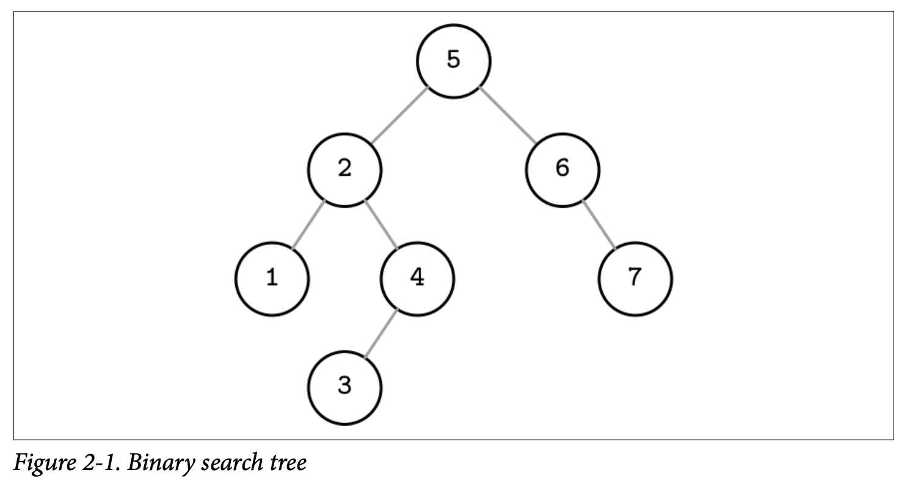

每一个节点将搜索空间分割成左右两个子树（`subtree`），左边的 key 小于该节点，右边的 key 大于该节点。

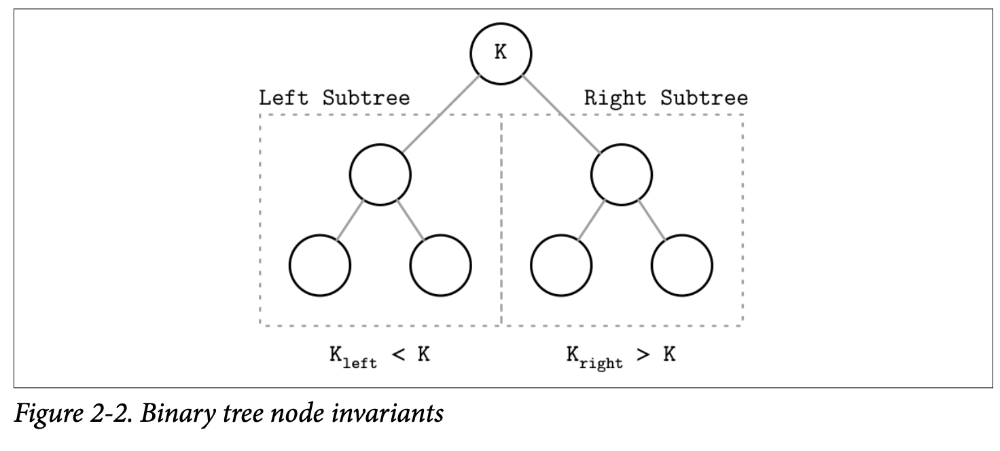

一直向左就是整棵树最小的节点，一直向右就是整棵树最大的节点。搜索从根节点开始，根据 key 向左或者右继续搜索。

### Tree Balancing
插入的模式可能会导致树不平衡，最差情况如下图（b）所示，退化成了链表，查询复杂度是线性而不是对数，下图的（a）的查询复杂度是对数级别。

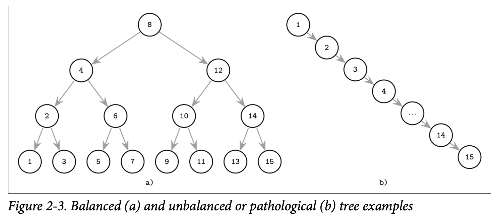

这个例子可能有点极端，但是问题确实存在。

平衡树（`balanced`）高度是 $\log_2N$，其中 $N$ 是节点数，左子树和右子树的高度差距不超过 1。如果不是平衡的，那么树的形态依赖于插入和删除的顺序，无法发挥二叉搜索树的性能。平衡树每个节点平分搜索空间，因此时间复杂度是 $O(\log_2 N)$。如果树不平衡，最差情况复杂度上升到 $O(N)$。

平衡（`balancing`）通过从新组织节点来实现，保持树的高度最小且每边的节点数保持在合理范围内。平衡的一种方式是每次插入、删除之后旋转节点。如果插入导致树不平衡，连续两个节点都只有一个孩子节点，我们以中间节点为轴（`pivot`）旋转（`rotate`）。

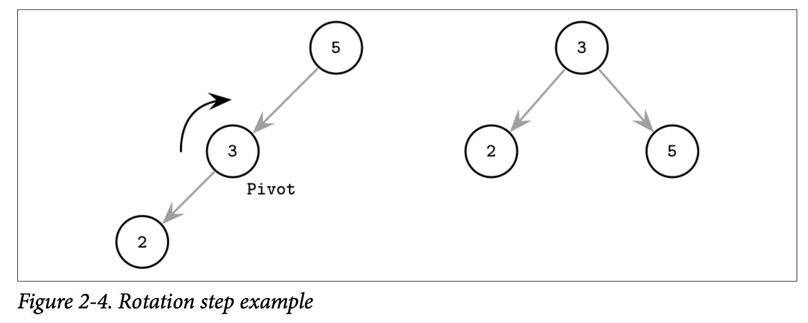

### Trees for Disk-Based Storage
由于低扇出（`fanout`），需要频繁地平衡树、旋转节点、更新指针。增加了二叉搜索树在磁盘上的维护成本。

如果想要在磁盘上维护二叉搜索树，需要面对两个问题。第一个局部性。由于数据随机插入，无法保证新插入的节点和父节点很近，这意味者子节点和父节点会跨过多个磁盘页。后面会讨论如何解决这个问题。

第二个问题是树的高度。由于扇出是 2，树的高度是二的对数，那么必须执行 $O(\log_2 N)$ 次搜索和磁盘寻址。2-3 树或其他类似低扇出的树都会面对这个问题。存放在内存中是很有用的数据结构，但是存放在磁盘上就不切实际了。

因此对于磁盘上的数据结构，应该满足高扇出、高度低。

## Disk-Based Structures
之前说过，数据库分为内存数据库和磁盘数据库。数据结构也是这样，有的更合适内存，有的更适合用于磁盘。

之前讨论过，使用磁盘存储时不是每一种数据结构都非常高效。用于磁盘的数据结构必须适应持久化介质的限制。

存储在磁盘上的数据结构往往很大，不适合或无法都放到内存。磁盘上仅有一部分数据缓存在内存，其余在磁盘上的数据也要能够高效的访问。

### Hard Disk Drives
大部分传统算法发明的时候，HDD 普遍使用，因此这些算法也受到了介质的影响。随着存储介质的发展，比如闪存，激发了新的算法或者修改已有算法，使之能够利用新的硬件能力。当前新的算法不断涌现，专门为非易失性字节寻址存储优化。

对于 HDD，寻址（`seek`）比较耗时，需要移动机械头到指定的轨道，还要旋转磁盘到指定的位置。不过一旦这些操作完成，读写连续的数据的开销就相对不大。最小的传输单元是扇区（`sector`），读写操作至少要读写整个扇区，其典型大小从 512 字节到 4KB。 HDD 寻址操作最耗时，因此顺序 IO（`sequential I/O`）效率比较高。

### Solid State Drives
SSD 无需移动机械臂和旋转磁盘。一个 SSD 最基本单元是 memory cell，组成 string，后者又组成 array，形成页（`page`），页组成块（`block`）。依赖于具体技术，一个 memory cell 可以存储一个或多个比特。不同设备间页大小从 2 字节到 16KB 不等，块一般包含 64 到 512 个页。块被组织成 plane，最终 plane 组装成 die。SSD 包含一个或多个 die。如下图所示。

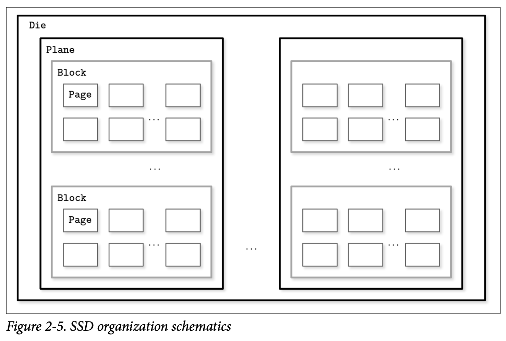

读写最小单元是页。不过只能修改空 memory cell，而最小擦除单元是块，因此也被称为擦除块（`erase block`）。空块内的页可以连续写入数据。

闪存控制器主要职责是维护页 ID 到物理位置的映射、跟踪空块、写数据和废弃页，也称为闪存传输层（`Flash Translation Layer`, `FTL`）。当 FTL 找到可以安全存储的块时负责垃圾回收。有些块还包含一些有用的页，这种情况下，控制器将有用的页移动到新的地方并更新页 ID 到物理位置的映射，然后擦除块，使之可以写数据。

HDD 和 SSD 寻址单元都是块而不是字节，大部分的操作系统有一个块设备（`block device`）抽象。它隐藏了 I/O 操作内部块的结构，当我们读某一个字节的时候，本质上是读了一整块。当我们设计磁盘存储的数据结构时，我们需要考虑这一点。

SSD 上，不强调顺序读写和随机读写，因为这个差距比 HDD 上两者的差距要写，但是由于预取、读连续页、内部并行等导致仍旧有差距。

尽管垃圾回收是后台操作，但是对于写的性能也有负面影响，特别是随机写和非对齐写入。

仅写入完整的块，并将后续写都合并成写同一个块，能够减少 I/O 次数。后续会讨论使用缓冲和不变性来使用这个目标。

### On-Disk Structures
除了磁盘自身的开销外，主要限制条件是磁盘操作单元是页。为了找到指针指向的页内位置，需要加载整个页。由于我们不得不这么做，我们要修改数据结构布局来利用这一点。

对于磁盘上的数据结构，指针的语义略微有点不同。磁盘上我们通常手动管理数据布局。类似于普通指针操作，我们必须计算出目标指针地址。大多数时间磁盘上的偏移量是提前计算好的，或者缓存在内存中，直到数据刷到磁盘上。在磁盘上的数据结构，创建长依赖会增加代码和数据结构的复杂性，所以最好最小化指针的数量及其跨度。总之，优化方向是更少的磁盘访问。我们通过提高局部性、优化数据结构内部表示、减少页外指针的数量。

之前提到过，对于磁盘上的数据结构，高扇出和低的高度是期望的特性。还讨论了指针附加的空间开销，为了树的平衡而导致的指针操作。B 树结合了这些想法：增加节点扇出，减少树的高度、节点指针数量、平衡操作的频率。

下图是将二叉搜索树节点分组到页的布局，提升了局部性。为了找到子节点，只需要在已经获取的页内定位即可。不过，跨页的话就有额外开销了。将数据结构存到磁盘且进行后续维护，绝非易事，特别是 key 和 value 随机插入的时候。平衡操作需要重组页面，进而需要更新指针。

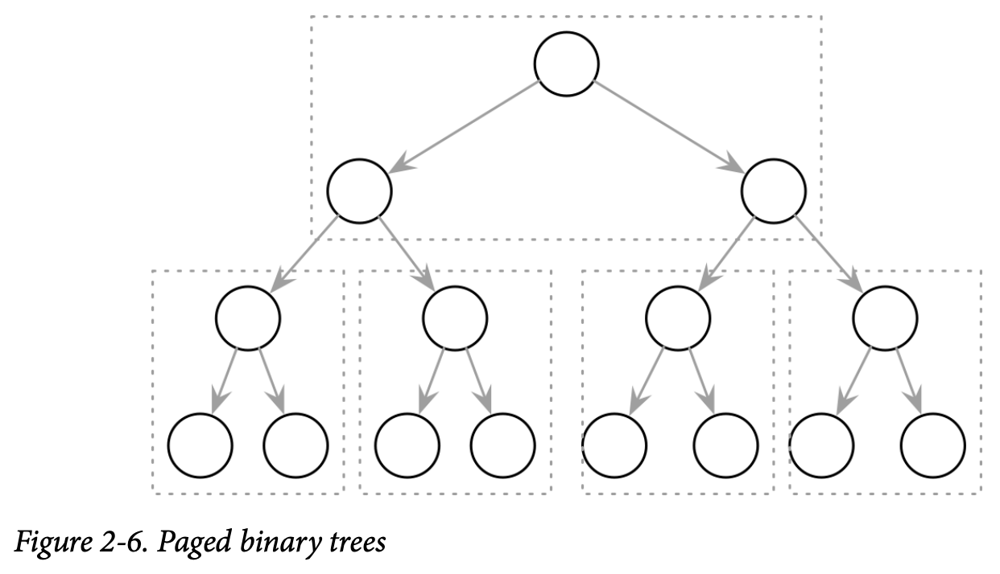

## Ubiquitous B-Trees
B 树与二叉搜索树类似，不过扇出更大，高度更低。

大部分书中，二叉树的节点都用圆表示，而 B 树使用矩形表示节点，并且显式的画出指针和 key 的关系。下图是二叉搜索树、2-3 树和 B 树的对比。

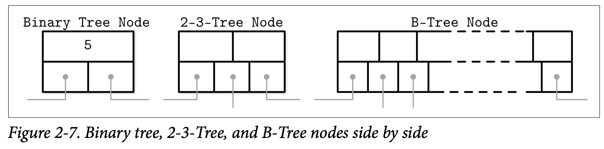

我们也可以用矩形来表示二叉搜索树的节点。如下图所示，和之前的图 2-1 表达的是同一颗树。

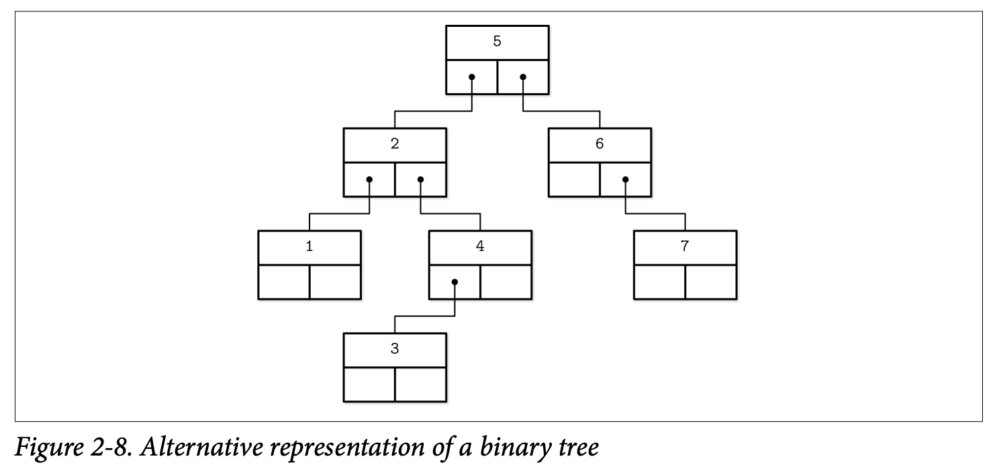

B 树是有序的，因此搜索效率与二叉搜索树类似，对数时间复杂度。如果每次都需要一次磁盘寻址，速度会下降很多，不过由于 B 树节点存储几十甚至上百项，跳级仅需一次寻址。后续会讨论细节。使用 B 树，可以高效的支持点查（`point`）和范围（`range`）查找。点查在大部分查询语言中都是 `=`，定位一个记录。范围查询通常用 `<` `>` `<=` `>=` 表示谓词，按序返回多个记录。

### B-Tree Hierarchy
B 树包含多个节点，每个节点最多包含 $N$ 个 key 和 $N+1$ 指针。节点逻辑上分成三个部分。

* 根节点（`root node`）：树中没有父节点的节点。
* 叶子结点（`leaf node`）：最底层没有子节点的节点。
* 内部节点（`internal node`）：连接根节点和叶子结点的节点。通常内部节点多余一层。

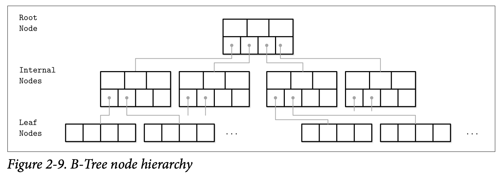

由于 B 树通常用页组织，因此有时会混用节点和页两个术语。

节点容量和实际持有的 key 的数量的比例称为占用率（`occupancy`）。

B 树的特征之一是高扇出。高扇出平摊为了保持平衡的结构变化的开销，减少了查找的次数。平衡操作（`split` `merge`）仅会在节点快满或者快空的时候发生。

这里使用 B 树表示有上述特性的一族数据结构。更精确的名字应该是 B+ 树。B 树允许在任意层次（根、内部节点、叶子结点）存储数据。B+ 树仅允许在叶子节点存储数据。内部节点仅包含 key 来搜索数据。由于 B+ 树只能在叶子节点存数据，所有的操作（插入、更新、删除、查找）都发生在叶子节点，会传导到与之相关的更高层节点。

### Separator Keys
存在 B 树中的 key 称为索引记录（`index entry`），用于分割子树（`subtree`）。key 有序存储，可以二分查找。

第一个指针指向的子树的 key 都比第一个 key 小，最后一个指针指向的子树的 key 都大于等于最后一个 key。其他指针介于两个 key 之间：$K_{i-1}\leq K_s<K_i$。如下图所示。

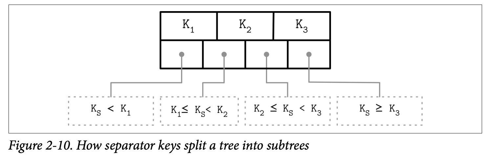

一些 B 树将兄弟节点用指针连起来，这通常发生在叶子节点，简化范围扫描。这些指针无需返回父节点在找到其兄弟节点。有时这个指针是双向的，那么支持反向迭代。

B 树自底向上构建整个树。随着叶子节点的增加，内部节点和树的高度会增加。

B 树节点内部预留了插入和更新的空间，因此存储利用率最低是 50%，通常比这个高。更好的占用率也不会影响性能。

### B-Tree Lookup Complexity
从两个方面来分析查询复杂度。假定每个节点有 $N$ 个 key，总共有 $M$ 个节点，那么需要访问 $\log_N M$ 个页，这也是从根节点到叶子结点的距离，树的高度。每一次比较，将搜索空间减半，因此比较复杂度是 $\log_2 M$。

### B-Tree Lookup Algorithm
之前讨论了 B 树的结构，下面分析查找、插入和删除。为了查找 B 树中的项，需要从根节点遍历到叶子节点。搜索的目标是找到搜索 key 或者它的前一个节点。精确查找用于点查、更新和删除，找到前一个节点对于范围扫描和插入很有用。

从根节点执行二分查找，比较搜索 key 与存储的 key，直到找到第一个大于搜索 key 的分割 key。这样定位到了一个指向子树的指针。一旦找到了子树，重复上述的过程直到找到某个叶子节点，要么找到了搜索 key，或者 key 的前一个值，这意味这搜索 key 不存在。

对于点查，结果就说明找到或者没找到要搜索的 key。对于范围扫描，从找到的 key 开始往后遍历，中间可能沿着指向兄弟节点到下一个节点接着遍历，直到不符合 key 不符合谓词。

### B-Tree Node Splits
为了插入数据到 B 树，需要定位到叶子节点和要插入的位置。首先使用上述算法找到叶子节点，然后定位要插入的位置，写数据。如果目标节点没有足够的空间了，也就是说节点已经满了要溢出，那么不得不分裂成两个节点。

分裂的过程是先构造一个新节点，转移一半的数据到新节点，然后添加新节点的第一个 key 和相应的指针到父节点。这种情况下称为 key 提升。执行分割的下标称为分割点（`split point`）或中点（`midpoint`）。

当 key 提升之后，如果父节点也是满的，那么没有空间存放被提升的 key，它也需要被分裂。这个过程可能递归到根节点。如果不得不分裂根节点，一个新的根节点创建出现了，它的 key 是分割点，旧的根节点下降到整个树的第二层，树的高度加一。在叶子节点和内部节点，树只会水平增长。

下图是一个满的叶子节点插入新数据的过程。

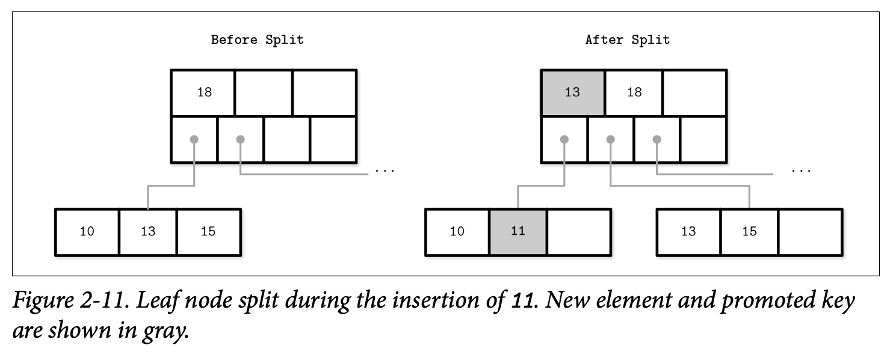

下图是一个满的内部节点插入了一个新的指针的过程。

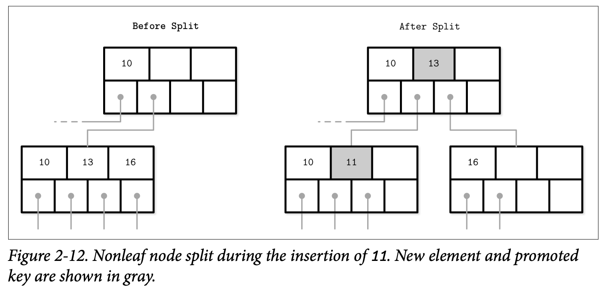

非叶子节点的分裂说明其子节点分裂，导致多了一个指针。

一旦分裂结束，根据插入的 key，如果小于提升的 key，插入原节点，否则插入新创建的节点。

### B-Tree Node Merges
删除操作也是先找到叶子节点，然后删除指定的 key 和关联的 value。

如果邻居节点的 key 比较少，并且兄弟节点有共同的父节点，那么可以合并。这种情况称为下溢。和插入 key 一样，这种情况有可能导致父节点合并，直至根节点，这样树的高度就减一。

下图是叶子节点删除 16 之后与后续的兄弟节点合并的例子。我们将兄弟节点的 key 移到当前节点，这样保持 key 顺序不变。

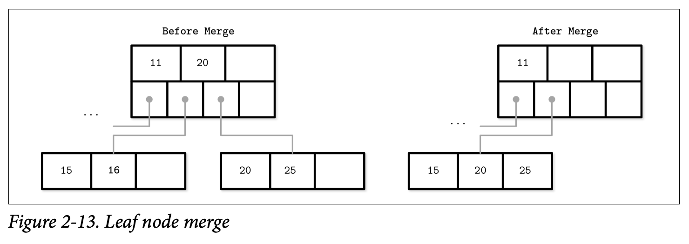

下图是由于删除了 10，两个内部节点合并。此时需要将父节点的分割点的 key 移到当前节点。

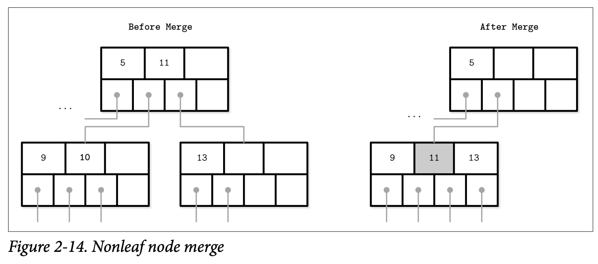
