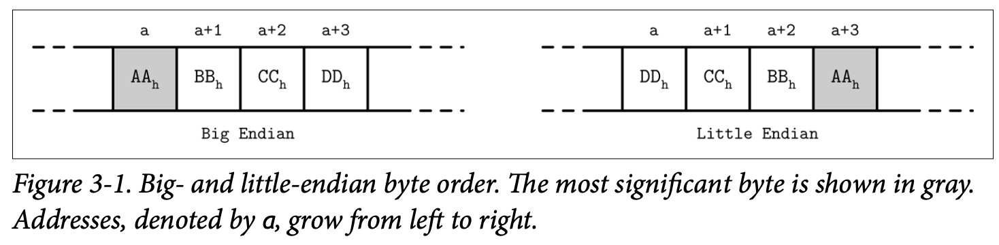
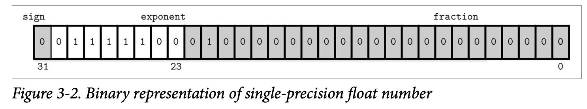
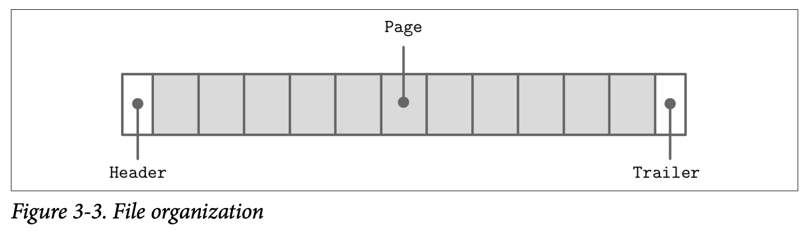
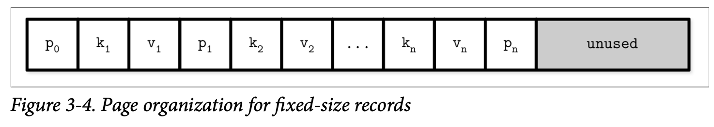
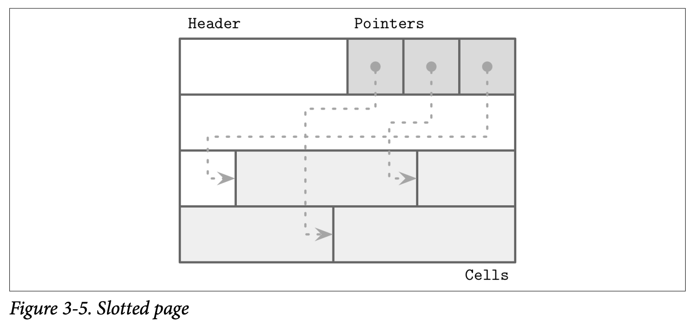
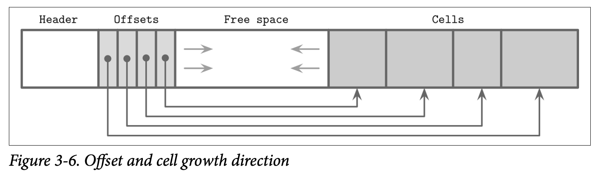
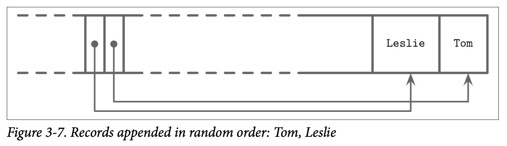
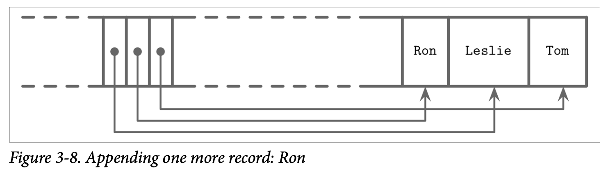
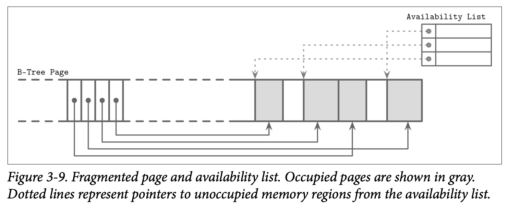

这一章讨论如何在磁盘上实现 B 树和其他数据结构。访问磁盘和访问内存有很大的不同。由于虚拟内存的存在，无需手动管理偏移。从应用开发者的角度看，访问内存近乎是透明的。访问内存使用系统调用，通常不得不指定目标文件内部的偏移量，然后将磁盘表示翻译成合适的内存表示。

这意味着设计高效的磁盘结构的时候必须考虑这一点。为此，我们需要设计易于构造、修改和解释的文件格式。这一章会讨论通用的原则和实践来设计各种磁盘数据结构，不仅仅是 B 树。

有很多可能的 B 树实现，这里讨论一些有用的技术。实现细节可能相当不同，但是通用原理是一样的。理解 B 树的基本机制，比如分裂、合并是必要的，但是对于实现还不够。有许多事情对最终结果而言都很有用。

磁盘上指针的语义与内存的语义不同。因此将磁盘上的 B 树视为页面管理对理解很有帮助，算法负责组织和导航页面。页面和指向它们的指针必须计算好并放到相应位置。

B 树最复杂的部分是可变性，因此会讨论适用于可变数据结构的概念细节，比如页面布局、分裂、重定位等。后续讨论 LSM 树的时候，聚焦于排序和维护，因为这两点是 LSM 最复杂的部分。

## Motivation
创建一个文件格式和使用无托管内存模型的编程语言有很多类似的地方。我们分配一大块数据，并且按照需要切分，如果要引用大块内存或者有变长数据的结构，使用指针。采用无托管内存模型的语言可以在需要的申请更多的内存，无需考虑是否有连续分段可用，无需考虑碎片，无需考虑释放之后会发生什么。在磁盘上，我们需要自己关心垃圾回收和碎片。

磁盘上的数据结构的布局比内存中的数据布局更重要。对于高效存放在磁盘上的数据结构，需要能够快速访问，还需要考虑存储介质，设计二进制数据格式，设计高效的序列化和序列化的方式。

使用过 C 语言这种低级语言且不使用任何附加类库的人都知道这些限制。结构体大小是预定义的，需要显式分配和释放。手动实现内存分配和跟踪的挑战就更大了，这是因为只能操作预先定义大小的数据段，并且要跟踪哪些段已经释放了，哪些段还在使用。

当数据在内存中的时候，大部分内存布局的问题都不存在，或者容易解决，或者可以用第三方库解决。比如使用变长字段或过大的数据，直接分配内存使用指针即可。仍然有一些情况开发人员需要设计内存数据布局，这是为了利用 CPU cache line，预取或者其他硬件特性，主要目的是性能优化。

即便操作系统和文件系统已经承担了一些职责，实现存放在磁盘的数据结构仍然需要关注很多细节和陷阱。

## Binary Encoding
为了高效的将数据存储在磁盘上，需要使用紧凑且易于序列化和反序列化的格式进行编码。当讨论二进制格式的时候，常常会用到布局（`layout`）这个词。由于没有 `malloc` 和 `free` 而是 `read` `write`，因此需要以不同的方式来思考、准备数据。这里讨论创建高效页面布局的主要原理，这些原理可以用于其他场景，比如创建文件、序列化格式、通信协议。

在组织数据存到页中，需要理解如何表示 key 和 value，如何组合得到更复杂的数据结构，如何实现变长类型和数组。

### Primitive Types
key 和 value 都有类型，比如 `integer` `date` `string`，能够表示成二进制格式。

大部分数值类型都是固定长度的。当使用多个字节的数时，字节序（`byte-order`）很重要。字节序分为两种

* 大端（`big-endian`），以最高有效字节开始，即最高有效字节地址最大。
* 小端（`little-endian`），以最低有效字节开始。



数据记录包含数值、字符串、布尔类型及其组合。不过当在磁盘上存储或者通过网络传输的时候，只能使用字节流。这就是说，为了发送或者写记录，必须进行序列化（`serialize`），在接受或者读取后，必须反序列化（`deserialize`）才能使用。

这里从原始类型开始，这些是构造更复杂类型的基石。不同的数值类型有不同的长度。一般地，`byte` 八个比特，`short` 十六个比特，`int` 4 字节，`long` 8 字节。IEEE 754 规定了浮点数标准，`float` 32 比特，`double` 是双精度的，64 比特。下图是一个 `float` 类型数，表示浮点数 0.15625。大部分时候，只能近似表示。



### Strings and Variable-Size Data
原始数值类型有固定长度。组合成更复杂的值类似于 C 语言中的 `struct`。字符串或者其他变长数据类型（比如固定长度数据的数组）能够序列化为一个数和 `size` 大小的字节数组，第一个数表示数组或者字符串的长度，后面的字节数组放实际数据。对于字符串，这种表示方法称为 UCSD String 或 Pascal String。伪代码如下
```c
String
{
	size uint_16
	data byte[size]
}
```

另一种表示字符串的方式是使用 null 终止符，读到终止符表示字符串结束。使用 Pascal 形式的好处是常量时间就可以得到字符串长度，还可以通过切分 `byte[size]` 来构造新的字符串。

### Bit-Packed Data: Booleans, Enums, and Flags
波尔变量可以使用一个字节表示，1 代表 `true`，0 代表 `false`。不过布尔只有两种情况，使用字节表示太浪费了，通常使用 1 比特表示，1 表示 `set`，0 表示 `unset`。

枚举，可以使用整数表示用于二进制格式和通信协议。枚举通常用于低基数的值，比如 B 树节点类型可以用如下枚举表示
```c
enum NodeType
{
	ROOT,	  // 0x00h
	INTERNAL, // 0x01h
	LEAF	  // 0x02h
};
```

标记（`flag`）是布尔和枚举的结合，用于表示非互斥的一组布尔参数。比如可以使用标记标记一页是否右值，值是定长还是变长，是否有溢出页。由于每一个比特表示一个标记值，通常使用 2 的幂次作为掩码。比如
```c
int IS_LEAF_MASK = 0x01h;		  // bit #1
int VARIABLE_SIZE_VALUES = 0x02h; // bit #2
int HAS_OVERFLOW_PAGES = 0x04h;	  // bit #3
```
和布尔类似，标记使用位掩码（`bitmask`）进行位操作。使用或运算 `|` 设置掩码对应的比特，使用非 `~` 和 `&` 进行复位，使用 `&` 检查对应的比特是否为零。
```c
// Set the bit
flags |= HAS_OVERFLOW_PAGES;
flags |= (1 << 2);

// Unset the bit
flags &= ~HAS_OVERFLOW_PAGES;
flags &= ~(1 << 2);

// Test whether or not the bit is set
is_set = (flags & HAS_OVERFLOW_PAGES) != 0;
is_set = (flags & (1 << 2)) != 0;
```

## General Principles
当设计文件格式的时候，第一件事就是确定寻址方式：文件是否分成大小相同的页，页由一个或者多个连续的块表示。大多数就地更新的存储结构都使用相同大小的页，因为这些可以简化读写操作。只能追加写的存储结构也写相同大小的页，记录在内存中追加，一旦页面填满了，刷到磁盘上。

文件通常有一个固定大小的头部（`header`），有时也有固定大小的尾部（`trailer`），存放一些需要快速访问的附加信息或者是解码文件剩余部分的必要信息。文件的其他部分分成页。如下图所示。



许多数据存储都有固定的 schema，指定表的字段数量、顺序和类型。固定的 schema 有助于减少磁盘上存储的数据量。我们可以使用字段的位置标识而不必重复写入字段名。

下面是一个例子。
```
Fixed-size fields:
| (4 bytes) employee_id                 |
| (4 bytes) tax_number                  |
| (3 bytes) date                        |
| (1 byte) gender                       |
| (2 bytes) first_name_length           |
| (2 bytes) last_name_length            |

Variable-size fields:
| (first_name_length bytes) first_name  |
| (last_name_length bytes) last_name    |
```
为了访问 `first_name`，需要从固定大小趋于后面开始。为了访问 `last_name`，需要根据前一个变长数据的长度计算得到起始位置。为了避免重复计算，一般会将 `offset` 和 `length` 编码到固定大小的区域。这样，我们可以独立、直接定位到任意变长字段。

数据库文件通常包含若干个部分，头部或尾部亦或者是独立文件中包含各个部分的偏移，这样能够快速定位。

## Page Structure
数据库系统存储记录在数据和索引文件中。这些文件按照固定大小分页，页大小通常是文件系统块的整数倍，页大小一般从 4KB 到 16KB。

下面以 B 树为例。从数据结构的角度看，我们区分了叶子节点（存 key 和数据）和非叶子节点（存 key 和指向其他节点的指针）。每个节点占用一页或多页。

B 树最初的 paper 描述了一种简单的页面组织方式，仅适用于固定大小的数据记录，每一页是相邻的三元组组成的，如下图所示。



这种方式很简单，但是有一些缺陷。

* 追加的 key 除非是在最右边的位置，否则需要移动元素。
* 无法高效的管理或访问变长类型。

## Slotted Pages
当存储变长记录，主要问题是空间管理：回收已经删除记录的空间。如果想插入一条长度为 `n` 的记录到先前长度为 `m` 的记录的位置，除非恰好 `m == n`，或者找到了另一个长度为 `m - n` 的记录，否则有空仍旧未使用。如果 `m` 比 `n` 小，那么无法在此处插入数据。

为了简化空间管理，我们把页分成固定长度的段。不过仍旧会浪费一些空间。比如段的大小是 64 字节，除非记录大小是 64 的整数倍，否则会浪费 `64 - (n % 64)` 字节。

空间回收可以通过简单地重写页面完成，但是需要保留记录的偏移量，因为在页外的指针需要使用这个偏移量。当为了最小化空间浪费的时候这么做是值得的。

我们的页格式需要满足

* 最小化存储变长数据的额外开销。
* 通过移除记录可以回收空间。
* 引用页面中的记录无需考虑具体位置。

为了高效存储变长数据记录，通常使用称为 slotted page 的技术，很多数据库使用这种方式，比如 PostgreSQL。

页面组织方式是分成指针和 slot 或 cell 两个部分，位于页的两端。这意味我们仅需要修改指针指向的 cell 地址就能保持顺序，通过标记 `nullptr` 或移除指针就能删除一个记录。通常一个页包含一个固定大小的头部（`header`），记录关于页面和 cell 的信息。cell 的大小可以各异，保存 key、指针、数据记录等等。如下图所示。



这种方法很好的解决了之前讨论的需求。

* 最小化额外开销：唯一引入的额外开销是指向数据记录的实际地址的指针数组。
* 空间回收：可以通过整理碎片和重写页回收空间。
* 动态布局：页外只需要引用 slot 的 ID 即可，精确位置仅页内可见。

## Cell Layout
使用标记、枚举和原始类型，能够设计 cell 的布局，然后组成页，最后组成树。在 cell 这一层，我们需要区别只有 key 和存储 key-value 的 cell。key cell 只存储 key 和指向在两个 key 之间的页的指针。key-value cell 存 key 和数据记录。

假定页内所有的 cell 都是统一的，只能存放其中一种类型的节点。这意味着描述 cell 类型的元数据可以放到页这一层，而不是每个 cell 都重复一遍。

对于存放 key 的 cell，需要以下信息：

* cell 类型，从页元数据推断
* key 大小
* 指向子页的页 ID
* key 字节数组

变长 key cell 如下所示。
```
0                4               8
+----------------+---------------+-------------+
| [int] key_size | [int] page_id | [bytes] key |
+----------------+---------------+-------------+
```
将固定大小的数据字段分组，后跟 `key_size` 个字节。这并不是必须的，但可以简化偏移量的计算，因为所有固定大小的字段都可以使用静态的预先计算的偏移量来访问，只需要计算可变长度数据的偏移量。

key value cell 存放数据记录，和上面的布局类似。

* cell 类型，从页元数据推断
* key 大小
* value 大小
* key 字节数组
* value 字节数组

```
0              1                5                  9                    + key_size
+--------------+----------------+------------------+--------------------+----------------------+
| [byte] flags | [int] key_size | [int] value_size |    [bytes] key     | [bytes] data_record  |
+--------------+----------------+------------------+--------------------+----------------------+
```

两者存放的主要差异在于偏移量和页 ID。由于页大小是固定的并且由页管理系统管理，那么只要有了页 ID 就能计算得到在文件中的偏移量。cell 中的偏移量是页内的信息，是距离页开始的偏移，基数很低，可以用较短的长度表示。

key 和 value 都可以是变长的。可以通过固定长度的头和偏移量计算得到。对于 key，略过头部然后读 `key_size` 字节。对于 value，略过头部外加 `key_size` 个字节，然后读 `value_size` 字节。有其他方式实现，比如记录总长度和 `key_size`，通过减法得到 `value_size`。要有充分的信息切分 cell 得到各个部分就好。

## Combining Cells into Slotted Pages
我们将 cell 追加到页面的最右边，保持 cell 的偏移量/指针在页面的左边，如下图所示。



key 乱序插入，通过排序 cell 偏移量保持逻辑上有序。这个设计使得向页面追加 cell 开销最小，因为无在插入、更新和删除操作时无需移动 cell。

下面是一个具体的例子。两个名字插入到了页，插入顺序是 `Tom` `Leslie`，下图展示了它们是逻辑有序的，而插入顺序无关。cell 布局是插入顺序，但是偏移量已经重排序的，使得可以使用二分搜索。



现在要插入新的名字 `Ron`。数据追加到页的空闲区的最后，偏移量要保持逻辑有序：`Leslie` `Ron` `Tom`。此时需要重排 cell 偏移量。如下图所示。



## Managing Variable-Size Data
删除一个记录无需移动数据 cell 并且移动 cell 数据占据空间。cell 能够被标记为删除并且有一个内存中的可用列表（`availability list`）来标记空闲内存的数量和指向空闲内存的指针。当插入一个新的 cell，首先检查可用列表中是否能够找到一个段来存放要插入的 cell，如下图所示。



SQLite 成未占用的段为 `freeblock`，并且在页头存储第一个 `freeblock` 指针。同时存储页内可用字节的总数，这样可以快速检查当前页是否能放下要存储的 cell。

分配可用空间有两种策略：首次匹配和最佳匹配。

如果找不到可用的连续空间但是有足够的碎片可用，那么可以重写有效 cell 进行碎片整理，然后使用连续空间写入 cell。如果整理碎片后还是没有足够的空间，需要使用溢出页，后续会讨论。

为了提高局部性，一些实现会分别存储 key 和 value。将 key 放到一起提升了查询时的局部性。在搜索到 key 后，通过 index 可以找到对应的 value。对于变长 key，需要计算和存储 value 的 cell 指针。

## Versioning
数据库会持续演进，开发者添加新的功能、修复 bug、提升性能。因此二进制文件格式可能会改变。存储引擎版本支持多个序列化格式。为了支持这一点，需要有能力知道文件对应的版本。

有很多方式可以做到这一点。比如 Apache Cassandra 使用版本号来作为文件名的前缀，这样无需打开文件就可以知道版本号。比如 4.0 的文件使用 `na` 前缀，更旧的文件，比如 3.0 文件使用 `ma` 前缀。也可以存到一个分离的文件，比如 PostgreSQL 把版本放到 PG_VERSION 文件中。版本信息页可以直接存储到文件头部。这种情况下，头部中有一个部分编码了版本信息。一旦知道了文件的版本，那么可以创建一个指定版本的 reader 来解释其内容。一些文件格式使用 magic number 来表示版本。

## Checksumming
磁盘上的文件可能会由于软件 bug 或者硬件问题而遭到破坏。为了早点识别这个问题避免其传播损坏的数据到其他子系统或者节点，可以使用校验和和 CRC（`cyclic redundancy checks`）。

很多地方不区分加密和非加密哈希函数。虽然他们的共同点是将一段数据摘要成一个数或若干个字节，但是它们的用途、目的还是不同的。

校验和仅能提供最弱的保证，不能检查多个出错的 bit。通常使用异或计算来校验奇偶性或和。CRC 可以检查到更复杂的错误。这个能力很重要，因为通信和存储中很大一部分故障都是通过这种方式表现出来的。

非加密哈希，CRC 这些不能验证数据是否被蓄意篡改。此时需要使用强的加密哈希算法来保证。CRC 的目的是确保没有无意或意外被修改的情况。这些算法的设计不是为了防御攻击和有意篡改。

在往磁盘写数据之前，计算校验和，然后和数据一起写下去。当读回数据的时候，再次计算校验和并与写下去的值进行比较。如果校验和不匹配，那么知道读取的数据损坏了。由于对整个文件计算校验和不太实际，我们也不会每次都读取整个文件的内容，因此校验和通常在页这个基本。如果单页数据被破坏，无需丢弃整个文件的数据。
