上一章我们讨论了设计二进制格式的一般性原则，可以用于就地更新和仅能追加的数据结构。这一章讨论一些仅适用于 B 树的概念。

首先讨论如何建立 key 和指针之间的关系、如何实现头部以及如何将页链接起来。接下来会讨论从根节点到叶节点的遍历，如何执行二叉搜索，如何在分裂和合并节点时跟踪父节点的变化。最后讨论一些优化技术，垃圾回收等。

## Page Header
页的头部会维护一些易于定位、维护和优化的信息。通常包含描述页内容和布局的标志信息，cell 数量，空闲空间的偏移量，其他有用的元信息。比如 PostgreSQL 存储了页的大小和布局版本。MySQL InnoDB 中存储了数据记录的数量，层级和其他一些实现相关的值。SQLite 中，头部存储了 cell 的数量和最优的指针。

### Magic Numbers
文件或者页的头部经常会放一个 magic number，通常是多个字节的常量，表示一个页、标识符、版本等其他信息。magic number 用于验证。

### Sibling Links
一些实现存储了指向左右兄弟节点的指针。这些指针可以帮助我们直接找到兄弟节点而无需回到父节点。但是会增加分裂和合并操作的复杂度，因为兄弟偏移量也需要修改。比如一个非最右节点分裂了，那么右边兄弟节点的指向左边兄弟节点的指针需要指向新创建的节点。在发生分裂和合并时，兄弟节点需要更新，那么需要额外的锁。

下图是两种实现的对比。

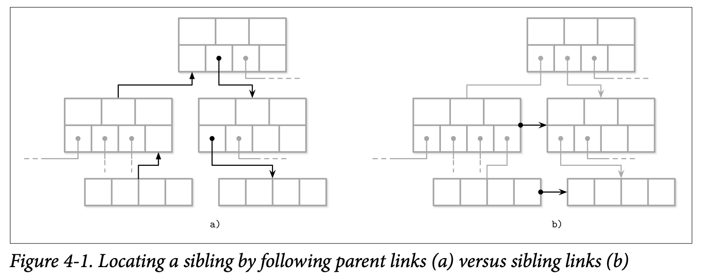

### Rightmost Pointers
B 树的分割 key 用于找到子树，因此指针数量比 key 的数量多一个。在许多实现中，节点看起来更像是下面的布局。每一个分割 key 有一个指针，最后一个指针单独存储，并没有 key 与之配对。

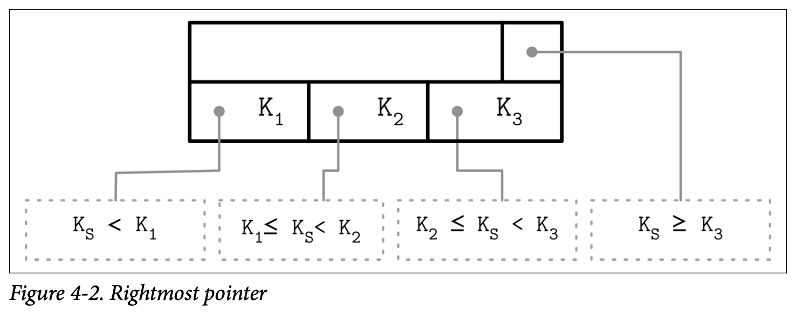

这个额外的指针可以存储在页的头部，比如 SQLite 就是这么做的。

如果最右的孩子节点分裂，那么有一个新的 cell 要添加到父节点，那么最右指针需要更新。如下图所示。灰色的 cell 是新加的，指向分裂的节点，最右节点的指针更新为新加的最右的孩子节点。

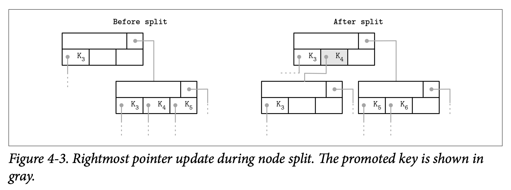

### Node High Keys
可以换一种方法来存储最右指针，节点称为 high key，表示子树最大的值。这种方法被 PostgreSQL 使用，称为 B-link 树。

B 树有 $N$ 个 key 和 $N+1$ 个指针，每个子树的 key 的范围受限于 $K_{i-1}\leq K_s<K_i$，$K_0=-\infty$ 是隐含信息。

B-link 树增加一个额外的 key $K_{N+1}$，表示指针 $P_N$ 指向的子树存储的 key 的上界。这样指针和 key 成对出现，简化实现，无需考虑部分边界情况。下面是两种存储方式的对比图。

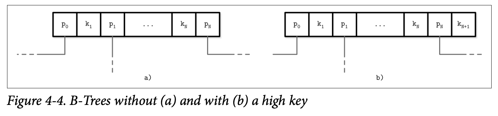

下图表示 key 和指针对应的区间。

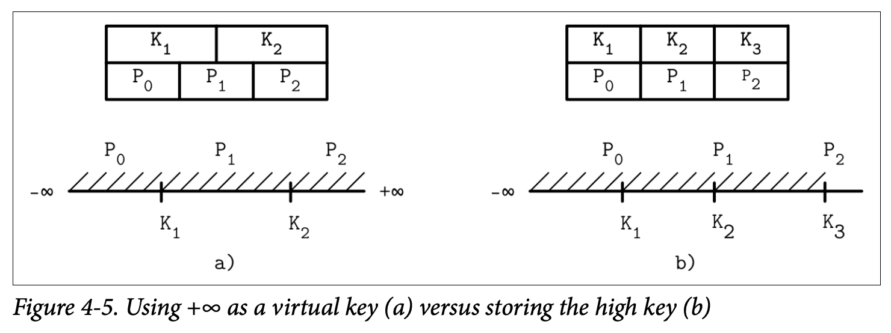

### Overflow Pages
节点大小和树的删除是固定的，不会动态变化。但是很难找到一个普遍的最优值：如果 value 的大小很大，那么一个页只能保存很少的记录。如果 value 很小，那么会浪费预留空间。

B 树算法要求每个节点保持一定数量的项，由于一些 value 有不同的大小，最终会出现这种一种情况，节点还没有满，但是固定页上没有足够的空闲空间了。重新分配更大的页需要拷贝数据，不太实际，需要有其他方法来扩展页大小。

可以将多个页链接起来组成更大的页。链接扩展的页称为 overflow 页，原始页称为主页（`primary page`）。

大部分 B 树的实现存储是存储复杂的固定大小到当前页，其余分布 spill 到 overflow 页。这个固定大小可以通过节点大小除以扇出个数得到。这个值定义为 `max_payload_size`。当插入的时候，如果 value 大于这个值，节点检查是否有链接的 overflow 页，如果存在并且有足够的空间，额外的数据存放到这里，否则分配一个 overflow 页。

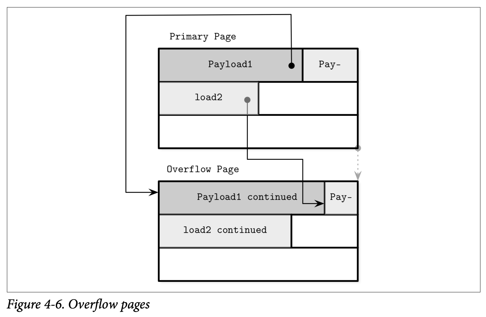

由于和主页一样，overflow 页记录也会有碎片，因此需要记录额外的信息，使得我们可以重新回收空间来写新数据或者在需要的时候废弃整个 overflow 页。当分配 overflow 页时，将页 ID 存储在主页的 header 中。如果一个 overflow 页不够，下一个 overflow 页的 ID 写在前一个页的 header 中。有时可能需要遍历多个页也能找到 spill 的部分。由于 key 往往基数比较高，那么存储 key 的一部分很有意义，大部分比较都仅需比较放在主页中被阶段的部分接口。对于数据记录，需要找到 overflow 页，然后将数据返回给用户。不过这是一个低频操作，问题不大。如果所有的记录大小的过大，那么考虑块存储。

## Binary Search
二分查找仅对有序数据有效，因此需要保持数据有序。如果查找成功返回整数，表示搜索 key 在数组中的位置，如果找不到，返回负数，其绝对值是插入点（`insertion point`）。插入点是一个大约给定 key 的元素所在的位置。将后面的元素向后移动一位，然后插入数据。很多高级搜索的结果是一个返回，因为搜索的方向很重要，找到第一个大于给定 key 的之后，根据相应的链接进入子树。

### Binary Search with Indirection Pointers
B 树数据是按照插入的顺序保存的，只有其指针（偏移量）是逻辑有序的，因此执行二分查找是找到中间的偏移量，对比指向的 key 和给定要查找的 key 的关系，然后决定是向左还是向右继续搜索。

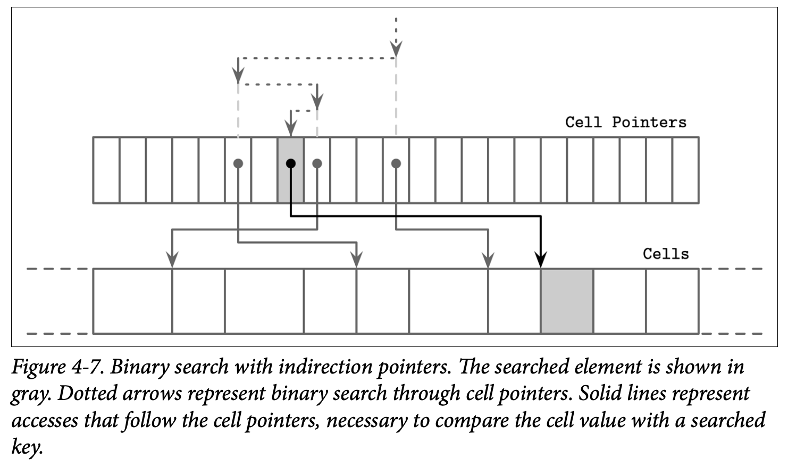

## Propagating Splits and Merges
B 树分裂和合并会传导到父节点，因此需要有能力遍历到父节点。因此通常 B 树节点包含指向父节点的指针。不过低层节点是被高层节点所引用，因此持久在磁盘上的时候无需保存指向父节点的指针。类似于兄弟节点，当父节点更新时也需要更新指向父节点的指针，即当父节点分裂或者合并的时候。一些实现为了避免死锁，使用父节点来遍历到兄弟节点。为了找到兄弟节点，向上寻找父节点然后再回到子节点。

### Breadcrumbs
除了存储和维护父节点指针之外，还可以记录从根到叶子节点遍历的顺序，那么这个顺序的逆序就是分裂和合并叶子节点时向上传导的顺序。

插入和删除可能会改变 B 树的结构，从根开始遍历到叶子节点，记录目标节点和插入点。由于到叶子节点之前，无法确定操作是否会导致分裂或合并，因此不得不收集信息，这些信息称为 breadcrumb。使用栈来存储 breadcrumb 信息是很自然的选择。如果节点分裂或合并，breadcrumb 用于查找到父节点并且知道插入点。这个栈保存在内存即可。下图是一个示例。如果目标节点分裂，栈弹出父节点，如果父节点有足够空间，根据 breadcrumb 记录的插入点插入新的 cell 即可；否则分裂父节点。递归地从栈里弹出更高层的父节点，重复上述操作。

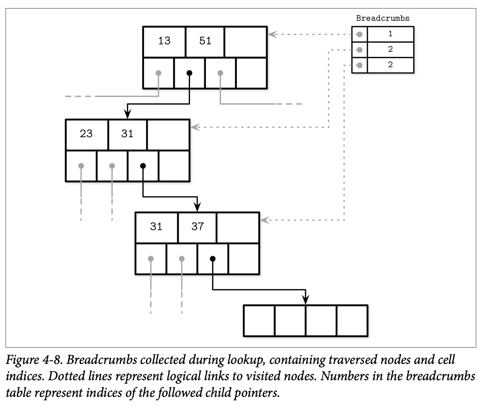

## Rebalancing
一些 B 树实现会尝试延迟分裂和合并操作，以此分摊开销，具体的方法是重新平衡元素，在最终执行分裂和合并操作前，将元素从占用率高的节点移动到占用率低的节点。这可以提升节点的占用率并且能够减少树的层级，不过重新平衡的开销会比较高。

负载平衡会在插入和删除的时候执行。为了提高空间利用率，不要分裂节点，而是将一些元素移到兄弟节点，这样就有空间可以插入数据了。类似的，删除的时候，不要合并兄弟节点，从兄弟节点移动一些元素过来保证当前节点至少有一半的占用率。

B* 树就是这样分布数据的，直到临近的兄弟节点都满了。这里不要将一个满的节点分裂成两个半满的节点，而是将两个节点分裂成三个，每一个占用率是三分之二。SQLite 使用了这种变种实现。延迟分裂提高了平均占用率，不过需要附加信息和额外的平衡逻辑。更高的利用率意味着更有效的搜索，因为树的高度更低，遍历的页更少。

下图展示了上述的过程。元素从一个节点转移到另一个节点。由于重新平衡改变了兄弟节点的最大值和最小值，因此需要更新父节点的分割 key。

重新平衡是很有用的技术，被用于很多数据库，但是它增加了代码的复杂度，但是它是孤立的，因此可以当做一个优化点后续再实现。

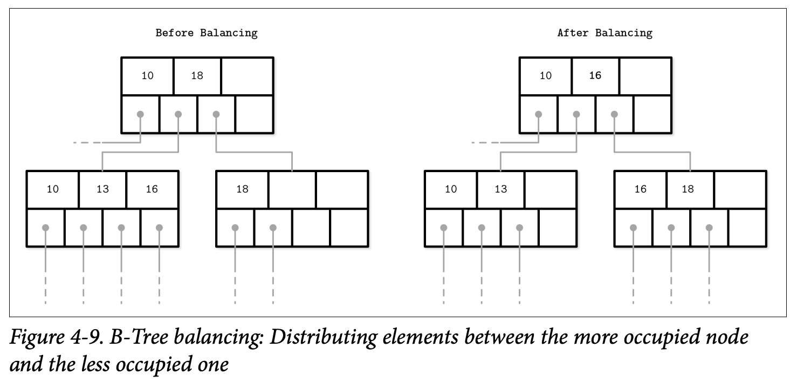

## Right-Only Appends
许多数据库使用单调递增的值作为主键。这就留有优化空间，因为所有的插入操作都作用于最右边的子树。此外，由于 key 单调递增，而插入操作相较于更新和删除较少，因此非叶子页的碎片化比随机排序的 key 更低。

PostgreSQL 将这称为 `fastpath`。如果插入的 key 比最右边的叶子节点的第一个 key 要大，并且最右边的节点有足够的空间，那么直接插到合适位置即可。最右节点被缓存了，因此可以略过从根遍历的过程。

SQLite 有类似的概念，称为 `quickbalance`。当数据要被插入到最右节点并且页已经满了，不分裂当前页，而是构造一个新的页将数据插入，更新指针到父节点。这个页近乎是一个空页，但是很快就可能会被填满。

### Bulk Loading
如果数据已经有序并且需要批量加载，或者是重新构建 B 树（比如整理碎片），可以利用上述的想法，甚至可以做的更好。

批量加载场景，我们可以避免分裂和合并，而是从底部开始构建 B 树，逐层写，或者一旦有了足够的底层节点指针之后理解写高层节点。数据已经有序了，按页写数据，一旦一个页写完了，将第一个 key 提升到父节点。由于自底向上构建，在高层的页构建完成之间，一旦一个页处理完就可以刷出去。这样无需对磁盘上的页进行分裂或合并操作，同时仅需要保存最少的树的节点在内存中。

不可更新的 B 树也是这样构建的，不过和可更新的 B 树不同，没有留下任何空间来进行后续的更新操作。所有的页都是满的，这样性能更好。

## Compression
存储原始的未压缩数据开销会很大，很多数据库提供多种压缩方法来减少空间。这里有一个折中：压缩率高节省存储，以此访问能够获取更多数据，但是需要更多的内存和 CPU 压缩和解压。

可以在不同粒度上对数据进行压缩。对整个文件进行压缩可以得到很高的压缩率，但是不得不解压整个文件才能访问或者更新，不切实际。同样，压缩整个索引文件也是不实际的。

按页压缩是一个选择。到目前为止我们讨论的都是固定大小的页，这些页可以独立的压缩和解压缩，与加载和落盘解耦。不过，压缩的页只会占磁盘块的一部分，而读取的最小单元是磁盘的块，这会导致读取不必要的数据。下图中（a）小于块大小，当读取的时候会读取其他页的部分信息，（b）扩过两个块，也不得不多读取一个块。

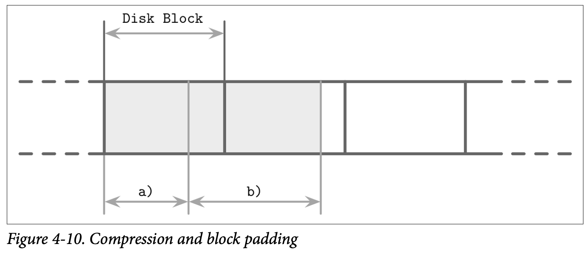

另一个方法是仅仅压缩数据，按行或者按列压缩。这种情况下页管理和压缩解耦开了。

大部分数据库都提供了可插拔的压缩类库。不同压缩算法对不同数据集有不同表现，这超出了本书的讨论。一般而言，压缩的选择聚焦于四个方面：内存开销、压缩性能、解压性能和压缩率。

## Vacuum and Maintenance
除了查询之外，同时需要维护存储的完整性，回收空间，减少额外开销，对页排序。这些操作都在后台进行，节省时间，避免在插入、更新或删除时付出清理的成本。

slotted 页需要维护保持良好的状态。比如一系列分裂和合并操作之后，或者叶子节点各种插入、更新、删除之后，碎片化了，结果就是逻辑上有足够的空间，但是没有足够的连续空间。下图就是个例子。

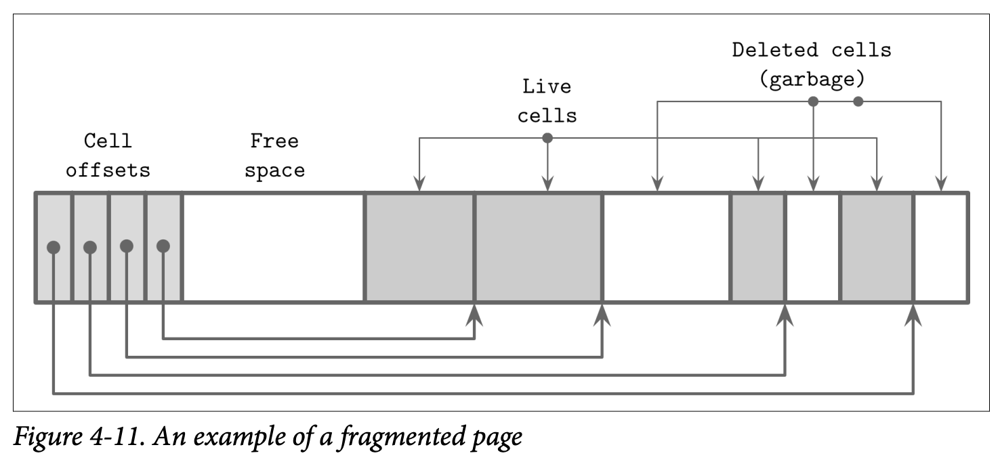

B 树从根节点开始寻址，如果能达到，那么记录是有效的，否则就是垃圾。上图中有指针指向的记录是有效的，其他的是垃圾，需要被回收。垃圾通常由于性能原因不会填充为零，未来这些空间会被覆盖。

### Fragmentation Caused by Updates and Deletes
下面考虑什么情况下页不可寻址需要精简（`compact`）。在叶子节点，删除操作仅仅会删除 cell 的偏移量，cell 自身完整无缺。但是删除操作之后，cell 就不能寻址了，其内容不会出现在查询结果中，使其为 null 或者移动邻接 cell 都是不必要的。当页面分裂时，只会裁剪偏移量，对应的 cell 将无法寻址，这些地方可以被写入新数据，或者是 vacuum 时被回收。

一些数据库依赖于垃圾收回，删除或更新的 cell 空间被用于 MVCC。对于并发执行的事务，这些 cell 能够被访问，当这些事务结束，不再需要访问可以被回收。一些数据库会维护用于跟踪幽灵记录（`ghost`）的数据结构，这些数据会在所有可能已访问它们的事务完成后立即被收集。

删除操作只会移动偏移量而不会重新回收 cell 自身的空间，因此空闲的空间四散在页内，这称为碎片（`fragmented`）。对于写而言，需要连续的空间来放数据，为了让空闲碎片放到一些，必须重写整个页。插入操作使得 cell 是插入顺序，这不会有很大的影响，不过按照逻辑排序有助于顺序读。更新操作在叶子节点，内部节点仅仅为了找到子树。更新操作基于 key 来操作，除了创建 overflow 页，不会改变树的结构。不过在叶子节点，更新操作不会改变 cell 的顺序避免重写整个页。这意味着多个版本的 cell，只有一个能够寻址到。

### Page Defragmentation
回收空间和重写页的过程称为精简（`compact`）、`vacuum` 或者是维护（`maintenance`）。如果页没有足够的物理空间，重写页可以同步做，不过大部分的精简是一个异步过程，进行垃圾回收、重写内容。这个过程回收不可寻址的 cell 的空间，按照逻辑序重写 cell。一个页重写之后，可能重定向到了文件中的一个新位置。内存中不用的页变得可用，回到页缓存中。磁盘上新的可用的页的 ID 需要加到空闲列表中（`free page list`）。这些信息要持久化以防节点崩溃或重启的时候不会导致空闲空间泄露。
