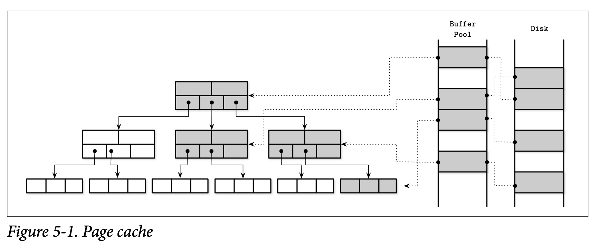
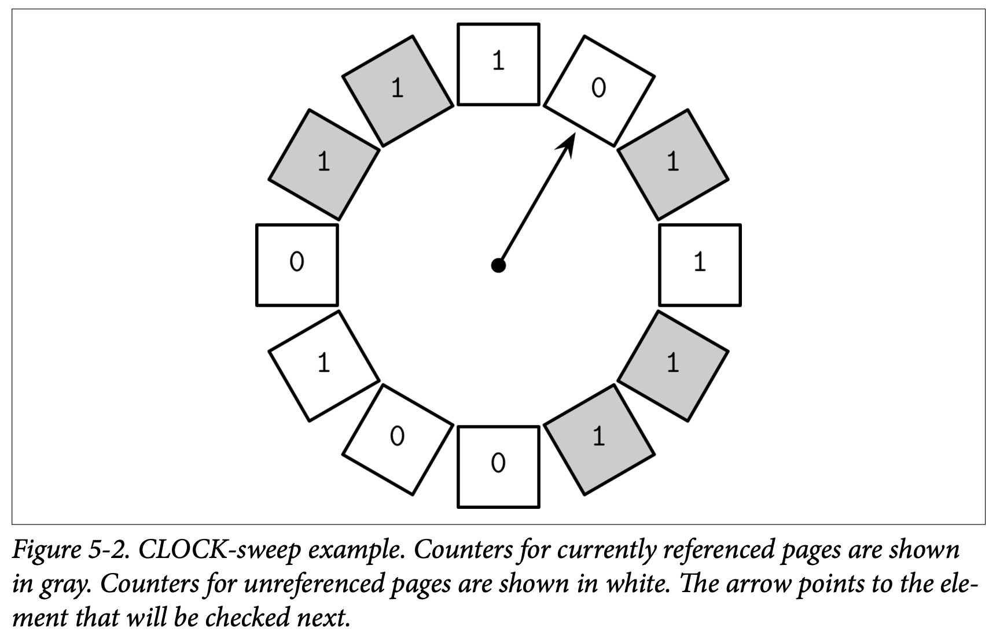
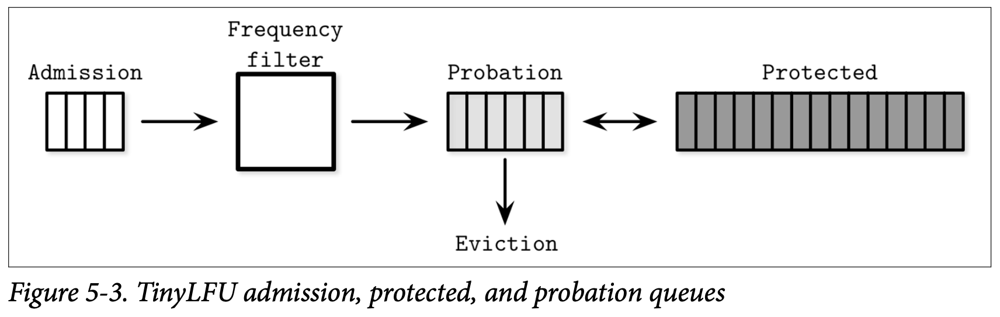

本章讨论缓冲区管理、锁管理和恢复等组件，这是理解数据库事务的前提。

事务（`transaction`）是数据库中不可再分的逻辑单元，将多个操作看作是一个，事务可以包含读写操作。数据库事务满足原子性（`atomicity`）、一致性（`consistency`）、隔离性（`isolation`）、持久性（`durability`），通常简称为 ACID。

原子性：事务的步骤不可再分（`indivisible`），这些步骤要么全部成功，要么都不执行，也就是说不会有部分修改。每个事务要么成功提交（`commit`）要么中止（`abort`）。提交是最后一个操作，中止之后可以重试该事物。

一致性：一致性是具体应用的保证，事务将数据库从一个合法状态转移到另一个合法状态，维护数据库的不变性。一致性是最弱的属性，因为由用户控制而不仅仅由数据库控制。

隔离性：多个事务同时运行，要保证不收其他事务的干扰，好像同一个时间只有一个事务在执行。隔离性定理了在何时修改会变得可见，哪些变化对其他并发的事务可见。许多数据库使用更弱的隔离级别以获得更好性能。根据并发控制实现不同，一个事务可能对其他事务也可见，可能也不可见。

持久性：一旦事务提交，数据库的状态必须持久化到磁盘，后续停电、系统崩溃等都不会影响数据安全。

实现事务，除了在磁盘上组织和存放存储结构之外，还需要其他组件的配合。节点内，事务管理器（`transaction manager`）负责协调、调度跟踪事务的各个操作。

锁管理器（`lock manager`）保护资源，保护并发访问不会破坏数据完整性。当一个锁被请求时，锁管理器检查是否有其他事务已经持有了锁，是共享锁还是互斥锁，如果请求级别没有冲突，那么授权访问。由于互斥锁最多只能有一个事务持有，其他事务必须等待释放，否则可以选择中止或稍后重试。一旦锁释放或者事务终止，锁管理器通知等待中的事务，让其获得锁继续执行。

页缓存（`page cache`）是持久化的磁盘和存储引擎其他组件的中介。它将状态更改暂存在内存中，同时也用于缓存那些尚未持久化的页。数据库的更改首先会作用于缓存的页。

日志管理器（`log manager`）记录了已经用于缓存的页但是还没有持久化存储的操作的历史，确保这些更改不会丢失。在启动时，日志用于重放这些操作、重新构造缓存状态。日志还可以用于撤销中止事务的更改。

分布式事务需要更多的协调工作和远程执行，第二部分会讨论。

## Buffer Management
大部分数据库采用两层存储层次：较慢的持久化存储磁盘和较快的内存。为了减少访问持久化村村的次数，页缓存在内存中。当存储引擎再次访问页的时候，直接返回缓存的页。

在内存中的缓存页可用的一个假设是没有其他进程修改磁盘上的文件。这种方法有时也称为虚拟磁盘（`virtual disk`）。只有当页在内存中不存在时才会访问磁盘。更常见的用于是页缓存（`page cache`）或缓冲池（`buffer pool`）。页缓存负责缓存从磁盘上读取的页。当数据库崩溃时，缓存的内容会丢失。

由于页缓存这个术语能够更好的表达目的，后续使用该术语。缓冲池听起来主要目的是一个池子来重用空的缓冲区而不是共享数据，它是页缓存的一部分甚至是一个独立的组件，但是不能反映出这里想要表达的目的。

除了数据库之外，操作系统也会使用缓存页技术。操作系统利用未使用的内存来缓存磁盘内容来提升 I/O 性能。

从磁盘加载未缓冲的页称为换入（`page in`），如果缓存页被修改了，那么称为脏页（`dirty`），直到其被刷（`flush`）到磁盘。

由于内存中只能缓存整个数据集很小的一部分，页缓存终会被填满，为了能够缓存新的页，已经被缓存的页需要被换出（`evict`）。

下图是 B 树逻辑表示与缓存页、磁盘页的关系。页缓存加载页的顺序可能是乱序，内存中的页和磁盘上的页并没有直接映射关系。

页缓存的主要功能有：

* 在内存中保留被缓存的页
* 将对磁盘的页缓冲起来，修改应用于缓存
* 如果请求的页不在内存并且有空间可用，那么将页换入并返回缓存版本
* 如果请求的页已经被缓存了，直接返回缓存版本
* 如果没有空间可用，某个页会被换出，如果是脏页需要写回磁盘

很多数据库打开文件的时候使用 `O_DIRECT` 来绕过操作系统的 I/O 的页缓存，直接访问磁盘，使用数据库自己的缓存管理机制。

Linus Torvalds 批评过 `O_DIRECT` 的使用，因为它不是异步的，没有预读或其他方法来通知操作系统内核访问模式。不过，在操作系统提供更好的机制之前，`O_DIRECT` 还是很有用的。

通过 `fadvise` 可以获得一些控制权来决定内核如何换出页，但是这仅仅是建议内核这么做而不能确保这一定会发生。为了执行 I/O 时避免系统调用，可以使用内存映射，但是这会失去对缓存的控制。

### Caching Semantics
所有的修改缓冲在内存，最终会写回磁盘。由于没有其他进程修改文件，这个同步是单向的：从内存写到磁盘，而不会有反方向操作。页缓存使得数据库对内存管理和磁盘访问有更多的控制。这可以看作是操作系统内核页缓存机制在应用层的等价实现，直接访问块设备，实现类似的功能，达成类似的目的。抽象磁盘访问解耦了逻辑写和物理写。

缓存页使得可以保存部分树结构在内存而无需修改算法或者在内存中物化对象。唯一需要做的事情是用访问页缓存代替访问磁盘。

当存储引擎访问页时，首先检查是否已经缓存了，如果是的话返回缓存的页。如果还没有缓存，那么缓存将逻辑页地址或页号转化成物理地址，加载到内存中，返回缓存的页给存储引擎。一旦返回，缓存页被标记为被引用，存储引擎用完之后归还给页缓存或者解除引用。通过固定（`pin`）可以防止页缓存换出。

如果一个页被修改，被标记为脏页。脏页内容与磁盘不同步，需要刷盘持久化。

### Cache Eviction
保持缓存的好处是可以支持更多的读操作而无需访问存储，对同一个页的写操作会被缓冲到一起。不过页缓存大小有限制，终会有需要将旧页换出的时候。如果页的内容和磁盘同步，比如已经刷盘或者未被修改，并且页没有被引用或者固定，那么可以立即被换出。脏页需要刷盘之后再被换出。引用页不能换出，因为有其他线程在使用。

如果每次换出的时候触发刷盘会导致性能很差，一些数据库有一个后台进程周期性的将可能换出的脏页刷盘。

另一个重要属性是持久性。如果数据库崩溃，没有刷盘的数据会丢失。为了确保所有更新都持久化，刷盘是通过检查点（`checkpoint`）进程来调度。检查点控制 WAL 和页缓存，确保正常工作。一旦相关的修改已经刷盘，相关日志可以从 WAL 中消除。一旦进程完成，脏页就能被换出了。

这意味着需要在下面几个目标中折中

1. 推迟刷盘减少磁盘访问次数
2. 立即刷盘使之可以快速换出
3. 选择要换出的页，然后以最优顺序刷盘
4. 将缓存保持在内存大小之内
5. 避免没有持久化的数据丢失

下面讨论几种技术，改善前面三个特性的同时保持后面两个特性。

### Locking Pages in Cache
每次读写都访问磁盘 I/O 是不现实的，并发的读和写可能请求的是同一个页。B 树上面比较窄，大部分读都会访问高层次的节点。分裂和合并最终也会传递到高层次的节点。这意味着树的这一部分被缓存收益很大。

我们可以固定（`pin`）这些被高频使用的页。固定的页常驻内存，减少对磁盘的访问提升性能。

B 树低层次的节点指数级增长，高层次节点只占树一小部分，这一纷纷常驻内存，其他部分按需缓存。这就是说，执行一个查询，并不需要访问 `h` 次磁盘，只要访问低层次的节点即可。

操作可能会导致矛盾的结构性的变化，比如多个删除操作导致合并节点，之后多个写又会导致合并，或者相反。来自不同子树的结构性变化而导致的向上传导也是类似的。这些操作缓冲在内存，减少磁盘的写并且能够平摊开销。

页缓存使得存储引擎可以更精确的控制预取和换出。可以在访问前就加载页面。比如范围扫描的时候，预取下一个页。类似的，如果后台维护进程加载某一个页，用完之后就可以换出了，因为大概率不会被查询使用。比如 Postgresql 使用一个循环缓冲区进行大规模的顺序扫描。

### Page Replacement
当缓存容量满了，还需要加载新的页，旧的页必须淘汰。如果我们换出的页很快被使用，那么不得不再加载回来，而原本这些页可以常驻内存以减少磁盘访问。我们需要一种方法来估计后续页的访问来优化这一点。

需要根据某种换出策略（`eviction policy`）或页置换策略（`page-replacement policy`）来换出页，需要找到最不可能使用到的页。当页换出之后，新的页就可以加载进来了。

高效的页缓存实现需要一个高效的页置换算法。最理想状态下需要一个水晶球预言哪一个页再也不用了，然后换出。由于请求不必满足任意模式或者分布，精确地预测非常复杂，但是只要使用正确的页置换策略就有助于减少换出次数。

似乎使用大的缓存能够减少换出的次数。不过事实并不总是这样。一个称为 Bélády 异常的困境，就是说如果置换算法不好，增加缓存的页的数量会导致换出次数增加。很快会使用的页被换出在换入，会竞争缓存的空间。因此，我们要谨慎选择算法，提升性能而不是使之变得更糟。

#### FIFO and LRU
最简单的算法是先进先出（`first in first out`, `FIFO`）。不过这种算法没有考虑页面后续的访问，在实际系统中不实用。比如 B 树的根节点和高层节点首先进入队列，根据算法会首先被淘汰，但是很明显这些页很快还会被访问。

一个自然的拓展是 LRU。按照插入顺序进队，不过被访问就会回到队尾。不过并发场景每次都要更新节点位置可能开销比较大。

还有一些 LRU 的变种。比如 2Q（`Two-Queue LRU`），维护两个队列，页先进入第一个队列，如果后续访问进入第二个队列，进而区分最近访问和经常访问。`LRU-K` 通过跟踪最近 `K` 次的访问数据来估计访问时间。

#### CLOCK
在很多场景，效率比精度更重要。CLOCK 算法变种经常视为 LRU 的替代，因为其紧凑、缓存友好、并发更友好。

CLOCK-sweep 算法将页的引用和关联的访问比特位放到一个环形缓冲区中。有些变种使用计数器替代访问位。如果一个页被访问了，那么访问位置成 1，算法一圈圈遍历环形缓冲区。

1. 如果一个页访问位是 1，但是没有被引用，访问位置成 0，然后检查下一个页面。
2. 如果访问位已经是 0，页就是换出的候选。
3. 如果页还在被引用，那么访问位不变。假定访问位不为零，因此不会换出。

使用环形缓冲的优势是时钟的指针和内容可以通过 compare-and-swap 而无需附加的锁。算法本身容易理解和实现。

LRU 并非对所有数据库都是最佳的页置换策略。有的时候考虑使用频率而不是最近的使用时间更贴近实际。对于负载很重的数据库，最近使用可能意义不大，它只表示访问顺序罢了。

#### LFU
为了改善这种情况，应该跟踪页访问事件（`page reference event`）。一个方法是跟踪最小使用频率（`least-frequently used`, `LFU`）。

TinyLFU 是一个基于频率的换出策略：根据使用频率对页排序。

由于统计所有历史开销比较大，不实际，因此TinyLFU 使用频率直方图来维护紧凑的缓存访问历史。

元素会在下面三个队列之一：

* Admission: 维护新加的元素，使用 LRU 策略。
* Probation: 持有最可能换出的元素。
* Protected: 持有会长期在队列的元素。

相比每次选择要换出的元素，这个算法考虑要保留的元素。访问频率较高的元素才能进入 Probation 队列。随着后续的访问，Probation 的元素可以进入 Protected 队列。如果 Protected 队列已经满了，必须将某个元素放回 Probation 队列。经常被访问的元素较高几率被保留，反之可能会被换出。

还有许多算法用于优化缓存换出，策略对访问延迟和执行 I/O 的次数有很大的影响，因此要慎重选择。

## Recovery
数据库构建在硬件和软件之上，这些可能会有稳定性、可靠性的问题。数据库自身也可能会有问题，因此数据库的实现需要考虑这些失败的场景，确保数据一旦写入就不会丢失。

WAL（`write-ahead log`）是一种就追加的磁盘数据结构，用于崩溃和事务恢复。页缓存使得可以将修改缓冲在内存。在缓存的数据刷盘之前， WAL 保存着操作历史。

WAL 的主要功能是

* 使得页缓存可以缓冲缓冲修改的同时保证持久性
* 持久化操作到磁盘直到缓存的副本刷到磁盘。在修改页内容之前就将日志写到磁盘上
* 使得内存中的修改在崩溃时可以丢失，可以通过日志重建

除此之外，WAL 在事务处理中也很重要。WAL 确保数据持久化到磁盘，即使崩溃了，通过重放日志能恢复未提交的数据，数据库状态可以恢复到崩溃前的状态。这一节还会介绍 ARIES（`Algorithm for Recovery and Isolation
Exploiting Semantics`），一种广泛使用的、先进的恢复算法。

PostgreSQL 用检查点确保索引和数据文件已经完全记录到了日志文件。检查点进程周期性的刷所有的脏页。同步脏页到磁盘用的是 `fsync()` 系统调用，其会清除脏页标志。如果没有刷盘那么 `fsync()` 返回一个错误。

`fsync()` 遇到了 I/O 错误没有成功刷盘也会清除脏页标记。错误只会在文件描述符 `fd` 打开时报告，`fsync()` 不会返回在文件描述符打开之前发生的错误。

由于检查点进程不会保持所有文件是打开状态，因此可能会错过错误通知。这会让检查点进程数据已经安全的刷到了磁盘上，实际上，可能没有写成功。

由于上述问题，那么有可能会导致数据丢失或数据库损坏。这些行为很难被探测，还可能会导致数据库无法恢复。触发这些问题也非常困难。当实现恢复机制的时候，我们需要额外小心，仔细考虑并测试可能的失败场景。

### Log Semantics
WAL 只能追加写并且写入的数据无法修改，因此所有的写都是顺序的。由于 WAL 不可修改且只能追加数据，reader 可以放心的读取已经写入的内容，writer 可以放心的继续追加写。

WAL 由日志组成，每一个记录有一个单调递增的 LSN（`log sequence number`）。通常，LSN 是一个内部的计数器或者是时间戳。日志不会占整个磁盘块，它们的内容缓存在日志缓冲（`log buffer`）中，然后强制（`force`）刷到磁盘。强制刷盘可能是缓冲区满了，或者事务管理器或页缓存的请求。日志刷盘按照 LSN 的顺序。

除了单独操作之外，WAL 还会保存表示事务完成的信息。一个事务要确保日志强制刷盘之后才算提交了。

为了确保系统在恢复或回滚时崩溃后能够正常工作，有些系统在撤回（`undo`）时会写补偿日志（`compensation log record`）。

WAL 通常与与主存结构耦合，当达到检查点时可以修剪（`trimming`）。日志对数据库正确性而言非常重要，需要小心使其实现正确：即使日志修剪和主存之间有一点点差异都可能会导致数据丢失。

检查点是说到某个日志点处的数据都持久化了，不再需要这部分日志了，这可以减少数据库启动的工作量。一个进程强制刷所有的脏页到磁盘称为同步检查（`sync checkpoint`），因为其完全同步了到了磁盘。

把所有内容都刷盘显然不实际，需要暂停所有的操作等待检查点结束。很多数据库实现了模糊检查点（`fuzzy checkpoint`）。这种情况下，`last_checkpoint` 指向最后一次成功的检查点。模糊检查点从特殊的 `begin_checkpoint` 开始，以 `end_checkpoint` 结束，其中包含脏页信息和事务表的内容。在所有相关的页都刷盘之前，检查点是不完整的。页是异步刷的，一旦结束，`last_checkpoint` 指向 `begin_checkpoint`，如果崩溃了，从新的检查点开始。

### Operation Versus Data Log

### Steal and Force Policies

### ARIES

## Concurrency Control

### Serializability

### Transaction Isolation

### Read and Write Anomalies

### Isolation Levels

### Optimistic Concurrency Control

### Multiversion Concurrency Control

### Pessimistic Concurrency Control

### Lock-Based Concurrency Control
