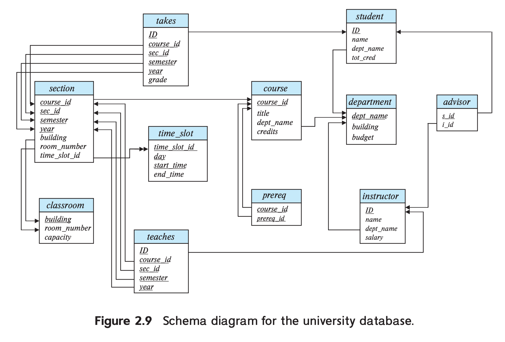

关系模型至今仍然是商业数据处理应用的主要数据模型。与早期的网状模型或层次模型等模型相比，其由于简单性而获得了主导地位，这种简单性减轻了程序员的工作负担。在过去半个多世纪里，通过不断整合新特性和新功能来保持主导地位。这些新增功能中包括对象关系特性，比如复杂数据类型和存储过程、支持 XML 数据、支持半结构化数据的各种工具。关系模型独立于任何特定的底层数据结构，这一特性使其能够经久不衰，即便是在新的数据存储方法，包括为大数据而设计的现代列存，出现之后。

本章中我们讨论关系模型的基本原理。

## Structure of Relational Databases
一个关系型数据库由一组表（`table`）组成，每个表都有一个唯一的名字。下面是具体的例子，三个表，分别是 instructor, course, prereq。

| ID | name | dept_name | salary |
|--|--|--|--|
| 10101 | Srinivasan | Comp. Sci. | 65000 |
| 12121 | Wu | Finance | 90000 |
| 15151 | Mozart | Music | 40000 |
| 22222 | Einstein | Physics | 95000 |
| 32343 | El Said | History | 60000 |
| 33456 | Gold | Physics | 87000 |
| 45565 | Katz | Comp. Sci. | 75000 |
| 58583 | Califieri | History | 62000 |
| 76543 | Singh | Finance | 80000 |
| 76766 | Crick | Biology | 72000 |
| 83821 | Brandt | Comp. Sci. | 92000 |
| 98345 | Kim | Elec. Eng. | 80000 |

| course_id | title | dept_name | credits |
|--|--|--|--|
| BIO-101 | Intro. to Biology | Biology | 4 |
| BIO-301 | Genetics | Biology | 4 |
| BIO-399 | Computational Biology | Biology | 3 |
| CS-101 | Intro. to Computer Science | Comp. Sci. | 4 |
| CS-190 | Game Design | Comp. Sci. | 4 |
| CS-315 | Robotics | Comp. Sci. | 3 |
| CS-319 | Image Processing | Comp. Sci. | 3 |
| CS-347 | Database System Concepts | Comp. Sci. | 3 |
| EE-181 | Intro. to Digital Systems | Elec. Eng. | 3 |
| FIN-201 | Investment Banking | Finance | 3 |
| HIS-351 | World History | History | 3 |
| MU-199 | Music Video Production | Music | 3 |
| PHY-101 | Physical Principles | Physics | 4 |

| course_id | prereq_id |
|--|--|
| BIO-301 | BIO-101 |
| BIO-399 | BIO-101 |
| CS-190 | CS-101 |
| CS-315 | CS-101 |
| CS-319 | CS-101 |
| CS-347 | CS-101 |
| EE-181 | PHY-101 |

prereq 表的每行描述了一个课程是另一个课程的前置课程的关系。instructor 表的每行表示一个指定的 ID 与 name, dept_name, salary 之间的关系。

一般来说，表中的一行表示一组值之间的一种关系（`relationship`）。由于表表示这些关系的集合，因此表（`table`）与数学概念关系（`relation`）有对应关系，关系型数据模型也因此得名。数学术语中，元组（`tuple`）是一系列值，即值的列表，对应表的一行。术语属性（`attribute`）对应着一行的一列。使用术语关系实例（`relation instance`）指一个关系的特定实例，即包含一组特定的行的集合。比如上面的三个实例。

关系中元组的顺序不重要，因为关系是元组的集合（`set`）。

对于一个关系中的每一个属性，有一个可能取值的集合，这个集合称为域（`domain`）或者定义域。比如 instructor 关系中 salary 属性的域是所有可能的薪水的值的集合。

我们要求对于所有关系 `r` 的所有属性的域都必须是原子的（`atomic`）。如果一个域的元素被认为是不可再分的单元，那么这个域是原子的。假定 instructor 表有一个 phone_number 属性，它可以存储一组电话号码，那么就不是原子的，因为一个元素（一组电话号码）自身还包含子部分，即列表中各个独立的电话号码。

事情的关键不是域本身是什么，而是我们怎么使用域中的元素。假定现在 phone_number 属性存的是一个单独的电话号码，但是如果查询中要将 phone_number 拆成国家代码、区号和本地号码三个部分，那么应该将其视为非原子的。反之，每个号码是一个不可再分的单元，那么 phone_number 属性的域就是原子的。

null 值（`null value`）是一个特殊值，表示未知或者不存在的情况。稍后会看到 null 值使得访问或更新数据库时会遇到一些问题，如果不能为 null，要尽可能消除 null 的影响。这里先假定 null 值不存在，后续会描述 null 对不同操作的影响。

关系中如果有严格的结构，那么存储和查询都很有优势。这种严格的结构适合预先有明确定义且变化不大的应用，但是不适合数据和数据类型、结构会随时间变化的应用。现代化的企业需要在结构化数据的高效率和预定义结构带来限制之间取得平衡。

## Database Schema
讨论数据库的时候，需要区分数据库模式（`database schema`）和数据库实例（`database instance`），前者是数据库的逻辑设计，后者是某个时刻数据库中数据的快照。一般而言，关系模式由一组属性及其域组成。

关系相当于编程语言的变量，关系模式（`relation schema`）相当于类型定义，关系实例（`relation instance`）相当于变量的值。值可能会变，相当于实例的内容会变化，不过一般情况下关系的模式不会变化。

尽管知道关系模式和关系实例的区别很重要，不过在上下文确定的时候，只说关系即可，否则强调是模式还是实例。

department 模式是
```
department (dept_name, building, budget)
```
dept_name 在 department 和 instructor 两个关系中都出现了，这并不是偶然的。在不同的关系模式中使用相同的属性，是将不同关系的元组关联起来的一种方式。比如想知道在 Watson 工作的老师，可以先查 department  表，找到所有 building 是 Watson 的部门，然后再查 instructor 找到这些部门的老师。

| dept_name | building | budget |
|--|--|--|
| Biology | Watson | 90000 |
| Comp. Sci. | Taylor | 100000 |
| Elec. Eng. | Taylor | 85000 |
| Finance | Painter | 120000 |
| History | Painter | 50000 |
| Music | Packard | 80000 |
| Physics | Watson | 70000 |

除此之外，还可以有描述每门课的开课信息和与之关联的教师的信息，它们的模式如下。
```
section(course_id, sec_id, semester, year, building, room_number, time_slot_id)
teaches(ID, course_id, sec_id, semester, year)
```

TODO 这里添加一个链接，指向建表语句

## Keys
我们需要一种方式来指定一个元组在给定关系中有别于其他元组，也就是说，元组的属性值的部分可以由于唯一识别这个元组。不能有两条元组的所有属性的值都相同。

超键（`superkey`）就是这样一个或多个属性的集合，用于唯一确定一个元组。比如 instructor 的 ID 属性足够确定一个元组，因此 ID 是超键。name 就不是超键，因为教师可以重名。

在关系 $r$ 中，$R$ 是属性的集合。如果 $R$ 的一个子集 $K$ 是 $r$ 的超键，那么 $r$ 中不会存在两个不同元组其 $K$ 上的值都相等。也就是说如果 $t_1\in r,t_2\in r$ 并且 $t_1\neq t_2$ 那么 $t_1.K\neq t_2.K$。

超键可以包含额外的属性，比如 ID 和 name 是 instructor 的超键。如果 $K$ 是超键，那么 $K$ 的超集也是超键。通常我们讨论没有子集是超键的超键，这样最小化的超键称为候选键（`candidate key`）。

有时，属性中有不同的集合可以作为候选键。假定 name 和 dept_name 可以确定 instructor 中的每一个元组，那么 `{ID}` 和 `{ name, dept_name}` 都是候选键，但是 `{ID, name}` 并不是候选键，因为 `{ID}` 自己是候选键。

数据库设计者从候选键中选择一个来识别元组，这样的候选键称为主键（`primary key`）。键（主键、候选键、超键）都是关系的属性而不是每个元组的属性。关系中不能有两个元组的键属性上有相同值。键的指定表示真实建模的约束，因此主键也被称为主键约束（`primary key constraint`）。

习惯上把主键放在其他属性的签名，比如 dept_name 是 department 的第一个属性。有时也使用下划线强调属性。
```
classroom (building, room_number, capacity)
           --------  -----------
```

> 不过由于 markdown 的块中无法再使用 `<u>` 标签，使用手动绘制下划线的方式表示强调。

主键的选择要非常小心。同时，主键属性最好不能修改，或者很少被修改。

还有一类很重要的约束是外键约束。instructor 表中的教师所属的 dept_name，必须要在 department 表中存在。也就是说，instructor 中的一个元组 $t_a$ 与 department 中的某个元组 $t_b$，$t_a$ 的 dept_name 要与 $t_b$ 的主键值相同。

从关系 $r_1$ 中属性 $A$ 到关系 $r_2$ 中的主键 $B$ 的外键约束（`foreign-key constraint`）要求在任意时刻，$r_1$ 中每一行元组的 $A$ 值，都必须是 $r_2$ 中某个元组 $B$ 的值。属性 $A$ 称为 $r_1$ 引用 $r_2$ 的外键（`foreign-key`）。因此 $r_1$ 也称为外键约束的引用关系（`referencing relation `），$r_2$ 称为被引用关系（`referenced relation`）。

比如上面的例子中，dept_name 是来自 instructor 的外键，引用 department，在 department 中，dept_name 是主键。

在外键约束中，被引用的属性必须是被引用关系的主键。更一般的情况是引用完整性约束（`referential-integrity constraint`）放宽了上述要求。

比如 time_slot_id 关系中，time_slot 不是主键，但是 section 中的 time_slot_id 属性引用了 time_slot_id 关系中的 time_slot 属性。这是一个引用完整性额例子。引用完整性要求任意元组中指定的属性的值至少在被引用关系中的一个元组的指定属性中出现。由于 time_slot 是主键的一部分，因此上述约束不是主键约束。外键约束可以看作是引用完整性约束的一个特例。数据库一般都会支持外键约束但是不支持非主键属性的引用完整性约束。

## Schema Diagrams
数据库的模式，以及主键和外键约束，可以用模式图（`schema diagram`）描述。如下图所示。主键有下划线，箭头表示外键约束，两个箭头表示是引用完整性约束。



## Relational Query Languages
查询语言（`query language`）是用户用来从数据库中检索信息的语言，通常是高层次语言。查询语言可以分为命令式、函数式和声明式。命令式查询语言（`imperative query language`）是说用户指示系统对数据库执行一系列操作来计算出期望的结果，这类语言通常有变量的概念，这些变量在计算过程中会被更新。

函数式查询语言（`functional query language`）中计算被表达为对函数求值，这些函数可以操作数据库中的数据或其他函数的结果；函数是无副作用的并且不更新程序状态。声明式查询语言（`declarative query language`）中用户描述期望检索的信息，无需给出检索信息的步骤或函数调用；期望的信息通常使用某种形式的数理逻辑来描述。数据库的职责就是弄清楚如何高效检索这些信息。

查询语言很简洁，没有语法糖，但是阐述了从数据库检索数据的基本技术。实践中，使用的查询语言，比如 SQL，包含了命令式、函数式和声明式的要素。后续会讨论查询语言 SQL。

## The Relational Algebra
关系代数包含一组操作，输入是一个或两个关系，输出是新的关系。

有一些操作是一元（`unary`）操作符，比如选择、投影、重命名，输入是一个关系。其他操作是二元（`binary`）操作符，比如并集、笛卡尔积、差集等，输入是一对关系。

虽然关系代数是广为使用的 SQL 查询语言的理论基础，但数据库系统并不支持用户直接用关系代数进行查询。

关系是一个元组集合，不能有重复元组。不过实际上，如果没有指定约束，那么数据库可以包含重复数据。这里讨论关系代数，假定没有重复数据。

### The Select Operation
选择（`select`）算子将满足给定谓词（`predicate`）的元组都筛选出来。一般使用小写希腊字母 $\sigma$ 表示。比如下面的表达式是选择物理系的老师。
$$\sigma_{dept\_name='Physics'}(instructor)$$
谓词中比较有 $=,\neq,<,\leq,>,\geq$，同时支持合取（且 $\wedge$）、析取（或 $\vee$）、非 $\neg$。比如下面的表达式选择出物理系工资大于 9 万的老师。
$$\sigma_{dept\_name='Physics'\wedge salary>90000}(instructor)$$

### The Project Operation
投影（`project`）算子输入是一个关系，输出的关系仅包含指定的属性。一般使用大写希腊字母 $\Pi$ 表示。比如下面的表达式是仅投影教 instructor 关系的三个属性。
$$\Pi_{ID,name,salary}(instructor)$$
投影算子可以有表达式，比如下面投影的是 ID、name 和月薪。
$$\Pi_{ID,name,salary/12}(instructor)$$

### Composition of Relational Operations
关系算子的结果本身也是一个关系，那么可以组合使用。比如下面表达式是要检索所有物理系老师的名字。
$$\Pi_{name}(\sigma_{dept\_name='Physics'}(instructor))$$

### The Cartesian-Product Operation
笛卡尔积算子将两个关系的信息结合到一起。一般使用 $\times$ 表示。

由于两个关系可能有重复的属性名，所以一般会将关系的名字加到属性名前面，使用 `.` 隔开，如果没有重复，可以忽略关系名。

笛卡尔积的结果是什么呢？假定 $r_1$ 有 $n_1$ 个元组，$r_2$ 有 $n_2$ 个元组，那么结果关系有 $n_1\times n_2$ 个元组，$r_1$ 中的一个元组拼接上 $r_2$ 的一个元组。

### The Join Operation
instructor 与 teaches 两个表的笛卡尔积没有明确的意义，但是如果加上一个选择算子，将两个关系中 ID 相同的元组筛选出来，那么意义就很明确了，每个老师教哪些课程。
$$\sigma_{instructor.ID=teaches.ID}(instructor\times teaches)$$
如果一个老师没有教任何课程，那么不会出现在结果关系中。

`join` 算子就是结合了笛卡尔积和选择算子两个算子。关系 $r(R),s(S)$，$\theta$ 是在模式 $R\cup S$ 上的谓词，`join` 算子的定义如下
$$r\bowtie_\theta s=\sigma_\theta(r\times s)$$

### Set Operations
并集（`union`），与数学中的概念一致，使用 $\cup$ 表示。通常只有满足如下两个条件并集算子才有意义。

1. 确保两个关系的属性个数相同，关系的属性个数被称为其元数（`arity`）。
2. 两个关系对应的属性的类型相同。

这样一组关系称为兼容（`compatible`）关系。

比如不能将 instructor 和 section 这两个关系进行并集操作，因为元数不同；instructor 和 student 的元数都是 4，但是类型不同，因此也不能求并集。

交集（`intersection`）使用 $\cap$ 表示，结果是同时出现在两个关系的元组。和并集一样，交集的输入也必须是兼容关系。

差集（`set-difference`）算子是找到在一个关系中但是不在另一个关系中的元组，用 $-$ 表示。和并集一样，差集的输入也必须是兼容的。

### The Assignment Operation
可以将一个关系代数表达式的结果赋值给一个临时的关系变量，这就是赋值（`assignment`）算子，用 $$。临时关系可以用于后续的表达式。

有了赋值算子之后，查询可以被编写成一个顺序执行的程序。该程序由一系列的赋值语句构成，最后跟一个表达式，这个表达式的值将作为查询结果。对于关系代数查询，赋值算子必须作用于临时关系变量，否则就修改了数据库。赋值算子并不提供额外的能力，但是对于表达复杂的查询而言非常方便。

### The Rename Operation
与数据库中的关系不同，关系代数表达式的结果并没有名字来引用它。有时，给表达式一个名字很有用，重命名（`rename`）算子就是这个用途，一般使用小写希腊字母 $\rho$ 表示。给定一个关系代数表达式 $E$，下面的表达式返回 $E$ 的结果，但是重命名为 $x$。
$$\rho_x(E)$$
一个关系自身也是关系代数表达式，因此可以对关系 $r$ 使用重命名算子，对于同一个关系可以有不同的名字。一些查询会用到同一个关系多次，每次使用给一个不同的名字。

重命名的第二个作用是重命名属性。比如
$$\rho_{x(A_1,A_2,\cdots,A_n)}(E)$$
将 $E$ 的结果命名为 $x$，关系有 $n$ 个属性，名字分别是 $A_1,A_2,\cdots,A_n$。

下面是一个例子，结果集是薪水比 ID 为 12121 的老师的薪水多的老师的 ID 和 name。
$$\Pi_{i.ID,i.name}(\sigma_{i.salary>w.salary}(\rho_i(instructor)\times\sigma_{w.id=12121}(\rho_w(instructor))))$$
重命名算子不是严格需要的，因为可以对属性使用位置来引用属性，但是这对机器友好而对人不友好，因此推荐使用属性名。

### Equivalent Queries
通常关系代数有多种方式来表达同一个查询。下面两个查询都是检索物理系的老师教哪些课程。
$$\sigma_{dept\_name="Physics"}(instructor\bowtie_{instructor.ID=teaches.ID}teaches)$$
$$(\sigma_{dept\_name="Physics"}(instructor))\bowtie_{instructor.ID=teaches.ID}teaches$$
第一个查询先做 `join` 然后选择物理系，第二个查询先选择物理系，然后做 `join`。

尽管两个查询不一样，但是是等价的（`equivalent`），数据库给出的结果是一样的。

数据库的查询优化的目的就是找到一个高效的计算路径，而不是严格遵循查询中所指定的具体步骤顺序。
