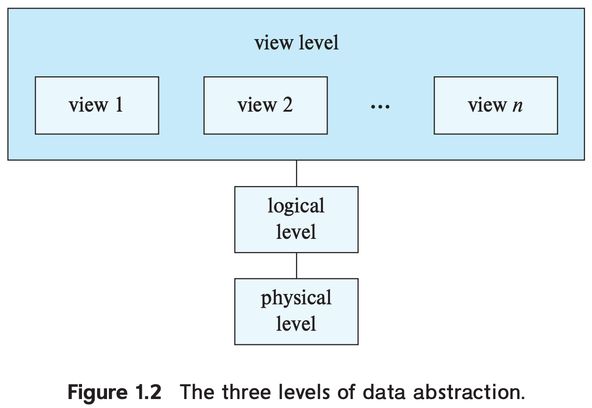
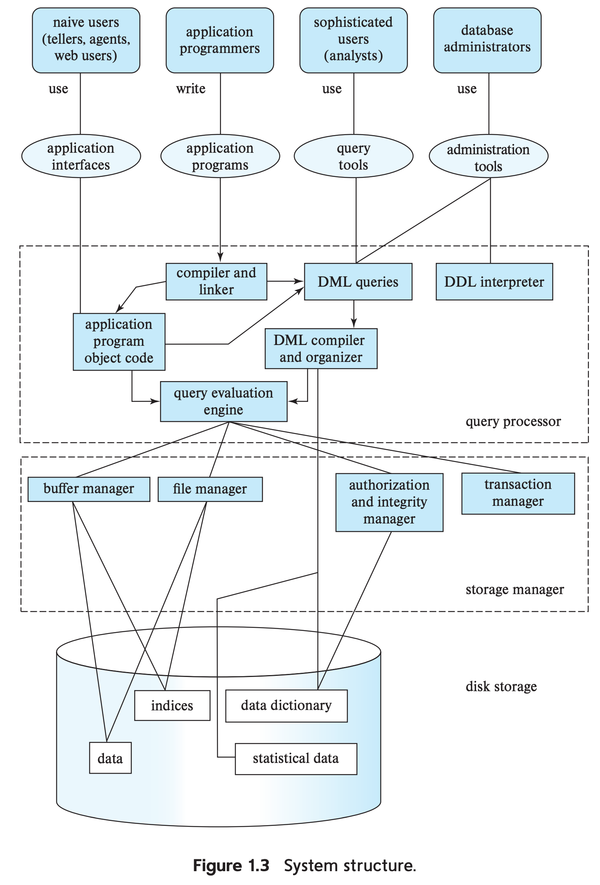
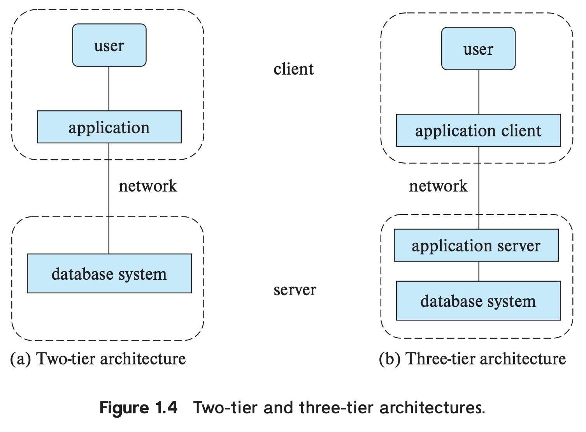

数据库管理系统（`database-management system`, `DBMS`）是相互关联的数据集合和一组访问数据的程序。这些数据集合称为数据库（`database`）。DBMS 的主要目的是提供高效便捷的存储和检索数据库信息的方法。

数据库系统设计目的是管理海量数据，这里包含定义信息存储的结构和提供操作信息的机制。同时，还需要确保信息安全，比如未授权的访问、数据库崩溃。

对于大部分企业而言数据相当重要，因此有大量的概念和技术用于管理数据，这些就是本书的重点。

## Database-System Applications
现代公司最有价值的是拥有的数据。数据库系统用于管理高价值、大量数据、多个用户/应用同时访问。

早期的数据库应用只有简单的、精确格式化、结构化的数据。现在的数据库应用还包含有复杂关系的数据，其结构也非常多样化。因此，数据库系统是一个大型复杂软件系统，任务是管理大量、复杂的数据集合。复杂度管理的关键是抽象（`abstraction`），数据库系统提供了一个简单的信息抽象视图，用户和应用程序员不必关心数据存储和组织的细节。

需要数据库的应用涉及企业信息（销售、会计、人力资源等）、制造业、银行和金融、大学、航空、电信、Web 服务（社交媒体、在线零售、在线广告）、文档系统、导航系统等等。从企业到日常生活，数据库都是很重要的部分。

大体上说，数据库有两种使用模式：在线交易处理（`online transaction processing`）和数据分析（`data analytics`）。

## Purpose of Database Systems
如果不使用数据库，那么需要直接访问文件，即文件处理系统（`file-processing system`）。但是这么有很多弊端：

* 数据冗余和不一致（`data redundancy and inconsistency`）
* 访问数据复杂且困难
* 数据隔离
* 数据完整性问题：程序直接读写数据可能破坏一致性约束（`consistency constraint`）
* 数据原子性问题
* 并发访问异常
* 安全问题：比如访问权限控制

在 1960 和 1970 年代，直接使用文件就会面对这些问题。数据库系统是构建在文件处理系统之上，通过各种概念和算法解决上述问题。

## View of Data
数据库系统是相互关联的数据集合和一组用户访问和修改数据的程序集合。数据库的一个主要目的提供数据视图的抽象，同时屏蔽数据存储和维护的细节。

### Data Models
数据库结构本质上是数据模型（`data model`）：用于描述数据、数据关系、数据语义和一致性约束的概念。数据模型分成以下四类。

* 关系模型（`relational model`）：关系模型使用一组表来表示数据和数据关系。每一个表有多个列，每个列有唯一的名字。表也称为关系（`relation`）。关系模型是基于记录的模型的例子，由若干个类型的固定格式记录组成。每个表包含若干条记录，每个记录定义了固定个数的字段（`field`）或属性（`attribute`），表的列对应这些属性。
* 实体关系模型（`entity-relationship model`）：实体关系模型使用一组对象（`object`），称为实体（`entity`）He 关系。实体是不同于其他对象的实物或对象。
* 半结构化数据模型（`semi-structured data model`）：半结构化数据模型允许每个数据项有不同的属性集合。前面的模型要求每一个数据项有相同的属性集合。
* 对象数据模型（`object-based data model`）：面向对象的编程语言流行，引出了面向对象的数据模型，不过现在这个概念整合到了关系型数据库。数据库存储和执行存储过程，这可以看作是通过封装、方法、对象这些概念来扩展关系模型。

这里大部分的讨论集中在关系模型上，因为这是大部分数据库应用的基础。

### Relational Data Model
关系数据模型用表表示数据，每一个表有若干列，每一列有唯一的列名。如下所示。

| ID | name | dept name | salary |
|--|--|--|--|
| 22222 | Einstein | Physics | 95000 |
| 12121 | Wu | Finance | 90000 |

### Data Abstraction
为了系统可用，检索数据必须高效。数据库的开发者使用复杂的数据结构来表示数据。但是数据库的使用者并不一定有这些知识，所有开发者必须通过数据抽象（`data abstraction`）来简化用户的使用。

* 物理层（`physical level`）：最底层的抽象，描述数据是如何存储的。
* 逻辑层（`logical level`）：较高一层的抽象，描述存储了什么数据和这些数据的关系。逻辑层使用很少且相对简单的结构描述到了整个数据库。简单简单的逻辑层可能使用了结构复杂的物理层，用户使用逻辑层无需关心复杂度。这称为物理数据无关（`physical data independence`）。
* 视图层（`view level`）：最高层抽象仅仅描述了整个数据库的一部分。尽管逻辑层的结构很简单，但是由于包含数据库各种各样的信息，复杂度依旧很高。很多用户无需这么多信息，只需要一部分数据。抽象的视图层的目的就是进一步简化交互。

下面是三层抽象的关系。



### Instances and Schemas
数据库在特定时间存储的信息集合称为数据库实例（`instance`）。数据库的设计称为数据库模式（`schema`）。数据库有很多模式，物理模式（`physical schema`）描述物理层的设计，逻辑模式（`logical schema`）描述逻辑层的设计。数据库可以有若干个视图层的设计，有时称为子模式（`subschema`）。

应用程序员使用逻辑模式来构建应用，因此这是一个很重要的概念。物理模式隐藏在逻辑模式下，通常可以变更而不会影响应用。

## Database Languages
数据库提供数据定义语言（`data-definition language`, `DDL`）来制定数据库模式和数据操作语言（`data-manipulation language`, `DML`）进行数据库查询和更新。实际中，DDL 和 DML 并不是分离的两种语言，而是一种数据库语言（比如 SQL）的一部分。

### Data-Definition Language
DDL 很重要的一部分称为数据存储和定义语言（`data storage and definition language`），指定存储结构和访问方法（`access method`）。这些定义了数据库模式的实现细节，对用户是隐藏的。

数存储的数据要满足一定的约束。DDL 提供了这方面的能力来指定约束。每次更新数据库的时候都要进行约束检查。通常来说约束可以是任意适用于数据库的谓词。不过任意谓词可能开销比较大，因此数据库仅实现下面这些约束以最小化额外开销。

* 定义域约束（`domain constraint`）：每一个属性（列）都需要关联一个可能值的定义域，比如整数类型、字符类型、日期类型等等。定义域约束是最基本的完整性约束。
* 参照完整性（`referential integrity`）：这一点是希望确保出现在一个关系（表）的某个属性（列）的值一定要在另一个关系的某个属性中。比如，表 course 中 dept_name 列的值必须在 表 department 的 dept_name 里面。当违反参考完整性约束时，会拒绝数据的插入。
* 权限（`authorization`）：不同的用户访问不同的数据具有不同的权限。常见的类型有读权限（`read`）只能读不能修改；插入权限（`insert`）只能插入新数据，不能修改旧数据；更新权限（`update`）可以修改数据；删除权限（`delete`）允许删除数据。可以授权用户全部或部分权限。

DDL 的输出放在数据字典（`data dictionary`），其中包含元数据（`metadata`）。数据字典是特殊的表，只能由数据库系统自己访问和更新。数据库在读或更新数据之前会访问并使用数据字典。

### The SQL Data-Definition Language
DDL 可以建表并指定各列的类型和指定完整性约束。

比如下面的 SQL DDL 定义了 department 表
```sql
create table department
    (dept_name char (20),
     building char (15),
     budget numeric (12,2));
```
DDL 还可以指定完整性约束。比如指定 dept_name 是主键（`primary key`），确保没有重名。还可以约束 instructor 的记录中的 dept_name 必须在 department 的 dept_name 这一列出现。

### Data-Manipulation Language
DML 的目的是让用户方便的访问和操作数据，访问主要有四类：增删改查。

DML 主要有两个类型：

* 过程式 DML（`procedural DML`）：用户需要指定需要什么数据和如何获取数据
* 声明式 DML（`declarative DML`）：有时也称为非过程式 DML，用户只需要指定需要什么数据而无需指定如何获取数据

声明式 DML 更容易学习和使用，不过由于用户没有指定如何获取数据，数据库自己要找到一种高效的方式来访问数据。

一个查询（`query`）是请求检索信息的语句。DML 中涉及信息检索的部分称为查询语言（`query language`）。尽管从技术角度讲两者不完全一样，但是实践中两者表示同一件事。

数据库查询语言有好几种，这里讨论的是最广泛使用的查询语言——SQL。

之前讨论的抽象层不仅适用于定义数据，也适用于操作数据。在物理层，需要定义高效访问数据的算法。更高层次的抽象，易用性是首要考量的。总体目标是让用户高效的和系统交互。数据库的查询引擎将 DML 翻译成一系列数据库物理层的算子。

### The SQL Data-Manipulation Language
SQL 是声明式查询语言。一个查询输入是一个或多个表，输出是一个表。

第一个例子是查询历史系所有教师的名字。
```sql
select instructor.name
    from instructor
  where instructor.dept name = 'History';
```
第二个例子是查询预算大于 95000 的系的系名和这些系的教师 ID。
```sql
select instructor.ID, department.dept_name
    from instructor, department
  where instructor.dept_name = department.dept_name and
        department.budget > 95000;
```

### Database Access from Application Programs
SQL 这样的非过程式的查询语言并没有通用图灵机那么强大，有些使用通用型编程语言做的事情 SQL 无法做到，比如输入、输出和网络通信等。应用程序（`application program`）运行在本机，通过 DML 和 DDL 与数据库打交道。有一些类库，比如 ODBC、JDBC，用于发送 SQL 到数据库并取回结果，方便构建应用程序。

## Database Design
数据库用于管理海量的信息。这些信息并不是孤立存在的。

数据库设计主要是数据库模式的设计。设计一个满足企业需求的数据库应用环境需要关注更广泛的问题。这里聚焦于写数据库的查询和设计数据库模式，后续会简要介绍这一点。

高级数据模型为数据库设计人员提供了概念框架，用于描述数据库用户的需求以及如何构建数据库模式来满足这些需求。数据库设计的第一个阶段要刻画出用户所有的需求。数据库设计人员要和领域专家和用户紧密合作，这个阶段的输出是一份用户需求规范。

接下来，数据库设计人员选择一种数据模型，应用这种模型提供的概念，将需求转成数据库的模式。概念设计（`conceptual-design`）阶段，模式描述了整个企业详细的概况。设计人员检查这些模式是否满足所有的需求并且这些模式之间是否有冲突。设计人员还可以检查冗余功能。这个阶段集中在描述数据和它们之间的关系，而不是物理存储细节。

就关系模型而言，概念设计涉及有哪些属性、如果将这些属性分组成若干个表。哪些属性是一个业务问题。如何分组是一个计算机科学领域的问题。一种方法是使用实体关系模型。第二种方法是规范化（`normalization`），输入所有的属性，输出表的集合。后续会详细讨论。

概念设计阶段的输出是一份功能需求规范（`specification of functional requirement`），描述了数据上的各种操作来满足需求。

从抽象的数据模型回到数据库的实现。在逻辑设计阶段（`logical-design phase`），数据库设计者将高层的概念模式翻译成数据库提供的模式。后续是物理设计阶段（`physical-design phase`），在这个阶段指定数据库的物理特性，这包含文件组织形式和内部存储结构。

## Database Engine
数据库系统分成各个模块，分别负责各个职责。粗略的可以划分成存储管理器（`storage manager`）、查询处理器（`query processor`）和事务管理（`transaction
management`）。

数据库要管理大量的数据，因此存储管理器很重要。一个企业的数据量从数百 GB 到若干 TB，大的企业甚至到 PB、EB 级别。由于内存无法放下这么多内存并且掉电数据会丢失，因此数据要保存到磁盘上。因此数据要在磁盘和内存之间移动。由于从磁盘读取数据到内存或反之比处理器慢很多，因此数据库组织数据的一个主要目标是最小化数据在内存和磁盘上移动。SSD 已经广泛使用了，速度快很多，但是开销仍旧很慢。

查询处理器使得数据库能够简洁的访问数据。查询处理器使得用户可以在不了解物理存储细节的情况下高效的查询数据。它的职责是将非过程式语言的查询翻译成一系列高效的物理层操作。

事务管理器（`transaction manager`）使得应用开发者执行一系列操作仿佛是一个执行单元，要么这些操作都成功，要么都没有被执行。在应用开发者看来，这是一个高层抽象，无需关心底层并发执行和系统故障的细节。

传统上数据库引擎是集中式的系统，不过现在并行处理已经成了处理海量数据的关键，因此现代数据库引擎非常重视并行的数据存储和查询处理。

### Storage Manager
存储管理器是数据库系统中的一个组件，向上层查询提供底层数据存储相关的接口。存储管理器负责与文件管理交互。存储管理器将各种操作变成文件系统命令。因此，存储管理器负责存储、检索、更新数据库的数据。

存储管理器包含以下组件：

* 权限和完整性管理器（`authorization and integrity manager`）：检查用户访问数据的权限和数据是否满足完整性约束。
* 事务管理器（`transaction manager`）：确保系统故障了还是一致状态和并发执行没有冲突。
* 文件管理器（`file manager`）：管理分配磁盘空间、磁盘上存储信息系的结构。
* 缓冲管理器（`buffer manager`）：负责从磁盘读取数据到内存，决定哪些数据缓存在内存。缓冲管理器是数据库系统很关键的部分，使得数据库可以处理比内存大的数据集。

存储管理器在物理层面实现了若干种数据结构：

* 数据文件（`data file`）：数据本身。
* 数据字典（`data dictionary`）：数据库结构的元信息，比如数据库的模式。
* 索引（`index`）：提供更快访问数据的能力。

### The Query Processor
查询处理器包含以下组件：

* DLL 解释器（`DDL interpreter`）：解释 DDL 语句并记录到数据字典。
* DML 编译器（`DML compiler`）：将 DML 语句翻译成求值的计划，其包含一系列查询执行引擎能够理解的低层操作。
* 查询执行引擎（`query evaluation engine`）：执行 DML 编译器输出的一系列低层操作。

### Transaction Management
一些操作在数据库执行时被当做了一个逻辑单元。所有操作都执行或者都不执行称为原子性（`atomicity`）。保持正确性称为一致性（`consistency`）。系统故障了也不应该丢失数据，持久化需求称为持久性（`durability`）。

一个事务（`transaction`）是一组操作，在数据库内执行像一个逻辑函数。每一个事务是原子性和一致性的单元。因此，事务不能违反数据库一致性约束。如果事务开始时数据库是一致的，那么结束的时候也必须是一致的。不过，在事务执行过程中，可以临时不一致。这种临时不一致在故障时会导致一些问题需要处理。

程序员有责任使得每个事务是一致的，以此保证数据库的一致性。不过，每个程序本身并不能将数据库从一致状态转换到新的一致状态。因此，这些程序不是事务。

确保原子性和持久性是数据库自身的职责，特别是恢复管理（`recovery management`）。如果没有错误，所有事务正常执行完成，那么很容易保证原子性。不过，由于各种故障，事务不能总是执行成功。此时为了保证原子性，失败的事务不能影响数据库的状态。因此数据库必须回退到执行这个事务之前的状态。数据库系统要执行故障恢复（`failure recovery`），因此要能检测到故障，然后恢复状态。

当多个事务同时执行时，即使每个事务都是正确的，数据一致性也可能不能保持。这就是并发控制器（`concurrency-control manager`）要解决的问题。因此事务管理器（`transaction manager`）包含并发控制器和恢复管理器（`recovery manager`）。

## Database and Application Architecture
下图展示了数据库系统运行在一个中心化服务器上，归纳了不同的用户与数据库交互的方式不同，展示了不同组件是如何交互的。



这个架构图也可以用于共享内存（`shared-memory`）架构，多个 CPU 并行处理，它们共享同一个内存。为了提高数据存储量和处理速度，并行数据库（`parallel database`）运行在由多个机器组成的集群之上。分布式数据库（`distributed database`）跨多个不同地区的数据中心（集群）来存储和处理数据。这就涉及如何存储数据、如何确保多集群的原子性、如何进行并发控制、如何提供高可用等一系列问题。

早期的数据库应用都是两层架构（`two-tier architecture`），如下图左边。现代应用基本都是三层架构（`three-tier architecture`），客户端并不直接访问数据库而是应用服务（`application server`）。这样业务逻辑（`business logic`）实现在应用服务层。三层架构的性能和安全性都更好。



## Database Users and Administrators
使用数据库的人可以分成两类：数据库用户和数据库管理员。

### Database Users and User Interfaces
有四类数据库用户，他们与数据库交互的方式不同。其中三类是普通用户。

* 一般用户：使用 web、移动应用等产品，并不直接与数据库打交道，甚至不知道数据库的存在。
* 应用开发者：计算机专业人士，开发应用程序，可能会通过一些类库使用数据库。
* 高级用户（`sophisticated user`）：对数据库很熟悉，不过不写应用于数据库交互，而是使用数据库查询语言或者一些数据库分析软件。

### Database Administrator
使用数据库系统的一个主要原因是对数据有中心化的控制。控制系统的人称为数据库管理员（`database administrator`, `DBA`）。其职责包括

* 模式定义（`schema definition`）：通过 DDL 创建数据库模式。
* 存储结构和访问方法定义（`storage structure and access-method definition`）：DBA 可能会指定一些适用于数据的物理组织的参数，创建索引等等。
* 模式与物理组织的修改（`schema and physical-organization modification`）：为了反映变化，DBA 可能需要修改模式，也可能为了性能而修改物理组织。
* 授权数据访问的权限（`granting of authorization for data access`）：通过给予不同的权限，数据库管理员可以让不同用户有权限访问不同的部分。这些权限信息放在一个系统表中，当用户访问数据时，数据库使用这些信息来检查一个用户是否有权限。
* 日常维护（`routine maintenance`）：包括以下事项
    * 周期性备份数据到远程服务器，避免数据丢失
    * 确保数据库有足够的空间可用
    * 监控数据库运行，确保性能没有降级
