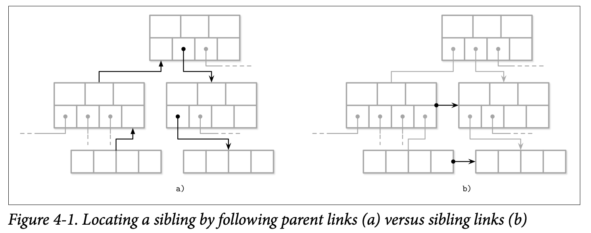
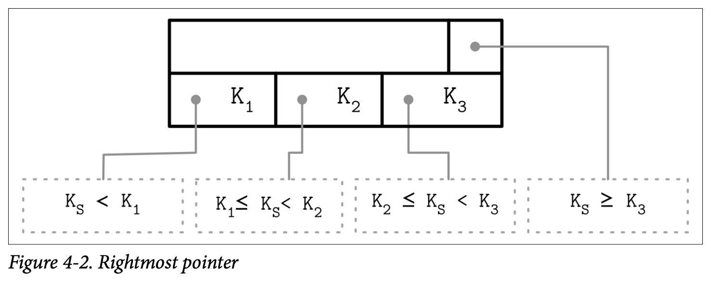
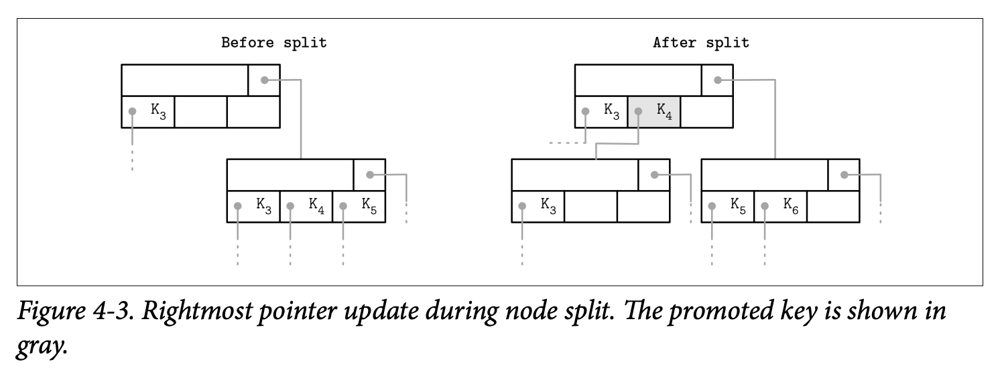

上一章我们讨论了设计二进制格式的一般性原则，可以用于就地更新和仅能追加的数据结构。这一章讨论一些仅适用于 B 树的概念。

首先讨论如何建立 key 和指针之间的关系、如何实现头部以及如何将页面链接起来。接下来会讨论从根节点到叶节点的遍历，如何执行二叉搜索，如何在分裂和合并节点时跟踪父节点的变化。最后讨论一些优化技术，垃圾回收等。

## Page Header
页的头部会维护一些易于定位、维护和优化的信息。通常包含描述页面内容和布局的标志信息，cell 数量，空闲空间的偏移量，其他有用的元信息。比如 PostgreSQL 存储了页的大小和布局版本。MySQL InnoDB 中存储了数据记录的数量，层级和其他一些实现相关的值。SQLite 中，头部存储了 cell 的数量和最优的指针。

### Magic Numbers
文件或者页的头部经常会放一个 magic number，通常是多个字节的常量，表示一个页面、标识符、版本等其他信息。magic number 用于验证。

### Sibling Links
一些实现存储了指向左右兄弟节点的指针。这些指针可以帮助我们直接找到兄弟节点而无需回到父节点。但是会增加分裂和合并操作的复杂度，因为兄弟偏移量也需要修改。比如一个非最右节点分裂了，那么右边兄弟节点的指向左边兄弟节点的指针需要指向新创建的节点。在发生分裂和合并时，兄弟节点需要更新，那么需要额外的锁。

下图是两种实现的对比。

### Rightmost Pointers
B 树的分割 key 用于找到子树，因此指针数量比 key 的数量多一个。在许多实现中，节点看起来更像是下面的布局。每一个分割 key 有一个指针，最后一个指针单独存储，并没有 key 与之配对。

这个额外的指针可以存储在页的头部，比如 SQLite 就是这么做的。

如果最右的孩子节点分裂，那么有一个新的 cell 要添加到父节点，那么最右指针需要更新。如下图所示。灰色的 cell 是新加的，指向分裂的节点，最右节点的指针更新为新加的最右的孩子节点。

### Node High Keys

### Overflow Pages

## Binary Search

### Binary Search with Indirection Pointers

## Propagating Splits and Merges

### Breadcrumbs

## Rebalancing

## Right-Only Appends

### Bulk Loading

## Compression

## Vacuum and Maintenance

### Fragmentation Caused by Updates and Deletes

### Page Defragmentation

