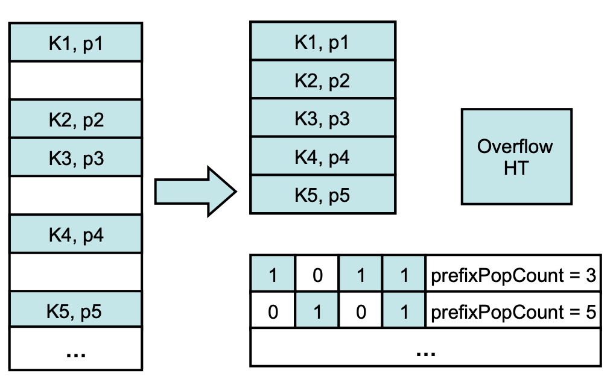

论文地址：http://www.vldb.org/pvldb/vol8/p353-barber.pdf

这种数据结构主要是为了 hash join 设计的，可能不符合其他算子或者场景的需求。

CHT 核心思想有两点：
1. 桶的数量足够大，一般是普通 join 算法中 hash table 桶的八倍，这样冲突的可能性大幅减低。
2. 存储数据的数组是紧密排列的，没有内存浪费。

整个 CHT 分成三层。



第一层是一个 bitmap，是如下数据结构的数组。
```cpp
struct BitmapWord {
    uint32_t bitmap_;
    uint32_t prefixCount_;
};
```
前 32bits 的每个 bit 表示对应的桶是否有数据，后 32bits 表示到当前位置一共有多少个数据（多少个桶被用了）。如上图左下角所示。

第二层是一个紧密排布的数组，没有空隙。如上图中间的部分。

第三层是一个 overflow hash table，用于存放冲突的数据。

如何 build 这样一个结构呢？一个简单的方式是先构建一个普通的 hash table，然后转成 CHT 描述的结构。正如前文所述，一般情况桶的个数是普通 hash table 的八倍，如果这么操作，那么在 build 的过程中内存的开销会非常大。另外，如果内存都允许放一个更大的 hash table，也就没有必要转成 CHT 了。

论文给出的做法是扫描两遍。
1. 第一遍扫描，设置对应的 bit 位表示是否有数据，如果冲突了，那么该数据由 overflow table 处理。
2. 计算 prefix count。
3. 根据第二步得到的数据量，申请一个数组。第二遍扫描，根据 bitmap，将数据放到数组对应的位置或者交给 overflow table 处理。

在第一遍扫描的时候我们只记录 bit 位而没有存储数据，那么如果发生了冲突，我们无法分辨是重复数据导致的冲突，还是不同数据恰好在同一个桶导致的冲突，只能交给第二次扫描处理。

如果 join key 上有主键约束，那么不会有重复数据，根据这个信息可以优化 build 过程的实现。

下面伪代码描述 probe 算法。
```cpp
auto bktid = hash(key) % nbuckets;
auto word = array[bktid / 32];
auto nth = array[bktid % 32];
auto bitmap = word.bitmap_;
if (!(bitmap & (1u << nth)))   // not set
    return;                    // not present in the CHT
auto bitsUptoNth = bitmap & ((~0) << nth);
auto prefixCount = word.prefixCount_;
auto pos = prefixCount - std::popcount(bitsUptoNth);
if (key == array[pos])
    ; // found
else
    ; // search in overflow table
```

论文中描述有一个 Threshold，是线性解决冲突时的最大值，如果冲突，需要向后找若干个数据，而这里的描述（不管是 build 还是 probe）相当于 `Threshold = 1`。原因是在工程实践的时候发现为了处理 `Threadhold=2`（论文推荐值） 不得不增加 `if-else` 分支，导致性能反而不如 `Threshold = 1`。这个问题可能可以通过 SIMD 指令解决。

经过实测（TPC-H 基准测试），CHT 作为 hash join 的 hash table，比使用论文 [Balancing Vectorized Query Execution with Bandwidth-Optimized Storage](https://ir.cwi.nl/pub/14075/14075B.pdf) 中 5.3 节描述的使用 first/next 两个数组组成的 hash table 要好（也可以参考 https://www.cockroachlabs.com/blog/vectorized-hash-joiner/ ，解释的更详细）。对于 TPC-H 绝大部分查询，CHT 的内存占用量都更少，速度也更快，但是存在少数场景（平均重复值比较多的情况），CHT 会稍慢一些。
