> 论文地址：https://stratos.seas.harvard.edu/files/stratos/files/columnstoresfntdbs.pdf
>
> 完整的标题是：The Design and Implementation of Modern Column-Oriented Database Systems
>
> 这是一篇经典的、全面的讲解列存系统的文章。下面意译了整篇文章。

## Introduction
存储设备（例如磁盘）的效率，和把它拷贝到 CPU 寄存器进行处理的效率，直接关系到数据库的性能。因此，长期以来有很多探索不同物理存储的方案，比如复杂且精巧的索引（`sophisticated indexing`）、物化视图（`materialized views`）、垂直分区水平分区（`vertical and horizontal partitioning`）。

**Column-stores** 近些年，列存系统又火起来了。学术型的`MonetDB` `VectorWise`（商业化为`Ingres VectorWise`） `C-Store`（商业化为`Vertica`），包括商业领域的`SybaseIQ`都很有影响力。（本文也是着重分析三个有影响力的学术型数据库）。2013年底，IBM, Microsoft, SAP, Oracle 都推出了列存系统，说明这个新技术的重要性。

列存系统按照列划分，单独存放每列的数据。查询时，只需要加载需要的列而不是读所有列，提高了 I/O 和内存的效率。在列存的架构方面，也有很多创新。本文阐述了现代的列存系统的架构、演进和在数据分析上的优势。

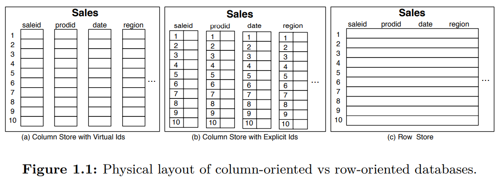

**Data Layout and Access Patterns** 图1.1说明了列存和行存（`row-stores`）在物理存储上的差异。例子是三种不同的方式存储包含多个属性列的`Sales`表。前两者是将每列的信息存放到不同的存储单元。数据通常以数据块的形式读写，列存意味着每个数据块包含的是某个特定列的值。如果要查询七月某种产品的销量，列存只需要读取`prodid`和`date`两个属性列的数据块即可。对于行存，所有的属性列都存放到一个存储单元里面，查询时不得不读取整行数据。数据传输消耗是数据库的主要瓶颈，同时，表结构越来越复杂（通常多达数百列），针对当前这个例子，列存系统高效的多。

**Tradeoffs** 不同的访问模式决定了选择列存还是行存。如果要查询一条记录（全部列或者一些列），那么列存系统不得不`seek`若干次（取决于列数）来读取一条记录信息。如果需要读取很多行，那么可以每一列读取大量数据，`seek`时间会被平摊掉。行存恰恰相反，如果读一行，`seek`一次，读取时间本身开销可以忽略（相比`seek`）。读取的数据越多，传输数据需要的时间比`seek`多得多，那么列存的性能会超过行存。因此，分析型用列存比较多，多数查询都是扫整表的一些列用于计算一些统计结果。

**Column-store Architectures** 现在的列存架构用了一些用于垂直划分中的概念，但是架构早就超越了垂直划分，目的是最大程度的提升性能。
* **Virtual IDs** 列存系统中最简单的表示列的方式是把`tuple id`和对应的值存在一起，但是会浪费很多空间和吞吐。现在系统中往往是是通过位置信息（`offset`）来标记虚拟`ID`。分别对应图1.1的（a）和（b）。一些系统中，每列都是固定宽度的紧密（`dense`）数组，每个记录在不同数组中的位置是一样的。有了固定宽度，寻址非常简单，第 $i$ 个记录的位置就是$startOf(A) + i * width(A)$。第四章我们会分析压缩（列存比行存显著的一个优势就是压缩率高）算法，其不是固定宽度的。一些系统会放弃一点压缩率来保持固定宽度，而另外的系统会放弃固定宽度。
* **Block-oriented and vectorized processing** 一次传递缓存大小的数据，并在多个值上进行操作，列存系统有更好的缓存命中率和 CPU 利用率。使用向量化 CPU 指令，能够进一步提升吞吐。
* **Late materialization** 延迟物化（`Late materialization or late tuple reconstruction`）表示推迟组装列成更宽的`tuple`。在某些场景，可以完全避免物化，那么延迟物化意味着列存系统不仅是按列存储，还可以按列处理。比如`select`算子，`for`循环一次处理一列，并以缓存/CPU 友好的格式输出。相反，如果拼接成行，交给行存的`select`算子，其只处理一列，效率很低。这种情况下，延迟物化能够有效提升内存利用率。
* **Column-specific compression** 针对每一列应用针对该列的最高效的压缩算法，可以减少磁盘使用量。由于列存的特性，即使是使用简单的压缩算法也能得到较好的压缩率。
* **Direct operation on compressed data** 现代列存系统往往尽在必要的时候对数据解压缩，理想情况是到了给用户数据的时候再解压缩。处理压缩数据能够提升内存带宽（主要瓶颈之一）的利用率。延迟物化使得数据可以以压缩的形式在内存中，而创建更宽的`tuple`往往需要先解压缩。
* **Efficient join implementations** 由于列值单独存储，使得类似于`semi-join`的`join`策略是可能的。对于某些特殊的`join`，能够比传统的`hash join`或`merge join`高效的多。
* **Redundant representation of individual columns in different sort orders** 根据指定列排序可以在该列上过滤的更快。存储几种不同的排序副本，可以极大的提升性能。`C-Store`把按照某个列排序的列存组称为投影（`projections`）。`Virtual ID`以每个投影为基础，互补影响。此外，基数小（`low-cardinality`）的数据排序后可以获得极致的压缩比。
* **Database cracking and adaptive indexing** `Database cracking`可以避免列排序。具备`cracking`性质的列存可以自适应地及其增量式地进行排序。这是查询的副产物。没有额外的开销。每次查询都可能重组一下对应的列，以加速后续的查询。定宽列存和向量化都能加速重组的过程，这使得自适应索引是现代列存的重要特性。
* **Efficient loading architectures** 列存的一个问题是写入数据比行存慢。这是因为列存需要写到多个文件中，同时数据还是压缩格式的。`C-Store`先写入一个未压缩的、WOS（写优化存储）缓冲区，然后压缩、一次性写到磁盘上。这种方法避免对每列每行进行`seek`，并且不需要把新数据压缩到列里面。

**Are These Column-store Specific Features?** 这些特性不是列存所特有的。大部分都受到了早期对行存研究的启发。学术界和工业界在行存系统上也做了类似的设计，同时这些设计不影响行存的架构。

除了提出新的数据存储和访问技术之外，本文的贡献是描述了一种全新设计的分析型架构。从零开始，没有历史包袱，可以把各个技术推到极致。过去，其中一些技术在行存中单独实验分析过。从存储开始，到执行器、优化器，列存和行存的架构设计有着巨大的差异，因此在数据库的各个方面都能最大限度的发挥这些技术的优势。

**Performance Example**  
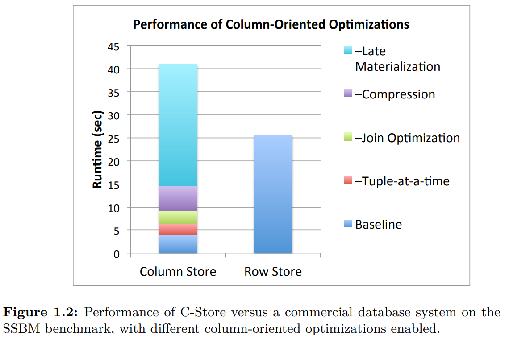

**Monograph Structure** 本文余下会详细解释上述技术如何提升性能的。同时，介绍`MonetDB` `VectorWise` `C-Store`的架构和异同点，总结创新点。

## History, trends, and performance tradeoffs
尽管 1970 年代就出现了列存技术，不过直到新千年，列存研究才被认可，商业列存系统才开始。

### History
TOD（`Time Oriented Database`）基于转置文件，为病历管理设计的数据库。最早的与现代列存系统类似的是`Cantor`，它具备`zero suppression`, `delta encoding`, `RLE (run length encoding)`, `delta RLE`这些现代列存系统有特性。使用动态规划来选择压缩算法和相关参数。

转置文件之后，大家开始研究垂直划分。在那个时候，行存是关系型数据库的标准架构。使用`slotted-page`存储的方式，如下图左边所示。这种方式被称为`N-ary Storage Model`（`NSM`）。1985 年，Copeland 和 Khoshafian 提出`Decomposition Storage Model`（`DSM`）——列存前身。大家都是用`NSM` `DSM`表示行存和列存。分离的存储每一列的值，同时拷贝`surrogate key`（类似与`record ID`），如下图右边所示。由于要拷贝`surrogate key`，那么`DSM`要比`NSM`占用更多空间。以与原始表相同的顺序存储每一列（在`surrogate key`有聚簇索引），作者提出提供其他列的非聚簇索引，使得更快找到对应的`surrogate key`。

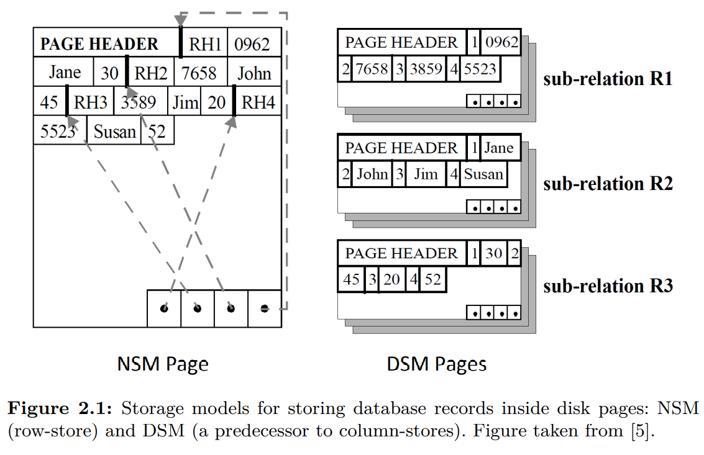

那个时候的分析表明，在付出额外存储的代价的前提下，扫描少数几列时，`DSM`要比`NSM`快。作者主要介绍了`DSM`的简单性和灵活性，推测基于`DSM`的物理存储设计会更简单，也更容易构建`DSM`的执行器。没有涉及压缩，也没有评估其他算子。强调了`DSM`之上的并行性，对`join`和投影索引，表明`DSM`相比`NSM`的优势。

时间来到新千年，技术和应用的发展才为列存的发展铺平了道路。且看下面的分析。

### Technology and Application Trends
现在关系型数据库的基本设计和 80 年代非常接近。但是 CPU 速度，缓存、RAM、磁盘大小增加了 5000-10000 倍；磁盘传输数据快了 100 倍，`seek`快了 10 倍。这些差异对数据库的性能有重大影响。

磁盘容量的增长与传输和`seek`性能提升之间的不平衡可以从下面两个方面衡量：1）每个字节所拥有的传输带宽下降两个数量级；2）顺序读取比随机读取快了一个数量级。因此，要避免随机 I/O，同时要预留带宽。

随机访问相对耗时，查询处理技术越来越依赖于顺序读取。`DBMS`的架构开始围绕顺序访问来构建。然而数据量越来越大，扫描这些数据也越来越慢。省磁盘带宽变得重要，但是大家不认为`DSM`是`NSM`的替代选项，因为那个时候的`DSM`只能在少数列上发挥作用。为了使得列存能够超越行存，必须更快的重建`tuple`并且能够平摊`seek`多列的成本。更快的 CPU 可以实现前者，更大的 RAM 可以实现后者。

现在列存系统主要是基于磁盘的，但是 90 年代，其主要是基于内存的。那个时候人们研究内存数据布局的原因是解决 CPU 速度和 RAM 访问速度增长不匹配的问题。80年代访问内存和执行指令速度差不多，到了90年代中期，后者快了两个数量级。`MonetDB`是第一个学术型的列存系统，动机是解决内存带宽不足的问题，并且通过避免表达式求值提升计算效率。基于类似于带`Virtual ID`的`DSM`存储格式研发了新的查询执行代数。还研究了缓存敏感的查询处理方式。

`PAX`（`Partition Attributes Across`）是一种混合格式，每个`NSM`页面组织为一组迷你列。延续了`NSM`的 I/O 模式，同时优化了缓存和 RAM 的通信。

`Fractured Mirrors`的思路是多数时候需要多副本来维持可用性和可靠性，那么一份数据是`NSM`格式，一份数据是`DSM`格式。查询时能同时得到两者的优势。

几乎同时（1996 年），第一个商业化列存`SybaseIQ`诞生了，证明压缩、列存这些能解决很多分析场景。虽然多年来有一定商业上的成功之处，不过没有吸引学术研究和其他数据库供应商的注意。原因可能是出现太早，很多利于列存的硬件——大的内存、SIMD——还没有出现，同时没有架构上的创新，比如延迟物化、操作压缩数据等，这些对于列存很重要。`SybaseIQ`做了列压缩、`join`的延迟物化等，不过没有从头开始设计面向列存的存储引擎和执行器。

终于到了新千年，学术界工业界又开始关注列存了。便宜的磁盘、更快的 CPU 等硬件使得收集、存储、分析海量数据成了可能。互联网时代，数以 TB 甚至 PB 级的数据需要分析。重新审视列存系统，设计新的架构，包括列存数据（只读优化）、轻量级的压缩、更快的多列访问、高效利用 CPU/磁盘等等。两个先驱`C-Store` `VectorWise`、各种最前沿的技术，后续一一分析。

基于此，列存系统大爆发。随后，传统数据库厂商（Oracle，Microsoft，IBM，HP，SAP，Teradata）也推出了列存产品。值得注意的有IBM的`BLU`，能够处理压缩数据；SAP的`HANA`，以行存和列存结合将AP和TP融合到一个产品里；Microsoft也扩展了`SQL Server`，增加了列存、向量化、压缩等。

### Fundamental Performance Tradeoffs
尽管`DSM`能够快速扫描单列，但是扩展到扫描多列，甚至扫描全表，其性能远远落后于`NSM`。这是由于重组`tuple`、更多的磁盘访问、处理无关信息等带来性能开销。为了使得列存能够获得与行存相当的性能，需要`DSM`在不同负载上都保持良好的性能，包括查询多列甚至整行的情况。随着 CPU 速度的增长远远大于磁盘带宽的增长，在软件层面对 I/O 的优化，使得列存在读取多列时的性能慢慢接近行存。在过去十年中，这一点被许多学术研究所证实。
* `Fractured Mirrors`作者提出把列数组存到 B 树中，每个叶子节点包含所有列的值，去掉了每列的`ID`，平摊`header`的开销到多列中，基于块的`tuple`重组。
* 文献 40 提出了一种新的独立存储模型，读优化，大量的预取来隐藏磁盘`seek`不同列的开销。2006年，全列扫描只比行存慢20~30%。
* 文献 89 提出了基于 SSD 的列存，证实基于磁盘的列存的有效性。由于SSD随机读比HDD快很多，所以扫描全列和行存性能没有显著差异。

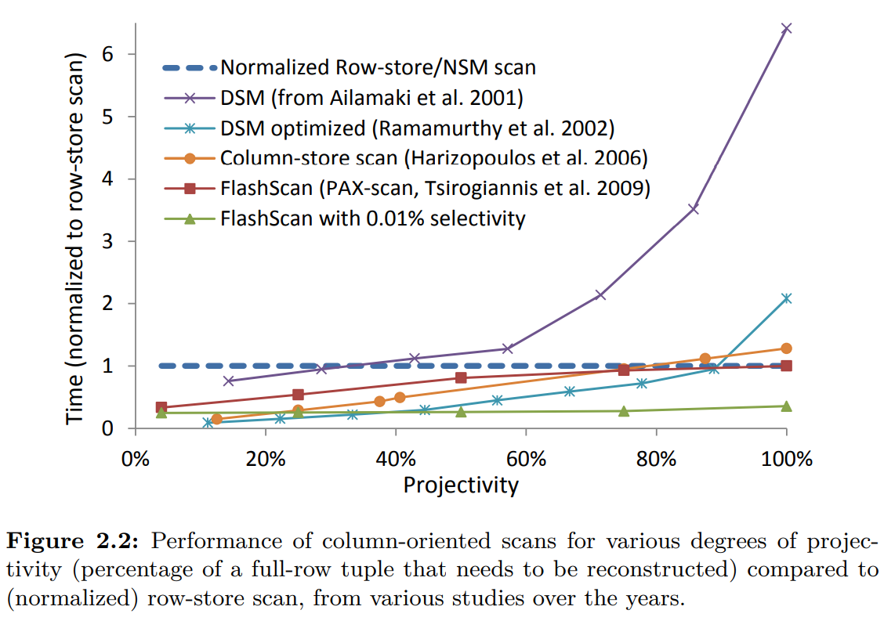

上图显示了这种趋势。最差情况（选择所有列）时列存比行存稍慢，如果使用SSD，那么列存就不再比行存慢了。对于选择率高的场景，列存要避免创建大量中间结果——大量额外开销。

## Column-store Architectures
本章描述`MonetDB` `VectorWise` `C-Store`的 high level 架构。现代列存基本都遵循这些设计原则，多数都是共有的，部分是某个系统所特有。

### C-Store
磁盘上是一组列文件。一个列文件包含某个列的数据，通过指定的压缩算法压缩，并根据某几列排序。这些文件是读优化存储（`read optimized store` (`ROS`)）。新数据加载到写优化存储（`write-optimized store` (`WOS`)），这些数据没有没有压缩也没有垂直划分。WOS 加载数据效率高，同时分摊了压缩和`seek`的成本。`tuple mover`定期把 WOS 的数据转化成 ROS 数据。

`C-Store`的每一列可能会通过不同的排序方式排序后存储多份。一组以某种方式排序的列，称为投影（`projections`）。至少要有一个投影包含所有的列以响应所有的请求。包含某些列的更多是为了热点数据查询使用的。举例：查询某个时间段某个区域的销售量，那么包含`id` `date` `region`的三列且按照`region` `date`排序的投影很有用，同时能够快速作聚集而无需维护中间状态；如果查询某个时间段的销售量，那么按照`date`排序的投影就很用了。下图是两个投影例子（竖线后面是排序列）。投影可以包含不同的列，也不必包含所有列。

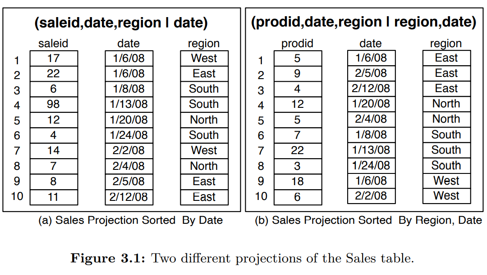

`C-Store`的每一列都是压缩过的，可以使用不同的压缩算法。选择某个算法取决于（1）是否排序（2）数据类型（3）不同值的数量。比如，`product class`，可能就有限的几个可能取值，排序后，使用 RLE（`run-length encoding`）压缩。那么连续的$X$个相同的`product class`，表示成一行 ($X$, `product class`) 而不是$X$个`tuple`。第四章会详细讨论压缩。

`C-Store`不支持辅助索引（`secondary indices`），可以在排序的投影列上建立稀疏索引（`sparse indexes`）以实现高效索引。稀疏索引是基于树的小型索引，用于存储每个物理页上的第一个数据。每个物理页大小在几兆字节。给定排序投影列的某个值，稀疏索引返回第一个包含该值的物理页，扫描物理页找到数据。`C-Store`还有一个类似的稀疏索引，存储了`tuple`的位置，给定一个`tuple`信息，可以快速的找到其偏移量，即使是压缩的数据格式或者存放变长列。

`C-Store`没有覆盖，更新操作等于删除加插入。删除操作就是在删除列（`delete column`）上记录删除时间。

`C-Store`查询执行的时候需要同时访问 WOS 和 ROS，然后合并两者的结果。查询运行在一个指定的时间点上，用于过滤删除列的数据。所以可以指定一个过去的时间点查询历史数据。修改数据库的查询使用传统的二阶段锁。如果只读查询且可以接受稍微过期的数据，那么可以指定最近的某个时间点作为查询时间，这样可以不使用锁。`C-Store`执行过程还是用了延迟物化、列`join`、批处理等技术。第四章会讨论。

`C-Store`是`shared-nothing`架构的大规模并行分布式数据库（商业化的`Vertica`实现这一点）。核心思想是通过`hash-`或者`range-partitioning`把数据水平划分到各个节点，查询尽可能在每个节点上运行，最后合并结果返回。大多数并行设计都是基于早期的`shared-nothing`的并行设计原则，比如`Gamma`，不是讨论重点。

### MonetDB and VectorWise
**MonetDB** `MonetDB`是从头开始为现代硬件设计的分析型数据库。内存和磁盘都是一次存储一列数据，同时使用了批处理和延迟物化。完全依赖于文件映射以避免复杂的缓冲区管理。`MonetDB`以下几点和传统数据库不同：
* 执行引擎，使用`a column at-a-time-algebra`（一次一列的代数？）
* 处理算法，最大化 CPU 缓存命中而不是 I/O 效率
* 索引，不是 DBA 的任务，而是查询的副产物。比如`database cracking`
* 查询优化，在运行时——查询增量执行的过程中——完成的
* 事务管理，通过附加表和代数运算实现的，只读查询完全忽略这些（没有事务开销）

传统的查询过程一次一个`tuple`，拉取模型，通过`next()`调用下游的算子获取一个`tuple`，迭代式的处理。`MonetDB`以列为单位处理。通过基于固定宽度的紧密数组的紧凑的循环的方式，最大化利用现代 CPU 的能力。这些手段需要编译器的帮助以获取最大性能：`strength reduction`（用一个更低开销的操作代替）、`array blocking`（对数组子集作分组以获得更好的局部性）、`loop pipelining`（将循环映射为优化的流水线执行）。因此，`MonetDB`更少的指令完成更多的任务（主要是消除传统`tuple`迭代的函数调用），并且这些指令在现代 CPU 上运行的更高效。也就是说，`MonetDB`查询计划提供更多 CPU 动态指令，使得保持满流水线、分支预测、高 CPU 缓存命中率，并且通过编译器从 SIMD 中获益。

一次一列的处理是通过 BAT 代数实现的，算子处理 BAT 并产出一个 BAT。BAT 是`Binary Association Table`的缩写，表示`DSM`中`<surrogate,value>`这两列的表，`surrogate`是`Virtual ID`，列的索引，没有物化。输入和中间结果是 BAT 格式，结果也是 BAT 格式。`MonetDB`把延迟物化做到了极限。BAT 本质上就是个内存数组。BAT 代数算子消费并且产出 BAT。比如下面的例子，选择算子的输入是一个 BAT，进行过滤，然后产出一个包含符合条件的数据的 BAT。

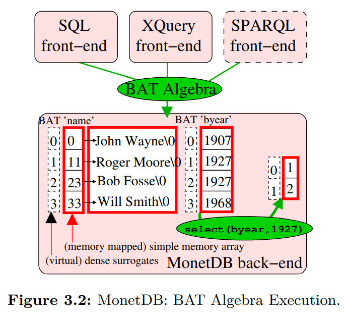

这里没有重组`tuple`的概念，也是`MonetDB`设计的目的之一，使用一种内部数据表示（BAT）来处理不同数据模型。`MonetDB`设计分为前端和后端，前端负责维护存储在一些逻辑数据模型中的数据的视图。前端的存在使得不仅能存储查询`MonetDB`中的纯关系型数据，还能处理面向对象的数据、XML、RDF和图数据等等。前端将用户查询（SQL、OQL、XQuery、SPARQL）翻译成 BAT 代数，然后执行计划，最后使用 BAT 表示结果。上图展示了不同的前端生产了 BAT 代数并且在后端执行。

BAT 高效的原因是硬编码语义，结果是所有算子都是无谓词的。与之相比，在传统数据库中的关系代数中，`join`和选择算子采用布尔表达式来决定哪些`tuple`被处理，布尔表达式在查询执行时才能确定，那么处理过程中必须要有一些表达式解释器对表达式解释。BAT 中不会有这样的问题（没有谓词）。我们称之为“零自由度”（`zero degrees of freedom`）。没有自由度就可以把解释器从算子中删除。BAT 中所有算子的执行代码行为都是固定的处理一个简单的数组。复杂的表达式需要被映射为多个 BAT 子表达式。表达式解析发生在一次一列这个粒度，开销被平摊了。

BAT 代数的本质可以看作是`RISC`在数据库查询语言上的应用：通过简化操作，使得高效执行称为可能。

近期的研究表明，走极端路线和即时编译代码（即在查询处理期间），可以获得进一步的优势。编译后的代码最适合特定的查询模式和数据布局，从而提高扫描密集型查询的性能，同时使用针对这次特定扫描执行必要操作的算子，可以进一步减少间接函数调用，增加缓存命中率。

`MonetDB`为每个基础列（`base column`）附加了一组待处理列（`pending column`）。每个更新操作只影响待处理列。每个查询需要从基础列和待处理列取数据，合并成最后结果。举例：针对`X`列进行过滤，一个算子直接处理`X`列，一个算子处理对应的待处理列，满足条件的待处理的插入语句会合并到最后结果，而待处理的删除语句会将结果从集合中剔除。待处理列会周期性的合并到基础列。

**VectorWise** `MonetDB`开创了很多列存的核心设计，后续的`VectorWise`和`C-Store`又补充了一些标志性的设计原则。`MonetDB`没有压缩，通过文件映射访问数据。没有缓存管理，`MonetDB`必须依赖操作系统的虚拟内存，这意味对 I/O 没有绝对控制权。另外一个缺点是一次一列的处理模式是完全物化中间结果的。举例：如果选择算子需要处理所有数据，还要物化满足条件的结果，会导致额外的开销，特别是海量数据的时候。两个相结合，当需要的内存超过 RAM 时，会出现SWAP，很耗时。

同一个团队又从头打造了`VectorWise`，解决`MonetDB`的缺陷，同时提供了为现代硬件量体裁衣的设计。一个创新点是向量化模型在一次一列和一次一条`tuple`之间取得平衡，一次处理一列的一块。

`VectorWise`显式的进行 I/O，通过`Active Buffer Manager` (`ABM`) `Cooperative Scans`能够自适应的协同并发时的 I/O 需求；`VectorWise`还提供了一种全新的解决更新的方法`Positional Delta Trees`和一个高速压缩算法。下一章都会讨论。

### Other Implemententations
后续产品基本上都继承了`VectorWise`和`C-Store`的设计。下面是被广泛采纳的两个主要架构：
* **Columnar Storage Only** 列存数据，但是传统的执行器处理数据。每个查询只访问有关列，I/O 能省一些开销，一旦到了内存，会拼成传统`tuple`接着用行存执行器处理。好处是容易和现有系统兼容，但是不能发挥列存的全部优势。和现有系统兼容可以平滑的过渡另一个新的架构，同时允许数据既有行存也有列存，由同一个执行引擎处理。

* **Native Column-store Designs** 完全列存化。不仅数据是列存格式，同时打造一个按列处理、延迟物化的执行器。然后把新的执行器和传统执行器整合到一起。

  **IBM BLU**是一个好的例子。BLU 是 DB2 中负责数据列存的组件。优化器知道什么时候把数据给 BLU 执行器，什么时候给传统执行器。这样，查询可以从列存中收益，反之亦然。查询可以从行存和列存中都扫描数据。

  除了延迟物化等标准列存技术的使用，BLU 在压缩领域引入了新技术。`Frequency partitioning`在提升压缩率的同时遵循了列存的设计原则。总体的思路是重新组织数据，使得每页中数据的变化更小。通过字典压缩分页压缩，每页可能的值很少，减少了表示数据的编码数量。更少的编码，那么 BLU 就能用更少的比特描述这些值，最终减少了空间。

  `Frequency partitioning`使得 BLU 可以存储变宽列。每个页面有自己的字典和编码长度，每个页面中，所有的数值/编码都是定长的，不过对于同一列的不同页可能采用不同的编码长度。BLU 的算子利用紧致`for`循环，是 CPU 缓存友好的，唯一需要在不同页切换时需要稍微调整一下。这会导致页面的设计更加复杂一些，因为不是纯粹的数组存储，而且需要一些额外信息，包括每个页面独立的字典和元数据（`tuple`和全局的映射关系）。`Frequency partitioning`往往基于每个列进行重组，那么不同列可能是不同的顺序，因此需要一种方法把一张表中的所有列关联起来。下一章会讨论细节。

  **Microsoft SQL Server Column Indexes** Native 支持列存和向量化执行，整合进了传统的行存数据库，用户可以根据场景选择，可以使用列存放辅助信息，也可以存放分析型数据。

## Column-store internals and advanced techniques
### Vectorized Processing
数据库文献通常会比较两种执行策略：火山模型（`Volcano-style`）和全物化（`full materialization`）。火山模型一次迭代一个`tuple`，其在整个查询树流转。每个算子的`next()`方法生成一个`tuple`，调用子节点的`next()`获取一个`tuple`。软件层面实现优雅，同时尽量避免物化中间结果。

全物化模式中每个算子是独立的，算子从存储中读取数组作为输入，结果写回存储中。`MonetDB`是少数使用全物化策略的数据库，在 BAT 代数中，每个算子能够简单、高效。但是会消耗额外的资源，因为产生一些不必要的中间结果。

使用列子`select avg(A) from R where A < 100`来解释两者的差别。火山模型中选择算子将满足条件的`tuple`一条一条的传递给聚合算子。全物化模型是算子扫面所有数据，创建所有满足条件的数据的中间结果，一次性传递给聚合算子。选择算子和聚合算子可以用紧密的`for`循环非常高效的实现，不过如果没有选择算子或者数据量很大，物化大的中间结果需要很多内存，甚至超过内存大小，这会是一个问题。

`VectorWise`开创的向量化执行（`vectorized execution`），介于两者之间。向量化执行从数据处理逻辑中分离了控制逻辑。从控制逻辑来看，向量化执行和火山模型类似，不同是`next()`返回一个`tuple`或者是 $N$ 个`tuple`。就数据处理逻辑来看，和`MonetDB`的 BAT 类似，一次处理一组数据。向量化执行能够结合两者的好处，避免大量中间结果，同时使用循环高效的处理数据。

向量化执行一次处理的数据大小要能放到 L1 缓存中为好，（`VectorWise`中 $N=1000$），这样能避免读写内存。结合列存，一次处理一列的一个`Vector`，所以最好能把输入、输出和附加信息都放到 L1 缓存中。比如，一个在多列上有多个谓词的查询，独立的在每列上应用谓词，那么每列中的`Vector`要能放到 L1 缓存中。

向量化执行有很多优势，总结为以下几点：
* **Reduced interpretation overhead** 相比传统一次处理一个`tuple`，查询解释器调用函数的次数会下降和`Vector`大小一样的因子（下降这么多倍）。CPU 密集型查询，比如`TPC-H Q1`，性能能提高两个数量级。
* **Better cache locality** `VectorWise`将`Vector`的大小设置成能放进缓存的大小。如果太大（如`MonetDB`中的一整列数据），内存传输数据会降低速度。从指令缓存角度看，向量化执行也在两者之间取得了平衡，函数的命令迭代`Vector`大小一样的次数，指令的局部性。
* **Compiler optimization opportunities** 和`MonetDB`中一样，向量化原语遍历数组的紧密的循环，编译器更容易优化，往往会生成 SIMD 指令。
* **Block algorithms** 数据处理算法一次处理 $N$ 个`tuple`，有机会进行逻辑上的优化。比如，需要判断输出缓冲区是否满了，一次处理一个`tuple`就相当于为每个`tuple`检查一次，但是一次处理 $N$ 个就只需要检查一次。
* **Parallel memory access** 在现代 CPU 上向量化的紧密循环执行内存访问的算法能够针对向量中的不同值生成多个`outstanding cache misses`。这是因为当缓存未命中发生时，现代 CPU 可以提前推测。这在一次一个`tuple`处理过程中是做不到的，因为 CPU 在处理不同`tuple`之间遇到的后期绑定的 API 调用会阻止这一点。生成多个并发缓存未命中对于在现代计算机上获得良好的内存带宽是必要的。在 [96] 中表明可以在大多数关系数据库算子中向量化内存查找，例如排序、哈希查找以及哈希表探测。这种查找通常会导致缓存未命中，在这种情况下，通过乱序推测生成多个并行未命中的代码通常比非向量化内存查找快四倍。 [`outstanding cache misses`](https://cs.stackexchange.com/questions/71954/what-does-outstanding-mean-in-the-context-of-architecture)，另一个[中文解释](https://decodezp.github.io/2020/03/12/quickwords40-outstanding-cache-miss/)。
* **Profiling** 相关算子在处理一组`tuple`时，只需要执行一次表达式解析，分析该过程的开销会很小（整体开销会分摊到每个`tuple`上）。这使得向量化引擎可以提供关于 CPU 开销的更详细的性能指标分析。
* **Adaptive execution** 可以在运行时（查询执行过程中）利用详细的性能分析信息。对于算数运算，向量化执行可以在运行时选择只对选择的数据做处理，也可以对所有数据做处理。后者虽然要做一些额外的事情，但是循环中没有`if-else`分支，SIMD 可以被利用上，那么执行速度比对选择率较高的数组一个一个计算的效率要高。`Micro Adaptivity`机制总结这种运行时利用统计信息的概念。`Multi Armed Bandid`是在运行时选择最佳向量化算法。一些查询之后——向量化执行算子被调用了数百万次——测试了所有可能的情况，那么后续几乎都能选择最佳的实现。这个算法不受编译器和硬件变化的影响，还可以在查询时对数据分布变化做出反应。

向量化执行主要涉及查询算子和`tuple`在查询树之间流动。查询中使用的数据布局可以和存储中的数据布局不一致。计算向量化是列存系统`VectorWise`提出、开发、分析的，但是可以用于行存系统，因为这些概念并没有和存储管理绑定。事实上，早在 1994 年就在行存系统上做过一些尝试，提高缓存命中，后续还有一些尝试，比如批处理等。

文献 101 说明一个采用了向量化执行的系统可以同时支持列存和行存。存储格式对算子执行效率有巨大的影响，算子特征、硬件参数、数据分布决定了哪种格式更高效。顺序算子（投影、选择）对于垂直`Vector`最有效，随机访问（`hash-join`或`-aggregation`）使用水平记录的块最高效。使用向量化执行进行行列转换是开销很低，这使得在查询时进行数据格式转化成为可能。优化器可以通过成本模型在每个阶段找到最适合的数据布局。

### Compression
直观地，列存数据比行存数据更容易压缩。压缩算法往往更容易压缩熵小的数据，而列存的数据显然比来自不同列的数据熵更小。
* **Compressing one column-at-a-time** 举例，假设一个表存放客户数据，有姓名、电话、电子邮件、邮寄地址等等。行存，每行都存放这些数据，我们需要把这些数据一起压缩。而列存是名字都放一起，电话都放一起。电话和另一个电话号码更类似，和电子邮件或者名字更不相似。这就引出了两个列存压缩的优势：1）同一列的数据类型都相同，数据模式更类似，压缩算法能够压缩更多数据；2）相似的数据意味着类似的数据结构，能够达到更好的压缩结果。如果数据已经排序了，可以达到非常好的压缩效果。比如很多同样的值可以使用 RLE 算法。
* **Exploiting extra CPU cycles** 数据库最基本的目标就是高性能，尽快处理更多的请求，而不是追求压缩比。磁盘空间很便宜，而且变得更便宜。不过，压缩可以使得性能更好，因为数据压缩之后更小，降低 I/O 成本（从磁盘到内存，内存到 CPU）。CPU 变快的速率大于内存带宽的增长，那么和之前相比数据访问会占用更多的 CPU 周期。这意味我们有更多的 CPU 资源用于压缩解压缩数据（过去 CPU 相对慢，倾向于传输不压缩的数据）。
* **Fixed-width arrays and SIMD** 由于性能是首要目标，意味着追求压缩率的重量级压缩方案（`Lempel-Ziv`, `Huffman`, `arithmetic encoding`）没有轻量级压缩方案更适合。轻量级的算法中输出是固定宽度的算法更受青睐，因为这样的压缩数据可以当做一个数组来处理。此列数组的解压缩（遍历数组）可以利用现在 CPU SIMD 指令，极大提高解压缩性能。只要这些数据以定宽格式存储，那么一次可以处理多个数据，最大程度提高并行度。列存使用定宽数组，那么处理未压缩的数据能够利用 SIMD。经过压缩之后，SIMD 寄存器里面能放更多的数据，等效于处理了更多的数据。比如 SIMD 能放四个四字节数据，一次处理四个`int`值，如果压缩后变成了两字节，那么一次可以处理八个`int`值，提高了并发度。  
  总之压缩能够提高性能，是存储系统中不可少的组成部分。压缩节省的空间可以用于存放辅助信息，这可以更进一步的提高查询性能。
* **Frequency partitioning** `Frequency partitioning`的动机是提高压缩率的同时，保持定宽使得可以向量化处理。这就要求系统和压缩本身结合的更紧密。`Frequency partitioning`会重新组织每个页，使得每个页的熵尽可能的低。IBM BLINK 以出现的频率重新组织数据，相同的数据尽可能的放到一个页面中。使用字典压缩时每个页面单独一个字段，那么编码长度就会尽可能的短。比如一个页面只要两种可能的值，那么一个 bit 就能足够了。对于每个页面，数据和编码都是定宽的，是 CPU 和缓存友好的格式，这个典型的列存是一致的，系统以一次一页的粒度进行向量化。
* **Compression algorithms**  [2, 100, 43, 42, 15] 展示了很多用于列存的压缩算法。这里面的一些非常通用，可以用于列存和行存；一些是专门为列存设计的，压缩同一列的连续多个值（这不是用于行存，因为同一列的数据没有连续存放）

下面逐一的详细介绍这些算法。

#### Run-length Encoding
RLE 把同一列的连续相同值的串压缩为一行。特别适用于已经排序的或者有很多重复值的列。RLE 是一个三元组`(value, start position,runLength)`表示数据。比如一个列前 42 个值都是字母 M，那么便可压缩为`(M, 1, 42)`。

对于行存，RLE 只用于有大量空白字符或者重复子串的字符串。对于列存，每列独立连续存放，相同值的串更常见（特别是取值特别少的情况），所以用途更广泛。比如`C-Store`的列投影要存储多次，多数列都经过了排序，有许多用 RLE 的机会。

RLE 把任意一块值压缩成一个三元组，那么结果是变宽且变长的列。这意味我们对压缩后的数据使用上述针对定宽数据的算法，并且`tuple`重组也会更复杂。这就是对减少磁盘空间和 I/O 性能提升的一个取舍了。

#### Bit-Vector Encoding
`Bit-Vector Encoding`用于列值空间较小的情况（比如美国的州）。如果能被进一步压缩，也能适用于列值空间比较大的情况。`bit-string`包含和列值数量一样多的bits，每一个可能的值对应一个`bit-string`。第 $i$ 个值为 1 说明列的第 $i$ 个位置的值就是`bit-string`对应的值，否则第 $i$ 个是 0。比如下面一组值
```
1 1 3 2 2 3 1
```
对应的`bit-string`分别是
```
1:1100001
2:0001100
3:0010010
```

`Bit-Vector Encoding`的一个变种用于索引行存储（`bit-map indices`）。可以进一步的压缩这些`bit-map`，也会影响性能。

#### Dictionary
字典编码适用于一些高频值，也可以用于字符串。最简单的构建字典的方式是基于频率排序整个列，值就是在这个表的位置。这些值可以被整数压缩算法再次压缩。全局字典可能会变得很大，而且为了更新更简单，使用块级别的字典。字典压缩往往可以把查询中基于字符串的谓词重写为基于整数的谓词，后者更快，不过全局字典更容易实现。

字典编码的一个好处是如果选择了等宽的编码，那么可以得到定宽列。这会增加一点点存储，不过对 CPU 执行更友好。`MonetDB`虽然没有利用列压缩，不过利用字典编码把变长列转化成了定宽列。

一个实际的考量点是如何高效的进行字典压缩，这取决于`hash`速度。一种特别高效的散列技术是`cuckoo hashing`。

#### Frame Of Reference (FOR)
如果列的取值都在某一个局部，那么值可以表示成一个基础值加上某个值。这个基础值可以是整个列或者是很小的一块。那么列就可以映射成一系列很小的值，相比很大的值，可能用更少的 bits 表示。FOR 的一块就可以表示成基础值后面接着很多很小的值。比如`1003, 1001, 1007, 1006, 1004`可以表示为`1000, 3, 1, 7, 6, 4`。FOR 可以结合`delta`编码，对于后一个值和前一个值强相关的情况。一个例子是倒排表（`inverted list`），包含递增的整数。

#### The Patching Technique
字典编码和 FOR 都要求值域不能太大，不能有离群点。如果数据分布有倾斜的话，我们仍旧可以仅对大部分高频值使用这两个方法。

对于 FOR 和字典编码的扩展就是对于这些离群点不进行压缩。将块分成两个部分：存放压缩数据的部分向前增长，存放为压缩的数据向后增长。对于作为例外编码的`tuple`，压缩编码也会有特殊部分。这样的话需要在算法内核判断在处理哪个部分，这会影响执行效率（分支预测失败）。

于是，`patching`技术应运而生，使用链表来维护未压缩数据。处理压缩数据的时候，首先处理压缩数据（忽略未压缩的部分），然后遍历链表处理这些未压缩的数据，把它们`patched`到解压数据中。虽然多做了一些工作，但是分离了两个部分，能够提高解压效率。这种技术也能用于块处理算法。

### Operating Directly on Compressed Data
在很多情况下，上面讨论的这些面向列的压缩算法都可以在未解压的情况下操作。直接操作压缩数据能够有效地降低 I/O 开销，还能不消耗解压缩的成本。类似 RLE 这种把多行压缩成一行的压缩算法收益是巨大的。比如某行有连续 1000 个 42，RLE 编码成一行，那么求 SUM agg 的话，不需要解压缩，直接用乘法就可以了；再比如保序的字典编码，过滤的时候只比较编码本身，可以只过滤部分数据。

直接操作压缩数据需要执行器知道数据是何种压缩格式并且调整执行策略。这样代码没有扩展性，因为需要增加`if`来处理每种情况。一个解决方式是通过抽象出压缩数据的公共属性，执行器依赖于这些属性。那么新的压缩算法添加到系统也不需要修改执行器。

可以给执行器增加一个模块，封装用于压缩数据的中间表示，称为压缩块（`compression block`）。压缩块包含一个存放压缩数据的缓冲区，同时提供 API 给算子。压缩块和存储的块不必对应。压缩块可能很小（RLE）。不过通常，一个存储块会被分成多个压缩块。压缩块会把一些关键属性暴露给算子。比如 RLE 和`Bit-Vector`都是描述了一系列的值的位置信息。如 count agg 算子可以直接通过`getSize()`得到压缩块的大小而不需要遍历块本身。和许多算子都相关的属性还有`isSorted()` `isPositionContiguous()` `isOneValue()` `getFirstValue()` `getEndPosition()`，通过这些属性，算子能够得到相关信息而不需要遍历压缩块。

通过抽象压缩算法的一些通用接口，可以直接操作压缩数据，这使得算子在不改变代码的情况下能够扩展压缩算法的种类。当新增一种压缩算法时，那么需要实现这些通用接口：a）压缩原始数据；b）从存储中扫描压缩数据，并将分解成多个压缩块；c）迭代压缩块，需要的时候解压数据；d）查询压缩算法本身的一些相关信息；e）查询压缩块相关的信息（比如`getSize()`等等）。

实验表明，压缩不仅能够节省存储空间，还能大幅度提升性能。如果不直接操作压缩后的数据，很少能够获得三倍以上的性能提升。如果查询执行引擎能够额外感知压缩相关的一些信息，便可能获得超过一个数量级的性能提升，特别是经过排序的数据。

### Late Materialization
列存系统中逻辑实体（比如`person`）的信息存储在多处（比如`name` `email` etc），而行存系统中这些值都在一起。然而大部分查询都是查询多个列。此外，许多标准输出（比如`ODBC` `JDBC`）都是一次一个实体作为结果，而不是列。因此，对于大多数查询不同的列的数据都要组装成行。这就是`tuple`物化（`materialization of tuples`）或`tuple`重组（`tuple construction`），在列存系统中很普遍。

Native 列存只是存储是列存，将查询相关列从磁盘读到内存之后，立即重组成行存形式，然后给面向行的执行器。尽管在数据分析场景这样列存比行存有优势，但是过早的物化，没能充分利用列存的优势。

近期的列存，如`VectorWise`, `C-Store`, `Vertica`, `SybaseIQ`都保持列存到查询的后期，算子直接操作这些列存数据。为了重组，我们需要有一个列表描述相对位置。比如一个查询有一个谓词作用于两列，需要再投影第三列。列存上延迟物化，谓词独立的应用于各个列，在这个过程中，需要一个包含值的位置的向量（值在列中的偏移）。针对不同选择率的谓词，可以是`bit_string`（第 $i$ 个位置为 1 表示第 $i$ 个值满足谓词逻辑）或者位置的集合。然后这两个表示求交集（如果是`bit_string`执行与操作）得到位置信息。第三列投影列按照位置信息投影正确的数据。

**Example** 图 4.1 展示了查询执行的延迟物化。这里，我们假设中间结果用位置数组表示，这样便于集中于延迟物化本身，简化表述；同时没有使用压缩，使用了块处理。查询本身是一个`select-project-join`查询，从两张表 $R,S$ 中，过滤其中三列，然后`join`其中两列，最后在 $R$ 的一列上做 sum 聚集。下图展示了查询的各个步骤，MAL 代数的查询计划，以及各个算子是如何工作的。

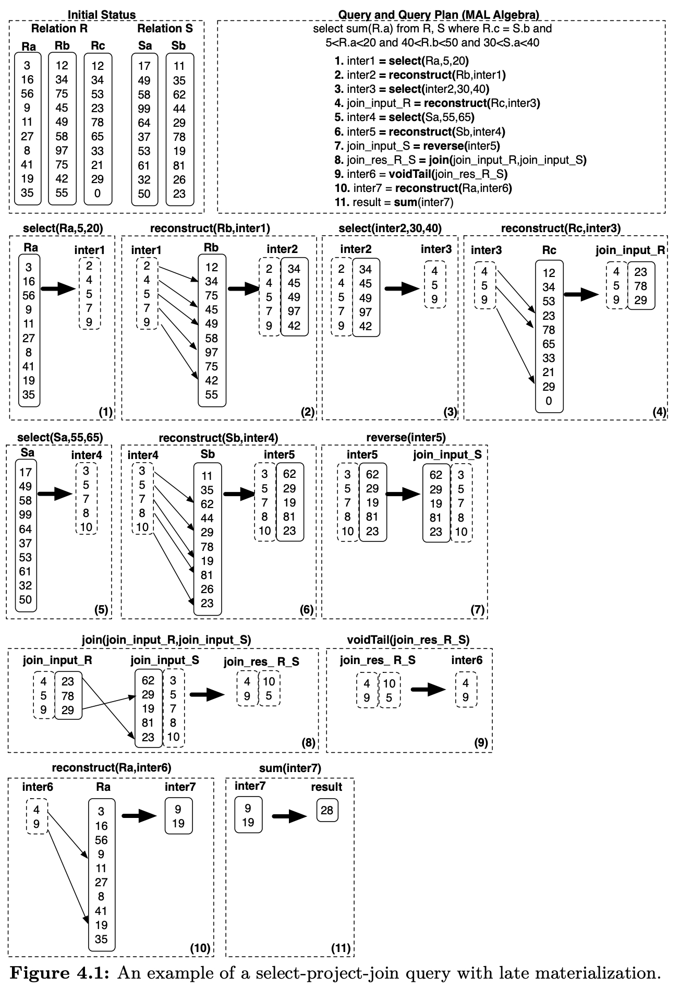

具体过程图已经很详细了，不再赘述。不过发现两个问题，步骤5是选择$(55,65)$，但是查询里面是$30<S.a<40$，就算是$(55,65)$，最后一个（第十个）是50，也不满足条件啊。

给定位置信息（前一个算子的输出）上述的方法每次取列数据就是一次`tuple`重组。如果 $N$ 是被某列引用的次数，那么至少需要 $N-1$ 次重组。跨列的`tuple`对齐以及顺序访问模式降低了`tuple`重组的开销。上面的示例使用数组表示位置信息，可以优化为`bit vector`或者是像文献 80 那样先分别处理最后再合并。

`C-Store`投影的`tuple`重组的开销更低。投影按照某列排序，其他列也按照此列调整过，因此，重组就是把不同列的同一个位置的值取出重组即可。这种方式是更好的访问模式，增加缓存命中。`database cracking`通过自组织达到了相同的目的，根据负载对部分列进行排序，避免预先整体排序投影。

**Advantages of late materialization** 延迟物化有四个好处。首先，选择和聚集算子避免了不必要的`tuple`重组，减少了开销。第二，如果数据是被压缩过的，重组`tuple`的时候必须解压缩，这消除了前面描述的直接操作压缩数据带来的优势。第三，直接操作列存数据，缓存命中高。因为缓存行没有被其他列的数据污染。这一点特别重要，因为现代 CPU 和内存之间的带宽往往是瓶颈。第四，在定宽列中，向量化能进一步提升性能。在行存中，如果某列是变宽的，那么整行就是变宽的。延迟物化，定宽列能被单独处理。

但是在某些极端情况，延迟物化性能要差一点。比如在很多列上使用制谓词（比如`Where salary > 100 AND age > 5...`），多个中间位置信息求交集再物化大多数`tuple`，整体开销可能会比简单的重组再过滤要大，因为有很多位置信息计算的开销。（个人感觉使用`bit vector`）逐列过滤，可以避免这个问题）。

**Multi-column blocks** 有几个进一步提升`tuple`重组性能的方向，甚至是消除重组开销。顶层设计是存储一组列而不是一次一列，这成为`multi-column blocks` `vector blocks` `column-groups`。我都统一称为列组。

列组包含从某个位置开始的列的子集的水平划分，压缩原始信息存储。可以和 PAX 相比，不同点是不要求所有的列都在一页中。列组允许谓词单独的应用于单独一列，位置信息交给交集算子得到交集，输出一个位置信息作为结果。这些数据结构可以输送到更上层的算子。

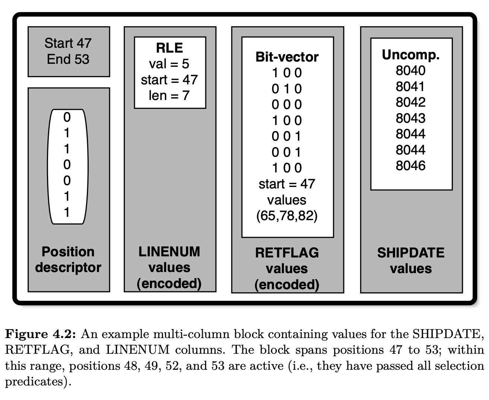

尽管列组不能消除对位置信息求交集，但是由于一次只处理很小的一个子集，可以以流水线形式输出谓词结果（位置向量）然后给交集算子处理，使得重组`tuple`时这些信息仍旧在缓存中。如果不涉及`join`算子，延迟物化都是更优的。不过正如下一节的描述，如果不对`join`做优化，延迟物化反而会带来问题。

IBM BLINK 提出了一种更灵活的列组形式。某个页面的列组可以存成行的形式。和传统行存不同，数据仍旧是定宽紧密的数组，页面中的子集数据会粘在一起，形成一个矩阵。对于需要这些列（不需要其他列）的查询和算子而言完全不需要中间结果和`tuple`重组。

类似的思想也可以用于行存系统。页面中只存放某些列，避免从磁盘读取不必要的数组，不过数据本身是行存存放，直接交由行执行器。

下图是不同的情况。一次存放一列或者多列，多列的话可以是单独列存，也可以是定宽的行。

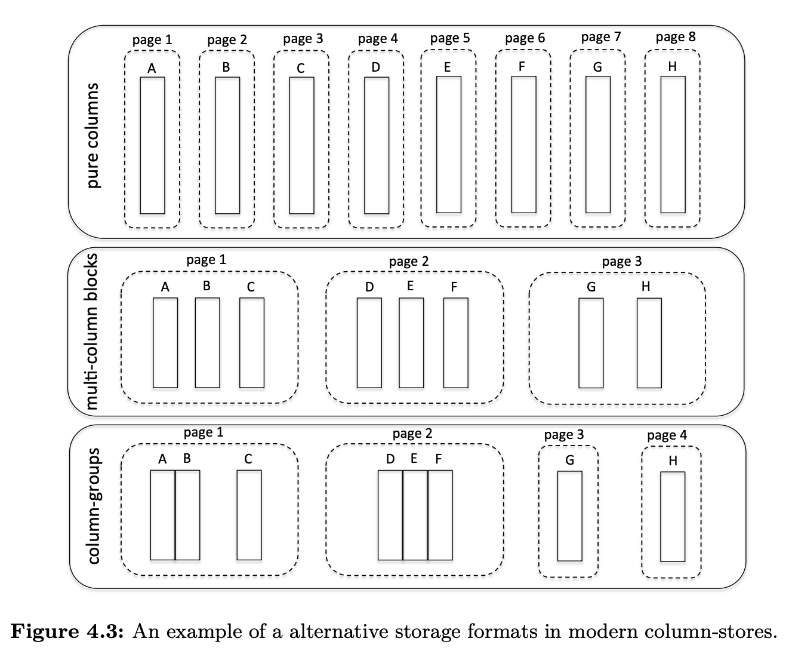

现代列存系统，包括`Vertica`, `VectorWise`, `IBM BLU`，都支持列组或者其变体。不过列组有一个缺点：需要实现决定哪些列放到一起。这就需要对工作负载有理解且访问模式相对固定。`VectorWise`研究表明，根据访问方式的期待收益比转化成本高时，即使在查询期间构建列组都是有收益的，`vision system`需要能够根据查询模式不断调整列存结构。

### Joins
`join`为列存系统提供了大量的优化机会，但是如果不妥善处理的话，同样会导致性能瓶颈以及复杂度的提升。如果早期物化了`tuple`，那么可以直接送给行执行器然后输出结果。不过，有几种延迟物化的算法可以替代。最直接的方式是仅把`join`谓词相关的列作为输入传给`join`算子。以`hash-join`为例，这使得哈希表更紧凑，扫描时有更佳的访问模式。哈希表越小，缓存命中越好。`join`的输出是一对位置向量（标记输入数据的位置）。下面是长度为5的列和长度为4的列的例子：

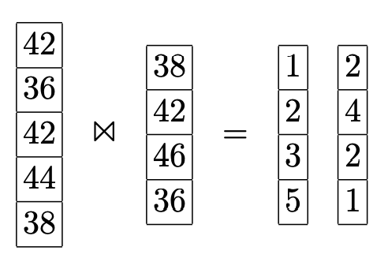

对于大多数`join`算法，左边（outer）是排序的，而右边（inner）是不排序的。原因是左边常常按序遍历访问，而右边需要检查是否满足`join`谓词。对于其他`join`算法（比如对输入进行排序或重分区），那么左右两边都是未排序的。不管怎样，至少有一边是未排序的。未排序可能会带来性能问题，因为通常`join`之后还需要访问其他列的数据，比如如下查询
```sql
SELECT emp.age, dept.name
FROM emp, dept
WHERE emp.dept_id = dept.id
```
需要从`emp`得到`name`，从`dept`得到`name`。乱序的取值会在不同的位置上跳跃，而乱序访问远远慢于顺序访问，从而有性能问题。

幸运的是是有很多针对这种情况的优化。其中一个想法是`Jive join`[64, 89]。回到前面的例子，输出是

|  |  |
|--|--|
| 1 | 2 |
| 2 | 4 |
| 3 | 2 |
| 5 | 1 |

右边的位置信息是未排序的。假设右边对应的列是以下用户名

|  |
|--|
| Smith |
| Johnson |
| Williams |
| Jones |

`Jive join`的核心思想是给位置信息添加一列，这一列是连续递增的。

|  |  |
|--|--|
| 2 | 1 |
| 4 | 2 |
| 2 | 3 |
| 1 | 4 |

对位置信息排序，这会导致新增列无序。

|  |  |
|--|--|
| 1 | 4 |
| 2 | 1 |
| 2 | 3 |
| 4 | 2 |

这样就可以顺序提取我们需要的信息了，然后放到数据结构中。

|  |  |  |
|--|--|--|
| 1 | 4 | Smith |
| 2 | 1 | Johnson |
| 2 | 3 | Johnson |
| 4 | 2 | Jones |

最后，再按照新加的列排序，那么数据列就回到了原始的顺序，和左边的表就匹配起来了。

|  |  |  |
|--|--|--|
| 2 | 1 | Johnson |
| 4 | 2 | Jones |
| 2 | 3 | Johnson |
| 1 | 4 | Smith |

付出两次排序的代价之后，任意列都可以顺序访问。排序的代码和`join`输出的大小正相关。由于大多数数据库都有一个高效的外排算法，相比之前 native 的算法，能够有效解决由于延迟物化而随机访问引入的性能问题。

上述算法还能改进。研究表明，为了避免随机访问，对`join`之后的列全排序是不必要的。这是因为大多数存储都把数据放到多个连续的存储块中，在块内随机访问的开销远小于在所有块中随机访问。所以无需全排列，只要以存储块为划分，块之间排序即可。块内部仍旧是无序的，块内随机访问很快（这就是内存和磁盘、缓存和内存之间的区别）。那么我们读取列值的时候，块维度是有序的，但是整体是无序的。`Radix Join`实现了这种思想，在读数据之前对位置向量按照块来划分，读取数据之后恢复之前的顺序。

由于实现的复杂度，商业数据库并没有完全实现延迟物化，尽管这在学术界被证明是有效的。有的使用了混合延迟物化，对于左表，只把`join`谓词列给算子，因为它可以有序遍历，对于右表，由于是无序的，那么就把所有涉及的列物化好，再作为算子的输入。那么`join`算子的结果是位置信息以及对应的物化好的右表记录。然后按序遍历左表的值，和右表进行二次物化。这种方法的好处是只物化左表，避免利用无序的右表信息来物化右表。对于左右都是无序的情况，则不做延迟物化。

列组是一个表示右表的方法。把多列直接送给算子，而不是物化好的`tuple`。然后和左表通过位置信息读取的数据再重组`tuple`。对于选择率很低或者`tuple`数很少的时候，这个方法性能比较好。否则，由于需要内表特殊的`tuple`多次来重组，性能就会变差。

新千年，列存重生，大量针对列存`join`的研究 [9, 10, 6]。这些研究的共同点都是把适配列存操作放到第一位，关注内存性能、对硬件属性和趋势敏感、缓存意识、SIMD 指令、避免随机访问和`pointer chasing`（一系列不规则的跳转导致了无规则的随机访问）。

### Group-by, Aggregation and Arithmetic Operations
分组、聚集和算术算子和前面讨论的类似，利用延迟物化和向量化，只工作在相关列，数据是定宽紧凑的数组，利用 SIMD 指令，使用 CPU、缓存友好的模式访问数据。

**Group-by** 在列存中，分组往往基于散列表实现。创建一个小巧的哈希表，只用于分组相关的列，扫描时有更好的访问模式。

**Aggregations** 聚集算子深度依赖列存布局。用一个紧凑的`for`循环计算相关列即可。比如`sum` `min` `max`，仅仅扫描需要的列（中间结果也是列存），最大化内存带宽。

**Arithmetic operations** 查询中有很多算术运算（比如加减乘除），也可以利用列存布局高效的执行。比如`select A+B+C From R`，我们先算前面的和`inter=add(A, B)`，然后把中间结果和下一个运算一起运算`res=add(C, inter)`。向量化可以最小化内存占用，将中间结果立即和下一个向量进行运算，避免物化中间结果。

### Inserts/updates/deletes
列存比行存对更新更敏感。因为不同的列单独存放，更新一条记录会涉及多次随机 I/O。而行存只用一次。列组可以减少 I/O 次数，但是还是会有多次。

列存除了垂直分片，还大量使用压缩和排序某些列。即使一次插入多条，也涉及很多随机 I/O。压缩使得更新操作更复杂，需要解压缩，变更，再写回磁盘。如果更新的数据不在原有位置会更复杂。

一些列存系统，比如`C-Store`和`MonetDB`，架构都分为读存储（`read-store`）和写存储（`write-store`），前者复杂管理所有的批数据，后者只管理最近的更新。结果就是查询需要从读存储获取基础信息和从写存储得到差量信息，即时合并结果。为了保持写存储很小（在内存中），周期性的输入读存储中。

一个实现 WOS 比较直接的想法是在内存中保存差量数据（插入、更新、删除）。`MonetDB`使用列，每个基本列都有两个附属列，辅助处理等待处理的插入和删除的数据，更新用删除加插入来实现。`C-Store`使用行格式实现 WOS，每次更新只需要一次 I/O 操作（但是数据合并到列存里面的时候开销会更大）。分开存储差量的劣势就是每次查询都需要合并读存储和差量数据。这里有一些优化。可能可以同时执行（或者部分）查询在两个存储上，在最后合并结果。比如选择算子可以在基础列、插入列和删除列上分别执行，然后合并结果，送到下一个算子。此外，我们可以用一个`bool`表示是否删除，那么更新 bitmap 即可。

`VectorWise`使用新颖的技术——`Positional Delta Trees`（PDT）——来存储差量。优势是合并时根据差量的位置信息而不是排序键，后者更复杂。当查询提交的时候，我们先得到表的哪些位置会受到影响。这样，把查询时间转移到了更新时间上，这符合读优化。如果使用 PDT，我们要使用`MergeUnion/MergeDiff`来对每个查询都做合并处理；此外，查询每次都要读取排序键，但是如果更新列不是必须的话，增加 I/O。

寻找位置是很棘手的事情，因为插入和删除操作会影响后续记录的位置。PDT 使用了计数类型的 B 树，对数量级的更新成本。

PDT 的差量数据结构和差量文件一样，可以分层：差量再差量，再差量等等。分层架构可以适用于内层体系。最小的差量放到 CPU 缓存中，稍微大一点的放到内存中，更大的可以放到磁盘上。此外，分层结构是实现隔离和事务的工具。想法是一个新的事务将一个最初为空的顶层 PDT 添加到已经存在的基层 PDT 上。通过共享不可变的基层 PDT，可以提供快捷的快照以及隔离性。当事务使得数据发生变化时，差量会被写入到顶层的 PDT 中，它有效地捕获了事务的写。在[41]中展示了在并发事务下保持 PDT 位置跟踪一致的算法，正是实现乐观并发控制所需的算法。

最近的研究表明，一个系统同时支持 OLAP 和 OLTP 是一个趋势，使用列存首先提出的原则可以提升 OLAP 的性能。`System Hyper [57, 56]`是这个领域最典型的代表，利用硬件帮助实现 shadowing page，避免更新的时候锁页。`SAP HANA [26]`即使用行存也是用列存，能够利用两边的功能。

### Indexing, Adaptive Indexing and Database Cracking
我们将讨论列存当中的索引以及自适应索引。尽管列存提供了远好于行存的扫描性能，仍然可以通过索引来进一步优化。列存的扫描可以通过一个循环来遍历数组，非常高效且 CPU 友好，但是使用索引可以能够将进一步提高性能 1 个或几个数量级。关于列存索引的样子，研究表明在完全排序的列上工作比在列上维护内存树结构（例如 AVL 树）更好。遍历树时引入了随机访问，另一方面，如果我们完全复制和排序基列，我们可以在范围查询时利用二分搜索。

**Indexing** `C-Store`提出了投影的概念。每个表可能以不同的排序方式存储多个副本。此外，每个副本不需要包含表中的所有列，而仅包含投影相关的列。查询可以使用单个投影就可以了，理想情况下，该投影用于谓词最相关的属性进行排序，用于降低查询开销以及元`tuple`重组的开销。相比于传统行存，列可以被充分压缩，实现这些额外的投影不会带来非常显著的存储开销。当然，投影的数量和类型取决于工作负载，并且会为数据更新带来额外的复杂度（与传统行存数据库中的有索引的情况相似）。

另一个在列存中经常用到的索引形式是 zonemaps。在页面级别存储一些轻量的元数据，比如 min/max 等。比如，Netezza 使用这种形式的索引来提高扫描的性能，因为可以通过 min/max 这些元数据来快速判断当前页面中是否包含符合查询条件的数据。其他有有创意的想法包括使用缓存敏感的 bitmap[86]，它为每个区域创建一个 bitmap，而不是为每个页面记录 min/max 等信息.

**Database Cracking and Adaptive Indexing** 所有形式的索引都需要空闲的时候设置，并且需要熟悉工作负载相关的知识，但是这些通常都是稀缺资源。我们将讨论列存中有关`database cracking`的早期的尝试 [44]，`database cracking`开创了现代数据库系统中自适应索引的概念，并引入了为自适应索引量身定制的列存架构 [48, 49, 50, 51, 37, 35, 36, 83]。还会讨论这些工作的基础和通过利用列存架构的特性在列存环境中蓬勃发展的原因。

传统索引的基本问题之一是：对于将要创建的索引做出预先决定。考虑到时间以及空间因素，创建所有可能的索引是不切实际的，因为既没有足够的空间来存放这些索引，也没有足够的时间来创建和维护这些索引。因此，我们需要决定如何优化数据库系统，选择要创建的索引。然而，对工作负载充分了解后，才能作出上述决策，包括如何使用数据库，常用查询模式是怎样的，对用户来讲哪些是关键数据等等。随着我们进入大数据时代，越来越多的应用场景表现出不可预测的行为（ad-hoc），这意味着无法依赖工作负载来作出选择。此外，越来越多的应用要求在尽可能短的时间内对新数据达到较高的查询性能，换句话说，没有时间来分析预期工作负载然后确定创建什么样的索引。

这种动态和在线的场景是发展自适应索引的主要动机。其主要思想是：数据库仅会自动创建必须的索引。a) 仅在必要时创建；b) 仅创建必要的索引；c) 持续调整索引。通过`database cracking`，一旦有数据，数据库立即可用（无需额外的时间来创建索引）。系统用得越多，如果有足够的空闲时间和工作负载相关的信息来充分准备索引，则性能就越接近最佳性能。

主要创新是物理数据存储会随着查询而发生变化，对于每个查询 $q$ 而言，是一个提示，告诉我们数据应该如何组织。

对于一个查询 $A<10$，数据库会把这个列 $A<10$ 的数据放到列的前面，其他数据放在后面。当后续查询是 $A>v_1,v_1>10$，那么只需要搜索并`crack`后半个区域，类似的 $A<v_2,v_2\leq 10$，那么只需要扫描并`crack`前半个区域。`crack`操作是查询的一部分，无需额外的管理。下面图展示了 Q1 分成三个部分，Q2 进一步分成两个部分。

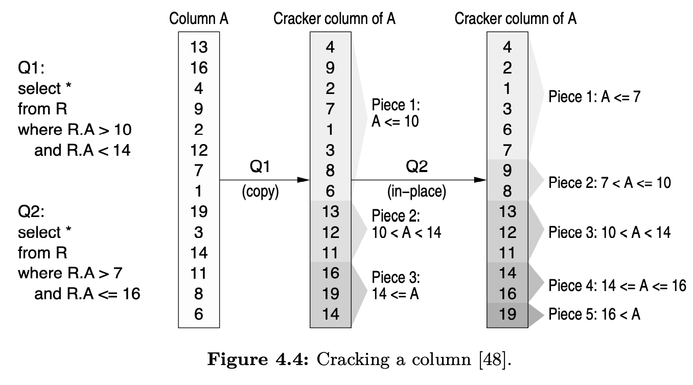

`cracking`能够有效提高列存的性能。Sloan Digital Sky Surve最近的实验表明，开启了`cracking`的`MonetDB`可以完成 160000 次查询，而未开启`cracking`的`MonetDB`还在创建索引，且仅创建了一半，因此无法响应任何查询。另外，在 TPC-H 基准测试中，`MonetDB`创建所有索引、投影等耗费了 3 个小时，而开启了`cracking`的`MonetDB`，则在无任何准备工作的前提下，几秒内就响应了所有的查询 [50]。下图展示了一些分析结果。

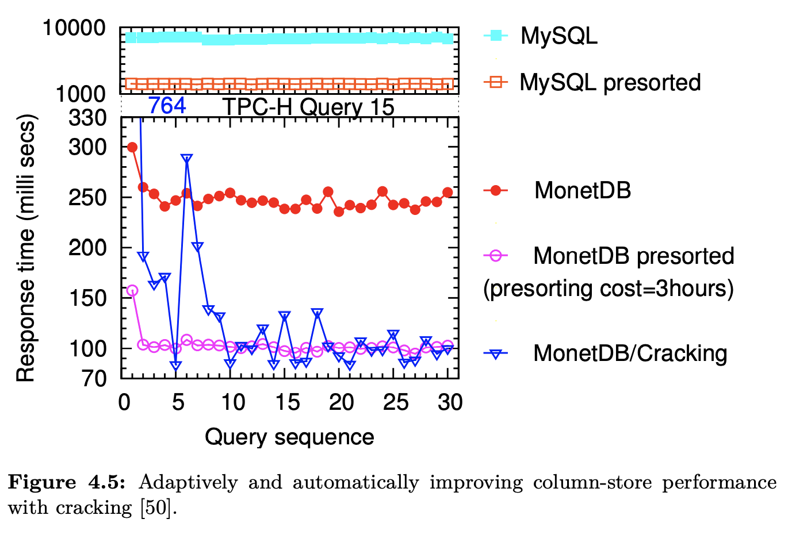

普通的列存（`MonetDB`）相比于行存储系统（`MySQL`）具有更好的性能，即便在行存使用了 B-tree 的情况下（`MySQL` presorted）。在列存系统开启投影后，能够进一步带来性能增益（`MonetDB`/presorted），但是以巨大的初始化开销作为代价，在此次 TPC-H 基准实验中，花费了 3 小时来创建投影。另一方面，当`MonetDB`开启`cracking`后，系统能够在无准备的情况下，立即响应查询请求，并且在几次查询后就会达到一个较好的性能，且性能与花费了大量时间进行前置准备工作（例如创建索引等）的系统的查询性能接近。

`cracking`技术会将数据库分解成多个较小且易于管理的片段。`cracking`通过逐渐改善数据的访问，并最终提升查询性能 [48, 50]，甚至可以提升更新的性能 [49]。`cracking`在列存系统中，仅作用于列这个维度，查询导致的数据重组仅限定在与查询相关的列中，而不是整张表。`cracking`根据查询需要在多个列中进行传播，其中一些`cracker`是根据存储限制动态创建和删除的。在 [35] 中，作者展示了如何通过有限的并发控制来启用并发查询，具体来说就是仅依赖 latch，因为`cracking`仅改变索引结构而不会改变索引内容。另外，`stochastic cracking`[37] 通过不太严格地遵循查询边界来执行非确定性的`cracking`动作。通过这种方式，它使得列的分区更加均匀，避免产生大块的未分区的区域，降低未来分区的成本。

后续的研究 [51] 扩展了最初的`cracking`，采用了具有显式排序或者非显式分区的分区/合并逻辑。原始的`cracking`可以看做是增量快速排序（分区动作是由查询触发的），而这些最新的`cracking`介于增量快速排序和增量归并排序之间，并设计了一系列索引自适应算法。

`cracking`采用了完全不同的方法。查询处理所耗费时间被认为是极其宝贵的，除了处理当前查询之外不会发生任何其他事情。而`cracking`另辟蹊径，会持续优化索引，同时获得短期或者长期的增益。这是利用某些列存架构特性的直接副作用。特别地，批量处理和列式存储使这些自适应索引的思想成为可能。通过一次存储一列数据，以定宽密集数组的形式存储在连续的内存区域中，意味着`cracking`能以最小代价重组这个数组（相比于将数据存放在 slotted page 中的行存，定位单个值可能需要进行重定向）。此外，批量处理意味着每个算子在查询计划继续执行下一个算子之前完全消耗其输入列，对于`cracking`来说，这意味着每个算子工作在单一的列上，有助于有效地执行所有细化操作。向量化处理同样有效，主要区别是每个向量是独立`cracked`的，并且根据策略数据也可能跨向量移动 [51]。

前面讨论的`C-Store`中的投影是另一种形式的索引，它存储了按照不同属性排序的多个副本。从上层的视角来说，`cracking`与`C-Store`中的投影起到了相似的作用，只不过以一种更加自动化、动态的方式来实现。我们无需事先决定需要创建哪些投影，自然也无需为创建投影花费额外的时间成本。

除了无需工作负载相关的信息以及空闲时间之外，`cracking`还允许用户在使用数据库系统的时候无需进行过多的调优。它能够降低使用数据的配置成本，且无需数据库管理员进行索引相关的决策以及对索引的维护以及调优。

过去针对数据库的研究中并没有针对自适应索引的。其中，与`cracking`概念最接近的是 partial indexes [87]，它允许只在表的一部分上创建传统的非自适应索引，从而避免索引数据中包含与查询无关的数据（需要基于工作负载相关的信息）。

### Summary and Design Principles Taxonomy
本章中提到的设计原则已经被大多数列存所使用，并为所有后续意识到主存和缓存的设计提供了共同的基础。

从上述众多功能中可以看出，现代列存不仅仅是一次一列存储数据。它们提供了为现代硬件和数据分析量身定制的全新数据库架构和执行引擎。

在许多场景中，列存有助于最大限度地利用这些新设计原则。我们可以说主要由`VectorWise`和`C-Store`重新定义的现代列存系统是包含所有这些设计原则的系统，而不仅仅是面向列的存储布局。

正如我们在本节和前几节中所讨论的，现代列存的一些设计原则，过去曾在传统行存的背景下以某种形式进行过研究。然而，在`MonetDB`、`VectorWise`和 `C-Store`被提出之前，没有任何系统可以提供具有所有这些设计原则的完整 DBMS 的设计和实现。本质上，它们标志着对数据库内核进行全面重新设计的必要性，其灵感来自于数据库社区对 DBMS 架构进行了数十年的研究。

下图展示了上述章节中讨论的一些特性以及设计原则，这些特性以及设计原则共同定义了现代列存系统，并且指出了这些特性以及设计原则与在行存背景下独立提出的一些特性以及设计原则的相似性。

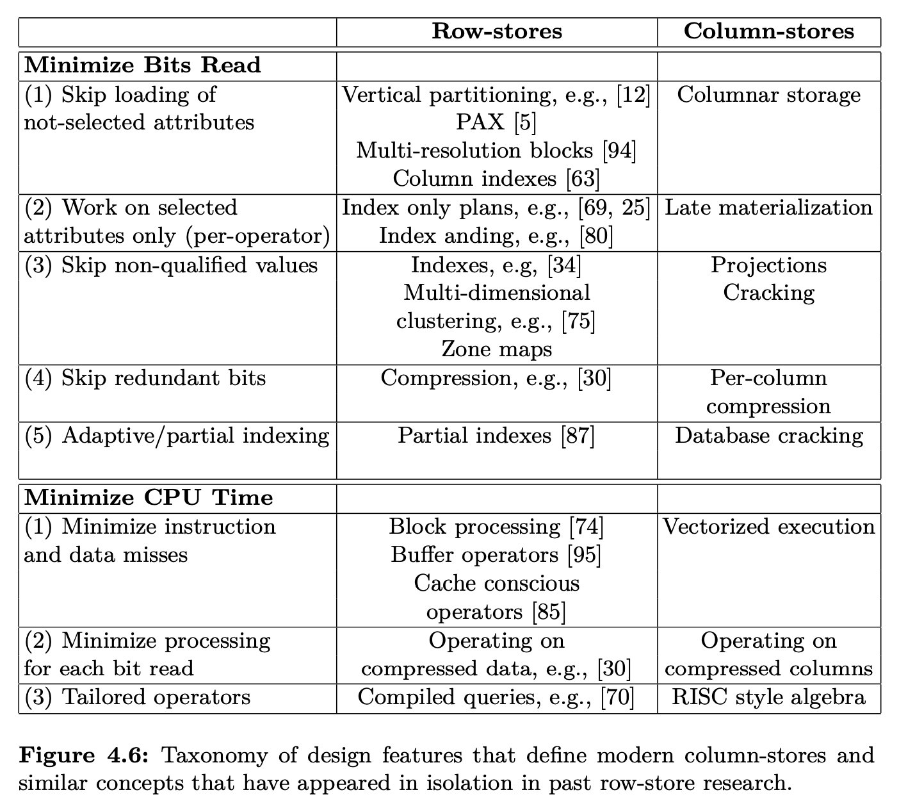

## Discussion, Conclusions, and Future Directions
简要比较`MonetDB` `VectorWise` `C-Store`，然后分析行存数据库模拟列存的可能性，最后给出结论和进一步的工作。

### Comparing MonetDB/VectorWise/C-Store
读优化的数据库得益于 CPU 的高效处理。这三个数据库以不同方式使用了面向块的处理模式。`MonetDB`把一次一列做到了极致，但是引入了全物化的问题。后两者使用了流水线，允许块在不同算子之间传递，而不是以`tuple`传递。`C-Store`尽可能使用压缩形式，`VectorWise`在执行和存储架构都遵循向量化策略。

加载数据和更新，`MonetDB`和`C-Store`使用类似的方案，使用删除 bitmap 并且使用临时表存插入数据（WOS）。对于大量`join`查询，需要在`join`前合并插入和删除的数据，引入很多合并开销。`VectorWise`用 PDT 数据结构来降低这种开销，不过实现较为复杂，同时插入和删除的开销更大点。

`MonetDB`除了对字符串进行编码外没有使用压缩，表也没有特别的存储顺序。其余两者大量使用压缩，`C-Store`只提供了压缩执行。`C-Store`允许以不同的顺序排序存多个投影以加速查询。`VectorWise`使用稀疏索引记录了`tuple`范围的最大值和最小值，减少了谓词查询时的 I/O。

### Simulating Column/Row Stores
一个常见问题是能不能使用传统的面向行的系统来模拟基于列的系统。有两种实现：完全的垂直分区设计和为每列创建一个索引。下面讨论这两个方法，并且列出每个方法的优劣。

**Vertical Partitioning** 最直接的模拟方式是像最早讨论的列存系统一样，完全的垂直划分，每一列一个表。那么需要一个机制把不同列的同一行对齐。列存系统隐含了这个信息，但是行存做不到。每个表（列）增加一个整数列（这比主键更可取，因为主键可能很大，有时是多列组合）表示位置信息。比如下面的表`employee`：

| Name | Age | Salary |
|--|--|--|
| Smith | 40 | 56,000 |
| Johnson | 29 | 34,000 |
| Williams | 56 | 78,000 |
| Jones | 34 | 35,000 |

增加位置列

| Position | Name | Age | Salary |
|--|--|--|--|
| 1 | Smith | 40 | 56,000 |
| 2 | Johnson | 29 | 34,000 |
| 3 | Williams | 56 | 78,000 |
| 4 | Jones | 34 | 35,000 |

我们为每一列创建一个表。第 $i$ 个表包含两列，位置列和原始表的第 $i$ 列

|  |  |
|--|--|
| 1|  Smith |
| 2|  Johnson |
| 3|  Williams |
| 4|  Jones |

|  |  |
|--|--|
| 1 | 40 |
| 2 | 29 |
| 3 | 56 |
| 4 | 34 |

|  |  |
|--|--|
| 1 | 56,000 |
| 2 | 34,000 |
| 3 | 78,000 |
| 4 | 35,000 |

当查询需要取同一个表的多列的时候，需要改写查询，按照位置信息`join`。

这种方法的缺点有：1）额外的空间开销，扫描时的 I/O 开销；2）需要一个适配层，把逻辑表的查询改写成查物理表；3）引入`join`，组合爆炸，压垮大多数优化器，性能惨不忍睹；4）每一列一个表，现在每列的每个`tuple`可能会带一个`tuple`头，这个大小可能远远超过数据本身；5）无法使用面向列的压缩算法，比如 RLE。（[20] 给出了缓解办法）。

**Creating an index on every column** 为每一列创建一个索引。能够弥补上述完全垂直划分的大部分问题（2,3,4），但也存在自己的劣势。最明显的是空间开销和更新大量索引的开销。更严重的问题，数据在每个索引中的顺序可能与存储顺序不同，需要将两列或者多列进行物化的时候，需要按照`tuple-id`进行完全`join`。那么，列投影需要读取原始的行记录，那么就损失了列存系统中只读相关列的收益。

### Conclusions
略。（很牛，还有空间，希望能影响其他数据系统）。
