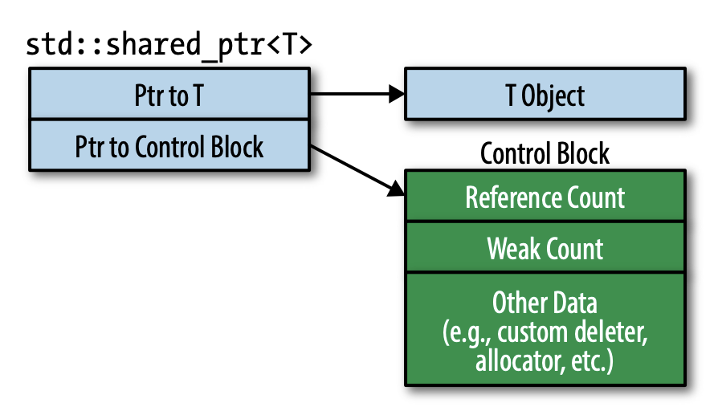

我们既要 GC 的便利性，又要释放资源的确定性。C++11 引入的 `std::shared_ptr` 是结合两者的一种方式。通过 `std::shared_ptr` 访问的对象的生命周期由共享所有权来控制。没有一个 `std::shared_ptr` 拥有这个对象，但是当没有 `std::shared_ptr` 指向这个对象时，能够确保其被释放。当最后一个指向它的 `std::shared_ptr` 不再指向它时（比如析构，被赋值等），负责析构这个对象。

`std::shared_ptr` 通过引用计数（`reference count`）知道有多少个 `std::shared_ptr` 指向某个对象。`std::shared_ptr` 的构造会自增引用计数（移动 `std::shared_ptr` 除外），`std::shared_ptr` 的析构会进行自减操作，拷贝 `std::shared_ptr` 会包含两者（比如 `sp1 = sp2`，`sp1` 会指向 `sp2` 只想的对象，同时，`sp1` 原来对象的引用计数会自减，而 `sp2` 对应的对象的引用计数自增）。`std::shared_ptr` 发现引用计数为零，没有 `std::shared_ptr` 再指向这个对象，会析构这个对象。

引用计数的存在会有一些性能问题：
* `std::shared_ptr` 大小是两倍于裸指针的大小。除了指向对象的指针外，还有一个指针指向引用计数。
* 引用计数占用的空间需要动态分配。引用计数的值和指向的对象绑定，但是原始对象并不知道引用计数的存在，所以没有地方存这个值。[Item 21](./21_Prefer_std_make_unique_and_std_make_shared_to_direct_use_of_new.md) 会解释通过 `std::make_shared` 构造 `std::shared_ptr` 可以避免动态分配的开销，但是 `std::make_shared` 并不适用于所有场景。
* 引用计数的自增和自减必须是原子操作。因为读写可能在不同的进程，如果不是原子操作，那么结果是错误的。原子操作往往比非原子操作耗时，哪怕只有一个字的长度，所以可以假设读写是相对耗时的。

从一个 `std::shared_ptr` 移动构造一个 `std::shared_ptr`，原始的 `std::shared_ptr` 会被设置成 `nullptr`，不再指向原来的对象，而新的 `std::shared_ptr` 开始指向这个对象，那么该对象对应的引用计数既不需要自增也不需要自减。拷贝 `std::shared_ptr` 需要自增而移动 `std::shared_ptr` 不需要，因此，移动操作要快些。

和 `std::unique_ptr` 类似，`std::shared_ptr` 默认也使用 `delete` 析构对象，同时，也可以自定义删除器。不过和 `std::unique_ptr` 不同的是，删除器类型并不是 `std::shared_ptr` 的一部分。
```cpp
auto loggingDel = [](Widget *pw) // custom deleter
{                                // (as in Item 18)
    makeLogEntry(pw);
    delete pw;
};

std::unique_ptr<Widget, decltype(loggingDel)> // deleter type is
    upw(new Widget, loggingDel);              // part of ptr type
std::shared_ptr<Widget>                       // deleter type is not
    spw(new Widget, loggingDel);              // part of ptr type
```

`std::shared_ptr` 的设计更灵活。考虑两个 `std::shared_ptr<Widget>` 对象，删除器类型不同，但是是智能指针是同一个类型，所以能放到对应类型的容器中。
```cpp
auto customDeleter1 = [](Widget *pw) {}; // custom deleters,
auto customDeleter2 = [](Widget *pw) {}; // each with a different type
std::shared_ptr<Widget> pw1(new Widget, customDeleter1);
std::shared_ptr<Widget> pw2(new Widget, customDeleter2);

std::vector<std::shared_ptr<Widget>> vpw{pw1, pw2};
```
这两个对象可以互相赋值，也可以传递给接受 `std::shared_ptr<Widget>` 参数类型的函数中。这对于 `std::unique_ptr` 而言是行不通的。

另一个问题是，当自定义删除器后，`std::unique_ptr` 的大小可能会变大，甚至由于函数对象包含大量数据而特别大，但是 `std::shared_ptr` 的大小始终是两个指针的大小。

本质上，需要的内存还是会变大，但是这没有占用 `std::shared_ptr` 自身的空间。这块内存是分配到了堆上。前面说过，`std::shared_ptr` 有一个指向引用计数的指针，准确地说，指向控制块，而引用计数是控制块的一部分。如果有自定义删除器，那么控制块就会包含这部分信息，如果有自定义分配器，那么控制块也会包含自定义分配器相关信息。除此之外，还会包含一个次级引用计数，[Item 21](./21_Prefer_std_make_unique_and_std_make_shared_to_direct_use_of_new.md) 会解释。因此 `std::shared_ptr<T>` 的内存布局大致如下。



当第一次构造 `std::shared_ptr` 时，会构造控制块。一般情况下，构造 `std::shared_ptr` 的函数无法知道是否已经有 `std::shared_ptr` 指向该对象了。因此，创建控制块遵循以下几条规则。
* 使用 `std::make_shared`（[Item 21](./21_Prefer_std_make_unique_and_std_make_shared_to_direct_use_of_new.md)）构造 `std::shared_ptr` 时会创建控制块，因为这是构造新的对象，不可能有其他 `std::shared_ptr` 指向该对象。
* 从独占指针 `std::unique_ptr` 构造 `std::shared_ptr` 时会创建，因为独占指针没有控制块。同时，`std::shared_ptr` 破坏了独占指针的所有权，所以独占指针被设置成了 `nullptr`。
* 使用裸指针构造 `std::shared_ptr` 时会创建控制块。如果想用已有的控制块的对象构造 `std::shared_ptr`，那么应该使用 `std::shared_ptr` 或 `std::weak_ptr`（[Item 20](./20_Use_std_weak_ptr_for_std_shared_ptr_like_pointers_that_can_dangle.md)）作为参数，而不是裸指针。`std::shared_ptr` 构造函数会使用 `std::shared_ptr` 或 `std::weak_ptr` 的控制块而不是创建一个新的。

如果使用裸指针构造 `std::shared_ptr`，就在向未定义行为狂奔，因为这样会有多个控制块，那么就会有多个引用计数，当每个引用计数都归为零的时候，会析构对象多次！因此，下面代码是相当不好的示范。
```cpp
auto pw = new Widget;                         // pw is raw ptr
std::shared_ptr<Widget> spw1(pw, loggingDel); // create control block for *pw
std::shared_ptr<Widget> spw2(pw, loggingDel); // create 2nd control block for *pw!
```
直接使用 `new` 而不是智能指针管理背离了这一章的初衷，不过这并不会导致未定义的行为。

随后，我们用裸指针 `pw` 构造了两个 `std::shared_ptr<Widget>`，当它们的引用计数归零时，会 `delete` `pw` 两次，而这才是导致未定义行为的原因。

这里有两个需要注意的点。第一是不要用裸指针构造 `std::shared_ptr`，而要使用 `std::make_shared`（[Item 21](./21_Prefer_std_make_unique_and_std_make_shared_to_direct_use_of_new.md)），但是如果需要自定义删除器，那么不能用这个方法。第二是如果不得不使用裸指针构造 `std::shared_ptr`，直接传 `new` 对象而不是指针变量。因此，上面的代码改写为：
```cpp
std::shared_ptr<Widget> spw1(new Widget, // direct use of new
                             loggingDel);
```
这样，我们在创建第二个 `std::shared_ptr` 时就无法使用裸指针了，而不得不使用第一个 `std::shared_ptr` 作为参数，这样就不会有问题。
```cpp
std::shared_ptr<Widget> spw2(spw1); // spw2 uses same control block as spw
```
另一个问题是使用 `this` 来构造 `std::shared_ptr`。假定我们使用 `std::shared_ptr` 来管理 `Widget` 对象，我们有一个已经处理过的列表如下
```cpp
std::vector<std::shared_ptr<Widget>> processedWidgets;
```
假定 `Widget` 有一个处理函数
```cpp
class Widget
{
public:
    void process();
};
```
那么其实现可能如下
```cpp
void Widget::process()
{
    // process the Widget

    // add it to list of processed Widgets; this is wrong!
    processedWidgets.emplace_back(this);
}
```
注释中已经说明代码有问题了。原因是使用 `this` 构造了一个 `std::shared_ptr` 指向当前的 `Widget (*this)`，不过函数外部已经有一个 `std::shared_ptr` 指向该对象（我们的 `Widget` 对象使用 `std::shared_ptr` 管理），嗯，多重引用计数，会出错。

`std::shared_ptr` 提供了解决这个问题的设施。名字略有诡异：`std::enable_shared_from_this`。你想用 `std::shared_ptr` 来管理的类，那么这个类需要继承 `std::enable_shared_from_this`，这样就能安全的用 `this` 来创建 `std::shared_ptr` 了。上面的例子就需要改写为：
```cpp
class Widget : public std::enable_shared_from_this<Widget>
{
public:
    void process();
};
```
`std::enable_shared_from_this` 是一个模板类，模版参数就是继承这个模板类的类。看起来略微有点奇怪，但是这是一种模式，CRTP（`The Curiously Recurring Template Pattern`）。

`std::enable_shared_from_this` 提供了成员方法 `shared_from_this` 从当前对象创建一个 `std::shared_ptr` 而不会重复创建控制块。之前的例子可以改写为
```cpp
void Widget::process()
{
    // as before, process the Widget

    // add std::shared_ptr to current object to processedWidgets
    processedWidgets.emplace_back(shared_from_this());
}
```
`shared_from_this` 会查找当前对象的控制块，然后创建一个 `std::shared_ptr` 与这个控制块关联。这个设计就依赖于调用 `shared_from_this` 已经有一个 `std::shared_ptr` 已经指向当前对象了。如果没有 `std::shared_ptr` 指向当前对象，即找不到控制块，行为是未定义的。

要防止客户端在没有 `std::shared_ptr` 之前调用包含 `shared_from_this` 的成员函数，一般做法是私有化继承自 `std::enable_shared_from_this` 的类构造函数，然后提供一个返回 `std::shared_ptr` 的工厂函数。
```cpp
class Widget : public std::enable_shared_from_this<Widget>
{
public:
    // factory function that perfect-forwards args
    // to a private ctor
    template <typename... Ts>
    static std::shared_ptr<Widget> create(Ts &&...params);

    void process(); // as before
private:
    // ctors
};
```

一个控制块可能有几个字的大小，如果有自定义删除器和分配器，还会更大一些。其实现比想象的还要复杂。使用了继承，还有一个虚函数，确保正确释放对象。也就是说，使用 `std::shared_ptr` 还存在虚函数调用的开销。

这里会有额外的开销，毕竟对资源管理而言，没有最佳方案。就功能而言，这些开销很合理。通常情况下，使用默认删除器和分配器，使用 `std::make_shared` 创建 `std::shared_ptr`，控制块三个字，分配开销近乎没有（详见 [Item 21](./21_Prefer_std_make_unique_and_std_make_shared_to_direct_use_of_new.md)）。对其的解引用不会比裸指针高。引用计数的原子操基本就是一个指令，虽然比非原子操作高。虚函数的开销只有在销毁对象时那么一次。

付出了一点点性能开销，但是得到了自动管理动态分配资源的生命周期的能力。大部分时候，都倾向于使用 `std::shared_ptr` 管理而不是手动管理。如果犹豫其开销，可以想想是否真的需要共享所有权。如果独占所有权可行或者可能可行，那么 `std::unique_ptr` 是更好的选择。性能与裸指针基本没差，还能容易的转化为 `std::shared_ptr`。

反之则不行。如果资源使用 `std::shared_ptr` 管理，那么没有办法修改管理资源的方式了。即使引用计数为 1，也无法改用 `std::unique_ptr`。资源和指向其的 `std::shared_ptr` 到死才分开，没有特例。

`std::shared_ptr` 不能处理原始数组。不像 `std::unique_ptr`，`std::shared_ptr` 的 API 设计只针对单个对象。`std::shared_ptr<T[]>` 不存在。自作聪明的程序员使用 `delete []` 自定义删除器来构造 `std::shared_ptr<T>` 指向一个原始数组。这能通过编译，但是 `std::shared_ptr` 没有提供 `operator[]`，只能通过晦涩的指针运算来模拟。另外，指向单个对象，`std::shared_ptr` 转化为指向基类的指针是合理的，但是对于数组不能这么做，相当于破坏了现有的类型系统。因此 `std::unique_ptr<T[]>` 禁止这么做。更重要的是，C++11 提供了诸多原始数组的替代选项，`std::array, std::vector,std::string`，声明一个指向傻瓜数组（原始数组）的智能指针不是一个好的设计。

## Things to Remember
* `std::shared_ptr` offer convenience approaching that of garbage collection for the shared lifetime management of arbitrary resources.
* Compared to `std::unique_ptr`, `std::shared_ptr` objects are typically twice as big, incur overhead for control blocks, and require atomic reference count manipulations.
* Default resource destruction is via `delete`, but custom deleters are supported. The type of the deleter has no effect on the type of the `std::shared_ptr`.
* Avoid creating `std::shared_ptr` from variables of raw pointer type.
