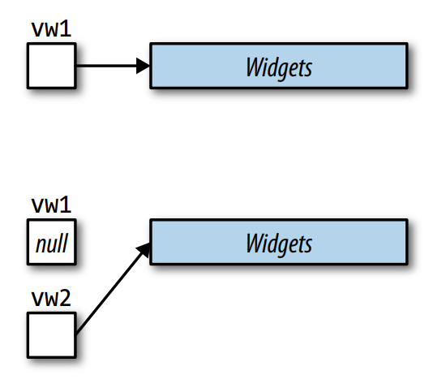
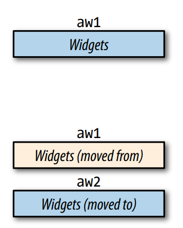

移动语义是 C++11 最核心的功能。你可能听到诸如“移动容器就和拷贝指针的开销一样小”、“拷贝临时变量开销很小，写代码避免它就等同于过早优化”。移动语义确实是这么重要的功能。移动语义不仅仅使得编译器使用开销小的移动操作替代开销大的拷贝操作，而且当条件满足时，应当这么做。使用 C++11 编译器重新编译 C++98 的代码，可能会有性能的提升。

移动语义重要的使其有了传奇色彩。但是传奇，也有夸张的地方。

首先看看不支持移动操作的类型。为了支持 C++11，标准库重新实现了一遍，对于移动比拷贝轻量级的类型，添加了移动操作，类库的新的实现也利用上了这些优势，但是现有的代码库可能并没有为此重写。应用或者类库中没有为 C++11 改写，那么编译器支持移动语义，也帮助不大。如果一个类型没有移动操作，编译器会自动生成一个，但是前提是没有拷贝、移动、析构函数。成员变量或者基类禁用了移动操作，那么也不会为这个类型生成移动操作。对于没有显式支持移动操作，也不符合编译器自动生成移动操作的类型，没有理由期待 C++11 比 C++98 有性能的提升。

即使显式地支持了移动操作，效果可能也不如预期。比如 C++11 所有容器都实现了移动操作，但也不应该认为移动所有容器的开销都很低。对于一些容器而言，没有真正开销小的方式移动其内容；对于其他容器而言，可能有真的开销小的移动方式，但是其中的元素不满足这些条件。

C++11 引入的 `std::array` 容器，满足 STL 接口，本质是内置数组。其他标准容器都是将数据放到堆上，容器自身包含一个指向堆地址的指针即可（实际可能略微复杂，但基本就是如此）。这个指针的存在使得可以在常量时间完成容器的移动。
```cpp
std::vector<Widget> vw1;
// put data into vw1

// move vw1 into vw2. Runs in
// constant time. Only ptrs
// in vw1 and vw2 are modified
auto vw2 = std::move(vw1);
```



但是 `std::array` 没有这样的指针，数据是存放在 `std::array` 内部。
```cpp
std::array<Widget, 10000> aw1;
// put data into aw1

// move aw1 into aw2. Runs in
// linear time. All elements in
// aw1 are moved into aw2
auto aw2 = std::move(aw1);
```



这里 `aw1` 移动到了 `aw2` 中。假定 `Widget` 支持移动操作且比拷贝操作轻量很多，那么移动 `Widget` 的 `std::array` 比拷贝 `Widget` 的 `std::array` 要快的多。所以 `std::array` 是支持移动的。不过移动或者拷贝 `std::array` 都是线性复杂度，因为容器内的元素都需要拷贝或者移动。这离“移动容器就像赋值几个指针一样轻量”相去甚远。

`std::string` 提供了常量时间的移动和线性时间的拷贝的操作。这听起来拷贝比移动快，但也不尽然。许多 `std::string` 实现都有 SSO（`small string optimization`），对于小于等于 15 字节的对象直接存放在 `std::string` 内部而不是堆上。显然，对于很小的字符串而言，移动和拷贝一样快。

对于很多类型而言，存在快速的移动操作，但是很多场景下也会变成拷贝操作。[Item 14](../ch03_Moving_to_Modern_C++/14_Declare_functions_noexcept_if_they_wont_emit_exceptions.md) 解释了 STL 提供了异常安全保证，这样 C++98 代码升级到 C++11 不会被破坏，这样，只有在确定移动不会抛出异常的前提下，才会用移动替代拷贝。

所以在 C++11 中存在几种情况，移动语义并没有优势。

* 不存在移动操作。此时移动会变成拷贝操作。
* 移动并不快。移动操作和拷贝操作一样快。
* 移动操作不可用。在有些上下文，需要无异常，但是移动操作没有标记为 `noexcept`。

还有一个场景，移动也并不那么高效。

* 源对象是左值。只有少数情况（[Item 25](./25_Use_std_move_on_rvalue_references_std_forward_on_universal_references.md)）之外，必须是右值才能移动。

这一节假定没有移动操作、不高效、不可用。这是代码中的典型情况。比如在编写模板代码，无法知道类型的信息，就要保守的使用拷贝而不是移动。对于不稳定的代码而言也是如此，经常的改动使得类型特性发生了变化。

如果情况不符合本节的假设，那么就可以用移动来代替拷贝减少开销。

## Things to Remember
* Assume that move operations are not present, not cheap, and not used.
* In code with known types or support for move semantics, there is no need for assumptions.
