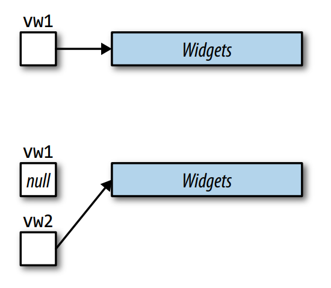
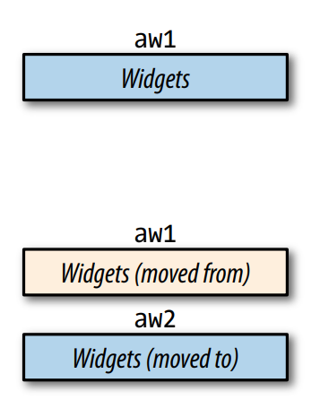

移动语义是 C++11 最核心的功能。你可能听到诸如“移动容器就和拷贝指针的开销一样小”、“拷贝临时变量开销很小，写代码避免它就等同于过早优化”。移动语义确实是这么重要的功能。移动语义不仅使得编译器在条件满足时用开销小的移动操作替代开销大的拷贝操作，而且也应当这么做。使用 C++11 编译器重新编译 C++98 的代码，可能会有性能提升。

移动语义的重要性使其有了传奇色彩，但这种传奇色彩也有夸张的成分。

首先看看不支持移动操作的类型。为了支持 C++11，标准库几乎重写了一遍；对于移动比拷贝更轻量的类型，添加了移动操作，新实现也利用了这些优势，但现有的代码库可能并没有为此重写。如果应用或类库没有为 C++11 重写，即使编译器支持移动语义，帮助也不大。如果一个类型没有用户声明的拷贝构造函数、拷贝赋值运算符、移动构造函数、移动赋值运算符或析构函数，编译器会自动生成移动操作。成员变量或者基类禁用了移动操作，那么也不会为这个类型生成移动操作。对于没有显式支持移动操作、也不符合编译器自动生成移动操作条件的类型，没有理由期待 C++11 比 C++98 有性能提升。

即使显式地支持了移动操作，效果可能也不如预期。比如 C++11 中所有容器都支持移动操作，但也不应该认为移动所有容器的开销都很低。对于一些容器而言，没有真正低开销的方式来移动其内容；对于其他容器而言，可能有真正低开销的移动方式，但其中的元素并不满足这些条件。

C++11 引入的 `std::array` 容器，满足 STL 接口，本质上是内置数组。其他标准容器都是将数据放到堆上，容器自身只需包含一个指向堆上数据的指针即可（实际可能略微复杂，但基本就是如此）。这个指针的存在使得可以在常量时间完成容器的移动。
```cpp
std::vector<Widget> vw1;
// put data into vw1

// move vw1 into vw2. Runs in
// constant time. Only ptrs
// in vw1 and vw2 are modified
auto vw2 = std::move(vw1);
```



但是 `std::array` 没有这样的指针，数据是存放在 `std::array` 内部。
```cpp
std::array<Widget, 10000> aw1;
// put data into aw1

// move aw1 into aw2. Runs in
// linear time. All elements in
// aw1 are moved into aw2
auto aw2 = std::move(aw1);
```



这里 `aw1` 移动到了 `aw2` 中。假定 `Widget` 支持移动操作且比拷贝操作轻量很多，那么移动 `Widget` 的 `std::array` 比拷贝 `Widget` 的 `std::array` 要快得多。所以 `std::array` 是支持移动的。不过移动或者拷贝 `std::array` 都是线性复杂度，因为容器内的元素都需要拷贝或者移动。这离“移动容器就像给几个指针赋值一样轻量”相去甚远。

`std::string` 通常提供常量时间的移动和线性时间的拷贝操作。这听起来移动比拷贝快，但也不尽然。许多 `std::string` 实现都有 SSO（`small string optimization`），将短字符串的内容直接存放在 `std::string` 内部而不是堆上；具体阈值由实现决定。显然，对于很小的字符串而言，移动和拷贝一样快。

对于很多类型而言，存在快速的移动操作，但是很多场景下也会变成拷贝操作。[Item 14](../ch03_Moving_to_Modern_C++/14_Declare_functions_noexcept_if_they_wont_emit_exceptions.md) 解释了 STL 会提供异常安全保证，因此 C++98 时代的代码升级到 C++11 后不会被破坏；通常只有在确定移动不会抛出异常，或拷贝操作不可用时，才会用移动替代拷贝。

因此，在 C++11 中存在几种情况，移动语义并没有优势。

* 不存在移动操作。此时移动会变成拷贝操作。
* 移动并不快。移动操作和拷贝操作一样快。
* 移动操作不可用。在某些上下文中，需要无异常保证，但是移动操作没有标记为 `noexcept`。

还有一个场景，移动也并不那么高效。

* 源对象是左值。除少数情况（[Item 25](./25_Use_std_move_on_rvalue_references_std_forward_on_universal_references.md)）外，必须是右值才能移动。

本节假定移动操作不存在、不便宜或不可用。这在代码中很常见。比如在编写模板代码时，由于无法知道类型的信息，就要保守地使用拷贝而不是移动。对于不稳定的代码而言也是如此，频繁的改动会使类型特性发生变化。

如果情况不符合本节的假设，那么就可以用移动来代替拷贝，以减少开销。

## Things to Remember
* Assume that move operations are not present, not cheap, and not used.
* In code with known types or support for move semantics, there is no need for assumptions.
