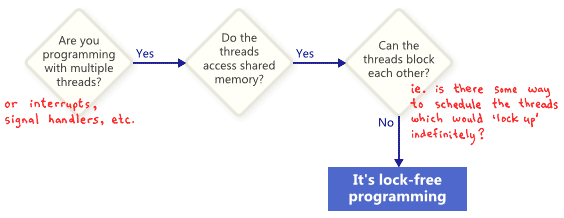
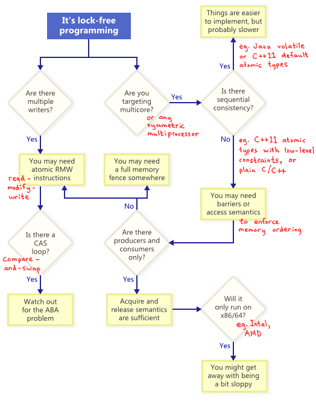
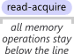
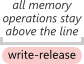
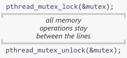

这篇文章主要是对 [Jeff Preshing](https://preshing.com/about/) 关于锁、内存和并发的一些文章的总结与整理。部分对我而言晦涩的部分，做了一些补充和解释。

这里要注意一下时间，对于摘录的大部分文章，作者写的时候是 2011 年底开始到 2013 年，部分会再晚一点。彼时 C++11 标准刚刚发布。另外，这些年硬件也有了很大的发展，因此和现在（2026年）也有一些差异。所以在阅读的时候要注意时代背景。

## 锁不慢，竞争才慢
> https://preshing.com/20111118/locks-arent-slow-lock-contention-is/

这篇文章的核心观点在于：关于锁（`lock`）性能低下的论调，在很大程度上是对“锁本身”与“锁竞争”这两个概念的混淆。早在 1986 年，Matthew Dillon 就曾指出“锁很慢”是一个普遍的误解，但即便在无锁编程（`lock-free programming`）高度发达的今天（2011 年底），这种观念依然在影响着并发系统的设计决策。事实上，锁在无竞争时的开销非常低，只有当多个线程频繁争夺同一个锁时，性能才会出现显著下降。

理解性能瓶颈的第一步是区分锁的实现方式。许多性能基准测试之所以得出负面结论，是因为误用了涉及上下文切换的内核互斥锁（`kernel mutex`），而忽略了轻量级互斥锁（`lightweight mutex`）。在 2.66 GHz 的四核 Xeon 处理器上，一对临界区的 lock/unlock 操作仅需约 23.5 ns。相比之下，虽然无锁编程能提供更高的性能潜力，但其开发和调试成本极高，容易引入隐蔽的时序漏洞（`timing bugs`），因此在选择同步策略时，应当基于实际开销而非对锁的固有偏见。

锁对并行度的影响主要取决于锁持有的时间比例（`lock Duration`）。通过基于泊松过程的基准测试可以发现，当锁持有比例控制在 10% 以下时，系统可以维持非常高的并行度。以游戏引擎中的内存分配器为例，即使 3 个线程每秒产生 15,000 次加锁请求，只要单次锁持有的比例在 2% 左右，锁并不会成为瓶颈。然而，随着比例增加，并行性能会非线性下降；当持有比例超过 90% 时，多线程性能甚至会低于单线程。

加锁的频率是另一个关键指标，但它对性能的拖累往往被高估了。实验显示，即使加锁频率提升到每秒 320,000 次（即平均每 3.1 μs 同步一次），只要临界区足够小，依然能获得明显的加速。只有当两次加锁之间执行的工作量少到几十纳秒级别——即接近锁本身的固定开销（23.5 ns）时，锁操作才会真正成为性能的主导因素。在这种极短临界区的特殊场景下，由于业务逻辑已经精简到几个 CPU 指令的规模，无锁实现才具有实际的必要性。

综上所述，锁在大多数现实场景中依然是兼顾性能与可靠性的稳妥选择。锁提供了易于理解的逻辑和极高的开发效率，只要通过严谨的性能剖析（`profiling`）确认锁持有比例处于合理范围内，就不必盲目规避。无锁编程应当被视为一种针对极端高频、极短临界区场景的优化手段，而非通用的替代方案。

## 始终使用轻量级互斥锁
> https://preshing.com/20111124/always-use-a-lightweight-mutex/

在多线程开发中，“锁”仅仅是一个抽象的概念，而要真正使用这个概念，你需要一个具体的实现。事实证明，锁的实现方式有很多种，而这些实现在性能上存在巨大差异。以 `Windows SDK` 为例，它为 C/C++ 提供了 `Mutex`（互斥体）和 `Critical Section`（临界区）两种选择，但两者的效率不可同日而语。

通过一个简单的单线程实验可以直观看到这种差异：在 1.86 GHz 的处理器上，将 `Mutex` 锁定并解锁一百万次需要耗时 735 毫秒，而使用 `Critical Section` 执行相同的操作仅需 29 毫秒。这意味着在无竞争场景下，后者的速度是前者的 25 倍。这种性能差源于底层的运行机制：`Mutex` 每次操作都会进入内核态，而 `Critical Section` 作为一种轻量级互斥锁，只有在真正发生线程竞争时才会求助于内核，平时则完全通过用户态的原子操作完成。

这种设计哲学在现代平台上已经成为标准。MacOS 和 Linux 的 POSIX 线程（`pthread`）锁默认都是轻量级的实现。在 Linux 上，这种机制被称为 Futex（快速用户空间互斥体）。在 1.86 GHz 的环境下，一对无竞争的 `pthread_mutex_lock` 和 `pthread_mutex_unlock` 调用大约耗时 92 纳秒。这种性能表现确保了在大多数高性能应用中，只要锁没有发生剧烈竞争，其本身的开销是非常确定的。

重量级锁的存在往往加剧了“锁很慢”的误解。在实际项目经验中，将同步原语从重量级锁切换为轻量级锁，对性能的影响往往是立竿见影的。例如在 Playstation 3 的游戏开发中，仅通过这一项改动就让游戏的加载时间缩短了 17 秒。这种差异在高性能、高频同步的系统架构中是无法被忽略的。

虽然在某些古老的平台上，重量级锁或信号量可能是唯一的选择，但现代操作系统几乎都原生支持轻量级实现。即使在需要跨进程共享锁等特殊场景下，开发者也可以在应用层通过原子操作自行构建轻量级锁，以规避不必要的内核态切换成本。

## 复现内存重排
> https://preshing.com/20120515/memory-reordering-caught-in-the-act/

在编写无锁（`lock-free`）代码时，内存重排（`Memory Reordering`）是一个避不开的底层细节。尽管 intel x86/64 架构被认为是强排序的内存模型，但它依然允许一种特定的乱序行为。根据 intel 的规范，处理器允许根据特定规则重新排序机器指令的内存交互，只要它不改变单线程程序的执行结果。

这里强排序的内存模型是说不允许写写（`store-store`）、读读（`load-load`）、读写（`load-store`）重排，但允许写读（`store-load`）重排。最后一种乱序是为了性能做出的设计。后续后讨论这几种重排。

这种行为在单线程环境下不可见，但在多核并行执行时，会导致违反直觉的结果。

考虑最简单的场景。

| 处理器 1 | 处理器 2 |
|-----------|-----------|
| `mov [X], 1` | `mov [Y], 1` |
| `mov r1, [Y]` | `mov r2, [X]` |

每个处理器将 1 存入一个变量，然后将另一个变量加载到寄存器中（`r1` 和 `r2` 是寄存器的占位符，如 `eax`）。从直觉上看，无论哪个核心先写，最终 `r1` 和 `r2` 至少有一个应该为 1。然而 intel 规范明确指出，最终 `r1 = 0` 且 `r2 = 0` 是完全合法的。这意味着在多核环境下，每个处理器都可能将自己的 `store` 操作“压”在了 `load` 之后。

那么时序看起来可能是这样的：

| 处理器 1 | 处理器 2 |
|-----------|-----------|
| `mov r1, [Y]` |  |
|  | `mov r2, [X]` |
| `mov [X], 1` |  |
|  | `mov [Y], 1` |

下面写一段代码来验证这个事情。首先，编译器可能会对代码进行优化，导致我们无法观察到内存重排的效果。为了防止编译器的优化，可以使用 `asm volatile("" ::: "memory")` 来告诉编译器不要对内存操作进行重排序。下面是第一个线程的代码：

```cpp
void threadFunc1()
{
    std::random_device seed;
    std::mt19937 engine(seed());
    std::uniform_int_distribution<int> dist(0, 800);

    for (;;)
    {
        sem_wait(&beginSem1);

        while (dist(engine) % 8 == 0)
        {
            // busy loop
        };

        X = 1;

        asm volatile("" ::: "memory"); // prevent compiler reordering

        r1 = Y;
        sem_post(&endSem);
    }
}
```
第二个线程的代码与第一个线程类似，完整代码参考附录。

使用命令 `g++ -O2 -c -S memory_reoder.cc` 看一下汇编指令，确认编译器没有帮我们重排指令。
```
.L69:
	xorl	%esi, %esi
	movl	$800, %edx
	leaq	5008(%rsp), %rdi
	call	_ZNSt24uniform_int_distributionIiEclISt23mersenne_twister_engineImLm32ELm624ELm397ELm31ELm2567483615ELm11ELm4294967295ELm7ELm2636928640ELm15ELm4022730752ELm18ELm1812433253EEEEiRT_RKNS0_10param_typeE.isra.0
	testb	$7, %al
	je	.L69
	movl	$1, X(%rip)
	movl	Y(%rip), %eax
	leaq	endSem(%rip), %rdi
	movl	%eax, r1(%rip)
	call	sem_post@PLT
	jmp	.L70
```
`movl	$1, X(%rip)` 的下一个指令就是 `movl	Y(%rip), %eax`，说明编译器没有重排指令。

下面是 `main` 函数。实验开启了两个工作线程和一个主线程。主线程负责管理工作：在每轮迭代开始前将 `X` 和 `Y` 重置为 0，然后通过 `sem_post` 同时触发两个工作线程。主线程等待两个线程通过 `sem_wait` 报告完成后，再检查 `r1` 和 `r2` 的结果。

```cpp
sem_init(&beginSem1, 0, 0);
sem_init(&beginSem2, 0, 0);
sem_init(&endSem, 0, 0);


std::thread t1(threadFunc1);
std::thread t2(threadFunc2);


int detected = 0;
for (int iterations = 0;; iterations++)
{
    X = 0;
    Y = 0;


    sem_post(&beginSem1);
    sem_post(&beginSem2);


    sem_wait(&endSem);
    sem_wait(&endSem);


    if (r1 == 0 && r2 == 0)
    {
        detected++;
        printf("%d reoders detected after %d iterations.\n", detected, iterations);
    }
}
```
下面是一段可能的输出结果：

```
./a.out 
1 reoders detected after 13063 iterations.
2 reoders detected after 232300 iterations.
3 reoders detected after 262259 iterations.
4 reoders detected after 465665 iterations.
5 reoders detected after 488528 iterations.
6 reoders detected after 509291 iterations.
7 reoders detected after 535013 iterations.
8 reoders detected after 567300 iterations.
9 reoders detected after 573282 iterations.
10 reoders detected after 642675 iterations.
```
为了防止重排，我们可以通过 `CPU_ZERO` `CPU_SET` 来设置亲和性（`affinity`），让两个线程分别绑定在同一个 CPU 上，但是这样就失去了并行了。

另一个方式是使用内存屏障（`memory barrier`）来禁止处理器重排指令。对于 intel x86/64 架构来说，`mfence` 指令可以提供全屏障（`full barrier`），禁止所有类型的重排。
```cpp
X = 1;

asm volatile("mfence" ::: "memory"); // prevent CPU reordering

r1 = Y;
```

`mfence` 并不是普通的指令，会清空 store buffer，`load` `store` 必须停下来，确保之前的所有内存操作都可见了之后才能继续执行。这种指令的开销比较大，几十纳秒或者更多。

这种微妙的时序漏洞（`timing bug`）极其隐蔽。即便汇编代码顺序正确，底层硬件依然可能产生重排。不同 CPU 家族对内存顺序的处理差异巨大，这也正是最近引入 C++11 原子库标准的原因。它通过标准化的方式，让编写可移植的无锁代码变得更容易。了解这些硬件行为，是理解 `memory_order` 抽象语义的物理基础。

## 无锁编程导论
> https://preshing.com/20120612/an-introduction-to-lock-free-programming/

无锁编程不仅因任务本身的复杂性而具有难度，更在于其底层概念的准入门槛。在 Xbox 360 等平台开发和调试无锁代码的实践表明，理解其核心属性是编写正确代码的前提。

### 什么是无锁的？
无锁（`lock-free`）并非单纯指不使用互斥锁（`mutex`），而是一种描述代码执行属性的术语。

如果程序的某部分满足无锁属性，意味着在无限的执行过程中，某些方法调用能够无限频繁地完成。即使系统中的某些线程被挂起，其余线程作为一个群体依然能够保持进展。在这种定义下，互斥锁被排除在外，因为一旦持有锁的线程被挂起，所有竞争该锁的线程都无法继续进展。无锁编程保证了即使在极端调度或竞争发生时，系统整体在算法上不可能锁定。

下面是判断是否是无锁代码的方法。



反之，即使代码没有锁，也不一定是无锁的。比如假定 `X` 初始化为零，两个线程运行以下代码也是有可能永远无法跳出循环。
```cpp
while (X == 0)
{
    X = 1 - X;
}
```
这个例子中，两个线程都进入循环，一个线程将 `X` 从 0 变为 1，另一个线程将 `X` 从 1 变回 0，导致两个线程都无法完成循环。因此该片段不符合无锁定义。无锁编程的一个重要影响是挂起单个线程不会阻止其他线程继续执行下去。这在中断处理程序和实时系统中具有明确的应用价值。

设计为阻塞的操作不会让整体不是无锁的。例如，队列的 `pop` 操作在队列为空时可能会有意阻塞。其余的代码路径仍然可以被认为是无锁的。

### 无锁编程技术
原子操作是指那些以看似不可分割的方式操作内存的操作。没有线程可以观察到操作完成了一半。在现代处理器上，许多操作已经是原子的。例如，简单类型的对齐读取和写入通常就是原子的。

下图是一些技术的总结。



原子的读改写（`read-modify-write`）允许以原子方式执行一个复杂的操作。在多线程竞争同一个地址时，硬件确保这些操作按序逐一执行。常见的原子读改写操作包括比较并交换（`compare-and-swap`）。c++11 的 `std::atomic<int>::fetch_add` 就是一个原子读改写操作。

程序员常常在循环中尝试使用 CAS 来实现无锁算法。典型的模式分成三步：拷贝共享变量到本地、计算新值、尝试使用 CAS 更新共享变量。如果 CAS 失败，说明另一个线程修改了共享变量，必须重新开始循环。这种模式被称为“乐观并发控制”，因为它假设冲突是罕见的。这类循环符合无锁的属性，因为一个线程失败了说明有其他线程成功了。在实现 CAS 的时候需要防止 ABA 问题，即一个变量的值从 A 变为 B 又变回 A，导致 CAS 误判。解决方法是使用版本号或者其他方法区分状态。

顺序一致性指所有线程对内存操作顺序达成共识，且该顺序与源码顺序一致。在 C++11 中，通过默认的原子类型约束可实现此特性。为此，编译器会在后台插入内存屏障或 RMW 指令。虽然这提供了更高的安全性，但在某些场景下可能比直接内存排序效率稍低。

在不保证顺序一致性的多核环境下，必须考虑防止内存重排。工具通常分为三类：

- 轻量级同步或屏障指令（Fence）
- 全内存屏障指令（Full Memory Fence）
- 提供获取（`acquire`）或释放（`release`）语义的操作

获取语义确保其后的操作不被重排到它之前；释放语义确保其前的操作不被重排到它之后。生产者/消费者模型中很有用。后续后有更准确、详细的讨论。

## 编译期内存重排
> https://preshing.com/20120625/memory-ordering-at-compile-time/

在 C/C++ 源代码从编译器翻译到 CPU 执行的过程中，为了性能优化会进行内存重排。这种重排既发生在编译期，也发生在运行期。其核心准则只有一个：不得修改单线程程序的行为。

对于单线程或使用互斥锁、信号量的程序，这种重排几乎是隐形的。但当你尝试编写无锁（`lock-free`）代码，直接在线程间共享内存时，重排的影响就会直接暴露出来。虽然通过 C++11 原子类型等“顺序一致性”类型可以规避这些麻烦，但是会有但本文将聚焦于编译器对常规类型的内存排序影响。

编译器的职责之一是提升运行效率，而重排指令是其核心自由。考虑如下函数：
```cpp
int A;
int B;

void foo()
{
    A = B + 1;
    B = 0;
}
```
使用 gcc 15 不开优化（`-O0`）编译，汇编代码严格遵守源码顺序。
```
movl	B(%rip), %eax
addl	$1, %eax
movl	%eax, A(%rip)
movl	$0, B(%rip)
```
如果开启了优化（`-O2`），编译器会对指令进行重排。
```
movl	B(%rip), %eax
movl	$0, B(%rip)
addl	$1, %eax
movl	%eax, A(%rip)
```

这种优化在单线程不会有任何问题，但是当写无锁代码时，编译器重排可能会导致问题。如果 `IsPublished` 的写入被重排到 `Value` 之前，观察线程可能会看到标志位已更新，但读取到的却是旧的或未初始化的 `Value`。即使在单核环境下，如果线程在两次写入之间被抢占，问题同样会发生。
```cpp
int Value;
int IsPublished = 0;

void sendValue(int x)
{
    Value = x;
    IsPublished = 1;
}
```

### 显式屏障
防止编译器重排最简单的方法是使用特殊的指令，即编译器屏障。比如之前提到的 `asm volatile("" ::: "memory")` 就是一个编译器屏障。

在下面的例子中，不仅发送端要使用编译器屏障来防止重排，接收端也需要使用编译器屏障来确保正确读取到最新的值。
```cpp
int Value;
int IsPublished = 0;

void sendValue(int x)
{
    Value = x;
    asm volatile("" ::: "memory");  // prevent reordering of stores
    IsPublished = 1;
}

int tryRecvValue()
{
    if (IsPublished)
    {
        asm volatile("" ::: "memory");  // prevent reordering of loads
        return Value;
    }
    return -1;  // or some other value to mean not yet received
}
```

这些屏障足以解决单处理器系统的问题。在 Linux 内核中，诸如 `smp_rmb` 的宏在单核编译时会退化为简单的编译器屏障。但在多核时代，仅有编译器屏障是不够的，还需要进一步处理硬件层面的 CPU 屏障。

c++11 中非宽松（`non-relaxed`）的操作都可以看作是编译器屏障，比如
```cpp
int Value;
std::atomic<int> IsPublished(0);

void sendValue(int x)
{
    Value = x;
    // <-- reordering is prevented here!
    IsPublished.store(1, std::memory_order_release);
}
```

### 隐式屏障
除了显式屏障，许多情况会隐式地阻止重排。绝大多数外部函数调用都充当了编译器屏障。

编译器必须假设外部函数具有未知的副作用。由于无法预知该函数是否会访问或修改全局变量，编译器必须在调用点前后禁止跨边界的重排，并忘掉关于内存状态的所有寄存器假设，重新从内存加载值。从下面的汇编看，并没有重排。

```cpp
void doSomeStuff(Foo* foo)
{
    foo->bar = 5;
    sendValue(123);       // Call to an external function acts as a compiler barrier
    foo->bar2 = foo->bar; // Load fresh value from foo->bar
}
```

```
movl	$5, (%rdi)
movl	$123, %edi
call	_Z9sendValuei@PLT
movl	(%rbx), %eax
movl	%eax, 4(%rbx)
```

这就是为什么在正确编写的多线程代码中，通常不需要 `volatile` 的原因——编译器在跨越函数边界时已经表现得足够严谨。

在 C++11 标准化之前，编译器甚至可能引入源码中原本不存在的存储操作。

```cpp
if (A)
    B++;
```
编译器为了优化，可能将其变换为：先将 `B` 读入寄存器，根据 `A` 决定是否自增，最后无条件写回。

```cpp
register int r = B;
if (A) r++;
B = r; // Surprise! A new memory store where there previously was none.
```
在多线程环境下，这种“原值写回”会意外抹掉其他线程对 `B` 的并发修改。虽然在实践中这种优化极罕见，但 C++11 标准现在已明确禁止这种会引入数据竞态（Data Race）的变换。按照原始代码，当 `A = 0` 时，`B` 不应该被修改，线程 2 可以安全更新。但是如果编译器做了上述优化，引入了一个新的存储操作，那么当 `A = 0` 时，线程 1 仍然会写回 `B` 的旧值，导致线程 2 的更新丢失。

重排是现代 CPU 复杂性的直接产物。早期的 CPU 只有几十万个晶体管，重排意义不大。但随着摩尔定律的发展，晶体管被用于实现流水线、内存预取、指令级并行（ILP）等技术，程序指令的顺序对性能产生了显著影响。因此，编译器和 CPU 都被设计成允许在不改变单线程程序行为的前提下重排指令。这种设计虽然提高了性能，但也引入了多线程编程中的复杂性。理解这些底层细节对于编写正确且高效的并发代码至关重要。

## 四种内存屏障语义
> https://preshing.com/20120710/memory-barriers-are-like-source-control-operations/

在理解了编译期重排之后，我们只解决了内存重排的一半。另一半则发生在程序运行期——处理器硬件本身。即便编译器生成了顺序指令，现代多核 CPU 在执行时仍会为了性能而重排。这种重排对单线程程序是不可见的，但在无锁（`lock-free`）编程中，当多个线程在没有任何互斥手段的情况下操纵共享内存时，硬件的重排本能就会直接导致数据竞争。

要理解运行期重排，首先要审视多核系统的物理架构。在处理器核心与主内存之间，存在着复杂的缓存层级。每个核心拥有私有的 L1 缓存，而 L2 缓存和主内存则是所有核心共享的“中央仓库”。

在这种架构下，每个核心实际上都在操作一份主内存的“工作副本”。当一个核心执行存储（Store）操作时，该变更并不会立即同步到中央仓库，而是会以一种完全随机的时间点，在后台向共享内存“泄漏”或传播。

这种机制导致了两个层面的顺序失效。首先是存储端的传播乱序：核心 A 连续改写了变量 `X` 和 `Y`，但 `Y` 的变更可能先于 `X` 到达中央仓库。其次是加载端的获取乱序：核心 B 在从仓库同步数据到本地副本时，无法保证获取这些更新的时间或先后顺序。

这种同步延迟解释了那个经典的无锁编程陷阱：两个核心同时写入变量 `X` 和 `Y`，紧接着读取对方的变量，结果却可能由于变更尚未完成双向传播，导致最终都读到了旧值 `r1 = 0, r2 = 0`，这就是之前复现内存重排的例子。

### #LoadLoad
这一屏障确保在它之前的加载操作必须先于它之后的加载操作完成。在物理语义上，它相当于执行一次“拉取（pull）”操作，强制从中央仓库同步最新的状态到本地副本。在典型的发布-订阅模式中，接收端在观测到 `IsPublished` 标志位后，必须通过 #LoadLoad 屏障来确保随后读取的 `Value` 至少和标志位一样新，而不是本地副本里残存的陈旧值。

```cpp
if (IsPublished)
{
    LOADLOAD_FENCE();
    return Value;
}
```

### #StoreStore
它确保屏障之前的存储操作先于屏障之后的存储操作对其他核心可见。这相当于一次“推送（Push）”操作。当你需要发布数据时，标准的工程实践是：先写入数据，执行 #StoreStore 屏障，最后再写入就绪标志位。这道栅栏保证了数据和标志位的传播顺序，绝不会出现“其他核心先看到标志位，却读到未就绪数据”的情况。

```cpp
Value = x;
STORESTORE_FENCE();
IsPublished = 1;
```

### #LoadStore
这是一种针对指令执行流的约束。在高性能流水线中，如果前面的加载发生了缓存未命中，而随后的存储却命中了缓存，处理器可能会为了避免流水线停顿而跳过加载先处理存储。#LoadStore 屏障的作用就是禁止这种跨越边界的指令交替，维持程序在逻辑上的先后顺序。

### #StoreLoad
这是最强力、也最昂贵的一道屏障。它确保屏障之前的所有存储都对其他处理器可见，且屏障之后的所有加载都能读到系统中最准确的值。在物理上，它要求清空存储缓冲区（Store Buffer）并阻塞流水线，直到之前的写入完全确认并拉取中央仓库最新的 Head 版本。它是唯一能解决上述 `r1 = 0, r2 = 0` 问题的方式。

### 硬件差异和软件抽象
不同处理器的重排习惯截然不同。x86/64 家族拥有强内存模型（`Strong Memory Model`），硬件自动保证了前三种屏障的顺序，通常只有在需要 #StoreLoad 时才需要手动干预。而 ARM 或 PowerPC 等弱内存模型（`Weak Memory Model`）架构则不然，上述四种重排随时可能发生。

现代编程标准（如 C++11）通过原子库抽象了这些语义。当你使用 `memory_order_acquire` 或 `memory_order_release` 时，编译器会根据目标平台的特性，自动插入最合适的屏障指令。理解这些底层物理语义，能让我们在追求极致性能的同时，清晰地界定硬件优化与逻辑正确性之间的边界。

## 获取和释放语义
> https://preshing.com/20120913/acquire-and-release-semantics/

在无锁编程中，线程对共享内存的操作通常分为两类：一是争夺资源的“竞争”，二是协同工作的“传递”。获取（`acquire`）与释放（`release`）语义正是为了实现后者——即线程间可靠的信息传递。在实际开发中，缺失或错误的获取/释放语义是无锁编程中最常见的错误类型。

我们要处理的是多核环境下直接面对内存序（`Memory Ordering`）的场景，而非默认的顺序一致性。

### 定义
“获取”与“释放”这两个术语的定义往往被描述得过于复杂。紧贴 C++11 标准的物理原则，我们可以将其清晰地定义为：

* 获取语义（`Acquire Semantics`）：它仅能应用于读取操作（无论该操作是加载 `load` 还是“读改写”）。这种操作被称为“读取-获取”（`read-acquire`）。它防止该操作与其在程序顺序中之后的任何读写指令发生重排。



* 释放语义（`Release Semantics`）：它仅能应用于写入操作（无论该操作是存储 `store` 还是“读改写”）。这种操作被称为“写入-释放”（`write-release`）。它防止该操作与其在程序顺序中之前的任何读写指令发生重排。



这意味着获取操作是一道“向下”的屏障，指令可以掉下去，但不能浮上来；释放操作是一道“向上”的屏障，指令可以浮上来，但不能掉下去。由于这两种语义都不需要昂贵的 #StoreLoad 屏障，因此在大多数架构上，它们的性能开销比其他屏障要高。

### C++11 跨平台屏障
为了代码的可移植性，C++11 引入了 `std::atomic_thread_fence()`。我们可以用它替代平台特定的指令。为了在所有平台上保证理论上的正确性，我们将标志位声明为 `std::atomic<int>`。

```cpp
int A = 0;
atomic<int> Ready(0);

// thread 1
A = 42;
atomic_thread_fence(memory_order_release);
Ready.store(1, memory_order_relaxed);

// thread 2
while (Ready.load(memory_order_relaxed) == 0);
atomic_thread_fence(memory_order_acquire);
r1 = A;
```

在这里，`memory_order_relaxed` 仅保证原子性，而不提供额外的排序约束。在 x86/64 架构上，由于其本就属于强内存模型，这两个屏障调用通常只会被编译器实现为编译器屏障。

还有一种实现方式是直接在 `store` 和 `load` 操作中指定内存顺序：

```cpp
// thread 1
A = 42;
Ready.store(1, memory_order_release);

// thread 2
while (Ready.load(memory_order_acquire) == 0);
r1 = A;
```
这种形式更加简洁，并允许编译器根据目标架构进行优化。

### 锁机制
“获取”与“释放”这两个名称直接源于互斥锁的操作：获取锁（`Acquiring a lock`）暗示了获取语义，释放锁（`Releasing a lock`）暗示了释放语义。

所有的内存操作被包含在这一对屏障构成的“三明治”中。这种机制确保了在持有锁期间所做的任何修改，都能完整地传播到下一个获得该锁的线程。无论是在多核环境下可靠地传递信息，还是实现自定义的同步原语，这些语义都是确保多线程程序正确运行的基础。



## 强内存模型和弱内存模型
> https://preshing.com/20120930/weak-vs-strong-memory-models/

内存模型（`memory model`）定义了在特定的处理器和工具链下，相对于源代码，在运行时可以预期发生哪些类型的内存重排。理解这一点至关重要，因为很多看似“正确”的无锁代码，往往只是因为运气好，运行在了强内存模型的处理器上。

内存重排的影响仅在无锁编程中可见。通过对各种硬件和软件内存模型的研究与实验，我们可以将它们划分为四个核心类别。在这个频谱中，越往右的模型提供的保证越强，包含了左侧模型的所有特性并增加了额外的约束。
```
really week <--- weak with data dependency ordering <--- strong <--- sequentially consistent
```

弱内存模型（`Weak Memory Models`）在最弱的内存模型中，所有四种类型的内存重排（LoadLoad, LoadStore, StoreStore, StoreLoad）都有可能发生。只要不改变单线程程序的执行结果，处理器和编译器可以随意调整指令顺序。

DEC Alpha 是弱序处理器的典型代表。值得注意的是，C++11 和 C11 暴露的软件内存模型在很多方面受到了 Alpha 的影响。这意味着，即使你在 x86 这种强序机器上开发，如果你在 C++11 中使用了 `memory_order_relaxed`，你依然是在一个弱软件模型下工作，必须手动指定正确的约束来防止编译器重排。

带有数据依赖排序的弱模型现代主流的弱序处理器，如 ARM、PowerPC 和 Itanium，虽然在大部分情况下和 Alpha 一样弱，但它们增加了一个对程序员非常友好的细节：数据依赖排序（`Data Dependency Ordering`）。这意味着，如果你编写类似 `A->B` 的代码，处理器保证加载到的 `B` 绝对不会比 `A` 更旧。这在 Linux 内核的 RCU 机制中被广泛利用。而极端的 Alpha 甚至连这一点都不保证。

强内存模型（`Strong Memory Models`）可以理解为每条机器指令都隐式地带有获取（`acquire`）与释放（`release`）语义。

在这种模型下，当一个 CPU 核心执行一系列写入时，所有其他核心看到这些值的变化顺序与写入顺序完全一致。反映在物理行为上，它不允许 StoreStore、LoadLoad 和 LoadStore 重排，唯独保留了 StoreLoad 重排的可能性。

x86/64 家族就是典型的强序处理器。虽然它在内部硬件实现上会乱序执行指令，但它保证在内存交互上维持顺序。因此，在多核环境下，x86 能够提供非常直观的可见性保证。此外，运行在 TSO 模式下的 SPARC 也是此类模型的代表。

顺序一致性（`Sequential Consistency`）在顺序一致性模型中，不存在任何内存重排。整个程序的执行就像是所有线程的指令按照某种顺序交错排列而成的单一序列。在这种模型下，所有的并发陷阱（如 `r1 = r2 = 0` 的反直觉结果）都不会发生。

在现代多核硬件层面，几乎找不到保证顺序一致性的设备（1989 年的 386 机器 Compaq SystemPro 是个罕见的例外，因为它还没先进到能支持乱序）。

然而，顺序一致性作为软件内存模型非常有用。在 Java 中通过 `volatile` 声明变量，或者在 C++11 原子操作中使用默认的 `memory_order_seq_cst`，工具链就会自动插入必要的 CPU 指令（屏障）来“模拟”这种效果。这让你可以在弱序硬件上写出具备强序逻辑的代码。

## 无锁线性搜索
> https://preshing.com/20130529/a-lock-free-linear-search/

下面探讨一个 C++ 类的实现，该类用于将整数键（`key`）映射到整数值（`value`），并且其 `SetItem` 和 `GetItem` 方法均实现了线程安全并且是无锁（`Lock-Free`）。

值得注意的是，这两个操作底层依赖的是线性搜索。在处理大规模数据集时，线性搜索的效率显然不高，因此不建议将此实现直接应用于生产环境。但从技术研究的角度来看，这段代码提供了一个非常清晰的上下文，有助于我们深入理解无锁编程中的几个核心概念而不受复杂的算法和实现细节的干扰。

假定类命名为 `ArrayOfItems`，其内部维护一个普通的键值对数组。数组会预先分配足够的内存，以容纳所有需要存储的条目。这里使用 C++11 标准库中的 `std::atomic` 而原文使用了自己写的一个库，但它的语义和 C++11 的原子库是一样的，并且使用 c++ 库的原子库更具有可移植性和可读性。
```cpp
#include <atomic>
#include <cstdint>

struct Entry
{
    std::atomic<uint32_t> key;
    std::atomic<uint32_t> value;
};

Entry *m_entries;
```
我们设定以下规则：

1. 数组初始状态全为 0。
2. 如果一个条目的 key 为 0，表示该条目未被使用。
3. 业务逻辑中禁止将 0 作为实际的 key 或 value 存入。
4. 新条目通过线性搜索追加，数组从左向右被填满。

### SetItem 的无锁实现
`SetItem` 的无锁实现代码如下，和常规的线程安全的代码很类似。
```cpp
void ArrayOfItems::SetItem(uint32_t key, uint32_t value)
{
    for (uint32_t idx = 0;; idx++)
    {
        uint32_t expected = 0;
        bool success = m_entries[idx].key.compare_exchange_strong(expected, key, std::memory_order_relaxed);
        if (success || (expected == key))
        {
            m_entries[idx].value.store(value, std::memory_order_relaxed);
            return;
        }
    }
}
```

这段代码的逻辑是逐个扫描数组，在找到第一个 `key` 为 0 的条目时尝试存入新 `key`。如果存入成功，或者发现该 `key` 已经存在，则在同一条目中存入 `value` 并返回。

保证这段代码在并发环境下正确运行的因素，主要包括原子性、读改写（RMW）机制以及内存序。

原子操作保证了在多线程环境下，任何线程都不会从共享内存中读取到部分更新的值。在 `SetItem` 中，即使是最后的赋值操作，也使用了原子库函数 `store`。在现代 CPU 上，原生对齐的 32 位赋值通常已经是原子的。但在严谨的无锁编程实践中（包括 C++11 原子库标准），标准的做法是假设所有内存操作都是非原子的，除非显式使用了原子库函数。这种做法可以保证代码的跨平台安全性。

`SetItem` 中使用了 `compare_exchange_strong`，即比较并交换（CAS）。CAS 是一种复合原子操作，它在一个不可分割的步骤中完成读取、比较和写入。当多个线程同时尝试修改同一个变量时，硬件层面会确保这些 CAS 操作排队执行，从而为该变量上的所有修改建立一个全局的单一顺序。这意味着并发调用 `SetItem` 不会破坏数据结构，每次调用完成后，数组始终处于一致的状态。

`SetItem` 和 `GetItem` 均使用了宽松（`std::memory_order_relaxed`）的原子语义。这意味着它们没有使用任何内存屏障，完全允许编译器和处理器进行内存重排。

以下是 `GetItem` 的代码：
```cpp
uint32_t ArrayOfItems::GetItem(uint32_t key)
{
    for (uint32_t idx = 0;; idx++)
    {
        uint32_t probedKey = m_entries[idx].key.load(std::memory_order_relaxed);
        if (probedKey == key)
            return m_entries[idx].value.load(std::memory_order_relaxed);
        if (probedKey == 0)
            return 0;
    }
}
```

`GetItem` 执行线性搜索，遇到匹配的 key 或遇到 0 时停止。即使存在内存重排，这段代码依然能正确工作。

假设每个线程都有自己私有的共享数组副本。对共享数组的修改最终会传播到每个线程的副本中，但传播顺序可能与写入顺序不同。因此，当 `GetItem` 检查数组条目时，它观察到的 `(key, value)` 状态可能是以下四种组合之一：

1. `(0, 0)`：条目未使用，视为列表末尾。未找到目标 key，返回 0。
2. `(key, 0)`：另一个线程已写入 `key`，但尚未写入 `value`。如果 key 匹配，返回 0。
3. `(key, value)`：条目已完全初始化。返回对应的 `value`。
4. `(0, value)`：由内存重排引起，`value` 的写入在当前线程看来先于 `key` 的写入。由于 `GetItem` 首先检查 `key`，看到 0 会认为到达列表末尾并返回 0。

这四种状态在逻辑上都是安全的。该机制成立的核心前提是一旦 `SetItem` 将某个条目的 `key` 从 0 修改为非 0 值，该 `key` 就再也不会改变，这是我们之前的约定。 因此，只要 `GetItem` 读取到了匹配的 `key`，它随后读取到的 `value` 要么是初始的 0，要么是写入线程实际存入的值。

虽然 `ArrayOfItems` 内部对内存重排具有弹性，但如果调用者使用它来向其他线程发布非原子数据，仍需要显式使用内存屏障。比如通过在集合中存储一个标志位来通知其他线程某段消息已准备就绪。在存储标志位之前，必须发出释放屏障（`Release Fence`），以确保非原子数据的写入对其他线程可见。
```cpp
#include <cstring>

char message[256];
ArrayOfItems collection;
void PublishMessage()
{
    strcpy(message, "Message data");

    std::atomic_thread_fence(std::memory_order_release);

    collection.SetItem(SHARED_FLAG_KEY, 1);
}
```
相应的，接收线程在 `GetItem` 读取到标志位后，需要一个获取屏障（`std::atomic_thread_fence(std::memory_order_acquire)`）才能安全读取 `message`。

### 优化：减少 CAS 的调用次数
最初的 `SetItem` 实现存在性能缺陷。CAS（在 x86 上对应 `lock cmpxchg` 指令）是一个开销较大的操作。在循环中，随着数组逐渐填满，大部分 CAS 操作实际上会因为目标槽位已有 `key` 而失败。可以通过在执行 CAS 之前先进行一次普通的宽松语义的加载来优化性能。
```cpp
void ArrayOfItems::SetItem(uint32_t key, uint32_t value)
{
    for (uint32_t idx = 0;; idx++)
    {
        uint32_t probedKey = m_entries[idx].key.load(std::memory_order_relaxed);
        if (probedKey != key)
        {
            if (probedKey != 0)
                continue;

            uint32_t expected = 0;
            bool success = m_entries[idx].key.compare_exchange_strong(expected, key, std::memory_order_relaxed);
            if (!success && (expected != key))
                continue; 
        }

        m_entries[idx].value.store(value, std::memory_order_relaxed);
        return;
    }
}
```
通过增加前置的读取检查，避免了对已被占用的槽位执行无意义的 CAS 操作。根据实测，这一优化能使程序的运行速度获得数量级上的提升。

## 原子操作与非原子操作
> https://preshing.com/20130618/atomic-vs-non-atomic-operations/

提到原子操作，很多开发者的第一反应往往是“读改写”（RMW，比如 CAS 操作）。然而，原子操作的范畴远不止于此，原子的加载（Load）和存储（Store）同样是并发编程中不可或缺的基石。

这里从处理器指令和 C/C++ 语言标准两个维度，对比原子的 Load/Store 与普通的非原子操作，并借此厘清 C++11 标准中数据竞争（`Data Race`）的真正底层含义。

如果一个针对共享内存的操作，在其他线程看来是在一个不可分割的单步内完成的，那么它就是原子的。

- 当执行原子 Store 时，其他线程绝对无法观察到该变量修改了一半的中间状态。
- 当执行原子 Load 时，它读取到的必然是该变量在某一瞬间完整且一致的数值。

普通的非原子操作则不提供任何此类保证。如果没有这些保证，无锁编程将无从谈起。规则只有一条：只要有两个或以上的线程并发访问同一个共享变量，且其中至少有一个是写操作，那么所有涉及该变量的线程都必须使用原子操作。

如果你违反了这条规则，在任何一个线程中使用了非原子操作，就会触发 C++11 标准中所定义的数据竞争（`Data Race`）。C++11 标准指出，数据竞争会导致“未定义行为”。但究其根本，数据竞争在硬件层面引发的灾难通常非常具体：撕裂读（`Torn Reads`）和撕裂写（`Torn Writes`）。

一个内存操作之所以是非原子的，通常有以下几种底层原因。

### 多条 CPU 指令导致的非原子性
假设我们有一个 64 位的全局变量，初始值为 0：
```cpp
uint64_t sharedValue = 0;
```
在某个线程中，我们对其进行赋值：
```cpp
void storeValue()
{
    sharedValue = 0x100000002;
}
```
如果我们使用 GCC 将这段代码编译为 32 位的 x86 机器码，汇编输出大致如下：
```
        mov DWORD PTR sharedValue, 2
        mov DWORD PTR sharedValue+4, 1
        ret
```
可以看到，编译器使用了两条独立的 32 位 `mov` 指令来完成一次 64 位的赋值。第一条指令写入低 32 位（`0x00000002`），第二条写入高 32 位（`0x00000001`）。这显然不是原子的。在并发环境下，这会导致致命问题：

1. 撕裂写：如果执行 `storeValue` 的线程在两条指令之间被操作系统抢占，内存中会留下 `0x0000000000000002` 这个半成品状态。如果此时另一个线程读取该变量，就会读到一个完全错误的脏数据。
2. 永久性撕裂写：更糟糕的是，如果在抢占期间，另一个线程也修改了 `sharedValue`，那么当原线程恢复执行并写入高 32 位后，这个变量的高低 32 位将分别来自两个不同的线程，导致数据永久损坏。
3. 多核并发：在多核处理器上，甚至不需要发生线程抢占。当一个核心正在执行这两条指令时，运行在另一个核心上的线程完全有可能在两次写入的间隙读取到处于中间状态的 `sharedValue`。

同理，并发读取这个 64 位变量也会被编译为两条加载指令，从而引发撕裂读——即使并发的写入操作本身是原子的，读取线程也可能读到写入前的一半和写入后的一半。

### 单条 CPU 指令的非原子性陷阱
不要以为只要编译成单条 CPU 指令，操作就一定是原子的。

以 ARMv7 指令集为例，它包含一条 `strd` 指令，用于将两个 32 位寄存器的内容存储到一个 64 位的内存地址中
```
strd r0, r1, [r2]
```
在某些 ARMv7 处理器实现中，这条指令并非原子操作。处理器在底层微架构上会将其拆分为两次独立的 32 位存储。这意味着，即使在单核设备上，如果系统中断（例如线程上下文切换的时钟中断）恰好发生在两次内部存储之间，同样会发生撕裂写。

在 x86 架构上，一个广为人知的规则是：32 位的 `mov` 指令只有在操作数是自然对齐（即内存地址是 4 的倍数）时，才保证是原子的。如果一个 32 位整数跨越了缓存行（`Cache Line`）边界，硬件在执行读写时将无法保证原子性，必然会导致撕裂读写。

### C/C++ 标准的非原子性假设
在 C 和 C++ 标准中，为了保证极致的可移植性，采取了最保守的策略：除非明确使用原子库，否则所有普通的内存操作均被假定为非原子操作。

在实际工程中我们往往知道目标平台的情况。例如，在现代 x86、ARM 等架构上，只要地址对齐，普通的 32 位整数赋值在硬件层面确实是原子的。

但是，在编写符合现代 C++ 标准、真正跨平台的代码时，我们必须摒弃这种依赖特定硬件的侥幸心理。C++11 引入了 `<atomic>` 标准库，为我们提供了真正可移植的原子 Load 和 Store 方案。

回到最初那个 64 位变量并发读写的例子。为了彻底消除数据竞争，我们应该使用 C++11 的 `std::atomic` 进行重写：
```cpp
#include <atomic>
#include <cstdint>

std::atomic<uint64_t> sharedValue(0);

void storeValue()
{
    sharedValue.store(0x100000002, std::memory_order_relaxed);
}

uint64_t loadValue()
{
    return sharedValue.load(std::memory_order_relaxed);
}
```
使用 C++11 的术语来说，这段代码现在是无数据竞争的。无论代码运行在 32 位还是 64 位架构，无论底层指令如何生成，C++ 标准库都会保证 `store` 和 `load` 的原子性，彻底杜绝撕裂读写。

注意这里使用了宽松的语义 `std::memory_order_relaxed`。它保证了操作本身的原子性但是不提供任何内存屏障或顺序保证。编译器和 CPU 依然可以对这些操作进行重排。

在处理并发共享内存时，显式地使用原子库函数是一个极佳的工程实践。即使你确信在当前目标平台上普通赋值已经是原子的，使用 `std::atomic` 依然能起到至关重要的自文档化作用——它清晰地向其他阅读代码的开发者明确的说明这个变量是并发数据访问的目标，请谨慎处理。

## 剖析获取和释放内存屏障
> https://preshing.com/20130922/acquire-and-release-fences/

获取和释放屏障属于底层的无锁操作原语。在日常开发中，如果你只使用默认的 C++11 `std::atomic`（其默认内存序为 `std::memory_order_seq_cst`，即顺序一致性），你通常不需要直接接触这些屏障。顺序一致性提供了最强的安全保证，但代价是在某些算法场景下会牺牲一定的性能和多核扩展性。

获取和释放屏障是得力的内存屏障。这意味着它们作为单独的语句存在，不与任何特定的内存读写操作绑定。它们的严格定义如下：

- 获取屏障：禁止排在该屏障之前的任何读操作，与排在该屏障之后的任何读/写操作发生内存重排。
- 释放屏障：禁止排在该屏障之前的任何读/写操作，与排在该屏障之后的任何写操作发生内存重排。

如果用更底层的屏障类型来描述的话，获取屏障等价于 #LoadLoad + #LoadStore 屏障，释放屏障等价于 #LoadStore + #StoreStore 屏障。

在 C++11 中，调用方式非常直接
```cpp
#include <atomic>
std::atomic_thread_fence(std::memory_order_acquire);
std::atomic_thread_fence(std::memory_order_release);
```

在底层硬件映射上，编译器会将这些标准库调用转换为目标架构上开销最小的等效指令。例如在 PowerPC 上对应 `lwsync`，在 ARMv7 上对应 `dmb`。而在 x86/x64 架构上，由于其本身拥有较强的硬件内存模型，这两个屏障在运行时通常不需要生成任何额外的 CPU 屏障指令，仅仅作为编译器屏障限制编译期的指令重排。

### 建立 Synchronizes-With 关系
获取和释放屏障最重要的价值在于它们能够在多线程之间建立同步发生（`Synchronizes-With`）关系。这种关系是确保一个线程的内存修改对另一个线程可靠可见的基础。

在 C++11 中，带有释放语义的原子存储和带有获取语义的原子加载可以建立同步关系。事实上，我们可以将带有语义的原子操作拆解为“宽松的原子操作 + 独立屏障”的组合。比如
```cpp
g_guard.store(1, std::memory_order_release);
```
在语义上完全可以等价替换为：
```cpp
std::atomic_thread_fence(std::memory_order_release);
g_guard.store(1, std::memory_order_relaxed);
```

需要注意的是，在拆解后的版本中，建立同步关系的不再是 `store` 操作本身，而是那个独立的释放屏障。
 
### 消息传递示例
为了更清晰地说明独立屏障的作用，我们来看一个典型的“生产者-消费者”消息传递场景。
发送端（生产者）：
```cpp
void SendTestMessage(void* param)
{
    // non-atomic operations
    g_payload.tick  = clock();
    g_payload.str   = "TestMessage";
    g_payload.param = param;

    std::atomic_thread_fence(std::memory_order_release);

    g_guard.store(1, std::memory_order_relaxed);
}
```
接收端（消费者）：
```cpp
bool TryReceiveMessage(Message& result)
{
    int ready = g_guard.load(std::memory_order_relaxed);
    if (ready != 0)
    {
        std::atomic_thread_fence(std::memory_order_acquire);

        result.tick  = g_payload.tick;
        result.str   = g_payload.str;
        result.param = g_payload.param;
        return true;
    }
    return false;
}
```
在这个例子中，获取屏障并没有紧贴在 `load` 操作之后，而是放在了 `if` 条件内部。这是一种性能优化，只有当标志位发生变化 `ready != 0` 时，才真正需要执行屏障来保证后续读取的内存可见性。

通过这种机制，非原子的 `g_payload` 数据被安全地搭载在 `g_guard` 这个原子标志位的状态变更上，完成了跨线程的安全传递。

### C++11 标准的严格定义
c++11 标准准确定义了上述代码能正常工作的理论基础。

如果存在原子操作 `X` 和 `Y`，两者都操作某个原子对象 `M`，使得 `A` 在 `X` 之前排序，`X` 修改 `M`，`Y` 在 `B` 之前排序，并且 `Y` 读取了 `X` 写入的值，那么释放屏障 `A` 与获取屏障 `B` 建立 `synchronizes-with` 关系。

将这段晦涩的标准语言映射到之前的例子就是

- `A`：`SendTestMessage` 中的释放屏障。
- `X`：`SendTestMessage` 中对 `g_guard` 的 Relaxed Store。
- `M`：原子标志位 `g_guard`。
- `Y`：`TryReceiveMessage` 中对 `g_guard` 的 Relaxed Load。
- `B`：`TryReceiveMessage` 中的获取屏障。
- 
只要接收端的 `Load(Y)` 确实读到了发送端 `Store(X)` 写入的值，标准就从语言层面上保证了屏障 `A` 和屏障 `B` 之间建立了 `synchronizes-with` 关系，从而保证了 Payload 数据的绝对安全。

C++11 对可移植内存屏障的设计非常克制且精准。虽然独立的获取和释放屏障在底层不一定总能一对一翻译为单条机器指令，但这种抽象程度恰到好处，既屏蔽了硬件差异，又赋予了开发者从现代多核处理器中压榨极限性能的能力。

## 获取和释放屏障的常见误区
> https://preshing.com/20131125/acquire-and-release-fences-dont-work-the-way-youd-expect/

关于获取和释放语义，Raymond Chen 在 2008 年给出了一个定义：

> 带有获取语义的操作，不允许其后续的内存操作被重排到它之前。带有释放语义的操作，不允许其前面的内存操作被重排到它之后。

这个定义适用于 Win32 API，比如 `InterlockedIncrementRelease`，也适用于 C++11 中带有内存序的原子操作，比如 `store(1, std::memory_order_release)`。但需要注意的是，这个定义并不适用于 C++11 中的独立内存屏障（`Standalone Fence`）。

为了说明这一点，我们来看 C++11 中双重检查锁定模式（`double-checked locking pattern, DCLP`）的两种实现方式。两者的目的相同：确保 `Singleton` 构造函数内的内存写入，在 `m_instance` 指针能够被其他线程观察到之前完成。

方式一：直接在目标变量上使用释放操作
```cpp
Singleton* tmp = new Singleton;
m_instance.store(tmp, std::memory_order_release);
```
方式二：使用独立的释放屏障配合 Relaxed 操作
```cpp
Singleton* tmp = new Singleton;
std::atomic_thread_fence(std::memory_order_release);
m_instance.store(tmp, std::memory_order_relaxed);
```

如果将 Raymond Chen 的定义直接套用于方式二的独立屏障，会得出一个结论：屏障仅仅阻止前面的操作重排到屏障之后。如果仅仅是这样，那么紧跟在屏障后面的 `m_instance.store(tmp, std::memory_order_relaxed)` 作为一个宽松操作，完全可以被编译器或 CPU 重排到屏障之前，甚至重排到 `Singleton` 构造完成之前。如果发生这种情况，屏障就失去了作用。

这是一个常见的误解。Herb Sutter 在其《atomic<> Weapons》演讲中也曾表述过类似的观点，认为独立的释放屏障无法阻止后面的代码向前重排（他后来在评论中更正了这一点）。我在阅读理解上一篇博文时也曾被这个问题所困扰，直到看到了这篇博文。

实际上，C++11 的释放屏障不仅阻止前面的内存操作重排到屏障之后，它还阻止前面的内存操作重排到屏障之后的所有后续写入操作之后。

这种混淆主要源于对 C++11 标准术语的理解。在 C++11 标准（如 N3337 草案 §29.3.1）中：

- 只有存储（`Store`）才能被称为释放操作（`Release Operation`）。
- 只有加载（`Load`）才能被称为获取操作（`Acquire Operation`）。

独立的内存屏障既不读内存也不写内存，因此它不是获取或释放“操作”。Raymond Chen 的定义是针对“操作”的，不能直接套用于“屏障”。

基于上述差异，虽然前面的方式一和方式二都能正确实现 DCLP，但它们在底层的约束力并不完全等价。具体来说，释放操作施加的内存排序约束比释放屏障更少：

* 释放操作（方式一）只需防止前面的操作重排到该操作本身之后。
* 释放屏障（方式二）必须防止前面的操作重排到屏障之后的所有写入操作之后。

因此，不能用一个无关的释放操作来代替释放屏障。例如：
```cpp
Singleton* tmp = new Singleton;
g_dummy.store(0, std::memory_order_release); 
m_instance.store(tmp, std::memory_order_relaxed);
```
这段代码存在线程安全问题。`g_dummy.store` 作为一个释放操作，只能保证前面的代码不重排到它自己之后。它无法阻止后面的 `m_instance.store(relaxed)` 重排到 `Singleton` 构造完成之前。这会导致其他线程可能读到未初始化完成的内存，出现前面误解中所描述的情况，屏障失效，DCLP 失败。

独立的内存屏障在实际使用中容易产生理解偏差，部分原因是日常开发中较少直接使用 C++11 原子库的这一底层特性。但在编写需要严格控制内存序的底层并发库时，理清独立屏障与原子操作在语义上的细微差别，是保证无锁代码正确性的必要条件。

## 实现原子的读改写操作
> https://preshing.com/20150402/you-can-do-any-kind-of-atomic-read-modify-write-operation/

原子读改写（`Read-Modify-Write`, `RMW`）操作比单纯的原子加载（`Load`）和存储（`Store`）更复杂。它们允许线程从共享内存读取数据，并同时在原位置写入一个不同的值。

C++11 的 `<atomic>` 库提供了一组执行 RMW 操作的函数：

- `fetch_add()` / `fetch_sub()`
- `fetch_and()` / `fetch_or()` / `fetch_xor()`
- `exchange()`
- `compare_exchange_strong()` / `compare_exchange_weak()`

例如，`fetch_add` 从共享变量中读取数据，加上另一个值，然后将结果写回——所有这些都在一个不可分割的步骤中完成。虽然使用互斥锁也能实现同样的效果，但基于互斥锁的版本不是无锁的（Lock-free）。RMW 操作被设计为无锁的，只要有可能，它们就会利用无锁的 CPU 指令。

有时开发者会产生疑问：为什么 C++11 提供的 RMW 操作这么少？为什么有原子的 `fetch_add`，却没有原子的 `fetch_multiply`（乘法）或 `fetch_divide`（除法）？原因有两点：

1. 在实践中极少需要这些 RMW 操作。不能简单地将单线程算法的每一步都替换为 RMW 来编写多线程代码。
2. 如果确实需要这些操作，开发者完全可以自己实现。

在 C++11 提供的所有 RMW 操作中，唯一绝对必要的是 `compare_exchange_weak`（比较并交换，CAS）。其他所有的 RMW 操作都可以用它来实现。基本签名如下：
```cpp
shared.compare_exchange_weak(T& expected, T desired, ...);
```

这个函数尝试将 `desired` 值存储到 `shared` 中，前提是 `shared` 的当前值与 `expected` 匹配。如果成功，返回 `true`。如果失败，它会将 `shared` 的当前值重新加载到 `expected` 参数中。这一切都在一个原子的步骤中发生。

下面使用 CAS 循环来实现一个原子的乘法操作：
```cpp
uint32_t fetch_multiply(std::atomic<uint32_t>& shared, uint32_t multiplier)
{
    uint32_t oldValue = shared.load();
    while (!shared.compare_exchange_weak(oldValue, oldValue * multiplier))
    {
    }
    return oldValue;
}
```
这种模式被称为 CAS 循环。该函数反复尝试将 `oldValue` 替换为 `oldValue * multiplier`。如果其他线程没有并发修改，CAS 通常会在第一次尝试时成功。如果 `shared` 被并发修改，导致 `load` 和 CAS 之间的值发生变化，CAS 操作就会失败。此时 `oldValue` 会被更新为最新值，循环继续尝试。

这个实现既是原子的，也是无锁的。即使循环可能需要多次尝试，最终修改 `shared` 的那一步是原子的。它的无锁特性在于，如果单次迭代失败，通常意味着另一个线程成功取得了进展。

CAS 循环不仅限于简单的乘法。我们可以将多个步骤组合成一个原子的、无锁的操作。比如，我们需要实现：读取变量，如果是奇数则减 1，如果是偶数则减半；如果计算结果小于 10，则不执行写回。
```cpp
uint32_t atomicDecrementOrHalveWithLimit(std::atomic<uint32_t>& shared)
{
    uint32_t oldValue = shared.load();
    uint32_t newValue;
    do
    {
        if (oldValue % 2 == 1)
            newValue = oldValue - 1;
        else
            newValue = oldValue / 2;
        if (newValue < 10)
            break;
    }
    while (!shared.compare_exchange_weak(oldValue, newValue));
    return oldValue;
}
```
思路是一致的，如果 CAS 失败，`oldValue` 会更新，循环重试。如果发现 `newValue` 小于 10，循环提前终止，该 RMW 操作实际上变成了一个空操作。

你可以把 CAS 循环的主体想象成一个临界区。通常我们用互斥锁保护临界区，而在 CAS 循环中，我们只需重试整个事务直到成功。

如果需要对多个变量执行原子操作，常规做法是使用互斥锁：
```cpp
std::mutex mutex;
uint32_t x;
uint32_t y;

void atomicFibonacciStep()
{
    std::lock_guard<std::mutex> lock(mutex);
    int t = y;
    y = x + y;
    x = t;
}
```
为了将其转换为 CAS 循环，我们可以利用 `std::atomic<>` 模板，将两个变量打包到一个 `struct` 中：
```cpp
struct Terms
{
    uint32_t x;
    uint32_t y;
};

std::atomic<Terms> terms;

void atomicFibonacciStep()
{
    Terms oldTerms = terms.load();
    Terms newTerms;

    do
    {
        newTerms.x = oldTerms.y;
        newTerms.y = oldTerms.x + oldTerms.y;
    }
    while (!terms.compare_exchange_weak(oldTerms, newTerms));
}
```
这个操作是无锁的吗？C++11 标准并不保证所有原子操作都是无锁的。在这个例子中， 如果编译器会发现 `Terms` 刚好能放入单个 64 位寄存器，并使用 `lock cmpxchg` 指令实现 CAS，因此它是无锁的。

在实践中，当满足以下条件时，假设原子操作是无锁的通常是安全的：

1. 编译器是较新版本的 MSVC、GCC 或 Clang。
2. 目标处理器是 x86、x64 或 ARMv7 等。
3. 原子类型是 `std::atomic<uint32_t>`、`std::atomic<uint64_t>` 或 `std::atomic<T*>`。

## 小插叙 memory_order_consume
原文中有一篇博文介绍 `memory_order_consume` 的博文，它是 C++ 内存序中最特殊的一个，本意是在 ARM 这种弱内存模型的架构上，利用数据依赖来实现一种更轻量级的获取语义，允许编译器在某些情况下进行更多的优化。但由于实现上的复杂性（编译器层面的困难，很多编译器就等同于了 `memory_order_acquire`） 和实际使用中的混乱，C++26 完全就废弃了 `memory_order_consume`。这里就不展开了，感兴趣的读者可以参考原文：https://preshing.com/20140709/the-purpose-of-memory_order_consume-in-cpp11/

## 

## 附录
### 内存重排代码
编译命令 `g++ -O2 memory_reorder.cc`，获取汇编代码 `g++ -O2 -c -S memory_reorder.cc`。
```cpp memory_reorder.cc
#include <random>
#include <semaphore.h>
#include <thread>

sem_t beginSem1;
sem_t beginSem2;
sem_t endSem;

int X;
int Y;
int r1;
int r2;

void threadFunc1()
{
    std::random_device seed;
    std::mt19937 engine(seed());
    std::uniform_int_distribution<int> dist(0, 800);

    for (;;)
    {
        sem_wait(&beginSem1);

        while (dist(engine) % 8 == 0)
        {
            // busy loop
        };

        X = 1;

        asm volatile("" ::: "memory"); // prevent compiler reordering

        r1 = Y;
        sem_post(&endSem);
    }
}

void threadFunc2()
{
    std::random_device seed;
    std::mt19937 engine(seed());
    std::uniform_int_distribution<int> dist(0, 800);

    for (;;)
    {
        sem_wait(&beginSem2);

        while (dist(engine) % 8 == 0)
        {
            // busy loop
        };

        Y = 1;

        asm volatile("" ::: "memory"); // prevent compiler reordering

        r2 = X;
        sem_post(&endSem);
    }
}

int main()
{
    sem_init(&beginSem1, 0, 0);
    sem_init(&beginSem2, 0, 0);
    sem_init(&endSem, 0, 0);

    std::thread t1(threadFunc1);
    std::thread t2(threadFunc2);

    int detected = 0;
    for (int iterations = 0;; iterations++)
    {
        X = 0;
        Y = 0;

        sem_post(&beginSem1);
        sem_post(&beginSem2);

        sem_wait(&endSem);
        sem_wait(&endSem);

        if (r1 == 0 && r2 == 0)
        {
            detected++;
            printf("%d re-orders detected after %d iterations.\n", detected, iterations);
        }
    }

    return 0;
}
```
