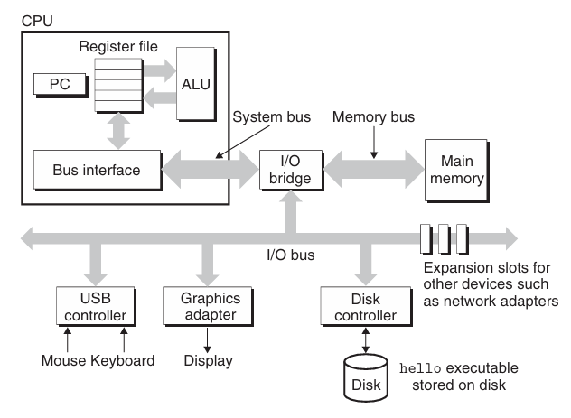
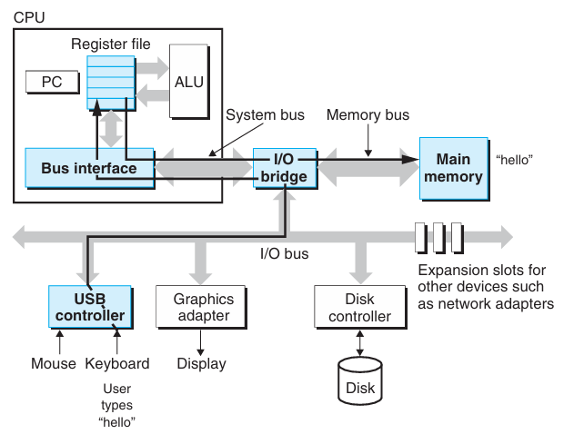
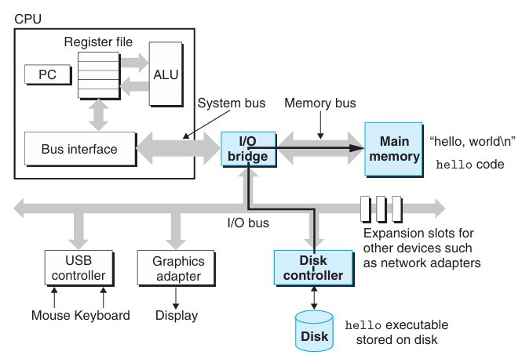
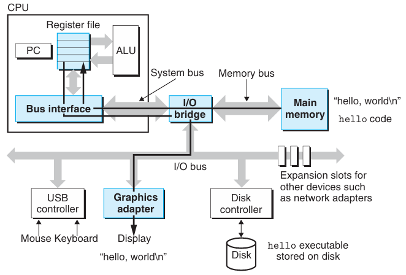
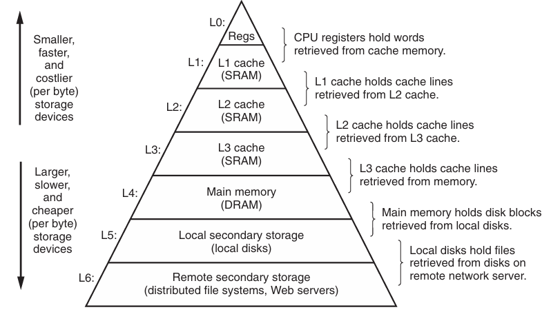
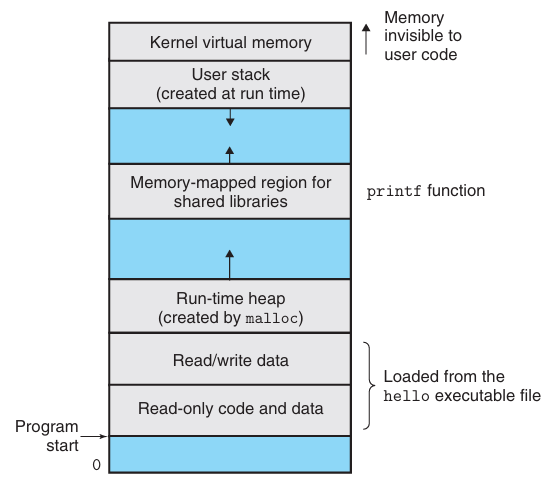
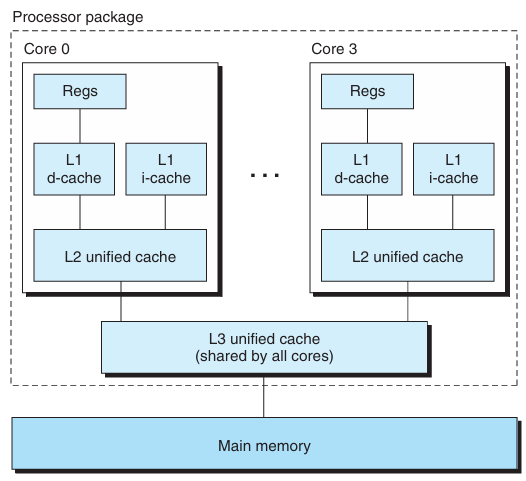

我们从 K&R（`Kernighan and Ritchie`）经典的 C 语言程序 `hello.c` 开始，研究从源代码开始是如何一步步编译成可执行文件的，系统是如何加载并运行这个程序的。再这个过程中，我们会介绍一些计算机系统的基本概念和原理，后续的章节会继续深入这些概念和原理。

```c
#include <stdio.h>

int main()
{
    printf("Hello, World!\n");
    return 0;
}
```

## 信息与 bits
我们一般把上述代码保存为 `hello.c`，这是一个文本文件，是一系列的 bit（0 和 1），组织为 8 bits 的字节（`byte`）。大部分的计算机使用 ASCII 编码保存，非英文国家可能会使用其他编码，最常见的是 UTF-8 编码。

文本文件是一系列的字节，每个字节可以看作是一个整数来表示相应的字符。比如 `#` 的 ASCII 码是 35，`i` 的 ASCII 码是 105，等等。

所有的信息都是一系列的 bits，在不同的上下文中，解释这些 bits 的方式不同。一系列的字节可以表示整数、浮点数、字符、指令等等。

## 编译与链接
`hello.c` 是源代码文件，是 C 这种高级语言，需要一步步的编译成一系列机器语言指令（`machine-language instructions`），最终形成一个可执行目标程序（`executable object program`）或可执行目标文件（`executable object file`）。整个过程如下：
```
                                                                            printf.o
                                                                               |
                                                                               v
         preprocessor              compiler           assembler              linker
hello.c ---------------> hello.i ----------> hello.s ------------> hello.o ---------> hello
```
涉及四个程序：预处理器（`preprocessor`）、编译器（`compiler`）、汇编器（`assembler`）和链接器（`linker`），它们构成了编译系统（`compilation system`）。前面三个文件是文本文件，最后两个文件是二进制文件。

* 预处理阶段（`preprocessing phase`）会处理以 `#` 开头的代码，比如 `#include <stdio.h>`，会把 `stdio.h` 头文件的内容插入到 `hello.c` 中，生成一个新的文本文件 `hello.i`，这还是一个 C 语言的源代码文件。
* 编译阶段（`compilation phase`）会把 `hello.i` 编译成汇编语言程序（`assembly language program`）`hello.s`。不同的高级语言的编译器都会生成汇编语言。下面是 `hello.s` 的部分内容（`gcc` 版本 15.2.0）：

```assembly
main:
	pushq	%rbp
	movq	%rsp, %rbp
	leaq	.LC0(%rip), %rax
	movq	%rax, %rdi
	call	puts@PLT
	movl	$0, %eax
	popq	%rbp
	ret
```

* 汇编阶段（`assembly phase`）会把 `hello.s` 汇编成机器语言指令，生成一个二进制文件 `hello.o`，这是可重定位目标程序（`relocatable object program`）。
* 链接阶段（`linking phase`）：`hello` 程序会调用 `printf` 函数，这个函数由 C 标准库提供，在预编译的 `printf.o` 中。链接器会把 `hello.o` 和 `printf.o` 链接成一个可执行文件 `hello`，系统可以加载到内存中并运行。

对于这个简单的程序而言，编译器能够生成足够好的代码。但是基于以下几个理由我们还是要理解整个编译系统的原理：

1. 优化程序性能（`optimizing program performance`）：现代编译器设计精巧能够产出足够好的代码。作为程序员，我们不必了解编译器内部的工作，但是为了在写 C 代码时做出合适的权衡，我们需要理解机器代码和编译器是如何将这些代码转换成机器代码的。
2. 理解链接错误（`understanding linking errors`）：很多复杂的程序报错往往是在链接阶段产生的，特别是大规模的程序。不过时至 2026 年，有了 AI 辅助能够好很多。不过，作为程序员理解了链接器的工作原理，能够更好地理解这些错误。
3. 避免安全漏洞（`avoiding security holes`）：比如缓冲区溢出漏洞（`buffer overflow vulnerability`）是网络常见的安全漏洞，这些漏洞存在往往是由于很少有程序员意识到必须严格限制从不可信的源头接受数据。学习安全编程的第一步就是要理解数据和控制信息在程序栈中是如何存储的以及其影响。

## 加载与运行
现在我们有了一个可执行文件 `hello`，当在 `shell` 中输入 `./hello` 来运行这个程序时会执行这个程序并输出 `Hello, World!`。

`shell` 是一个命令行解释器，等待输入命令。当接受到的不是内置命令时，`shell` 会假设这是一个可执行文件的名字，尝试找到这个程序，然后加载并运行。这里就会加载并运行 `hello` 程序然后等待程序终止。当 `hello` 打印完信息后会退出，此时 `shell` 会再次等待输入命令。

### 系统硬件
要了解程序运行时发生了什么事情，首先要了解硬件系统的基本组成。下图是最新的 Intel 系统的模型，大部分系统都大同小异。



总线（`bus`）是连接各个组件的信息通道，传递固定大小的块，我们称之为字（`word`）。字长（`word size`）是字中的字节数，现代系统的字长通常是 8 字节（64 位），也有 4 字节（32 位）的系统。

输入输出（`input/output`, `I/O`）是和外部世界的连接部分。上图中有四个 I/O 设备，键盘和鼠标用于输入，显示器用于输出，磁盘（`disk`）用于长期保存数据和程序。每一个 I/O 设备通过控制器（`controller`）或适配器（`adapter`）连接到总线。两者主要的区别在于封装的方式，控制器是设备内或者主板（`motherboard`）上的芯片，而适配器是插在主板上的扩展卡。形式不同，但是作用都是在设备和总线之间传递数据。

内存（`main memory`），也可以成为主存，用于临时存放程序和数据，处理器运行程序的时候会使用它们。物理上看，内存是一组动态随机存储内存（`dynamic random access memory`, `DRAM`）芯片，逻辑上看，内存是一个线性的字节数组，每个字节都有一个唯一的地址。程序中的指令的长度不是固定的，C 语言中数据的大小也不是固定的。比如 x86-64 架构中，`short` 类型是 2 字节，`int` `float` 是 4 字节。

中央处理单元（`central processing unit`, `CPU`），简称为处理器（`processor`）是执行指令的引擎。它的核心是一个称作程序计数器（`program counter`, `PC`）的寄存器（`register`），任意时刻 PC 都指向内存中某个机器指令。从开机到断电，CPU 都在不断执行 PC 指向的指令，并且更新 PC 的值来指向下一条指令。处理器按照指令集架构（`instruction set architecture`, `ISA`）定义的、非常简单的指令模型来执行指令。在这个模型中，指令按照顺序执行，执行单条指令需要一系列的步骤。处理器从内存中读取 PC 指向的指令，解释指令的 bits，执行指令所规定的操作，然后更新 PC 的值来指向下一条指令，这条指令在内存中可能是连续的，也有可能是不连续的。这些操作的数量非常有限，通常涉及内存、寄存器堆（`register file`）和算术逻辑单元（`arithmetic-logic unit`, `ALU`）。寄存器堆是一个很小的存储设备，由一组寄存器组成，每个寄存器都有唯一的名字。ALU 计算出新的数据和地址。下面是 CPU 执行指令时可能会去做的几种基础操作：

* 加载（`load`）：从内存中读取一个字到寄存器中。
* 存储（`store`）：把寄存器中的一个字写回内存中。
* 操作（`operate`）：从寄存器中读取两个字，送到 ALU 进行算术或逻辑运算，然后把结果写回寄存器中。
* 跳转（`jump`）：从指令中抽取一个字写入 PC 寄存器中。

从表面看，CPU 只是简单的按照模型去执行，但是为了加速程序的运行，机制要复杂的多。因此我们需要理解指令集和微架构（`microarchitecture`）的区别，前者定义了每条指令做什么事情，后者描绘了处理器的实现。

### 运行 hello 程序
下面从宏观的角度分析运行 `./hello` 时发生了什么事情。

首先，`shell` 等待我们输入命令。当我们在键盘上敲 `./hello` 时，`shell` 读取每一个字符到寄存器，然后存到内存中。



当我们按下回车键时，`shell` 知道我们已经输入完命令了，`shell` 通过一系列指令加载 `hello` 程序，把 `hello` 的数据和代码都从磁盘拷贝到内存，其中数据包含最终打印到屏幕的 `Hello, World!\n`。使用直接内存访问（`direct memory access`, `DMA`），数据直接从磁盘传输到内存中，不需要经过处理器。



一旦加载到内存，处理器开始执行 `hello` 程序中 `main` 函数中的指令。这些指令从内存拷贝字符串 `Hello, World!\n` 到寄存器中，然后到显示设备，即输出在显示器上。



## 缓存
从上面简单的例子可以看出来，在不同的组件之间有大量的拷贝。从程序员的视角看，这些拷贝拖慢了程序运行的速度，因此设计者需要让这些拷贝尽可能快。由于物理因素的限制，更大的存储设备比小的存储设备要慢，而快的存储设备更贵。比如磁盘比内存大 1,000 倍，但是访问速度慢了 10,000,000 倍。类似的，内存大小是若干 GB，但是寄存器堆只能存放数百字节，但是寄存器比内存访问快 100 倍。更麻烦的是随着半导体技术的发展，处理器与内存的差距（`processor-memory gap`）越来越大，因为让处理器更快比内存更快容易的多，也便宜的多。

解决这个问题的方式是在处理器和内存之间增加缓存（`cache`），用于存储处理器在不远的将来可能会访问的数据。`L1 cache` 是处理器内部的缓存，只有几十 KB 量级的大小，访问速度和寄存器一样快。`L2 cache` 更大，但是访问速度比 `L1 cache` 慢几倍，但是仍旧比访问内存块的多。更先进的处理器还有 `L3 cache`。这些缓存使用的是静态随机存储器（`static random access memory`, `SRAM`）。缓存背后的核心思想利用程序的局部性（`locality`）——程序在某个时间段内访问局部范围内的数据和指令——来构建一个更大、更快的存储系统。

## 存储层次
将在处理器和内存之间插入一个小的、更快的缓存的思想泛化，可以得到存储层次结构（`memory hierarchy`），现在每个计算机系统都是按照存储层次结构设计的。从上往下，速度更慢，容量更大，单位价格更便宜。存储层次结构的核心思想就是每一层是下一层的缓存。



## 操作系统与硬件
当我们运行 `./hello` 时，程序并不会直接使用鼠标、键盘、显示器，而是通过操作系统（`operating system`, `OS`）来访问这些设备。操作系统可以看作是一个软件层，位于应用程序和硬件之间，所有对硬件的访问都必须通过操作系统来完成。操作系统的目的有两个：（1）保护硬件资源不被滥用；（2）将复杂的、对于各种不同的硬件设备的访问抽象成一个统一的、简单的接口。操作系统通过进程（`process`）、虚拟内存（`virtual memory`）和文件（`file`）这三个抽象实现上述目的，它们分别是对 CPU、内存和 I/O 设备的抽象。

### 进程
进程（`process`）是对正在运行的程序的抽象。操作系统给运行的程序一种假象，它独占了整个系统，包括 CPU、内存和 I/O 设备等各种资源。多个进程并发地（`concurrently`）运行在同一个系统上，每个进程都认为自己独占了系统资源。大部分系统中，同时运行的进程数都大于处理器的个数。不管是单核 CPU 还是现在的多核处理器，通过在不同的进程之间切换，单个 CPU 能够并发地执行多个进程。操作系统控制这个交织的过程，成为上下文切换（`context switch`）。这里先讨论只有一个 CPU 的单处理器系统（`uniprocessor system`）。

操作系统保存着一个进程执行所需要的所有信息，包括程序计数器、寄存器、内存的内容等，这些信息成为上下文（`context`）。任意时刻单处理器只能执行一个进程的指令。当操作系统决定将控制权从当前进程转移到新的进程时，首先保存当前进程的上下文，恢复新进程的上下文，然后将控制权交给新的进程，这个过程称为上下文切换（`context switch`），由操作系统内核（`kernel`）来完成。内核是操作系统的核心部分。当应用程序需要操作系统提供服务时，比如读写文件，执行特殊的函数系统调用（`system call`），控制权交给内核，内核执行完相应的操作之后返回应用程序。内核不是一个特殊的进程，它是操作系统管理进程的代码和数据结构的集合。

现代系统中，一个进程包含多个称为线程（`thread`）的执行单元，每个线程运行在进程的上下文中，共享代码和全局数据。由于并发、共享数据更简单、更高效，线程是一种日益重要的编程模型。在多处理器系统上，多线程是一种可以让程序运行更快的方式。

### 虚拟内存
虚拟内存（`virtual memory`）给进程一个假象，自己在独占内存。每一个进程看到一个统一的内存，称为虚拟地址空间（`virtual address space`）。Linux 进程看到虚拟地址空间如下图所示：



整个空间自底向上增长，大致分为以下几个部分：

* 程序代码和数据（`program code and data`）：所有进程的代码从固定地址开始，然后是全局变量的数据位置。这个区域从二进制文件中直接初始化。
* 堆（`heap`）：接下来是运行时堆空间。代码和数据的大小在初始化的时候就固定下来了，在程序运行时，可以通过调用 C 标准库 `malloc` 和 `free` 来动态地分配和释放堆空间。
* 共享库（`shared libraries`）：在地址空间的中段放着来自共享库的代码和数据。
* 栈（`stack`）：顶部是用户栈（`user stack`），编译器使用这个部分实现函数调用。随着程序的运行，准确地说是调用函数和函数返回时，栈会增长和收缩。
* 内核虚拟内存（`kernel virtual memory`）：最顶部是为内存保留的区域。应用程序不允许读写这个区域的内容，或者直接调用内核定义的函数，必须通过调用内核来执行这些操作。

为了实现虚拟内存，硬件和操作系统必须紧密配合。

### 文件
文件（`file`）是一系列字节。每一种 I/O 设备都被抽象成一个文件，包括磁盘、键盘、显示器、网络等。使用 Unix I/O 系统调用，执行读写文件，就能执行这些输入输出。这个简单而优雅的概念给了应用层一个统一的抽象。

## Amdahl 定律
Amdahl 定律（`Amdahl's law`）是一个重要的定律，描述了系统性能提升的潜在限制。假定一个程序现在的执行时间是 $T_{odd}$，一些组件占比是 $\alpha$，如果这些组件提速了 $k$ 倍，这些组件的开销从 $\alpha T_{odd}$ 变成了 $\frac{\alpha T_{odd}}{k}$，因此新的执行时间是
$$T_{new} = (1-\alpha)T_{odd} + \frac{\alpha T_{odd}}{k} = \left(1-\alpha + \frac{\alpha}{k}\right)T_{odd}$$
因此性能提升的倍数是
$$S = \frac{T_{odd}}{T_{new}} = \frac{1}{1-\alpha + \frac{\alpha}{k}}$$
一个特殊情况是 $k \to \infty$，也就是把组件的执行时间降到 0，此时性能提升的倍数是
$$S = \frac{1}{1-\alpha}$$

## 并发和并行
做的更多（吞吐更大）和做的更快（响应时间更短）是计算机系统的两个重要目标。并发（`concurrency`）和并行（`parallelism`）是实现这两个目标的两种不同的方式。前者指的是系统中有多个活动在同时运行，后者指的是系统中有多个活动在同一时刻运行。下面是三个不同层次的并发和并行，达到上述两个目的。

### 线程级别的并发
基于进程抽象，能够同时运行多个程序，达到并发的目的。有了线程，一个进程内能够有更多的控制流在执行。在过去很长的一段时间，只有一个处理器，只能处理一个进程，靠上下文切换来实现并发。现在的系统有多个处理器，同时还有多核处理器（`multicore processor`）和超线程（`hyperthreading`）技术，能够同时运行多个进程，达到并行的目的。

多核处理器把多个 CPU 集成到同一个芯片上，下图是一个典型的多核处理器的架构。这个芯片上有四个核心，每个核心都有自己的 L1 和 L2 缓存，四个核心共享一个 L3 缓存。L1 又分成了两个部分，分别缓存数据和代码。业界专家预测未来一个芯片上会集成几十甚至数百个核心。



超线程技术也称为同时多线程（`simultaneous multithreading`），在一个 CPU 上同时执行多个控制流。实现方法是部分 CPU 硬件有多个拷贝，比如 PC 和寄存器堆，其他硬件只有一个拷贝。传统的线程切换需要 20,000 个 CPU 周期，而超线程技术可以逐周期地动态决定执行哪一个线程，这使得 CPU 可以充分利用其硬件资源。

多处理器可以从两个方面提升性能。首先减少了模拟并发的需要；其次是如果一个程序是多线程的，那么运行单个程序也可以更快。随着多核和超线程技术的普及，多线程编程能够更好地利用这些技术来提升性能。

### 指令级别的并行
更低一层的抽象是指令级别并行（`instruction-level parallelism`）。过去的处理器执行一个指令需要几个（3-10）个时钟周期，现代的处理器一个时钟周期能执行多个（2-4）指令。每条指令需要 20 个周期或者更多的时钟周期，但是现代处理器同时能够执行上百条指令。流水线（`pipelining`）是实现指令级别并行的主要技术。执行的指令分成不同的步骤，处理器的硬件也被组织成一系列的阶段，每个阶段负责执行其中的一个步骤，并行处理不同指令的不同步骤。能够使指令持续执行速率超过每个时钟周期 1 条的处理器被称为超标量（`superscalar`）处理器。如今，绝大多数现代处理器都支持超标量。

### SIMD 并行
再低一层，现代处理器支持单指令多数据（`single instruction, multiple data`, `SIMD`）并行，即一条指令同步并行的执行多次操作。这些指令能够加速处理数据。

## 抽象的重要性
抽象（`abstraction`）是计算机系统的核心概念。比如一组功能集抽象成简单的 API（`application programming interface`），程序员无需关心实现细节。不同的编程语言提供了不同形式和层次的抽象。之前也介绍了很多抽象的例子，比如指令集（`instruction set architecture`）是处理器硬件的抽象，借助这种抽象，机器代码执行仿佛是每次只有一条指令在处理器上执行，尽管底层硬件复杂的多，并行的执行多条指令，但是执行方式和简单的顺序模型保持一致。保持同样的执行模型，不同处理器执行相同的机器代码时的开销和性能会有所不同。

操作系统提供了文件、虚拟内存和进程等抽象，再往上还有一个抽象是虚拟机（`virtual machine`），它提供的是整个计算机系统的抽象，包括操作系统、处理器和程序。上世纪 60 年代由 IBM 提出，现在越来越重要。现在这是一种主流的管理方式，应对为了能够运行为不同操作系统或同一个操作系统不同版本设计的程序的计算机系统。
