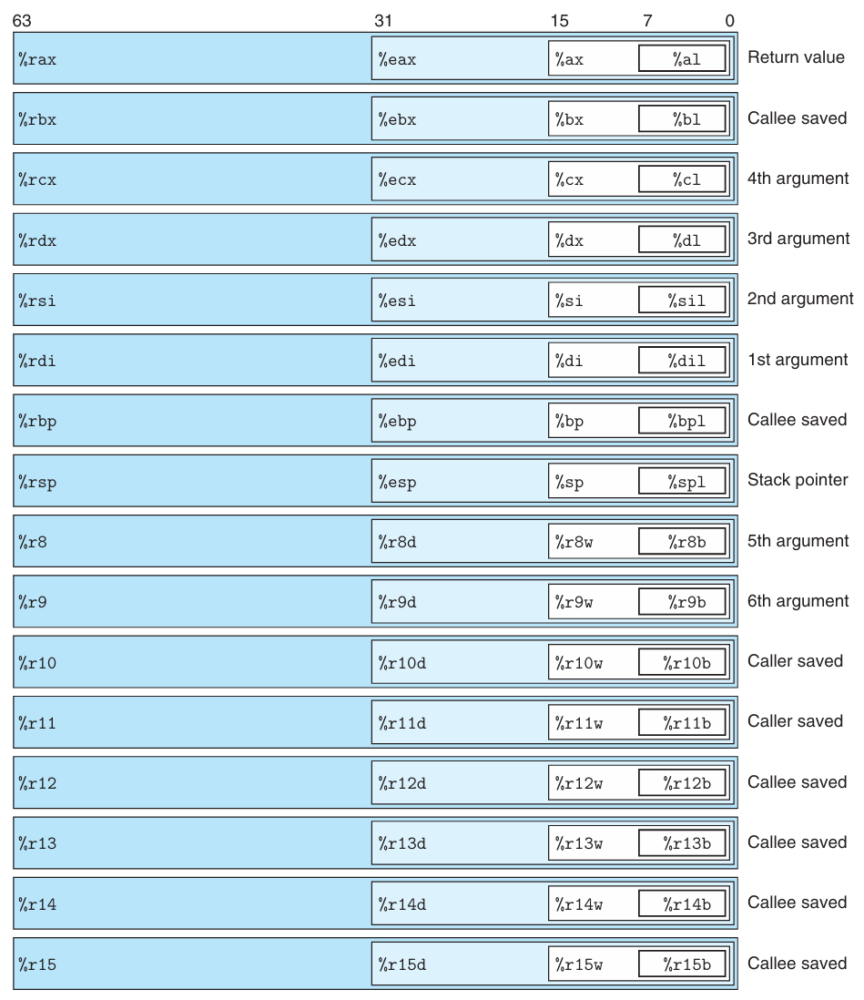

计算机执行的是机器码（`machine code`），即一串编码了底层操作的字节序列，这些操作执行着数据操控、内存管理、存储设备读写以及网络通信等任务。编译器根据编程语言的语法规则、目标机器的指令集以及操作系统遵循的约定来生成机器码。GCC C 语言编译器会先生成汇编代码（`assembly code`），这是机器码的一种文本表示形式，是程序中一条条具体的指令。接着，GCC 会调用汇编器（`assembler`）和链接器（`linker`），将汇编代码最终转化为可执行的机器码。

使用 C 语言这样的高级语言编程时，底层机器的实现细节对我们是屏蔽的。早期程序员必须亲自编写汇编指令来控制计算机。高级语言提供了更高层次的抽象，生产力要高得多，代码也更可靠。现代编译器生成的代码不亚于资深汇编专家手写的代码。用高级语言编写的程序可以在不同的机器上编译和运行，而汇编代码则高度依赖于具体机器。随着 AI 时代的到来，使用自然语言编程的效率可能更高，但代码的可靠性还有待验证。未来，阅读高级语言代码或许会像如今阅读汇编代码一样困难。

为什么要学习机器级表示的汇编代码呢？通过阅读汇编代码，可以理解编译器的优化能力，并分析代码中潜在的高耗能、低效之处。高级语言提供的抽象层可能会隐藏我们必须了解的运行时行为信息，而这些信息在汇编层面上清晰可见。许多恶意软件的攻击手段都利用了程序运行时的细微机制，学习汇编可以帮助我们理解漏洞是如何产生的，以及如何防范它们。程序员已经从直接编写汇编语言，转变为只需能够阅读和理解汇编代码。AI 时代，未来的程序员或许只需能够阅读和理解 AI 生成的高级语言代码。

下面的讲解基于 x86-64 架构。该架构发展了数十年，大量特性都是为了向下兼容，其中一些特性在现代编译器和操作系统中已很少使用。因此，下面只聚焦于 GCC 和 Linux 常用的特性子集。

## 程序的编码与表示
假定我们写了两个 C 语言文件 `p1.c` `p2.c`，执行下面的命令进行编译：
```bash
gcc -Og -o p p1.c p2.c
```
命令使用 `-Og` 选项指示编译器进行面向调试的优化，使生成的机器码大致保留 C 代码的整体结构。调用更高级别的优化可能生成经过大幅转换的代码，难以直接对应源代码的结构。因此，可以将 `-Og` 作为调试和学习机器级表示的首选优化级别，再观察提高优化等级时发生的变化。`gcc` 会调用一系列软件，将源代码转换为可执行代码。首先，C 预处理器（`C preprocessor`）会将 `#include` 引入的头文件内容展开到源代码中，并展开 `#define` 定义的宏。接着，编译器（`compiler`）会将预处理后的源代码翻译成汇编代码 `p1.s` `p2.s`。汇编器（`assembler`）会将汇编代码转换为目标文件 `p1.o` `p2.o`。目标代码（`object code`）是一种机器码，包含指令的二进制表示，不过全局变量的地址尚未填入。最后，链接器（`linker`）将两个目标代码文件与库函数的实现（比如 `printf()`）合并，生成最终的可执行代码文件 `p`。可执行代码（`executable code`）是另一种形式的机器码，也是处理器执行的精确形式。两种形式的机器码之间的关系和链接操作将在后续章节中分析。

计算机系统有不同层次的抽象，其中两种抽象对机器级别的编程尤其重要。首先，机器级别程序的格式和指令由指令集架构（`Instruction Set Architecture, ISA`）定义，它规定了处理器状态、指令格式和每条指令对状态的影响。包括 x86-64 在内的指令集都将程序行为描述为仿佛每条指令都按顺序执行，但实际的处理器硬件要精密、复杂得多，能够并发执行多条指令。处理器采用保护机制，以确保整体行为与 ISA 规定的顺序执行结果完全一致。第二个有用的抽象是虚拟地址（`virtual address`），它提供了一个看似极大的字节数组内存模型。后续章节会详细阐述。

汇编代码的表示形式已经非常接近机器码，它的主要特征是采用了可读性更好的文本格式。能够理解汇编代码及其与 C 代码的关系，是理解计算机如何执行程序的关键一步。x86-64 的机器码与 C 语言存在巨大差异。处理器状态中有一些信息对 C 程序员是屏蔽的，但在机器码中却清晰可见。

- 程序计数器（`Program Counter, PC`）：存储下一条将要执行的指令的地址，x86-64 架构中称为 `%rip`。
- 整数寄存器堆（`register file`）：包含 16 个用于存储 64 比特值且有名称的位置。这些寄存器可以存放地址（C 语言中的指针）或整数值。某些寄存器用于跟踪程序状态的关键部分，其他寄存器存放临时数据，例如函数的参数、局部变量和函数的返回值。
- 条件码寄存器：保存最近执行的算术或逻辑指令的状态信息。它们用于实现控制流或数据流的条件变化，例如实现 `if` 和 `while`。
- 向量寄存器：每个寄存器可以存放一个或多个整数或浮点数。

C 语言提供了一种可以在内存中声明和分配不同数据类型对象的模型，但是机器码则简单地将内存视为一个巨大、按字节寻址的数组。C 语言中的聚合类型（比如数组和结构体）在机器码中标识为连续的字节集合。对于标量数据，汇编代码不会区分有符号整数和无符号整数、不同类型的指针，甚至不区分指针和整数。

程序内存包含程序的可执行机器码、操作系统所需的一些信息、用于管理函数调用与返回的运行时栈，以及由用户分配的内存块（比如通过 `malloc()` 分配的堆内存）。程序通过虚拟地址进行寻址；在任意给定时刻，只有虚拟地址的有限子区间被视为有效。例如，在使用 4 级页表的 x86-64 系统中，虚拟地址由 64 位表示，但只有低 48 位有效，高 16 位必须清零。因此，虚拟地址空间大小为 256 TB。操作系统管理这个虚拟地址空间，将虚拟地址转换为处理器物理内存中的地址。

一条指令仅执行非常基础的操作。比如它将两个寄存器中的数相加、在内存和寄存器之间传输数据，或者条件跳转到一个新的指令地址。编译器生成这类指令的序列，实现诸如算术表达式求值、循环或函数调用与返回等程序逻辑。

假定我们写了一个 C 语言源代码文件 `mstore.c`，内容如下：
```c
long mult2(long, long);

void multstore(long x, long y, long *dest)
{
	long t = mult2(x, y);
	*dest = t;
}
```
使用如下命令生成汇编代码，汇编中有一段（删除给汇编器看的内容）如下，是这个函数对应的汇编代码。
```bash
gcc -Og -S mstore.c
```
注意，当前使用的 `gcc` 版本是 15.3，这可能会影响生成的汇编代码的具体内容。
```asm
multstore:
	pushq	%rbx
	movq	%rdx, %rbx
	call	mult2@PLT
	movq	%rax, (%rbx)
	popq	%rbx
	ret
```
每一行对应一条指令，比如 `pushq` 是将寄存器 `%rbx` 的值压入栈中。上述代码中不再有局部变量的名称或数据类型信息。

使用 `-c` 选项可以生成目标代码 `mstore.o`。
```bash
gcc -Og -c mstore.c
```
生成的 `mstore.o` 包含一段 14 字节的序列，对应着上面的汇编指令。从这里可以看出，机器所执行的程序本质上仅仅是一串对一系列指令进行编码的字节序列。机器对于生成这些指令的原始源代码一无所知。
```
53 48 89 d3 e8 00 00 00 00 48 89 03 5b c3
```
要查看目标代码的内容，可以使用反汇编器（`disassembler`），比如 `objdump`：
```bash
objdump -d mstore.o
```
反汇编的结果如下：
```asm
0000000000000000 <multstore>:
   0:   53                      push   %rbx
   1:   48 89 d3                mov    %rdx,%rbx
   4:   e8 00 00 00 00          call   9 <multstore+0x9>
   9:   48 89 03                mov    %rax,(%rbx)
   c:   5b                      pop    %rbx
   d:   c3                      ret
```
左边第一列是指令在目标代码中的偏移地址，后面跟着前面展示的 14 字节内容，它们被划分成了长度不等的字节序列，每条指令对应若干字节。右边是对应的汇编语言表示。关于机器码和反汇编表示，需要注意以下几点：

- x86-64 的指令长度不固定，每条指令可能占用 1 到 15 个字节。指令编码的设计原则是常用指令以及操作数较少的指令占用较少的字节，而不常用的指令或者操作数较多的指令可能占用更多的字节。
- 指令格式的设计保证了从给定的起始位置开始，字节序列能够被唯一解码为机器指令。比如只有 `pushq %rbx` 这条指令以字节值 53 开始。
- 反汇编器完全仅凭文件中的字节序列来确定汇编代码。它不需要访问程序的源代码或原始的汇编代码。
- 反汇编器对指令使用的命名规范与 `gcc` 生成的汇编代码略有不同。比如上面的例子中，指令末尾没有 `q`，而 `gcc` 生成的汇编代码中有 `pushq`、`movq` 等。这个 `q` 是用来指示操作数是 64 位的，是 `Quadword` 的缩写。如果能够依靠后面的寄存器信息推导字长，就可以省略这个后缀。

生成实际的可执行代码，需要对一组目标代码文件进行链接，这组文件必须有一个目标文件包含 `main()` 函数。假定下面是 `main.c` 的实现。
```c
#include <stdio.h>

void multstore(long, long, long *);

int main()
{
	long d;
	multstore(2, 3, &d);
	printf("2 * 3 --> %ld\n", d);
	return 0;
}

long mult2(long a, long b)
{
	long s = a * b;
	return s;
}
```
执行命令
```bash
gcc -Og -o prog main.c mstore.c
```
可以得到可执行文件 `prog`，它的大小增长到了 16 KB 左右。因为它不仅包含我们写的函数的机器码，还包含了用于启动和终止程序、与操作系统交互的代码。

我们再使用如下命令
```bash
objdump -d prog
```
查看反汇编结果。
```asm
0000000000001179 <multstore>:
    1179:       53                      push   %rbx
    117a:       48 89 d3                mov    %rdx,%rbx
    117d:       e8 ef ff ff ff          call   1171 <mult2>
    1182:       48 89 03                mov    %rax,(%rbx)
    1185:       5b                      pop    %rbx
    1186:       c3                      ret
```
这段代码与前面单独生成的 `mstore.o` 的反汇编结果基本一致。一个区别是左侧的偏移量不同，链接器已经将这段代码重定位到不同的地址范围。第二个区别是链接器填入了 `call` 指令在调用函数 `mult2` 时应当使用的正确相对位移。链接器的任务之一就是将函数调用与这些函数可执行代码的具体位置匹配起来。

`gcc` 生成的汇编代码对人类来说很难阅读。一方面它包含了许多我们无需关心的信息，另一方面它没有提供任何关于程序或其工作原理的描述。之前我们使用
```bash
gcc -Og -S mstore.c
```
生成的汇编代码的完整版如下：
```asm
	.file	"mstore.c"
	.text
	.globl	multstore
	.type	multstore, @function
multstore:
.LFB0:
	.cfi_startproc
	pushq	%rbx
	.cfi_def_cfa_offset 16
	.cfi_offset 3, -16
	movq	%rdx, %rbx
	call	mult2@PLT
	movq	%rax, (%rbx)
	popq	%rbx
	.cfi_def_cfa_offset 8
	ret
	.cfi_endproc
.LFE0:
	.size	multstore, .-multstore
	.ident	"GCC: (Debian 15.3.0-2) 15.3.0"
	.section	.note.GNU-stack,"",@progbits
```
所有以 `.` 开头的行都是用于指导汇编器和链接器的伪指令，我们通常可以忽略。另外代码中没有任何解释性备注来说明指令的功能，也没有与原始 C 代码关联起来。

为了更清晰地展示汇编代码，后续会省略大部分伪指令，同时加上行号和注释，描述指令的作用以及它们如何与原始 C 代码对应。

## 数据格式
Intel 架构起源于 16 位架构，逐步扩展到 32 位、64 位，因此 Intel 使用术语字（`word`）表示 16 位，双字（`double word`）表示 32 位，四字（`quad word`）表示 64 位。下图是标准 C 语言的数据类型在 x86-64 架构下的表示形式。`int` 以双字 32 位存储，指针以四字 64 位存储，`long` 以四字 64 位存储。x86-64 指令集包含处理字节、字、双字和四字的指令。

浮点数主要有两种常见格式：单精度（4 字节）和双精度（8 字节），分别对应 `float` 和 `double` 类型。

由 `gcc` 生成的大多数汇编指令都有一个单字符后缀，用于表示操作数的大小。比如数据传送指令就有四个变体：`movb` `movw` `movl` `movq`，分别对应字节、字、双字和四字的数据传送。后缀 `l` 表示双字是因为 32 位数据被看作是长字（`long word`）。`l` 也用来表示 8 字节的双精度浮点数。不过这并不会引起混淆，因为浮点数运算涉及的是一套完全不同的指令和寄存器。

| C declaration | Intel data type | Assembly-code suffix | Size (bytes) |
|--|--|--|--|
| `char` | Byte | `b` | 1 |
| `short` | Word | `w` | 2 |
| `int` | Double word | `l` | 4 |
| `long` | Quad word | `q` | 8 |
| `char *` | Quad word | `q` | 8 |
| `float` | Single precision | `s` | 4 |
| `double` | Double precision | `l` | 8 |

## 信息访问
一个 x86-64 CPU 包含一组 16 个存储 64 位值的通用寄存器。这些寄存器用于存放整数数据以及指针。下图是这些寄存器的示意图。由于指令集的历史演进，这些寄存器都以 `%r` 开头，但在其他方面遵循了几种不同的命名规范。最初 8086 有 8 个 16 位寄存器，如下图的 `%ax` 到 `%bp`，每个寄存器都有特殊的用途，命名反映了预期的用法。随着向 IA-32 扩展，这些寄存器扩展到了 32 位，命名为 `%eax` 到 `%ebp`。后面又向 x86-64 扩展，最初的 8 个寄存器被扩展到了 64 位，命名为 `%rax` 到 `%rbp`。新增的 8 个寄存器使用新的命名规范，从 `%r8` 到 `%r15`。

指令可以对存储在这 16 个寄存器的低字节中的不同大小的数据进行操作。字节操作可以访问最低有效字节（`least significant byte`），16 位操作可以访问最低有效的两个字节，32 位操作可以访问最低有效的四个字节，64 位操作可以访问整个寄存器。

后续将介绍处理 1、2、4、8 字节数据的指令。如果指令的操作数少于 8 字节，指令可分为两类：处理 1 和 2 字节数据的指令保持其余字节不变，处理 4 字节数据的指令会将高 4 字节清零。

在程序运行时，不同的寄存器扮演着不同的角色。最特殊的是 `%rsp` 栈指针，用于指示运行时栈顶的位置。某些指令会专门读取和写入该寄存器。其他剩余的 15 个寄存器的用途具有更大的灵活性。少数指令会特定地使用某些寄存器。更为重要的是，有一套标准的编程规范规定如何使用这些寄存器来管理栈、传递函数参数、从函数返回值以及存储局部数据和临时数据。



### 操作数指示符
大部分指令包含一个或多个操作数（`operand`），用于指定执行操作时使用的源值（`source value`）和存放结果的目标位置（`destination location`）。x86-64 支持多种操作数的形式，如下表所示。源值可以作为常数给出，也可以从寄存器或内存中读取。结果可以放到寄存器或者内存中。因此操作数可以分成三种类型。

| Type | Form | Operand value | Name |
|------|------|---------------|------|
| Immediate | $\$Imm$ | $Imm$ | Immediate |
| Register | $r_a$ | $R[r_a]$ | Register |
| Memory | $Imm$ | $M[Imm]$ | Absolute |
| Memory | $(r_a)$ | $M[R[r_a]]$ | Indirect |
| Memory | $Imm(r_b)$ | $M[Imm+R[r_b]]$ | Base + displacement |
| Memory | $(r_b,r_i)$ | $M[R[r_b]+ R[r_i]]$ | Indexed |
| Memory | $Imm(r_b, r_i)$ | $M[Imm+R[r_b]+R[r_i]]$ | Indexed |
| Memory | $(,r_i,s)$ | $M[R[r_i] \cdot s]$ | Scaled indexed |
| Memory | $Imm(,r_i,s)$ | $M[Imm+R[r_i] \cdot s]$ | Scaled indexed |
| Memory | $(r_b,r_i,s)$ | $M[R[r_b]+ R[r_i] \cdot s]$ | Scaled indexed |
| Memory | $Imm(r_b,r_i,s)$ | $M[Imm+R[r_b]+R[r_i] \cdot s]$ | Scaled indexed |

第一种是立即数（`immediate`），它是一个常数值，格式是字符 `$` 后跟常数，常数的写法采用标准 C 语言的整数表示法，比如 `$-577` `$0x1F`。不同指令允许的立即数范围不同，汇编器会自动选择最近凑的编码。

第二种是寄存器（`register`），它表示存放在 CPU 内部寄存器中的值。对于 64、32、16、8 位的操作数，分别对应 16 个通用寄存器的 64、32、16、8 位部分。我们使用 $r_a$ 表示任意寄存器 $a$，这里将寄存器视为一个由寄存器标识符进行索引的数组 $R$，即 $R[r_a]$ 表示寄存器 $r_a$ 中存放的值。

第三种是内存（`memory`）引用，根据计算出的地址来访问某个内存位置，这里称为有效地址（`effective address`）。内存被看作是一个巨大的字节数组，因此使用记号 $M_b[Addr]$ 表示对存储在地址 $Addr$ 处的 $b$ 个字节的值进行引用。简单起见常常会忽略下标 $b$。

如上表所示有许多不同的寻址模式（`addressing mode`），允许不同形式的内存引用。最通用的形式是最后一行，一个立即数偏移量 $Imm$，一个基地址寄存器 $r_b$，一个索引寄存器 $r_i$，以及一个比例因子 $s$，其中 $s$ 是 1、2、4 或 8。有效地址的计算公式为 $Imm+R[r_b]+R[r_i] \cdot s$。其他形式可以看作是该最通用形式的特例，通过省略某些分量得到的。在引用数组和结构体成员时，这些更为复杂的寻址模式非常有用。

### 数据传送指令
数据从一个位置复制到另一个位置的指令是使用最频繁的指令之一。操作数的通用性使得一条简单的数据传送指令能够表达多种可能性。这里介绍许多不同类型的数据传送指令，它们在源和目的的类型、执行的转换以及可能产生的副作用方面有所差异。这里我们将不同的指令划分为不同的指令类（`instruction class`），同一个类中的指令执行相同的操作，但处理的操作数大小不同。

最简单的数据传送指令是 `MOV` 类，这些指令将数据从源位置复制到目的位置，不进行任何转换。这四条指令分别是 `movb` `movw` `movl` `movq`，它们分别对应 1、2、4、8 字节的数据传送。

源操作数指定了一个值，这个值可以是立即数，也可以是存储在寄存器或者内存中的值。目的操作数指定一个位置，可以是寄存器或者内存中的某个位置。x86-64 有一个限制，传送指令不能将两个操作数同时指定为内存位置。将一个值从内存某个位置复制到内存的另一个位置需要两条指令，第一条将值从源内存位置复制到寄存器，第二条再将值从寄存器复制到目的内存位置。这些指令的寄存器可以是 16 个寄存器的任意一个，寄存器的大小必须与指令名最后一个字符（`b` `w` `l` `q`）指定的大小匹配。大部分情况下 `mov` 指令只会更新目的操作数指定的特定寄存器字节或内存位置。不过 `movl` 以寄存器为目的操作数时，会将高 32 位清零。

下面是源与目的类型的五种组合的示例。源操作数在前，目的操作数在后。
```asm
movl $0x4050,%eax		# Immediate--Register,	4 bytes
movw %bp,%sp			# Register--Register,	2 bytes
movb (%rdi,%rcx),%al	# Memory--Register,		1 byte
movb $-17,(%esp)		# Immediate--Memory,	1 byte
movq %rax,-12(%rbp)		# Register--Memory,		8 bytes
```

`movq` 指令接受能被表示为 32 位补码的立即数作为源操作数，该值随后被符号扩展为 64 位传送到目的地。`movabsq` 指令则允许使用任意 64 位立即数作为源操作数，并且只能以寄存器作为目的操作数。

下面的例子展示了数据传送指令对寄存器高位字节的影响。`movl` 指令在将 32 位值传送到寄存器时，会将该寄存器的高 32 位清零。`movb` `movw` 指令则不会影响高位字节。
```asm
movabsq	$0x0011223344556677,%rax	# %rax=0011223344556677
movb	$-1,%al						# %rax=00112233445566FF
movw	$-1,%ax						# %rax=001122334455FFFF
movl	$-1,%eax					# %rax=00000000FFFFFFFF
movq	$-1,%rax					# %rax=FFFFFFFFFFFFFFFF
```

接下来介绍两类将较小的源数据复制到较大的目的地的数据传送指令。源操作数可以来自寄存器或内存，而目的操作数必须是寄存器。这两类指令分别是零扩展（`zero-extension`）`MOVZ` 和符号扩展（`sign-extension`）`MOVS` 指令。零扩展指令将源操作数的高位填充为零，而符号扩展指令则根据源操作数的符号位填充高位。每个指令名称的最后两个字符是大小指示符，第一个指定了源操作数的大小，第二个字符指定了目的操作数的大小。这些指令分别是 `movzbw` `movzbl` `movzbq` `movzwl` `movzwq` `movsbw` `movsbl` `movsbq` `movswl` `movswq` `movslq`。从对称性上看，这个列表少了一个指令 `movzlq`，它将 32 位寄存器的值零扩展到 64 位寄存器。使用 `movl` 指令将 32 位值传送到 64 位寄存器时，就会将高 32 位清零。

符号扩展指令还有一个特殊的指令 `cltq`，它没有操作数，作用是将寄存器 `%eax` 中的 32 位值符号扩展到寄存器 `%rax` 的 64 位。等价于 `movslq %eax,%rax`，但是 `cltq` 的编码更紧凑。

下面是一个更综合的示例，展示不同指令对目标寄存器高位字节的影响。
```asm
movabsq	$0x0011223344556677,%rax	# %rax=0011223344556677
movb	$0xAA,%dl					# %dl =AA
movb	%dl,%al						# %rax=00112233445566AA
movsbq	%dl,%rax					# %rax=FFFFFFFFFFFFFFAA
movzbq	%dl,%rax					# %rax=00000000000000AA
```
