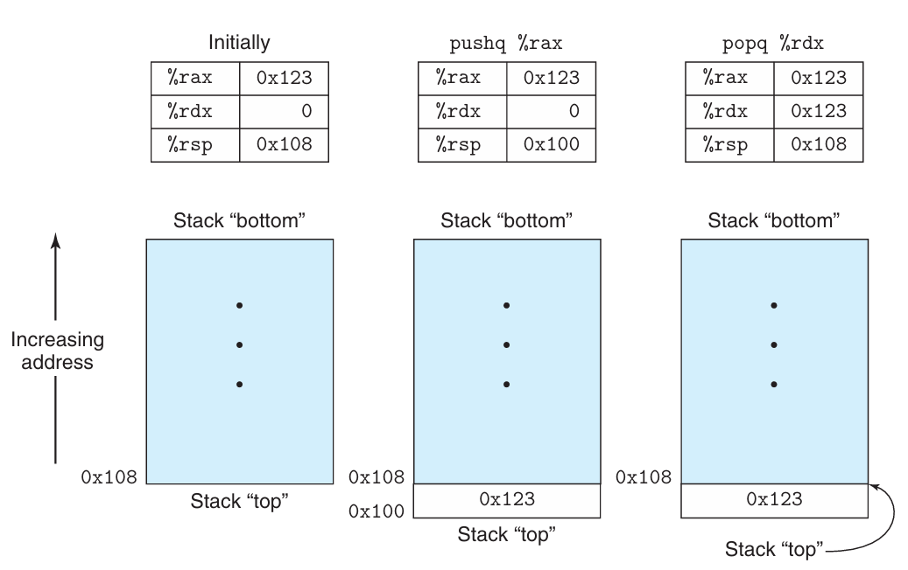

计算机执行的是机器码（`machine code`），即一串编码了底层操作的字节序列，这些操作执行着数据操控、内存管理、存储设备读写以及网络通信等任务。编译器根据编程语言的语法规则、目标机器的指令集以及操作系统遵循的约定来生成机器码。GCC C 语言编译器会先生成汇编代码（`assembly code`），这是机器码的一种文本表示形式，是程序中一条条具体的指令。接着，GCC 会调用汇编器（`assembler`）和链接器（`linker`），将汇编代码最终转化为可执行的机器码。

使用 C 语言这样的高级语言编程时，底层机器的实现细节对我们是屏蔽的。早期程序员必须亲自编写汇编指令来控制计算机。高级语言提供了更高层次的抽象，生产力要高得多，代码也更可靠。现代编译器生成的代码不亚于资深汇编专家手写的代码。用高级语言编写的程序可以在不同的机器上编译和运行，而汇编代码则高度依赖于具体机器。随着 AI 时代的到来，使用自然语言编程的效率可能更高，但代码的可靠性还有待验证。未来，阅读高级语言代码或许会像如今阅读汇编代码一样困难。

为什么要学习机器级表示的汇编代码呢？通过阅读汇编代码，可以理解编译器的优化能力，并分析代码中潜在的高耗能、低效之处。高级语言提供的抽象层可能会隐藏我们必须了解的运行时行为信息，而这些信息在汇编层面上清晰可见。许多恶意软件的攻击手段都利用了程序运行时的细微机制，学习汇编可以帮助我们理解漏洞是如何产生的，以及如何防范它们。程序员已经从直接编写汇编语言，转变为只需能够阅读和理解汇编代码。AI 时代，未来的程序员或许只需能够阅读和理解 AI 生成的高级语言代码。

下面的讲解基于 x86-64 架构。该架构发展了数十年，大量特性都是为了向下兼容，其中一些特性在现代编译器和操作系统中已很少使用。因此，下面只聚焦于 GCC 和 Linux 常用的特性子集。

## 程序的编码与表示
假定我们写了两个 C 语言文件 `p1.c` `p2.c`，执行下面的命令进行编译：
```bash
gcc -Og -o p p1.c p2.c
```
命令使用 `-Og` 选项指示编译器进行面向调试的优化，使生成的机器码大致保留 C 代码的整体结构。调用更高级别的优化可能生成经过大幅转换的代码，难以直接对应源代码的结构。因此，可以将 `-Og` 作为调试和学习机器级表示的首选优化级别，再观察提高优化等级时发生的变化。`gcc` 会调用一系列软件，将源代码转换为可执行代码。首先，C 预处理器（`C preprocessor`）会将 `#include` 引入的头文件内容展开到源代码中，并展开 `#define` 定义的宏。接着，编译器（`compiler`）会将预处理后的源代码翻译成汇编代码 `p1.s` `p2.s`。汇编器（`assembler`）会将汇编代码转换为目标文件 `p1.o` `p2.o`。目标代码（`object code`）是一种机器码，包含指令的二进制表示，不过全局变量的地址尚未填入。最后，链接器（`linker`）将两个目标代码文件与库函数的实现（比如 `printf()`）合并，生成最终的可执行代码文件 `p`。可执行代码（`executable code`）是另一种形式的机器码，也是处理器执行的精确形式。两种形式的机器码之间的关系和链接操作将在后续章节中分析。

计算机系统有不同层次的抽象，其中两种抽象对机器级别的编程尤其重要。首先，机器级别程序的格式和指令由指令集架构（`Instruction Set Architecture, ISA`）定义，它规定了处理器状态、指令格式和每条指令对状态的影响。包括 x86-64 在内的指令集都将程序行为描述为仿佛每条指令都按顺序执行，但实际的处理器硬件要精密、复杂得多，能够并发执行多条指令。处理器采用保护机制，以确保整体行为与 ISA 规定的顺序执行结果完全一致。第二个有用的抽象是虚拟地址（`virtual address`），它提供了一个看似极大的字节数组内存模型。后续章节会详细阐述。

汇编代码的表示形式已经非常接近机器码，它的主要特征是采用了可读性更好的文本格式。能够理解汇编代码及其与 C 代码的关系，是理解计算机如何执行程序的关键一步。x86-64 的机器码与 C 语言存在巨大差异。处理器状态中有一些信息对 C 程序员是屏蔽的，但在机器码中却清晰可见。

- 程序计数器（`Program Counter, PC`）：存储下一条将要执行的指令的地址，x86-64 架构中称为 `%rip`。
- 整数寄存器堆（`register file`）：包含 16 个用于存储 64 比特值且有名称的位置。这些寄存器可以存放地址（C 语言中的指针）或整数值。某些寄存器用于跟踪程序状态的关键部分，其他寄存器存放临时数据，例如函数的参数、局部变量和函数的返回值。
- 条件码寄存器：保存最近执行的算术或逻辑指令的状态信息。它们用于实现控制流或数据流的条件变化，例如实现 `if` 和 `while`。
- 向量寄存器：每个寄存器可以存放一个或多个整数或浮点数。

C 语言提供了一种可以在内存中声明和分配不同数据类型对象的模型，但是机器码则简单地将内存视为一个巨大、按字节寻址的数组。C 语言中的聚合类型（比如数组和结构体）在机器码中标识为连续的字节集合。对于标量数据，汇编代码不会区分有符号整数和无符号整数、不同类型的指针，甚至不区分指针和整数。

程序内存包含程序的可执行机器码、操作系统所需的一些信息、用于管理函数调用与返回的运行时栈，以及由用户分配的内存块（比如通过 `malloc()` 分配的堆内存）。程序通过虚拟地址进行寻址；在任意给定时刻，只有虚拟地址的有限子区间被视为有效。例如，在使用 4 级页表的 x86-64 系统中，虚拟地址由 64 位表示，但只有低 48 位有效，高 16 位必须清零。因此，虚拟地址空间大小为 256 TB。操作系统管理这个虚拟地址空间，将虚拟地址转换为处理器物理内存中的地址。

一条指令仅执行非常基础的操作。比如它将两个寄存器中的数相加、在内存和寄存器之间传输数据，或者条件跳转到一个新的指令地址。编译器生成这类指令的序列，实现诸如算术表达式求值、循环或函数调用与返回等程序逻辑。

假定我们写了一个 C 语言源代码文件 `mstore.c`，内容如下：
```c
long mult2(long, long);

void multstore(long x, long y, long *dest)
{
	long t = mult2(x, y);
	*dest = t;
}
```
使用如下命令生成汇编代码，汇编中有一段（删除给汇编器看的内容）如下，是这个函数对应的汇编代码。
```bash
gcc -Og -S mstore.c
```
注意，当前使用的 `gcc` 版本是 15.3，这可能会影响生成的汇编代码的具体内容。
```asm
multstore:
	pushq	%rbx
	movq	%rdx, %rbx
	call	mult2@PLT
	movq	%rax, (%rbx)
	popq	%rbx
	ret
```
每一行对应一条指令，比如 `pushq` 是将寄存器 `%rbx` 的值压入栈中。上述代码中不再有局部变量的名称或数据类型信息。

使用 `-c` 选项可以生成目标代码 `mstore.o`。
```bash
gcc -Og -c mstore.c
```
生成的 `mstore.o` 包含一段 14 字节的序列，对应着上面的汇编指令。从这里可以看出，机器所执行的程序本质上仅仅是一串对一系列指令进行编码的字节序列。机器对于生成这些指令的原始源代码一无所知。
```
53 48 89 d3 e8 00 00 00 00 48 89 03 5b c3
```
要查看目标代码的内容，可以使用反汇编器（`disassembler`），比如 `objdump`：
```bash
objdump -d mstore.o
```
反汇编的结果如下：
```asm
0000000000000000 <multstore>:
   0:   53                      push   %rbx
   1:   48 89 d3                mov    %rdx,%rbx
   4:   e8 00 00 00 00          call   9 <multstore+0x9>
   9:   48 89 03                mov    %rax,(%rbx)
   c:   5b                      pop    %rbx
   d:   c3                      ret
```
左边第一列是指令在目标代码中的偏移地址，后面跟着前面展示的 14 字节内容，它们被划分成了长度不等的字节序列，每条指令对应若干字节。右边是对应的汇编语言表示。关于机器码和反汇编表示，需要注意以下几点：

- x86-64 的指令长度不固定，每条指令可能占用 1 到 15 个字节。指令编码的设计原则是常用指令以及操作数较少的指令占用较少的字节，而不常用的指令或者操作数较多的指令可能占用更多的字节。
- 指令格式的设计保证了从给定的起始位置开始，字节序列能够被唯一解码为机器指令。比如只有 `pushq %rbx` 这条指令以字节值 53 开始。
- 反汇编器完全仅凭文件中的字节序列来确定汇编代码。它不需要访问程序的源代码或原始的汇编代码。
- 反汇编器对指令使用的命名规范与 `gcc` 生成的汇编代码略有不同。比如上面的例子中，指令末尾没有 `q`，而 `gcc` 生成的汇编代码中有 `pushq`、`movq` 等。这个 `q` 是用来指示操作数是 64 位的，是 `Quadword` 的缩写。如果能够依靠后面的寄存器信息推导字长，就可以省略这个后缀。

生成实际的可执行代码，需要对一组目标代码文件进行链接，这组文件必须有一个目标文件包含 `main()` 函数。假定下面是 `main.c` 的实现。
```c
#include <stdio.h>

void multstore(long, long, long *);

int main()
{
	long d;
	multstore(2, 3, &d);
	printf("2 * 3 --> %ld\n", d);
	return 0;
}

long mult2(long a, long b)
{
	long s = a * b;
	return s;
}
```
执行命令
```bash
gcc -Og -o prog main.c mstore.c
```
可以得到可执行文件 `prog`，它的大小增长到了 16 KB 左右。因为它不仅包含我们写的函数的机器码，还包含了用于启动和终止程序、与操作系统交互的代码。

我们再使用如下命令
```bash
objdump -d prog
```
查看反汇编结果。
```asm
0000000000001179 <multstore>:
    1179:       53                      push   %rbx
    117a:       48 89 d3                mov    %rdx,%rbx
    117d:       e8 ef ff ff ff          call   1171 <mult2>
    1182:       48 89 03                mov    %rax,(%rbx)
    1185:       5b                      pop    %rbx
    1186:       c3                      ret
```
这段代码与前面单独生成的 `mstore.o` 的反汇编结果基本一致。一个区别是左侧的偏移量不同，链接器已经将这段代码重定位到不同的地址范围。第二个区别是链接器填入了 `call` 指令在调用函数 `mult2` 时应当使用的正确相对位移。链接器的任务之一就是将函数调用与这些函数可执行代码的具体位置匹配起来。

`gcc` 生成的汇编代码对人类来说很难阅读。一方面它包含了许多我们无需关心的信息，另一方面它没有提供任何关于程序或其工作原理的描述。之前我们使用
```bash
gcc -Og -S mstore.c
```
生成的汇编代码的完整版如下：
```asm
	.file	"mstore.c"
	.text
	.globl	multstore
	.type	multstore, @function
multstore:
.LFB0:
	.cfi_startproc
	pushq	%rbx
	.cfi_def_cfa_offset 16
	.cfi_offset 3, -16
	movq	%rdx, %rbx
	call	mult2@PLT
	movq	%rax, (%rbx)
	popq	%rbx
	.cfi_def_cfa_offset 8
	ret
	.cfi_endproc
.LFE0:
	.size	multstore, .-multstore
	.ident	"GCC: (Debian 15.3.0-2) 15.3.0"
	.section	.note.GNU-stack,"",@progbits
```
所有以 `.` 开头的行都是用于指导汇编器和链接器的伪指令，我们通常可以忽略。另外代码中没有任何解释性备注来说明指令的功能，也没有与原始 C 代码关联起来。

为了更清晰地展示汇编代码，后续会省略大部分伪指令，同时加上行号和注释，描述指令的作用以及它们如何与原始 C 代码对应。

## 数据格式
Intel 架构起源于 16 位架构，逐步扩展到 32 位、64 位，因此 Intel 使用术语字（`word`）表示 16 位，双字（`double word`）表示 32 位，四字（`quad word`）表示 64 位。下图是标准 C 语言的数据类型在 x86-64 架构下的表示形式。`int` 以双字 32 位存储，指针以四字 64 位存储，`long` 以四字 64 位存储。x86-64 指令集包含处理字节、字、双字和四字的指令。

浮点数主要有两种常见格式：单精度（4 字节）和双精度（8 字节），分别对应 `float` 和 `double` 类型。

由 `gcc` 生成的大多数汇编指令都有一个单字符后缀，用于表示操作数的大小。比如数据传送指令就有四个变体：`movb` `movw` `movl` `movq`，分别对应字节、字、双字和四字的数据传送。后缀 `l` 表示双字是因为 32 位数据被看作是长字（`long word`）。`l` 也用来表示 8 字节的双精度浮点数。不过这并不会引起混淆，因为浮点数运算涉及的是一套完全不同的指令和寄存器。

| C declaration | Intel data type | Assembly-code suffix | Size (bytes) |
|--|--|--|--|
| `char` | Byte | `b` | 1 |
| `short` | Word | `w` | 2 |
| `int` | Double word | `l` | 4 |
| `long` | Quad word | `q` | 8 |
| `char *` | Quad word | `q` | 8 |
| `float` | Single precision | `s` | 4 |
| `double` | Double precision | `l` | 8 |

## 信息访问
一个 x86-64 CPU 包含一组 16 个存储 64 位值的通用寄存器。这些寄存器用于存放整数数据以及指针。下图是这些寄存器的示意图。由于指令集的历史演进，这些寄存器都以 `%r` 开头，但在其他方面遵循了几种不同的命名规范。最初 8086 有 8 个 16 位寄存器，如下图的 `%ax` 到 `%bp`，每个寄存器都有特殊的用途，命名反映了预期的用法。随着向 IA-32 扩展，这些寄存器扩展到了 32 位，命名为 `%eax` 到 `%ebp`。后面又向 x86-64 扩展，最初的 8 个寄存器被扩展到了 64 位，命名为 `%rax` 到 `%rbp`。新增的 8 个寄存器使用新的命名规范，从 `%r8` 到 `%r15`。

指令可以对存储在这 16 个寄存器的低字节中的不同大小的数据进行操作。字节操作可以访问最低有效字节（`least significant byte`），16 位操作可以访问最低有效的两个字节，32 位操作可以访问最低有效的四个字节，64 位操作可以访问整个寄存器。

后续将介绍处理 1、2、4、8 字节数据的指令。如果指令的操作数少于 8 字节，指令可分为两类：处理 1 和 2 字节数据的指令保持其余字节不变，处理 4 字节数据的指令会将高 4 字节清零。

在程序运行时，不同的寄存器扮演着不同的角色。最特殊的是 `%rsp` 栈指针，用于指示运行时栈顶的位置。某些指令会专门读取和写入该寄存器。其他剩余的 15 个寄存器的用途具有更大的灵活性。少数指令会特定地使用某些寄存器。更为重要的是，有一套标准的编程规范规定如何使用这些寄存器来管理栈、传递函数参数、从函数返回值以及存储局部数据和临时数据。


### 操作数指示符
大部分指令包含一个或多个操作数（`operand`），用于指定执行操作时使用的源值（`source value`）和存放结果的目标位置（`destination location`）。x86-64 支持多种操作数的形式，如下表所示。源值可以作为常数给出，也可以从寄存器或内存中读取。结果可以放到寄存器或者内存中。因此操作数可以分成三种类型。

| Type | Form | Operand value | Name |
|------|------|---------------|------|
| Immediate | $\$Imm$ | $Imm$ | Immediate |
| Register | $r_a$ | $R[r_a]$ | Register |
| Memory | $Imm$ | $M[Imm]$ | Absolute |
| Memory | $(r_a)$ | $M[R[r_a]]$ | Indirect |
| Memory | $Imm(r_b)$ | $M[Imm+R[r_b]]$ | Base + displacement |
| Memory | $(r_b,r_i)$ | $M[R[r_b]+ R[r_i]]$ | Indexed |
| Memory | $Imm(r_b, r_i)$ | $M[Imm+R[r_b]+R[r_i]]$ | Indexed |
| Memory | $(,r_i,s)$ | $M[R[r_i] \cdot s]$ | Scaled indexed |
| Memory | $Imm(,r_i,s)$ | $M[Imm+R[r_i] \cdot s]$ | Scaled indexed |
| Memory | $(r_b,r_i,s)$ | $M[R[r_b]+ R[r_i] \cdot s]$ | Scaled indexed |
| Memory | $Imm(r_b,r_i,s)$ | $M[Imm+R[r_b]+R[r_i] \cdot s]$ | Scaled indexed |

第一种是立即数（`immediate`），它是一个常数值，格式是字符 `$` 后跟常数，常数的写法采用标准 C 语言的整数表示法，比如 `$-577` `$0x1F`。不同指令允许的立即数范围不同，汇编器会自动选择最近凑的编码。

第二种是寄存器（`register`），它表示存放在 CPU 内部寄存器中的值。对于 64、32、16、8 位的操作数，分别对应 16 个通用寄存器的 64、32、16、8 位部分。我们使用 $r_a$ 表示任意寄存器 $a$，这里将寄存器视为一个由寄存器标识符进行索引的数组 $R$，即 $R[r_a]$ 表示寄存器 $r_a$ 中存放的值。

第三种是内存（`memory`）引用，根据计算出的地址来访问某个内存位置，这里称为有效地址（`effective address`）。内存被看作是一个巨大的字节数组，因此使用记号 $M_b[Addr]$ 表示对存储在地址 $Addr$ 处的 $b$ 个字节的值进行引用。简单起见常常会忽略下标 $b$。

如上表所示有许多不同的寻址模式（`addressing mode`），允许不同形式的内存引用。最通用的形式是最后一行，一个立即数偏移量 $Imm$，一个基地址寄存器 $r_b$，一个索引寄存器 $r_i$，以及一个比例因子 $s$，其中 $s$ 是 1、2、4 或 8。有效地址的计算公式为 $Imm+R[r_b]+R[r_i] \cdot s$。其他形式可以看作是该最通用形式的特例，通过省略某些分量得到的。在引用数组和结构体成员时，这些更为复杂的寻址模式非常有用。

### 数据传送指令
数据从一个位置复制到另一个位置的指令是使用最频繁的指令之一。操作数的通用性使得一条简单的数据传送指令能够表达多种可能性。这里介绍许多不同类型的数据传送指令，它们在源和目的的类型、执行的转换以及可能产生的副作用方面有所差异。这里我们将不同的指令划分为不同的指令类（`instruction class`），同一个类中的指令执行相同的操作，但处理的操作数大小不同。

最简单的数据传送指令是 `MOV` 类，这些指令将数据从源位置复制到目的位置，不进行任何转换。这四条指令分别是 `movb` `movw` `movl` `movq`，它们分别对应 1、2、4、8 字节的数据传送。

源操作数指定了一个值，这个值可以是立即数，也可以是存储在寄存器或者内存中的值。目的操作数指定一个位置，可以是寄存器或者内存中的某个位置。x86-64 有一个限制，传送指令不能将两个操作数同时指定为内存位置。将一个值从内存某个位置复制到内存的另一个位置需要两条指令，第一条将值从源内存位置复制到寄存器，第二条再将值从寄存器复制到目的内存位置。这些指令的寄存器可以是 16 个寄存器的任意一个，寄存器的大小必须与指令名最后一个字符（`b` `w` `l` `q`）指定的大小匹配。大部分情况下 `mov` 指令只会更新目的操作数指定的特定寄存器字节或内存位置。不过 `movl` 以寄存器为目的操作数时，会将高 32 位清零。

下面是源与目的类型的五种组合的示例。源操作数在前，目的操作数在后。
```asm
movl $0x4050,%eax		# Immediate--Register,	4 bytes
movw %bp,%sp			# Register--Register,	2 bytes
movb (%rdi,%rcx),%al	# Memory--Register,		1 byte
movb $-17,(%esp)		# Immediate--Memory,	1 byte
movq %rax,-12(%rbp)		# Register--Memory,		8 bytes
```

`movq` 指令接受能被表示为 32 位补码的立即数作为源操作数，该值随后被符号扩展为 64 位传送到目的地。`movabsq` 指令则允许使用任意 64 位立即数作为源操作数，并且只能以寄存器作为目的操作数。

下面的例子展示了数据传送指令对寄存器高位字节的影响。`movl` 指令在将 32 位值传送到寄存器时，会将该寄存器的高 32 位清零。`movb` `movw` 指令则不会影响高位字节。
```asm
movabsq	$0x0011223344556677,%rax	# %rax=0011223344556677
movb	$-1,%al						# %rax=00112233445566FF
movw	$-1,%ax						# %rax=001122334455FFFF
movl	$-1,%eax					# %rax=00000000FFFFFFFF
movq	$-1,%rax					# %rax=FFFFFFFFFFFFFFFF
```

接下来介绍两类将较小的源数据复制到较大的目的地的数据传送指令。源操作数可以来自寄存器或内存，而目的操作数必须是寄存器。这两类指令分别是零扩展（`zero-extension`）`MOVZ` 和符号扩展（`sign-extension`）`MOVS` 指令。零扩展指令将源操作数的高位填充为零，而符号扩展指令则根据源操作数的符号位填充高位。每个指令名称的最后两个字符是大小指示符，第一个指定了源操作数的大小，第二个字符指定了目的操作数的大小。这些指令分别是 `movzbw` `movzbl` `movzbq` `movzwl` `movzwq` `movsbw` `movsbl` `movsbq` `movswl` `movswq` `movslq`。从对称性上看，这个列表少了一个指令 `movzlq`，它将 32 位寄存器的值零扩展到 64 位寄存器。使用 `movl` 指令将 32 位值传送到 64 位寄存器时，就会将高 32 位清零。

符号扩展指令还有一个特殊的指令 `cltq`，它没有操作数，作用是将寄存器 `%eax` 中的 32 位值符号扩展到寄存器 `%rax` 的 64 位。等价于 `movslq %eax,%rax`，但是 `cltq` 的编码更紧凑。

下面是一个更综合的示例，展示不同指令对目标寄存器高位字节的影响。
```asm
movabsq	$0x0011223344556677,%rax	# %rax=0011223344556677
movb	$0xAA,%dl					# %dl =AA
movb	%dl,%al						# %rax=00112233445566AA
movsbq	%dl,%rax					# %rax=FFFFFFFFFFFFFFAA
movzbq	%dl,%rax					# %rax=00000000000000AA
```

### 示例
下面是一个简单的 C 代码和对应的汇编程序。
```c
long exchange(long *xp, long y)
{
	long x = *xp;
	*xp = y;
	return x;
}
```
```asm
exchange:
	movq	(%rdi), %rax
	movq	%rsi, (%rdi)
	ret
```
在函数开始之前，函数参数 `xp` `y` 分别存储在寄存器 `%rdi` `%rsi` 中。`movq	(%rdi), %rax` 从内存中读取 `x` 并存储到寄存器 `%rax`，这直接实现了 C 程序中的 `long x = *xp;`。`movq		%rsi, (%rdi)` 将寄存器 `%rsi` 中的值存储到内存位置 `*xp`，对应 C 程序中的 `*xp = y;`。最后的 `ret` 指令实现了函数返回，返回值存储在 `%rax` 中，对应 C 程序中的 `return x;`。这个例子展示了如何使用 `mov` 指令从内存读取到寄存器以及从寄存器写入到内存。

C 语言中所谓的指针其实仅仅是一个地址。解引用指针就是将该指针复制到一个寄存器中，然后在内存引用中使用这个寄存器。像 `x` 这样的局部变量通常保存在寄存器中而不是在内存中，因为前者访问比内存要快得多。

### 入栈和出栈
最后两条数据传送操作是将数据入栈和出栈，栈在处理函数调用中扮演着重要角色。如下图所示，栈是向低地址方向增长的，因此栈顶元素的地址是所有栈元素中最低的。栈指针（`%rsp`）指向栈顶元素，保存着栈顶元素的地址。



`pushq` 指令将数据压入栈中，而 `popq` 指令则将其弹出。每条指令接受一个操作数，入栈时表示数据源，出栈时表示数据目的地。

将一个四字（8 字节）压入栈，首先将栈指针减少 8，然后将该值写入新的栈顶地址。因此指令 `pushq %rbp` 的行为等价于下面这对指令。区别是 `pushq` 在机器码中被编码为单个字节，而下面两句指令组合起来总共需要 8 字节。上图中的前两列展示了执行 `pushq %rax` 的过程。
```asm
subq $8, %rsp
movq %rbp, (%rsp)
```
弹出一个四字的值，首先从栈顶位置读取数据，然后将栈指针增加 8。因此指令 `popq %rax` 等价于以下这对指令。上图最后一列是执行 `popq %rdx` 的过程。
```asm
movq (%rsp), %rax
addq $8, %rsp
```

栈与程序代码及其其他形式的程序数据在同一块内存中，因此程序可以使用标准的内存寻址方法访问栈内任意位置。比如指令 `movq 8(%rsp), %rdx` 是将栈中第二个四字复制到寄存器 `%rdx`。

## 算术和逻辑操作
下表是 x86-64 整数算术和逻辑操作指令。除了 `leaq` 指令之外，其他都是指令类，比如指令类 `ADD` 包含 `addb` `addw` `addl` `addq`，分别对一字节、两字节、四字节、八字节数进行加法操作。指令分成四组：加载有效地址、一元操作、二元操作和移位操作。

| Instruction | Effect | Description |
|------------|--------|-------------|
| leaq S,D | D <- &S | Load effective address |
| | | |
| INC D | D <- D+1 | Increment |
| DEC D | D <- D-1 | Decrement |
| NEG D | D <- -D | Negate |
| NOT D | D <- ~D | Complement |
| | | |
| ADD S,D | D <- D+S | Add |
| SUB S,D | D <- D-S | Subtract |
| IMUL S,D | D <- D*S | Multiply |
| XOR S,D | D <- D^S | Exclusive-or |
| OR S,D | D <- D|S | Or |
| AND S,D | D <- D&S | And |
| | | |
| SAL k,D | D <- D<<k | Left shift |
| SHL k,D | D <- D<<k | Left shift (same as sal) |
| SAR k,D | D <- D>>A k | Arithmetic right shift |
| SHR k,D | D <- D>>L k | Logical right shift |

加载有效地址指令 `leaq` 实际上是 `movq` 指令的一种变体。它的形式看起来像是一条从内存读取数据到寄存器的指令，但它完全没有引用内存。它的第一个操作数形式上是一个内存引用，但是该指令并没有从指定的内存位置读取数据，而是直接将计算出来的有效地址复制到目的位置。该指令可用于生成指针，供后续的内存引用使用。此外，它还可以用来描述常见的算术运算，比如寄存器 `%rdx` 中的值是 $x$，那么指令 `leaq 7(%rdx, %rdx, 4), %rax` 将寄存器 `%rax` 的值设置为 $7 + x + 4x = 7 + 5x$。编译器经常会为 `leaq` 找到一些与有效地址计算完全无关的巧妙用法。该指令的目的操作数必须是一个寄存器。

下面是使用 `leaq` 指令进行算术运算的示例。下面是 C 程序。
```c
long scale(long x, long y, long z)
{
	long t = x + 4 * y + 12 * z;
	return t;
}
```
汇编代码是
```asm
# x in %rdi, y in %rsi, z in %rdx
scale:
	leaq	(%rdi,%rsi,4), %rax		# x + 4 * y
	leaq	(%rdx,%rdx,2), %rdx		# 3 * z
	leaq	(%rax,%rdx,4), %rax		# x + 4 * y + 12 * z
	ret
```
在编译类似于本例这样的简单算术表达式时，`leaq` 指令对于执行加法和有限形式的乘法非常有用。

第二组是一元操作（`unary operation`），只有一个操作数，既是源操作数也是目的操作数。该操作数可以是寄存器，也可以是内存位置。比如指令 `incq (%rsp)` 会将栈顶的值加 1。这种语法让人联想到 C 语言中的自增（`++`）和自减（`--`）操作。

第三组是二元操作（`binary operation`），第一个操作数是源操作数，第二个操作数既是源操作数又是目的操作数。这种语法类似于 C 语言中的复合赋值运算符，比如 `+=`、`-=` 等。对于不可交换的操作来说，这种写法看起来有点奇怪。比如 `subq %rax, %rdx` 会将寄存器 `%rdx` 的值减去寄存器 `%rax` 的值。第一个操作数可以是立即数、寄存器或者内存位置，而第二个操作数是寄存器或内存位置。与 `MOV` 指令类一样，两个操作数不能同时是内存位置。注意，当第二个操作数是内存位置时，处理器必须先从内存中读取该值，执行操作，然后再将结果写回内存。

最后一组是移位操作（`shift operation`），第一个操作数是移位的位数，第二个操作数是要进行移位的值。不同的移位指令可以将移位位数指定为立即数，或者指定为 1 字节寄存器 `%cl` 中的值。这些指令的特殊之处就是只允许使用这一特定的寄存器作为移位位数的来源。原则上，1 字节移位量寄存器 `%cl` 可表示从 0 到 $2^8 - 1 = 255$ 的移位位数，但是在 x86-64 实现中，对 $w$ 位的数值执行移位操作时，移位的位数由寄存器的低 $m$ 位决定，其中 $2^m=w$，高位的比特会被忽略。因此，当寄存器 `%cl` 的值是 `0xFF` 时，指令 `salb` 移动 7 位，`salw` 移动 15 位，`sall` 移动 31 位，`salq` 移动 63 位。左移指令有两种，`sal` 和 `shl`，效果相同，都是从右侧补零。右移指令则不同，`sar` 是算术右移，左侧填充符号位，`shr` 是逻辑右移，左侧填充零。移位操作的目的操作数可以是寄存器，也可以是内存位置。

上表中的大部分指令既可以用于无符号算术，也可用于补码算术。只有右移操作需要区分有符号与无符号数据。这也是补码算术成为实现有符号算术的首选方式的特性之一。

下面的代码是一段 C 函数，进行了一些算术和逻辑操作。
```c
long arith(long x, long y, long z)
{
	long t1 = x ^ y;
	long t2 = z * 48;
	long t3 = t1 & 0x0F0F0F0F;
	long t4 = t2 - t3;
	return t4;
}
```
下面是对应的汇编代码。注释中写明了与 C 代码的关系。这个例子说明，通常情况下编译器生成的代码会使用单个寄存器来存放多个程序变量的值，并在各个寄存器之间转移这些值。
```asm
# x in %rdi, y in %rsi, z in %rdx
arith:
	xorq	%rsi, %rdi					# t1 = x ^ y
	leaq	(%rdx,%rdx,2), %rax			# t2 = 3 * z
	salq	$4, %rax					# t2 = 3 * z * 16 = 48 * z
	andl	$252645135, %edi			# t3 = t1 & 0x0F0F0F0F
	subq	%rdi, %rax					# t4 = t2 - t3
	ret
```

两个 64 位有符号整数或无符号整数相乘，可能会产生一个需要 128 位才能完整表示的结果。x86-64 架构对 128 位数字提供了有限的支持。延续之前的命名习惯，Intel 将 16 字节称为八字（`oct word`）。之前提到的指令 `imulq` 是一个接受两个操作数的指令，从两个 64 位操作数计算得到一个 64 位的结果。它实现的是低 64 位的乘法。`imulq` 还有一个单操作数版本，用于补码乘法，`mulq` 则用于无符号乘法。这两条指令的一个参数必须放在寄存器 `%rax` 中，另一个作为指令的源操作数给出。乘积随后会存放在 `%rax` 和 `%rdx` 中，低 64 位在 `%rax`，高 64 位在 `%rdx`。

下面是一段 C 代码，演示了如何计算两个 64 位整数的乘积并存储到 128 位变量中。
```c
#include <inttypes.h>

typedef unsigned __int128 uint128_t;

void store_uprod(uint128_t *dest, uint64_t x, uint64_t y) {
    *dest = x * (uint128_t)y;
}
```
下面是汇编代码。注意，存储乘积使用了两条 `movq` 的指令，分别传送高 8 字节和低 8 字节。由于是小端机器，因此高位存储在内存的高地址，低位存储在内存的低地址。
```asm
# x in %rsi, y in %rdx, dest in %rdi
store_uprod:
	movq	%rsi, %rax		# move x to %rax for multiplication
	mulq	%rdx
	movq	%rax, (%rdi)	# store low 64 bits of the product
	movq	%rdx, 8(%rdi)	# store high 64 bits of the product
	ret
```

最后我们讨论一下除法和取模。这些操作类似于单操作数乘法指令，也是由单操作数除法指令实现的。x86-64 架构提供了 `idivq` 指令用于有符号除法，`divq` 指令用于无符号除法。与乘法类似，这些指令也会使用寄存器 `%rax` 和 `%rdx` 来存放结果，商存放在 `%rax`，余数存放在 `%rdx`。被除数的高 64 位必须放在 `%rdx`，低 64 位放在 `%rax`。对于大部分 64 位运算而言，被除数以 64 位值给出，放在寄存器 `%rax` 中，此时，需要将其扩展为 128 位。对于有符号除法，通过 `cqto` 指令将 `%rax` 中的符号位扩展到 `%rdx`，对于无符号除法，则将 `%rdx` 清零。

下面是 C 代码，计算两个 64 位有符号数的商和余数。
```c
void remdiv(long x, long y, long *div, long *rem)
{
	*div = x / y;
	*rem = x % y;
}
```
下面是对应的汇编代码。
```asm
# x in %rdi, y in %rsi, div in %rdx, rem in %rcx
remdiv:
	movq	%rdi, %rax		# move x to %rax for division, lower 8 bytes of the dividend
	movq	%rdx, %r8		# save div pointer in %r8
	cqto
	idivq	%rsi
	movq	%rax, (%r8)		# store quotient in div
	movq	%rdx, (%rcx)	# store remainder in rem
	ret
```

## 控制流
目前为止，我们只考虑了直线代码（`straight-line code`），即指令按照顺序一条接一条地执行。C 语言中有一些结构，比如条件语句、循环、`switch` 语句等，需要条件执行（`conditional execution`），执行的操作顺序取决于对数据施加的测试结果。机器代码提供了两种基本的机制来实现条件控制流：测试数据的值，根据测试结果改变控制流（`control flow`）或数据流（`data flow`）。

基于数据的控制流是实现条件执行的更通用、更常见的方法，因此我们将首先对其进行讨论。通常情况下，C 语言中的语句和机器代码中的指令都是按照它们在程序中出现的顺序执行的。通过跳转（`jump`）指令可以改变一组机器指令的执行顺序，并根据某些测试结果将控制权转移到程序的其他部分。编译器必须能够基于这些基本机制的指令来实现 C 语言中的控制结构。

除了通用整数寄存器以外，CPU 还维护着一组单比特的条件码（`condition code`），它描述了最近一次算术或逻辑操作的属性。随后可以对这些条件码进行测试，以执行条件跳转。以下是一组常用的条件码。

- CF：进位标志（`carry flag`），最近的操作最高位产生了进位。用于检测无符号操作的溢出。
- ZF：零标志（`zero flag`），最近的操作结果为零。
- SF：符号标志（`sign flag`），最近的操作得到了负数。
- OF：溢出标志（`overflow flag`），最近的操作导致有符号溢出，可以是正溢出也可以是负溢出。

假定使用某种 `add` 指令执行 C 语言赋值语句 `t = a + b`，其中 `a` `b` `t` 是整数，那么条件码将根据下面等价的 C 表达式进行设置。
```c
int t = a + b;
// CF = (unsigned int)t < (unsigned int)a;							Unsigned overflow
// ZF = t == 0;														Zero
// SF = t < 0;														Negative
// OF = ((a < 0) == (b < 0)) && ((t < 0) != (a < 0));				Signed overflow
```
之前讨论的算术和逻辑指令（`leaq` 除外）都会设置条件码。对于逻辑操作，比如 `xor`，进位标志（CF）和溢出标志（OF）会被设置为 0。对于移位操作，当移位量非零时，进位标志会被设置为移出的最后一位，溢出标志（OF）被设置为 0。`inc` `dec` 指令会设置溢出标志（OF）和零标志（ZF），但是会保持进位标志（CF）不变。

下面两组指令只会设置条件码，而不修改其他寄存器。`cmp` 指令根据两个操作数的差值设置条件码，行为与 `sub` 相同，区别在于不更新目标寄存器。如果两个操作数相等，零标志（ZF）将被设置为 1，其他标志可以确定两个数之间的大小关系。`test` 指令与 `and` 指令的行为相同，只是不修改目标寄存器。通常情况下，同一个操作数会被重复使用，比如 `testq %rax, %rax` 用于检查寄存器 `%rax` 的值是零、正数还是负数，或者其中一个操作数是一个掩码，用于表示应该测试哪些比特位。

| Instruction | Based on | Description |
|-------------|----------|-------------|
| CMP S1, S2 | S2 - S1 | Compare |
| `cmpb` | | Compare byte |
| `cmpw` | | Compare word |
| `cmpl` | | Compare double word |
| `cmpq` | | Compare quad word |
| TEST S1, S2 | S1 & S2 | Test |
| `testb` | | Test byte |
| `testw` | | Test word |
| `testl` | | Test double word |
| `testq` | | Test quad word |

我们不是直接读取条件码，而是通过三种常见的方式来使用它们：根据条件码组合将一个字节设置为 0 或 1；条件跳转；条件传送数据。

对于第一种情况，下面是指令列表，会根据条件码的组合将单个字节设置为 0 或 1。我们将这一类指令称为 `SET` 指令，后缀表示使用的条件码不同，而不是不同的操作数大小。比如，指令 `setl` `setb` 的含义如表所示，但不分别表示设置双字或单字节。

| Instruction | Synonym | Effect | Set condition |
|-------------|---------|--------|---------------|
| `sete D` | `setz` | D <- ZF | Equal/zero |
| `setne D` | `setnz` | D <- ~ZF | Not equal/not zero |
| `sets D` | | D <- SF | Negative |
| `setns D` | | D <- ~SF | Not negative |
| `setg D` | `setnle` | D <- ~(SF ^ OF) & ~ZF | Greater (signed >) |
| `setge D` | `setnl` | D <- ~(SF ^ OF) | Greater or equal (signed >=) |
| `setl D` | `setnge` | D <- SF ^ OF | Less (signed <) |
| `setle D` | `setng` | D <- (SF ^ OF) \| ZF | Less or equal (signed <=) |
| `seta D` | `setnbe` | D <- ~CF & ~ZF | Above (unsigned >) |
| `setae D` | `setnb` | D <- ~CF | Above or equal (unsigned >=) |
| `setb D` | `setnae` | D <- CF | Below (unsigned <) |
| `setbe D` | `setna` | D <- CF \| ZF | Below or equal (unsigned <=) |

一个 `SET` 指令的目的操作数可以是单字节寄存器或者内存位置。为了生成 32 位或 64 位的结果，还需要清空高位比特。下面是 C 语言代码和汇编代码示例，注意这里 `cmpq` 两个操作数的顺序。
```c
bool comp(long x, long y) { return x < y; }
```

```asm
# x in %rdi, y in %rsi
comp:
	cmpq	%rsi, %rdi
	setl	%al
	ret
```
对于某些底层指令，存在多种可能的名称，上面的表格中同义词（`Synonym`）这一列给出了它们的替代指令。比如 `setg` `setnle` 是同一条指令。编译器和反汇编器可以随意选择使用哪个名称。

尽管所有的算术和逻辑操作都会设置条件码，不过不同的 `SET` 指令的描述适用于刚执行完比较指令的情况，即根据 $t=a-b$ 的结果设置条件码。

我们先讨论最简单的 `sete` 指令。当 $a=b$ 时，$t=0$，因此零标志（ZF）将被设置为 1。再讨论稍微复杂的 `setl`。当没有溢出发生时，溢出标志（OF）设置为 0：如果 $a -_w^t b < 0$，符号标志（SF）将被设置为 1，则 $a<b$，如果 $a -_w^t b \ge 0$，符号标志（SF）将被设置为 0，则 $a\ge b$。另一方面，当发生溢出时，如果 $a -_w^t b > 0$，则发生负溢出，此时 $a<b$，反之，如果 $a -_w^t b < 0$，则发生正溢出，此时 $a>b$。当 $a=b$ 时不会溢出。当溢出标志（OF）被设置为 1 时，当且仅当符号标志（SF）被设置为 0，才有 $a<b$。综合两种情况，溢出标志与符号标志的异或 `SF ^ OF` 可以判定 $a<b$。其他有符号的比较测试基于 `SF ^ OF` 和 ZF 的组合。

对于无符号比较的测试，执行 $t=a-b$。当 $a-b<0$ 时，`cmp` 会将进位标志（CF）设置为 1，因此无符号比较使用的是进位标志（CF）和零标志（ZF）的组合。

正常执行时，指令会按照顺序依次执行。跳转（`jump`）能够使程序的执行切换到一个新位置。在汇编代码中，这些跳转目标通常由标签（`label`）标识。比如下面这段汇编示例，`jmp .L1` 会使程序跳过 `movq` 指令，而从 `popq` 指令处继续执行。在生成目标代码文件时，汇编器会确定所有带有标签的指令的地址，并将跳转目标（`jump target`）编码为跳转指令的一部分。
```asm
	movq $0, %rax		# set %rax to 0
	jmp .L1				# goto .L1
	movq (%rax),%rdx	# null pointer dereference (skipped)
.L1:
	popq %rdx			# jump target
```

下表展示了不同的跳转指令。`jmp` 是无条件跳转，它可以是直接（`direct`）跳转，跳转目标编码为指令的一部分，也可以是间接（`indirect`）跳转，跳转目标从寄存器或者内存中读取。在汇编代码中，直接跳转时将标签作为目标，比如前面示例中的标签 `.L1`，间接跳转则使用 `*` 后接操作数指定符来编写：`jmp *%rax` 会从寄存器 `%rax` 中读取跳转目标，`jmp *(%rax)` 会从内存地址 `%rax` 中读取跳转目标。其余指令都是条件跳转，它们根据条件码的某种组合，要么发生跳转，要么继续执行代码序列中的下一条指令。这些指令的名称以及发生跳转的条件，和 `SET` 指令类似。与 `SET` 指令类似，某些底层指令也有多种可能的名称。条件跳转只能是直接跳转。

| Instruction | Synonym | Jump condition | Description |
|-------------|---------|----------------|-------------|
| `jmp Label` | | 1 | Direct jump |
| `jmp *Operand` | | 1 | Indirect jump |
| `je Label` | `jz` | ZF | Equal/zero |
| `jne Label` | `jnz` | ~ZF | Not equal/not zero |
| `js Label` | | SF | Negative |
| `jns Label` | | ~SF | Not negative |
| `jg Label` | `jnle` | ~(SF ^ OF) & ~ZF | Greater (signed >) |
| `jge Label` | `jnl` | ~(SF ^ OF) | Greater or equal (signed >=) |
| `jl Label` | `jnge` | SF ^ OF | Less (signed <) |
| `jle Label` | `jng` | (SF ^ OF) \| ZF | Less or equal (signed <=) |
| `ja Label` | `jnbe` | ~CF & ~ZF | Above (unsigned >) |
| `jae Label` | `jnb` | ~CF | Above or equal (unsigned >=) |
| `jb Label` | `jnae` | CF | Below (unsigned <) |
| `jbe Label` | `jna` | CF \| ZF | Below or equal (unsigned <=) |

某种程度上我们无需关注机器代码的详细格式。不过，在学习链接时，理解跳转指令的目标是如何编码的将变得很重要。此外，这也有助于理解反汇编器的输出。跳转指令有几种不同的编码方式，其中最常用的是 PC 相对寻址（`PC relative`），也就是说编码的是目标指令与紧跟在跳转指令之后的指令地址之间的差值。这些偏移量可以使用 1、2、4 字节编码。第二种编码方式是使用绝对地址，使用 4 个字节指定目标。汇编器和链接器会选择跳转目标的适当编码。

下面是一段汇编代码，第二行 `jmp` 指令跳向更高的地址，第七行的 `jg` 指令跳转到之前的代码，地址更低。
```asm
1 	movq %rdi,%rax
2 	jmp .L2
3 .L3:
4 	sarq %rax
5 .L2:
6 	testq %rax,%rax
7 	jg .L3
8 	rep;ret
```
汇编器生成的 `.o` 格式目标文件的反汇编版本如下。第二行跳转目标是 `0x8`，不过编码是 `0x3`，下一行要执行的指令地址是 `0x5`，加上偏移量 `0x3` 就得到了跳转目标 `0x8`。第五行跳转目标是 `0x5`，编码是 `0xf8`，下一行要执行的指令地址是 `0xd`，加上偏移量 `0xf8` 就得到了跳转目标 `0x5`。注意，这里 `0xf8` 是十进制的 -8。从这个例子可以看出，执行 PC 相对寻址时，程序计数器（`PC`）的值是紧跟在跳转指令之后的指令地址，这是因为从很早期开始，处理器执行指令的第一步就是更新 PC。
```asm
1 0: 48 89 f8		# mov		%rdi,%rax
2 3: eb 03			# jmp		8 <loop+0x8>
3 5: 48 d1 f8		# sar		%rax
4 8: 48 85 c0		# test	%rax,%rax
5 b: 7f f8			# jg		5 <loop+0x5>
6 d: f3 c3			# repz retq
```
下面是链接之后的反汇编版本。指令已经被重定向到了不同的地址，不过第二行和第五行中跳转目标的编码保持不变。
```asm
1 4004d0: 48 89 f8		# mov		%rdi,%rax
2 4004d3: eb 03			# jmp		4004d8 <loop+0x8>
3 4004d5: 48 d1 f8		# sar		%rax
4 4004d8: 48 85 c0		# test		%rax,%rax
5 4004db: 7f f8			# jg		4004d5 <loop+0x5>
6 4004dd: f3 c3			# repz retq
```

通过对跳转目标使用 PC 相对寻址，在使用 1 字节位移时，跳转指令可以被紧凑地编码为两个字节，并且，目标代码可以在无需修改的情况下直接移动到内存的不同位置。

将条件表达式和条件语句从 C 语言翻译成机器代码最通用的方法就是组合使用条件和无条件跳转指令。比如下面是计算两个数之间的差的绝对值的 C 函数，函数还包含一个副作用，就是递增两个全局变量 `lt_cnt` 和 `ge_cnt`。
```c
long lt_cnt = 0;
long ge_cnt = 0;

long abs_diff_se(long x, long y)
{
	long result;
	if (x < y)
	{
		lt_cnt++;
		result = y - x;
	}
	else
	{
		ge_cnt++;
		result = x - y;
	}

	return result;
}
```
下面是汇编代码。首先比较两个操作数，并设置了条件码。如果比较结果是 `x >= y`，随后跳转到 `.L2` 标签，对 `ge_cnt` 进行自增，计算 `x - y`，否则就顺序接着执行后面的指令，对 `lt_cnt` 进行自增，计算 `y - x`。
```asm
abs_diff_se:
	cmpq	%rsi, %rdi
	jge	.L2
	addq	$1, lt_cnt(%rip)
	movq	%rsi, %rax
	subq	%rdi, %rax
	ret
.L2:
	addq	$1, ge_cnt(%rip)
	movq	%rdi, %rax
	subq	%rsi, %rax
	ret
```
我们可以使用 `goto` 将汇编翻译回 C 语言的条件语句形式，也就是用 C 语言重写之前的代码，但是风格更接近实际的汇编代码。
```c
long goto_abs_diff_se(long x, long y)
{
	long result;
	if (x >= y)
	{
		goto x_ge_y;
	}

	lt_cnt++;
	result = y - x;
	return result;

x_ge_y:
	ge_cnt++;
	result = x - y;
	return result;
}
```
C 语言中 `if-else` 语句通常有如下形式，其中 `test-expr` 是一个整数表达式，其求值结果要么为零（假）要么为非零（真）。两个分支语句只能有一个会被执行。
```c
if (test-expr)
	then-statement;
else
	else-statement;
```
对于上述的形式，汇编语言通常遵循以下形式展开，这里使用带有 `goto` 的 C 语言来描述汇编的逻辑。编译器首先为 `then-statement` 和 `else-statement` 生成代码，然后插入条件分支和无条件分支，以确保执行正确。
```c
	t = test-expr;
	if (!t)
		goto else_label;

	then-statement;
	goto end_if;

else_label:
	else-statement;

end_if:
```
上述逻辑通过控制转移（`control`）实现 C 语言中的 `if-else` 语句。另一种方法是使用数据的条件传送（`conditional move`）实现。这种方法会计算操作的两种可能结果，然后根据条件是否成立来选择其中之一。这种策略只在受限情况下才有意义，但在这种情况下，一条条件传送指令即可完成操作，因而能更好地适配现代处理器的性能特性。

下面是之前的 `abs_diff` 函数的相似实现，去掉了对全局变量的更新操作。
```c
long abs_diff(long x, long y)
{
	long result;
	if (x < y)
	{
		result = y - x;
	}
	else
	{
		result = x - y;
	}

	return result;
}
```
下面是对应的汇编代码。这里使用 `-O3` 参数才得到了如下的优化结果。如果使用 `-Og`，汇编实现仍会使用条件跳转。
```asm
# x in %rdi, y in %rsi
abs_diff:
	movq	%rsi, %rdx		# copy y to %rdx
	movq	%rdi, %rax		# copy x to %rax
	subq	%rdi, %rdx		# compute y - x and store in %rdx
	subq	%rsi, %rax		# compute x - y and store in %rax
	cmpq	%rsi, %rdi		# compare x and y
	cmovl	%rdx, %rax		# if x < y, move y - x from %rdx to %rax
	ret
```
后续我们会分析现代处理器如何通过流水线（`pipeline`）提高性能。在流水线中，一条指令的处理会经过一系列阶段，每个阶段完成所需操作的一小部分，例如从内存中取指令、确定指令类型、从内存中读取数据、执行算术操作、写入内存、更新程序计数器等。为此，需要提前很长时间确定待执行的指令序列，以便让流水线装满待执行的指令。当机器遇到条件分支时，在评估完条件之前，它无法确定会走哪条路径。处理器采用复杂的分支预测逻辑，试图预测每个跳转指令是否会被触发。只有可靠的预测才能保证流水线高效运行，现代处理器的预测成功率通常在 90% 以上。另一方面，如果发生误判，处理器就必须丢弃已为后续指令完成的工作，然后从正确的位置重新填充流水线。分支预测失败会带来严重的惩罚，例如浪费 15 到 30 个时钟周期，从而导致程序性能下降。

对于条件跳转，如果分支非常容易预测，预测几乎总能命中，大约需要 8 个时钟周期；如果分支是随机的，则需要 17.5 个时钟周期。假定 $T_{OK}$ 是预测命中所需的时间，$T_{MP}$ 是预测失败带来的额外惩罚，$p$ 是预测失败的概率，那么平均时间可以表示为：
$$T_{avg}=(1-p)T_{OK}+p(T_{OK}+T_{MP})=T_{OK}+pT_{MP}$$
因此可以计算得到失败的惩罚大约是 19 个时钟周期。函数所需的时间在 8 到 27 个时钟周期之间浮动，这依赖于分支预测的准确性。另一方面，无论测试数据如何变化，使用条件传送都需要大约 8 个时钟周期。控制流不取决于数据，这使得处理器更容易保持流水线满载。

下表列出了 x86-64 中可用的一些条件传送指令。每条指令有两个操作数：一个源寄存器或内存位置 $S$，以及一个目标寄存器 $R$。与不同的 `SET` 和 `jump` 指令一样，这些指令的结果取决于条件码的值。源值从内存或寄存器中读取，但只有指定条件成立时，它才会复制到目标寄存器。

| Instruction | Synonym | Move condition | Description |
|--|--|--|--|
| `cmove` | `cmovz` | ZF | Equal/Zero |
| `cmovne` | `cmovnz` | ~ZF | Not equal/Not zero |
| `cmovs` | | SF | Negative |
| `cmovns` | | ~SF | Not negative |
| `cmovg` | `cmovnle` | ~ZF & ~(SF ^ OF) | Greater (signed >) |
| `cmovge` | `cmovnl` | ~(SF ^ OF) | Greater or equal (signed >=) |
| `cmovl` | `cmovnge` | SF ^ OF | Less (signed <) |
| `cmovle` | `cmovng` | ZF \| (SF ^ OF) | Less or equal (signed <=) |
| `cmova` | `cmovnbe` | ~CF & ~ZF | Above (unsigned >) |
| `cmovae` | `cmovnb` | ~CF | Above or equal (unsigned >=) |
| `cmovb` | `cmovc` | CF | Below (unsigned <) |
| `cmovbe` | `cmovna` | CF \| ZF | Below or equal (unsigned <=) |

对于 C 语言中使用条件表达式的赋值语句，例如：
```c
v = test-expr ? then-expr : else-expr;
```
使用条件跳转实现的话，会生成类似于 `if-else` 的控制流。
```c
if (!test-expr)
	goto else_label;
v = then-expr;
goto end_if;
else_label:
	v = else-expr;
end_if:
```
基于条件传送指令，`then-expr` 和 `else-expr` 都会被计算，然后根据条件将结果传送到目标变量 `v`。下面的条件语句可使用条件传送指令实现。
```c
v = then-expr;
ve = else-expr;
if (!test-expr)
	v = ve;
```

正是由于无论测试结果如何，都会对 `then-expr` 和 `else-expr` 进行计算，因此很多时候无法使用条件传送指令。在更早的示例 `abs_diff_se` 函数中，每个分支都有副作用，因而只能使用条件跳转。下面是另一种情况：
```c
long cread(long *xp) { return (xp ? *xp : 0); }
```
这段代码乍一看可以使用条件传送指令，例如下面这段假想的汇编代码：
```asm
# xp in %rdi
cread:
	movq	(%rdi), %rax	# v = *xp
	testq	%rdi, %rdi		# Test xp
	movl	$0, %edx		# prepare 0 in %edx for conditional move
	cmov	%rdx, %rax		# if xp is NULL, move 0 from %rdx to %rax
	ret
```
但是这种做法是非法的，因为 `movq (%rdi), %rax` 会在 `xp` 为 `NULL` 时尝试解引用空指针，从而导致错误。因此这段代码必须使用条件跳转来实现。

条件传送也并不总能提高代码效率。比如，如果 `then-expr` 和 `else-expr` 的计算开销很大，那么未被选中的表达式的计算就会被浪费。编译器必须权衡冗余计算带来的性能损失与分支预测失败带来的性能惩罚。事实上，编译器没有足够的信息可靠地做出这个决定，例如，它无法预知分支在多大程度上会遵循可预测的模式。经验表明，只有当两个表达式都非常轻量时，例如这里的加法操作，GCC 才会使用条件传送。

分析完跳转后，现在来分析循环。第一个要分析的循环形式是 `do-while` 循环，其中 `body-statement` 至少会执行一次。
```c
do {
	body-statement;
} while (test-expr);
```
使用条件跳转加 `goto` 实现 `do-while` 循环的控制流如下。
```c
loop:
	body-statement;
	if (test-expr)
		goto loop;
```
下面看一个真实的例子，使用 `do-while` 循环计算 $n!$，要求输入的 $n>0$。
```c
long fact_do(long n)
{
	long result = 1;
	do
	{
		result *= n;
		n--;
	} while (n > 1);
	return result;
}
```
下面是对应的汇编代码，最核心的部分是 `jg` 这个跳转，它决定了是继续迭代还是退出循环。
```asm
# n in %rdi
fact_do:
	movl	$1, %eax		# result = 1
.L2:
	imulq	%rdi, %rax		# result *= n
	subq	$1, %rdi		# n--
	cmpq	$1, %rdi		# compare n with 1
	jg	.L2					# if n > 1, continue loop
	ret
```
等价的 `goto` 版本如下。
```c
long fact_do_goto(long n)
{
	long result = 1;
loop:
	result *= n;
	n--;
	if (n > 1)
		goto loop;
	return result;
}
```
接下来是 `while` 循环的分析。和 `do-while` 循环不同，`while` 循环在进入循环体之前会先判断条件表达式，如果条件不成立，循环体可能一次都不执行。其基本形式如下。
```c
while (test-expr)
{
	body-statement;
}
```
有多种形式可将 `while` 循环翻译成机器码，GCC 一般会使用其中两种。第一种称为跳到中间（`jump to middle`），先执行一个无条件跳转来判断循环条件，然后根据条件决定是否进入循环体。使用 `goto` 表示如下：
```c
	goto test;
loop:
	body-statement;
test:
	if (test-expr)
		goto loop;
```
下面看一个具体的例子。C 语言实现如下：
```c
long fact_while(long n)
{
	long result = 1;
	while (n > 1)
	{
		result *= n;
		n--;
	}
	return result;
}
```
对应的汇编代码如下。
```asm
# n in %rdi
fact_while:
	movl	$1, %eax		# result = 1
	jmp	.L2
.L3:
	imulq	%rdi, %rax		# result *= n
	subq	$1, %rdi		# n--
.L2:
	cmpq	$1, %rdi		# compare n with 1
	jg	.L3					# if n > 1, continue loop
	ret
```
使用 `goto` 写法如下，和之前的 `do-while` 循环类似，只是一开始多了一个无条件跳转的 `goto`。
```c
long fact_while_jm_goto(long n)
{
	long result = 1;
	goto test;
loop:
	result *= n;
	n--;
test:
	if (n > 1)
		goto loop;
	return result;
}
```
第二种形式称为被保护的 `do` 形式（`guarded-do`），首先使用一个条件分支，在初始测试失败时跳过整个循环，从而将代码转换为 `do-while` 循环。GCC 一般会在使用更高优化级别时采用这种策略。下面是将 `while` 循环转换为被保护的 `do` 循环的示意。
```c
if (!test-expr)
	goto end;
do {
	body-statement;
} while (test-expr);
end:;
```
翻译成 `goto` 写法如下。
```c
if (!test-expr)
	goto end;
loop:
	body-statement;
	if (test-expr)
		goto loop;
end:;
```
使用这种策略的好处是编译器可以对初始化测试进行优化，比如确定测试条件是否始终为真。

使用 `-O1` 选项编译时得到如下汇编。注意，这里判断条件和原始 C 代码不同，编译器将 `while (n > 1)` 转换为了 `if (n <= 1) goto end;` 的形式。
```asm
fact_while:
	cmpq	$1, %rdi
	jle	.L4
	movl	$1, %eax
.L3:
	imulq	%rdi, %rax
	subq	$1, %rdi
	cmpq	$1, %rdi
	jne	.L3
	ret
.L4:
	movl	$1, %eax
	ret
```
使用 `goto` 的写法如下：
```c
long fact_while_gd_goto(long n)
{
	long result = 1;
	if (n <= 1)
		goto end;
loop:
	result *= n;
	n--;
	if (n != 1)
		goto loop;
end:
	return result;
}
```
接下来我们讨论一下 `for` 循环，其一般形式如下。
```c
for (init-expr; test-expr; update-expr)
{
	body-statement;
}
```
它等价于下面的 `while` 循环形式。
```c
init-expr;
while (test-expr)
{
	body-statement;
	update-expr;
}
```
因此，GCC 可以使用前面提到的两种翻译方法。第一种是跳到中间（`jump to middle`）的方法，使用 `goto` 形式表示如下。
```c
	init-expr;
	goto test;
loop:
	body-statement;
	update-expr;
test:
	if (test-expr)
		goto loop;
```
第二种是被保护的 `do` 形式（`guarded-do`），使用 `goto` 形式表示如下。
```c
	init-expr;
if (!test-expr)
	goto end;
loop:
	body-statement;
	update-expr;
	if (test-expr)
		goto loop;
end:;
```
之前计算阶乘的例子使用 `for` 循环的写法如下：
```c
long fact_for(long n)
{
	long i;
	long result = 1;
	for (i = 2; i <= n; i++)
	{
		result *= i;
	}

	return result;
}
```
等价的 `while` 形式是
```c
long fact_for_while(long n)
{
	long i = 2;
	long result = 1;
	while (i <= n)
	{
		result *= i;
		i++;
	}

	return result;
}
```
使用跳到中间方法的 `goto` 写法如下。
```c
long fact_for_jm_goto(long n)
{
	long i = 2;
	long result = 1;
	goto test;
loop:
	result *= i;
	i++;
test:
	if (i <= n)
		goto loop;
	return result;
}
```
`fact_for` 汇编代码如下，和上面的 `goto` 写法类似。
```asm
# n in %rdi
fact_for:
	movl	$1, %edx		# result = 1
	movl	$2, %eax		# i = 2
	jmp	.L2
.L3:
	imulq	%rax, %rdx		# result *= i
	addq	$1, %rax		# i++
.L2:
	cmpq	%rdi, %rax		# compare i and n
	jle	.L3
	movq	%rdx, %rax		# move result to return register
	ret
```

`switch` 语句提供了根据整数索引值进行多路分支的能力。在处理有很多可能结果的测试时，`switch` 特别有用。它不仅提高了 C 代码的可读性，而且可以使用跳表（`jump table`）来提高执行效率。跳表是一个数组，其中第 $i$ 项是一个代码段的地址，当 `switch` 的索引等于 $i$ 时，程序会执行该代码段。代码使用 `switch` 的索引访问跳表，以确定跳转指令的目标。相比于长链条的 `if-else` 语句，跳表的优势在于执行 `switch` 跳转所需的时间与 `case` 的数量无关。GCC 根据 `case` 的数量以及 `case` 值的稀疏程度选择翻译 `switch` 的方法。当 `case` 数量较多（大于 4 个）且 `case` 值覆盖的范围较小时，就会使用跳表。

下面是一个使用 `switch` 语句的例子。这个例子具有以下特性：

- 覆盖的值范围不连续，缺少 `case 101` 和 `case 105`
- 多个标签共享一段代码：`case 104` 和 `case 106`
- `case 102` 分支没有 `break`，会直接贯穿（fall through）到下一个分支

```c
void switch_eg(long x, long n, long *dest)
{
	long val = x;
	switch (n)
	{
	case 100:
		val *= 13;
		break;
	case 102:
		val += 10;
		/* Fall through */

	case 103:
		val += 11;
		break;

	case 104:
	case 106:
		val *= val;
		break;

	default:
		val = 0;
	}
	*dest = val;
}
```
下面是汇编代码。
```asm
switch_eg:
	subq	$100, %rsi
	cmpq	$6, %rsi
	ja	.L8
	leaq	.L4(%rip), %rcx
	movslq	(%rcx,%rsi,4), %rax
	addq	%rcx, %rax
	jmp	*%rax
.L4:
	.long	.L7-.L4
	.long	.L8-.L4
	.long	.L6-.L4
	.long	.L5-.L4
	.long	.L3-.L4
	.long	.L8-.L4
	.long	.L3-.L4
.L7:
	leaq	(%rdi,%rdi,2), %rax
	leaq	(%rdi,%rax,4), %rdi
	jmp	.L2
.L6:
	addq	$10, %rdi
.L5:
	addq	$11, %rdi
.L2:
	movq	%rdi, (%rdx)
	ret
.L3:
	imulq	%rdi, %rdi
	jmp	.L2
.L8:
	movl	$0, %edi
	jmp	.L2
```
下面是使用 `goto` 表达汇编意图的 C 代码。这里使用了 GCC 为跳表提供的扩展特性。数组 `jt` 包含 7 项，每项都是一个代码块的地址。这些位置由代码中的标签定义，并在 `jt` 中通过标签地址运算符（`&&`）表示。编译器首先将 `n` 减去 `100`，把范围平移到 0 到 6 之间。这里使用无符号数表示，如果减法结果超出范围，就会得到一个大于 6 的很大数，并直接跳转到默认分支。然后，程序根据平移后的索引从跳表中取出目标地址，并跳转到相应的代码块。代码中的 `goto *` 和汇编中的 `jmp *` 都是间接跳转（`indirect jump`）。

```c
void switch_eg_jm_goto(long x, long n, long *dest)
{
	long val = x;
	static void *jt[7] = {&&L7, &&L8, &&L6, &&L5, &&L3, &&L8, &&L3};
	unsigned long index = n - 100;
	if (index > 6)
		goto L8;
	goto *jt[index];

L7:
	val *= 13;
	goto L2;
L6:
	val += 10;
L5:
	val += 11;
L2:
	*dest = val;
	return;
L3:
	val *= val;
	goto L2;
L8:
	val = 0;
	goto L2;
}
```
`switch` 跳转的核心在于下面这段汇编。跳表定义在目标文件中名为 `.rodata` 的只读数据段内，标签 `.L4` 是跳表的起始地址。
```asm
	.section	.rodata
	.align 4
	.align 4
	leaq	.L4(%rip), %rcx			# add absolute address of jump table .L4 to %rcx
	movslq	(%rcx,%rsi,4), %rax		# sign-extend the 32-bit offset from the jump table into 64-bit %rax
	addq	%rcx, %rax				# add the base address of the jump table to the offset to get the absolute address
	jmp	*%rax						# jump to the target address
.L4:
	.long	.L7-.L4					# 4-byte relative offset to L7
	.long	.L8-.L4
	.long	.L6-.L4
	.long	.L5-.L4
	.long	.L3-.L4
	.long	.L8-.L4
	.long	.L3-.L4
```
