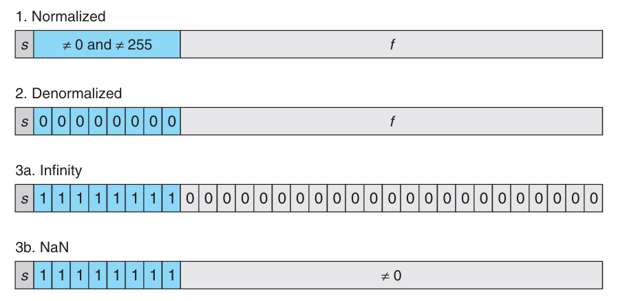

现代计算机中使用二进制来表示信息，即一个比特（`bit`），一个比特可以是 0 或者 1。二进制很容易被表示、存储和传输，比如打孔卡上有孔或无孔，导线上的高电平或低电平等。

单个的比特并没有意义，需要将比特组合成一个可以解释（`interpretation`）的模式。最重要的三种表示是：无符号（`unsigned`）编码，用于表示非负整数；补码（`two's complement`）用于表示整数（可以是负数）；浮点数（`floating point`）用于表示实数。计算机对这些表示都实现了一些算术运算，比如加法、乘法等。

使用有限的比特表示一个整数，可能会发生溢出（`overflow`），比如四个 32-bit 整数 300、400、500、600 的乘积是 -884,901,888。这与整数运算的性质相悖，多个正数的乘积是一个负数。整数运算也满足常见的代数性质，比如交换律、结合律。

浮点数的运算有不同性质。正数的乘积还是正数，但是可能是无穷大（`infinity`，$+\infty$）。由于表示精度的有限，可能不满足结合律，比如 `(3.14+1e20)-1e20` 的结果是 0.0，而 `3.14+(1e20-1e20)` 的结果是 3.14。

整数和浮点数运算的不同数学性质源于它们的表示方式。整数表示是精确的，但是范围有限，浮点数表示的范围大的多，但是只能近似表示。理解底层的表示，可以帮助我们理解这些运算的性质，写出正确的、可移植的代码。

## 信息的存储
大多数计算机并不是访问内存中的单个比特，而是将 8 比特构成的块，即一个字节（`byte`）作为最小的可寻址单元。机器代码将内存视为一个非常大的字节数组，称为虚拟内存（`virtual memory`）。计算机使用各种机制为程序的各个部分分配和管理存储空间，这种管理是在虚拟内存空间进行的。比如 C 语言中的指针指向的是某块存储空间的第一个字节的虚拟地址。C 编译期将数据类型（`type`）与指针关联起来，根据类型生成不同的机器代码来访问指针指向的位置。不过实际的机器代码对数据类型一无所知，程序中的各个对象只是一个字节块罢了，程序自身也是一系列字节。

### 十六进制表示
一个字节由 8 个比特组成，可以表示 $2^8=256$ 个不同的值。二进制表示的范围从 $00000000_{2}$ 到 $11111111_2$，十进制表示的范围从 $0_{10}$ 到 $255_{10}$。前者表示冗余，后者和比特模式的转化非常的复杂。因此引入了十六进制（`hexadecimal`）表示，一个十六进制数字可以表示 4 个比特，0 到 9 还是表示 0 到 9，A 到 F 表示 10 到 15。对于字母而言，不区分大小写。C 语言中，十六进制数以 `0x` 开头，比如 `0xFF` 表示 255。

三种进制的表示如下：

| 二进制 | 十六进制 | 十进制 |
| --- | --- | --- |
| 0000 | 0 | 0 |
| 0001 | 1 | 1 |
| 0010 | 2 | 2 |
| 0011 | 3 | 3 |
| 0100 | 4 | 4 |
| 0101 | 5 | 5 |
| 0110 | 6 | 6 |
| 0111 | 7 | 7 |
| 1000 | 8 | 8 |
| 1001 | 9 | 9 |
| 1010 | A | 10 |
| 1011 | B | 11 |
| 1100 | C | 12 |
| 1101 | D | 13 |
| 1110 | E | 14 |
| 1111 | F | 15 |

十六进制转为二进制很简单，每个十六进制数字对应 4 个比特。反之也非常简单，每四个比特一组，转为一个十六进制数字，如果不是 4 的整数倍，最左边（`leftmost`）补零。

如果 $x$ 是 2 的次幂，比如 $x=2^n$，二进制表示是一个 1 后面跟着 n 个 0，如果 $n=i+4j$，其中 $i$ 是 0 到 3 之间的整数，$j$ 是一个非负整数，那么十六进制表示就是一个十六进制数字（由 $i$ 决定，$i=0$ 是 1，$i=1$ 是 2，$i=2$ 是 4，$i=3$ 是 8）后面跟着 $j$ 个 0。比如 $x=2,048=2^{11}=0x800$，因为 $11=3+4*2$。

如果是一般的整数，十进制和十六进制互相转换相对麻烦一点。把十进制 $x$ 转化成十六进制，除以 16，得到商 $q$ 和余数 $r$，余数 $r$ 就是十六进制表示的最后一个数字，商 $q$ 再继续重复这个过程。比如下面的例子
```
314,156 = 19,634 * 16 + 12 // C
19,634 = 1,227 * 16 + 2 // 2
1,227 = 76 * 16 + 11 // B
76 = 4 * 16 + 12 // C
4 = 0 * 16 + 4 // 4
```
因此 `314,156=0x4BC2C`。

十进制转十六进制的过程就是把上述除以 16 的过程反过来。比如 `0x7AF` 的计算过程是 $7*16^2+10*16^1+15*16^0=1,967$。

### 数据大小
每个计算机有一个字长（`word size`），是指针类型的大小，通常是 32 位或者 64 位，现在绝大部分计算机的字长是 64 位。虚拟地址使用一个字表示，那么虚拟地址空间的大小由字长确定。一个机器的字长是 $w$ 位，那么地址从 0 到 $2^w-1$，虚拟地址空间的大小是 $2^w$ 字节。对于 32 位计算机，地址空间是 4GB；对于 64 位计算机，地址空间是 16EB（$2^{64}$ 字节）。

大部分 64 位计算机可以运行为 32 位计算机编译的程序，比如 `gcc -m32 program.c`，结果是 32 位程序，可以运行在 32 位和 64 位计算机上，`gcc -m64 program.c` 结果是 64 位程序，只能运行在 64 位计算机上。这里多少位程序指的是编译的程序，不是运行的机器的类型。

计算机和编译期都支持不同长度、不同编码的数，下面是一个典型的 C 语言数据类型及其大小：

| 数据类型 Signed | 数据类型 Unsigned | 大小（字节）32 位 | 大小（字节）64 位 |
| --- | --- | --- | --- |
| `[signed] char` | `unsigned char` | 1 | 1 |
| `short` | `unsigned short` | 2 | 2 |
| `int` | `unsigned int` | 4 | 4 |
| `long` | `unsigned long` | 4 | 8 |
| `int32_t` | `uint32_t` | 4 | 4 |
| `int64_t` | `uint64_t` | 8 | 8 |
| `char*` | | 4 | 8 |
| `float` | | 4 | 4 |
| `double` | | 8 | 8 |

这里所谓的典型大小依赖于编译器和计算机，ISO C99 引入了 新的类型，比如 `int32_t` 和 `int64_t`，保证了在所有平台上都是 4 字节和 8 字节。

编写可移植程序一个重要方面就是数据类型的大小。C 标准值规定了数据类型长度的下界，没有规定上界。在早期 32 位程序占主流的时候，默认大小和现在移植到 64 位计算机上默认大小不一样，可能会导致一些问题。比如早期使用 `int` 来存储指针，编译成 64 位程序后，`int` 还是 4 字节，而指针是 8 字节了，导致出现问题。

### 寻址和字节序
对于一个跨多个字节的对象，需要约定两件事：对象的地址是什么，在内存中的字节序是什么。对象的地址是指对象在内存中的第一个字节的地址。比如 `int x` 的地址是 `0x100`，那么这个 `int` 占用的字节是 `0x100`、`0x101`、`0x102` 和 `0x103`。字节序（`byte order`）是指对象的字节在内存中的排列顺序。大端（`big-endian`）表示最高有效字节（`most significant byte`）在最低地址，最低有效字节（`least significant byte`）在最高地址；小端（`little-endian`）表示最低有效字节在最低地址，最高有效字节在最高地址。比如 `int x=0x12345678`，大小端的内存表示如下：
```
                0x100   0x101   0x102   0x103
big-endian:     0x12    0x34    0x56    0x78
little-endian:  0x78    0x56    0x34    0x12
```
大部分的 Intel 机器都是小端，大部分 IBM/Oracle 机器都是大端。这里使用大部分，含义是不绝对，比如 IBM 也生产 Intel 兼容机器，也是小端。近来一些机器是双端（`bi-endian`），支持两种字节序，一旦选择了操作系统，字节序就固定了。比如 ARM 处理器就是双端机器，广泛应用于智能手机，不过之上的系统 Android 和 iOS 都是小端的。

大部分应用程序的程序员不需要关心字节序，因为编译器和操作系统会处理好这些细节。但是字节序确实引入了一些问题。

第一个问题是当两台机器通过网络传递数据。小端机器发送数据到大端机器，或者反之，程序就需要翻转字节序。为了解决这个问题，两个程序通过网络传递数据，需要约定好字节序。

第二个问题是如何解释整数。比如下面的例子是来自反汇编器（`disassembler`）的输出，这是一个指令，这里无需关注指令本身，而是需要关注字节序。
```
4004d3: 01 05 43 0b 20 00    add    %eax, 0x200b43(%rip)
```
下一个指令的地址是将 `0x200b43` 与当前 PC 值相加。指令中四个字节 `0x43`、`0x0b`、`0x20` 和 `0x00` 是一个 32 位的整数，表示的值就是字节翻转的结果，由于第一个字节是 0，去掉，所以结果是 `0x200b43`。

第三个问题是当写代码绕过类型系统的时候会出现的问题。C 语言中，类型转换（`cast`）或者 `union` 可以实现这一点，以不同的类型来访问同一块内存。对于应用程序员而言，不推荐这么做，但是对于系统编程而言，这就非常有用了。

下面是一段打印二进制的例子。
```c
void show_bytes(unsigned char *start, int len)
{
    int i;
    for (i = 0; i < len; i++)
    {
        printf("%.2x ", start[i]);
    }

    printf("\n");
}

int main()
{
    int x = 12345;
    show_bytes((unsigned char *)&x, sizeof(int));

    float f = 12345;
    show_bytes((unsigned char *)&f, sizeof(float));

    return 0;
}
```
输出如下：
```
39 30 00 00
00 e4 40 46
```
整数的 12,345 的十六进制表示是 `0x3039`，浮点数的 12,345 的十六进制表示是 `0x4640e400`，可以看到整数和浮点数的表示完全不同。不过展开成二进制之后，有 13 比特是相同的，这不是偶然的，稍后分析两者的表示方式会回到这个例子。
```
   0   0   0   0   3   0   3   9
00000000000000000011000000111001
                   *************
          01000110010000001110010000000000
             4   6   4   0   e   4   0   0
```

### 字符串表示
C 语言中字符串是一个以空字符（`null character`，`'\0'`）结尾的字符数组，每一个字符使用某种标准编码，最常见的是 ASCII 编码。下面的代码输出了字符串中的字节。
```c
char *s = "12345";
show_bytes((unsigned char *)s, 6);
```
输出如下：
```
31 32 33 34 35 00
```
字符 `'1'` 的 ASCII 编码是 `0x31`，后续字符是连续的。

### 代码表示
不同的机器使用不同的指令和编码，运行不同操作系统的机器，编码规范可能也不同。二进制代码在不同的机器和操作系统之间很少能够直接移植。

从机器的角度看看，一个程序也不过是一连串的字节罢了。除了调试信息之外，机器对于原本的源代码一无所知。后续我们会详细讨论机器代码的表示和执行。

### 布尔代数与比特级操作
布尔代数（`boolean algebra`）定义在两个元素的集合 $\{0,1\}$ 上，有如下几个基本操作。
```
~           &   0  1        |   0  1        ^   0   1
-------     ---------       --------        ---------
0   1       0   0  0        0   0   1       0   1   0
1   0       1   0  1        1   1   1       1   0   1
```
C 语言中 `~` 是取反，对应逻辑操作 `NOT`，符号是 $\neg$；`&` 是按位与，对应逻辑操作 `AND`，合取，符号是 $\wedge$；`|` 是按位或，对应逻辑操作 `OR`，析取，符号是 $\vee$；`^` 是按位异或，对应逻辑操作 `XOR`，符号是 $\oplus$。

布尔操作可以拓展到位向量（`bit vector`）上，位向量是一个比特的序列，上述四种操作作用于位向量的每一位。对于异或，有一个性质，对于任意的位向量 $x$，$x\oplus x=0$。另外，异或可以用析取、合取和取反来表示，$x\oplus y=(x\wedge\neg y)\vee(\neg x\wedge y)$。

利用异或这个性质，可以很容易地计算 `int` 中 1 的个数是偶数还是奇数，下面“折半归约”的思想在很多地方都有应用。
```c
int32_t odd_ones(uint32_t x)
{
    x = x ^ (x >> 16);
    x = x ^ (x >> 8);
    x = x ^ (x >> 4);
    x = x ^ (x >> 2);
    x = x ^ (x >> 1);

    return x & 1;
}
```

位向量一个场景是表示有限集，比如集合 $A\subseteq\{0,1,\cdots,w-1\}$ 的任意子集可以使用位向量 $[a_{w-1},\cdots,a_0]$，其中 $a_i=1$ 当且仅当 $i\in A$。位向量的布尔操作对应集合的运算，比如合取操作对应集合的交集。编程中，不同的信号（`signal`）和标志（`flag`）可以使用位向量来表示。

另一个常见的场景是实现掩码操作，掩码（`mask`）是一个位向量，表示一种位模式，用于标识字中选定的一组比特。比如掩码 `0xFF` 可以用来选定一个字中的最低 8 位。

### C 语言的逻辑操作和移位操作
与比特级别的操作不同，C 语言还提供了逻辑操作符 `&&`、`||` 和 `!`，分别对应逻辑操作 `AND`、`OR` 和 `NOT`。这些操作符的操作数是一个表达式，结果是一个整数，0 表示假（`false`），非零表示真（`true`）。这些操作符的计算方式与布尔代数中的逻辑操作不同，C 语言中的逻辑操作符具有短路（`short-circuit`）性质，比如在表达式 `x && y` 中，如果 $x$ 是假，那么 $y$ 就不会被计算了。这个性质很有用，比如 `p && *p++` 中，如果 `p` 是空指针，那么 `*p++` 就不会被计算了，避免了访问空指针的错误。

C 语言还提供了移位（`shift`）操作符 `<<` 和 `>>`，分别对应左移和右移。对于一个位向量 $x$，$x<<k$ 表示将 $x$ 中的每一位向左移动 $k$ 位，右边补零，比如 $[x_{w-1},\cdots,x_0]$ 左移 $k$ 位后是 $[x_{w-k-1},\cdots,x_0,0,\cdots,0]$。

右移有两种，有细微的差别。第一种是逻辑右移（`logical right shift`），表示将 $x$ 中的每一位向右移动 $k$ 位，左边补零，比如 $[x_{w-1},\cdots,x_0]$ 右移 $k$ 位后是 $[0,\cdots,0,x_{w-1},\cdots,x_k]$。第二种是算术右移（`arithmetic right shift`），表示将 $x$ 中的每一位向右移动 $k$ 位，左边补符号位（`sign bit`），如果最高有效位（`most significant bit`）是 0，那么左边补 0；如果最高有效位是 1，那么左边补 1，比如 $[x_{w-1},\cdots,x_0]$ 右移 $k$ 位后是 $[x_{w-1},\cdots,x_{w-1},x_{w-1},\cdots,x_k]$。对于无符号是，总是使用逻辑右移，但是对于有符号数，C 语言标准没有规定使用哪种右移（C23 标准做出了规定），不过常见的编译器对于有符号数使用算术右移，这与最新标准一致。

下面的代码可以帮助验证是否是算术右移。
```c
uint32_t int_shifts_are_arithmetic()
{
    return (int32_t(-1) >> 1) == int32_t(-1);
}
```

下面两个函数，分别使用逻辑右移实现算术右移、算术右移实现逻辑右移。第一个函数需要把前面 $k$ 比特都设置为 0，第二个函数需要把前面 $k$ 比特都设置为符号位。
```c
uint32_t shift_right_logically(uint32_t x, int32_t k)
{
    uint32_t w = sizeof(uint32_t) * 8;

    /* Perform shift arithmetically */
    uint32_t xsra = ((int32_t)x) >> k;
    uint32_t mask = ~((uint32_t(-1) << (w - k - 1)) << 1);

    return xsra & mask;
}

int32_t shift_right_arithmetically(int32_t x, int32_t k)
{
    uint32_t w = sizeof(int32_t) * 8;

    /* Perform shift logically */
    int32_t xsrl = ((uint32_t)x) >> k;

    /* signed bit is at k-th bit (counting from 0) */
    int32_t mask = xsrl & (1 << (w - 1 - k));

    /* if signed bit is 0, -mask = 0 */
    /* if signed bit is 1, -mask = 0xFFFFFFFF << (w - k) */
    return xsrl | (-mask);
}
```

下面再看一个比特操作的例子。要求是求最高位所在的位置，结果是掩码表示，比如 `0x0000F000` 的最高位是第 15 位，返回的掩码是 `0x00008000`。如果参数 `x = 0`，返回 `0`。前面十次操作将 `x` 中最高位 1 后面都设置成了 1，如果仅执行 `+1` 和 `>>1`，那么最高位 1 后面就都是 0 了。不过这对于 `0xFFFFFFFF` 就不适用了，`+1` 之后溢出变成了 `0`，所以需要单独处理最高位 1 的情况。倒数第二个 `return` 是一种标准的最最高的 `1` 的做法。倒数第一个 `return` 是另一种做法，不过前者不涉及加减法，硬件电路更简单。
```c
uint32_t leftmost_one(uint32_t x)
{
    x |= x >> 1;
    x |= x >> 2;
    x |= x >> 4;
    x |= x >> 8;
    x |= x >> 16;

    uint32_t mask = 0x80000000U;
    uint32_t first_one = x & mask;
    x = x + 1;
    x = x >> 1;
    return x | first_one;

    // return x & ~(x >> 1);
    // return x - (x >> 1);
}
```

最后看一个 `rotate` 的例子，要求是将一个整数的位向左旋转 $k$ 位。比如 `0x12345678` 向左旋转 4 位后是 `0x23456781`。这里使用了两次移位和一次按位或操作。这里右移分成了两个部分，主要是为了处理 `k=0` 的情况，如果直接使用 `x >> (w - k)`，那么就是 `x >> w`，这是未定义的行为。
```c
uint32_t rotate_left(uint32_t x, int k)
{
    uint32_t w = sizeof(uint32_t) * 8;
    return (x << k) | (x >> (w - k - 1) >> 1);
}
```

上面的几个例子，看似有一种奇技淫巧的感觉，其实工程中（特别是要求极致性能的场景中）相当有用，没有分支，没有循环，硬件电路实现简单，执行速度快。

## 整数的表示
C 语言提供了多种整数类型，下表是常见的整数类型及其范围（64 位系统）。注意，范围并不是对称的，对于有符号整数，负数的范围比正数大一个。

| C 数据类型 | 最小值 | 最大值 |
| --- | --- | --- |
| `signed char` | -128 | 127 |
| `unsigned char` | 0 | 255 |
| `short` | -32,768 | 32,767 |
| `unsigned short` | 0 | 65,535 |
| `int` | -2,147,483,648 | 2,147,483,647 |
| `unsigned int` | 0 | 4,294,967,295 |
| `long` | -9,223,372,036,854,775,808 | 9,223,372,036,854,775,807 |
| `unsigned long` | 0 | 18,446,744,073,709,551,615 |
| `int32_t` | -2,147,483,648 | 2,147,483,647 |
| `uint32_t` | 0 | 4,294,967,295 |
| `int64_t` | -9,223,372,036,854,775,808 | 9,223,372,036,854,775,807 |
| `uint64_t` | 0 | 18,446,744,073,709,551,615 |

### 无符号编码
假定有 $w$ 位宽，位向量 $\vec{x}=[x_{w-1},\cdots,x_0]$，$x_i$ 是第 $i$ 位的值，要么是 0 要么是 1。无符号（`unsigned`）编码中第 $i$ 位的值是 $2^i$，函数 $B2U_w$（`binary to unsigned`）将位向量 $\vec{x}$ 转化为无符号整数 $u$ 的计算方式如下：
$$B2U_w(\vec{x})=\sum_{i=0}^{w-1}x_i2^i$$
最小值是 $[0,0,\cdots,0]$，最大值是 $[1,1,\cdots,1]$，因此无符号整数的范围是 $0$ 到 $UMax=\sum_{i=0}^{w-1}2^i=2^w-1$。函数 $B2U_w$ 定义了一个映射，从位向量集合 $\{0,1\}^w$ 到无符号整数集合 $\{0,1,\cdots,UMax\}$，这个映射是双射（`bijection`），因此它的逆函数 $U2B_w$（`unsigned to binary`）也是存在的，将返回 0 到 $UMax$ 之间的整数转化为唯一一个 $w$ 位的位向量。

### 二进制补码
计算机中常用二进制补码（`two's complement`）来表示整数，可以是负数、零和整数。最高位表示负的权重。假定有 $w$ 位宽，那么解释二进制的函数 $B2T_w$（`binary to two's complement`）的计算方式如下：
$$B2T_w(\vec{x})=-x_{w-1}2^{w-1}+\sum_{i=0}^{w-2}x_i2^i$$
最高位 $x_{w-1}$ 也称为符号位（`sign bit`），它的权重是 $-2^{w-1}$，当它是 1 时值是负数，当它是 0 时值是非负数。

最小值是 $[1,0,\cdots,0]$，最大值是 $[0,1,\cdots,1]$，因此二进制补码整数的范围是 $TMin=-2^{w-1}$ 到 $TMax=2^{w-1}-1$。函数 $B2T_w$ 定义了一个映射，从位向量集合 $\{0,1\}^w$ 到二进制补码整数集合 $\{TMin,TMin+1,\cdots,TMax\}$，这个映射是双射，因此它的逆函数 $T2B_w$（`two's complement to binary`）也是存在的，将返回 $TMin$ 到 $TMax$ 之间的整数转化为唯一一个 $w$ 位的位向量。

下表是一些重要的数值在不同宽度下的表示。这里去掉了下标 $w$，因为上下文清楚。

| 数值 | 8 | 16 | 32 | 64 |
| --- | --- | --- | --- | --- |
| $UMax$ | 0xFF | 0xFFFF | 0xFFFFFFFF | 0xFFFFFFFFFFFFFFFF |
| | 255 | 65,535 | 4,294,967,295 | 18,446,744,073,709,551,615 |
| $TMin$ | 0x80 | 0x8000 | 0x80000000 | 0x8000000000000000 |
| | -128 | -32,768 | -2,147,483,648 | -9,223,372,036,854,775,808 |
| $TMax$ | 0x7F | 0x7FFF | 0x7FFFFFFF | 0x7FFFFFFFFFFFFFFF |
| | 127 | 32,767 | 2,147,483,647 | 9,223,372,036,854,775,807 |
| -1 | 0xFF | 0xFFFF | 0xFFFFFFFF | 0xFFFFFFFFFFFFFFFF |
| 0 | 0x00 | 0x0000 | 0x00000000 | 0x0000000000000000 |

从上述分析可以看出来，二进制补码的范围不是对称的，$|TMin|$ 比 $TMax$ 大 1，也就是说没有整数对应着 $TMin$。这一点是很多 bug 的根源。当符号位是 1 时，值是负数，这占了一半的范围，当符号位是 0 时，值是非负数，这占了另一半的范围，而零是非负数。因此正数比负数少了一个。无符号数的最大值是有符号最大值的两倍还多一，即 $UMax=2TMax+1$。有符号的 -1 的位向量和无符号的最大值的位向量是一样的，都是全 1 的位向量。0 在两种编码下都是相同的，位向量都是 0。

### 无符号数与有符号数的转化
在 C 语言中，`unsigned` 和 `signed` 是两种不同的类型，可以通过类型转换（`cast`）来实现它们之间的转化。但是转化的规则没有遵循任何的数学规则，而仅仅是比特不变，给一个新的解释而已。

比如如下代码
```c
short int v = -12345;
unsigned short uv = (unsigned short)v;
printf("v = %d, uv = %u\n", v, uv);
```
输出如下：
```
v = -12345, uv = 53191
```
这里 `v` 的值是 -12345，`uv` 的值是 53191。它们的比特表示是一样的，都是 `0xCFC7`，只是解释不同而已。

现在定义两个函数 $T2U_w$ 和 $U2T_w$，分别将二进制补码整数转化为无符号整数，以及将无符号整数转化为二进制补码整数，那么 $T2U_w=B2U_w(T2B_w(t))$，$U2T_w=B2T_w(U2B_w(u))$。根据前面的定义可以得到
$$T2U_w(x)=\begin{cases}
x+2^w & x<0 \\
x & x\geq 0
\end{cases}$$
从 0 到 $w-2$ 这些位，无符号和有符号是相同的，因此 $B2U_w-B2T_w=x_{w-1}(2^{w-1}-(-2^{w-1}))=x_{w-1}2^w$。因此 $B2U_w=B2T_w+x_{w-1}2^w$，这样得到上面的结果：
$$B2U_w(T2B_w(x))=T2U_w(x)=x+x_{w-1}2^w$$

现在考虑反向转化。
$$U2T_w(x)=\begin{cases}
x-2^w & x\geq 2^{w-1} \\
x & x<2^{w-1}
\end{cases}$$
与之前的推导类似，上述结果可以结果为
$$B2T_w(U2B_w(x))=U2T_w(x)=x-x_{w-1}2^w$$

### C 语言的无符号与有符号整数的转化
之前提到过，C 语言标准并没有定义如何表示整数和如何处理无符号数与有符号数之间的转化。不过大部分的机器、编译器的处理方式都是使用二进制补码来表示整数，并且在无符号数与有符号数之间的转化时，保持比特不变。

C 语言中还有隐式转换，这往往是导致 bug 的根源，让人不爽。比如两个操作数，有一个是无符号数，另一个是有符号数，那么有符号数会被隐式转化为无符号数，这时与标准运算有些许差别，导致非直观的结果。比如 `-1<0U` 的直观感觉应该是 `true`，但是实际结果是 `false`，因为 `-1` 被隐式转化为无符号数了，变成了 `0xFFFFFFFF`，因此 `0xFFFFFFFF<0U` 是 `false`。

再比如下面的例子，当我们传入 `length = 0` 时，我们期待返回 `0.0`，但是由于 length 是无符号数，`length - 1` 是 $UMax$，比较 `<=` 的时候，`i` 也会转成无符号数，任意无符号数都小于等于 $UMax$，因此会无限循环，并且访问数组越界。修复的方式是将 `length` 定义为有符号数，或者在循环条件中使用 `<` 而不是 `<=`。
```c
float sum_elements(float a[], unsigned length)
{
    int i;
    float result = 0;

    for (i = 0; i <= length - 1; i++)
        result += a[i];

    return result;
}
```

再来看一个例子，函数的愿意是比较两个字符串哪个长，但是由于 `strlen` 的返回值是无符号数，因此当 `s1` 的长度小于 `s2` 的长度时，`strlen(s1) - strlen(s2)` 是一个无符号数，结果是整数，因此函数返回为 `true`，这是不正确的。修复的方式是直接比较 `strlen(s1) > strlen(s2)`。
```c
bool is_longer(const char *s1, const char *s2)
{
    return strlen(s1) - strlen(s2) > 0;
}
```

为了避免这些问题，尽量不使用无符号数。现代很多语言，比如 Java，不再支持无符号数了。

当我们仅需要比特信息而不是数值信息时，使用无符号数就非常有用了，比如 `flags` 表示布尔集合。地址天然是无符号数，指针也是无符号数，因此在处理地址和指针时，使用无符号数是很直接的选择。当实现数学库，比如模运算、多精度算术运算等，使用无符号数组也是很自然的选择。

### 扩展与截断
当不同宽度（大小）的数据类型转换的规则简单一些。首先来看扩展（`extension`），将无符号数转成更大的数据类型，二进制前补零即可，称为零扩展（`zero extension`）。详细的定义是说有一个宽度为 $w$ 的位向量 $u=[u_{w-1},u_{w-2},\cdots,u_0]$，将其扩展为宽度为 $w'$ 的位向量 $u'=[0,0,\cdots,0,u_{w-1},u_{w-2},\cdots,u_0]$，其中 $w'>w$，那么有 $B2U_w(u)=B2U_{w'}(u')$。

将有符号数转成更大的数据类型，二进制前补符号位即可，称为符号扩展（`sign extension`）。详细的定义是说有一个宽度为 $w$ 的位向量 $x=[x_{w-1},x_{w-2},\cdots,x_0]$，将其扩展为宽度为 $w'$ 的位向量 $x'=[x_{w-1},x_{w-1},\cdots,x_{w-1},x_{w-2},\cdots,x_0]$，其中 $w'>w$，那么有 $B2T_w(x)=B2T_{w'}(x')$。

下面证明符号位扩展的正确性，如果我们能够证明添加一位 $x_{w-1}$ 后，数值不变，结合数学归纳法，就能证明其正确性。
$$\begin{aligned}
B2T_{w+1}([x_{w-1},x_{w-1},x_{w-2},\cdots,x_0])&=-x_{w-1}2^w+\sum_{i=0}^{w-1}x_i2^i\\
&=-x_{w-1}2^w+x_{w-1}2^{w-1}+\sum_{i=0}^{w-2}x_i2^i\\
&=-x_{w-1}(2^w-2^{w-1})+\sum_{i=0}^{w-2}x_i2^i\\
&=-x_{w-1}2^{w-1}+\sum_{i=0}^{w-2}x_i2^i\\
&=B2T_w[x_{w-1},x_{w-2},\cdots,x_0]
\end{aligned}$$

如果同时出现了大小的转换，也有无符号与有符号的转换，那么先改变大小，再改变符号。

反向来看截断（`truncation`），将一个宽度为 $w$ 的位向量 $x=[x_{w-1},x_{w-2},\cdots,x_0]$ 截断为宽度为 $k$ 的位向量 $x'=[x_{k-1},x_{k-2},\cdots,x_0]$，其中 $k<w$，相当于把高 $w-k$ 位直接丢掉。

对于无符号数，使用前面的记号，$x=B2U_w(x)$，$x'=B2U_k(x')$，那么 $x'=x\mod 2^k$。下面是证明过程，其中利用了 $2^i\mod 2^k=0,i\geq k$。
$$\begin{aligned}
B2U_w([x_{w-1},x_{w-2},\cdots,x_0])\mod 2^k&=\sum_{i=0}^{w-1}x_i2^i\mod 2^k\\
&=\sum_{i=0}^{k-1}x_i2^i+\sum_{i=k}^{w-1}x_i2^i\mod 2^k\\
&=\sum_{i=0}^{k-1}x_i2^i\\
&=B2U_k([x_{k-1},x_{k-2},\cdots,x_0])
\end{aligned}$$

对于有符号数，新的最高位会变成符号位。使用前面的定义，有 $x'=U2T_k(x\mod 2^k)$。下面给出证明。对于有符号数，丢弃了高 $w-k$ 位后有
$$x\mod 2^k=B2T_w([x_{w-1},x_{w-2},\cdots,x_0])\mod 2^k=B2U_k([x_{k-1},x_{k-2},\cdots,x_0])$$
我们拓展到 $w$ 位，得到
$$B2U_w([x_{w-1},x_{w-2},\cdots,x_0])\mod 2^k=B2U_k([x_{k-1},x_{k-2},\cdots,x_0])$$
对左边的数应用 $U2T_k$ 得到
$$U2T_k(B2U_w([x_{w-1},x_{w-2},\cdots,x_0])\mod 2^k)=U2T_k(B2U_k([x_{k-1},x_{k-2},\cdots,x_0]))=B2T_k([x_{k-1},x_{k-2},\cdots,x_0])$$
因此有 $x'=B2T_k([x_{k-1},x_{k-2},\cdots,x_0])=U2T_k(x\mod 2^k)$。

## 整数的运算
### 无符号加法
两个非负整数 $x,y$，范围是 $0\leq x,y<2^w$，和的范围值 $0\leq x+y\leq 2^{w+1}-2$，表示这个数需要 $w+1$ 位。如果想要表示两个 $w+1$ 位非负整数的和，那么需要 $w+2$ 位。随着字长的增加，如果想要完美表示算术结果，就不能给字长设定边界。大部分的编程语言只支持固定大小的算术运算，因此加法和乘法和数学中对应的算术运算不一样。

我们使用 $+_w^u$ 表示 $w$ 位无符号加法，结果仍旧保存在 $w$ 位中，超出 $w$ 位的部分会被丢弃，相当于加法的结果模了 $2^w$。比如 $w=4$，$x=9,y=12$，相加结果是 21，模 $2^4=16$ 结果是 5。

对于 $0\leq x,y<2^w$，有
$$x+_w^uy=\begin{cases}
x+y,&x+y<2^w\\
x+y-2^w,&x+y\geq 2^w
\end{cases}$$
对于无符号数来说，如果 $x+y<2^w$，$w+1$ 位的结果是 0，截断之后不会影响数值。但是如果 $2^w\leq x+y<2^{w+1}$，$w+1$ 位的结果是 1，截断之后相当于从和里面减去了 $2^w$，因此结果是 $x+y-2^w$。

当结果无法存放在数据类型的字长限制之内时，就称算术运算发生了溢出（`overflow`）。C 语言中，溢出不是错误，不过有时我们可能需要检测出是否溢出。

假定 $0\leq x,y\leq UMax_w$，$s=x+_w^uy$，$s$ 溢出等价于 $s<x$ 或者 $s<y$。因为如果 $x+y\geq x$，那么 $s$ 没有溢出，有 $s\geq x$。反之，如果 $s$ 溢出了，$s=x+y-2^w$，而 $y<2^w$，那么 $y-2^w<0$，因此 $s=x+(y-2^w)<x$。对于前面的例子，$9+_4^u12=5$，$5<9$，因此溢出。

模加法构成了阿贝尔群（`Abelian group`），因此满足封闭性、交换律和结合律，有单位元 0，每一个元素都有一个逆元。对于 $x$，存在逆元 $-_w^ux$，有 $x+_w^u(-_w^ux)=0$。

对于 $0\leq x\leq 2^w$，无符号 $-_w^ux$ 的计算方式如下：
$$-_w^ux=\begin{cases}
0,&x=0\\
2^w-x,&x>0
\end{cases}$$
对于 0 而言，显然 $0+0=0$。对于 $x>0$，$2^w-x$ 的范围是 $0<2^w-x<2^w$，因此 $-_w^ux$ 是一个 $w$ 位的无符号数。$(x+_w^u(2^w-x))\mod 2^w=(x+2^w-x)\mod 2^w=0$，因此 $-_w^ux$ 是 $x$ 的逆元。

### 补码加法
对于补码加法，我们需要确定结果太大或者太小了怎么表示。给定 $x,y$，范围是 $-2^{w-1}\leq x,y<2^{w-1}$，和的范围是 $-2^w\leq x+y\leq 2^w-2$，表示这个数需要 $w+1$ 位。和之前一样，并不会扩展比特数而是直接丢弃 $w+1$ 位，只使用剩余的 $w$ 位来表示结果。定义 $+_w^t$ 表示 $w$ 位补码加法，结果仍旧保存在 $w$ 位中。

对于整数 $-2^{w-1}\leq x,y<2^{w-1}$，有
$$x+_w^ty=\begin{cases}
x+y-2^w,&x+y\geq 2^{w-1}\\
x+y,&-2^{w-1}\leq x+y<2^{w-1}\\
x+y+2^w,&x+y<-2^{w-1}
\end{cases}$$

两个 $w$ 位补码表示的整数的和与无符号整数和的比特表示一摸一样，因此大部分计算机对于有符号和无符号的加法使用同样的机器指令。

由于指令一样，我们可以将补码加法转化为无符号加法。
$$x+^t_wy=U2T_w(T2U_w(x)+^u_wT2U_w(y))$$
之前讨论过，$T2U_w(x)=x+x_{w-1}2^w,T2U_w(y)=y+y_{w-1}2^w$，而无符号加法 $+^u_w$ 是模 $2^w$ 的，因此有
$$\begin{aligned}
x+^t_wy&=U2T_w(T2U_w(x)+^u_wT2U_w(y))\\
&=U2T_w((x+x_{w-1}2^w)+^u_w(y+y_{w-1}2^w))\\
&=U2T_w((x+x_{w-1}2^w)+(y+y_{w-1}2^w)\mod 2^w)\\
&=U2T_w((x+y+(x_{w-1}+y_{w-1})2^w)\mod 2^w)\\
&=U2T_w((x+y)\mod 2^w)\\
\end{aligned}$$
令 $z$ 是整数和 $z=x+y$，$z'=z\mod 2^w$，$z''=U2T_w(z')$，那么有 $z''=x+^t_wy$。下面分四种情况讨论。

- $-2^w\leq z<-2^{w-1}$，那么 $z'=z+2^w$，因此 $0\leq z'<2^{w-1}$，$z''=z'$，因此 $z''=z+2^w=x+y+2^w$，两个负数 $x,y$ 的和是一个非负数，这是负溢出（`negative overflow`）。
- $-2^{w-1}\leq z<0$，那么 $z'=z+2^w$，因此 $2^{w-1}\leq z'<2^w$，$z''=z'-2^w=z$，因此 $z''=x+y$。
- $0\leq z<2^{w-1}$，那么 $z'=z$，因此 $0\leq z'<2^{w-1}$，$z''=z'$，因此 $z''=x+y$。
- $2^{w-1}\leq z<2^w$，那么 $z'=z$，因此 $2^{w-1}\leq z'<2^w$，$z''=z'-2^w=x+y-2^w$，两个整数 $x,y$ 的和是一个负数，这是正溢出（`positive overflow`）。

令 $s=x+^t_wy$，那么正溢出等价于 $x>0,y>0,s\leq 0$，负溢出等价于 $x<0,y<0,s\geq 0$。首先分析正溢出，如果 $x>0,y>0$，但是 $s\leq 0$，很明显是正溢出了。反过来，如果正溢出，那么 $s=x+y-2^w\leq 0$，同时要求 $x>0,y>0$。负溢出同理。

对于 $-2^{w-1}\leq x<2^{w-1}$，加法 $+^t_w$ 的逆运算是 $-_w^tx$，逆元 $-_w^tx$ 的计算方式如下：
$$-_w^tx=\begin{cases}
-2^{w-1},&x=-2^{w-1}\\
-x,&\text{otherwise}
\end{cases}$$
$-2^{w-1}+(-2^{w-1})=-2^w$，负溢出，截断之后是 $0$，因此 $-2^{w-1}$ 的逆元是自身。对于其他整数 $x$，$-x$ 的范围是 $-2^{w-1}<x<2^{w-1}$，因此 $-_w^tx$ 是一个 $w$ 位的补码整数。$x+^t_w(-x)=0$，因此 $-_w^tx$ 是 $x$ 的逆元。

补码的负数，在比特层面有两种计算方式。第一种是取反加一，也就是 $-x=~x+1$，第二种是最右的 1 保持不变，其他位取反，也就是说 $[x_{w-1},x_{w-2},\cdots,x_{k+1},1,0,\cdots,0]$ 的负数是 $[-x_{w-1},-x_{w-2},\cdots,-x_{k+1},1,0,\cdots,0]$。

### 无符号乘法
整数 $x,y$ 的范围是 $0\leq x,y<2^w$，乘积的范围是 $0\leq x\cdot y<(2^w-1)=2^{2w}-2^{w+1}+1$，表示这个数需要 $2w$ 位。定义 $*_w^u$ 表示 $w$ 位无符号乘法，结果仍旧保存在 $w$ 位中，超出 $w$ 位的部分会被丢弃，相当于乘法的结果模了 $2^w$。即
$$x*_w^uy=(x \cdot y) \mod 2^w$$

### 补码乘法
整数 $x,y$ 的范围是 $-2^{w-1}\leq x,y<2^{w-1}$，乘积的范围是在 $-2^{w-1}\cdot (2^{w-1}-1)=-2^{2w-2}+2^{w-1}$ 到 $(-2^{w-1})^2=2^{2w-2}$。这需要 $2w$ 位来表示。C 语言中，乘法的结果仍旧保存在 $w$ 位中，超出 $w$ 位的部分会被丢弃，相当于乘法的结果模了 $2^w$。定义 $*_w^t$ 表示 $w$ 位补码乘法，结果仍旧保存在 $w$ 位中。
$$x*_w^ty=U2T_w((x \cdot y) \mod 2^w)$$

有符号乘法和无符号乘法的比特表示是一样的。

令 $\vec{x},\vec{y}$ 是 $w$ 位的位向量，那么 $x=B2T_w(\vec{x}),y=B2T_w(\vec{y})$，$x'=B2U_w(\vec{x}),y'=B2U_w(\vec{y})$，那么有
$$T2B_w(x*_w^ty)=U2B_w(x'*_w^uy')$$

下面是 3 比特情况的例子，可以看出来最后结果的比特表示是一样的，但是数值不同。

| Mode | $x$ | $y$ | $x\cdot y$ | Truncated $x\cdot y$ |
|------|---|---|---|---|
| Unsigned | 5 [101] | 3 [011] | 15 [001111] | 7 [111] |
| Two's complement | −3 [101] | 3 [011] | −9 [110111] | −1 [111] |
| Unsigned | 4 [100] | 7 [111] | 28 [011100] | 4 [100] |
| Two's complement | −4 [100] | −1 [111] | 4 [000100] | −4 [100] |
| Unsigned | 3 [011] | 3 [011] | 9 [001001] | 1 [001] |
| Two's complement | 3 [011] | 3 [011] | 9 [001001] | 1 [001] |

下面证明这个结论。首先将 $x',y'$ 展开 $x'=x+x_{w-1}2^w,y'=y+y_{w-1}2^w$，那么有
$$\begin{aligned}
(x'\cdot y')\mod 2^w&=((x+x_{w-1}2^w)\cdot (y+y_{w-1}2^w))\mod 2^w\\
&=(x\cdot y+x_{w-1}y2^w+x_{w-1}y_{w-1}2^{2w}+xy_{w-1}2^w)\mod 2^w\\
&=(x\cdot y+x_{w-1}y_{w-1}2^{2w})\mod 2^w\\
&=(x\cdot y)\mod 2^w
\end{aligned}$$
根据定义 $x*_w^ty=U2T_w((x \cdot y) \mod 2^w)$，两边同时应用 $T2U_w$，得到
$$T2U_w(x*_w^ty)=T2U_w(U2T_w((x \cdot y) \mod 2^w))=(x \cdot y) \mod 2^w$$
根据 $x*_w^uy=(x \cdot y) \mod 2^w$，结合上面的推导，得到
$$T2U_w(x*_w^ty)=(x'\cdot y') \mod 2^w=(x'*_w^u y')$$
两边应用 $U2T_w$，得到
$$U2B_w(T2U_w(x*_w^ty))=T2B_w(x*_w^ty)=U2B_w(x'*_w^u y')$$

### 常数乘法
通常来说，乘法需要的指令比加法、移位要多，因此编译器的一个重要优化就是把常数倍的乘法变成移位和加法操作的组合。

首先看一下乘以 2 的幂次的情况。假定无符号数 $x$ 的比特位分别是 $[x_{w-1},x_{w-2},\cdots,x_1,x_0]$，乘以 $2^k$，$0\leq k<w$，结果的比特位是 $[x_{w-1},x_{w-2},\cdots,x_1,x_0,0,0,\cdots,0]$，其中最右边有 $k$ 个 0。这是因为
$$B2U_{w+k}([x_{w-1},x_{w-2},\cdots,x_1,x_0,0,0,\cdots,0])=\sum_{i=0}^{w-1}x_i2^{i+k}=\bigg[\sum_{i=0}^{w-1}x_i2^i\bigg] \cdot 2^k=x \cdot 2^k$$
如果对固定长度的无符号数来说，左移 $k$ 位之后会将最高的 $k$ 位丢弃，结果是
$$[x_{w-k-1},x_{w-k-2},\cdots,x_1,x_0,0,0,\cdots,0]$$
这和固定长度的无符号乘法是一致的。

对于 C 语言而言，有无符号数 $x$ 和 $k$，其中 $0\leq k<w$，$x<<k$ 的结果是 $x*_w^u2^k$。

由于固定长度的补码算术与无符号算术的比特表示是一样的，因此补码乘以 2 的幂次，也可以表示为左右 $k$ 位。对于补码表示的 $x$，$x*_w^t2^k$ 可以用 $x<<k$ 来表示，其中 $0\leq k<w$。

不管是补码还是无符号数，左移都相当于乘以 2 的幂次，比如 $x*14$，可以写作 $(x<<3)+(x<<2)+(x<<1)$，也可以写作 $(x<<4)-x$。

通常来说，对于常数 $K$ 的比特形式是连续的若各干 0 和 1
$$[(0\ldots 0)(1\ldots 1)(0\ldots 0)\ldots(1\ldots 1)]$$
比如前面的 14 就可以写作 $[(0\ldots 0)(111)(0)]$。从比特 $n$ 到 $m$ 的连续 1 可以表示为 $2^{n+1}-2^m$，或者是 $2^n+2^{n-1}+\cdots+2^m$。因此可以将乘法转化为移位和加法的组合，即 $(x<<(n+1))-(x<<m)$ 或 $(x<<n)+(x<<{n-1})+\cdots+(x<<m)$。

编译器是否要这种优化，还是要取决于移位、加法、减法的组合与乘法指令的执行时间。大部分的编译器仅会对很少的移位、加法、减法的组合进行优化。

### 除以 2 的幂次
整数除法比乘法更慢，因此编译器也会将除以 2 的幂次转化为移位操作，这里使用右移。对于无符号数和补码表示的数，分别使用逻辑右移和算术右移达到相应的目的。

对于除法而言，有一个向下取整的概念。这里使用记号 $\lfloor a\rfloor$ 表示向下取整，$\lceil a\rceil$ 表示向上取整。

在 C 语言中，$x$ 是无符号数 $k$ 是整数，并且 $0\leq k<w$，那么 $x>>k$ 的结果是 $\lfloor{x/2^k}\rfloor$。假定 $x$ 的比特位是 $[x_{w-1},x_{w-2},\cdots,x_1,x_0]$，用 $x'$ 表示 $[x_{w-1},x_{w-2},\cdots,x_k]$，￥$x''$ 表示 $[x_{k-1},x_{k-2},\cdots,x_1,x_0]$，那么有 $x=2^kx'+x''$，其中 $0\leq x''<2^k$，因此 $x'=\lfloor{x/2^k}\rfloor$。对 $[x_{w-1},x_{w-2},\cdots,x_1,x_0]$ 右移 $k$ 位结果是 $[0,0,\cdots,0,x_{w-1},x_{w-2},\cdots,x_k]$，这就是 $x'$。

对于补码表示的数要稍微复杂一点，首先要使用算术移位保证负数仍旧是负数。取整分为向零取整和向下取整两种方式。对于正数，向零取整和向下取整是一样的，但是对于负数，向零取整是向上取整。

在 C 语言中，如果 $x$ 是补码，$x>>k$ 执行算术移位，结果是 $\lfloor x/2^k \rfloor$。和之前的分析类似，$x,x',x''$ 关系不变，不过 $[x_{w-1},x_{w-2},\cdots,x_1,x_0]$ 右移 $k$ 位结果是 $[x_{w-1},x_{w-1},\cdots,x_{w-1},x_{w-2},\cdots,x_k]$，不过这是值就是 $x'$。因此右移的结果是 $\lfloor x/2^k \rfloor$ 的补码表示。

对于向上取整，即向零取整，略微复杂一点，C 表达式是 $(x+(1<<k)-1)>>k$，如果执行的是算术移位，结果是 $\lceil x/2^k \rceil$。这里用到一个小技巧 $\lceil x/y\rceil=(x+y-1)/y$。假定 $x=qy+r,0\leq r<y$，那么有 $(x+y-1)/y=q+(r+y-1)/y$，如果 $r=0$，那么 $(r+y-1)/y=(y-1)/y=0$，如果 $r>0$，那么 $(r+y-1)/y=(r-1+y)/y=1+(r-1)/y=1$，因此 $x+$ 加上 $y-1$ 时候再除以 $y$ 向下取整，整除的时候得到 $q$，不能整数的时候得到 $q+1$。回到 $y=2^k$ 的情况， $x+(1<<k)-1$ 相当于 $x+2^k-1$，因此右移 $k$ 位得到了 $\lceil x/2^k \rceil$。

因此补码表示的情况下，除法可以使用表达式 `(x<0 ? x+(1<<k)-1 : x) >> k` 来实现 $x/2^k$ 的向零取整。这也是 C99 标准中规定的行为。下面是一个小技巧，不使用条件表达式，使用位运算实现除以 2 的幂次。

```c
int32_t divide_power2(int32_t x, int32_t k)
{
    // either 0 (x >= 0) or (1 << k) - 1 (x < 0)
    int bias = (x >> 31) & ((1 << k) - 1);
    return (x + bias) >> k;
}
```

正是因为除以 2 的幂次需要逻辑移位和算术移位，因此大部分的机器都提供这两种右移。不过上述分析不能泛化到任意常量，不像是乘法可以将乘以常量 $K$ 写成多个移位的组合，除法不能这么做。

下面是一个示例，计算 `x` 的 `3/4`，下面通过将数拆分成高位（`x>>2`）和低位（`x&3`）来实现。
```c
int32_t threefourths(int32_t x)
{
    int32_t tail = x & 3; // x % 4

    int32_t quotient = x >> 2; // divide by 4

    int32_t bias = (x >> 31) & 3;
    int32_t three_tail = (tail << 1) + tail;
    return ((quotient << 1) + quotient) + ((three_tail + bias) >> 2);
}
```

## 浮点数
浮点数将十进制小数编码为 $V=x\times 2^y$ 的形式，要能够表达非常大的数 $|V|\gg 0$，也要能表示趋于零的数 $|V|\ll 1$，同时能够尽可能的接近实数。在 1985 年，IEEE 754 标准被提出，定义了浮点数的表示和运算。

### 二进制小数
十进制小数的形式是
$$d_md_{m-1}\cdots d_1d_0.d_{-1}d_{-2}\cdots d_{-n}$$
数字 $d_i$ 是十进制数，$0\leq d_i\leq 9$，它的值是
$$d=\sum_{i=-n}^{m} d_i \cdot 10^i$$
类似的，二进制小数的形式是
$$b_mb_{m-1}\cdots b_1b_0.b_{-1}b_{-2}\cdots b_{-n}$$
数字 $b_i$ 是二进制数，只能是 0 或者 1，它的值是
$$b=\sum_{i=-n}^{m} b_i \cdot 2^i$$
如果小数点左移，效果是除以 2，如果小数点右移，效果是乘以 2。比如 $101.11_2=5.75_{10}$，$10.111_2=2.875_{10}$。

如果长度有限，那么十进制表示不能精确表示所有的实数，比如 $1/3,5/7$，二进制表示也不能精确表示所有的实数，比如 $1/10,1/3$，只能精确表示形如 $x\times 2^y$ 的数，其他数只能近似表示。下面是一个例子，使用越来越的位数来表示 $1/10$ 的过程，可以看出，位数越多越精确。

| Representation | Value | Decimal |
|----------------|-------|---------|
| $0.0_2$ | $0/2$ | $0.0_{10}$ |
| $0.01_2$ | $1/4$ | $0.25_{10}$ |
| $0.010_2$ | $2/8$ | $0.250_{10}$ |
| $0.0101_2$ | $5/16$ | $0.3125_{10}$ |
| $0.011_2$ | $3/8$ | $0.375_{10}$ |
| $0.0110_2$ | $6/16$ | $0.375_{10}$ |
| $0.0011_2$ | $3/16$ | $0.1875_{10}$ |
| $0.00110_2$ | $6/32$ | $0.1875_{10}$ |
| $0.001101_2$ | $13/64$ | $0.203125_{10}$ |
| $0.0011010_2$ | $26/128$ | $0.203125_{10}$ |
| $0.00110011_2$ | $51/256$ | $0.19921875_{10}$ |

### IEEE 浮点数
IEEE 浮点数标准将数表示为 $V=(-1)\cdot M\cdot 2^E$ 的形式。

- 符号（`sign`）$s$ 表示数的正负，$s=0$ 表示正数，$s=1$ 表示负数。数字零是一种特殊情况。
- 有效数字（`significand`）$M$ 是一个二进制小数，值的区间是 $[1,2)$ 或 $[0,1)$。
- 指数（`exponent`）$E$ 是一个整数，表示 2 的幂次，可以是负数。

浮点数表示法将比特位分成了三个字段

- `s` 占 1 位，表示符号。
- `E` 占 $k$ 位，表示指数，$\exp =e_{k-1}\cdots e_1e_0$。
- `M` 占 $n$ 位，表示有效数字，$\text{frac}=f_{n-1}\cdots f_1f_0$。

下面是单精度（`float`）和双精度（`double`）的浮点数的表示，分别使用 32 位和 64 位来表示浮点数，各个字段长度分别 $k=8,n=23$ 和 $k=11,n=52$。

```
Single precision (float):
 31  30          23  22            0
| s | exp (8 bits) | frac (23 bits) |

Double precision (double):
 63  62           52  51            0
| s | exp (11 bits) | frac (52 bits) |
```

根据 `exp` 的取值不同，可以将浮点数分为三类，分别是正规数（`normalized`）、非正规数（`denormalized`）和特殊数（`special`）。



第一种情况是正规数，`exp` 既不是全零（数值零）也不是全一（单精度 255，双精度 2047），此时指数使用移码（`biased`）表示法，$E=\exp-\text{bias}$，其中 $\text{bias}=2^{k-1}-1$，单精度是 127 双精度是 1023，`exp` 是 $e_{k-1}\cdots e_1e_0$ 表示的无符号数。因此指数的范围是 -126 到 127（单精度）或 -1022 到 1023（双精度）。`frac` 部分解释为小数部分，$f,0\leq f<1$，二进制表示是 $0.f_{n-1}f_{n-2}\cdots f_1f_0$，有效数字 $M$ 的值是 $1+f$，这被称为隐含头部 1（`implied leading 1`）表示法。这样可以多表示一个比特的精度。

第二种情况是非正规数，`exp` 全零，指数 $E=1-\text{bias}$，有效数字 $M$ 的值是 $0+f$，没有隐含头部 1。此时 $M$ 可以为零，因此可以表示数字零，即小数部分都是零 $M=f=0$。如果符号位是 0，那么表示正数零 $+0.0，如果符号位是 1，那么表示负数零 $-0.0$。这两个零是否相等依赖于上下文。非正规数的第二个作用是表示非常接近零的数，同时引入称为渐进下溢（`gradual underflow`）的概念，使得在零附近保持均匀分布。

第三种情况是指数部分全一。如果小数部分都是零，表示无穷，符号位是 1 是正无穷 $+\infty$，符号位是 0 是负无穷 $-\infty$。无穷表示溢出（`overflow`），比如两个大的数字相乘或者是除以零。如果小数部分不全为零，表示非数（`not a number`, `NaN`），运算结果不是一个实数或者不是无穷，比如计算 $\sqrt{-1},\infty-\infty$。有时，也用于表示没有初始化的数据。

下表罗列了一些单精度和双精度浮点数。

| Description | `exp` | `frac` | Single Value | Single Decimal | Double Value | Double Decimal |
|-------------|-------|--------|--------------|----------------|--------------|----------------|
| Zero | 00...00 | 00...00 | 0 | 0.0 | 0 | 0.0 |
| Smallest denormalized | 00...00 | 00...01 | $2^{-23}\cdot 2^{-126}$ | $1.4\times 10^{-45}$ | $2^{-52}\cdot 2^{-1022}$ | $4.9\times 10^{-324}$ |
| Largest denormalized | 00...00 | 11...11 | $(1-\epsilon)\cdot 2^{-126}$ | $1.2\times 10^{-38}$ | $(1-\epsilon)\cdot 2^{-1022}$ | $2.2\times 10^{-308}$ |
| Smallest normalized | 00...01 | 00...00 | $1\cdot 2^{-126}$ | $1.2\times 10^{-38}$ | $1\cdot 2^{-1022}$ | $2.2\times 10^{-308}$ |
| Largest normalized | 11...10 | 11...11 | $(2-\epsilon)\cdot 2^{127}$ | $3.4\times 10^{38}$ | $(2-\epsilon)\cdot 2^{1023}$ | $1.8\times 10^{308}$ |
| One | 01...11 | 00...00 | $1\cdot 2^0$ | 1.0 | $1\cdot 2^0$ | 1.0 |

$k$ 比特指数 $n$ 比特小数的浮点数有以下属性：

- 值 $+0.0$ 的比特位全都是零。
- 最小的正非正规数是最低位为 1 其余比特是 0。小数部分是 $M=f=2^{-n}$，指数是 $E=1-\text{bias}=2-2^{k-1}$，因此值是 $V=2^{-n-2^{k-1}+2}$。
- 最大的正非正规数是小数部分全是 1 其余全是 0。小数部分是 $M=f=1-2^{-n}$，指数是 $E=1-\text{bias}=2-2^{k-1}$，因此值是 $V=(1-2^{-n})\times 2^{2-2^{k-1}}$。
- 最小的正正规数是小数部分全是 0，指数最低位是 1 其余全是 0。有效数字 $M=1+f=1$，指数是 $E=1-\text{bias}=2-2^{k-1}$，因此值是 $V=2^{-2^{k-1}+2}$。
- 最大的正正规数是小数部分全是 1，指数最低位是 0 其余全是 1。有效数字 $M=1+f=2-2^{-n}$，指数是 $E=2^{k-1}-1$，因此值是 $V=(2-2^{-n})\times 2^{2^{k-1}-1}=(1-2^{-n-1})\times 2^{2^{k-1}}$。
- 1.0 的比特模式是指数最高位以外的其他比特全是 1，小数部分全是 0。有效数字 $M=1+f=1$，指数是 $E=0$，因此值是 $V=1.0$。

之前分析过 12,345 的整数表示和浮点数表示有 13 位相同，下面通过构造浮点数的过程就能解释这绝不是偶然。$12,345=1.1000000111001_2\times 2^{13}$，为了写成 IEEE 单精度格式，首先构造小数部分，扔掉开头的 1（小数点前面），然后后面补零使之有 23 比特，得到小数部分的二进制表示 $[10000001110010000000000]$。然后构造指数部分，$E=13$，因此 $\exp=E+\text{bias}=13+127=140=10001100_2$。最后构造符号位，$s=0$，因此 $12,345$ 的 IEEE 单精度浮点数表示是 $[01000110010000001110010000000000]$，和整数表示的低 13 位是一样的。
```
   0   0   0   0   3   0   3   9
00000000000000000011000000111001
                   *************
          01000110010000001110010000000000
             4   6   4   0   e   4   0   0
```

想要进一步理解浮点数的表示，一个方法是进行浮点数的比特级别的操作来做一些事情。首先看两个简单的例子，第一个是通过比特操作让浮点数加倍，第二个是通过比特操作让浮点数减半。我们先分析第一个函数。`exp` 分钟情况，第一种是 `NaN` 或者 $\infty$，这种情况直接返回原来的数。第二种是非正规数，指数全是 0，这种情况将小数部分左移一位，相当于乘以 2，这里有一种情况是小数部分的最高位是 1，左移之后会变成正规数，`exp` 会变成 `1`，但是这里左移溢出之后刚好到了 `exp` 的范围内，因此不需要做任何处理，最后或的时候相当于给 `exp` 加上了 1。第三种情况是正规数，指数不是全零也不是全一，这种情况将指数加 1，如果加 1 之后变成全一，那么说明乘以 2 之后溢出了，返回 $\infty$，即清除小数部分。
```c
float_bits float_twice(float_bits f)
{
    uint32_t sign = f >> 31;
    uint32_t exp = f >> 23 & 0xFF;
    uint32_t frac = f & 0x7FFFFF;

    if (exp == 0)
    {
        /* Denormalized */
        frac <<= 1;
    }
    else if (exp != 0xFF)
    {
        /* Normalized */
        exp++;
        if (exp == 0xFF)
        {
            frac = 0;
        }
    }

    return (sign << 31) | (exp << 23) | frac;
}
```
除以 2，即乘以 0.5 下面给出了两个版本。第一个版本是直接按照浮点数的定义来实现的，如果 `exp` 是零，小数部分右移，同时要考虑舍入问题（参考下一个小节）。如果 `exp` 不等于零和全一，就是正常的小数，`exp` 减一，如果 `exp` 减到了零，变成了非正规数，这个时候没有隐藏的 1，因此小数部分右移一位，然后 `frac |= 0x400000` 把隐藏的 1 显示的加上。第二个版本是对第一个版本的优化，减少了分支的数量，这里 `frac |= 0x800000`，然后保证后续右移的时候和前面的逻辑一致。
```c
float_bits float_half_v1(float_bits f)
{
    uint32_t sign = f >> 31;
    uint32_t exp = f >> 23 & 0xFF;
    uint32_t frac = f & 0x7FFFFF;
    uint32_t even = frac & 1;

    if (exp == 0)
    {
        frac >>= 1;
        if (even && (frac & 1))
        {
            frac += 1;
        }
    }
    else if (exp == 0xFF)
    {
        /* Infinity or NaN */
        /* Do nothing */
    }
    else
    {
        exp--;
        if (exp == 00)
        {
            frac >>= 1;
            frac |= 0x400000;
            if (even && (frac & 1))
            {
                frac += 1;
            }
        }
    }

    return (sign << 31) | (exp << 23) | frac;
}

float_bits float_half(float_bits f)
{
    uint32_t sign = f >> 31;
    uint32_t exp = f >> 23 & 0xFF;
    uint32_t frac = f & 0x7FFFFF;
    uint32_t even = frac & 1;

    if (exp != 0xFF && exp != 0)
    {
        exp--;
        if (exp == 00)
        {
            frac |= 0x800000;
        }
    }

    if (exp == 0)
    {
        frac >>= 1;
        if (even && (frac & 1))
        {
            frac += 1;
        }
    }

    return (sign << 31) | (exp << 23) | frac;
}
```

### 舍入
由于浮点数的表示有范围和精度的限制，因此浮点数算术只能近似表示实数算术。对于给定实数 $x$，我们需要一种系统化的方法寻找一个在浮点格式表示下最接近 $x$ 的近似值 $x'$。一个关键问题是对于恰好处于中间的数如何进行舍入处理。IEEE 754 标准定义了四种舍入模式（`rounding mode`），默认方法是找最近匹配的值，其他三个是计算上界（`upper bound`）、计算下界（`lower bound`），即 $x^-\leq x\leq x^+$。

默认模式是向偶数舍入（`round-to-even`），比如 1.5 和 2.5 近似到整数，结果都是 2。向零舍入（`round-toward-zero`）模式对于正数而言是向下舍入，对于负数而言是向上舍入，即给出的结果 $\hat{x}$ 满足 $|\hat{x}|\leq |x|$。向下舍入（`round-down`）模式给出的结果 $x^-$ 满足 $x^-\leq x$，向上舍入（`round-up`）模式给出的结果 $x^+$ 满足 $x\leq x^+$。

下表是四种模式的例子。

| Mode | 1.40 | 1.60 | 1.50 | 2.50 | -1.50 |
|------|------|------|------|------|-------|
| Round-to-even | 1 | 2 | 2 | 2 | -2 |
| Round-toward-zero | 1 | 1 | 1 | 2 | -1 |
| Round-down | 1 | 1 | 1 | 2 | -2 |
| Round-up | 2 | 2 | 2 | 3 | -1 |

向偶数舍入看起来比较奇怪，其实很精妙。对于统计一些数字，如果对于处于中间点的数总是向上或者向下舍入，那么统计的平均值会比真实值略大或者略小。向偶数舍入的好处是对于处于中间点的数，有一半的情况向上舍入，一半的情况向下舍入，这样统计的平均值会更接近真实值。

向偶数舍入这种思想并不仅限于舍入到最近的整数。它本质上就是最低位始终保持是偶数。比如我们要保留小数点后两位有效数字，1.2349999 舍入到 1.23，1.2350001 舍入到 1.24，1.2350000 舍入到 1.24，因为 4 是偶数。类似的，这种方法也可以拓展到二进制小数，0 是偶数 1 是奇数，最后结果就是最后一个有效数字是 0。

### 浮点数运算
IEEE 754 标准定义了浮点数的运算，包括加法、乘法等。假定两个实数 $x,y$，运算符是 $\odot$，那么结果是 $round(x\odot y)$。实际工程中，浮点运算单元（`floating-point unit`, `FPU`）的设计师会采用一些精妙的位级的技巧，避免直接进行成本高昂的精确计算，而只要保证计算过程的精度足以推导出舍入后的最终结果就可以了。此外，当操作数中包含一些特殊值时，比如 $-0,\infty$、`NaN`，标准也给出了尽可能符合常理的规范，比如 $1/-0$ 结果是 $-\infty$，$1/+0$ 结果是 $+\infty$。

IEEE 的标准是独立的，和硬件、软件如何实现无关。因此，我们可以不用管具体实现而分析其数学性质。

数学中实数的加法也是阿贝尔群，不过计算机中我们需要考虑舍入的问题。定义 $x+^fy=round(x+y)$。这个操作的定义域是所有的 $x,y$，尽管有可能溢出。这个操作满足交换律，即 $x+^fy=y+^fx$，但是不满足结合律，比如 $(3.14+1e10)-1e10=3.14$，但是 $3.14+(1e10-1e10)=0$。大部分的浮点数都有加法的逆元，即 $x+^f(-x)=0$，例外是 $\infty,-\infty$、`NaN`。因为 $+\infty-\finty=NaN$，$NaN+^fx=NaN$。

浮点数不满足结合律，缺少了重要的群属性。这对科学领域的程序员和编译器开发者有很大的影响。比如下面例子。
```c
x = a + b + c;
y = b + c + d;
```
编译器可能为了节省一次加法生成了如下代码
```c
t = b + c;
x = a + t;
y = t + d;
```
由于没有结合律，`x` 的结果可能与原始的结果不同。在大部分的应用中，这种微小的差异可以忽略不计。不过编译器不知道用户为了追求运行效率能够多大程度上牺牲程序原本的精度。因此，编译器会非常保守，会避免这样有一丢丢不同影响的优化。

只要 $a,b,x$ 不是 `NaN`，浮点数加法满足单调性，也就是说如果 $a\geq b$，那么 $a+^f x\geq b+^f x$。整数（无符号数、补码）由于溢出机制的存在，单调性不成立，违反数学直觉。

浮点数的乘法也遵循许多属性。定义 $x*^f y=round(x*y)$。操作是封闭的，尽管可能出现无穷或 `NaN`，乘法满足交换律，1.0 是单位元。但是乘法不满足结合律，比如单精度情况下，$(1e20*1e20)*1e-20$ 的结果是 $+\infty$，但是 $1e20*(1e20*1e-20)$ 的结果是 $1e20$。浮点数乘法也没有对加法的分配律，比如 $1e20*(1e20-1e20)=0.0$，但是 $1e20*1e20-1e20*1e20$ 结果是 `NaN`。

只要 $a,b,c$ 不是 `NaN`，浮点数乘法满足单调性。
$$a\geq b, c\geq 0 \Rightarrow a*^f c \geq b*^f c$$
$$a\geq b, c\leq 0 \Rightarrow a*^f c \leq b*^f c$$

和整数不同，只要 $a$ 不是 `NaN`，那么有 $a*^f a\geq 0$，也就是说浮点数的平方是非负的。

缺少结合律和分配律对科学领域的程序员和编译器开发者影响很大。哪怕实现如何判断三维空间两条直线是否相交这样看似容易的功能，实际开发中也可能会变成具有挑战性的难题。

我们现在知道了 `int` `float` `double` 的表示和运算的基本原理，那么可以给出它们之间相互转换的规则。

- `int` 转 `float`，不会溢出，但是可能会丢失精度。
- `int` `float` 转 `double`，不会溢出，也不会丢失精度，因为 `double` 的范围和精度都更高。
- `double` 转 `float`，可能会溢出，因为后者范围更小，也可能会丢失精度，因为后者精度更低。
- `float` `double` 转 `int`，向零舍入，还可能会溢出。C 语言标准并没有规定溢出情况的返回值。Intel x86 处理器的行为是返回 $[10\cdots 00]$，也就是最小的负数，结果略微不直观，一个很大的数转成整数，结果是最小的负数。

下面是两个例子，通过比特位操作进行 `float` 和 `int` 的转换。第一个是 `float` 转 `int`，两个版本。第一个版本是按照浮点数的定义来实现的，首先是 `exp` 是全一，说明是 `NaN` 或者 $\infty$，返回最小的负数。第二种情况是 `exp` 是全零，说明是非正规数，是很小的浮点数，因此向零舍入之后是 0。第三种情况是 `exp` 不是全零也不是全一，说明是正规数，计算指数 $E$，如果 $E<0$，说明浮点数小于 1，向零舍入之后是 0。如果 $E\geq 31$，说明浮点数大于等于 $2^{31}$，溢出，返回最小的负数。小数部分有 23 位，隐含头部 1，使用或运算加上这个隐藏的 1，计算出整数部分。如果将小数部分直接看作整数，相当于乘以 $2^{23}$，然后根据指数 $E$ 进行移位，得到正确的整数部分。最后根据符号位返回正数或者负数。这里有一个巧合，`int` 的范围是 $[-2^{31},2^{31}-1)$，也就是说 $-2^{31}$ 可以表示，但是此时返回了 `error_value`，也就是最小的负数，不过这个错误值恰好是 $-2^{31}$，因此这个实现是正确的。第二个版本是对第一个版本的优化，减少了分支的数量。
```c
/*
* Compute (int)f.
* If conversion causes overflow or f is NaN, return 0x80000000.
*/
int32_t float_f2i_v1(float_bits f)
{
    uint32_t sign = f >> 31;
    uint32_t exp = f >> 23 & 0xFF;
    uint32_t frac = f & 0x7FFFFF;

    int error_value = 0x80000000;

    if (exp == 0xFF)
    {
        return error_value;
    }
    else if (exp == 0)
    {
        return 0;
    }
    else
    {
        /* E < 0 => f < 1 */
        if (exp < 127)
        {
            return 0;
        }

        /* E >= 31 => f >= 2^31 */
        if (exp >= 158)
        {
            return error_value;
        }

        int32_t E = exp - 127; /* [0,30] */
        frac |= 0x800000;
        if (E <= 23)
        {
            frac >>= (23 - E);
            return sign ? -(int32_t)frac : frac;
        }
        else
        {
            frac <<= (E - 23);
            return sign ? -(int32_t)frac : frac;
        }
    }
}

int32_t float_f2i(float_bits f)
{
    uint32_t sign = f >> 31;
    uint32_t exp = f >> 23 & 0xFF;
    uint32_t frac = f & 0x7FFFFF;

    int32_t error_value = 0x80000000;

    if (exp >= 158)
    {
        return error_value;
    }
    else if (exp < 127)
    {
        return 0;
    }
    else
    {
        int32_t E = exp - 127; /* [0,30] */
        frac |= 0x800000;
        if (E <= 23)
        {
            frac >>= (23 - E);
        }
        else
        {
            frac <<= (E - 23);
        }

        return sign ? -(int32_t)frac : frac;
    }
}
```
第二个例子是 `int` 转 `float`，要点在于如何构造 `sign` `exp` `frac` 三个部分。符号位比较容易处理。这里针对最小的整数 $-2^{31}$ 做了特殊处理，直接返回浮点数的表示。其他整数，首先取绝对值，因为 IEEE 标准规定的小数部分是绝对值，不负责符号。然后找到最高位的 1 的位置，如果没有找到，说明这个数就是 0，直接给 `frac` `exp` 赋值为零。如果找到了，这个位置就是指数 $E$，然后计算出 `exp`，小数部分是去掉最高位的 1 后的比特位，这是因为浮点数有一个隐含的 1。如果小数部分超过了 23 位，那么需要进行舍入处理。这里使用了向偶数舍入的方法，如果尾部大于半数或者尾部等于半数且小数部分是奇数，那么小数部分加 1，如果加 1 之后溢出，那么指数加 1，小数部分清零（这里与上 `0x7FFFFFF` 也可以）。如果小数部分小于等于 23 位，精度足够无需处理舍入的情况，那么直接左移补零即可。
```c
float_bits float_i2f(int32_t i)
{
    uint32_t sign = i < 0;
    uint32_t exp = 0;
    uint32_t frac = 0;

    if (i == 0x80000000)
    {
        frac = 0;
        exp = 127 + 31;
    }
    else
    {
        uint32_t ui = i;
        /* abs */
        if (i < 0)
        {
            ui = ~i + 1;
        }

        ui &= 0x7FFFFFFF;
        /* find the index first 1 */
        int32_t index = std::bit_width(ui) - 1; // C++20

        /* clear the highest set bit since M = 1 + f */
        ui ^= (1 << index);

        /* not found */
        if (index < 0)
        {
            exp = 0;
            frac = 0;
        }
        else
        {
            exp = 127 + index;
            if (index > 23)
            {
                int32_t shift = index - 23;
                int32_t tail = (ui & ((1 << shift) - 1));

                frac = ui >> shift;
                int32_t half = (1 << (shift - 1));
                if (tail > half || tail == half && (frac & 1) == 1)
                {
                    frac++;
                    if (frac > 0x7FFFFF)
                    {
                        exp++;
                        frac = 0;
                    }
                }
            }
            else
            {
                frac = (ui << (23 - index));
            }
        }
    }

    return (sign << 31) | (exp << 23) | frac;
}
```
