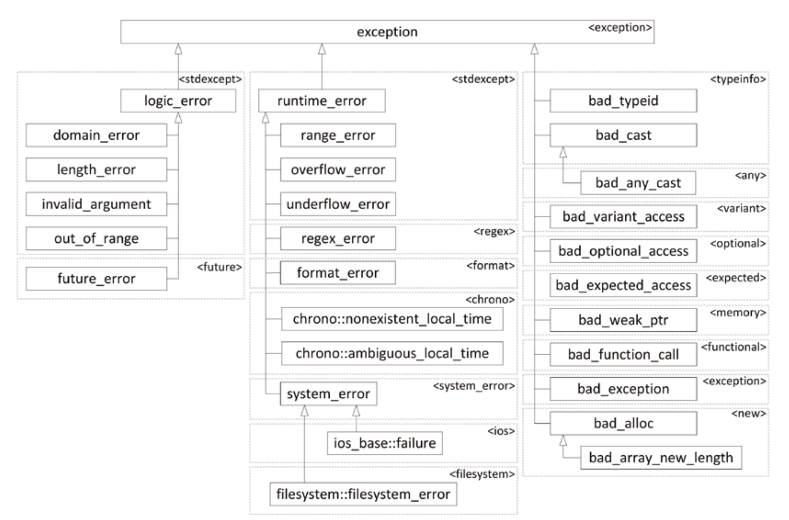

## 错误和异常
程序总会遇到非预期的行为，即异常。C 语言没有提供相关机制，可以使用返回值或其他方式处理，Java 提供了异常机制并强行使用。C++ 介于两者之间。

C++ 继承了 C 通过返回值处理错误的方式。不过这种方式不统一，有的函数返回 0 表示成功，其他整数表示错误并不设置 `error`，有的函数返回 0 表示成功，-1 是失败并设置 `error`，甚至有的函数 0 表示失败因为 0 对应 `false`。另外，只能有一个返回值，有了表示成功与否的整数，真实要返回的数据就需要通过参数返回，或者返回类型是 `std::pair` `std::optional` `std::tuple` 或者自定义类型，不方便。另外，C 可以使用 `setjmp()` `longjmp()`，但是由于这会绕过栈上对象的析构，C++ 实践不推荐这么用。

异常的好处很多，首先必须处理，如果没处理程序就终止了，其次可以包含充分的信息，调用栈的某些层次还可以忽略它，不过不要滥用异常，仅仅用于处理错误。

编译器对异常处理的性能有相当的提升。对于非异常情况，速度比使用错误码的方式还快。

## 异常机制
语法如下所示
```cpp
try
{
	// ... code which may result in an exception being thrown
}
catch (exception-type1 exception-name)
{
	// ... code which responds to the exception of type 1
}
catch (exception-type2 exception-name)
{
	// ... code which responds to the exception of type 2
}

// ... remaining code
```
`try` 可以指直接用 `throw` 抛出异常，也可以是调用其他函数时被调用函数抛出的异常。如果没有异常，`catch` 里面不会执行，会继续执行 `try` 后续的代码。如果有异常，`throw` 之后的代码不会执行，进行对应的 `catch` 块执行。如果 `catch` 块没有转移执行的控制，比如返回或再次抛出异常，那么也会继续执行 `try` 后面的代码。

`throw` 是唯一抛出异常的方式，C++ 标准库定义了相当多异常类型。基类 `std::exception` 支持函数 `what()` 返回 `const char *` 输出错误信息。

一般来说，文档应该给出当前函数会抛出哪些异常。

抛出异常可以是任意类型，比如 `throw 5` `catch (int e)` 和 `throw "error"` `catch (const char *e)`，但是推荐抛出 C++ 标准库定义好的异常类型，或者继承自标准库的自定义异常类型，因为类名可以提供一些信息，同时还可以携带更多的信息，比如类型为字符串的错误信息。当 `catch` 的时候推荐使用 `const` 引用类型。

`catch (...)` 捕获所有异常，但是没有任何细节信息，除了打日志、重新抛出异常之外，做不了太多的事情。因此推荐 `throw` 异常类型，然后捕获 `const std::exception &` 就是相当于所有异常了。

虚函数也可以使用 `noexcept`，可以更严格，比如基类没有标记，但是派生类标记了 `noexcept`，但是反之不行。`noexcept(expression)` 写法是根据表达式确定有误异常。

## 异常和多态
下图是 C++ 标准库中异常类型的继承关系。



可以利用多态特性进行捕获，因此前面的建议——捕获 `const` 引用类型——就更重要了，否则会出现截断、丢失信息的问题。多个 `catch` 语句是顺序执行的，那么如果捕获更一般的异常（基类）在前更特殊的异常类型（派生类）在后，那么后面的 `catch` 永远不会执行。

可以自定义异常类型，推荐继承自标准库的异常类。自定义异常的好处是可以使用更有意义的名字，携带更多的信息，而不仅仅是一个错误字符串。

自定义异常需要 `override` `what()` 函数，返回 `const char *`，需要在异常对象析构之前，这个字符串指针都是有效的，比如下面的实现保存在 `std::string` 内。
```cpp
#include <exception>
#include <format>
#include <string>

class FileError : public std::exception
{
public:
	explicit FileError(std::string filename)
		: filename_ { move(filename) }
	{
	}

	const char *
	what() const noexcept override
	{
		return message_.c_str();
	}

	virtual const std::string &
	GetFilename() const noexcept
	{
		return filename_;
	}

protected:
	virtual void
	SetMessage(std::string message)
	{
		message_ = std::move(message);
	}

private:
	std::string filename_;
	std::string message_;
};

class FileOpenError : public FileError
{
public:
	explicit FileOpenError(std::string filename)
		: FileError { std::move(filename) }
	{
		SetMessage(std::format("Unable to open {}.", GetFilename()));
	}
};
```

异常的捕获会移动或者拷贝异常对象，因此如果自定义的异常类有动态分配内存等操作导致实现了析构函数，那么根据建议，实现拷贝、移动的构造和赋值，保证自定义异常如期工作。再一次，如果按值捕获，会导致多一次拷贝，捕获 `const` 引用可以节省一次拷贝。

当处理异常的时候，需要抛出第二个异常，为了保留第一个异常的信息，使用 `std::throw_with_nested()`，类型是 `std::nested_exception`，一个异常位于另一个异常中，这称为嵌套异常。`std::nested_exception` 基类的自动捕获 `std::current_exception()` 返回当前的异常，这个异常存储在 ` std::exception_ptr`。可以通过 `const auto* nested { dynamic_cast<const nested_exception*>(&e) };` 来将普通异常转换成嵌套异常。

## rethrow
`throw;` 有再次抛出异常的语义，而不是使用 `throw e`，因为后者在捕获的实际异常的基类类型时，会截断数据。

## 栈展开和清理
当发生异常时，需要寻找在栈上的异常捕获，如果找到了，调用栈回到异常捕获这一层，然后进行栈展开（`stack unwinding`），会一次析构栈上的对象并且会跳过每个函数后续的代码。不过稍有不慎，会导致内存或其他资源泄露。比如下面的例子
```cpp
void FuncOne();
void FuncTwo();

int
main()
{
	try
	{
		FuncOne();
	}
	catch (const exception &e)
	{
		std::println(cerr, "Exception caught!");
		return 1;
	}
}

void
FuncOne()
{
	std::string str1;
	std::string *str2 { new std::string {} };
	FuncTwo();
	delete str2;
}

void
FuncTwo()
{
	std::ifstream fileStream;
	fileStream.open("filename");
	throw std::exception {};
	fileStream.close();
}
```
当函数 `FuncTwo()` 抛出异常，`fileStream.close();` 不会被执行，但是 `fileStream` 的析构会调用函数，也会关闭，因此这里不会有资源泄露。但是 `FuncOne()` 中的 `delete str2;` 也会被掉过执行，导致内存泄漏。

使用智能指针或者 `std::string` 类型自身，由 RAII 保证内存释放。另一种方式是捕获、清理、再抛出（`Catch, Cleanup, and Rethrow`），不推荐，混乱且易出错，除非无法使用前面的解决方案。
```cpp
void
funcOne()
{
	std::string str1;
	std::string *str2 { new std::string {} };
	try
	{
		FuncTwo();
	}
	catch (...)
	{
		delete str2;
		throw; // Rethrow the exception.
	}

	delete str2;
}
```

## 代码位置
`__FILE__` `__LINE__` 这两个宏用于获取文件名和行号。C++ 20 提供了 `std::source_location`，`static` 函数 `current()` 返回被调用处的相关信息，`file_name()` `function_name()` `line()` `column()` 返回相应的信息。这个类主要用于日志和自定义异常自动获取源代码信息。

## 调用栈
调用栈是相当有用的信息，C++ 23 提供了类 `std::stacktrace`，`current()` 函数返回调用处的栈信息。`size()` 返回帧数量，`description()` 返回描述的帧。`source_file()` `source_line()` 返回相应的信息。和 `std::source_location` 一样，这个类对于 debug 很有帮助，比如嵌入自定义的异常中。

## 常见问题
分配内存可能会遇到资源不足的情况，然后抛出 `std::bad_alloc` 异常，如果不想有异常可以使用 `new(nothrow)`，内存不足时会返回 `nullptr`。

构造函数里面抛出异常的话，不会调用析构函数。一个可能的解法是在构造函数里面 `try/catch` 保证资源不泄露。

一个冷门的 feature：`Function-Try-Block`。语法如下，可以保护构造函数的初始化列表抛异常。
```cpp
MyClass::MyClass()
try
	: <ctor-initializer>
{
	/* ... constructor body ... */
}
catch (const exception& e)
{
	/* ... */
}
```
鉴于有很多限制，诸如 `catch` 必须重抛当前或者其他异常，否则运行时会抛出当前捕获的异常；在异常之前的成员变量会析构，不能访问这些变量，构造函数参数可以访问；等等。因此，这个只能用于以下几种简单场景：1）将一个异常转成另一种异常；2）打日志；3）释放一些异常前分配的资源。但是 3 完全可以使用其他手段搞定。因此这种语法没有太多应用场景。另外，这种语法也支持普通函数，但是普通函数又没有初始化列表可能会抛异常，就更没有必要使用了。

析构的异常要在析构函数内捕获处理，不要让析构函数抛异常。

## 异常安全保证
异常安全保证有以下四个层次，一般也要保证基本异常保证。

* 无异常：函数永远不会抛异常。
* 强异常保证：如果有抛出异常，对象回到函数调用之前的状态。
* 弱异常保证：如果有抛出异常，对象处于不正确的状态，但是没有资源泄露。
* 无异常保证：如果有抛出异常，应用处于不正确的状态，有资源泄露。
