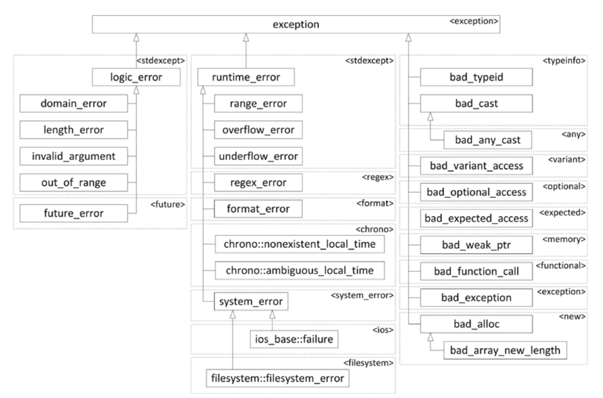

## 错误和异常
程序总会遇到非预期的行为，即异常。C 语言没有提供相关机制，可以使用返回值或其他方式处理，Java 提供了异常机制并强行使用。C++ 介于两者之间。

C++ 继承了 C 通过返回值处理错误的方式。不过这种方式不统一，有的函数返回 0 表示成功，其他整数表示错误并不设置 `error`，有的函数返回 0 表示成功，-1 是失败并设置 `error`，甚至有的函数 0 表示失败因为 0 对应 `false`。另外，只能有一个返回值，有了表示成功与否的整数，真实要返回的数据就需要通过参数返回，或者返回类型是 `std::pair` `std::optional` `std::tuple` 或者自定义类型，不方便。另外，C 可以使用 `setjmp()` `longjmp()`，但是由于这会绕过栈上对象的析构，C++ 实践不推荐这么用。

异常的好处很多，首先必须处理，如果没处理程序就终止了，其次可以包含充分的信息，调用栈的某些层次还可以忽略它，不过不要滥用异常，仅仅用于处理错误。

编译器对异常处理的性能有相当的提升。对于非异常情况，速度比使用错误码的方式还快。

## 异常机制
语法如下所示
```cpp
try
{
	// ... code which may result in an exception being thrown
}
catch (exception-type1 exception-name)
{
	// ... code which responds to the exception of type 1
}
catch (exception-type2 exception-name)
{
	// ... code which responds to the exception of type 2
}

// ... remaining code
```
`try` 可以指直接用 `throw` 抛出异常，也可以是调用其他函数时被调用函数抛出的异常。如果没有异常，`catch` 里面不会执行，会继续执行 `try` 后续的代码。如果有异常，`throw` 之后的代码不会执行，进行对应的 `catch` 块执行。如果 `catch` 块没有转移执行的控制，比如返回或再次抛出异常，那么也会继续执行 `try` 后面的代码。

`throw` 是唯一抛出异常的方式，C++ 标准库定义了相当多异常类型。基类 `std::exception` 支持函数 `what()` 返回 `const char *` 输出错误信息。

一般来说，文档应该给出当前函数会抛出哪些异常。

抛出异常可以是任意类型，比如 `throw 5` `catch (int e)` 和 `throw "error"` `catch (const char *e)`，但是推荐抛出 C++ 标准库定义好的异常类型，或者继承自标准库的自定义异常类型，因为类名可以提供一些信息，同时还可以携带更多的信息，比如类型为字符串的错误信息。当 `catch` 的时候推荐使用 `const` 引用类型。

`catch (...)` 捕获所有异常，但是没有任何细节信息，除了打日志、重新抛出异常之外，做不了太多的事情。因此推荐 `throw` 异常类型，然后捕获 `const std::exception &` 就是相当于所有异常了。

虚函数也可以使用 `noexcept`，可以更严格，比如基类没有标记，但是派生类标记了 `noexcept`，但是反之不行。`noexcept(expression)` 写法是根据表达式确定有误异常。

## 异常和多态
下图是 C++ 标准库中异常类型的继承关系。



可以利用多态特性进行捕获，因此前面的建议——捕获 `const` 引用类型——就更重要了，否则会出现截断、丢失信息的问题。多个 `catch` 语句是顺序执行的，那么如果捕获更一般的异常（基类）在前更特殊的异常类型（派生类）在后，那么后面的 `catch` 永远不会执行。

可以自定义异常类型，推荐继承自标准库的异常类。自定义异常的好处是可以使用更有意义的名字，携带更多的信息，而不仅仅是一个错误字符串。

自定义异常需要 `override` `what()` 函数，返回 `const char *`，需要在异常对象析构之前，这个字符串指针都是有效的，比如下面的实现保存在 `std::string` 内。
```cpp
#include <exception>
#include <format>
#include <string>

class FileError : public std::exception
{
public:
	explicit FileError(std::string filename)
		: filename_ { move(filename) }
	{
	}

	const char *
	what() const noexcept override
	{
		return message_.c_str();
	}

	virtual const std::string &
	GetFilename() const noexcept
	{
		return filename_;
	}

protected:
	virtual void
	SetMessage(std::string message)
	{
		message_ = std::move(message);
	}

private:
	std::string filename_;
	std::string message_;
};

class FileOpenError : public FileError
{
public:
	explicit FileOpenError(std::string filename)
		: FileError { std::move(filename) }
	{
		SetMessage(std::format("Unable to open {}.", GetFilename()));
	}
};
```

异常的捕获会移动或者拷贝异常对象，因此如果自定义的异常类有动态分配内存等操作导致实现了析构函数，那么根据建议，实现拷贝、移动的构造和赋值，保证自定义异常如期工作。再一次，如果按值捕获，会导致多一次拷贝，捕获 `const` 引用可以节省一次拷贝。


