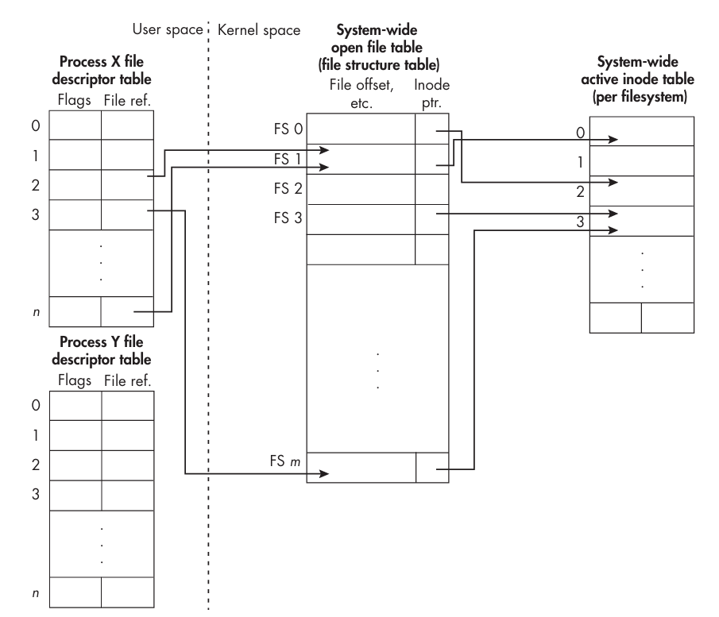

数据从文件传输到内存空间称为文件输入（`file input`），反之从内存空间传输到文件称为文件输出（`file output`）。统称为文件 I/O（`file I/O`）。

高级语言的类库往往提供了方便的接口操作文件 I/O，不过有的时候没有充分的控制力或者效率不够高，这时就需要使用系统调用来进行文件 I/O。

从 Unix 诞生之初，就采用了一种通用的 I/O 模型，目的是消除不同设备以及不能访问方式的差异。也就是说，一个能够对磁盘文件进行读写的程序，同样可以对终端、网络接口或者外围设备等设备进行读写。从程序的视角看，访问这些设备并没有差别。因此我们说 Unix 提供了设备无关的 I/O。举一个具体的例子，`/dev/tty` 是一个特殊的文件，它表示终端设备，假定有一个文件 `infile`，`cp infile /dev/tty` 命令会将 `infile` 的内容输出到终端上。

## 文件权限
每一个进程都有一个文件创建掩码（`file creation mask`），也称为 `umask`，它决定了新创建的文件的默认权限。当进程创建一个文件时，该文会被赋予一组初始权限。创建文件的函数往往有一个模式（`mode`）参数，允许进程去设置这些初始权限。不过 `umask` 会对这些权限进行掩码操作，从而最终决定了新文件的权限——进程试图设置的权限减去被 `umask` 移除的权限。

`umask` 是一个反向掩码，比特 1 表示禁止（去掉相应的权限），比特 0 表示允许。掩码一共 9 比特，三个一组，分别表示用户（user）、组（group）和其他人（others）的读、写、执行权限。常见的 `umask` 值如下：
```
0 0 0   0 1 0   0 1 0
r w x   r w x   r w x
user    group   others
```
由于 3 比特二进制和八进制紧密关联，因此常常用八进制表示 `umask` 的值，比如上面的例子是 `022`。`022` 是一个常用的 `umask` 值，这意味着用户所在组、其他人没有写的权限。当调用函数创建文件时，模式是 `mode`，那么最终的权限就是 `mode & ~umask`。例如，如果 `umask` 是 `022`，而创建文件时指定的模式是 `0662`，那么最终的权限就是 `0662 & ~022 = 0640`，即用户有读写权限，组有读权限，其他人没有任何权限。

使用 `umask` 命令可以查看当前的设置。`umask -S` 参数可以以符号方式显示不会修改哪些权限。`umask xxx` 命令可以设置新的 `umask` 值。

进程启动的时候会使用当前 `shell` 的 `umask` 值作为默认值，子进程也会继承这个值。

## 进程的 User ID
每个文件都有访问权限控制，而用户只能通过启动某个程序来访问文件。因此文件权限要决定哪些用户进程能访问、如何访问。每个进程至少与一个用户 ID（`user ID`，`UID`）相关联。Linux 上每个进程有四个用户 ID，分别是

- 实际用户 ID（`real user ID`，`RUID`）
- 有效用户 ID（`effective user ID`，`EUID`）
- 保存的设置用户 ID（`saved set-user ID`，`SUID`）
- 文件系统用户 ID（`filesystem user ID`，`FSUID`）

Unix 上，内核确定有没有权限使用的是有效用户 ID。Linux 上使用文件系统用户 ID 来确定访问权限，但是由于文件系统用户 ID 总是等于有效用户 ID，因此 Linux 上的访问权限检查和 Unix 上是一样的。

通常情况下，运行一个程序，所创建的进程被分配一个有效用户 ID 和实际用户 ID，都是当前用户的用户 ID，因此是相同的。不过有的时候进程可以拥有不同的有效用户 ID 和实际用户 ID，此时有效用户 ID 赋予程序的特权往往要大于实际用户 ID。因此一个程序可以使用程序文件所有者的用户 ID 作为有效用户 ID 来运行，而不是运行这个程序的用户的用户 ID。

文件模式（`file mode`）包含 12 个比特，最高位称为 `setuid`，如果这个比特被设置了，那么非程序拥有者运行这个程序，所创建的进程使用该程序的拥有者的用户 ID 作为有效用户 ID，而不是运行这个程序的用户的用户 ID。通过 `ls -l` 可以查看这个比特是否被设置了，如果设置了用户执行权限显示的是 `s` 而不是 `x`。启用了 `setuid` 的程序通常需要临时把有效用户 ID 改成实际用户 ID，然后再恢复有效用户 ID。保存的设置用户 ID 就是用来保存原来的有效用户 ID 的。这样的程序被称为 `setuid` 程序。常见的例子是系统软件比如 `passwd`。下面是 `passwd` 的权限：
```sh
ls -l /usr/bin/passwd
-rwsr-xr-x 1 root root 118168 Apr 19  2025 /usr/bin/passwd
```
当我们在一个终端上运行 `passwd` 命令时，所创建的进程的有效用户 ID 是 `root`，而不是当前用户的用户 ID。打开另一个终端可以查看
```sh
ps -o euid,ruid,pid,args -C passwd
 EUID  RUID     PID COMMAND
    0  1000    3611 passwd
```
`RUID` 是当前用户的用户 ID，而 `EUID` 是 `root` 的用户 ID。

## I/O 机制
进程访问文件之前，首先要与文件建立连接。连接（`connection`）是管理和控制进程访问文件的一个对象，包含文件偏移量（`file offset`）它指向文件执行操作的位置、各种标志（`flag`）和控制读写的模式（`mode`）、文件的位置等等。为了创建这个对象，进程执行 `open` 来打开文件。POSIX 规范讲这种连接对象（`connection object`）称为打开文件描述（`open file description`, `OFD`）。

有三种打开文件的模式：只读（`read mode`）、只写（`write mode`）和读写（`read-write mode`），这些事是访问模式（`access mode`）。

打开文件之后返回一个标识符，称为文件描述符（`file descriptor`），它是一个非负整数，是新创建的 `OFD` 的引用。多个进程可以打开同一个文件，每个进程都有自己的文件描述符。一个进程可以打开同一个文件多次，每次都会创建一个新的 `OFD`，每个 `OFD` 都有自己的文件偏移量、标志和模式，一个进程还可以有多个文件描述符指向同一个 `OFD`。Unix 会有锁机制确保只有一个进程打开。

下图是内核的内存打开文件表（`in-memory open file table`）的示意图，这个表也被称为文件结构表（`file structure table`）。这个表的每一项有很多字段，其中一个是指向表示真实文件的 inode 的指针。进程 X 打开了两个文件，`OFD` 是 1 和 m 位置，同时复制了文件描述符，使得 2 和 n 指向同一个 `OFD`。`OFD` 3 和 m 指向同一个 inode 3，打开的是同一个文件。



当不再使用一个文件时，进程可以执行 `close` 来关闭文件。关闭文件会释放文件描述符和 `OFD`，如果没有其他的文件描述符指向这个 `OFD`，那么内核会释放这个 `OFD`。`OFD` 内有一个字段是引用计数，用于追踪有多个描述符指向它。如果程序没有关闭一个正在写入的文件，可能会导致数据丢失。因为通常写文件不是直接落盘，而是先写入内核的缓冲区（`kernel buffer`），内核最终才会将其写入底层硬件。关闭描述符对于将这些缓冲区刷（`flush`）到设备是必要的，不过有时只调用 `close` 可能不够，因为 `close` 的职责是释放资源和递减引用计数，尝试刷盘，但是这个是异步的，并不会等待真的成功了。

当进程创建的时候，会自动打开三个文件描述符，分别是标准输入（`stdin`）、标准输出（`stdout`）和标准错误（`stderr`），它们的文件描述符分别是 0、1 和 2，这些是定义在 `<unistd.h>` 头文件中的常量 `STDIN_FILENO`、`STDOUT_FILENO` 和 `STDERR_FILENO`。标准输入通常是键盘，标准输出和标准错误通常是终端屏幕。当进程终止的时候，这些文件描述符会被自动关闭。因此我们不需要显式地关闭它们。

## 基本 I/O 接口
### 打开文件
下面分析几组 I/O 接口。第一组用于打开文件。
```c
#include <sys/types.h>
#include <sys/stat.h>
#include <fcntl.h>

int open(const char *pathname, int flags);
int open(const char *pathname, int flags, mode_t mode);
int creat(const char *pathname, mode_t mode);
int openat(int dirfd, const char *pathname, int flags);
int openat(int dirfd, const char *pathname, int flags, mode_t mode);
```
`creat()` 是 `open()` 的一个特例，`openat()` 是 `open()` 的扩展，因此下面分析 `open()` 的语义。

第一个参数 `pathname` 是要打开的文件的路径名。第二个参数 `flags` 是一个或多个标志的按位或，指定了访问模式和其他选项，这些选项可以用 `|` 运算符组合起来。访问模式是必须的，其他选项是可选的。访问模式有三种：只读（`O_RDONLY`）、只写（`O_WRONLY`）和读写（`O_RDWR`）。如果调用成功，返回一个非负整数的文件描述符，如果失败，返回 -1，并设置 `errno` 来指示错误原因。比如下面打开一个文件（只读模式）：
```c
int fd = open("infile", O_RDONLY);
if (fd == -1)
    // Handle error.
```
如果文件不存在会返回 -1 并且将 `errno` 设置为 `EACCESS`。

下面打开一个文件（只写）：
```c
int fd = open("outfile", O_WRONLY);
if (fd == -1)
    // Handle error.
```
这里引出了几个问题：如果文件不存在，是创建一个新文件还是报错？如果文件存在但是不为空，报错还是覆盖呢？如果存在、不为空且不报错，从头开始写还是从文件末尾追加呢？这些问题都可以通过 `flags` 参数来指定。这类标志分成两类：文件创建标志（`file creation flag`）和文件状态标志（`file status flag`）。这里先介绍下面三个：

- `O_CREAT`：如果文件不存在，则创建它。
- `O_EXCL`：如果文件存在，则报错，与 `O_CREAT` 一起使用。
- `O_TRUNC`：如果文件存在且是一个普通文件，则将它截断为长度为 0。

如果只写 `O_WRONLY` 或 `O_RDWR`，并且文件不存在，`open()` 会失败。`open(outfile, O_WRONLY | O_CREAT)` 会创建一个新文件，如果文件存在，会从头开始写，覆盖原来的内容，比如写了 `N` 个字节，那么文件的前 `N` 个字节会被覆盖，后面的内容保持不变。如果想要整个文件都被替换，额外或上 `O_TRUNC` 标志。`fd = open("outfile", O_WRONLY | O_CREAT | O_EXCL);` 的语义是如果文件不存在，则创建它，如果文件存在，则报错。除此之外，这些文件创建标志的组合对于只读、只写、读写而言是未定义的或者不是期望行为。比如 `fd = open(argv[1], O_RDWR | O_CREAT | O_TRUNC);` 的语义是如果文件不存在，则创建它，如果文件存在，则将它截断为长度为 0，但是这样就无法读到任何内容了，但是文件是以读写模式打开的。

当 `O_CREAT` 被指定时，`open()` 的第三个参数 `mode` 就有意义了，它指定了新创建文件的权限。所有者是进程的有效用户 ID 而不是实际用户 ID。所有组是进程的有效组 ID 而不是实际组 ID，大部分时候这两者应该是一样的。

如果没有传入 `mode` 参数，权限是未定义的，也不可预期，因此必须传入这个参数。进程会使用 `umask` 来修改这个权限。`mode` 参数是一个八进制数，表示文件的权限位。你可以直接传入八进制数，也可以通过使用以下宏来设置权限位。比如想设置权限 `rw-r--r--` 就可以使用 `S_IRUSR | S_IWUSR | S_IRGRP | S_IROTH`，或者直接传入八进制数 `0644`。

| Constant | Numeric value | Permission |
|----------|---------------|------------|
| S_IRWXU  | 00700         | User has read, write, and execute permission. |
| S_IRUSR  | 00400         | User has read permission. |
| S_IWUSR  | 00200         | User has write permission. |
| S_IXUSR  | 00100         | User has execute permission. |
| S_IRWXG  | 00070         | Group has read, write, and execute permission. |
| S_IRGRP  | 00040         | Group has read permission. |
| S_IWGRP  | 00020         | Group has write permission. |
| S_IXGRP  | 00010         | Group has execute permission. |
| S_IRWXO  | 00007         | Others have read, write, and execute permission. |
| S_IROTH  | 00004         | Others have read permission. |
| S_IWOTH  | 00002         | Others have write permission. |
| S_IXOTH  | 00001         | Others have execute permission. |

### 关闭文件
`open()` 的对偶操作是 `close()`，它的原型如下：
```c
#include <unistd.h>
int close(int fd);
```
`close()` 的参数是一个文件描述符，关闭对应文件描述符。如果一个文件被打开了多次，那么每次都会有一个文件描述符，关闭其中一个文件描述符不会影响其他的文件描述符。

如果 `close()` 成功，返回 0，如果失败，返回 -1，并设置 `errno` 来指示错误原因。`close()` 失败的原因有很多，比如是一个坏的文件描述符，此时 `errno` 会被设置为 `EBADF`；内核执行 `close()` 的时候被更高优的任务打断，此时 `errno` 会被设置为 `EINTR`；有的时候文件不是本地文件而是远程文件，此时 `close()` 可能会失败，`errno` 会被设置为 `EIO`；如果是写入操作，`close()` 需要完成写入操作，此时会出现写操作的错误，比如没有空间了 `errno` 会被设置为 `ENOSPC`，或者没有配额了 `errno` 会被设置为 `EDQUOT`。

如果失败了，不应该再重试了。返回的错误码应当仅仅用于诊断和补救措施，最妥当的做法是尝试重新写入数据，或者写入新的文件中。在调用 `close()` 之前，应该调用 `fsync()` 将数据刷盘，此时报错就是写本身的错误，如果没有错误再调用 `close()`，如果此时有错，就是和 `close()` 本身相关的错误了。

### 读文件
有很多函数能够读取数据，这里介绍最简单、最常用的函数 `read()`，它的原型如下：
```c
#include <unistd.h>
ssize_t read(int fd, void *buf, size_t nbytes);
```
函数有三个参数，第一个参数是文件描述符 `fd`，第二个参数是一个指针 `buf`，指向一个缓冲区，类型是 `void *`，这样任意类型的地址都可以传参，第三个参数是要读取的字节数 `nbytes`，类型是 `size_t`。返回类型是 `ssize_t`，它是一个有符号整数（`signed size_t`），用于表示读取的字节数，如果发生错误，返回 -1。

`read(3, buf, len)` 的执行过程大致是内核使用文件描述符 `3` 找到对应的 `OFD`，通过 `OFD` 找到对应的 inode，然后从 inode 中找到对应的文件。从 `OFD` 描述的文件偏移量开始读取 `len` 个字节的数据到缓冲区 `buf` 中，并且更新文件偏移量。下面的代码片段是一个循环读取文件的例子：
```c
bool done = false;
const size_t len = 1024;
char buf[len];
while (!done) {
    ssize_t nread = read(fd, buf, len);
    if (nread < 0) {
        // handle error
    } else if (nread == 0) {
        done = true;
    } else {
        // buf[0...nread-1] contains the bytes just read
    }
}
```
这是一个典型的读取文件的循环。当返回值是负数的时候，说明读取出有错误，这种情况需要处理错误。返回值是 0 的时候，说明已经没有数据需要读取了，循环结束。返回值是正数的时候，说明读取了 `nread` 个字节的数据，这些数据存储在缓冲区 `buf` 中。上面的例子中，不能保证每次都能读到 `len` 个字节的数据，可能读到的字节数小于 `len`，因此需要根据返回值来判断读取了多少字节的数据。

文件偏移量会被 `read()` 更新，自动推进，因此在不停的调用 `read(fd, buf, len)` 的时候会读取紧接着上次读取的最后一个字节开始读取。最后能够完整的读取整个文件不会遗漏或重复。

### 写文件
与读文件类似，这里只介绍最简单、最常用的 `write()` 函数，它的原型如下：
```c
#include <unistd.h>
ssize_t write(int fd, const void *buf, size_t nbytes);
```
这个函数完全与 `read()` 对偶。从 `buf` 指向的缓冲区中写入 `nbytes` 个字节的数据到文件描述符 `fd` 对应的文件中，并且更新文件偏移量。返回值是写入的字节数，如果发生错误，返回 -1，`errno` 会被设置为错误码。`buf` 是 `const void *` 类型，可以传入任意类型的数据。写的位置取决于打开的方式，`O_WRONLY | O_CREAT | O_TRUNC` 会从头开始写。由于不断更新文件偏移量，连续调用 `write(fd, buf, len)` 会写入紧接着上次写入的最后一个字节开始写入，没有空洞（`holes`）。

调用 `write()` 之后，要检查返回值。如果是 -1，说明写入数据出错了，要按需处理这个错误。即便没有返回 -1 但是真实写入的字节数可能比指定的少，这种情况称为部分写（`partial write`），可能是文件到了预先设置的最大长度、磁盘满了、用户的配额满了等，此时可以提示用户也可以继续写剩余的数据，然后根据进一步的信息做出相应的处理。

## 控制读写位置
我们可以显式地移动文件的偏移量，这称为寻道（`seeking`）。内核提供了对应的函数 `lseek()`，用于修改当前文件偏移量的位置，原型如下：
```c
#include <sys/types.h>
#include <unistd.h>
off_t lseek(int fd, off_t offset, int whence);
```
第一个参数是文件描述符 `fd`，第二个参数是距离 `whence` 的偏移量 `offset`，第三个参数 `whence` 指定了偏移量的起点。`whence` 可以是下面三个值之一：

- `SEEK_SET`：文件开头。
- `SEEK_CUR`：当前位置。
- `SEEK_END`：文件末尾。

`offset` 可以是正数也可以是负数，表示向前或向后移动。

`lseek()` 的返回值是新的文件偏移量，如果出错，返回 -1，并设置 `errno` 来指示错误原因，比如最终的偏移量是负数，那么 `errno` 会被设置为 `EINVAL`。`lseek()` 可以用来获取当前的文件偏移量，只需要将 `offset` 设置为 0，`whence` 设置为 `SEEK_CUR`，即 `off_t current_pos = lseek(fd, 0, SEEK_CUR);`。`lseek()` 也可以用来获取文件的长度，只需要将 `offset` 设置为 0，`whence` 设置为 `SEEK_END`，即 `off_t size = lseek(fd, 0, SEEK_END);`。

### 文件空洞
虽然我们不能把文件偏移量移动到文件开始之前的位置，但是可以移动到文件结束的后面。`whence` 设置为 `SEEK_END`，`offset` 设置为正数，就可以将文件偏移量移动到文件末尾之后的位置。此时如果写入数据，文件中间的空白部分不会被写入任何数据，这些空白部分称为文件空洞（`file hole`），这部分的内容是 0。使用 `read()` 读取文件空洞的内容，缓冲区的内容是 0。

下面的程序会创建一个带有空洞的文件。
```c
int main(int argc, char *argv[])
{
	if (argc < 2)
	{
		printf("Usage: %s <file-to-create>\n", argv[0]);

		return 1;
	}

	int fd = open(argv[1], O_CREAT | O_WRONLY | O_TRUNC, 0644);

	const int BUFFER_SIZE = 10;
	char buf[BUFFER_SIZE];
	strncpy(buf, "0123456789", BUFFER_SIZE);
	write(fd, buf, BUFFER_SIZE);
	lseek(fd, 10000, SEEK_CUR);
	write(fd, buf, BUFFER_SIZE);
	close(fd);

	return 0;
}
```
程序首先写入十个字节，`0123456789`，然后将文件偏移量移动到当前位置之后的 10000 个字节的位置，也就是一个 10000 个字节的空洞，然后再写入十个字节，`0123456789`。最终文件的长度是 10020 个字节。

使用 `ls -l` 命令可以看到文件大小是 10020 个字节。
```shell
ll file_with_hole 
-rw-r--r-- 1 leshen leshen 10020 Jul  1 03:34 file_with_hole
```
使用 `ls` 的 `-s` 选项可以看到文件分配的块数，`--block-size=1` 是指定 `-s` 选项的单位是字节。
```shell
ls -s --block-size=1 file_with_hole
8192 file_with_hole
```
文件的大小是 10020 个字节，但是实际分配了 8192 个字节。磁盘上的块大小是 4KB，即 4096 字节，因此这个文件只占用了两个块的磁盘空间。使用 `du --block-size=1` 命令可以看到文件占用的磁盘空间是 8192 个字节。

文件存储在磁盘上的时候，分配的块是固定大小的。当写入数据小于等于 4096 字节时，只需要分配一个块，没有写的部分是 0。当第二次写的时候，位置是 10010，超过了第一个块的范围，因此需要分配第二个块。文件中间的空洞部分没有分配磁盘空间。每个块起始地址必须是 4096 的整数倍，小于 10010 的最小满足条件的地址是 $\lfloor 10010 / 4096 \rfloor * 4096 = 8192$，因此第二个块的起始地址是 8192，结束地址是 12288。10010 减去 8192 等于 1818，因此第二个块的前 1818 个字节是 0，后面写入了十个字节的数据。假定中间 `lseek` 的距离不是 10000，而是更大的值，比如 1,000,000，那么空洞更大，但是文件实际也只需要两个块。

使用 `od` 可以查看文件内容，`-a` 是以 ASCII 码显示而不是显示数字编码。
```shell
od -a file_with_hole 
0000000   0   1   2   3   4   5   6   7   8   9 nul nul nul nul nul nul
0000020 nul nul nul nul nul nul nul nul nul nul nul nul nul nul nul nul
*
0023420 nul nul nul nul nul nul nul nul nul nul   0   1   2   3   4   5
0023440   6   7   8   9
0023444
```
`nul` 表示内容是 0，中间的 * 表示中间一块的内容都是重复的之前的一样。
