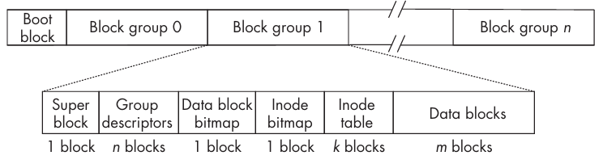

这一章我们分析文件、目录和文件系统的相关知识。

普通文件（`ordinary file`）可以存储数据和程序，目录（`directory`）用于组织文件，各种类型的特殊文件（`special file`）使得我们可以像访问普通文件一样访问设备。文件系统（`filesystem`）是存储文件的框架。

大部分文件系统是基于磁盘的，数据存储在某种类型的磁盘上，不过也可以存储在其他介质上，比如磁带、光盘等。还有一些文件系统是基于内存的。常见的文件系统都是基于磁盘的。

## 磁盘
常见的磁盘有硬盘（`hard disk`），通常由多个盘片（`platter`）组成，每个盘片有两个磁性表面。这些盘片绕着一根连接到电机的主轴（`spindle`），以固定速度旋转，旋转速率以每分钟转数（`rotations per minute`, `RPM`）衡量。每个磁性表面被划分为同心圆的轨道（`track`），每个轨道被划分为扇区（`sector`）。所有距离盘片中心相同的轨道组成一个柱面（`cylinder`）。物理块（`physical block`）是一个或多个扇区的集合，通常是 512、1024、4096 字节，通常（不是必须）是 512 的整数倍。块是在磁盘之间传输数据的最小单元。有时，相邻的块被称为簇（`cluster`）。

磁盘的每一个面都有一个磁头（`disk head`），磁头可以在盘片上移动，读取或写入数据。在磁头保持同一个位置时，同一个柱面的所有磁道都可以被读取。为了读取数据，磁头必须移动到正确的柱面，这个过程称为寻道（`seek`）。寻道时间（`seek time`）是磁头移动到正确柱面所需的时间。然后旋转到正确的扇区，旋转延迟（`rotational delay`）是磁头等待正确扇区旋转到磁头下方所需的时间。一旦找到需要的扇区就可以读取数据了。寻道时间和旋转延迟是开始 I/O 操作的开销，其中寻道时间通常是主要的开销。传输数据所需的时间取决于数据量的大小，通常情况下比读写内存慢好几个数量级。

内核通过设备驱动器（`device driver`）与磁盘进行交互。设备驱动器是一组内核函数的集合，通过与设备通信完成对系统调用 `read()` `write()` `lseek()` 的响应。磁盘设备驱动器（`disk device driver`）或磁盘驱动器（`disk driver`）是设备驱动器的一种，专门用于与磁盘进行交互。本质上它操作的是磁盘设备控制器，进而执行移动磁头、读写等操作。不同的磁盘使用不同的控制器，磁盘驱动器是为特定的磁盘控制器编写的。不过，不管什么类型的磁盘，对内核的接口是一样的。也就是说，每一个磁盘驱动器都要遵循内核指定的接口。硬件是计算机系统最底层，设备驱动器直接和其打交道，内核与这些驱动交互。这种设备独立的架构使得进程和内核的高层部分无需意识到底层硬件的差异。

早期磁盘就是连续的块组成的，包含一个文件系统。随着容量的增加，磁盘可以被划分为多个不重叠的逻辑实体，每一个可以包含一个文件系统，这些逻辑实体被称为磁盘分区（`disk partition`）或分区（`partition`），也称为逻辑磁盘（`logical disk`）。切分磁盘的过程称为分区（`partitioning`）。磁盘的一个扇区包含磁盘分区的记录，这个记录称为主引导记录（`master boot record`, `MBR`），现代系统使用 GUID 分区表（`GUID Partition Table`, `GPT`，`globally unique identifier`）替代 MBR，支持更多的分区数和更大的磁盘容量。

分区还可以用于文件系统之外的目的。Unix 系统定义了一种分区，称为交换分区（`swap partition`）或交换区（`swap space`），用于存储内存页。分区的另一个用途是用于数据库，数据库往往使用裸模式（`raw mode`）访问磁盘，绕过文件系统直接访问磁盘分区。

磁盘分区有如下优势：

- 更高的文件安全性控制。不同用户组的文件可以放在不同的分区，每个分区可以有自己的挂载选项，比如可写或只读，从而允许为不同的用户组织提供不同的安全保障。
- 更高效地利用磁盘。不同的分区可以使用不同的块大小和文件大小限制。对于不同的场景可以有不同的配置。
- 更高效的运行性能。当磁盘分区后，磁头为执行读写操作所移动的距离往往更短，从而缩短了磁盘访问时间。
- 选择性的备份。针对单个分区而不是整个磁盘执行备份，可以用不同的周期去备份不同的分区。
- 提升故障恢复能力。当磁盘介质故障时，损坏可能可以局限在分区内而不是整个磁盘，从而只需要恢复、还原更少的文件。
- 可靠性。分区可用于创建文件的冗余副本，降低因物理故障或恶意软件攻击导致磁盘某个分区损坏时，数据丢失的风险。

磁盘分区有一个缺点就是它们是静态的，大小不能增加了。如果分区在创建的时候没有足够的空间，或者不能满足未来的需求，不得不重新分区。

## 文件系统
文件系统的设计和实现并不是 Unix 标准的一部分。在过去这些年，有相当多的文件系统被设计和实现出来。BSD 系统使用 Berkeley Fast File System（`FFS`），并由此衍生出许多 Unix File System（`UFS`）实现。

现代 Unix 系统、Linux 系统支持相当多种文件系统，比如 Ext2、Ext3、Ext4、Minix、ISO9660、NFS、tmpfs、proc 等等。

### 文件系统结构
文件系统不仅仅是写入磁盘的一组数据结构的集合，还有在此基础之上的方法。不过尽管各种方法对理解系统非常重要，但是往往掌握其数据结构，就足以理解系统是如何运行的。通过剖析文件系统的核心数据结构，将能够清晰理清当程序向内核发起读写请求时究竟发生了什么。首先我们关注 Ext2/3/4 文件系统的结构及其数据结构。

现代文件系统中，磁盘分区的第一块是引导块（`boot block`），剩余的空间被分割为大小相同的块组（`block group`）。下图描述了分区的结构和每个块组的各个部分所占用的块数。



早期 Unix 系统把块组织成柱面组（`cylinder group`），一个柱面组包含一个或多个相邻的柱面上的块。柱面组是物理概念，和磁盘的几何构型绑定在了一起，块组是逻辑概念，和磁盘的几何构型无关。现代磁盘驱动隐藏了这些细节。

引导块包含操作系统启动时所需要的信息。每个文件系统都有引导块，不过通常操作系统使用磁盘上的第一个引导块启动系统。

从上图可以看出来，一个块组包含超级块（`superblock`）、组描述信息（`group descriptor`）、数据块位图（`data block bitmap`）、inode 位图（`inode bitmap`）、inode 表（`inode table`）和数据块（`data block`）。

主超级块位于块组 0 的第一个块。Ext2/3 会在其他块组中保存其副本；Ext4 可通过稀疏超级块等特性减少副本数量。超级块包含了 100 多个字段，其中包含了关于文件系统的各种参数信息，比如有多少个 inode、块的总数、块的大小、保留块和未分配块的数量、各种时间戳、各种标志位、系统挂载状态信息等等。这类信息称为元数据（`metadata`）。其他块组中的超级块副本可在主超级块损坏时用于恢复。

组描述符表存储每个块组的信息，比如各组成部分的起始块地址、已使用块数和空闲块数等。组描述符表的副本位置和数量取决于文件系统特性；它们可在文件系统损坏时辅助恢复。

数据块位图使用 1 比特信息来表示每个块的状态，1 表示该块已经被使用了，0 表示该块是空闲的。每个块组有一个数据块位图。假定块有 4096 字节，那么有 4096 * 8 = 32768 个块可以被表示。每个块 4KB，32768 个块就是 128MB 的空间。

inode 位图和数据块位图类似，使用 1 比特信息来表示每个 inode 的状态，1 表示该 inode 已经被使用了，0 表示该 inode 是空闲的。按照上面的假定，4096 字节的块可以表示 32768 个 inode。

现代系统中，inode 通常在一个表中，存储了这个块组中所有文件的 inode。inode 存储了一个文件的状态（`status`），这是旧术语，现代术语是元数据（`metadata`）。在 ext4 中，表示 inode 的结构体类型是 `struct ext4_inode`。在 ext2/3 中，结构体固定大小是 128 字节。假定块大小是 4096 字节，那么一个块可以存储 32 个 inode。超级块中决定了块组中有多少个 inode，进而确定了当前块组中需要多少块来表示 inode 表。ext4 中，inode 可以更大，添加了更多的字段，比如存储文件的创建时间 `i_crtime`，自身还包含名为 `i_extra_isize` 的字段，表示 inode 结构体比 128 字节大了多少。

文件数据并不与文件的元数据存储在一起。文件的元数据存储在 inode 中，包括最后访问时间、最后修改时间、文件大小、文件权限、占用块数和硬链接数等；支持创建时间的文件系统还会记录创建时间。最重要的是，inode 包含指向文件数据的指针。Ext2/3 以及未启用 extent 的 Ext4 inode 中包含 15 个指针，通常每个指针 4 字节。前 12 个是直接指针（`direct pointer`），假定块大小是 4KB，因此能够直接指向 12 * 4KB = 48KB 的数据。第 13 个是单间接指针（`single indirect pointer`），它指向一个块，这个块中存储了指向数据块的指针。假定块大小是 4KB，每个指针 4 字节，那么这个块可以存储 4KB / 4B = 1024 个指针，能够间接指向 1024 * 4KB = 4MB 的数据。第 14 个是双间接指针（`double indirect pointer`），它指向一个块，这个块中存储了指向单间接块的指针，每个单间接块又可以间接指向 1024 个数据块，因此双间接指针可以间接指向 1024 * 1024 * 4KB = 4GB 的数据。第 15 个是三间接指针（`triple indirect pointer`），它可以间接指向 1024 * 1024 * 1024 * 4KB = 4TB 的数据。

数据块在块组的最后。文件系统会尽量将文件的数据块放在同一个块组中，和元数据 inode 在一起，不过对于大文件来说，这并不总是可行的，文件的数据块可能会分布在不同的块组中。

现代文件系统并不会将一个文件的所有数据都按顺序保存在磁盘上。虽然这样保存访问文件数据会更快，但是磁盘空间的使用效率会很低，因为会出现许多对于容纳整个文件来说很小的空隙。此外，寻找空间来写入新文件会更耗时，因为文件系统必须找到足够容纳该文件的连续空间。现代文件系统将文件的数据切分为多个块，并将这些存储在不连续的位置。提升了磁盘的利用率，不过也会带来一些其他问题。一方面是寻找文件的数据块需要花费更多的时间，另一方面是说这些块可能彼此距离比较远，访问的时候产生了更多的磁盘寻道，增加了文件访问延迟。

如果一个分区没有被分为多个块组，分区的开头只有一个单独的 inode 表，那么对中等大小的文件来说，每次文件访问都需要更多的磁盘寻道，因为访问新的数据块，先访问一次 inode，然后访问数据块，磁头在两个位置之间来回移动。此外，同一个文件的数据块可能会相距很远，从而导致更多的寻道。块组问题缓和了这些问题，同时允许文件的块以非连续的方式存放在磁盘上。它减少了整体寻道时间，因为 inode 和数据块在同一个柱面或相邻柱面。此外，Unix 中 inode 所采用的分配方法允许内核通过简单的算术运算即可计算出某个块的起始地址。不过间接指针的使用增加了访问数据所需要的 CPU 时间，因为每个块都需要进行多次解引用。

另一个性能问题是块的大小。文件总是被分配整个块的，实际文件刚好是块大小的整数倍是相当罕见的情况。存储的最后一个块通常只被使用了一部分。块内未被使用或者被浪费的空间称为内部碎片（`internal fragmentation`）。平均而言，最后一个块未被使用的比例是 50%。这意味着块的大小越大，最后一个块中浪费的空间也越多。当大多数文件都很小时，较大的块会导致更多的磁盘空间浪费，因为最后一个块中浪费的空间占整个文件的比例会更大。比如块大小是 4KB，平均文件 100KB，平均需要 25 块，那么最后一个块的一半浪费了，占比 2%。如果文件很小，平均大小是 16KB，平均需要 4 块，2KB/16KB，占比是 12.5%。空间浪费也会转化为时间浪费，平均会有更多的磁盘活动和更长的磁盘等待时间。如果预期存放的文件都比较大，那么更大的块可以提升性能。

### 虚拟文件系统
上面是许多 Unix 文件系统的基础，不过各文件系统的实现彼此并不相同。同时，Unix 通常支持将不同类型的文件系统挂载到同一个目录树上，这意味着目录树的不同部分可能来自不同的文件系统。比如 Unix 可能将一个 NTFS（`New Technology File System`）文件系统挂载到目录树上；它可能不具备 Unix 目录的属性，因此为了挂载并访问其中的文件，内核必须将其目录抽象为 Unix 目录。另外，对于 `read()` `write()` `lseek()` 等系统调用，内核无法提供单一的、通用的实现，因为这些函数的具体实现完全依赖于底层文件系统。

这个问题在其他地方已经被解决过了。在编译时我们无法知道需要多少存储空间，我们不会静态声明变量，而是使用一个指针，运行时动态分配内存。这称为运行时绑定（`run-time binding`）或延迟绑定（`delayed binding`）。类似的还有 C++ 中虚函数。虚函数的调用在编译时无法确定，必须在运行时才能确定调用哪个函数。虚函数的实现是通过一个指针表（`pointer table`）来实现的，这个指针表称为虚函数表（`virtual function table`, `vtable`）。

这里也可以使用类似的思想。ext2 设计者在文件系统之上创建了一个抽象层，这一层称为虚拟文件系统（`virtual file system`, `VFS`）。VFS 定义了一个抽象的文件系统接口并隐藏了具体的实现。运行时，将文件系统相关调用的实现与各个挂载的文件系统中的具体实现绑定起来。VFS 定义了一组每个文件系统都要实现的方法，这些接口被分为了三类：文件系统、inode 和打开文件。

当一个进程发起对文件的系统调用时，内核会调用 VFS 中的一个函数，这个函数负责处理与具体结构无关的操作，然后将调用重定向到具体物理文件系统代码中所包含的函数，这个函数继续负责处理与具体结构相关的操作。

## 文件系统内核接口
命令 `stat` 可以获取文件的状态信息，加上 `-f, --file-system` 选项可以获取文件系统的状态信息，参数 `-c` 可以指定输出格式，有相当多的以百分号 % 开头的格式化选项，输出不同的文件系统信息。
```shell
# stat format.cc
  File: format.cc
  Size: 439             Blocks: 8          IO Block: 4096   regular file
Device: 254,3   Inode: 260334      Links: 1
Access: (0644/-rw-r--r--)  Uid: (    0/    root)   Gid: (    0/    root)
Access: 2026-08-03 09:46:51.703024311 +0800
Modify: 2026-08-03 09:46:51.571026620 +0800
Change: 2026-08-03 09:46:51.571026620 +0800
 Birth: 2026-07-14 09:54:10.617288388 +0800

# stat -f format.cc 
\  File: "format.cc"
    ID: 522779b1aaceb653 Namelen: 255     Type: ext2/ext3
Block size: 4096       Fundamental block size: 4096
Blocks: Total: 10170254   Free: 7698672    Available: 7694576
Inodes: Total: 2571504    Free: 2371173

# stat -c"blocks %b" format.cc 
blocks 8
```

### `stat()`
下面是系统调用 `stat()` 的定义：
```c
#include <sys/stat.h>
#include <sys/types.h>
#include <unistd.h>

int stat(const char *pathname, struct stat *statbuf);
int fstat(int fd, struct stat *statbuf);
int lstat(const char *pathname, struct stat *statbuf);
```
`stat()` 和 `fstat()` 的区别是第一个参数不同，前者是文件路径，后者是文件描述符。`lstat()` 与 `stat()` 类似，不过它不会跟随符号链接，如果传入的是符号链接，它返回的是符号链接本身的状态信息，而不是它所指向的文件的状态信息。

`stat()` 需要对文件有执行（`execute`）权限，`fstat()` 不需要。

这三个函数的返回值写在第二个参数中，下面是 `struct stat` 的定义的简化版。
```c
struct stat {
    dev_t st_dev;       /* ID of device containing file */
    ino_t st_ino;       /* Inode number */
    mode_t st_mode;     /* File type and mode */
    nlink_t st_nlink;   /* Number of hard links */
    uid_t st_uid;       /* User ID of owner */
    gid_t st_gid;       /* Group ID of owner */
    dev_t st_rdev;      /* Device ID (if special file) */
    off_t st_size;      /* Total size, in bytes */

    blksize_t st_blksize;  /* Block size for filesystem I/O */
    blkcnt_t st_blocks;    /* Number of 512B blocks allocated */

    /* Since Linux 2.6, the kernel supports nanosecond precision for the
       following timestamp fields. For details before Linux 2.6, see NOTES. */
    struct timespec st_atim; /* Time of last access */
    struct timespec st_mtim; /* Time of last modification */
    struct timespec st_ctim; /* Time of last status change */

#define st_atime st_atim.tv_sec /* Backward compatibility */
#define st_mtime st_mtim.tv_sec
#define st_ctime st_ctim.tv_sec
};
```
这个结构体包含了 inode 中最重要的字段，比如文件所在的设备 ID、inode 号、文件类型和权限、分配块数、时间戳等等。最后三个宏用于访问秒级精度的时间戳，以便与早期的 Unix 系统兼容。这些字段的类型不是 C 语言的基本类型，定义在系统的头文件中。这种定义字段类型的优势是可以提高可移植性和可维护性。

文件模式存储在 `st_mode` 字段中，16 比特，最高的 4 比特表示文件类型（`file type`），低 12 比特表示文件模式（`file mode`），其中最低的 9 比特表示文件权限，剩下的 3 比特是特殊比特（`special bit`）。

文件类型定义了这个文件属于七种文件类型的哪一个，比如是一个普通文件、目录、符号链接、特殊设备。特殊位包括 set-user-ID `setuid`、set-group-ID `setgid` 和粘滞位（`sticky bit`），它们会影响权限。`setuid` 参考 [File-IO](./File-IO.md) 中的描述，其他两个后续会介绍。

9 个比特表示权限，分成三组，每组 3 个比特，分别表示文件所有者、文件所属组和其他用户的权限。每组 3 个比特分别表示读、写和执行权限。

POSIX.1-2024 规范了有助于提取这些值的宏，包含位掩码和查询的宏函数。首先看权限相关的宏。
```c
S_ISUID 0004000 /* setuid bit */
S_ISGID 0002000 /* setgid bit */
S_ISVTX 0001000 /* sticky bit */
S_IRWXU 00700   /* Mask for file owner permissions */
S_IRUSR 00400   /* Owner has read permission. */
S_IWUSR 00200   /* Owner has write permission. */
S_IXUSR 00100   /* Owner has execute permission. */
S_IRWXG 00070   /* Mask for group permissions */
S_IRGRP 00040   /* Group has read permission. */
S_IWGRP 00020   /* Group has write permission. */
S_IXGRP 00010   /* Group has execute permission. */
S_IRWXO 00007   /* Mask for permissions for others */
S_IROTH 00004   /* Others have read permission. */
S_IWOTH 00002   /* Others have write permission. */
S_IXOTH 00001   /* Others have execute permission. */
```
下面代码只用宏来判断其他用户是否有读权限。
```c
struct stat st;
if (stat("example.txt", &st) == 0) {
    if (st.st_mode & S_IROTH) {
        // Others have read permission
    }
}
```
下面是文件类型相关的宏。
```c
S_IFMT  0170000 /* Mask for file type bits */
S_IFLNK 0120000 /* Symbolic link */
S_IFREG 0100000 /* Regular file */
S_IFBLK 0060000 /* Block device */
S_IFDIR 0040000 /* Directory */
S_IFCHR 0020000 /* Character device */
S_IFIFO 0010000 /* FIFO */
```

下面的例子中判断指定路径是不是目录。
```c
struct stat st;
if (stat("example.txt", &st) == 0) {
    if ((st.st_mode & S_IFMT) == S_IFDIR) {
        // It's a directory
    }
}
```
上面的操作是一个相当常用的操作，POSIX.1-2024 规范提供了一组宏函数。
```c
S_ISREG(m)  /* Is it a regular file? */
S_ISDIR(m)  /* Is it a directory? */
S_ISCHR(m)  /* Is it a character device? */
S_ISBLK(m)  /* Is it a block device? */
S_ISFIFO(m) /* Is it a FIFO (named pipe)? */
S_ISLNK(m)  /* Is it a symbolic link? */
S_ISSOCK(m) /* Is it a socket? */
```
使用宏的话上面的例子简写为
```c
struct stat st;
if (stat("example.txt", &st) == 0) {
    if (S_ISDIR(st.st_mode)) {
        // It's a directory
    }
}
```

下面分析 `setgid`，和 `setuid` 有相似之处。当一个可执行文件设置了 `setgid` 位时，运行时进程的有效组 ID 会被设置为文件的组 ID，而不是运行进程的组 ID。`setgid` 位也可以设置在目录上，这样在该目录下创建的文件会继承该目录的组 ID，而不是创建文件的进程的组 ID。这使得文件共享变得更加容易，因为启用了 `setgid` 的目录允许同一个组的用户添加文件，并且该组的所有成员可以以相同的方式使用这些文件。

粘滞位（`sticky bit`）也称为保存文本镜像位（`save text image bit`）。最初 Unix 是一个纯粹的可交换的操作系统，进程在内存和外存之间可以换进换出，维持多个程序的运行。交换区（`swapping store`）是独立的磁盘或磁盘分区，存放被换出的进程镜像（`process image`）。可执行代码和数据在这个区域是连续存放的，读写速度更快。一个被很多人使用的程序，将其放在交换区可以使得加载、卸载更快，在程序文件上设置粘滞位可以防止它被从交换区移除。

如果一个目录设置了粘滞位，目录项只能由文件所有者、目录所有者或具有相应特权的进程删除或重命名。在目录上设置粘滞位还允许所有进程向其放入文件，同时确保只有与创建该文件的进程具有相同的有效用户 ID 的进程才能删除这些文件。通过 `ls -ld` 可以查看是否设置了粘滞位，粘滞位在权限中显示为 `t`。
```bash
# ls -ld /var/tmp
drwxrwxrwt 5 root root 4096 Aug  6 04:37 /var/tmp
```

### `statx()`
`statx()` 是 `stat()` 的增强版本，返回 `struct statx`，它包含了更多的字段。这个系统调用在 Linux 4.11 中引入（2017 年），因此不是所有的系统都支持它，`glibc` 在 2.28 中引入了对它的支持。`statx()` 参数有五个，调用也稍微复杂一下。我们首先看一下函数定义。
```c
#include <sys/types.h>
#include <sys/stat.h>
#include <unistd.h>
#include <fcntl.h> /* Definition of AT_* constants */

int statx(int dirfd, const char *pathname, int flags,
          unsigned int mask, struct statx *statxbuf);
```

接下来看一下 `struct statx` 的定义。
```c
/* The file timestamps are structures of the following type: */
struct statx_timestamp {
    __s64 tv_sec;   /* Seconds since the Epoch (UNIX time) */
    __u32 tv_nsec;  /* Nanoseconds since tv_sec */
};

struct statx {
    __u32 stx_mask;        /* Mask of bits indicating filled fields */
    __u32 stx_blksize;     /* Block size for filesystem I/O */
    __u64 stx_attributes;  /* Extra file attribute indicators */
    __u32 stx_nlink;       /* Number of hard links */
    __u32 stx_uid;         /* User ID of owner */
    __u32 stx_gid;         /* Group ID of owner */
    __u16 stx_mode;        /* File type and mode */
    __u64 stx_ino;         /* Inode number */
    __u64 stx_size;        /* Total size in bytes */
    __u64 stx_blocks;      /* Number of 512B blocks allocated */

    struct statx_timestamp stx_atime;  /* Last access time */
    struct statx_timestamp stx_btime;  /* Creation time */
    struct statx_timestamp stx_ctime;  /* Last status change time */
    struct statx_timestamp stx_mtime;  /* Last modification time */

    /* If this file represents a device, then the next two
       fields contain the ID of the device. */
    __u32 stx_rdev_major;  /* Major ID of device */
    __u32 stx_rdev_minor;  /* Minor ID of device */

    /* The next two fields contain the ID of the device
       containing the filesystem where the file resides. */
    __u32 stx_dev_major;   /* Major ID of device containing file */
    __u32 stx_dev_minor;   /* Minor ID of device containing file */
};
```
这个结构体与 `stat` 结构体不同之处在于包含了额外的成员并且其成员类型也不同。新增字段包括

- `stx_mask`：指示哪些字段被填充的位掩码。
- `stx_attributes`：标识额外的文件属性，比如是否被压缩或加密。
- `stx_attributes_mask`：指示 `stx_attributes` 中哪些位是有效的。
- `stx_btime`：文件的创建时间，文档中称为出生时间（`birth time`）。

与 `stat` 相比，时间戳类型是 `struct statx_timestamp`，它包含秒和纳秒两个字段。其余字段与 `stat` 结构体类似，但是类型不同，这里没有使用诸如 `uid_t` 这样的系统数据类型而是使用 `__u16`、`__u32`、`__u64` 这样的类型。

下面分析参数的使用，前面两个参数有以下几种组合：

如果 `pathname` 是绝对路径，那么 `dirfd` 会被忽略。比如下面的代码片段是为了获取 `g++` 这个二进制的文件信息。
```c
struct statx stx;
if (statx(0, "/usr/bin/g++", 0, STATX_ALL, &stx) == 0) {
    // Use stx
}
```

如果 `pathname` 是相对路径，`dirfd` 可以是宏 `AT_FDCWD`，表示相对路径是相对于当前工作目录的。假定当前目录是 `/home/user`，上面的例子可以写为
```c
struct statx stx;
if (statx(AT_FDCWD, "../../usr/bin/g++", 0, STATX_ALL, &stx) == 0) {
    // Use stx
}
```
`dirfd` 也可以是一个打开的目录的文件描述符，表示相对路径是相对于这个目录的。比如打开目录 `/usr/bin`，然后获取 `g++` 的信息。
```c
int dirfd = open("/usr/bin", O_RDONLY | O_DIRECTORY);
struct statx stx;
if (statx(dirfd, "g++", 0, STATX_ALL, &stx) == 0) {
    // Use stx
}
close(dirfd);
```
如果 `flags` 包含（比特或）`AT_EMPTY_PATH`，`pathname` 可以是一个空字符串，表示获取 `dirfd` 指向的文件的信息。
```c
int fd = open("/usr/bin/g++", O_RDONLY);
struct statx stx;
if (statx(fd, "", AT_EMPTY_PATH, STATX_ALL, &stx) == 0) {
    // Use stx
}
close(fd);
```
在使用绝对路径时，第一个参数会被忽略，因此第一个参数总是可以使用 `AT_FDCWD`，第二个参数是绝对路径或者相对于当前路径的路径。

`flags` 还可以包含 `AT_SYMLINK_NOFOLLOW`，表示如果 `pathname` 是一个符号链接，则不会跟随它，而是获取符号链接本身的信息。

第四个参数 `mask` 是一个位掩码，指示哪些字段需要被填充。`statx()` 可以只返回部分信息，从而减少系统调用的开销。`mask` 可以是以下值的组合：

```c
STATX_TYPE          /* Want stx_mode & S_IFMT */
STATX_MODE          /* Want stx_mode & ~S_IFMT */
STATX_NLINK         /* Want stx_nlink */
STATX_UID           /* Want stx_uid */
STATX_GID           /* Want stx_gid */
STATX_ATIME         /* Want stx_atime */
STATX_MTIME         /* Want stx_mtime */
STATX_CTIME         /* Want stx_ctime */
STATX_INO           /* Want stx_ino */
STATX_SIZE          /* Want stx_size */
STATX_BLOCKS        /* Want stx_blocks */
STATX_BASIC_STATS   /* All of the above */
STATX_BTIME         /* Want stx_btime */
STATX_ALL           /* All currently available fields */
```
我们可以通过 `mask` 参数指定我们想要获取的字段，从而减少不必要的开销。不过这里需要注意的是，内核可能会返回我们没有请求的字段，或者无法返回我们请求的字段。`stx_mask` 字段指示了哪些字段被填充了，如果发生了上述情况，这个字段与我们传入的 `mask` 参数不一致，因此需要以实际返回的 `stx_mask` 字段为准，下面的代码示例想要使用 `stx_size`，在此之前我们先判断 `stx_mask` 是否包含 `STATX_SIZE`。
```c
struct statx stx;
if (statx(AT_FDCWD, "/usr/bin/g++", 0, STATX_SIZE, &stx) == 0) {
    if (stx.stx_mask & STATX_SIZE) {
        // Use stx.stx_size
    } else {
        // stx.stx_size is not available
    }
}
```

### `statfs()`
这个接口返回的是文件系统的状态信息，而不是文件的状态信息。`statfs()` 和 `fstatfs()` 的区别是第一个参数不同，前者是文件路径，后者是文件描述符。
```c
#include <sys/statfs.h>

int statfs(const char *path, struct statfs *buf);
int fstatfs(int fd, struct statfs *buf);
```
`struct statfs` 的定义如下。
```c
struct statfs {
    __fsword_t f_type;    /* Type of filesystem (see below) */
    __fsword_t f_bsize;   /* Optimal transfer block size */
    fsblkcnt_t f_blocks;  /* Total data blocks in filesystem */
    fsblkcnt_t f_bfree;   /* Free blocks in filesystem */
    fsblkcnt_t f_bavail;  /* Free blocks available to unprivileged user */
    fsfilcnt_t f_files;   /* Total file nodes in filesystem */
    fsfilcnt_t f_ffree;   /* Free file nodes in filesystem */
    __fsid_t   f_fsid;    /* Filesystem ID */
    __fsword_t f_namelen; /* Maximum length of filenames */
    __fsword_t f_frsize;  /* Fragment size (since Linux 2.6) */
    __fsword_t f_flags;   /* Mount flags of filesystem (since Linux 2.6.36) */
    __fsword_t f_spare[4];/* Padding bytes reserved for future use */
};
```
这个函数仅在 Linux 中可用，其他 Unix 系统可能没有这个函数。`__fsword_t` 是 glibc 实现相关的类型，不应在需要可移植性的代码中依赖其具体定义。`__fsid_t` 包含文件系统的唯一标识符，不过不同系统的表示方式不同；在 Linux 中，它被定义为 `struct { int val[2]; }`。POSIX 规定了 `statvfs()`，推荐使用该接口。查询 `man statfs` 可以看到 `f_type` 字段的值和文件系统类型的对应关系。

### `statvfs()`
和 `statfs()` 类似，`statvfs()` 返回的是文件系统的状态信息。
```c
#include <sys/statvfs.h>

int statvfs(const char *path, struct statvfs *buf);
int fstatvfs(int fd, struct statvfs *buf);
```
`struct statvfs` 的定义如下。
```c
struct statvfs {
    unsigned long  f_bsize;    /* Filesystem block size */
    unsigned long  f_frsize;   /* Fragment size */
    fsblkcnt_t     f_blocks;   /* Size of fs in f_frsize units */
    fsblkcnt_t     f_bfree;    /* Number of free blocks */
    fsblkcnt_t     f_bavail;   /* Number of free blocks for unprivileged users */
    fsfilcnt_t     f_files;    /* Number of inodes */
    fsfilcnt_t     f_ffree;    /* Number of free inodes */
    fsfilcnt_t     f_favail;   /* Number of free inodes for unprivileged users */
    unsigned long  f_fsid;     /* Filesystem ID */
    unsigned long  f_flag;     /* Mount flags */
    unsigned long  f_namemax;  /* Maximum filename length */
};
```
这是一个库函数而不是系统调用。在 Linux 中这个函数是通过对 `statfs()` 的封装实现的。这个结构体没有 glibc 内部使用的类型，因此编译器可以识别。不过结构体不包含 `f_type` 字段，因此无法获取文件系统类型，如果我们需要获取文件系统类型，必须使用 `statfs()`。

## 目录
目录和普通文件类似，不过有以下几点约束：

- 有确定的结构，目录中存储的是文件名（`filename`）和 inode 号的映射关系，这个关系称为链接（`link`）。有的上下文中，链接和文件名可以互换。
- 目录永远不会为空，因为它至少包含两个特殊的目录项 `.` 和 `..`，分别表示当前目录和父目录。根目录 `/` 没有父目录，因此它的 `..` 也指向自身。
- 目录要通过特定的系统调用来修改，与通过 `open()` `creat()` 创建的普通文件不同。

使用 `open()` 以只读模式 `O_RDONLY` 打开目录是允许的，也可以调用 `close()` 关闭，但是大部分系统上都不允许使用 `read()`。允许打开的原因是为了访问其 inode 中的元数据而不是读取它的内容。通过 `readdir(unsigned int fd, struct old_linux_dirent *dirp, unsigned int count)` 可以读取目录的内容，不过这个函数是 Linux 内核的系统调用，glibc 没有封装它，不推荐使用。更好的方式是通过下面的函数得到目录信息。
```c
#include <dirent.h>

struct dirent *readdir(DIR *dirp);
```
我们先忽略 DIR 是什么东西。连续调用函数 `readdir()` 会返回指向目录中下一个文件的 `struct dirent` 结构体的指针，直到返回 `NULL` 表示目录中没有更多的文件。如果调用发生了错误，也会返回 `NULL`，因此需要提前设置 `errno` 为 0，然后在返回 `NULL` 后检查 `errno`。`readdir()` 返回的目录项放在了 C 库中静态分配的变量之中，因此会被后续的 `readdir()` 调用覆盖，如果想要保存返回的数据，必须在再次调用之前将其复制到其他存储空间。
```c
struct dirent {
    ino_t          d_ino;       /* Inode number */
    off_t          d_off;       /* Offset to the next dirent */
    unsigned short d_reclen;    /* Length of this record */
    unsigned char  d_type;      /* Type of file; not supported
                                   by all filesystem types */
    char           d_name[256]; /* Filename (null-terminated) */
};
```
返回结构体中，最有用的是 `d_ino` 和 `d_name`，它们分别表示文件的 inode 号和文件名，这两个字段也是 POSIX 标准规定必须要有的字段。POSIX 确保文件名有最大长度 `NAME_MAX`，因此如果需要临时存放这个值，最好声明一个大小为 `NAME_MAX + 1` 的缓冲区 `filename[NAME_MAX + 1]`，多一个字节是为了存放字符串结束符 `\0`。

`d_type` 说明这个目录项的类型，比如普通文件、目录、符号链接等，不过这并不是标准的一部分，因此在一些系统上可能没有，通过宏 `_DIRENT_HAVE_D_TYPE` 可以判断是否有这个字段。即便有这个字段，也不是所有的文件系统都支持它，因此在使用时需要检查其值是否为 `DT_UNKNOWN`，下面是 `d_type` 的可能值。使用该字段可以避免额外的 `stat()` 或 `lstat()` 调用，通常更快。
```
DT_BLK      This is a block device.
DT_CHR      This is a character device.
DT_DIR      This is a directory.
DT_FIFO     This is a named pipe (FIFO).
DT_LNK      This is a symbolic link.
DT_REG      This is a regular file.
DT_SOCK     This is a UNIX domain socket.
DT_UNKNOWN  The file type could not be determined.
```
现在回到 `DIR`，它是一个不完整的、不透明的类型，往往通过 `typedef struct __dirstream DIR` 来定义。`DIR` 包含目录流（`directory stream`）的状态信息，但具体实现对用户不可见。文件可能会在调用 `readdir()` 期间被异步删除或者添加。`readdir()` 返回一个指针，指向由参数 `dirp` 指定的目录流中的当前目录项的结构体，同时目录流的位置指向下一个目录项。

通过函数 `opendir()` 或 `fdopendir()` 可以得到一个 `DIR` 指针。前者的参数是目录路径，后者的参数是目录文件描述符。
```c
#include <sys/types.h>
#include <dirent.h>

DIR *opendir(const char *name);
DIR *fdopendir(int fd);
```
`opendir()` 打开一个目录，返回一个指向 `DIR` 的指针，此时目录流的位置指向第一个目录项，接着调用 `readdir()` 获取目录项就好。如果执行失败了，返回 `NULL`。

和之前类似，使用 `opendir()` 打开目录会使用资源，因此需要调用 `closedir()` 关闭目录流，释放资源。和其他系统调用一样，如果调用失败了返回 `-1` 并设置 `errno`。
```c
#include <sys/types.h>
#include <dirent.h>

int closedir(DIR *dirp);
```

除了这几个函数之外，还有几个非常有用的函数。第一个是 `rewinddir()`，它将目录流的位置指向第一个目录项。
```c
#include <sys/types.h>
#include <dirent.h>

void rewinddir(DIR *dirp);
```

下面是一对函数，`seekdir()` 和 `telldir()`，结合起来非常有用。
```c
#include <dirent.h>

long telldir(DIR *dirp);
void seekdir(DIR *dirp, long loc);
```
`telldir()` 返回下一次调用 `readdir()` 时将要返回的目录项的位置。`seekdir()` 将目录流的位置设置为指定的位置。通过这两个函数可以跳转到之前保存的位置。

这里不要假定 `telldir()` 返回的值是相对于目录起始位置的偏移量。现代文件系统可以使用其他数据结构来表示目录，提高查询性能。这样，返回的值是文件系统内部使用的、能够确定下一次调用 `readdir()` 时将要返回的目录项的位置，和偏移无关。

这两个函数的一个典型使用场景是在遍历目录时先处理满足条件的目录项，再处理不满足条件的目录项，例如先打印目录再打印文件。遇到需要稍后处理的目录项时，可以用 `telldir()` 保存其位置；遍历结束后，再用 `seekdir()` 逐一恢复这些位置并处理相应的目录项。

下一个有用的函数是 `scandir()`，它可以扫描目录并返回目录项的数组。
```c
#include <dirent.h>

int scandir(const char *dir, struct dirent ***namelist,
            int (*filter)(const struct dirent *),
            int (*compar)(const struct dirent **, const struct dirent **));

int alphasort(const struct dirent **a, const struct dirent **b);
int versionsort(const struct dirent **a, const struct dirent **b);
```
这个函数的参数略微复杂一点。第二个参数是一个三重指针 `struct dirent ***namelist`，它是一个指向指针数组的指针，数组内部存储的是指向 `dirent` 结构体的指针。地址本身是第一层，数组名是第二层，数组元素是第三层。因此声明一个变量 `struct dirent **dp_array;`，然后将它的地址传给 `scandir()` 就可以了。第三个参数和第四个参数是函数指针（`function pointer`），分别是过滤函数和比较函数。`filter` 是一个指向函数的指针，函数接受一个指向 `dirent` 结构体的参数，返回一个整数，返回非零表示保留该目录项，返回 0 表示过滤掉该目录项。比如下面的函数就符合 `filter` 的要求。
```c
#include <string.h>

int skipdot(const struct dirent *direntp) {
    if (strcmp(direntp->d_name, ".") == 0 || strcmp(direntp->d_name, "..") == 0)
        return 0;

    return 1;
}
```
`compar` 也是一个指向函数的指针，接收两个类型为 `const struct dirent **` 的参数，返回一个整数。返回值小于 0 表示第一个参数小于第二个参数，返回值大于 0 表示第一个参数大于第二个参数，返回值等于 0 表示两个参数相等。`alphasort()` 和 `versionsort()` 是两个符合要求的函数，分别按字母顺序和版本号顺序排序。

因此我们可以这样使用这个函数：
```c
int returnval = scandir("/path/to/directory", &dp_array, skipdot, alphasort);
```

`scandir()` 的第一个参数是目录路径，它打开目录遍历目录项，对于每一个目录项，它调用 `filter` 函数，如果返回非零值，就将该目录项的指针存入 `namelist` 指向的数组中。遍历完目录后，它调用 `compar` 函数对数组进行排序。如果 `filter` 传入 `NULL`，则不进行过滤，如果 `compar` 传入 `NULL`，则不进行排序。函数返回值是数组中目录项的数量，如果发生错误返回 `-1` 并设置 `errno`。比较函数并不局限于按照文件名进行比较，可以对传入的两个目录项进行任意比较，比如按照文件大小、时间戳等进行比较。下面是一个比较文件大小的例子。
```c
int compare_size(const struct dirent **a, const struct dirent **b) {
    struct stat st_a, st_b;
    stat((*a)->d_name, &st_a);
    stat((*b)->d_name, &st_b);

    if (st_a.st_size < st_b.st_size)
        return -1;
    else if (st_a.st_size > st_b.st_size)
        return 1;
    else
        return 0;
}
```
`scandir()` 会为参数 `namelist` 分配内存，调用者只需要声明一个 `struct dirent **` 类型的指针变量，不需要预先为数组分配存储空间。使用完毕后需要调用 `free()` 释放每个元素以及数组本身。
```c
#include <dirent.h>
#include <stdio.h>
#include <stdlib.h>

int main()
{
	struct dirent **namelist;
	int n = scandir(".", &namelist, NULL, alphasort);
	if (n < 0)
	{
		printf("scandir failed\n");
		return -1;
	}

	for (int i = 0; i < n; i++)
	{
		printf("%s\n", namelist[i]->d_name);
		free(namelist[i]);
	}
	free(namelist);

	return 0;
}
```

### 目录层级
目录结构看起来像树形结构，但将符号链接纳入考虑时并不一定是一棵树：符号链接可以指向父目录，从而形成环。硬链接也能使同一个文件出现在多个目录中；不过目录不能作为硬链接的目标。因此，排除符号链接后，目录之间的层级关系仍可视为一棵树，通常称为目录树（`directory tree`）。

由于目录层级是树形结构，因此处理树的算法就可以应用到目录树上。Linux 上有很多有用的工具，可以让我们遍历从给定节点开始的目录树。比如 `find` 命令可以递归地遍历目录树，查找符合条件的文件。`ls` `rm` `cp` `grep` 都有递归参数（`-r` 或 `-R`），可以递归地处理目录树。这些命令都是自顶向下的，通常使用深度优先算法。`du`（`disk usage` 的缩写）可以查看磁盘用量。从输出可以看出，它先输出子目录的用量，再输出父目录的用量，这是后序遍历的一个例子。`tree` 命令利用缩进以树形结构显示目录树。

这些例子都是向下（`descending`）遍历目录树的例子，这种遍历方式称为树遍历（`tree walk`）。有些命令是向上（`ascending`）遍历目录树的例子，比如 `pwd` 命令，它从当前目录开始，向上遍历目录树直到根目录 `/`，然后输出路径。向上遍历树相比向下遍历会有一些挑战。

在分析如何处理目录层级之前我们先看一下文件系统挂载（`filesystem mount`）的概念，因为这会影响具体的处理逻辑。

使用 `mount` 可以将一个文件系统挂载到目录层级结构的特定位置。这个目录称为文件系统的挂载点（`mount point`）。当一个文件系统被挂载到一个目录上时，该目录原来的内容会被隐藏，直到该文件系统被卸载（`unmount`）。挂载点可以是任何目录，包括空目录和非空目录。当一个目录成为挂载点时，内核会重构目录层级结构。虽然该目录原有的内容会被挂载文件系统的根目录隐藏，但是内核会保存这些被隐藏的内容以及挂载记录。不同系统实现挂载的方式不同，具体实现没有通用标准。不过，进程能够判断某个目录 `dir` 是否为挂载点，因为该目录的设备 ID（`device ID`）与其父目录 `parent` 的设备 ID 不同。

通常我们可以使用 `df` `mount` `findmnt` 等命令查看挂载信息。`df` 命令可以查看文件系统的磁盘使用情况，可以通过参数 `--output=source,target` 过滤列。默认情况下，`df` 会显示所有挂载的文件系统，也可以指定目录查看该目录所在文件系统的磁盘使用情况。不给任何参数时，`mount` 命令可以查看所有挂载的文件系统以及每个文件系统的详细信息，通过 `-t type` 可以过滤文件系统类型。默认情况下，`findmnt` 会以树形结构呈现已挂载的文件系统，与 `df` 类似，可以使用参数 `-o SOURCE,TARGET` 过滤列，也可以使用参数 `-t type` 过滤文件系统类型。

挂载的优势是简化了用户对文件层级结构的理解和路径导航，但是也引入了一个问题：目录层级结构中可能会出现 inode 编号相同的文件，这是因为 inode 编号仅在单个文件系统内部是唯一的。实上，大部分 Unix 系统（包括 Linux）中，根目录的 inode 编号为 2；inode 编号 1 用于记录坏块，inode 编号 0 未使用。Unix 系统中可能有多个文件系统都挂载在根目录 `/` 下，因此可能会有多个 inode 编号为 2 的目录。由于挂载到目录层级结构中的文件系统可能具有相同的 inode 编号，因此唯一标识一个文件的方式是将 inode 编号与其所在文件系统的设备 ID 结合起来。`stat()` 返回的 `struct stat` 结构体中包含 `st_dev` 和 `st_ino` 字段，前者是文件所在的设备 ID，后者是文件的 inode 编号。通过这两个字段可以唯一标识一个文件。仅凭 inode 编号无法唯一确定一个文件，这也是内核不允许跨文件系统创建硬链接的原因。

现在回到目录层级的处理。处理树形结构的最好方式就是使用递归。下面是一个递归函数的例子，它会遍历目录树并打印每个文件的路径。
```c
bool is_dir(const struct dirent *entry)
{
#ifdef _DIRENT_HAVE_D_TYPE
	return entry->d_type == DT_DIR;
#else
	struct stat st;
	stat(entry->d_name, &st);
	return S_ISDIR(st.st_mode);
#endif
}

int scan_dir(const char *dirname)
{
	struct dirent **namelist;
	int n = scandir(dirname, &namelist, NULL, alphasort);
	if (n < 0)
	{
		printf("scandir failed\n");
		return -1;
	}

	char path[PATH_MAX];
	for (int i = 0; i < n; i++)
	{
		if (strcmp(namelist[i]->d_name, ".") != 0 && strcmp(namelist[i]->d_name, "..") != 0)
		{
			printf("%s/%s\n", dirname, namelist[i]->d_name);
			if (is_dir(namelist[i]))
			{
				snprintf(path, sizeof(path), "%s/%s", dirname, namelist[i]->d_name);
				scan_dir(path);
			}
		}

		free(namelist[i]);
	}

	free(namelist);
	return 0;
}
```

每次都手写递归或许有点麻烦，Linux 提供了一个函数 `nftw()`，它可以递归地遍历目录树。函数原型如下：
```c
#include <ftw.h>

int nftw(const char *dirpath, int (*fn)(const char *fpath, const struct stat *sb,
                                         int typeflag, struct FTW *ftwbuf),
          int nopenfd, int flags);
```
第一个参数 `dirpath` 是要遍历的目录路径，函数 `nftw()` 会递归遍历以 `dirpath` 为根目录的目录层级结构。对于找到的每一个目录项，都会调用第二个参数 `fn` 指向的函数。默认情况下执行前序遍历（`pre-order traversal`），设置 `FTW_DEPTH` 标志后会执行后序遍历（`post-order traversal`）。调用 `fn` 时会传入以下参数：

- `fpath`：该目录项的路径。如果 `dirpath` 是相对路径，那么 `fpath` 是相对于调用 `nftw()` 时进程当前工作目录的路径；如果 `dirpath` 是绝对路径，那么 `fpath` 也是绝对路径。
- `sb`：指向 `struct stat` 的指针，包含该目录项的信息。这个结构体的数据就是调用了 `stat(fpath, sb)` 或 `lstat(fpath, sb)` 的结果。
- `typeflag`：一个整数标志位，包含该目录项的更多信息。它的值是以下预定义常量之一：
    - `FTW_F`：该目录项是一个普通文件。
    - `FTW_D`：该目录项是一个目录。
    - `FTW_DNR`：该目录项是一个无法读取的目录。此时，后续的子目录项不会再调用 `fn()`。
    - `FTW_DP`：该目录项是一个目录，并且在调用 `fn()` 时已经遍历了该目录的所有子目录项。这个标志位仅在设置了 `FTW_DEPTH` 标志时才会出现。
    - `FTW_NS`：对该目录项调用 `stat()` 失败，可能是因为当前进程对其父目录没有执行权限。此时，`sb` 指向的 `struct stat` 结构体的内容是未定义的。
    - `FTW_SL`：该目录项是一个符号链接，并且在传给 `nftw()` 时设置了 `FTW_PHYS` 标志。
    - `FTW_SLN`：该目录项是一个损坏或者悬空的符号链接，即未指向已存在的文件，并且在传给 `nftw()` 时没有设置 `FTW_PHYS` 标志。这种情况下 `struct stat` 的信息是关于链接本身的，而不是它所指向的文件。
- `ftwbuf`：指向 `struct FTW` 的指针，这个结构体定义如下：
```c
struct FTW {
    int base;   /* Offset of filename in pathname */
    int level;  /* Depth of pathname */
};
```
这个结构体包含了两个字段，`base` 是文件名在路径中的偏移量，比如 `fpath` 是 `/home/user/test`，当前正在处理 `test`，那么 `base` 的值就是 11，即 `strlen("/home/user/")`。`level` 是当前目录项在目录树中的深度，根目录的深度为 0，它的子目录的深度为 1，这个例子中 `level` 的值就是 2。

`fn` 的参数列表有一个明显的缺点是没有预留参数让我们向其传递其他自定义数据。为了让该函数能够访问跨调用的自定义数据，不得不使用全局变量或者静态变量。

`nftw()` 的第三个参数 `nopenfd` 是一个整数，表示在遍历目录树时最多可以同时打开的目录数。`nftw()` 访问一个目录时，会打开该目录并获取文件描述符，遍历完其所有子树后返回父目录时，会关闭该文件描述符。如果 `nopenfd` 的值小于目录树的深度，那么为了访问更深层的目录，`nftw()` 会关闭一些父目录的文件描述符，并在返回时重新打开它们。这会降低性能。如果将 `nopenfd` 设置得足够大，就可以避免这个问题，不过进程可以打开的文件描述符数量受内核限制。

`nftw()` 的第四个参数是下面标志位的按位或的结果，用来控制其行为。

- `FTW_CHDIR`：如果设置了该标志位，在处理每个目录中的文件时，会将当前工作目录改为该目录。
- `FTW_DEPTH`：如果设置了该标志位，`nftw()` 会在处理目录自身之前先处理该目录中的所有目录项，也就是后序遍历；否则为前序遍历。
- `FTW_MOUNT`：如果设置了该标志位，`nftw()` 只会遍历与 `dirpath` 在同一个文件系统中的目录项，不会跨越挂载点。
- `FTW_PHYS`：如果设置了该标志位，`nftw()` 不会跟随符号链接，而是将符号链接本身作为目录项处理。如果没有设置，会跟随符号链接但是不会重复访问任何文件。
- `FTW_ACTIONRETVAL`：如果设置了这个标志位，`fn()` 可以返回一个整数值来控制 `nftw()` 的行为。这是一个在 glibc 2.3.3 或更高版本中可用的特性，需要定义 `_GNU_SOURCE` 宏来暴露它。返回值可以是以下之一：
    - `FTW_CONTINUE`：继续遍历目录树。
    - `FTW_STOP`：停止遍历目录树。
    - `FTW_SKIP_SUBTREE`：如果当前目录项是一个目录，跳过该目录的子树。
    - `FTW_SKIP_SIBLINGS`：跳过当前目录项的兄弟节点。

`nftw()` 除了会在遇到上述 `FTW_STOP` 时停止遍历（前提是设置了 `FTW_ACTIONRETVAL` 标志位），还会在遇到错误时停止遍历。`nftw()` 返回值为 0 表示成功，返回 -1 表示失败并设置 `errno`。如果没有设置 `FTW_ACTIONRETVAL` 标志位，`fn()` 返回非零值，`nftw()` 会停止遍历并返回该值。

下面是一个调用示例：
```c
int display(const char *fpath, const struct stat *sb, int typeflag, struct FTW *ftwbuf)
{
	int width = ftwbuf->level * 4;
	char indent[PATH_MAX];
	memset(indent, ' ', width);
	indent[width] = '\0';
	const char *basename = fpath + ftwbuf->base;

	printf("%s%s\n", indent, basename);

	if (typeflag == FTW_DNR)
	{
		printf("%s[unreadable directory]\n", indent);
	}
	else if (typeflag == FTW_NS)
	{
		printf("%s[stat failed]\n", indent);
	}
	else if (typeflag == FTW_SLN)
	{
		printf("%s[symlink to non-existing file]\n", indent);
	}
	else if (typeflag == FTW_SL)
	{
		printf("%s[symlink]\n", indent);
	}

	return 0;
}

int main()
{
	int flags = FTW_DEPTH | FTW_MOUNT | FTW_PHYS;
	if (nftw(".", display, 20, flags) == -1)
	{
		printf("nftw failed\n");
		return 1;
	}

	return 0;
}
```

下面我们看一组函数 `fts`，它们源自 BSD 发行版，不属于 POSIX 标准函数。不过大多数 Linux 发行版都实现了这些函数。`fts` 函数的原型如下：
```c
FTS *fts_open(char * const *path_argv, int options, int (*compar)(const FTSENT **, const FTSENT **));
FTSENT *fts_read(FTS *ftsp);
FTSENT *fts_children(FTS *ftsp, int instr);
int fts_set(FTS *ftsp, FTSENT *f, int instr);
int fts_close(FTS *ftsp);
```
和 `opendir()` 创建一个目录流对象并返回指向它的指针一样，`fts_open()` 创建一个 FTS 结构体并返回指向它的指针。与 `nftw()` 不同的是，`fts` 函数可以显式指定处理目录项的顺序。同时，`fts` 为程序提供了数据钩子，无需再使用文件作用域变量或者静态变量来存储这些状态信息。我们先解释这些函数的参数和返回值，然后再给出一个使用示例。

`fts_open()` 的第一个参数是字符串数组，表示要遍历的目录路径。第二个参数是整数，表示选项标志位。第三个参数是函数指针，指向比较函数，用于指定目录项的处理顺序。每次调用 `fts_read()` 都会返回一个目录项。树中的普通文件只会被访问一次，但是目录会被访问两次：分别在访问其子节点之前和之后。`fts_read()` 为访问到的每个目录项返回一个指向 `FTSENT` 结构体的指针，其中包含可以将这些结构体链接在一起的字段。`fts_children()` 返回一个指向 `FTSENT` 结构体的指针，该结构体是包含当前目录所有子节点的单链表的首节点。`fts_set()` 允许在 `fts_read()` 返回目录项后再次被处理。`fts_close()` 关闭 `fts` 对象并释放资源。

下面是 `FTSENT` 结构体的定义：
```c
typedef struct _ftsent {
    unsigned short  fts_info;   /* flags for FTSENT structure */
    char           *fts_accpath;/* access path */
    char           *fts_path;   /* root path */
    short           fts_pathlen;/* strlen(fts_path) */
    char           *fts_name;   /* file name */
    short           fts_namelen;/* length of file name */
    short           fts_level;  /* depth (-1 to N) */
    int             fts_errno;  /* file errno */
    long            fts_number; /* local numeric value */
    void           *fts_pointer;/* local address value */
    struct _ftsent *fts_parent; /* parent directory */
    struct _ftsent *fts_link;   /* next file structure */
    struct _ftsent *fts_cycle;  /* cycle structure */
    struct stat    *fts_statp;  /* stat(2) information */
} FTSENT;
```
字段很多，但是常用的有以下这些：

- `fts_info`：标志位，指示该目录项的类型。
    - `FTS_D`：正在以前序遍历访问的目录。
    - `FTS_DC`：导致循环的目录。`fts_cycle` 字段指向导致循环的目录。
    - `FTS_DEFAULT`：代表未能用其他 `fts_info` 值来描述的文件类型。
    - `FTS_DNR`：无法读取的目录。这是一个错误返回，`fts_errno` 字段包含错误码。
    - `FTS_DOT`：传递给 `fts_open()` 的未指定文件名的点文件，比如 `.` 或 `..`。
    - `FTS_DP`：正在以后序遍历访问的目录。
    - `FTS_ERR`：错误返回，`fts_errno` 字段包含错误码。
    - `FTS_F`：普通文件。
    - `FTS_NS`：无法获取文件状态信息，`fts_statp` 的内容未定义。`fts_errno` 字段包含错误码。
    - `FTS_NSOK`：没有要求获取 `stat` 文件状态信息，因此 `fts_statp` 的内容未定义。
    - `FTS_SL`：符号链接。
    - `FTS_SLNONE`：符号链接，指向不存在的文件。`fts_statp` 指向的内容是该符号链接本身的状态信息。
- `fts_accpath`：从当前目录访问该文件的路径。
- `fts_path`：相对于遍历根节点的文件路径，这个路径包含传递给 `fts_open()` 的路径作为其前缀。
- `fts_name`：文件名。
- `fts_errno`：错误码，只有在 `fts_info` 为 `FTS_ERR` `FTS_DNR` `FTS_NS` 时才有意义，它的值是外部变量 `errno` 的值，其他情况下内容是未定义的。
- `fts_number`：一个长整型数值，供程序使用。
- `fts_pointer`：一个指针，供程序使用。
- `fts_parent`：指向父目录的 `FTSENT` 结构体。对于初始的入口点，系统也初始化这个结构体，不过只有 `fts_level` `fts_number` `fts_pointer` 字段是有意义的，其他字段的内容是未定义的。
- `fts_link`：从 `fts_children()` 函数返回时，这个字段指向下一个 `FTSENT` 结构体的指针，形成一个单链表。否则 `fts_link` 字段的内容是未定义的。
- `fts_statp`：指向 `struct stat` 的指针，包含该目录项的状态信息。

相比 `nftw()` 函数，`fts_info` 与回调函数 `fn` 中的参数 `typeflag` 的作用类似，都是用来指示目录项的类型。`fts_parent` 提供了访问父节点的方法。如果没有发生错误，`FTSENT` 结构体中的 `fts_statp` 字段指向的 `struct stat` 结构体包含了该目录项的状态信息。

下面是使用这个函数的示例，按照字母序遍历目录树并打印每个文件的路径和文件大小。
```c
int namecmp(const FTSENT **a, const FTSENT **b) { return strcoll((*a)->fts_name, (*b)->fts_name); }

int main()
{
	char *paths[] = { ".", NULL };
	FTS *tree = fts_open(paths, FTS_PHYSICAL, namecmp);

	if (tree == NULL)
	{
		printf("fts_open failed\n");
		return EXIT_FAILURE;
	}

	FTSENT *node;
	while ((node = fts_read(tree)) != NULL)
	{
		switch (node->fts_info)
		{
		case FTS_DNR:
			printf("Cannot read directory: %s\n", node->fts_path);
			break;
		case FTS_ERR:
			printf("Error reading file: %s\n", node->fts_path);
			break;
		case FTS_NS:
			printf("Cannot stat file: %s\n", node->fts_path);
			break;
		case FTS_DP:
			continue; // Skip directories after processing their contents
		}

		printf("%12ld\t%*s%s\n", node->fts_statp->st_size, node->fts_level * 4, "", node->fts_path);
	}

	fts_close(tree);

	return 0;
}
```

### 实现 `pwd`
下面实现 `pwd` 的功能，解释之前说的如何向上遍历目录树。`pwd` 命令的功能是打印当前工作目录的绝对路径。我们可以通过 `getcwd()` 获取当前工作目录的绝对路径，但是这里我们尝试自己实现这个功能。

我们只知道当前目录是 `.`，但是不知道当前目录的名字，如何获取这个信息呢？我们能够记录当前目录 `.` 和父目录 `..` 的 inode，然后获取父目录的所有子节点，找到 inode 相同的目录项，这个目录项的名字就是当前目录的名字。不过，这对于挂载了其他文件系统的目录来说行不通，因为 inode 号在不同的文件系统中可能相同。因此，上述判定还需要加上设备 ID。方便起见，我们使用下面的结构体：
```c
typedef struct device_inode_pair
{
	ino_t st_ino; /* inode number */
	dev_t st_dev; /* device ID */
} dev_ino;
```

接下来遇到的问题是如何将当前工作目录切换为父目录。有下面两个函数可用：
```c
#include <unistd.h>

int chdir(const char *path);
int fchdir(int fd);
```
两个函数分别根据路径名和文件描述符切换当前工作目录。这里使用 `chdir("..")` 切换到父目录。

然后我们可以使用 `opendir()` 打开父目录，使用 `readdir()` 遍历父目录的所有子节点，找到 inode 和设备 ID 都与当前目录相同的目录项，这个目录项的名字就是当前目录的名字。我们也可以使用 `scandir()` 获取父目录的所有子节点，并传入一个过滤函数找出 inode 和设备 ID 都与当前目录相同的目录项。这里实现时使用前者。这里使用 `lstat()` 获取目录项的状态信息，因为跟随符号链接会导致程序出错。

就这样慢慢向上回溯，直到回溯到根目录 `/`，问题来了，如何判断我们是否达到了根目录呢？第一种方法是在一开始就调用 `stat("/", &st)` 获取根目录的 inode 和设备 ID，然后在回溯过程中判断当前目录是否和根目录相同。第二种方法是判断当前目录和父目录是否相同，如果相同就说明已经到达了根目录。这里我们采用第一种方法。

最后一个问题是如何构建路径名。我们自底向上遍历，因此需要从右往左拼接目录名字，无法简单地将新发现的目录名追加到路径名末尾。我们先构建一个 `PATH_MAX` 大小的缓冲区 `path`，在最后一个字符 `path[PATH_MAX - 1]` 中放置字符串结束符 `\0`。使用 `front` 表示已构建路径名最左侧的字符下标。初始时 `front = PATH_MAX - 1`，每次发现一个目录名 `dirname` 时，先将 `front` 往左移动 `strlen(dirname)` 个位置，再将 `dirname` 拷贝到从 `path[front]` 开始的位置。接着将 `front` 往左移动 1 个位置，并在 `path[front]` 放置路径分隔符 `/`。如果路径长度超过 `PATH_MAX`，就会发生缓冲区溢出。这里简单处理：检测到这种情况时直接报错，然后输出由省略号和部分路径组成的结果。

下面的函数是在父目录中搜索当前目录名的函数。在调用这个函数之前，已经切换到父目录了。
```c
bool are_samefile(dev_ino a, dev_ino b) { return (a.st_ino == b.st_ino) && (a.st_dev == b.st_dev); }

void get_dev_ino(const char *filename, dev_ino *result)
{
	struct stat st;
	if (lstat(filename, &st) != 0)
	{
		printf("lstat failed: %s\n", filename);
		exit(EXIT_FAILURE);
	}

	result->st_ino = st.st_ino;
	result->st_dev = st.st_dev;
}

char *get_filename(dev_ino child)
{
	DIR *dir = opendir(".");
	if (dir == NULL)
	{
		printf("opendir failed\n");
		exit(EXIT_FAILURE);
	}

	struct dirent *direntp;
	while ((direntp = readdir(dir)) != NULL)
	{
		dev_ino current;
		get_dev_ino(direntp->d_name, &current);
		if (are_samefile(current, child))
		{
			int len = strlen(direntp->d_name);
			char *name = (char *)malloc(len + 1);
			if (name == NULL)
			{
				printf("malloc failed\n");
				exit(EXIT_FAILURE);
			}

			strncpy(name, direntp->d_name, len);
			name[len] = '\0';
			closedir(dir);
			return name;
		}
	}

	closedir(dir);
	return NULL;
}
```

下面是 `main()` 函数的实现，它会不断向上回溯，直到回溯到根目录 `/`。
```c
int main()
{
	dev_ino root;
	get_dev_ino("/", &root);

	dev_ino current;
	get_dev_ino(".", &current);
	if (are_samefile(root, current))
	{
		printf("/\n");
		return 0;
	}

	char path[PATH_MAX];
	path[PATH_MAX - 1] = '\0';
	ssize_t front = PATH_MAX - 1;

	while (!are_samefile(root, current))
	{
		// go up to parent directory
		chdir("..");

		char *dirname = get_filename(current);
		if (dirname == NULL)
		{
			printf("get_filename failed\n");
			exit(EXIT_FAILURE);
		}

		ssize_t namelength = strlen(dirname);
		if (front - namelength - 1 < 0)
		{
			memset(&path[0], '.', front);
			front = 0;
			printf("path too long, truncating to: %s\n", &path[0]);
			free(dirname);
			return 0;
		}

		front -= namelength;
		memcpy(&path[front], dirname, namelength);
		front--;
		path[front] = '/';
		free(dirname);

		// start next iteration with new current directory
		get_dev_ino(".", &current);
	}

	printf("%s\n", &path[front]);

	return 0;
}
```
