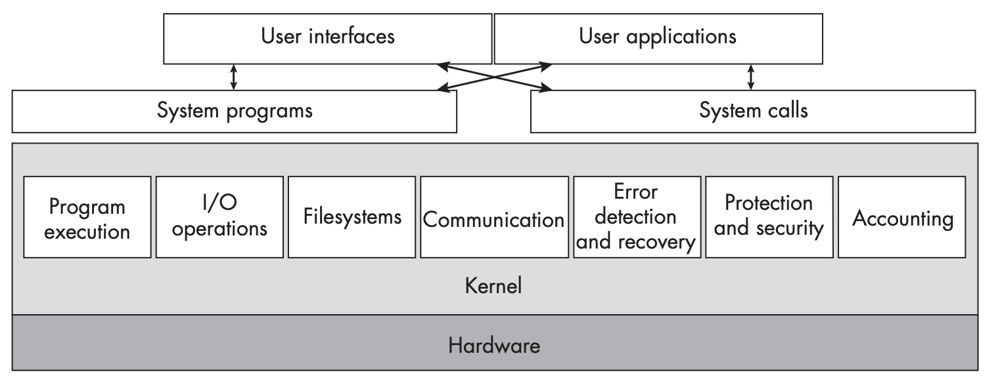
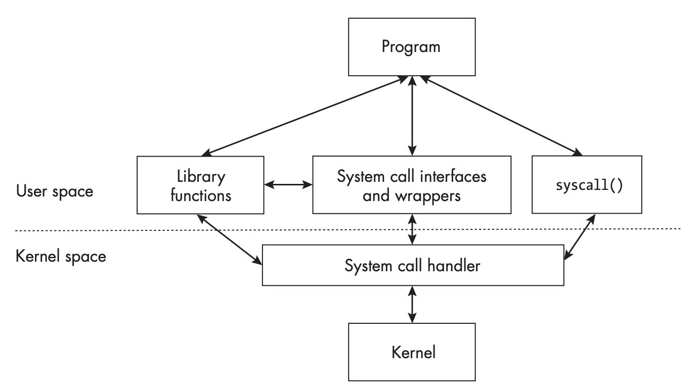

TODO

## 基础概念
### 内核
术语内核（`kernel`）指的是操作系统（`operating system`）的核心部分，常驻内存，负责控制所有的计算机资源，仅提供最基本的必要的功能。

当系统启动的时候，固件和软件写作将内核加载到系统空间（`system space`）中，也称为内核空间（`kernel space`）。内核会常驻内存直到关机。

内核能够完全访问系统的所有资源，包括内存、处理器、外设等等。内核会管理和保护这些资源，使得用户高效的使用这些资源。用户和程序无法直接访问这些资源，必须通过内核提供的接口来访问这些资源。内核还会将用户隔离开，保护彼此不收其他用户的干扰。

为了达到这些目标，内核遵循如下设计原则：

* 系统指定了两种特权级别（用户特权和内核特权），特定的指令只能在内核特权级别下执行。
* 每一个用户有唯一的标识符（身份）。
* 文件系统支持增删改查，同时也支持隐私保护、安全保障以及共享能力。
* 物理内存分成了两个部分：用户空间（`user space`）和内核空间（`kernel space`）。
* 内核对处理器有完全的控制权，能够决定接下来哪个程序使用。
* 内核有绝对的控制能力来加载程序到内存，运行并终止。正在运行的程序也不能终止自己。
* 内核完全独占的控制所有计算机硬件。

内核提供如下服务：

* 进程的调度和管理（`process scheduling and management`）
* I/O 处理（`I/O handling`）
* 物理和虚拟内存管理（`physical and virtual memory management`）
* 设备管理（`device management`）
* 文件系统管理（`file system management`）
* 信号和进程间通信（`signaling and interprocess communication`）
* 多线程（`multithreading`）
* 保护和安全（`protection and security`）
* 网络服务（`networking services`）

下图描述了用户及其程序与内核交互的关系：



### Shell 与命令
用户往往通过命令与系统交互，比如下面是编译命令
```bash
gcc -g -o hello hello.c
```
`gcc` 是要执行的命令（程序），这里是调用编译器，`-g` 是一个选项（`option`），告诉编译器生成调试信息，`-o hello` 是另一个选项，告诉编译器生成的可执行文件叫 `hello`，最后的 `hello.c` 是参数（`argument`），告诉编译器要编译哪个源文件。其中 `-o hello` 这个选项是带有参数的。

一般有两类命令选项，一种是 `-` 后接一个字母的选项，另一种是 `--` 后接一个单词的选项，例如 `--help`。

Shell 是 Unix 下的术语，指的是一个命令行解释器（`command line interpreter`）。除了交互之外，Shell 还支持脚本编程（`scripting`），支持定义变量、表达式求值、循环、分支等等。用户可以将一系列命令写成一个脚本文件，然后执行这个文件。大部分的 shell 将常用命令实现为 shell 的一部分，称为内置命令（`builtin`），比如 `cd` `export` 命令。

### 用户和用户组
用户（`user`）可以运行程序、访问文件，前提是得到了授权（`authorization`）。每一个用户有一个唯一的用户名和唯一的非负整数的用户 ID（`user ID`, `UID`）。身份标识中重要的是 UID 而不是用户名。

用户组（`group`）是用户的集合，每一个用户组有一个唯一的组名和唯一的非负整数的组 ID（`group ID`, `GID`）。用户可以属于多个用户组，但是必须术语一个主用户组（`primary group`）。用户组的概念使得授权变得更简单，因为授权可以针对用户组而不是单个用户。

可以同命令 `id` 来查看当前用户的 UID 和 GID，`id` 支持参数，可以查询指定用户的 UID 和 GID。`groups` 命令可以查看当前用户所属的用户组，`groups` 也支持参数，可以查询指定用户所属的用户组。

超级用户（`superuser`）是一个特殊的用户，拥有系统的完全访问权限，UID 为 0。超级用户可以执行任何命令，访问任何文件，修改系统的任何设置。一般情况下用户名是 `root`，但是也可以是其他名字。

### 特权指令和非特权指令
为了防止用户直接访问硬件导致系统状态被破坏，Unix 要求处理器至少支持两种模式：特权模式（`privileged mode`）和非特权模式（`unprivileged mode`）。特权模式也叫内核模式（`kernel mode`），非特权模式也叫用户模式（`user mode`）。直接或间接改变系统资源的指令都是特权指令（`privileged instruction`），比如分配内存、修改系统时间、提升进程优先级、访问 I/O 设备等等。特权指令只能由内核执行。操作系统的安全性、稳定性、可靠性等都依赖这一点。

### 环境
Unix 在运行程序之前会准备一个环境列表（`environment list`），简称为环境（`environment`）。环境是一个字符串列表，每个字符串都是一个 `name=value` 的形式，其中 `name` 是环境变量的名字，称为环境变量（`environment variable`），`value` 是环境变量的值。`name=value` 称为环境字符串（`environment string`）。为了兼容性，环境变量的名字只能包含字母、数字和下划线，并且必须以字母或下划线开头。比如 `COLUMNS=80` 就是一个环境字符串，虽然值 80 是整数，但是存储在环境列表中的时候是字符串。

环境变量会影响程序的行为。当登录 Unix 的时候，从各个文件中读取各种配置项来设置环境变量。当运行一个程序的时候，会继承父进程的环境变量。程序能够利用环境变了来改变自己的行为。

使用 `printenv` 命令可以查看当前环境变量，`printenv` 也支持参数，可以查看指定环境变量的值。调用 `getenv` 函数可以在程序中获取环境变量的值，比如 `getenv("SHELL")` 可以获取环境变量 `SHELL` 的值。

### 文件和目录
文件是最简单的存放数据的对象，通常存放在非易失存储（`non-volatile storage`）中。这些设备也称为次级存储（`secondary storage`）或外部存储（`external storage`），尽管他们在计算机之内。

Unix 文件是一系列字节，称为普通文件（`plain file`）或常规文件（`regular file`），其中有一些里面是文本数据，称为文本文件（`text file`），有一些里面是二进制数据，称为二进制文件（`binary file`）。

除了普通文件之外，Unix 还定义了以下几种文件：

* 目录（`directory`）
* 设备文件（`device file`）
* 管道（`pipe`）
* 套接字（`socket`）
* 符号链接（`symbolic link`）

不管是什么类型的文件，都包含属性（`attribute`），比如文件类型、权限、所有者、大小、创建时间、修改时间等等。描述文件访问限制的属性称为文件模式（`file mode`）或文件的权限（`permission`）。文件的属性统称为文件状态（`file status`）。另一个描述文件属性的名字是元数据（`metadata`）。内容（`content`）是文件的数据，他不包含任何状态信息，没有表示文件结束的特殊标记，也没有任何表示长度的手段。文件内容和状态信息不存在一起，前者存在存储设备的多个块中，后者存放在称为索引节点（`inode`）的数据结构中。

文件名并不是文件的属性，非目录文件可以拥有多个名字，这些名字是包含这些名称的目录的属性。

目录（`directory`）是一个特殊的文件，有的系统称为文件夹（`folder`）。目录包含“目录项（`directory entry`）”列表，这些目录项正式名字是链接（`link`），每个链接包含一个文件名和一个指向文件 `inode` 的引用（本质是一个整数）。链接可以指向任意类型的文件，包括目录。目录永远不会为空，因为至少包含链接 `.` 和 `..`，其中 `.` 是指向目录本身的链接，`..` 是指向父目录的链接。

当在 shell 中工作时，当前工作目录（`current working directory`）是一个重要的概念。当前工作目录是一个目录，shell 中的命令会相对于这个目录来执行。`cd` 命令可以改变当前目录，如果没有给参数，回到环境变量 `HOME` 指定的目录。`ls` 命令可以列出给定目录中的文件，如果没有给参数，列出当前目录中的文件。

文件名（`filename`）是一个字符串，表示文件的名字，是目录项的一部分。一个非目录文件可以包含在几个目录中，这些目录项的文件名可以不同。文件名可以很长，最长可以达到 255 个字符。文件名可以包含除了 `/` 和 `\0` 的任何字符，不过通常不建议使用特殊字符，比如空格、换行符使用的时候需要引号，`$` `*` 等特殊字符需要转义，因此建议只使用字母、数字、下划线和连词符（`-`）。Unix 文件名区分大小写，`file` 和 `File` 是两个不同的文件名。

目录结构（`directory hierarchy`）是一个类似树形的结构。文件系统（`file system`）一般指的是写入非结构化磁盘设备上的数据结构，用以实现文件和目录的创建和管理。类似树形的结构中有向边（`directed edge`）是由非空目录指向包含的文件或目录的链接，目录中的文件称为子节点（`child node`），目录是这些子节点的父节点（`parent`）。树的根节点（`root node`）是一个特殊的目录，称为根目录（`root directory`），用 `/` 来表示。

一个文件能有多个名字，因此有多个父节点，所以这里是类似树形的结构而不是真正的树形结构。目录结构是有向无环图（`directed acyclic graph`），因为目录不能有多个名字，那么只有唯一的父节点，不会有子节点指向自己，因此没有环。

Unix 只有一个目录结构，所有的文件和目录都包含在这个目录结构中，不同设备都可以挂载（`mount`）到这个目录结构的不同位置上。在根目录下的第一级目录叫做顶级目录（`top-level directory`），下面是常见系统的顶级目录。POSIX.1-2024 仅规定了 `/dev`、`/tmp` 是必须的。

* `/bin`：存放基本的二进制可执行文件。
* `/boot`：存放启动相关的静态文件。
* `/dev`：存放设备文件。
* `/etc`：存放系统配置文件。
* `/home`：存放用户的主目录。
* `/lib`：存放基本的共享库和内核模块。
* `/media`：存放可移动媒体设备的挂载点。
* `/mnt`：存放临时挂载的文件系统。
* `/opt`：存放可选的应用程序。
* `/sbin`: 存放基本系统二进制文件。
* `/srv`：存放服务数据。
* `/tmp`：存放临时文件。
* `/usr`：存放用户程序和数据。但是现在也用来存放非本质性的二进制、类库和源代码等。
* `/var`：存放经常变化的文件。

包括目录在内的所有文件都有两个独立的二元属性：共享性（`shareability`）和可变性（`variability`）。可共享文件存储在一台主机上可以给其他主机使用，不可共享就不具备这个特性。比如 `home` 的就可以共享而引导程序就不能共享，因为后者和机器相关。可变文件（`variable file`）的内容会经常变化，静态文件（`static file`）的内容不会经常变化，甚至永远不变。比如日志文件就是可变文件，而二进制可执行文件就是静态文件，基本不变。

文件的共享性和可变性决定了出路目录结构中的哪个位置，不同属性的文件在不同的目录，简化了存储、备份等工作。比如 `/etc` 是配置文件，不共享，静态文件（仅在更新软件、用户决定修改时才会变化），`/var` 是可变的，不过一般 `/var/mail` 是共享的，`/var/log` 是不共享的，`/usr` 是共享的静态文件。

符号链接（`symbolic link`）是一个特殊的文件，包含一个文本字符串，这个字符串是另一个文件的路径。符号链接也叫软链接（`soft link`），与之相对的是硬链接（`hard link`），即普通链接。当命令、程序和内核需要文件名的时候，可以传入一个符号链接，其 `inode` 会表示出这是一个符号链接，然后使用其指向的文件。这个过程称为解引用（`dereferenced`）。符号链接可能会形成环，因此解引用符号链接可能会导致死循环。

路径名（`pathname`）是一个用于标识文件的字符串。以 `/` 开头的路径名称为绝对路径（`absolute pathname`），目录以 `/` 分隔，最后一个子字符串可以是文件名、符号链接或目录，其他的子字符串必须是目录。如果出现多个 `/` 会被忽略。不以 `/` 开头的路径名称为相对路径（`relative pathname`），相对于当前工作目录来解析。`pwd` 命令可以查看当前工作目录的绝对路径，环境变量 `PWD` 也保存了当前工作目录的绝对路径。

### 进程
程序员编写的称为源代码（`source code`），比如使用 C/C++ 写的代码，然后编译成二进制可执行文件（`binary executable`）。

运行一个程序也是一个复杂的过程。大多数程序的”可执行形式“并不是直接运行的东西。因为这个文件通常是可执行代码、各种数据和表格以及给链接器/加载器（`linker/loader`）使用的其他信息的集合。当执行命令 `./hello` 的时候，链接器/加载器会使用可执行文件中的信息，将这个文件和所需要的共享对象（`shared object`）加载到内存中，为程序运行做好准备。这个过程称为加载（`loading`）。加载完成之后，程序就可以运行了。

我们需要区分程序（`program`）和进程（`process`）。进程是正在运行的程序的实例，每一个实例都是一个进程。一个程序可以有多个进程在运行。进程运行的时候需要使用计算机的资源，比如内存、磁盘等等，内核需要管理这些信息。Unix 系统会给每个进程分配一个非负整数的进程 ID（`process identifier`, `PID`）。通过 `ps` 命令可以查看当前系统中正在运行的进程以及它们的 PID。`getpid()` 函数可以在程序中获取当前进程的 PID。

### 线程
控制线程（`control thread`）是在程序执行时一次执行一条指令、依次衔接的单一指令序列。现在一个进程中可以有多个控制线程，简称为线程（`thread`）。这样的进程称为多线程进程（`multithreaded process`）。多线程进程有两类资源，一类是所有线程共享的资源，称为全局或共享（`global` 或 `shared`）资源，另一类是每个线程独享的资源，称为局部或私有（`local` 或 `private`）资源。

一般来说 Unix 支持多线程，Linux 支持不同类型的多线程。在 Linux 中，线程和进程都使用 `task_struct` 结构体来表示，都称为任务（`task`）。任务是分配系统资源和调度的实体。线程和普通进程的区别就是线程都共享资源，比如内存空间，而进程不共享这些资源。

许多 Unix 实现中，一个线程有进程内唯一的线程 ID（`thread identifier`, `TID`）。Linux 中如果只有一个线程，那么这个线程的 TID 就和 PID 相同，如果有多个线程，那么每个线程的 TID 都不同于 PID。`gettid()` 函数可以在程序中获取当前线程的 TID。

## 目标文件库
大部分程序都会调用其他程序提供的函数来完成一些功能，这些类库已经安装到了系统中。为了不重复代码，也会实现一些功能，编译成目标文件，其他程序链接使用即可。目标文件库（`object library`）也称为软件库（`software library`），是将多个编译后的目标代码打包到一起的文件，方便其他程序使用。

### 系统类库
系统类库（`system library`）是由操作系统提供的类库，包含了操作系统提供的各种功能的接口。系统调用往往非常简单，因为 Unix 系统的内核设计初衷就是要保持简单，同时这些都是非常底层的原语（`primitive`）。内核也不会提供功能相似的函数。

为了弥补这种简单性，Unix 提供了一些高级别的接口，提供了更丰富的原语集。许多库函数最终会向内核发起系统调用，但是有一些函数不会，这些函数不需要内核服务。这些函数完全是在用户空间（`user space`）中运行的。

Unix 还包含了各种用于专门任务的类库，比如异步 I/O（`asynchronous I/O`）、共享内存、登录和注销管理等等。

### 静态库和共享库
静态库（`static library`），全称是静态链接库（`statically linked library`），静态链接到使用它的程序中，生成一个独立的可执行文件。链接器会复制被使用的库函数到可执行文件中，需要解析所有未解析的符号表。静态库以 `.a` 结尾，是 archive 的缩写。使用的主要原因是自包含的可执行文件，目标机器无需安装库文件就可以运行这个程序。`ld` 是 Linux 上的静态链接器。

共享库（`shared library`），全称是动态链接库（`dynamically linked library`），在程序运行的时候才链接到程序中。因此也称为动态库（`dynamic library`）。共享库以 `.so` 结尾，是 shared object 的缩写。链接器会插入记录，表示这些符号在执行过程中首次被访问再解析。动态链接器会检查是否已经加载到了内存，如果没有加载阿斗内存中。随着程序的执行，每次遇到一个新的符号，动态链接器动态链接。程序运行可能会慢一点点，需要解析未解析的符号，加载然后链接。Linux 上有两个动态链接器，`ld.so` 和 `ld-linux.so`，前者负载加载 `a.out` 旧格式的可执行文件，后者负责加载 ELF（`Executable and Linkable Format`）格式的可执行文件。ELF 是可执行文件、目标文件和类库的标准格式。

共享库的好处有很多。首先二进制体积更小，占用磁盘更少，加载到内存中的时候占用内存更少。其次共享库可以被多个程序共享，节省内存和磁盘空间。共享库更新无需重新编译和链接程序。还有一个安全好处，为了方式共计，可重定位段（`relocatable segment`）会放到随机的地址上，而静态链接的代码地址是固定的。

### 查看库文件
有很多已有命令可以查看库文件的内容。最简单的方法是使用 `ar` 命令来查看静态库文件，`ar t libhello.a` 可以查看 `libhello.a` 中包含的目标文件。`objdump` 也可以查看静态库文件，`-a` 选项输出索引信息，`-t` 选项输出符号表。`nm` 命令 `-D` 选择可以看动态链接库的信息。`readelf` 不仅可以看目标文件，还可以看任意 ELF 文件的信息，`-s` 选项可以查看符号表。`ldd` 命令可以查看一个可执行文件依赖的共享库。`hexdump` `od` `xxd` 等命令可以查看二进制文件的十六进制内容，很多时候也非常有用。

在系统编程这个课程中，C 标准库是重要的类库，使用 `/lib/x86_64-linux-gnu/libc.so.6` 可以查看其相关信息。`<gnu/libc-version.h>` 头文件中定义了 `gnu_get_libc_version()` 函数，可以在程序中获取 C 标准库的版本信息。

## 系统调用
普通函数调用是指从跳转到程序内部链接的某个函数的代码中执行，然后返回。系统调用类似，不过后者所指的函数是 Unix 内核的一部分。系统函数在 `man` 手册中有详细的说明，在第二节，普通类库函数在第三节。系统调用执行的是内核代码，会访问硬件资源、执行特权指令，因此必须执行在特权模式（`privileged mode`）下，也称为内核模式（`kernel mode`）。系统调用会导致处理器执行模式发生改变，系统通常通过陷阱指令（`trap instruction`）来实现这个模式切换。

`syscalls` 的 `man` 手册中列出了系统支持的系统调用。每个系统调用关联一个数字，这个数字用于索引，指向内核的一张地址表，控制权随后会转移到这个地址。这些数字因系统而已，不过都对应一个宏定义。比如 `getpid` 系统调用的宏是 `SYS_getpid` `__NR_getpid`。

系统调用的参数数量不同，这决定了将参数传给内核的方法。寄存器法（`register method`）是将参数按照顺序放入指定的寄存器，当参数个数超过可以用的寄存器数量时，改用块方法（`block method`），将参数放入连续的内存中，然后将块的内存地址通过寄存器传到内核中。新版的 Linux 不允许系统调研参数超过 6 个。

进程通常不会直接调用系统调用，而是通过包装函数（`wrapper function`）来调用系统调用。包装函数是一个普通的函数，打包参数，调用系统调用，然后返回结果。包装函数的名字和系统调用的名字通常是一样的。GNU C 库（`glibc`）提供了近乎所有系统调用的包装函数，通常这层封装非常薄。

系统调佣的流程通常是用户程序调用包装函数，这和调用普通函数一样，包装函数会将参数传递给系统调用，包装函数执行陷阱指令，内核接管控制权。内核系统调用处理程序会根据系统调用的编号找到对应的系统调用处理函数，执行系统调用处理函数，然后将结果返回给处理程序，处理程序将结果返回给包装函数，包装函数将结果返回给用户程序。

如果没有包装函数，用户程序需要自己准备参数，调用系统调用，然后处理返回结果。一个简单的例子是 `getpid` 系统调用，这个函数没有参数，因此用户程序可以直接调用 `syscall(SYS_getpid)` 来获取当前进程的 PID。

程序会间接或者直接使用系统调用，如下图所示。



## 处理系统调用和类库的错误
当系统调用遇到错误时，会返回一个负数的错误码（`error code`），其绝对值有一定的含义。包装函数往往会返回 -1 表示错误，然后将负数错误码的绝对值写入 `errno` 变量中。`errno` 是一个全局变量，包含了最近一次系统调用或类库函数调用的错误码。

`errno -l` 可以列出所有的错误码和对应的错误信息。`man` 手册的 `ERRORS` 部分会列出每个系统调用可能返回的错误码以及对应的错误信息。我们可以写一个 `switch(errno)` 来处理不同的错误码。如果想输出错误信息，可以使用 `perror` 函数或者 `strerror` 函数来输出错误信息，注意，后者不是线程安全的。下面是一个简单的示例。
```c
char name[4];
size_t len = 3; // purposely declare a too small buffer to cause an error

int return_value = gethostname(name, len);
if (return_value == -1)
{
    perror("gethostname");
    printf("gethostname failed: %s\n", strerror(errno));
}
else
{
    printf("The hostname is %s\n", name);
}
```
类库函数的错误返回方式有不同的形式。有的和系统函数的包装函数一致，错误返回 -1 并且将错误码写入 `errno` 变量中，有的不会返回 -1，而是返回一个特殊的值，比如 `NULL`，来表示错误，这时候也会将错误码写入 `errno` 变量中，有的不使用 `errno` 变量而是返回一些自定义的错误码，还有的 0 表示成功，整数表示错误码。因此在使用类库函数的时候需要查看文档来确定错误的返回方式。

## 处理命令行与环境变量
程序能够接收到 shell 调用时的参数，比如 `ls abc`，如果 `main` 函数定义是 `int main(int argc, char *argv[])`，那么 `argc` 就是参数的数量，`argv` 是一个字符串数组，包含了所有的参数，其中 `argv[0]` 是程序的名字，`argv[1]` 是第一个参数 `abc`。也就是说，`argc` 至少是 1，因为总是有一个参数，就是程序的名字。这样可以获取参数，校验参数个数或者形式是否符合要求，获取参数的值等等。

通过 `getenv` 函数可以获取环境变量的值，比如 `getenv("HOME")` 可以获取环境变量 `HOME` 的值。环境变量的值是一个字符串，如果环境变量不存在，`getenv` 会返回 `NULL`。

当程序启动的时候，可以访问外部定义的一个全局变量 `char** environ`，这个变量指向一个字符串数组，这些字符串就是环境变量的值，每个字符串都是一个 `name=value` 的形式。通过遍历这个数组就可以获取所有的环境变量。
```c
extern char **environ; /* defined outside of the program */

char **env = environ;
while (*env)
{
    printf("%s\n", *env);
    env++;
}
```

`main` 支持第三个三处，声明是 `int main(int argc, char *argv[], char *envp[])`，其中 `envp` 是一个字符串数组，和上面的 `environ` 是一样的，包含了环境变量的值。通过遍历 `envp` 数组也可以获取所有的环境变量。

### 命令行选项
命令行选项（`command line option`）是一个特殊的参数，通常以 `-` 或 `--` 开头，后面跟着一个字母或者单词。选项可以带参数，也可以不带参数。选项的解析比较麻烦，C 标准库提供了 `getopt` 函数来解析命令行选项。下面我们先看几个例子，解释命令行选项的一些规定，最后介绍 `getopt` 函数的使用方法。

POSIX.1-2024 规定了选项要在参数之前，不过一些命令并不一定遵循这一点。比如
```bash
gcc myprog.c -o myprog -Wall -I includedir
gcc -o myprog -Wall -I includedir myprog.c
```
若干个短的选项没有参数，可以结合在一起。
```bash
ssh -acCfGgKkMN
ssh -a -c -C -f -G -g -K -k -M -N
```
根据 POSIX.1-2024 的规定，准确的说一个或多个无参的选项和最多一个有参数的选项可以结合在一起，位于 `-` 之后。另外，选项的顺序不应该影响程序的行为，这一点有一个例外。如果必须有参数的重复选项，需要依次解析。比如 `make` 的 `-f` 参数，会依次读取这些文件，后面的会覆盖前面声明的变量，规则会累加并以最后一个为准，同时第一个读入的目标是默认目标。

GNU 对此的规定略有不同，首先支持长的选项，允许有可选参数（`optional argument`），参数可以出现在选项之前。

外部已经定义了下面这些变量，因此我们的程序中不应该再声明这些变量了。
```c
extern char *optarg;
extern int optind, opterr, optopt;
```

`getopt` 的函数签名是 `int getopt(int argc, char * const argv[], const char *optstring);`，前面两个参数和 `main` 函数的参数一样，第三个参数是一个字符串，包含了所有的选项字符，这个字符串按照如下规则解析：

- 单独的字母表示不带参数的选项，比如 `a` 表示 `-a` 是一个不带参数的选项。
- 字母后面跟着一个冒号 `:` 表示必须要有（`required`）参数的选项。如果参数存在 `getopt` 会将参数的值（准确地说是指向参数的指针）保存在 `optarg` 变量中，如果参数不存在，`getopt` 会返回 `?`。
- 字母后面跟着两个冒号 `::` 表示可选（`optional`）参数的选项。`getopt` 会将指向该参数的指针放入 `optarg` 变量中，如果参数不存在，`optarg` 会被设置为 0。
- 如果 `optget` 发现一个未定义的选项，会将字符放入 `optopt` 变量中，向 `stderr` 打印错误消息，并返回 `?`。可以通过将 `opterr` 变量设置为 0 来禁止错误消息的输出。如果必要的参数缺失，行为和这里一致。
- 起始字符串是一个冒号 `:` 表示当发现一个选项缺失必要参数的时候，`getopt` 会返回 `:`，而不是 `?`。这样就可以区分上述的两种情况，更好的处理错误。

举一个例子，`:hb::c:1` 表示 `-h` 是一个不带参数的选项，`-b` 是一个可选参数的选项，`-c` 是一个必须要有参数的选项，`-1` 是一个必须要有参数的选项。

`getopt` 首先将 `optind` 变量设置为 1，重复调用这个函数，每次返回一个命令行的选项，直到所有选项都被解析完了，`getopt` 返回 `-1`，同时将 `optind` 设置为第一个非选项参数的索引，也就是下一个需要处理的命令行字符串，理论上这个位置应该是第一个参数了。

下面是一个完整的例子。
```c
#include <stdio.h>
#include <unistd.h>
#include <string.h>

int main(int argc, char *argv[])
{
    char options[] = ":hb::c:1";
    int opt_h = 0;
    int opt_b = 0;
    int opt_c = 0;
    int opt_1 = 0;
    char b_arg[100] = "";
    char c_arg[100] = "";

    opterr = 0; // Suppress getopt error messages

    while (true)
    {
        int ch = getopt(argc, argv, options);
        if (ch == -1)
            break;

        switch (ch)
        {
        case 'h':
            opt_h = 1;
            break;
        case 'b':
            opt_b = 1;
            if (optarg) // optional argument
                strcpy(b_arg, optarg);
            break;
        case 'c':
            opt_c = 1;
            strcpy(c_arg, optarg); // required argument
            break;
        case '1':
            opt_1 = 1;
            break;
        case ':':
            printf("Option -%c requires an argument.\n", optopt);
            break;
        case '?':
            printf("Unknown option: -%c\n", optopt);
            break;
        default:
            printf("getopt returned character code 0%o\n", ch);
            break;
        }
    }

    if (opt_h)
        printf("Option -h is set.\n");
    if (opt_b)
    {
        printf("Option -b is set.\n");
        if (strlen(b_arg) > 0)
            printf("Argument for -b: %s\n", b_arg);
    }
    if (opt_c)
    {
        printf("Option -c is set.\n");
        printf("Argument for -c: %s\n", c_arg);
    }
    if (opt_1)
        printf("Option -1 is set.\n");

    if (optind < argc)
    {
        printf("Non-option arguments:\n");
        for (int i = optind; i < argc; i++)
            printf("%s\n", argv[i]);
    }

    return 0;
}
```
`getopt` 有一个问题，比如上面例子，如果调用程序是使用参数 `-c -b -h`，`getopt` 会将 `-b` 解析为 `-c` 的参数，而不是一个选项。

一般情况下，`-h` 表示是否打印帮助信息，因此一般第一个处理，遇到之后就不再解析后续的参数了。
```c
case 'h':
    print_help = 1;
    break;


if (print_help)
{
    print_help_message();
    return 0;
}
```

## 学习系统编程的方法
Bruce Molay 在他的《Understanding Unix/Linux Programming》中提出了学习系统编程的一种方法，下面是具体的步骤。

1. 选择一个和内核交互的命令或者程序
2. 读 `man` 手册，了解这个命令或者程序的功能和使用了哪些资源
3. 使用 `man` 手册或者在线文档，了解需要用到哪些系统调用和内核数据结构
4. 写一个类似的程序，使用同样的系统资源，可以增删改一些功能
5. 完成之后，评估我们与原程序的差异，找出可以改进的地方

这是一个很好的学习方式，后续的讨论中会参考这种模式。

