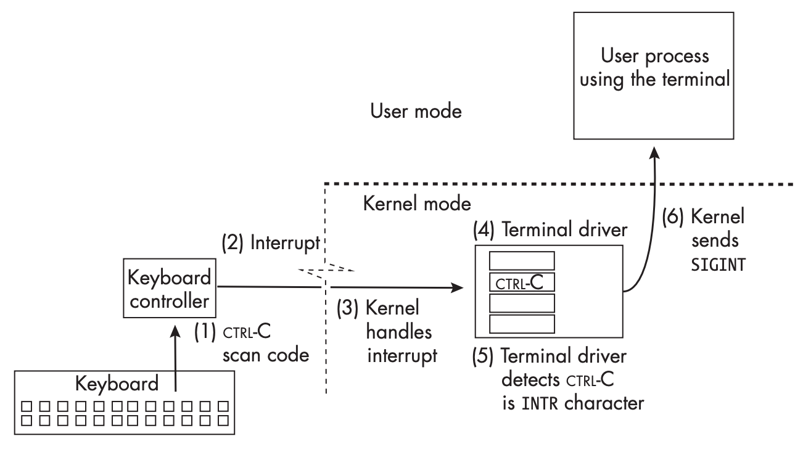

## 信号的作用
信号（`signal`）在 Unix 系统中是一种通知形式，用于向接受者告知某些重要的事件。在系统内部，信号本质上是软件中断，是发送给进程的空消息，中断其正常的指令周期。信号通常用于向进程报告异常情况，比如引用了无效内存地址（段错误）或终端断开了链接。许多信号和硬件中断类似，可以在任意时刻发生，且与进程在信号到达时所执行的指令无关。内核几乎是所有信号的来源。一个进程可以给另一个进程发送信号，或者向自身发送信号，这种情况下，信号会立即到达该进程。

发送信号的一个例子是在控制台按了 Ctrl+C，这些信号会在任意时刻发生，因此称为异步（`
asynchronous`）信号。与此相对的是同步（`synchronous`）信号，它们是由程序本身的行为引起的，比如除零。

在 Unix 系统中，信号用唯一的一个整数表示，也是一个符号名。以 `SIG` 开头，后面跟一个描述目的的缩写。比如 `SIGINT` 表示中断信号，通常是由于用户按下 Ctrl+C 产生的，`SIGWINCH` 表示当前终端窗口大小发生变化时产生的信号。大多数架构体系中，`SIGINT` 都是 2，不过这并没有标准，因此在不同的系统中可能会有不同的值。除此之外，信号没有其他信息，因此信号也被称为信号类型（`signal type`）。

下面是一个信号发送给某个进程的例子。

当我们在键盘输入的时候，键盘内部会缠身代表输入的扫描码（`scan code`），当按下 Ctrl+C 时，键盘会发送这个按键组合的扫描码到键盘控制器。控制器收到之后会产生一个硬件中断。每一次硬盘敲击都会有硬件中断，因此可以处理每一个字符。内核会确定哪个终端与之关联，将控制权转交给终端驱动。终端驱动内部有一个字符数组，表示各种特殊字符（`special character`），特殊字符会触发其他操作，比如退格（`backspace`）。终端驱动确定这个字符在 `VINTR` 位置上，要发送中断信号（`SIGINT`）。驱动检查是否设置了特殊的标记位（`isig`），如果设置了，调用内核的信号子系统通知其向所有改终端控制的进程发送 `SIGINT` 信号。内核把这个信号发送给所有的进程。如果进程没有特别处理，收到这个信号时会被终止。

信号的来源（`source`）是事件发生的组件，可以是软件也可以是硬件。不过只能由内核发送信号给进程，因此内核像是一个信号处理中心。

信号来源主要有以下几种：

* 用户：用户可以在任意时刻按键盘上的组合键来发送信号，比如 Ctrl+C、Ctrl+Z 等。用户可以可以执行 `kill` 命令来发送信号。这些信号可以发生在任意时刻，与进程运行到哪里无关，因此是异步信号。
* 内核：内核在 I/O 完成、定时器到期、网络断开等事件发生时会发送信号。内核会发送合适的信号来通知进程发生了什么事件。这些信号也是异步的。
* 硬件：一个进程可能会导致异常，比如浮点异常、非法指令、访问地址异常等等，这些大多数是有进程自身引起的，这些异常导致硬件陷阱，内核由于陷阱向进程发送信号。这些信号是同步的，因为如果再次运行程序，会在同样的地方再次发生异常。
* 其他进程：一个进程可以通过内核向另一个进程发送信号，前提是有这个权限。进程也可以向自身发送信号。

信号设计出来就是用于通知进程出现了某些事件，通常是错误和异常。

## 信号的概念
信号的生命周期从硬件或软件产生了事件或异常开始，到进程处理了这个信号为止。从内核的角度看，直到内核执行某个动作产生信号，信号才存在。产生信号的并不是事件本身，而是内核执行某个动作。Linux 内核检测到这些信息之后会修改目标进程的某些数据结构，这个一个信号队列，后续分析进程的时候会继续讨论。

如果发送信号的时候进程不在运行，那么进程并不会收到这个信号。在进程恢复运行且信号到达之前，该信号是挂起（`pending`）的状态。对每个进程而言，每种信号只能有一个挂起的实例，如果同一信号多次发送，那么只有第一次会被记录，后续的发送会被丢弃。进程可以通过设置信号掩码来屏蔽某些信号，在这种情况下，信号会被挂起，直到进程解除屏蔽。

当进程以下面某种形式对信号做出了响应，我们称信号已送达（`delivered`）：

* 进程显式的忽略了这个信号。
* 进程执行了信号处理函数。这种情况称之为信号被捕获（`caught`）了。
* 进程接受了该信号默认的行为，比如终止（`terminate`）、忽略（`ignore`）、停止（`stop`）（此时进程挂起，可以恢复运行）、继续（`continue`）、核心转储（`core dump`）等。

信号处理函数是特定形式的函数，注册（`register`）到内核中，当信号到达时会被调用。如果没有注册，也没有显式的告诉内核要忽略这个信号，那么内核会执行该信号的默认行为。
