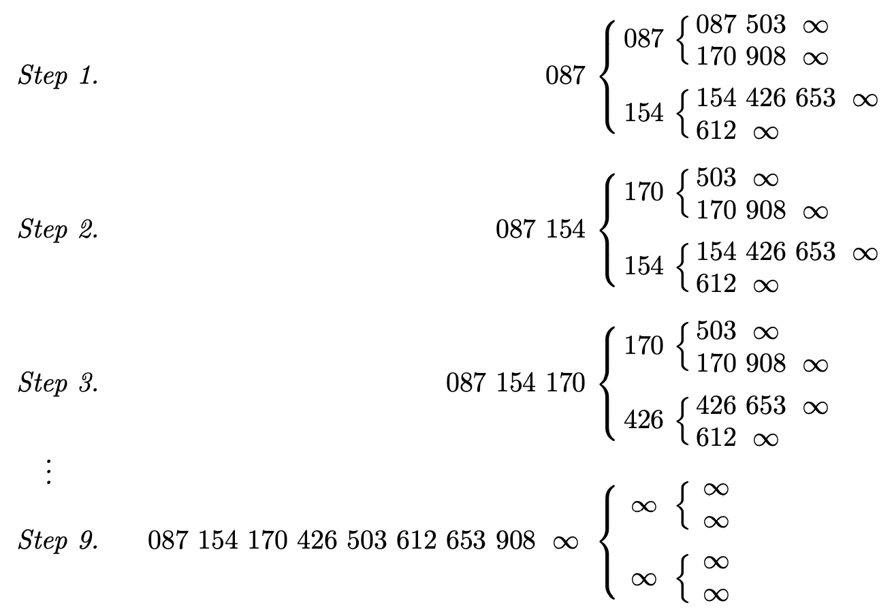
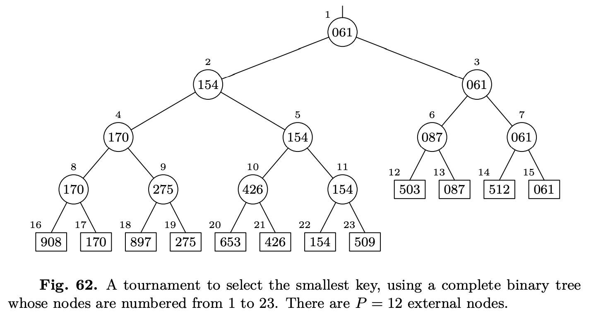
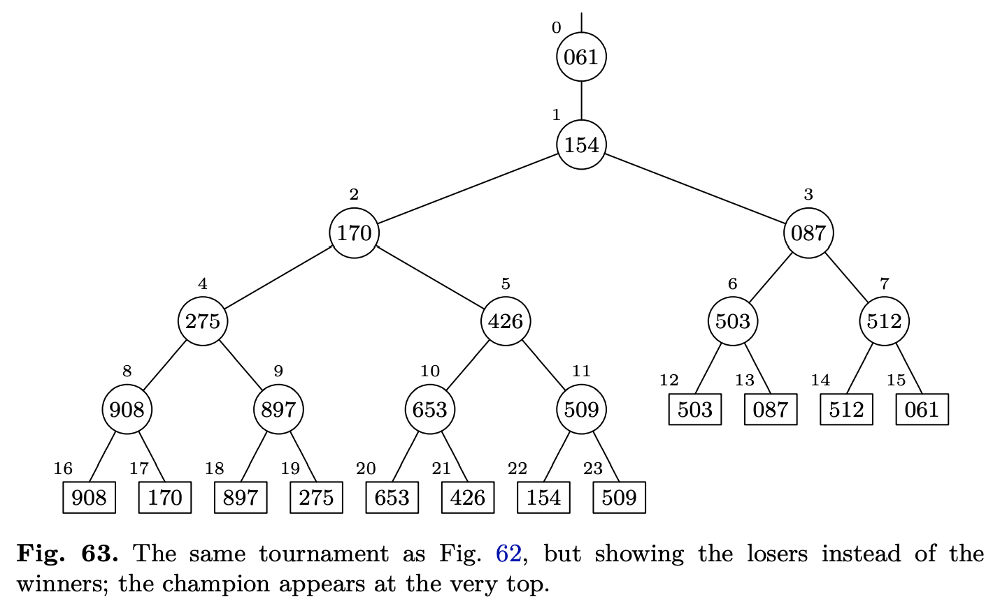
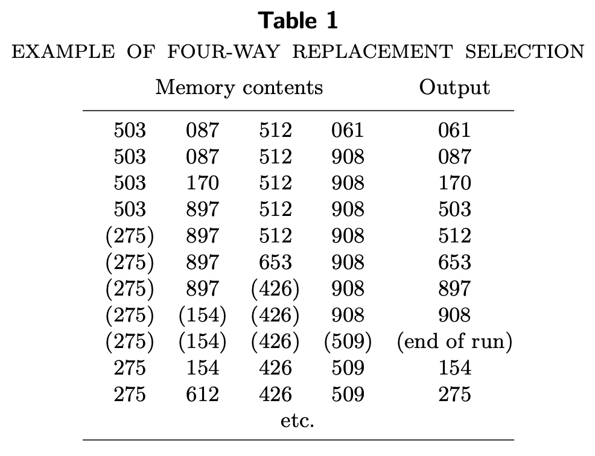
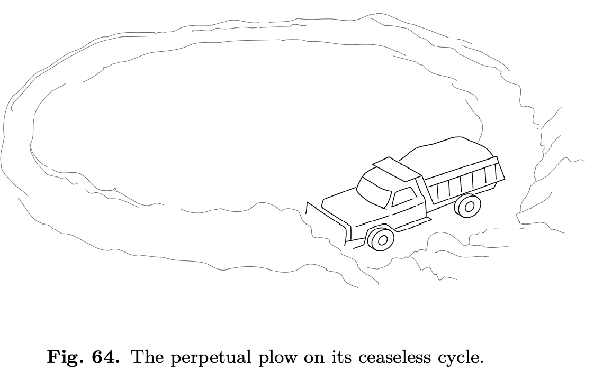
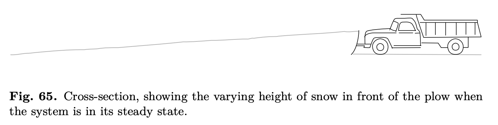
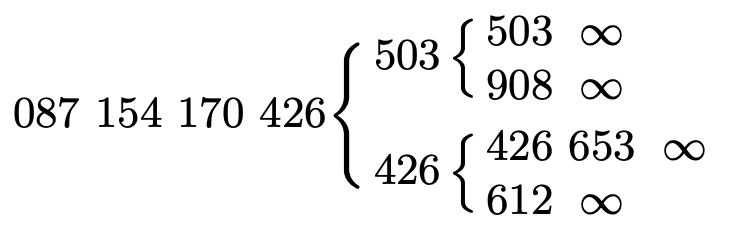

合并排序是把两路合并为基础的内排算法，很容易扩展到 $P$ 路，把 $P$ 个顺串合并成一个顺串。

假设给定了 $P$ 个顺串，非递减排序好了，合并成一个的方法很直接。考察每个顺串的第一个记录，选择最小的一个，从对应的顺串删除，然后重复这个过程。任意一轮，只需要考虑 $P$ 个记录，并选择最小的。如果有两个或多个最小值，任选一个就好。

如果 $P$ 不太大的时候，直接 $P-1$ 次比较就足够了。如果大于等于 8，可以选择 5.2.3 小节的选择树，可以提高很多。树一旦建立好了，每次只需要约 $\lg P$ 次比较。

下面是一个四路两层的选择树：

每个顺串最后有一个哨兵 $\infty$，这是一种常见且有用的分割顺串的方式，可以使合并优雅地结束。顺串往往很长，增加一个哨兵不会对性能有实质性的影响。

在上述的过程开始之后的每一步都把最小记录换成同一顺串后继的记录，并更新选择树中对应的路径。对应上面那个图，第二步把第一步三个 087 替换了，第三步把第二步三个 154 替换，以此类推。在选择树中用一个 `key` 替换另一个 `key` 的过程，成为替代选择（`replacement selection`）。

我们可以从不用的角度来看上面的四路合并。可以想成并行的执行了三个两路合并。选择树本质上是一个最小值先出的优先队列。

类似于 5.2.3 小节，可以用堆（最小堆）来替代选择树。堆没有固定大小，所以不需要哨兵，当为空的时候就是合并结束了。需要外部排序时，`key` 和整个记录往往比较大，所以堆里最好放指针而不是数据本身。下面会给出一个例子，选择树可以用一种方便的方式用指针表示，在这种情况下，可能比堆要好。

**败者树**（`A tree of losers`） 下图是有 12 个外部节点（矩形）和 11 个内部节点（圆形）的完全二叉树。外部节点是 `key`，内部节点是锦标赛中每次比较的胜者。每个节点的左上方的数字表示传统的为完全二叉树分配存储的位置。

当最小 `key` 061 被替换的时候，我们需要考虑 512，087 和 154。这些都是在锦标赛过程中输出 061 的 `key`。这给我们一个提示，如果记录比赛输了的 `key`，那么我们很容易就能找到更新树所需要的信息了。

下图和上面的图一样，除了最上面添加了整场锦标赛的胜者，其他内部节点是某次比赛的败者。由于每个 `key` 只败一次，加上最上面的胜者，内部节点和外部节点一样多，且都只出现一次。

外部节点很长，放在内存中，内部节点只放指向它们的指针就可以了。$P$ 路合并有 $P$ 个外部节点和 $P$ 个内部节点，各自都是连续存放的，这本身就是高效的存储方式。后续会详细讨论如何使用败者树进行替代选择。

**通过替代选择初始化顺串** 如果对数据本身进行 $P$ 路合并，替代选择算法可以用于外排的第一阶段。这时，$P$ 取得很大，使得内存基本被填满。当输出一条记录时，会被下一个输入替代。如果新的 `key` 小于刚才的输出，那么只能出现在下一个顺串了，否则可以继续通过选择树进入当前顺串。结果就是顺串可以包含多于 $P$ 条记录。下图是 $P=4$ 的过程，括号里面的是进下一个顺串的记录。

这个重要的初始化顺串的方法由 Harold H. Seward 提出的，并且给了一个理由让大家详细对于随机数据，顺串的长度是 $1.5P$。A. I. Dumey 有同样的发现，不过没有发表。E. H. Friend 提出了替代选择这个名词，同时根据实验数据指出期望长度应该是 $2P$。

E. F. Moore 给了一个很聪明的论证，证明期望长度确实是 $2P$。想象如下图一个扫雪车一直在环形运行。雪片均匀的落在环形的路上，扫雪车不停的清扫，清扫出路外，相当于从这个系统里面消失了。$x,0\leq x<1$ 表示落在哪里，相当于 `key`，扫雪车扫出去的雪就相当于输出。扫雪车运行速度反比于雪的高度，整个场景是会达到完美的动态平衡，那么路上的雪量相当于$P$。扫雪车每转一圈相当于产生一个顺串。

所谓的动态平衡是说系统运行一会之后，如下图所示，扫雪车前面的雪的厚度会保持不变，那么车速保持不变，可以想象随着雪不停的下，车不停的往前，三角形的上方在扫雪车扫到的时候，也会落一些雪（当前时刻看来，这些是未来的雪）使得高度保持一致。那么显然，扫雪车转一圈，扫出去的雪量是当前时刻道路上雪量的两倍。

很多商用应用中数据不是完全随机而是某种程度已经有序了，那么每个顺串可以包含更多的记录数（大于 $2P$）。外排的时间很大程度上取决于初始顺串的个数，替代选择能够产生更长的顺串，是非常可取的，由于内存限制，其他的内排算法将产生两倍甚至更多的顺串。

下面将详细阐述使用替代选择建立初始顺串的过程。算法是 John R. Walters, James
Painter, Martin Zalk 提出的。很精妙，试用简单一致的逻辑来建立选择树的初始状态、区分不同顺串的记录，以及清理最后一个顺串。基本思想是每个顺串标记成 $S$，然后把 $(S,K)$ 作为 `key`，$K$ 表示原来的 `key`。这样使用扩展的 `key`` 进行排序，输出序列。

算法使用了包含 $P$ 个节点的数据结构来表示选择树，第 $j,0\leq j<P$ 个节点 $X[j]$ 包含从 $L_0$ 开始第 $j$ 个记录（长度是 $c$），即 $\text{LOC}(X[j])=L_0+cj$，它同时表示内部的第 $j$ 个节点和外部第 $P+j$ 个节点（见图 63）。每个节点有以下字段：

KEY = 外部节点的 `key`

RECORD = 外部节点的记录（包含了 `key`）

LOSER = 指向该内部节点的败者的指针

RN = 存储在外部节点的记录的顺串号

PE = 指向外部节点的父节点的指针

PI = 指向内部节点的父节点的指针

比如图 63，$P=12$，内部节点 5 和外部节点 17 的信息都存储在 $X[5]$ 里面，KEY = 170，LOSER = $L_0+9c$（地址 21），PE = $L_0+8c$，PI = $L_0+2c$。

PE 和 PI 是固定的（对任意 $X[i]$ 而言），不必存储，需要的时候计算就可以了。不过通常建立初始选择树的时候计算跟不上 I/O 的速度，所以保存起来以免每次都要计算。

**算法R 替代选择（`Replacement selection`）** 该算法读入一个文件，输出一个文件，包含 RMAX 个顺串，除了最后一个顺串以外，其他顺串长度均大于等于 $P$。一共有 $P$ 个节点，$X[0],\cdots,X[P-1]$ 包含上述的字段。

**R1.** [Initialize.] 设置 $\text{RMAX} = 0, \text{RC} = 0, \text{LASTKEY} = \infty, \text{Q}=\text{LOC}(X[0])$。RC 表示当前处理第几个顺串，LASTKEY 表示最后一个输出的 `key`。习题 8 会解释为什么要设置成最大值。对于 $0\leq j<P$，设置 $X[j]$ 如下

$$
J=\text{LOC}(X[j])\\
\text{LOSER}(J)=J\\
\text{RN}(J)=0\\
\text{PE}(J)=\text{LOC}(X[\lfloor (P+j)/2 \rfloor])\\
\text{PI}(J)=\text{LOC}(X[\lfloor j/2 \rfloor])
$$
LOSER 和 RN 都是人为有意设置的值，虚构编号为零的顺串来完成初始化。这个顺串不会输出，小技巧，详见习题 10，不过这个题分值大于 20，一时不会去碰。

**R2.** [End of run?] 如果 RN(Q)=RC，跳到 R3。否则的话，RN(Q)=RC+1，刚完成 RC 顺串；如果对于排序后续扫描的合并模式而言需要特殊操作，这个时间点就会完成。如果 RC = RMAX，算法结束；否则 RC += 1。

**R3.** [Output top of tree.] 此时 Q 指向胜者，并且 RN(Q) = RC。如果 RC $\neq 0$（正如前所述，初始化结束后的顺串），输出 Q 指向的记录，并且让 LASTKEY = KEY(Q)。

**R4.** [Input new record.] 如果文件读取结束，RN(Q) = RMAX + 1，并跳到 R5。否则设置 RECORD(Q) 为读进来的新的值。如果 KEY(Q) < LASTKEY，也就是说新记录不属于这一个顺串，RMAX = RN(Q) = RC + 1。

**R5.** [Prepare to update.] 现在 Q 指向新的记录，T = PE(Q)。T 指向的记录会沿着树向上移动。

**R6.** [Set new loser.] 先设置 L = LOSER(T) 保存败者。如果 RN(L) < RN(Q) 或者 RN(L) = RN(Q) 且 KEY(L) = KEY(Q)，那么 LOSER(T) = Q，Q = L。

**R7.** [Move up.] 如果 T = LOC(X[1])，那么跳到 R2；否则设置 T = PI(T)，然后跳到 R6。

算法 R 是一个记录一个记录的读入，I/O 友好的话可以一批读入处理，内存中缓存了一批输入和一批输出，这相当于减少了 $P$ 的大小。5.4.6 节会讨论。

TODO

Delayed reconstitution of runs.

Natural selection.

Analysis of replacement selection.

带星号，回头再看。

### 习题

习题 1 170 胜出，908 前进一个位置，503 和 908 比较，503 胜出，所以上半区 503 胜出，下半区不变 426 胜出。426 和 503 比较，426 胜出，放在第三步 170 在的位置。如下图所示：

习题 2 自底向上看，15 号外部节点替换成 612，那么 7 号内部节点的败者就是 612，3 号内部节点的败者是 512，1 号内部节点的败者是 154，最后胜出的 0 号节点是 87。

习题 5 显然是错的，比如书中的例子就是 $P=12$。

习题 6 两者的区别就是处理特殊情况 $P=1$。X[1] 越界，所以 R7 的判断标准需要修改成 T = LOC(X[0])，其他都不需要变。

习题 7 RMAX 一直都是 0。$P$ 个节点的 RN 都被更新成 1 之后，RN(Q) != RC 了，但是 RC 和 RMAX 都是 0，相等，整个算法结束。输出也是空。

习题 8 在实现这个算法的时候，用于用到了泛型，无法确定具体类型，也就无法构造$\infty$。替代实现是使用额外的 `bool` 变量表示当前的值是否是被设置过了，如果没有，表示当前存的是最大值。（TODO：引用实现的 github 路径）

习题 13 第二轮（留在内存中的数）比平均值要小一些，因为通常来说，第一轮的值初始都非常随机的，接近平均值，只有比平均值大的才在第一轮输出了。而后续轮次（除了最后一轮）包含这些较小的值，所以长一点。

习题 15 错的。一个反例是还有一个值没有读取，它比 $P$ 个在内存中的值都大，这样的话这 $P+1$ 个属于一个顺串。极端一些，所有输入是有序的，那么就是属于一个顺串。

习题 17 每个顺串都只有 $P$ 个，因为每轮第 $P+1$ 个都比当前轮所有元素小，没办法在当前轮输出，共有 $\lceil N/P\rceil$ 个顺串。这就是这个算法最差的情况。
