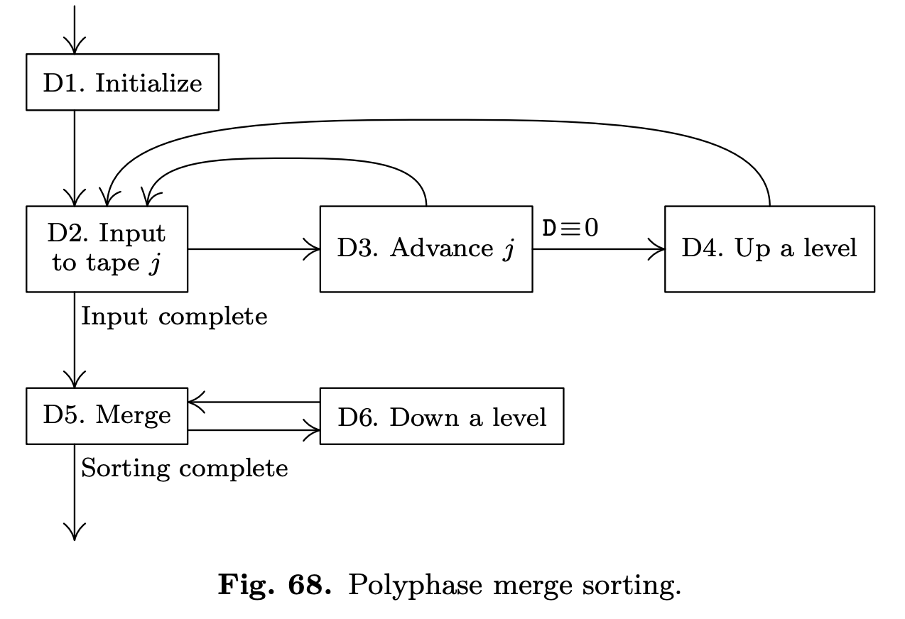
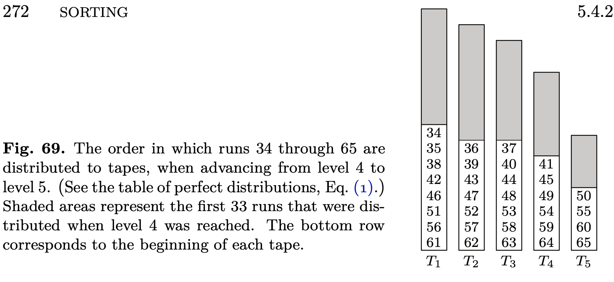
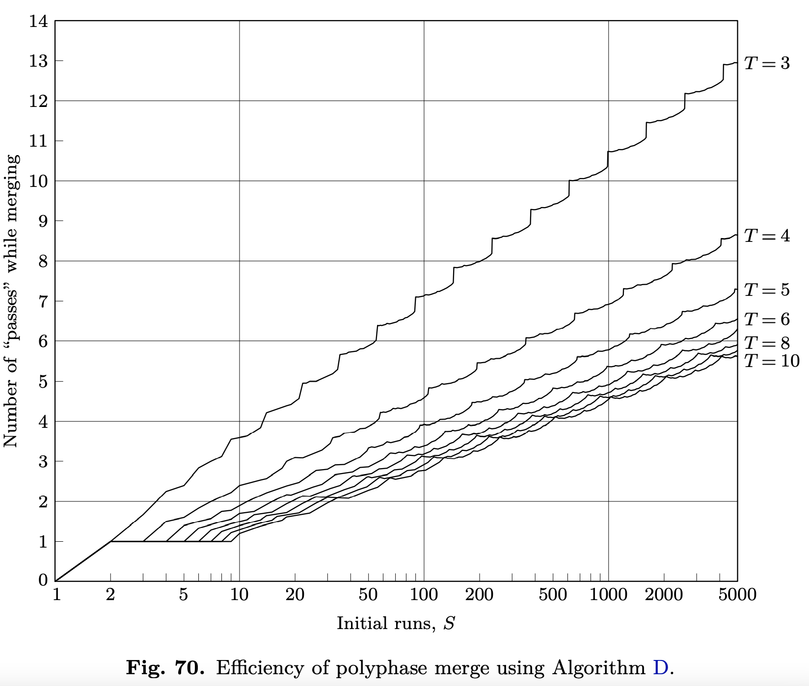

我们已经知道了如何构建初始顺串，现在考虑各种合并模式，合并就是把顺串分布到各个磁带上，合并直至只剩一个顺串为止。

假定有三个磁带 $T_1,T_2,T_3$，考虑 5.4 里面描述的平衡合并，$P=2,T=3$，形式如下：
* B1. 交替的在 $T_1,T_2$ 上分布顺串
* B2. 把 $T_1,T_2$ 上的顺串合并到 $T_3$，如果 $T_3$ 仅包含一个顺串时停止
* B3. 把 $T_3$ 的顺串交替的拷贝回 $T_1,T_2$，跳到 B2

如果初始时有 $S$ 个顺串，第一次合并将在 $T_3$ 上产生 $\lceil S/2 \rceil$ 个顺串，第二次产生 $\lceil S/4 \rceil$，以此类推。如果说 $17\leq S\leq 32$，一次分配扫描，五次合并扫描，四次拷贝扫描。一般地，$S>1$，扫描次数是 $2\lceil \lg S\rceil$。

拷贝扫描完全是不必要的，因为并没有减少顺串。如果采用两阶段方式，可以减少一半的拷贝。
* A1. 交替的在 $T_1,T_2$ 上分布顺串
* A2. 把 $T_1,T_2$ 上的顺串合并到 $T_3$，如果 $T_3$ 仅包含一个顺串时停止
* A3. 把 $T_3$ 上一半的顺串拷贝到 $T_1$ 上
* A4. 把 $T_1,T_3$ 上的顺串合并到 $T_2$，如果 $T_2$ 仅包含一个顺串时停止
* A5. 把 $T_2$ 上一半的顺串拷贝到 $T_1$，跳回 A2

对数据扫描次数减少到了 $\frac{3}{2}\lceil \lg S \rceil+\frac{1}{2}$，因为 A3 和 A5 只拷贝了一半的数据，节省了大约 25% 的时间。

$T_1$ 上有 $F_n$ 个顺串，$T_2$ 上有 $F_{n-1}$ 个顺串，其中 $F_n,F_{n-1}$ 是连续的斐波那契数，那么可以完全消除不必要的拷贝。比如下面是 $n=7,S=F_n+F_{n-1}=13+8=21$ 的情况：

| Phase | Contents of T1 | Contents of T2 | Contents of T3 | Remarks |
|--|--|--|--|--|
| 1 | 1,1,1,1,1,1,1,1,1,1,1,1,1 | 1,1,1,1,1,1,1,1 | | Initial distribution |
| 2 | 1,1,1,1,1 | - | 2,2,2,2,2,2,2,2 | Merge 8 runs to T3 |
| 3 | - | 3,3,3,3,3 | 2,2,2 | Merge 5 runs to T2 |
| 4 | 5,5,5 | 3,3 | - | Merge 3 runs to T1 |
| 5 | 5 | - | 8,8 | Merge 2 runs to T3 |
| 6 | - | 13 | 8 | Merge 1 run to T2 |
| 7 | 21 | - | - | Merge 1 run to T1 |

每个初始顺串长度为 1，2 表示长度为 2 的顺串，以此类推。上表中到处都是斐波那契数。

只有第一阶段和第七阶段对数据进行了完全扫描，第二阶段处理了 16/21，第三阶段仅仅处理了 15/21。如果假设初始顺串都差不多长，那么总共处理的数据量是 $(21 + 16 + 15 + 15 + 16 + 13 + 21)/21 =5\frac{4}{7}$，同样的数据两阶段需要 8 次扫描。一般地，满足这种斐波那契分布的模式，需要  $1.04\lg S+0.99$次扫描，和 4个磁带的平衡合并一样快，但是只用了 3 个磁带。

同样的思想可以推广到 $T$ 个磁带。对于 $T\geq 3$，使用 $T-1$ 路合并。后面会看到对于 4 个磁带的情况下，数据扫描次数是 $0.703\lg S+0.96$。推广形式涉及到了广义的斐波那契数列。先考虑 $T=6$ 的情况。

| Phase | T1 | T2 | T3 | T4 | T5 | T6 | Initial runs processed |
|--|--|--|--|--|--|--|--|
| 1 | $1^{31}$ | $1^{30}$ | $1^{28}$ | $1^{24}$ | $1^{16}$ | - | 31 + 30 + 28 + 24 + 16 = 129 |
| 2 | $1^{15}$ | $1^{14}$ | $1^{12}$ | $1^8$ | - | $5^{16}$ | 16 × 5 = 80 |
| 3 | $1^7$ | $1^6$ | $1^4$ | - | $9^8$ | $5^8$ |8 × 9 = 72 |
| 4 | $1^3$ | $1^2$ | - | $17^4$ | $9^4$ | $5^4$ | 4 × 17 = 68 |
| 5 | $1^1$ | - | $33^2$ | $17^2$ | $9^2$ | $5^2$ | 2 × 33 = 66 |
| 6 | - | $65^1$ | $33^1$ | $17^1$ | $9^1$ | $5^1$ | 1 × 65 = 65 |
| 7 | $129^1$ | - | - | - | - | - | 1 × 129 = 129 |

这里 $1^{31}$ 表示 31 个长度为 1 的顺串，$9^8$ 表示 8 个长度为 9 的顺串，等等。R. L. Gilstad 提出这种模式，称为多阶段合并（`polyphase merge`）。三个磁带的情况更早的时候由 B. K. Betz 提出的。

为了像上面的例子这样分配合并，我们需要完美的斐波那契分布。$T=6$ 时，自底向上看分布分别是 $\{1,0,0,0,0\}, \{1,1,1,1,1\}, \{2,2,2,2,1\}, \{4,4,4,3,2\}, \{8,8,7,6,4\}, \{16,15,14,12,8\}, \{31,30,28,24,16\}$。现在我们面临以下四个问题：
1. 这些完全斐波那契数基于什么规则分布的？
2. 如果 $S$ 不能对应完全斐波那契分布怎么办？
3. 我们应该如何设计初始分布使得它们在磁带上是期望的分布情况？
4. $T$ 个磁带，$S$ 个初始顺串，扫描多少次？

我们按序讨论这几个问题，先给出一个“简单的答案”，再进行更详细的分析。

完全斐波那契分布可以通过周期地转动磁带内容、向后运行而得到。下面是 $T=6$ 的具体例子。

| Level | T1 | T2 | T3 | T4 | T5 | Total | Final output will be on |
|--|--|--|--|--|--|--|--|
| 0 | 1 | 0 | 0 | 0 | 0 | 1 | T1 |
| 1 | 1 | 1 | 1 | 1 | 1 | 5 | T6 |
| 2 | 2 | 2 | 2 | 2 | 1 | 9 | T5 |
| 3 | 4 | 4 | 4 | 3 | 2 | 17 | T4 |
| 4 | 8 | 8 | 7 | 6 | 4 | 33 | T3 |
| 5 | 16 | 15 | 14 | 12 | 8 | 65|T2 |
| 6 | 31 | 30 | 28 | 24 | 16 | 129 | T1 |
| 7 | 61 | 59 | 55 | 47 | 31 | 253 | T6 |
| 8 | 120 | 116 | 108 | 92 | 61 | 497 | T5 |
| $\cdots$ | $\cdots$ | $\cdots$ | $\cdots$ | $\cdots$ | $\cdots$ | $\cdots$ | $\cdots$ |
| $n$ | $a_n$ | $b_n$ | $c_n$ | $d_n$ | $e_n$ | $t_n$ | $T(k)$ |
| $n+1$ | $a_n+b_n$ | $a_n+c_n$ | $a_n+d_n$ | $a_n+e_n$ | $a_n$ | $t_n+4a_n$ | $T(k-1)$ |
| $\cdots$ | $\cdots$ | $\cdots$ | $\cdots$ | $\cdots$ | $\cdots$ | $\cdots$ | $\cdots$ |

初始化之后，T6 总是空的。
从 $n$ 到 $n+1$ 级，下面条件总是成立的：
$$a_n\geq b_n\geq c_n\geq d_n\geq e_n$$
同时，我们可以从 $n$ 到 $n+1$ 分析出它们之间的关系：
$$\begin{aligned}
&e_n=a_{n-1}\\
&d_n=a_{n-1}+e_{n-1}=a_{n-1}+a_{n-2}\\
&c_n=a_{n-1}+d_{n-1}=a_{n-1}+a_{n-2}+a_{n-3}\\
&b_n=a_{n-1}+c_{n-1}=a_{n-1}+a_{n-2}+a_{n-3}+a_{n-4}\\
&a_n=a_{n-1}+b_{n-1}=a_{n-1}+a_{n-2}+a_{n-3}+a_{n-4}+a_{n-5}
\end{aligned}\tag{3}$$
其中 $a_0=1$，$n=-1,-2,-3,-4$ 时，$a_n=0$。
$p$ 阶斐波那契数 $F_n^{(p)}$ 定义如下：
$$\begin{aligned}
&F_n^{(p)}=F_n^{(p)}+F_{n-1}^{(p)}+\cdots+F_{n-p}^{(p)}, &&\text{for }n\geq p\\
&F_n^{(p)}=0, &&\text{for }0\leq n\leq p-2\\
&F_{p-1}^{(p)}=1
\end{aligned}$$
也就是说开始的时候有 $p-2$个 0 和一个 1，然后每个数是前面 $p$ 个数之和。$p=2$ 时就是通常的斐波那契数列。对于更大 $p$ 的序列，Narayana Pandita 开始研究，V. Schlegel 在前人的基础上给出了生成函数：
$$\sum_{n\geq 0}F_n^{(p)}z^n=\frac{z^{p-1}}{1-z-z^2-\cdots -z^p}=\frac{z^{p-1}-z^p}{1-2z+z^{p+1}}\tag{5}$$
公式 $(3)$ 最后一个等式告诉我们六个磁带多阶段合并，T1 顺串数是五阶斐波那契数 $a_n=F_{n+4}^{(5)}$。

一般地，如果令 $P=T-1$，$T$ 个磁带的多阶段合并分布对应于第 $P$ 阶斐波那契数。对于 $1\leq k\leq P$，完全斐波那契分布情况下，第 $k$ 个磁带在 $n$ 级初始顺串是
$$F_{n+P-2}^{(P)}+F_{n+P-3}^{(P)}+\cdots+F_{n+k-2}^{(P)}$$
所有磁带总的顺串数是
$$t_n=PF_{n+P-2}^{(P)}+(P-1)F_{n+P-3}^{(P)}+\cdots+F_{n-1}^{(P)}\tag{6}$$
这样就解决了完全斐波那契分布的问题。对于任意 $n,S$，不能完全分布的话，要怎么做呢？

可以向平衡合并的例子一样，加入虚拟顺串，使得 $S$ 是完全的。我们不会先讨论最优解，而是先讨论分布的方法和指定虚拟顺串的方法，该方法不见得是最优的，但是很简洁，而且比其他同样简洁的方法要好些。

**算法 D （`Polyphase merge sorting with "horizontal" distribution`）** 该算法一次分布一个顺串，直到初始顺串都被分配了为止。然后时合并这些顺串。假定 $T=P+1\geq 3$ 个磁带，使用 $P$ 路合并。磁带 $T$ 用于保存输入，因为它不会被分配初始顺串。下面是要维护的一些状态：
* $A[j],1\leq j\leq T$，我们追寻的完全斐波那契分布
* $D[j],1\leq j\leq T$，逻辑磁带 $j$ 开头的虚拟顺串的个数
* $\text{TAPE}[j],1\leq j\leq T$，逻辑磁带 $j$ 对应的物理磁带号

下面是算法步骤：
* **D1.** [Initialize.] 对于 $1\leq j<T$，初始化 $A[j]=D[j]=1,\text{TAPE}[j]=j$，$A[T]=D[T]=0,\text{TAPE}[T]=T$。最后初始化 $l=1,j=1$。
* **D2.** [Input to tape $j$.] 写一个顺串到磁带号 $j$ 的磁带，$D[j]=D[j]-1$。如果所有顺串分配完毕，跳转到 D5。
* **D3.** [Advance $j$.] 如果 $D[j]<D[j+1]$，$j=j+1$ 然后跳转回 D2；否则如果 $D[j]=0$，调转到 D4，否则设置 $j=1$ 调回 D2。
* **D4.** [Up a level.] 设置 $l=l+1,a=A[1]$，按 $j=1,2,\cdots,P$ 的顺序依次执行 $D[j]=a+A[j+1]-A[j],A[j]=a+A[j+1]$。注意，$A[P+1]$ 一直都是 0。这时，$D[1]\geq D[2]\geq\cdots\geq D[T]$。设置 $j=1$ 并跳转回 D2。
* **D5.** [Merge.] 如果 $l=0$，排序完成并且输出放在 TAPE[1] 上。否则把 $\text{TAPE}[1], \text{TAPE}[2]\cdots \text{TAPE}[P]$ 合并到 $\text{TAPE}[T]$ 直到 $\text{TAPE}[P]$为空且$D[P]=0$。合并的时候做如下操作：如果对于所有的 $j,1\leq j\leq P$，都有 $D[j]>0$，也就是所有的都是虚拟顺串，那么对于所有的 $j,1\leq j\leq P$ 都执行 $D[j]=D[j]-1$，并且 $D[T]=D[T]+1$，否则的话从 $D[j]=0$ 的磁带 $\text{TAPE}[j]$ 取出一个顺串进行合并，然后对于其他包含虚拟顺串的 $j$ 执行 $D[j]=D[j]-1$。这里，利用了一个假设信息，就是虚拟顺串在每个磁带的前面。
* **D6.** [Down a level.] 执行 $l=l-1$，并且将磁带 $\text{TAPE}[P],\text{TAPE}[T]$ 绕回。然后调转一下磁带集 $(\text{TAPE}[1], \text{TAPE}[2]\cdots \text{TAPE}[T])=(\text{TAPE}[T], \text{TAPE}[1]\cdots \text{TAPE}[T-1]), (D[1],D[2],\cdots,D[T])=(D[T],D[1],\cdots,D[T-1])$，然后调回 D5。

整个流程如下图所示：

步骤 D3 非常简洁的给出了分布的方法，就是假设有等量的虚拟顺串在每个磁带的开始。下图是六个磁带的具体例子，阴影部分是分配好的顺串，现在是从 4 级（33 个顺串）到 5 级（65 个顺串），开始分配顺串 34。假设只有 53 个初始顺串，那么大于等于 54 的顺串都是虚拟顺串了。这里虚拟顺串在磁带尾部，但是最好想象它们在头部，然后算法也是按照在头部描述的。

已经回答了三个问题，还剩一个就是扫描次数。六个磁带的详细情况列在了上面的表中，当$S=t_6$ 时，处理的初始顺串总数是 $a_5t_1+a_4t_2+a_3t_3+a_2t_4+a_1t_5$，这里不包括初始分布时的扫描。习题 4 推导出生成函数
$$\begin{aligned}
a(z)=\sum_{n\geq 0} a_nz^n=\frac{1}{1-z-z^2-z^3-z^4-z^5}\\
t(z)=\sum_{n\geq 1} t_nz^n=\frac{5z+4z^2+3z^3+2z^4+z^5}{1-z-z^2-z^3-z^4-z^5}
\end{aligned}\tag{7}$$
一般地，当 $S=t_n$ 时，初始顺串的处理次数是 $a(z)t(z)$ 中$z^n$ 的系数加上初始分配的 $t_n$。习题 5 到习题 7 会给出多阶段合并的渐进结果，下面的表是前几项：

| Tapes | Phases | Passes | Pass/phase | Growth ratio |
|--|--|--|--|--|
| 3 | $2.078\ln S + 0.672$ | $1.504\ln S + 0.992$ | 72% | 1.6180340 |
| 4 | $1.641\ln S + 0.364$ | $1.015\ln S + 0.965$ | 62% | 1.8392868 |
| 5 | $1.524\ln S + 0.078$ | $0.863\ln S + 0.921$ | 57% | 1.9275620 |
| 6 | $1.479\ln S - 0.185$ | $0.795\ln S + 0.864$ | 54% | 1.9659482 |
| 7 | $1.460\ln S - 0.424$ | $0.762\ln S + 0.797$ | 52% | 1.9835828 |
| 8 | $1.451\ln S - 0.642$ | $0.744\ln S + 0.723$ | 51% | 1.9919642 |
| 10 | $1.445\ln S - 1.017$ | $0.728\ln S + 0.568$ | 50% | 1.9980295 |
| 20 | $1.443\ln S - 2.170$ | $0.721\ln S - 0.030$ | 50% | 1.9999981 |

上表中的增长率是 $\lim_{n\to\infty}t_{n+1}/t_n$，表示每一级增长时，顺串个数增长的近似因子。扫描表示每个记录被处理的平均次数，即 $1/S$ 乘以分布和合并阶段处理的初始顺串的总数。对于完全分布，$S\to\infty$ 时，存在 $\epsilon >0$，在每种情况下扫描和阶段数最高是 $O(S^{-\epsilon})$。

下图展示了算法 D 处理不完全的情况下每个记录平均数扫描的次数，这是 $S$ 的函数。对于 $T=3$ 的时候，会有不高效的峰值，但是对于更多的磁带而言这种情况就不显著了。同时，8 或者 10 个磁带相比 6 个磁带，差距已经不大了。

### 习题

习题 1 可以参考算法 D 运行一下，也可以参考 $T=6$ 的那个例子（一个表格）来分析前几级每个磁带怎么放置顺串。

|| $T_1$ | $T_2$ | $T_3$ | $T_4$ | $T_5$ |
|--|--|--|--|--|--|
| $L_0$ | 1 |||||
| $L_1$ || 2 | 3 | 4 | 5 |
| $L_2$ | 6 | 7 | 8 | 9 ||
| $L_3$ | 10 13 | 11 14 | 12 15 |  16 |  17 |
| $L_4$ | 18 20 24 29 | 19 21 25 30 |  22 26 31 |  23 27 32 |   28 33 |

习题 4 从公式 $(3)$ 可以得到
$$a_n=a_{n-1}+a_{n-2}+a_{n-3}+a_{n-4}+a_{n-5}$$
TODO 补充 `A Walk Through Combinatorics` 关于生成函数的链接
两遍同乘 $z^n$ 的，然后对 $n\geq 1$ 求和得到
$$\sum_{n\geq 1}a_nz^n=\sum_{n\geq 1}a_{n-1}z^n+\sum_{n\geq 1}a_{n-2}z^n+\sum_{n\geq 1}a_{n-3}z^n+\sum_{n\geq 1}a_{n-4}z^n+\sum_{n\geq 1}a_{n-5}z^n$$
由于 $a_0=1$，所以作用同时加上 1，可以得到
$$a(z)=\sum_{n\geq 0}a_nz^n=\sum_{n\geq 1}a_{n-1}z^n+\sum_{n\geq 1}a_{n-2}z^n+\sum_{n\geq 1}a_{n-3}z^n+\sum_{n\geq 1}a_{n-4}z^n+\sum_{n\geq 1}a_{n-5}z^n+1$$
右边第一项 $a_{-1}=0$，所以等于从 0 开始求和，可以写作
$$\sum_{n\geq 0}a_{n-1}z^n=za(z)$$
其余各项由于负数项都等于零，类似地，可以得到
$$a(z)=za(z)+z^2a(z)+z^3a(z)+z^4a(z)+z^5a(z)+1$$
$$a(z)-za(z)-z^2a(z)-z^3a(z)-z^4a(z)-z^5a(z)=1$$
$$a(z)=\frac{1}{1-z-z^2-z^3-z^4-z^5}$$

从公式 $(3)$ 可以得到关于 $t_n$ 的公式
$$t_n=5a_{n-1}+4a_{n-2}+3a_{n-3}+2a_{n-4}+a_{n-5}$$
根据生成函数的加法和移位的原理
$$t(z)=5za(z)+4z^2a(z)+3z^3a(z)+2z^4a(z)+z^5a(z)$$
$$t(z)=(5z+4z^2+3z^3+2z^4+z^5)a(z)$$
