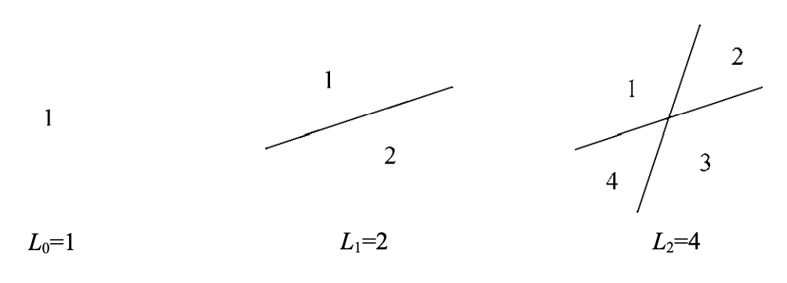
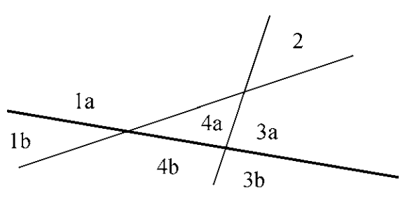
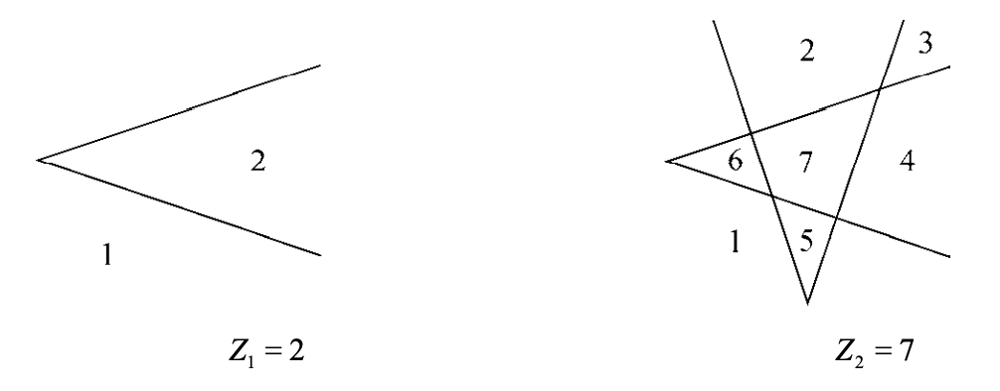
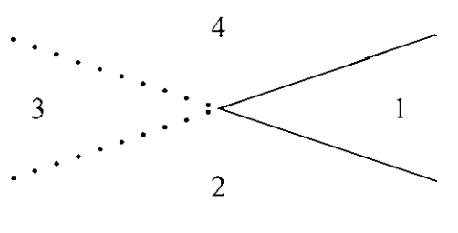

平面上$n$条直线所界定的区域数$L_n$最大是多少？  
还是从小的情况开始研究。最极端，一个直线都没有，显然是一个。一条直线的时候是两个区域，两条的时候可以分成四块。如下图所示：  

从前几个例子可能会猜测$L_n=2^n$，增加一条直线将区域数倍增。这个猜测是错误的。如果第$n$条直线能够穿过之前所有的区域，那么就能倍增。因为每个已有的区域是凸的（如果一个区域包含其任意两点之间的所有直线段，那么这个区域是凸的），一条直线分开的两个区域仍旧是凸的，那么直线穿过最多能分成两个新的区域。不过当我们增加第三条线的时候发现不管怎么样，至多分裂三个已有的区域。如下图所示：  
  
从而$L_3=4+3=7$是最好的情况了。

第$n$条直线新增$k$个区域，那么说明其穿过已有的$k$个区域，这等价于和之前$k-1$个不同的地方与之前的直线相交。因为两条直线只能有一个交点，所以之前有$n-1$条直线，那么至多有$n-1$个交点，所以$k\leq n$。所以上届是
$$L_n\leq L_{n-1}+n,n>0$$
这个上限是容易做到的。我们每次放第$n$个直线的时候，和前面的都不平行（从而和它们都能有交点），且不经过已经有的交点（保证都是不同的交点）即可。所以我们就得到了递推式
$$\begin{aligned}
&L_0=1\\
&L_n= L_{n-1}+n,n>0
\end{aligned}\tag{1.4}$$
代入前面几个已知的情况，都是正确的。所以我们接受这个结果。

下面求封闭形式。前面几项是$1,2,4,7,11,16,\cdots$，很难猜。我们从用传统的代入的方式一层层展开：
$$\begin{aligned}
L_n&=&&L_{n-1}+n\\
&=&&L_{n-2}+(n-1)+n\\
&=&&L_{n-3}+(n-2)+(n-1)+n\\
&&&\vdots\\
&=&&L_0+1+2+\cdots+(n-1)+n\\
&=&&1+S_n
\end{aligned}$$
$S_n$会经常出现，所以我们列一个表，这样会更熟悉这些数：
| $n$ | 1 | 2 | 3 | 4 | 5 | 6 | 7 | 8 | 9 | 10 | 11 | 12 | 13 | 14 |
|--|--|--|--|--|--|--|--|--|--|--|--|--|--|--|
| $S_n$ | 1 | 3 | 6 | 10 | 15 | 21 | 28 | 36 | 45 | 55 | 66 | 78 | 91 | 105 |

这些值也称为三角形数（`triangular numbers`），因为$S_n$是有$n$行的三角形阵列中的保龄球的个数。  
为了计算$S_n$，可以用高斯在9岁那年（1786）想出来的方法：
$$\begin{aligned}
&&S_n&=&1&+&2&+&3&+\cdots+&(n-1)&+&n\\
&&+S_n&=&n&+&(n-1)&+&(n-2)&+\cdots+&2&+&1\\
&&2S_n&=&2n&+&2n&+&2n&+\cdots+&2n&+&2n
\end{aligned}$$
书中提到一个文献，说明阿基米德很多年前就有过类似的想法。  
简化上面的式子得到
$$S_n=\frac{n(n+1)}{2},n\leq 0\tag{1.5}$$
所以
$$L_n=\frac{n(n+1)}{2}+1,n\leq 0\tag{1.6}$$
这个推导过程可以看做是一个证明。不过对于学习数学而言，更严格的标准就是用数学归纳法证明一下，递归最核心的步骤就是$n-1$到$n$的推导：
$$L_n=L_{n-1}+n=(\frac{n(n-1)}{2}+1)+n=\frac{n(n+1)}{2}+1$$

所谓的封闭形式，就是形如$(1.2), (1.6)$这样的，而$(1.1), (1.4)$这样的就是递归式而不是封闭形式。像$1+2+\cdots+n$这样的也不是封闭式，因为出现了$\cdots$，而$\frac{n(n+1)}{2}$是封闭形式。一个粗略的定义是：如果可以通过至多固定次数（和$n$无关的）的”人人熟知“的运算来计算$f(n)$的值，那么表达式就是封闭形式。前面的例子就只包含加法、乘法和除法。  
简单的封闭形式的数量是有限的，那么肯定有没有简单封闭形式的递归式。当某种递归式经常出现且非常重要的话，我们就把它加入整套运算中，大大扩展有简单封闭形式的解的范围，比如$n!$本质是递归式，却如此重要，那么加到运算中，认为是封闭形式。

现在考虑这个问题的一个变形：用折线替代直线，折线就是一个角（锯齿状）。那么平面上$n$个锯齿所界定的区域数$Z_n$是多少？可能是两倍，或者三倍，如下图所示：  
  
从最小的情况出发，一条折线和两条直线是类似的，差异是两个线段没有沿着交点延展出去进而使得一些区域融合在了一起：  
  
对于一个折线而言，我们少了两个区域。如果不把折线的顶点放到任意的交点处，那么我们少的区域就是每个折线本来就要损失的两个区域。那么
$$\begin{aligned}
Z_n&=L_{2n}-2n\\
&=\frac{2n(2n+1)}{2}+1-2n\\
&=2n^2-n+1,n\geq 0
\end{aligned}\tag{1.7}$$
比较封闭形式$(1.6), (1.7)$，我们发现对于比较大$n$有
$$L_n\sim\frac{1}{2}n^2$$
$$Z_n\sim 2n^2$$
所以折线分割的区域数是直线分割的区域数的四倍。后续会继续讨论$n$很大时整数函数的进行情况。$\sim$会在9.1给出定义。
