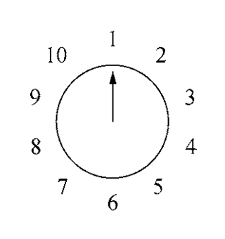
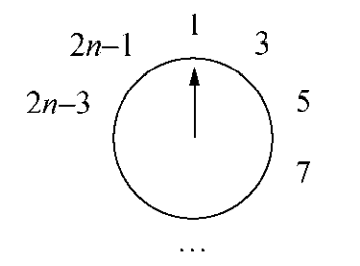
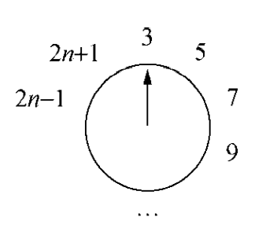
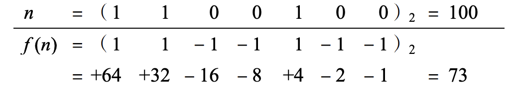

约瑟夫之所以能够活下来是因为他靠着智慧解决了生死有关的问题，故这个问题也用他的名字命名。  
故事是说约瑟夫和他的朋友被俘虏，和其他俘虏一起围成一个圈，每隔两个人杀死一个人，最后剩下两个人为止。约瑟夫迅速算出了最后的活下来的两个位置，逃过一劫。

这里要研究的问题稍有变化。从围成标号1到$n$的$n$个人开始，每隔一个删除一个，直到剩下来一个为止。例如$n=10$的其实状况如下：  
  
消去的顺序是2，4，6，8，10，3，7，1，9，于是5幸存下来。问题是如何确定幸存者的号码$J(n)$。  
我们可能会猜测如果$n$是偶数，那么$J(n)=\frac{n}{2}$。$J(2)=1$是支持这个猜测的，但是稍微多看几个情况，就不是这样了。比如$n=4,n=6$的情况  
| $n$ | 1 | 2 | 3 | 4 | 5 | 6 |
|--|--|--|--|--|--|--|
| $J(n)$ | 1 | 1 | 3 | 1 | 3 | 5 |

看起来，至少$J(n)$是奇数。这个是明显的，第一圈就会把所有的偶数都排除出去。如果$n$是偶数，那么第一圈结束之后，除了人数减半编号发生了变化之外，我们得到一个和一开始类似的情况。  
所以我们假设一开始有$2n$个人，那么一轮之后留下的情况如下图：  
  
3号是下一个要离开的人。现在和$n$个人的初始情况相比，每个人的号码是$n$时进行了加倍减一的操作，所以
$$J(2n)=2J(n)-1,n\geq 1$$
利用这个我们可以快速增加$n$的值。比如知道$J(10)=5$，那么
$$J(20)=2J(10)-1=9$$
类似的有$J(40)=17$，以此类推可以得到$J(5\times 2^m)=2^{m+1}+1$。

对于奇数情况，结果如何呢？假设有$2n+1$个人，标号为1的人会在$2n$删除之后被删除，所以删除$n+1$个之后剩余的$n$个标号如下：  
  
这个和$n$的情况类似，每个人的标号是加倍且加一，那么
$$J(2n+1)=2J(n)+1$$
这些结果和初始情况$J(1)=1$组合起来，得到
$$\begin{aligned}
J(1)&=1\\
J(2n)&=2J(n)-1,n\geq 1\\
J(2n+1)&=2J(n)+1,n\geq 1
\end{aligned}\tag{1.8}$$
这个递归式不是由$J(n-1)$得到$J(n)$，而是每次加倍或者更多（多一个罢了），非常有效。比如只需要19次就能计算得到$J(1000000)$。我们还是要求一个封闭形式，一是更高效，二是有更多信息。

有了递归式，我们可以写出前一些项，找规律，猜测答案。  
| $n$ | 1 | 2 3 | 4 5 6 7 | 8 9 10 11 12 13 14 15 | 16 |
|--|--|--|--|--|--|
| $J(n)$ | 1 | 1 3 | 1 3 5 7 | 1 3 5 7 9 11 13 15 | 1 |

规律很明显。按照2的幂次分组，然后每组都是从1开始的奇数。将$n$表示为$n=2^m+l$的形式，其中$2^m$是不超过$n$的2的最大次幂，$l$是剩余的数。那么递归的解看起来是
$$J(2^m+l)=2l+1,m\geq 0,0\leq l<2^m\tag{1.9}$$
下面用归纳法来证明这个式子。这里对$m$进行递归。$m=0$时，那么$l=0$，那么基础就是$J(1)=1$，成立。归纳分成两个部分即$l$是奇数还是偶数。如果$m>0,2^m+l=2n$，那么$l$是偶数，根据$(1.8)$和归纳假设有
$$\begin{aligned}
J(2^m+l)&=2J(2^{m-1}+l/2)-1\\
&=2(2(l/2)+1)-1\\
&=2l+1
\end{aligned}$$
$l$是奇数，即$2^m+l=2n+1$，那么
$$\begin{aligned}
J(2^m+l)&=2J(2^{m-1}+(l-1)/2)+1\\
&=2(2((l-1)/2)+1)+1\\
&=2l+1
\end{aligned}$$
证明完成。从$(1.8)$蕴涵着关系
$$J(2n+1)-J(2n)=2$$
举个例子说明如何使用公式$(1.9)$，比如要求$J(100)$，$100=2^6+36$，所以$J(100)=73$。

问题解决了。现在我们来推广结论或者是中间的关键结果，使得可以应用于更广泛的问题。这是非常有启发意义的事情。下面会讨论解$(1.9)$和递归式$(1.8)$的推广。这些探讨会揭示这类问题背后的结构。

求解过程中，2的幂次发挥了重要的作用，那么现在研究下$n$和$J(n)$的二进制表示。假设$n$的二进制写法是
$$n=(b_mb_{m-1}\cdots b_1b_0)_2$$
其中$b_i$是0或者1，第一个数字$b_m$必须是1。因为$n=2^m+l$，那么
$$\begin{aligned}
n&=(1b_{m-1}\cdots b_1b_0)_2\\
l&=(0b_{m-1}\cdots b_1b_0)_2\\
2l&=(b_{m-1}\cdots b_1b_00)_2\\
2l+1&=(b_{m-1}\cdots b_1b_01)_2\\
J(n)&=(b_{m-1}\cdots b_1b_0b_m)_2\\
\end{aligned}$$
所以
$$J((b_mb_{m-1}\cdots b_1b_0)_2)=(b_{m-1}\cdots b_1b_0b_m)_2\tag{1.10}$$
计算中，向左循环一位就从$n$得到了$J(n)$。比如，$n=100=(1100100)_2$，那么$J(n)=J((1100100)_2)=(1001001)_2$，$(1001001)_2=64+8+1=73$。  
如果我们从$n$开始，进行$m+1$次$J$运算，二进制循环了$m+1$次，由于$n$的二进制数是$m+1$位，那么会回到$n$吗？不会。比如$n=13=(1101)_2$，那么$J((1101)_2)=(1011)_2$，再进行一次那么$J((1011)_2)=(111)_2$。当0是首位的时候，会消失一位二进制。本质上，由于必有$J(n)\leq n$，如果$J(n)<n$那么迭代下去也无法回到$n$了。  
重复$J$运算会得到一系列递减值，直到$J(n)=n$，这是不动点。通过循环移位可以看出来，不动点的时的$n$是全1组成的，值是$2^{v(n)}-1$，其中$v(n)$是$n$的二进制表示中1的个数。由于$v(13)=3$，那么
$$J(J(\cdots J(13)\cdots ))=2^3-1=7$$
其中需要2个或者更多的$J$。  
类似的有
$$J(J(\cdots J((101101101101011)_2)\cdots ))=2^{10}-1=1023$$
这里需要8个或者更多的$J$。

回到最初的猜测$J(n)=\frac{n}{2}$，这个在一般情况下明显是不成立的，但是在什么情况下成立呢？
$$\begin{aligned}
J(n)&=\frac{n}{2}\\
2l+1&=(2^m+l)/2\\
l&=\frac{1}{3}(2^m-2)
\end{aligned}$$
如果$l$是整数，那么对应的$n$就是一个解。$m$是奇数的时候，$2^m-2$是3的倍数。书中说了句不难验证，代入几个奇数很容易验证都是3的倍数。下面给出一个证明。令$m=2k+1$，那么
$$\begin{aligned}
2^m-2&=2^{2k+1}-2\\
&=2(4^k-1)\\
&=2(4-1)(4^{k-1}+4^{k-2}+\cdots+1)\\
&=3\cdot 2(4^{k-1}+4^{k-2}+\cdots+1)
\end{aligned}$$
$m$是偶数则不然（第四章会讨论）。那么方程$J(n)=\frac{n}{2}$的解有无限多，下面表格是其中的一些：
| $m$ | $l$ | $n=2^m+l$ | $J(n)=n/2$ | $n（二进制）$ |
|--:|--:|--:|--:|--:|
| 1 | 0 | 2 | 1 | 10 |
| 3 | 2 | 10 | 5 | 1010 |
| 5 | 10 | 42 | 21 | 101010 |
| 7 | 42 | 170 | 85 | 10101010 |

最右边的二进制数，左循环一位的结果和计算机中的右移一位是一样的。

现在我们推广递归式$(1.8)$，引入常量$\alpha,\beta,\gamma$得到下面更加一般的递归式
$$\begin{aligned}
f(1)&=\alpha\\
f(2n)&=2f(n)+\beta,n\geq 1\\
f(2n+1)&=2f(n)+\gamma,n\geq 1
\end{aligned}\tag{1.11}$$
我们现在来求解封闭形式。一开始的问题其实就是$\alpha=1,\beta=-1,\gamma=1$。还是从非常小的问题开始研究：
$$\begin{aligned}
&n&&f(n)\\
&1&&\alpha\\
&2&&2\alpha+&&\beta\\
&3&&2\alpha&&&+&&\gamma\\
&4&&4\alpha+&&3\beta\\
&5&&4\alpha+&&2\beta&+&&\gamma\\
&6&&4\alpha+&&\beta&+&&2\gamma\\
&7&&4\alpha&&&+&&3\gamma\\
&8&&8\alpha+&&7\beta\\
&9&&8\alpha+&&6\beta&+&&\gamma
\end{aligned}\tag{1.12}$$
通过观察，$\alpha$的系数是不超过$n$的2的最大幂，在2的幂次之间，$\beta$依次递减，$\gamma$从0开始依次递增。把$f(n)$对$\alpha,\beta,\gamma$的依赖关系写出来如下：
$$f(n)=A(n)\alpha+B(n)\beta+C(n)\tag{1.13}$$
从前面的观察可以猜测
$$\begin{aligned}
A(n)&=2^m\\
B(n)&=2^m-1-l\\
C(n)&=l
\end{aligned}\tag{1.14}$$
用归纳法可以证明上面的解，但是繁琐又没有提供其他有用信息。下面是一个很赞的方法，通过选取特殊的值，把它们组合起来。首先考虑$\alpha=1,\beta=\gamma=0$这一特殊情况来对这个方法进行说明。此时$f(n)=A(n)$，那么递归式就变成了
$$\begin{aligned}
A(1)&=1\\
A(2n)&=Af(n),n\geq 1\\
A(2n+1)&=2A(n),n\geq 1
\end{aligned}$$
很容易用数学归纳法证明$A(n)=A(2^m+l)=2^m$。  
其实如果将$\alpha,\beta,\gamma$代入其他特殊值，比如$\alpha=0,\beta=1,\gamma=0$，这样可以容易的证明猜测是正确的，但是不是一个通用的求解递归式的方法。书中描述的是求解方法。  
下面，从简单的函数$f(n)$出发，看有没有任何常数$(\alpha,\beta,\gamma)$能定义对应函数。从最简单的常值函数$f(n)=1$代入递归式得到
$$\begin{aligned}
1&=\alpha\\
1&=2+\beta,n\geq 1\\
1&=2+\gamma,n\geq 1
\end{aligned}$$
那么$\alpha=1,\beta=-1,\gamma=-1$，进而$A(n)-B(n)-C(n)=f(n)=1$。  
类似的，代入$f(n)=n$
$$\begin{aligned}
1&=\alpha\\
2n&=2n+\beta,n\geq 1\\
2n+1&=2n+\gamma,n\geq 1
\end{aligned}$$
那么$\alpha=1,\beta=0,\gamma=1$，进而$A(n)+C(n)=f(n)=n$。  
现在我们有了以下信息：
$$\begin{aligned}
A(n)&=2^m\\
A(n)-B(n)-C(n)&=1\\
A(n)+C(n)&=n
\end{aligned}$$
很容易求解出
$$C(n)=n-A(n)=2^m+l-2^m=l$$
进而
$$B(n)=A(n)-C(n)-1=2^m-l-1$$
至此，证明了前面的猜测是对的。

上述的做法是一整套求解递归式是的方法。首先寻求一组已知解的通用参数，这是求解的特殊形式，然后将特殊形式组合起来得到一般形式。一般地，有多少个独立参数（$\alpha,\beta,\gamma$）需要多少独立的特解。

前面给出了一个神奇的解：
$$J((b_mb_{m-1}\cdots b_1b_0)_2)=(b_{m-1}b_{m-2}\cdots b_1b_0b_m)_2,b_m=1$$
推广的约瑟夫递归是否也有这样神奇的解呢？  
如果零$\beta_0=\beta,\beta_1=\gamma$，那么$(1.11)$可以改写成
$$\begin{aligned}
f(1)&=\alpha\\
f(2n+j)&=2f(n)+\beta_j,j=0,1,n\geq 1
\end{aligned}\tag{1.15}$$
那么递归式的二进制展开是
$$\begin{aligned}
f((b_mb_{m-1}\cdots b_1b_0)_2)&=2f((b_mb_{m-1}\cdots b_1)_2)+\beta_{b_0}\\
&=4f((b_mb_{m-1}\cdots b_2)_2)+2\beta_{b_1}+\beta_{b_0}\\
&\vdots\\
&=2^mf((b_m)_2)+2^{m-1}\beta_{b_{m-1}}+\cdots+2\beta_{b_1}+\beta_{b_0}\\
&=2^m\alpha+2^{m-1}\beta_{b_{m-1}}+\cdots+2\beta_{b_1}+\beta_{b_0}
\end{aligned}$$
我们现在放开二进制的限制，允许任意数字，而不仅仅是0和1。那么上面展开过程告诉我们
$$f((b_mb_{m-1}\cdots b_1b_0)_2)=(\alpha\beta_{b_{m-1}}\beta_{b_{m-2}}\cdots \beta_{b_1}\beta_{b_0})_2\tag{1.16}$$
重写$(1.12)$为
$$\begin{aligned}
&n&&f(n)\\
&1&&\alpha\\
&2&&2\alpha+\beta\\
&3&&2\alpha+\gamma\\
&4&&4\alpha+2\beta+\beta\\
&5&&4\alpha+2\beta+\gamma\\
&6&&4\alpha+2\gamma+\beta\\
&7&&4\alpha+2\gamma+\gamma
\end{aligned}$$
这样就是符合新找到的规律的。  
比如当$n=100=(1100100)_2$时，原约瑟夫问题有$\alpha=1,\beta=-1,\gamma=1$，那么  
  
关于这个表格，提醒下：$\beta_0=\beta=-1,\beta_1=\gamma=1$，而$n$二进制表示的各个数字就是下标。  
由于$n$的二进制每一个数字$(10\cdots 00)_2$都有
$$(1 -1 -1\cdots -1 -1)_2=1=(00\cdots 01)_2$$
这就推出了循环移位这个性质。  
改变了表示方式，我们从$(1.15)$推得$(1.16)$。如果真的不加以限制，进一步推广得到递推式
$$\begin{aligned}
f(j)&=\alpha_j,&&1\leq j<d\\
f(dn+j)&=cf(n)+\beta_j,&&0\leq j<d,n\geq 1
\end{aligned}\tag{1.17}$$
和之前的递归式类似，这里的要研究的数是基数为$d$，产生的值基数是$c$。所以解是
$$f((b_mb_{m-1}\cdots b_1b_0)_d)=(\alpha\beta_{b_{m-1}}\beta_{b_{m-2}}\cdots \beta_{b_1}\beta_{b_0})_c\tag{1.18}$$
举个例子
$$\begin{aligned}
f(1)&=34,\\
f(2)&=5,\\
f(3n)&=10f(n)+76,n\geq 1\\
f(3n+1)&=10f(n)-2,n\geq 1\\
f(3n+2)&=10f(n)+8,n\geq 2
\end{aligned}$$
根据之前的定义，$\alpha_1=34,\alpha_2=5,\beta_0=76,\beta_1=-2,\beta_2=8,d=3,c=10$。  
比如我们要求$f(19)$，由于$(19)_{10}=(201)_3$，分别替换为$\alpha_2,\beta_0,\beta_1$，所以
$$f(19)=f((201)_3)=(5 \text{  } 76 \text{  } -2)_{10}=1258$$
