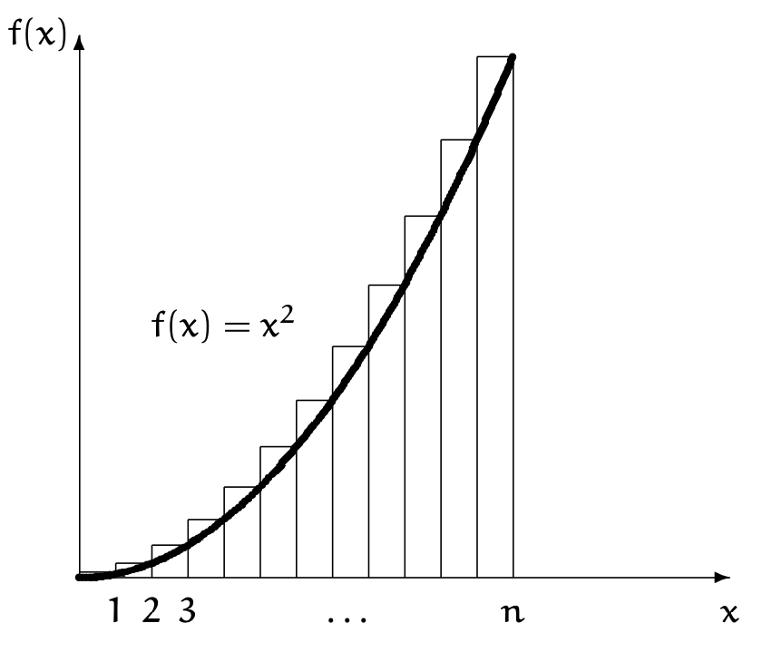

下面我们通过求解前$n$项平方和来巩固所学，还会学到处理一般情况的有用策略。我们把前$n$项平方和记作$\square_n$
$$\square_n=\sum_{0\leq k\leq n}k^2,n\geq 0\tag{2.37}$$
和之前一样，我们先看$n$比较小的情况
| $n$ | 0 | 1 | 2 | 3 | 4 | 5 | 6 | 7 | 8 | 9 | 10 | 11 | 12 |
|--|--|--|--|--|--|--|--|--|--|--|--|--|--|
| $n^2| 0 | 1 | 4 | 9 | 16 | 25 | 36 | 49 | 64 | 81 | 100 | 121 | 144 |
| $\square_n$ | 0 | 1 | 5 | 14 | 30 | 55 | 91 | 140 | 204 | 285 | 385 | 506 | 650 |

### Method 0: You could look it up
类似前$n$项平方和的问题前人可能已经解决了。CRC Standard Mathematical Tables p36 给出了答案
$$\square_n=\frac{n(n+1)(2n+1)}{6},n\geq 0\tag{2.38}$$
这本书还有立方和等信息。  
Handbook of Mathematical Functions 是数学公式的权威参考，里面也有解答，同时有更多相似的求和公式。Handbook of Integer Sequences 是关于序列的权威书籍。同时，Axiom, MACSYMA, Maple, Mathematica 也非常有用。  
熟悉标准信息来源很有用，不过和本书目的相悖。下面我们自己解决问题。

### Method 1: Guess the answer, prove it by induction
如果我们知道答案，或者通过不严格的方式得到一个解，那么只需要证明就可以了。  
假设我们猜到了一个更好记忆的公式
$$\square_n=\frac{n(n+\frac{1}{2})(n+1)}{3},n\geq 0\tag{2.39}$$
对于最基本的情况，很容易验证$\square_0=0=0(0+1/2)(1+1)/3$。假设$n-1$时$(2.39)$成立。我们有
$$\square_n=\square_{n-1}+n^2$$
那么
$$\begin{aligned}
3\square_n&=(n-1)(n-\frac{1}{2})(n)+3n^2\\
&=(n^3-\frac{3}{2}n^2+\frac{1}{2}n)+3n^2\\
&=n^3+\frac{3}{2}n^2+\frac{1}{2}n\\
&=n(n+\frac{1}{2})(n+1)
\end{aligned}$$
所以对$n\geq 0$都成立。  
归纳法非常有用，非常重要。不过我们还是希望从零开始求解而不是靠灵光一闪。

### Method 2: Perturb the sum
我们使用对几何级数$(2.25)$很有用的扰动法。
$$\begin{aligned}
\square_n+(n+1)^2&=\sum_{0\leq k\leq n}(k+1)^2\\
&=\sum_{0\leq k\leq n}(k^2+2k+1)\\
&=\square_n+2\sum_{0\leq k\leq n}k+(n+1)
\end{aligned}$$
左右两边的$\square_n$抵消了。不过我们通过对前$n$项平方和使用扰动法得到了前$n$项和
$$2\sum_{0\leq k\leq n}k=(n+1)^2-(n+1)$$
那么我们从$n$项立方和（用$S_n$表示）出发，是不是就可以得到$n$项平方和了呢？
$$\begin{aligned}
S_n+(n+1)^3&=\sum_{0\leq k\leq n}(k+1)^3\\
&=\sum_{0\leq k\leq n}(k^3+3k^2+3k+1)\\
&=S_n+3\square_n+3\sum_{0\leq k\leq n}k+(n+1)\\
&=S_n+3\square_n+3\frac{n(n+1)}{2}+(n+1)
\end{aligned}$$
$n$项立方和被抵消了，所以
$$\begin{aligned}
3\square_n&=(n+1)^3-3\frac{n(n+1)}{2}-(n+1)\\
&=(n+1)((n+1)^2-\frac{3}{2}n-1)\\
&=(n+1)(n^2+\frac{1}{2}n)\\
&=n(n+\frac{1}{2})(n+1)
\end{aligned}$$

### Method 3: Build a repertoire
把递归式$(2.7)$稍微泛化一下就能处理$n^2$的求和。
$$\begin{aligned}
R_0&=\alpha\\
R_n&=R_{n-1}+\beta+\gamma n+\delta n^2,n>0
\end{aligned}\tag{2.40}$$
解的一般形式是
$$R_n=A(n)\alpha+B(n)\beta+C(n)\gamma+D(n)\delta\tag{2.41}$$
当$\delta=0$时，公式和$(2.7)$一样，那么我们已经有了$A(n),B(n),C(n)$的解。把$R_n=n^3$代入得到
$$R_0=0=\alpha$$
$$n^3=(n-1)^3+\beta+\gamma n+\delta n^2=n^3+(\delta-3)n^2+(\gamma+3)n+(\beta-1)$$
所以
$$\beta=1,\gamma=-3,\delta=3$$
那么就有
$$n^3=B(n)-3C(n)+3D(n)$$
这样$D(n)$就确定下来了。我把这些关系再写在这里
$$A(n)=1,B(n)=n,C(n)=\frac{n^2+n}{2}$$
那么
$$\begin{aligned}
3D(n)&=n^3-n+\frac{3}{2}(n^2+n)\\
&=n(n^2-1+\frac{3}{2}n+\frac{3}{2})\\
&=n(n^2+\frac{3}{2}+\frac{1}{2})\\
&=n(n+\frac{1}{2})(n+1)
\end{aligned}$$
我们要求$\square_n$，那么$(2.40)$中的各个系数分别是$\alpha=\beta=\gamma=0,\delta=1$，也就是说
$$\square_n=D(n)$$

### Method 4: Replace sums by integrals
离散数学中的$\sum$和微积分中的$\int$常常可以互换，很多性质都是一致的。那么我们可以利用微积分的思想来求解。  
微积分中积分可以看做是曲线下面的面积。我们要求的$\square_n$可以看做是一系列狭长的矩形$1\times 1,1\times 2^2,1\times 3^2\cdots,1\times n^2$，那么它们之和就近似于$f(x)=x^2$和$x$轴之间的面积。  

面积是
$$\int_0^n x^2 dx=\frac{n^3}{3}$$
那么我们知道$\square_n$近似于$\frac{1}{3}n^3$。现在来求误差$E_n=\square_n-\frac{1}{3}n^3$。由于$\square_n=\square_{n-1}+n^2$，可以找到$E$的递归式
$$\begin{aligned}
E_n&=\square_n-\frac{1}{3}n^3\\
&=\square_{n-1}+n^2-\frac{1}{3}n^3\\
&=E_{n-1}+\frac{1}{3}(n-1)^3+n^2-\frac{1}{3}n^3\\
&=E_{n-1}+n-\frac{1}{3}
\end{aligned}$$
这是一个更简单的递归式，容易求解。  
另外一种方式是通过计算楔形面积来得到误差
$$\begin{aligned}
\square_n-\int_0^n x^2 dx&=\sum_{k=1}^n(k^2-\int_{k-1}^k x^2 dx)\\
&=\sum_{k=1}^n(k^2-\frac{k^3-(k-1)^3}{3})\\
&=\sum_{k=1}^n(k-\frac{1}{3})
\end{aligned}$$
不管怎样，求解$E_n$之后就可以得到$\square_n$。

### Method 5: Expand and contract
我们先展开成二重和式，再求解。这个二重和式如果拿捏得当，那么是能简化问题的。
$$\begin{aligned}
\square_n&=\sum_{1\leq k\leq n}k^2\\
&=\sum_{1\leq j\leq k\leq n}k\\
&=\sum_{1\leq j\leq n}\sum_{j\leq k\leq n}k\\
&=\sum_{1\leq j\leq n}(\frac{j+n}{2})(n-j+1)\\
&=\frac{1}{2}\sum_{1\leq j\leq n}(n(n+1)+j-j^2)\\
&=\frac{1}{2}n^2(n+1)+\frac{1}{4}n(n+1)-\frac{1}{2}\square_n\\
&=\frac{1}{2}n(n+1)(n+\frac{1}{2})-\frac{1}{2}\square_n
\end{aligned}$$
从单重和式到二重和式，以退为进，因为产生了更容易处理的和式。我们不能指望能够不断简化问题而解决所有问题。

### Method 6: Use finite calculus
### Method 7: Use generating functions
未来学习更多技术和方法之后，再来用这两种方法求解$\square_n=\sum_{k=0}^n$。
