函数是描述现实世界的数学工具，可以用方程、图像、数值表或文字来表示。

### 函数、定义域和值域

若变量 $y$ 的值取决于另一变量 $x$ 的值，则称 $y$ 是 $x$ 的函数，记为

$$y=f(x).$$

$f$ 表示函数；自变量 $x$（`independent variable`）是 $f$ 的输入，因变量 $y$（`dependent variable`）是 $f$ 的输出。

**定义**
> 函数（`function`）$f$ 是从集合 $D$ 到集合 $Y$ 的对应关系：$D$ 中每个元素 $x$ 都对应 $Y$ 中唯一的元素 $f(x)$。

所有输入值组成的集合 $D$ 称为函数的定义域（`domain`）；所有输出 $f(x)$ 组成的集合称为函数的值域（`range`）。值域不必包含 $Y$ 的每个元素。定义域和值域可以是任意对象的集合；在微积分中，它们通常是实数集合，或平面、空间中的点集。

用公式表示的函数说明如何由给定输入计算输出。例如，$A=\pi r^2$ 给出已知半径 $r$ 时圆的面积 $A$。若定义 $y=f(x)$ 时没有明确指定定义域，且上下文也没有限制，则定义域取使 $y$ 为实数的所有 $x$，称为自然定义域（`natural domain`）。若要限制定义域，必须明确说明；例如，$y=x^2$ 的定义域是实数集，也可限制为 $x>0$。

改变定义域时，值域通常也会改变。$y=x^2$ 的值域是 $[0,\infty)$，而 $y=x^2$（$x\geq2$）的值域是 $[4,\infty)$，也可写作 $\{x^2\mid x\geq2\}$ 或 $\{y\mid y\geq4\}$。值域为实数集的函数称为实值函数（`real-valued function`）。本书讨论的大多数实值函数，其定义域和值域是一个或多个区间；有时值域并不容易求出。

函数 $f$ 可视作一台机器：输入 $x$，输出 $f(x)$。例如，输入非负数 $x$ 并按计算器上的 $\sqrt{x}$ 键，输出就是 $x$ 的平方根。

函数也可用箭头图（`arrow diagram`）表示。每个箭头将 $D$ 中的元素与 $Y$ 中的元素关联。例如，箭头可将输入 $a$ 映射到输出 $f(a)$。不同输入可以有相同输出，但每个输入只能有一个输出。

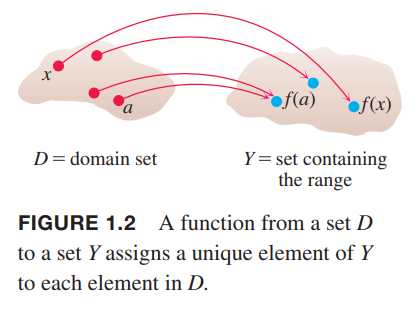

例 1：求下列函数的定义域和值域。定义域取使公式有意义的所有实数 $x$。

| 函数 | 定义域（$x$） | 值域（$y$） |
|:--|:--|:--|
| $y=x^2$ | $(-\infty,\infty)$ | $[0,\infty)$ |
| $y=1/x$ | $(-\infty,0)\cup(0,\infty)$ | $(-\infty,0)\cup(0,\infty)$ |
| $y=\sqrt{x}$ | $[0,\infty)$ | $[0,\infty)$ |
| $y=\sqrt{4-x}$ | $(-\infty,4]$ | $[0,\infty)$ |
| $y=\sqrt{1-x^2}$ | $[-1,1]$ | $[0,1]$ |

解：对 $y=x^2$，每个实数 $x$ 都有对应的实数输出，故定义域为 $(-\infty,\infty)$。其输出非负，且每个非负数 $y$ 都可写为 $y=(\sqrt{y})^2$，故值域为 $[0,\infty)$。

对 $y=1/x$，分母不能为零，故定义域为所有非零实数。其输出也不会为零；反之，对每个 $y\neq0$，取 $x=1/y$ 就有 $1/x=y$，故值域同样是所有非零实数。

对 $y=\sqrt{x}$，只有 $x\geq0$ 时输出为实数，且每个非负数都是某个非负数的平方根，故定义域和值域均为 $[0,\infty)$。对 $y=\sqrt{4-x}$，须有 $4-x\geq0$，故定义域为 $x\leq4$，值域仍为 $[0,\infty)$。对 $y=\sqrt{1-x^2}$，须有 $1-x^2\geq0$，即 $-1\leq x\leq1$；被开方数的取值范围为 $[0,1]$，故值域为 $[0,1]$。

### 函数的图像

函数 $f$ 定义在 $D$ 上时，所有输入输出对在笛卡尔平面中对应的点组成其图像，写为

$$\{(x,f(x))\mid x\in D\}.$$

函数 $f(x)=x+2$ 的图像如下。

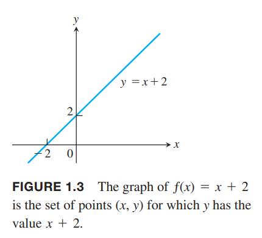

函数图像是非常有用的工具。若 $(x,y)$ 是图像上的点，则 $y=f(x)$ 表示从 $x$ 轴上点 $x$ 向上或向下到图像的高度；高度的正负取决于 $f(x)$ 的符号。

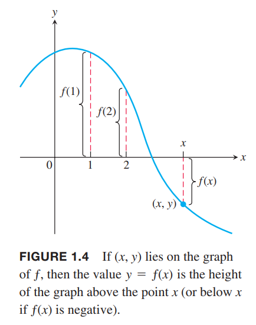

例 2：画出 $y=x^2$ 在区间 $[-2,2]$ 上的图像。

解：先列出一些满足 $y=x^2$ 的数对：

| $x$ | $y=x^2$ |
|:--|:--|
| $-2$ | $4$ |
| $-1$ | $1$ |
| $0$ | $0$ |
| $1$ | $1$ |
| $\frac32$ | $\frac94$ |
| $2$ | $4$ |

将这些点画在坐标系中，再用光滑曲线连接。

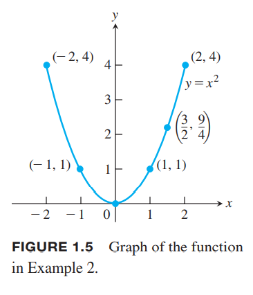

图像并非下列两种情形。

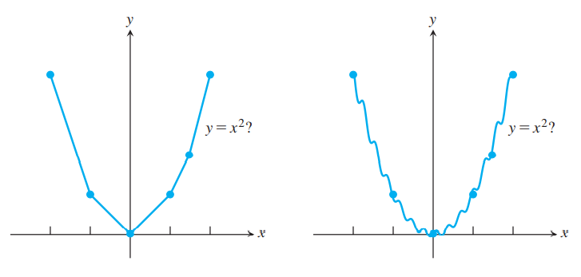

即使画出更多点，也仍须回答如何在点之间连接。微积分将在第四章研究这一问题；目前应尽可能准确地画出光滑曲线。

### 数值表示法

除代数式和图像外，函数还可用数值表表示，工程中经常采用这种方式。由例 2 的方法可根据表格得到函数图像（通常需要计算机辅助）。只画出表中数据点的图称为散点图（`scatterplot`）。

例 3：下表记录音叉产生的压力波的压强和对应时间。表格本身表示压强随时间变化的函数；先画散点图，再连接这些点可得到图像。

| 时间 | 压强 |
|:--|--:|
| 0.00091 | -0.080 |
| 0.00108 | 0.200 |
| 0.00125 | 0.480 |
| 0.00144 | 0.693 |
| 0.00162 | 0.816 |
| 0.00180 | 0.844 |
| 0.00198 | 0.771 |
| 0.00216 | 0.603 |
| 0.00234 | 0.368 |
| 0.00253 | 0.099 |
| 0.00271 | -0.141 |
| 0.00289 | -0.309 |
| 0.00307 | -0.348 |
| 0.00325 | -0.248 |
| 0.00344 | -0.041 |
| 0.00362 | 0.217 |
| 0.00379 | 0.480 |
| 0.00398 | 0.681 |
| 0.00416 | 0.810 |
| 0.00435 | 0.827 |
| 0.00453 | 0.749 |
| 0.00471 | 0.581 |
| 0.00489 | 0.346 |
| 0.00507 | 0.077 |
| 0.00525 | -0.164 |
| 0.00543 | -0.320 |
| 0.00562 | -0.354 |
| 0.00579 | -0.248 |
| 0.00598 | -0.035 |

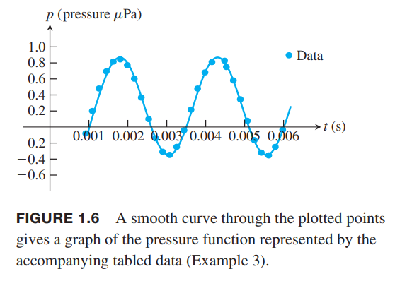

### 垂直线测试

并非坐标平面上的每条曲线都是函数图像。因为函数对每个 $x$ 最多只有一个函数值，所以任意垂直线与函数图像最多有一个交点。若 $a\in D(f)$，则直线 $x=a$ 与 $f$ 的图像交于 $(a,f(a))$。

圆不是函数图像，因为某些垂直线与圆有两个交点，如下图的（a）。但是圆包含两个函数图像：上半圆 $f(x)=\sqrt{1-x^2}$ 和下半圆 $g(x)=-\sqrt{1-x^2}$，分别如（b）和（c）所示。

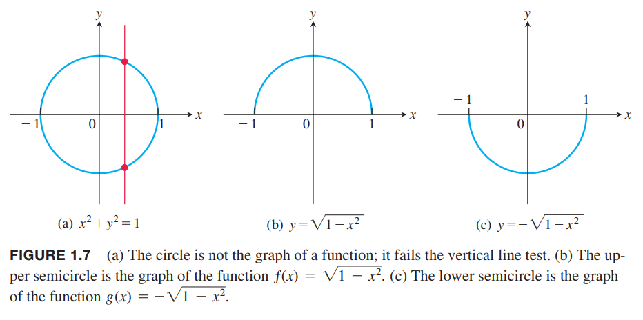

### 分段函数

有些函数在定义域的不同区间由不同公式定义。绝对值函数（`absolute value function`）便是一例：

$$
|x|=
\begin{cases}
x,&x\geq0,\\
-x,&x<0.
\end{cases}
$$

其图像如下。

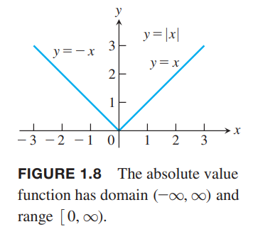

例 4：函数

$$
f(x)=
\begin{cases}
-x,&x<0,\\
x^2,&0\leq x\leq1,\\
1,&x>1
\end{cases}
$$

定义在整个实数集上。它随 $x$ 所在区间使用不同公式，但仍是一个函数而非三个函数。

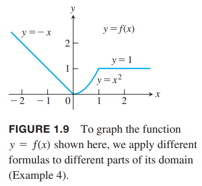

例 5：对任意实数 $x$，不超过 $x$ 的最大整数称为最大整数函数（`greatest integer function`）或向下取整函数（`floor function`），记为 $\lfloor x\rfloor$。例如，

$$\lfloor2.4\rfloor=2,\quad\lfloor1.9\rfloor=1,\quad\lfloor0\rfloor=0,\quad\lfloor-1.2\rfloor=-2,$$

$$\lfloor2\rfloor=2,\quad\lfloor0.2\rfloor=0,\quad\lfloor-0.3\rfloor=-1,\quad\lfloor-2\rfloor=-2.$$

其图像如下。

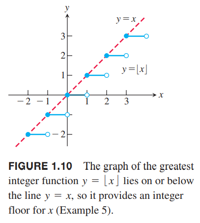

例 6：对任意实数 $x$，不小于 $x$ 的最小整数称为最小整数函数（`least integer function`）或向上取整函数（`ceiling function`），记为 $\lceil x\rceil$。对于正数 $x$，它可表示按小时收费、不足一小时按一小时计的停车费。

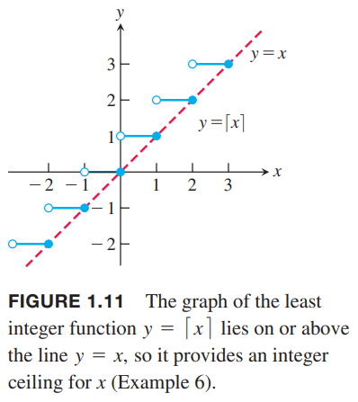

### 递增函数和递减函数

从左到右观察时，函数图像始终上升的函数称为递增函数；始终下降的函数称为递减函数。

**定义**
> 设 $f$ 定义在区间 $I$ 上，且 $x_1,x_2\in I$。
>
> 1. 若对任意 $x_1<x_2$ 都有 $f(x_1)<f(x_2)$，则 $f$ 在 $I$ 上严格递增；
> 2. 若对任意 $x_1<x_2$ 都有 $f(x_1)>f(x_2)$，则 $f$ 在 $I$ 上严格递减。

这里使用严格不等式，故称为严格递增或严格递减。区间 $I$ 可以有限，也可以无限。

例 7：图 1.9 中的函数在 $(-\infty,0)$ 上递减，在 $(0,1)$ 上递增，在 $(1,\infty)$ 上既不严格递增也不严格递减，因为它在该区间为常函数。

### 偶函数和奇函数：对称性

奇函数和偶函数的图像具有特殊对称性。

**定义**
> 设函数 $y=f(x)$ 的定义域关于原点对称。
>
> - 若对定义域中任意 $x$ 都有 $f(-x)=f(x)$，则 $f$ 是偶函数（`even function`）；
> - 若对定义域中任意 $x$ 都有 $f(-x)=-f(x)$，则 $f$ 是奇函数（`odd function`）。

名称源于 $x$ 的幂。$y=x^2$、$y=x^4$ 是偶函数，因为 $(-x)^2=x^2$、$(-x)^4=x^4$；$y=x$、$y=x^3$ 是奇函数，因为 $(-x)=-x$、$(-x)^3=-x^3$。

偶函数关于 $y$ 轴对称：若 $(x,y)$ 在图像上，则 $(-x,y)$ 也在图像上。奇函数关于原点对称：若 $(x,y)$ 在图像上，则 $(-x,-y)$ 也在图像上。

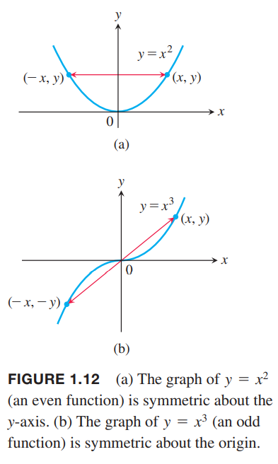

例 8：下表给出奇偶函数的例子。

| 函数 | 类型 |
|:--|:--|
| $f(x)=x^2$ | 偶函数，关于 $y$ 轴对称。 |
| $f(x)=x^2+1$ | 偶函数，如下图（a）。 |
| $f(x)=x$ | 奇函数，关于原点对称。 |
| $f(x)=x+1$ | 既非奇函数，也非偶函数，如下图（b）。 |

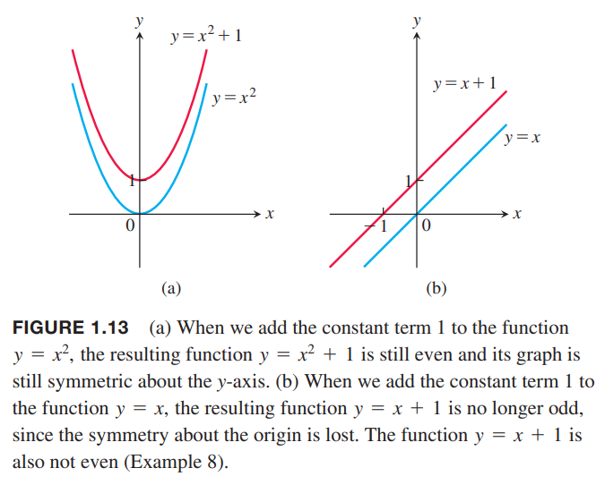

### 常用函数

线性函数形如 $f(x)=mx+b$，其中 $m,b$ 为常量。下图（a）是一组 $f(x)=mx$ 的图像：它们都满足 $b=0$，并通过原点。$f(x)=x$ 对应 $m=1,b=0$，称为恒等函数（`identity function`）。当 $m=0$ 时，函数为常函数，如下图（b）。

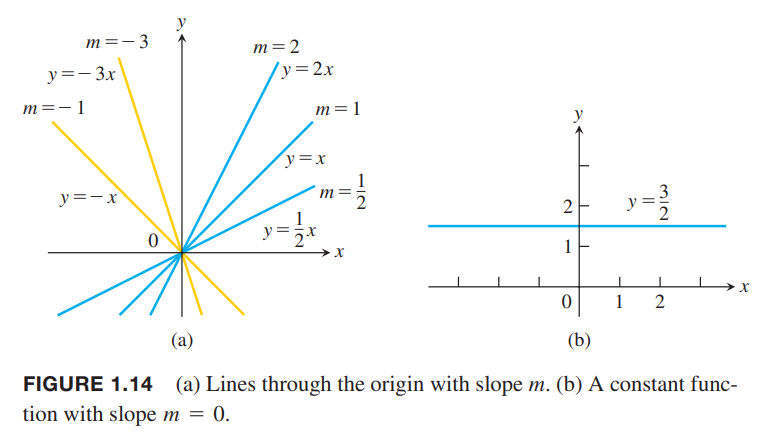

**定义**
> 若两个变量 $x,y$ 满足 $y=kx$，其中 $k\neq0$ 为常量，则称 $y$ 与 $x$ 成正比（`proportional`）。

若 $y$ 与 $1/x$ 成正比，则称 $y$ 与 $x$ 成反比。

幂函数（`power function`）形如 $f(x)=x^a$，其中 $a$ 为常量。下面是一些重要例子。

1. 当 $a=n$ 是正整数时，$f(x)=x^n$ 的定义域为实数集。下图给出 $n=1,2,3,4,5$ 时的图像。$n$ 越大，曲线在 $(-1,1)$ 上越平坦，在 $|x|>1$ 时越陡。每条曲线均通过原点和 $(1,1)$。偶次幂函数为偶函数，在 $(-\infty,0]$ 上递减、在 $[0,\infty)$ 上递增；奇次幂函数为奇函数，且在整个实数集上递增。

   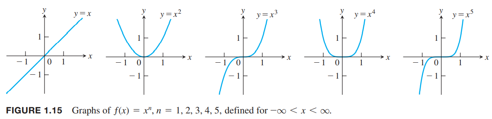

2. 当 $a=-1$ 或 $a=-2$ 时，$f(x)=x^{-1}=1/x$、$g(x)=x^{-2}=1/x^2$ 的定义域均为 $x\neq0$。$y=1/x$ 的图像是双曲线 $xy=1$；离原点越远时，它越接近坐标轴。$f$ 是奇函数，在 $(-\infty,0)$ 和 $(0,\infty)$ 上递增；$g$ 是偶函数，在 $(-\infty,0)$ 上递增、在 $(0,\infty)$ 上递减。

   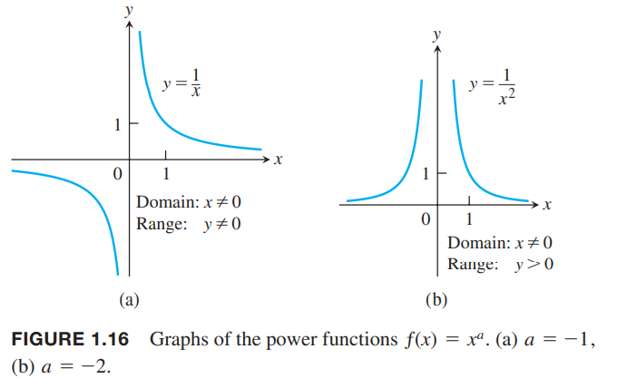

3. 当 $a=\frac12,\frac13,\frac32,\frac23$ 时，$f(x)=x^{1/2}=\sqrt{x}$ 和 $g(x)=x^{1/3}=\sqrt[3]{x}$ 分别为平方根函数和立方根函数。平方根函数的定义域是 $[0,\infty)$，立方根函数的定义域是实数集；并且 $x^{3/2}=(x^{1/2})^3$、$x^{2/3}=(x^{1/3})^2$。

   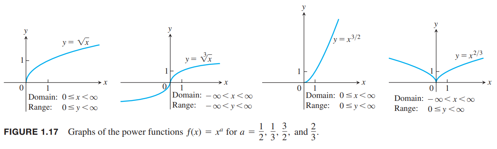

多项式函数（`polynomial function`）形如

$$p(x)=a_nx^n+a_{n-1}x^{n-1}+\cdots+a_1x+a_0,$$

其中 $n$ 是非负整数，$a_0,a_1,\ldots,a_n$ 是实数，称为系数（`coefficients`）。所有多项式函数的定义域都是实数集。若 $a_n\neq0$，则 $n$ 称为多项式的次数（`degree`）。$m\neq0$ 的线性函数是一次多项式；二次函数形如 $p(x)=ax^2+bx+c$，三次函数形如 $p(x)=ax^3+bx^2+cx+d$。第四章将研究如何绘制多项式图像。

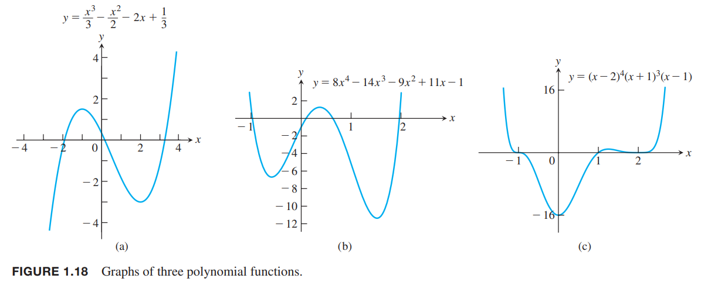

有理函数（`rational function`）是两个多项式之比：

$$f(x)=\frac{p(x)}{q(x)}.$$

其定义域是使 $q(x)\neq0$ 的所有实数 $x$。

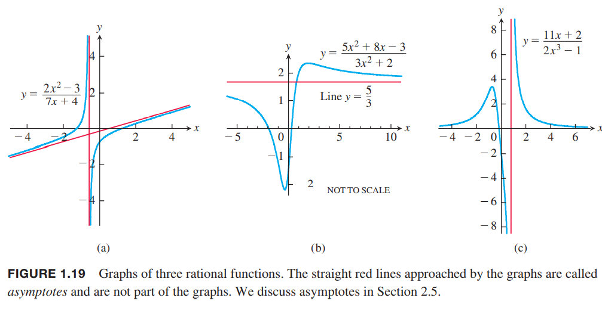

由多项式函数通过加、减、乘、除和开方等代数运算得到的函数称为代数函数（`algebraic function`）。所有有理函数都是代数函数；第 3.7 节中形如 $y^3-9xy+x^3=0$ 的更复杂函数也是代数函数。

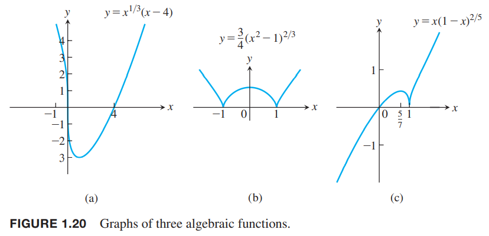

三角函数将在第 1.3 节复习。下图是最常用的正弦函数和余弦函数。

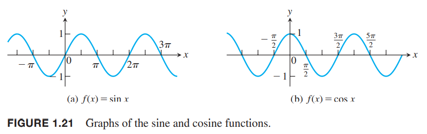

指数函数（`exponential function`）形如 $f(x)=a^x$，其中 $a>0$ 且 $a\neq1$；$a$ 称为底数。其定义域是实数集，值域为 $(0,\infty)$，故函数值永不为零。第 1.4 节将详细讨论指数函数。

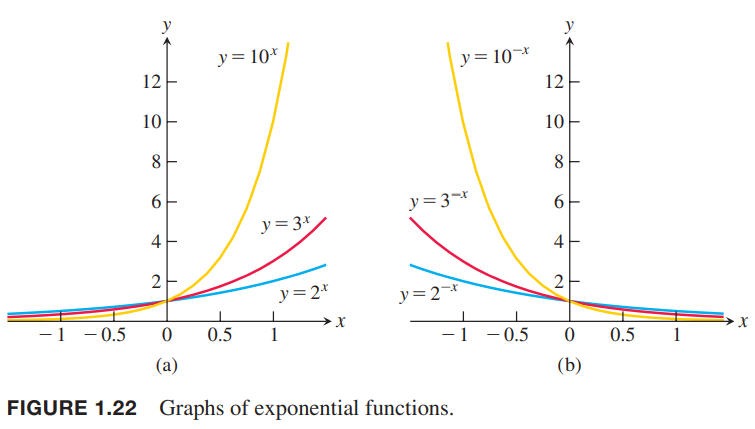

对数函数（`logarithmic function`）形如 $f(x)=\log_a x$，其中 $a>0$ 且 $a\neq1$。它是指数函数的反函数（`inverse function`）。其定义域为 $(0,\infty)$，值域为 $(-\infty,\infty)$；第 1.5 节将详细讨论对数函数。

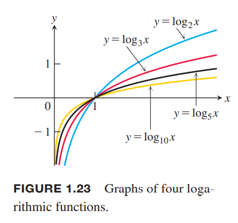

不是代数函数的函数称为超越函数（`transcendental function`），包括三角函数、反三角函数、指数函数和对数函数等。悬链线（`catenary`）也是超越函数；它描述电线悬挂于两个铁塔之间、在重力作用下自然下垂时的形状。

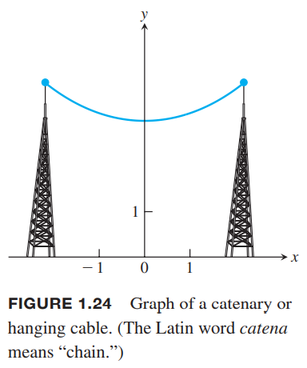

### 习题

45. $y=-x^{3/2}=-\sqrt{x^3}$ 含平方根，故定义域为 $[0,\infty)$。它在该定义域上递减；因为指数 $3/2>1$，其下降会越来越陡。

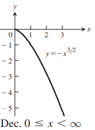

47. 任意常函数都是偶函数，因为它满足 $f(x)=f(-x)$，图像关于 $y$ 轴对称。
