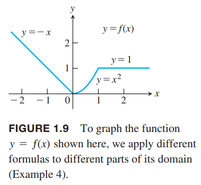

函数是描述真实世界的数学工具。一个函数可以用方程、图、数值表或者文字描述来表示。

### 函数；定义域和值域
变量$y$的值，取决于另一个变量$x$的值，那么我们说$y$是$x$的函数，记作
$$
y=f(x)
$$
$f$表示函数，自变量$x$(`independent variable`)表示$f$的输入，因变量$y$(`dependent variable`)表示$f$的输出。

**定义** 函数(`function`)在集合$D$和$Y$之上建立了一个对应关系，$Y$中有唯一(`unique`)的值$y(x)$对应于$D$中的每一个$x$。

所有输入值的集合$D$是函数的定义域(`domain`)，所有$x$对应的输出$f(x)$的集合是函数的值域(`range`)。值域不必包含$Y$的每一个元素。定义域和值域可以是任意对象的集合，不过微积分中，它们往往是实数集，表示线上的点，或者是平面、空间的点。  
通常，使用公式表示的函数描述了给定一个输入如何计算输出。比如$A=\pi r^2$是计算已知半径$r$如何计算圆的面积$A$。当定义一个函数$y=f(x)$，但是没有显式的指定定义域或者上下文没有对其有约束，那么定义域是所有能够使$y$是实数的$x$的值的集合，这也被称为自然定义域(`natural domain`)。如果我们想要限制定义域的话，需要显式指定。比如，$y=x^2$的定义域是实数集，可以限制其是正数集合$y=x^2,x>0$。  
改变定义域的同时，值域通常也会发生变化。$y=x^2$的值域是$[0, \infty)$，而$y=x^2,x\geq 2$的值域是$[4, \infty)$，也可以写作$\{x^2|x\geq 2\}$或$\{y|y\geq 4\}$。  
当一个函数的值域是实数时，被称为实值函数(`real-valued`)。我们这里研究的大部分实值函数的定义域和值域往往是一个区间或多个区间。有时，函数的值域是不太容易找到的。  
函数$f$就像是一个机器一样，把输入$x$放进入，产出输出$f(x)$。计算器上的函数键就是实例。比如我们输入一个非负数$x$，然后按$\sqrt{x}$键，就会得到它的输出，平方根。  
函数也可以如下图表示成箭头图(`arrow diagram`)。每一个箭头将$D$中的一个元素和$Y$中的一个元素关联起来。比如下图就是把$f(a)$关联到$a$，$f(x)$关联到$x$等等。值得注意的是，不同值可以对应到同一个输出值上（比如这里的$f(a)$），但是每一个输入$x$只能有一个输出$f(x)$。  

例1：验证以下函数的定义域和值域。$x$的定义域是使得公式有意义。

| 函数 | 定义域（$x$） | 值域（$y$） |
|--|--|--|
| $y=x^2$ | $(-\infty, \infty)$ | $[0, \infty)$ |
| $y=1/x$ | $(-\infty, 0)\cup (0, \infty)$ | $(-\infty, 0)\cup (0, \infty)$ |
| $y=\sqrt{x}$ | $[0, \infty)$ | $[0, \infty)$ |
| $y=\sqrt{4-x}$ | $(-\infty, 4]$ | $[0, \infty)$ |
| $y=\sqrt{1-x^2}$ | $[-1, 1]$ | $[0, 1]$ |

解：$y=x^2$，对于任意实数$x$，都有一个实数$y$与之对应，所以定义域是$(-\infty, \infty)$，任意实数的平方是非负数并且，每一个非负数$y$都是它的平方根的平方，即$y=(\sqrt{y})^2$。  
除了$x\neq 0$之外，每一个$x$都有一个$y$对应。被除数不能为零。$y=1/x$的值域是所有非零实数的倒数，也是非零实数，这是因为$y=1/(1/y)$，对于$y\neq 0$，数$x=1/y$是对应输出$y$的输入。  
对于方程$y=\sqrt{x}$，如果$x\geq 0$，那么就有一个实数$y$与之对应。因为每一个非负数是某个数的平方根（其实就是自身平方的平方根），所以$y$的值域是$[0, \infty)$。

$4-x$不能是负数，所以定义域是$x\leq 4$。值域仍旧是所有的非负数。  
$1-x^2\geq 0$，所以$-1\leq x\leq 1$。在这个范围以外，平方根不是实数。$1-x^2$的范围就是$[0, 1]$，值域也是同样的区间。

### 函数的图像
$f$是定义在定义域$D$的函数，其输入输出对对应笛卡尔平面上的点，这些点组成了它的图像。使用集合方式表示
$$
\{(x, f(x))|x\in D\}
$$
函数$f(x)=x+2$的图像如下所示  
  
函数图像时非常有用的工具。如果$(x, y)$是图像上的一个点，那么$y=f(x)$是从点$x$开始往上或者向下的高度。高度可能是正，也可能是负数，取决于$f(x)$的符号。示意图如下  
  
例2：画出$y=x^2$在区间$[-2, 2]$的图像。  
解：首先列出一些满足$y=x^2$的$xy$对，如下：

| $x$ | $y=x^2$ |
|--|--|
| -2 | 4 |
| -1 | 1 |
| 0 | 0 |
| 1 | 1 |
| $\frac{3}{2}$ | $\frac{9}{4}$ |
| 2 | 4 |

然后将这些点画到坐标系中，最后用光滑的曲线将它们连起来。如下图所示  
  
那么图像为什么不是下面这两种情况呢？  
  
可以画更多的点。但是没有解决本质问题：如何连接两个点？为什么看起来是图1.5的样子？微积分就是回答这个问题的，到第四章会分析这个问题。现在需要做的就是尽可能让曲线光滑。

### 数值表示法
除了代数和图像之外，还可以用数值的方法表示一个函数。工程方面经常使用这种方法。使用例2的方法可以得到函数的图像（往往需要计算机辅助）。只包含表中的点的图称为散点图（`scatterplot`）。  
例3：下面表中的数据记录着音叉产生的压力波的压强和对应的时间。表本身表示压强随时间变化的函数。先描绘散点图，连接这些点能得到一个图像。

| 时间 | 压强 |
|--|--|
| 0.00091 | -0.080 |
| 0.00108 | 0.200 |
| 0.00125 | 0.480 |
| 0.00144 | 0.693 |
| 0.00162 | 0.816 |
| 0.00180 | 0.844 |
| 0.00198 | 0.771 |
| 0.00216 | 0.603 |
| 0.00234 | 0.368 |
| 0.00253 | 0.099 |
| 0.00271 | -0.141 |
| 0.00289 | -0.309 |
| 0.00307 | -0.348 |
| 0.00325 | -0.248 |
| 0.00344 | -0.041 |
| 0.00362 | 0.217 |
| 0.00379 | 0.480 |
| 0.00398 | 0.681 |
| 0.00416 | 0.810 |
| 0.00435 | 0.827 |
| 0.00453 | 0.749 |
| 0.00471 | 0.581 |
| 0.00489 | 0.346 |
| 0.00507 | 0.077 |
| 0.00525 | -0.164 |
| 0.00543 | -0.320 |
| 0.00562 | -0.354 |
| 0.00579 | -0.248 |
| 0.00598 | -0.035 |

### 垂直线测试
不是所有坐标平面上的图都是函数。对于每一个$x$，函数$f$只能有一个$f(x)$与之对应，所以没有垂线和图能产生两个交点。$a$在$f$作用域中，那么垂线$x=a$和$f$的图像交点是$(a, f(a))$。  
圆不是函数，因为一些垂线和图像有两个交点。如下图的（a）所示。但是它包含两个函数，上半圆是函数$f(x)=\sqrt{1-x^2}$和下半圆$g(x)=-\sqrt{1-x^2}$，分别如下图的（b）和（c）所示。  

### 分段函数
一些函数在定义域不同的区间上定义不同的公式。一个例子是绝对值函数（`absolute value function`）。
$$|x|=\begin{cases}
x,&x\geq 0\\
-x,&x<0
\end{cases}$$
图像如下所示：  
  
例4 函数
$$f(x)=\begin{cases}
-x,&x<0\\
x^2,&0\leq x\leq 1\\
1,&x>1
\end{cases}$$
定义在整个实数集上的函数，根据$x$的不同，$f$用不同的公式来表示。不过要注意，这个函数是一个函数而不是三个函数。图像如下：  
  
例5 对于任意$x$，函数$f$的值是最大的小于等于$x$的整数，称为最大整数函数（`greatest integer function`）或向下取整函数（`integer floor function`）。记作$\lfloor x\rfloor$。举几个具体的例子
$$\lfloor 2.4\rfloor=2, \lfloor 1.9\rfloor=1, \lfloor 0\rfloor=0, \lfloor -1.2\rfloor=-2$$
$$\lfloor 2\rfloor=2, \lfloor 0.2\rfloor=0, \lfloor -0.3\rfloor=-1, \lfloor -2\rfloor=-2$$
图像如下图所示：  
  
例6 对于任意$x$，函数$f$的值是最小的大于等于$x$的整数，称为最小整数函数（`least integer function`）或向上取整函数（`integer ceiling function`）。记作$\lceil x\rceil$。如下图所示。对于正数$x$而言，这个函数可以表示每小时收取一块钱的停车场的停车费，不足一小时按一小时记。  

### 递增函数和递减函数
如果从左往右，函数的图像总是向上爬，那么称为递增函数；反之，图像一直向下降，称为递减函数。

**定义** $f$是定义在区间$I$上的函数，$x_1,x_2$是区间$I$上不同的两点。
1. 如果$f(x_2)>f(x_1), x_1<x_2$，那么$f$在$I$上是递增的；
2. 如果$f(x_1)>f(x_2), x_1<x_2$，那么$f$在$I$上是递减的。

递增或者递减对区间$I$的每一对$x_1<x_2$都满足相应的条件。这里我们使用$<$而不是$\leq$，表示$f$在区间$I$上是严格递增或者严格递减。区间$I$可以是有限的，也可以是无限的。  
例7 图像1.9表示的函数，在$(-\infty, 0)$上是递减的，在$(0, 1)$上是递增的，在$(1, \infty)$上既不递增，也不递减，是常数。定义中严格的不等于在区间$(1, \infty)$上是不成立的。

### 偶函数和奇函数：对称
奇函数和偶函数的图像有特殊的对称性。

**定义** 函数$y=f(x)$对定义域的任意$x$都满足$f(x)=-f(-x)$的话，是奇函数（`odd function`），如果满足$f(x)=f(-x)$是偶函数（`even function`）

偶和奇来自$x$的幂。如果$x$的幂次是偶数，比如$y=x^2,y=x^4$，那么$x^2=(-x)^2,x^4=(-x)^4$，是偶函数；如果$x$的幂次是奇数，比如$y=x,y=x^4$，那么$x=-(-x),x^3=-(-x)^3$，是奇函数。  
偶函数关于$y$轴对称。由于$f(x)=f(-x)$，那么点$(x,y)$在图像上等价于点$(-x,y)$在图像上。如下图（a）所示。偶函数图像以$y$轴旋转图像不变。  
奇函数是关于原点对称的。由于$f(x)=-f(-x)$，那么点$(x,y)$在图像上等价于点$(-x,-y)$也在图像上。如下图（b）所示。奇函数图像绕原点旋转180度图像不变。  
注意，定义隐含$x,-x$都在定义域上这一条件。  
  
例8 下面是一些关于奇偶函数的示例。

|  |  |
|--|--|
| $f(x)=x^2$ | 偶函数，关于$y$轴对称。 |
| $f(x)=x^2+1$ | 偶函数。如下图（a）。 |
| $f(x)=x$ | 奇函数，关于原点对称。 |
| $f(x)=x+1$ | 既不是奇函数也不是偶函数。如下图（b）。 |

### 常用函数
线性函数 形如$f(x)=mx+b$，其中$m,b$都是固定常量，称为线性函数（`linear function`）。下图（a）是一组$f(x)=mx$的图像，每一个函数都有$b=0$，都通过原点。函数$f(x)=x$的$m=1,b=0$，是恒等函数（`identity function`）。$m=0$是常值函数，如下图（b）所示。  

**定义** 两个变量$x,y$，其中一个总是另一个的固定倍数，即$y=kx,k\neq 0$，那么$x,y$是成比例的（`proportional`）。

如果$y$和$x$的倒数$1/x$成比例，那么我们说$y$与$x$成反比。  
幂函数 $f(x)=x^a$，$a$是常数，称为幂函数（`power function`）。  
下面是一些重要的实例。  
（a）$f(x)=x^a, a=n$，$a$是正整数。  
下图是$n=1,2,3,4,5$时$f(x)=x^n$的图像。定义域是所有实数。$n$越大，$(-1,1)$区间上的曲线也平坦，$|x|>1$上的曲线越陡峭。每条曲线都通过原点和点$(1,1)$。偶数次幂就是偶函数，奇数次幂就是奇函数。偶函数在$(-\infty, 0]$上递减并且在$[0,\infty)$上递增，奇函数在整个定义域$(-\infty,\infty)$都是递增的。  

（b）$f(x)=x^a$，$a=-1$或$a=-2$  
$f(x)=x^{-1}=1/x,g(x)=x^{-2}=1/x^2$的图像如下图所示。定义域均是$x\neq 0$。$y=1/x$的图象是双曲线$xy=1$，离原点越远则越接近坐标轴，$y=1/x^2$类似。函数$f$是奇函数，在两个区间$(-\infty,0),(0,\infty)$递增，函数$g$是偶函数，在$(-\infty,0)$上递增而在$(0,\infty)$上递减。  
  
（c）$a=\frac{1}{2},\frac{1}{3},\frac{3}{2},\frac{2}{3}$  
函数$f(x)=x^{1/2}=\sqrt{x}, g(x)=x^{1/3}=\sqrt[3]{x}$是平方根和立方根函数。平方根的定义域是$[0,\infty)$，立方根的定义域是实数集。图像如下图所示，$x^{3/2}=(x^{1/2})^3, x^{2/3}=(x^{1/3})^2$。  
  
多项式 下面的函数$p$是多项式函数（`polynomial`）
$$p(x)=a_nx^n+a_{n-1}x^{n-1}+\cdots+a_1x+a_0$$
$n$是非负整数，$a_0,a_1,a_2,\cdots,a_n$是实数，称为多项式的系数（`coefficients`）。所有的多项式函数的定义域都是实数集。$a_n\neq 0$，那么$n$称为多项式的次数（`degree`）。$m\neq 0$的线性函数是次数为1的多项式。次数2的多项式是$p(x)=ax^2+bx+c$，二次函数。类似的，三次函数是$p(x)=ax^3+bx^2+cx+d$。下图是三个多项式函数。第四章将分析如何绘制多项式图像。  
  
有理函数 有理函数（`rational function`）是两个多项式之比$f(x)=\frac{p(x)}{q(x)}$，其中$p,q$都是多项式。有理函数的定义域是所有使$q(x)\neq 0$的实数$x$的集合。下图是一些有理函数的图像。  
  
代数函数 多项式函数通过代数操作（加减乘除、开方）运算得到的函数，是代数函数（`algebraic function`）。所有的有理函数都是代数函数，也包括3.7节形如$y^3-9xy+x^3=0$这样的更复杂的函数。下图是三个代数函数的例子。  
  
三角函数 1.3节会复习六种基本的三角函数。下图是最常用的正弦和余弦函数。  
  
指数函数 指数函数（`exponential function`）的形式是$f(x)=a^x,a>0,a\neq 0$。$a$被称为底数。所有指数函数的定义域都是实数集，值域是$(0, \infty)$，也就是说指数函数的值永远不会是0。1.4节会详细讨论指数函数。下图是一些指数函数的图像。  
  
对数函数 对数函数（`logarithmic function`）的形式是$f(x)=\log_a x,a\neq 1$。对数函数是指数函数的反函数（`inverse function`）。1.5节会详细讨论指数函数。下图是四种不同底数的对数函数。对数函数的定义域是$(0,\infty)$，值域是$(-\infty, \infty)$。  
  
超越函数 不是代数函数的函数就是超越函数（`transcendental function`），包括三角函数、反三角函数、指数函数、对数函数等等。悬链线（`catenary`）就是一种超越函数。图像是一根电线挂在两个铁塔上，靠重力自然下坠。7.3节会讨论这种函数。  

### 习题
45 $y=-x^{3/2}=-\sqrt{x^3}$由于有开平方的操作，所以定义域是$[0, \infty)$，图像如下，在定义域上是递减的，因为$3/2>1$，所以变化是越来越陡的  
  
47 任意常值函数都是偶函数，满足$f(x)=f(-x)$，图像关于$y$轴对称。
