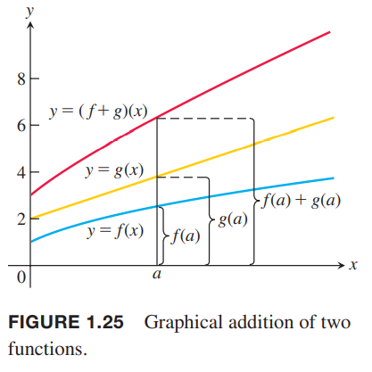
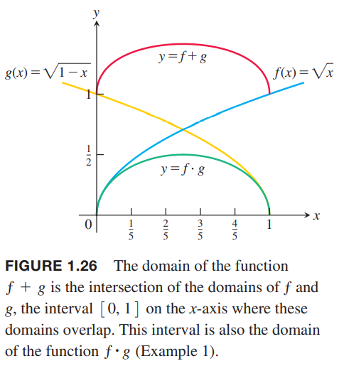
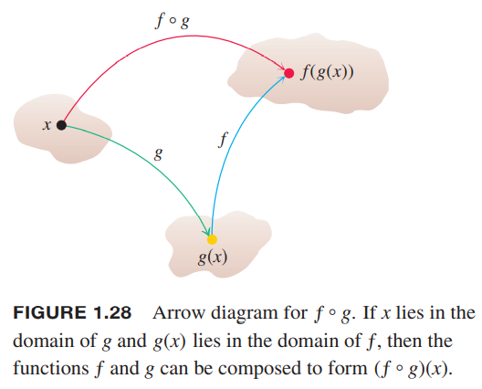
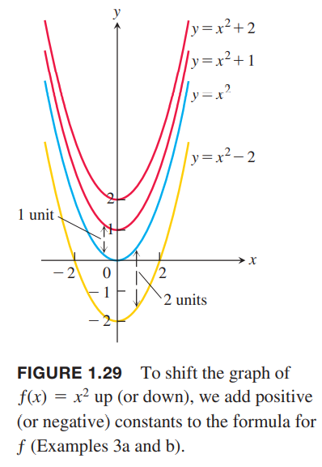
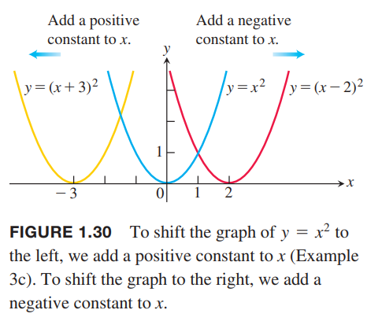
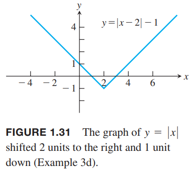
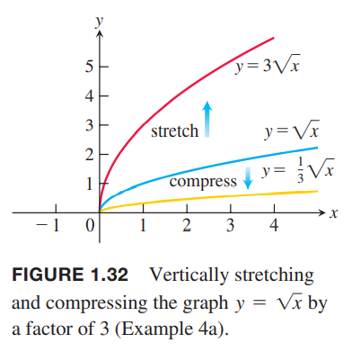
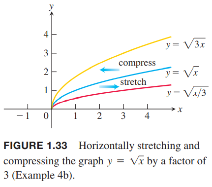
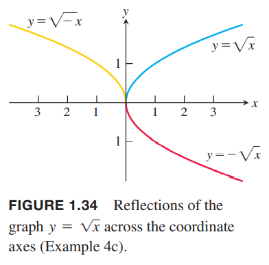
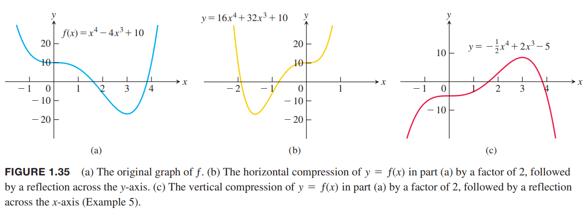

### 和、差、积、商
和数字一样，也可以做加减乘除运算，同样，除数不能是零。如果$f,g$是函数，对于任意$x$属于$f$和$g$的作用域，即$x\in D(f)\cap D(g)$，那么函数$f+g,f-g,fg$定义如下：
$$(f+g)(x)=f(x)+g(x)$$
$$(f-g)(x)=f(x)-g(x)$$
$$(fg)(x)=f(x)g(x)$$
左边的加号是函数的加法运算符，右边的加号表示$f(x)$和$g(x)$两个实数相加。  
任意$D(f)\cap D(g)$中且使得$g(x)\neq 0$的$x$，定义函数$f/g$为
$$\frac{f}{g}(x)=\frac{f(x)}{g(x)},g(x)\neq 0$$
函数也能乘以一个常数。如果$c$是实数，函数$cf$的定义是任意$x$属于$f$的定义域有
$$(cf)(x)=cf(x)$$
例1 函数定义如下
$$f(x)=\sqrt{x},g(x)=\sqrt{1-x}$$
定义域$D(f)=[0,\infty),D(g)=(-\infty,1]$，定义域的交集为$[0, 1]$
下表总结了两个函数各种组合得到的函数及其定义域和公式

| Function | Formula | Domain |
|--|--|--|
| $f+g$ | $(f+g)(x)=\sqrt{x}+\sqrt{1-x}$ | $[0, 1]$ |
| $f-g$ | $(f-g)(x)=\sqrt{x}-\sqrt{1-x}$ | $[0, 1]$ |
| $g-f$ | $(g-f)(x)=\sqrt{1-x}-\sqrt{x}$ | $[0, 1]$ |
| $fg$ | $(fg)(x)=f(x)g(x)=\sqrt{x(1-x)}$ | $[0, 1]$ |
| $f/g$ | $\frac{f}{g}(x)=\frac{f(x)}{g(x)}=\sqrt{\frac{x}{1-x}}$ | $[0, 1)$ |
| $g/f$ | $\frac{g}{f}(x)=\frac{g(x)}{f(x)}=\sqrt{\frac{1-x}{x}}$ | $(0, 1]$ |

在定义域$D(f)\cap D(g)$上的任一点，$f+g$的图像是图像$f$和$g$在$y$上的值相加，如下图所示。  
  
下图是例1中$f+g$和$fg$的图像：  

### 复合函数
复合是另一种组合函数的方法。一个函数的输出是另一个函数的输入。

**定义** 如果$f,g$都是函数，那么复合函数（`composite function`）$f\circ g$定义是
$$(f\circ g)(x)=f(g(x))$$
$f\circ g$的定义域是$g$定义域的子集$x$，其中每个$x$使得$g(x)$属于$f$的定义域。

根据上述定义，$g$的值域在$f$的定义域内。先求$g(x)$，然后求$f(g(x))$。下图是符合函数的箭头图。  
  
符合函数$g\circ f$完全相反。先求$f(x)$，然后求$g(f(x))$。其定义域是函数$f$的定义域的子集中的$x$使得$f(x)$属于$g$的定义域。  
通常，$f\circ g$和$g\circ f$是两个不同的函数。  
例2 $f(x)=\sqrt{x},g(x)=x+1$，求  
（a）$(f\circ g)(x)$  
（b）$(g\circ f)(x)$  
（c）$(f\circ f)(x)$  
（d）$(g\circ g)(x)$  
解：  
（a）$(f\circ g)(x)=f(g(x))=\sqrt{g(x)}=\sqrt{x+1}$，定义域是$[-1, \infty)$  
（b）$(g\circ f)(x)=g(f(x))=f(x)+1=\sqrt{x}+1$，定义域是$[0, \infty)$  
（c）$(f\circ f)(x)=f(f(x))=\sqrt{f(x)}=\sqrt{\sqrt{x}}=x^{1/4}$，定义域是$[0, \infty)$  
（d）$(g\circ g)(x)=g(g(x))=g(x)+1=x+2$，定义域是$(-\infty, \infty)$  
第一个定义域为什么是$[-1, \infty)$，$g$的定义域是实数集，但是$g(x)=x+1$要满足$f$的定义域，也就是$x+1\geq 0$，所以$x\geq -1$。  
注意，如果$f(x)=x^2,g(x)=\sqrt{x}$，那么$(f\circ g)(x)=(\sqrt{x})^2=x$。但是定义域是$[0,\infty)$而不是$(-\infty, \infty)$，因为$\sqrt{x}$要求$x\geq 0$。

### 函数的平移
一种常见的从已知函数得到新函数的方法是加一个常量到已知函数输入或者输出上。旧函数图像水平或者垂直平移就能得到新函数的图像。  

**平移公式**  
垂直平移（`vertical shifts`）$y=f(x)+k$，如果$k>0$，那么图像上移$k$个单位长度，否则下移$k$个单位长度  
水平平移（`horizontal Shifts`）$y=f(x+h)$，如果$h>0$，那么图像左移$h$个单位长度，否则右移$h$个单位长度

例3  
（a）函数$y=x^2$右边加1，得到上移1个单位的函数$y=x^2+1$  
（b）函数$y=x^2$右边加-2，得到下移2个单位的函数$y=x^2-2$  
函数图像如下所示：  
  
（c）函数$y=x^2$的$x$加3，得到$y=(x+3)^2$，图像左移3个单位；$x$加-2，得到$y=(x-2)^2$，图像右移2个单位。图像如下所示  
  
（d）函数$y=|x|$的$x$加-2，然后在结果上加-1，得到$y=|x-2|-1$，函数图像先右移2个单位再向下移动1个单位。图像如下所示  

### 函数图像的伸缩变换和翻转
对$y=f(x)$的图像做伸缩变换是指在水平方向或者垂直方向压缩或者拉伸，具体操作是对$f$的结果或者自变量$x$乘以一个常量$c$。如果$c=-1$，结果就是水平或者垂直翻转图像。

**伸缩变换规则**  
$c>1$，图像拉伸的  
$y=cf(x)$，图像垂直方向拉伸$c$倍  
$y=\frac{1}{c}f(x)$，图像垂直方向压缩$c$倍  
$y=f(cx)$，图像水平方向压缩$c$倍  
$y=f(\frac{1}{c}x)$，图像水平方向拉伸$c$倍  
$c=-1$，图像翻转  
$y=-f(x)$，图像沿$x$轴翻转  
$y=f(-x)$，图像沿$y$轴翻转

例4 对$y=\sqrt{x}$的图像进行伸缩和翻转  
（a）垂直：$y=\sqrt{x}$右边乘以3得到$y=3\sqrt{x}$，函数图像的高度拉伸三倍；相反乘以1/3的话图像压缩三倍。如下图所示：  
  
（b）水平：$y=\sqrt{3x}$图像是将$y=\sqrt{x}$的图像水平压缩三倍；$y=\sqrt{x/3}$是水平拉伸三倍。如下图所示。从另一个角度看，$y=\sqrt{3x}=\sqrt{3}\sqrt{x}$，是将原图像在垂直方向拉伸$\sqrt{3}$，压缩变成了拉伸，且系数有变化。类似的，水平拉伸有时可以等效为垂直压缩，但是系数不同。  
  
（c）翻转：$y=-\sqrt{x}$的图像是将$y=\sqrt{x}$的图像沿$x$轴翻转，$y=\sqrt{-x}$的图像是沿$y$轴翻转。图像如下图所示：  
  
例5 已知函数$f(x)=x^4-4x^3+10$，图像如下图所示，求  
（a）水平压缩两倍然后沿$x$轴翻转  
（b）垂直压缩两倍然后沿$y$轴翻转  
  
解：
（a）水平压缩两倍，就是$x$乘以2，沿$x$轴翻转就是$x$乘以-1，所以最终$x$乘以-2得到新的函数
$$y=f(-2x)=(-2x)^4-4(-2x)^3+10=16x^4+32x^3+10$$
（b）类似的
$$y=-\frac{1}{2}f(x)=-\frac{1}{2}x^4+2x^3-5$$
