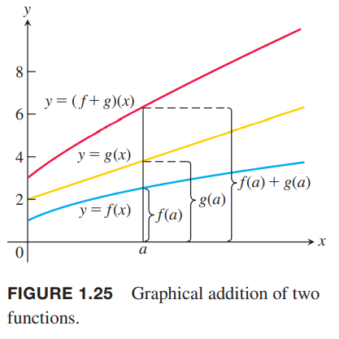
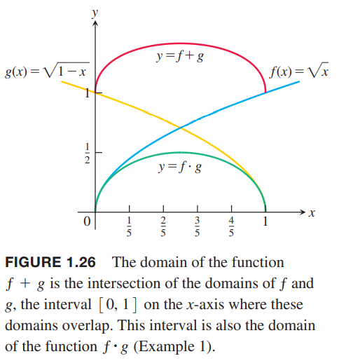
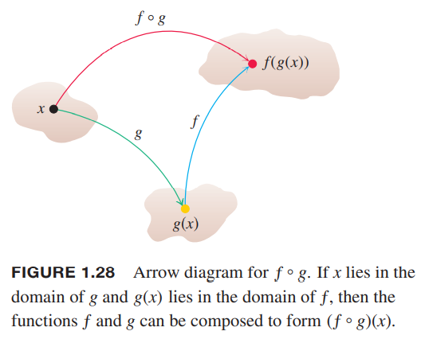
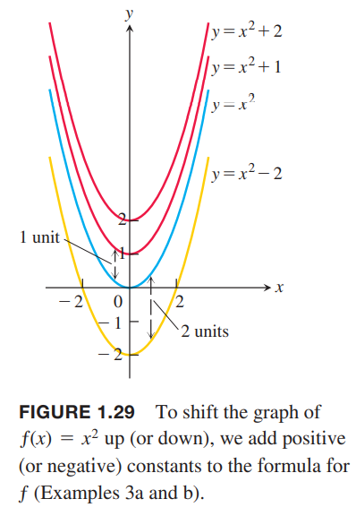
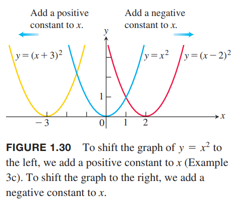
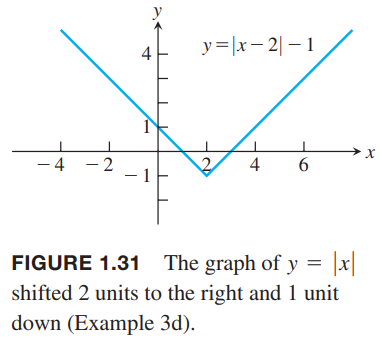
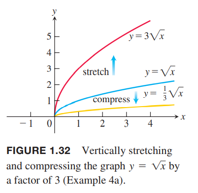
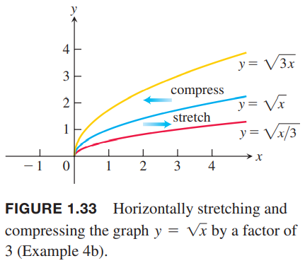
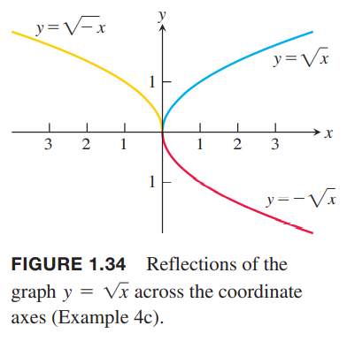
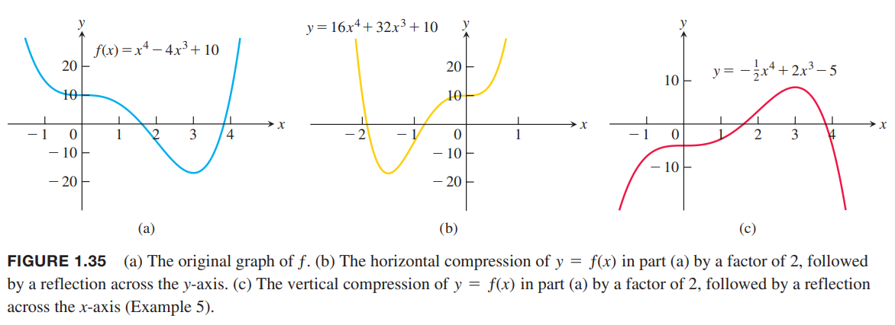

### 和、差、积、商

函数和数一样可以进行加、减、乘、除运算；除法中除数不能为零。若 $f,g$ 是函数，则对每个 $x\in D(f)\cap D(g)$，定义

$$
\begin{aligned}
(f+g)(x)&=f(x)+g(x),\\
(f-g)(x)&=f(x)-g(x),\\
(fg)(x)&=f(x)g(x).
\end{aligned}
$$

左边的加号是函数加法运算符，右边的加号表示两个实数 $f(x)$ 和 $g(x)$ 相加。对每个 $x\in D(f)\cap D(g)$ 且 $g(x)\neq0$，定义

$$\left(\frac{f}{g}\right)(x)=\frac{f(x)}{g(x)}.$$

函数也可乘以常数。若 $c$ 是实数，则函数 $cf$ 在 $D(f)$ 上定义为

$$(cf)(x)=c f(x).$$

例 1：设

$$f(x)=\sqrt{x},\qquad g(x)=\sqrt{1-x}.$$

求各种组合函数及其定义域。

解：$D(f)=[0,\infty)$，$D(g)=(-\infty,1]$，故 $D(f)\cap D(g)=[0,1]$。

| 函数 | 公式 | 定义域 |
|:--|:--|:--|
| $f+g$ | $(f+g)(x)=\sqrt{x}+\sqrt{1-x}$ | $[0,1]$ |
| $f-g$ | $(f-g)(x)=\sqrt{x}-\sqrt{1-x}$ | $[0,1]$ |
| $g-f$ | $(g-f)(x)=\sqrt{1-x}-\sqrt{x}$ | $[0,1]$ |
| $fg$ | $(fg)(x)=\sqrt{x(1-x)}$ | $[0,1]$ |
| $f/g$ | $\left(\dfrac{f}{g}\right)(x)=\sqrt{\dfrac{x}{1-x}}$ | $[0,1)$ |
| $g/f$ | $\left(\dfrac{g}{f}\right)(x)=\sqrt{\dfrac{1-x}{x}}$ | $(0,1]$ |

在 $D(f)\cap D(g)$ 的每一点，$f+g$ 的函数值等于 $f$ 和 $g$ 的函数值之和。

下图给出例 1 中 $f+g$ 和 $fg$ 的图像。

### 复合函数

复合是组合函数的另一种方法：一个函数的输出作为另一个函数的输入。

**定义**
> 若 $f,g$ 都是函数，则复合函数（`composite function`）$f\circ g$ 定义为
>
> $$(f\circ g)(x)=f(g(x)).$$
>
> 其定义域是所有满足 $x\in D(g)$ 且 $g(x)\in D(f)$ 的 $x$ 的集合。

先求 $g(x)$，再求 $f(g(x))$。下图是复合函数的箭头图。

复合函数 $g\circ f$ 的顺序相反：先求 $f(x)$，再求 $g(f(x))$。它的定义域是所有满足 $x\in D(f)$ 且 $f(x)\in D(g)$ 的 $x$ 的集合。通常，$f\circ g$ 和 $g\circ f$ 是不同的函数。

例 2：设 $f(x)=\sqrt{x}$，$g(x)=x+1$。求：

1. $(f\circ g)(x)$；
2. $(g\circ f)(x)$；
3. $(f\circ f)(x)$；
4. $(g\circ g)(x)$。

解：

1. $(f\circ g)(x)=f(g(x))=\sqrt{g(x)}=\sqrt{x+1}$，定义域为 $[-1,\infty)$；
2. $(g\circ f)(x)=g(f(x))=f(x)+1=\sqrt{x}+1$，定义域为 $[0,\infty)$；
3. $(f\circ f)(x)=f(f(x))=\sqrt{\sqrt{x}}=x^{1/4}$，定义域为 $[0,\infty)$；
4. $(g\circ g)(x)=g(g(x))=g(x)+1=x+2$，定义域为 $(-\infty,\infty)$。

第一项的定义域是 $[-1,\infty)$，因为虽然 $g$ 的定义域是实数集，但 $g(x)=x+1$ 必须属于 $f$ 的定义域，即 $x+1\geq0$。

注意，若 $f(x)=x^2$、$g(x)=\sqrt{x}$，则

$$(f\circ g)(x)=(\sqrt{x})^2=x,$$

但它的定义域仍是 $[0,\infty)$，而不是 $(-\infty,\infty)$，因为 $\sqrt{x}$ 要求 $x\geq0$。

### 函数的平移

从已知函数构造新函数的常用方法，是在输入或输出中加一个常量。新函数的图像可由旧函数的图像水平或垂直平移得到。

**平移规则**
> 对函数 $y=f(x)$：
>
> - $y=f(x)+k$：若 $k>0$，图像上移 $k$ 个单位；若 $k<0$，图像下移 $|k|$ 个单位；
> - $y=f(x+h)$：若 $h>0$，图像左移 $h$ 个单位；若 $h<0$，图像右移 $|h|$ 个单位。

例 3：说明下列函数图像如何由 $y=x^2$ 或 $y=|x|$ 平移得到。

1. $y=x^2+1$ 是 $y=x^2$ 向上平移 1 个单位；
2. $y=x^2-2$ 是 $y=x^2$ 向下平移 2 个单位。

3. $y=(x+3)^2$ 是 $y=x^2$ 向左平移 3 个单位，$y=(x-2)^2$ 是向右平移 2 个单位。

4. $y=|x-2|-1$ 是 $y=|x|$ 先向右平移 2 个单位，再向下平移 1 个单位。

### 函数图像的伸缩和翻转

对 $y=f(x)$ 的图像进行伸缩，指在水平方向或垂直方向压缩或拉伸；相应地对函数值或自变量乘以常数。乘以 $-1$ 则产生翻转。

**伸缩和翻转规则**
> 设 $c>1$。对函数 $y=f(x)$：
>
> - $y=cf(x)$：图像在垂直方向拉伸 $c$ 倍；
> - $y=\dfrac{1}{c}f(x)$：图像在垂直方向压缩为原来的 $\dfrac{1}{c}$；
> - $y=f(cx)$：图像在水平方向压缩为原来的 $\dfrac{1}{c}$；
> - $y=f\left(\dfrac{x}{c}\right)$：图像在水平方向拉伸 $c$ 倍；
> - $y=-f(x)$：图像关于 $x$ 轴翻转；
> - $y=f(-x)$：图像关于 $y$ 轴翻转。

例 4：对 $y=\sqrt{x}$ 的图像进行伸缩和翻转。

1. 垂直变换：$y=3\sqrt{x}$ 将图像在垂直方向拉伸 3 倍；$y=\frac13\sqrt{x}$ 将图像在垂直方向压缩为原来的 $\frac13$。

2. 水平变换：$y=\sqrt{3x}$ 将图像在水平方向压缩为原来的 $\frac13$；$y=\sqrt{x/3}$ 将图像在水平方向拉伸 3 倍。注意，$\sqrt{3x}=\sqrt3\sqrt{x}$，因此第一个水平压缩也等价于垂直拉伸 $\sqrt3$ 倍。

3. 翻转：$y=-\sqrt{x}$ 是 $y=\sqrt{x}$ 关于 $x$ 轴的翻转；$y=\sqrt{-x}$ 是其关于 $y$ 轴的翻转。

例 5：已知 $f(x)=x^4-4x^3+10$，其图像如下。求：

1. 先水平压缩为原来的一半，再关于 $x$ 轴翻转后的函数；
2. 先垂直压缩为原来的一半，再关于 $y$ 轴翻转后的函数。

解：

1. 水平压缩为原来的一半对应以 $2x$ 替换 $x$，再关于 $x$ 轴翻转，故

   $$
   \begin{aligned}
   y&=-f(2x)\\
   &=-(2x)^4+4(2x)^3-10\\
   &=-16x^4+32x^3-10.
   \end{aligned}
   $$

2. 垂直压缩为原来的一半对应乘以 $\frac12$，再关于 $y$ 轴翻转，故

   $$y=\frac12f(-x)=\frac12x^4+2x^3+5.$$
