### 角

角可以用度（`degree`）或弧度（`radian`）表示。如图所示，半径为 $r$ 的圆中，圆心角 $A'CB'$ 所对弧长为 $s$。若用 $\theta$ 表示该圆心角的弧度数，则

$$\theta=\frac{s}{r},\qquad s=r\theta.\tag{1}$$

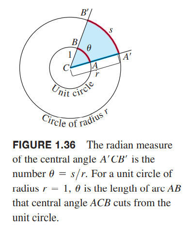

对半径 $r=1$ 的单位圆，弧度数 $\theta$ 就是相应弧长。一个周角为 $360^\circ$，也为 $2\pi$ 弧度，因此

$$\pi\text{ radians}=180^\circ.\tag{2}$$

$$
1\text{ radian}=\frac{180}{\pi}^\circ\approx57.3^\circ,\qquad
1^\circ=\frac{\pi}{180}\text{ radians}\approx0.017\text{ radians}.
$$

下表列出一些常用角的对应关系。

| 度数 | $-180^\circ$ | $-135^\circ$ | $-90^\circ$ | $-45^\circ$ | $0^\circ$ | $30^\circ$ | $45^\circ$ | $60^\circ$ | $90^\circ$ | $120^\circ$ | $135^\circ$ | $150^\circ$ | $180^\circ$ | $270^\circ$ | $360^\circ$ |
|:--|--:|--:|--:|--:|--:|--:|--:|--:|--:|--:|--:|--:|--:|--:|--:|
| 弧度 | $-\pi$ | $-\frac{3\pi}{4}$ | $-\frac{\pi}{2}$ | $-\frac{\pi}{4}$ | $0$ | $\frac{\pi}{6}$ | $\frac{\pi}{4}$ | $\frac{\pi}{3}$ | $\frac{\pi}{2}$ | $\frac{2\pi}{3}$ | $\frac{3\pi}{4}$ | $\frac{5\pi}{6}$ | $\pi$ | $\frac{3\pi}{2}$ | $2\pi$ |

若一个角的顶点在坐标系原点，且其始边与 $x$ 轴正半轴重合，则称该角处于标准位置（`standard position`）。从 $x$ 轴逆时针旋转的角为正，顺时针旋转的角为负。

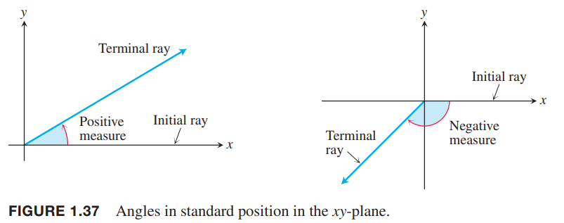

逆时针和顺时针旋转的角度大小都可以任意大，远超过 $2\pi$。

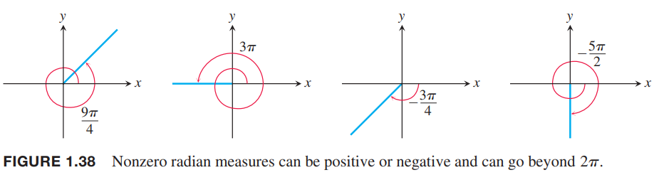

本书后面默认用弧度表示角，除非特别说明。提及 $\pi/3$ 时，指弧度数为 $\pi/3$ 的角，即 $60^\circ$，而不是 $\pi/3^\circ$。

### 六种基本三角函数

锐角的三角函数定义如下图所示。

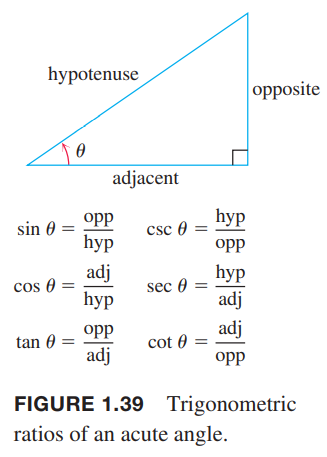

将角放在坐标系的标准位置，可以把三角函数定义扩展到钝角和负角。设角的终边与以原点为圆心、半径为 $r$ 的圆交于 $P(x,y)$，则

$$
\begin{aligned}
\text{sine}\quad&\sin\theta=\frac{y}{r}
&&\text{cosecant}\quad&\csc\theta=\frac{r}{y},\\
\text{cosine}\quad&\cos\theta=\frac{x}{r}
&&\text{secant}\quad&\sec\theta=\frac{r}{x},\\
\text{tangent}\quad&\tan\theta=\frac{y}{x}
&&\text{cotangent}\quad&\cot\theta=\frac{x}{y}.
\end{aligned}
$$

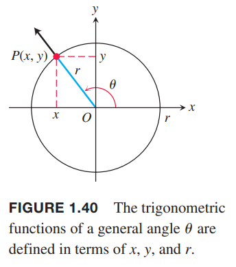

这个扩展定义与锐角时的定义一致。

**倒数与商关系**
> 在各式有意义时，
>
> $$
> \tan\theta=\frac{\sin\theta}{\cos\theta},\qquad
> \cot\theta=\frac{1}{\tan\theta},\qquad
> \sec\theta=\frac{1}{\cos\theta},\qquad
> \csc\theta=\frac{1}{\sin\theta}.
> $$

$\tan\theta$ 和 $\sec\theta$ 在 $\cos\theta=0$ 时无定义，即 $\theta=\frac{\pi}{2}+k\pi$（$k\in\mathbb Z$）。$\cot\theta$ 和 $\csc\theta$ 在 $\sin\theta=0$ 时无定义，即 $\theta=k\pi$（$k\in\mathbb Z$）。

由下图可得一些常用三角函数值：

$$
\begin{aligned}
&\sin\frac{\pi}{4}=\frac{1}{\sqrt2}
&&\sin\frac{\pi}{6}=\frac12
&&\sin\frac{\pi}{3}=\frac{\sqrt3}{2},\\
&\cos\frac{\pi}{4}=\frac{1}{\sqrt2}
&&\cos\frac{\pi}{6}=\frac{\sqrt3}{2}
&&\cos\frac{\pi}{3}=\frac12,\\
&\tan\frac{\pi}{4}=1
&&\tan\frac{\pi}{6}=\frac{1}{\sqrt3}
&&\tan\frac{\pi}{3}=\sqrt3.
\end{aligned}
$$

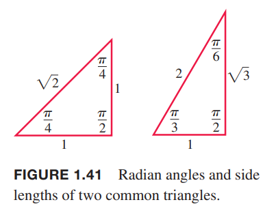

ASTC（如下图）可帮助记忆基本三角函数在各象限的正负。

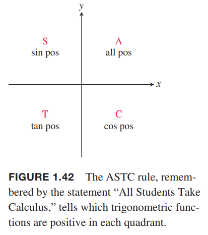

例如，由下图中的三角形可得

$$
\sin\frac{2\pi}{3}=\frac{\sqrt3}{2},\qquad
\cos\frac{2\pi}{3}=-\frac12,\qquad
\tan\frac{2\pi}{3}=-\sqrt3.
$$

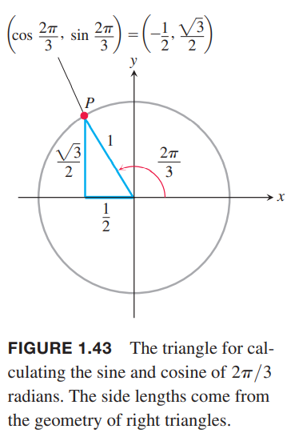

同样的方法可得下表。

| 度数 | $-180^\circ$ | $-135^\circ$ | $-90^\circ$ | $-45^\circ$ | $0^\circ$ | $30^\circ$ | $45^\circ$ | $60^\circ$ | $90^\circ$ | $120^\circ$ | $135^\circ$ | $150^\circ$ | $180^\circ$ | $270^\circ$ | $360^\circ$ |
|:--|--:|--:|--:|--:|--:|--:|--:|--:|--:|--:|--:|--:|--:|--:|--:|
| 弧度 | $-\pi$ | $-\frac{3\pi}{4}$ | $-\frac{\pi}{2}$ | $-\frac{\pi}{4}$ | $0$ | $\frac{\pi}{6}$ | $\frac{\pi}{4}$ | $\frac{\pi}{3}$ | $\frac{\pi}{2}$ | $\frac{2\pi}{3}$ | $\frac{3\pi}{4}$ | $\frac{5\pi}{6}$ | $\pi$ | $\frac{3\pi}{2}$ | $2\pi$ |
| $\sin\theta$ | $0$ | $-\frac{\sqrt2}{2}$ | $-1$ | $-\frac{\sqrt2}{2}$ | $0$ | $\frac12$ | $\frac{\sqrt2}{2}$ | $\frac{\sqrt3}{2}$ | $1$ | $\frac{\sqrt3}{2}$ | $\frac{\sqrt2}{2}$ | $\frac12$ | $0$ | $-1$ | $0$ |
| $\cos\theta$ | $-1$ | $-\frac{\sqrt2}{2}$ | $0$ | $\frac{\sqrt2}{2}$ | $1$ | $\frac{\sqrt3}{2}$ | $\frac{\sqrt2}{2}$ | $\frac12$ | $0$ | $-\frac12$ | $-\frac{\sqrt2}{2}$ | $-\frac{\sqrt3}{2}$ | $-1$ | $0$ | $1$ |
| $\tan\theta$ | $0$ | $1$ | 未定义 | $-1$ | $0$ | $\frac{\sqrt3}{3}$ | $1$ | $\sqrt3$ | 未定义 | $-\sqrt3$ | $-1$ | $-\frac{\sqrt3}{3}$ | $0$ | 未定义 | $0$ |

### 三角函数的周期和图像

角 $\theta$ 和 $\theta+2\pi$ 均处于标准位置时，终边恰好重合。因此六种基本三角函数均满足 $f(\theta+2\pi)=f(\theta)$；其中正切和余切还有更小的周期 $\pi$。

**定义**
> 若存在正数 $p$，使得对定义域中每个 $x$，$x+p$ 也在定义域中且 $f(x+p)=f(x)$，则称 $f$ 为周期函数。满足这些条件的最小正数 $p$ 称为 $f$ 的周期（`period`）。

画三角函数图像时，通常用 $x$ 代替 $\theta$。下图给出六种三角函数的图像。正切函数和余切函数的周期为 $\pi$，其余四种函数的周期为 $2\pi$。余弦函数和正割函数为偶函数，其余四种为奇函数。

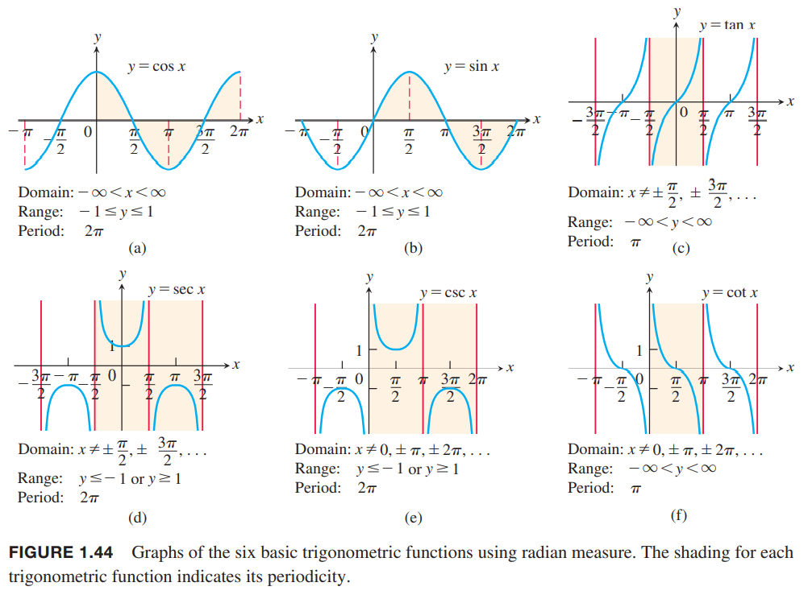

### 三角恒等式

平面上的任意点 $P(x,y)$ 可由它到原点的距离 $r$ 和 $OP$ 与 $x$ 轴正半轴的夹角 $\theta$ 表示。因为 $x/r=\cos\theta$、$y/r=\sin\theta$，所以

$$x=r\cos\theta,\qquad y=r\sin\theta.$$

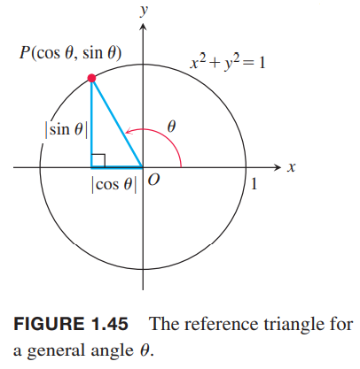

当 $r=1$ 时，由勾股定理得到

$$\cos^2\theta+\sin^2\theta=1.\tag{3}$$

这是对所有 $\theta$ 都成立的最常用三角恒等式。两边分别除以 $\cos^2\theta$ 和 $\sin^2\theta$，可得

$$
1+\tan^2\theta=\sec^2\theta,\qquad
1+\cot^2\theta=\csc^2\theta.
$$

**和差公式**
> 对任意角 $A,B$，
>
> $$
> \begin{aligned}
> \cos(A+B)&=\cos A\cos B-\sin A\sin B,\\
> \sin(A+B)&=\sin A\cos B+\cos A\sin B,\\
> \cos(A-B)&=\cos A\cos B+\sin A\sin B,\\
> \sin(A-B)&=\sin A\cos B-\cos A\sin B.
> \end{aligned}\tag{4}
> $$

将 $A,B$ 都替换为 $\theta$，可得倍角公式：

$$
\cos2\theta=\cos^2\theta-\sin^2\theta,\qquad
\sin2\theta=2\sin\theta\cos\theta.\tag{5}
$$

将

$$
\cos^2\theta+\sin^2\theta=1,\qquad
\cos^2\theta-\sin^2\theta=\cos2\theta
$$

相加、相减，分别得到

$$\cos^2\theta=\frac{1+\cos2\theta}{2}.\tag{6}$$

$$\sin^2\theta=\frac{1-\cos2\theta}{2}.\tag{7}$$

### 余弦定理

设三角形 $ABC$ 的边长 $a,b,c$ 分别对应角 $A,B,C$，且 $\theta=C$。则

$$c^2=a^2+b^2-2ab\cos\theta.\tag{7}$$

这就是余弦定理（`law of cosines`）。将点 $C$ 放在原点，并让 $x$ 轴正半轴沿角 $C$ 的一边，则 $A(b,0)$、$B(a\cos\theta,a\sin\theta)$。由两点距离公式，

$$
\begin{aligned}
c^2&=(a\cos\theta-b)^2+(a\sin\theta)^2\\
&=a^2(\cos^2\theta+\sin^2\theta)+b^2-2ab\cos\theta\\
&=a^2+b^2-2ab\cos\theta.
\end{aligned}
$$

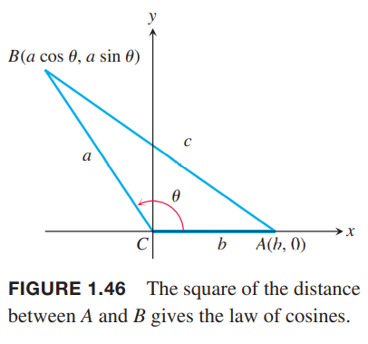

当 $\theta=\pi/2$ 时，$\cos\theta=0$，余弦定理即为勾股定理 $c^2=a^2+b^2$。

### 两个特殊不等式

对任意以弧度表示的角 $\theta$，正弦和余弦函数满足

$$
|\sin\theta|\leq|\theta|,\qquad
0\leq1-\cos\theta\leq|\theta|.
$$

如下图，对非零角 $\theta$ 作单位圆。$|\theta|$ 是弧 $AP$ 的长度，而弦长 $AP$ 小于相应弧长。

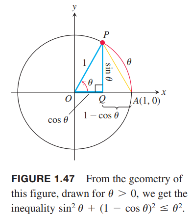

直角三角形 $APQ$ 的直角边长度为

$$QP=|\sin\theta|,\qquad AQ=1-\cos\theta.$$

由勾股定理及 $AP<|\theta|$，有

$$\sin^2\theta+(1-\cos\theta)^2=(AP)^2\leq\theta^2.\tag{8}$$

左边两项均非负，故

$$\sin^2\theta\leq\theta^2,\qquad(1-\cos\theta)^2\leq\theta^2.$$

取平方根即可得到上述不等式。这些不等式将在下一章中发挥重要作用。

### 三角函数图像变换

下图描述函数图像的平移、伸缩和翻转规则，它们同样适用于三角函数。

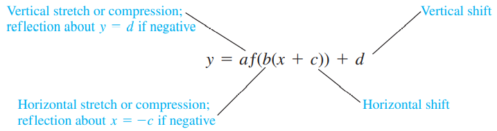

应用这些规则可得到一般正弦函数

$$f(x)=A\sin\left(\frac{2\pi}{B}(x-C)\right)+D,\qquad B\neq0.$$

其中 $|A|$ 是振幅（`amplitude`），$|B|$ 是周期，$C$ 是水平平移量（`horizontal shift`），$D$ 是垂直平移量（`vertical shift`）。

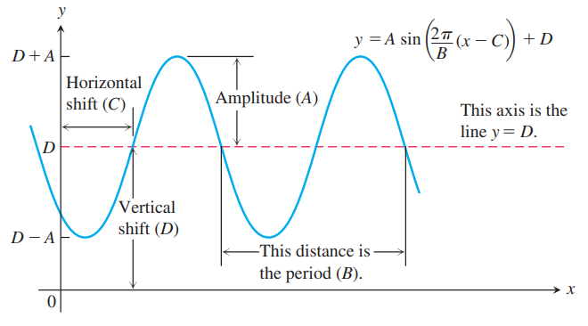

### 习题

55. 两角和的正切公式为

$$\tan(A+B)=\frac{\tan A+\tan B}{1-\tan A\tan B}.$$

证明：在各式有意义时，

$$
\begin{aligned}
\tan(A+B)
&=\frac{\sin(A+B)}{\cos(A+B)}\\
&=\frac{\sin A\cos B+\cos A\sin B}
        {\cos A\cos B-\sin A\sin B}\\
&=\frac{\tan A+\tan B}{1-\tan A\tan B}.
\end{aligned}
$$

61. **正弦定理**
> 三角形 $ABC$ 的边长 $a,b,c$ 分别对应角 $A,B,C$，则
>
> $$\frac{\sin A}{a}=\frac{\sin B}{b}=\frac{\sin C}{c}.$$

证明：只证后两个比值相等，其他情形完全类似。角 $C$ 可以是锐角、钝角或直角。若 $C$ 为直角，则 $\sin C=1$、$\sin B=b/c$，所以 $\sin B/b=\sin C/c$。对于锐角和钝角，作高 $h$，如下图。

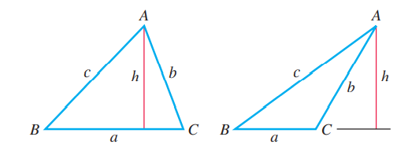

若 $C$ 为锐角，则

$$h=c\sin B=b\sin C.$$

若 $C$ 为钝角，则

$$h=c\sin B=b\sin(\pi-C)=b\sin C.$$

两种情形均有 $c\sin B=b\sin C$，故 $\sin B/b=\sin C/c$。等式 $\sin(\pi-C)=\sin C$ 可由和差公式直接验证。
