### 角
角可以用度（`degree`）或者弧度（`radian`）表示。如下图所示，在半径为$r$的圆心角$A'CB'$对应的弧度是圆心角所对的弧$s$的长度比半径的长度$r$。用$\theta$表示圆心角，那么$\theta=s/r$或
$$s=r\theta\tag{1}$$
  
对于半径$r=1$的单位圆来说，用弧度表示角$\theta$的话，其值就是对应的弧长。一个圆周对应于$360^\circ$或弧度$2\pi$，所以
$$\pi \text{radians}=180^\circ\tag{2}$$
$$1 \text{ radian}=\frac{180}{\pi}(\approx 57.3)\text{ degrees}$$
$$1 \text{ degree}=\frac{\pi}{180}(\approx 0.017)\text{ radians}$$
下表展示了一些基本角度的对应关系：

|||||||||||||||||
|--|--|--|--|--|--|--|--|--|--|--|--|--|--|--|--|
| Degrees | $-180$ | $-135$ | $-90$ | $-45$ | $0$ | $30$ | $45$ | $60$ | $90$ | $120$ | $135$ | $150$ | $180$ | $270$ | $360$ |
| U (radians) | $-\pi$ | $\frac{-3\pi}{4}$ | $\frac{-\pi}{2}$ | $\frac{-\pi}{4}$ | $0$ | $\frac{\pi}{6}$ | $\frac{\pi}{4}$ | $\frac{\pi}{3}$ | $\frac{\pi}{2}$ | $\frac{2\pi}{3}$ | $\frac{3\pi}{4}$ | $\frac{5\pi}{6}$ | $\pi$ | $\frac{3\pi}{2}$ | $2\pi$ |

如果一个角的顶点位于坐标系原点并且起始边和$x$轴重合，那么我们称这个角在标准位置（`standard position`）。从$x$轴逆时针的角度为正，顺时针为负。如下图所示：  
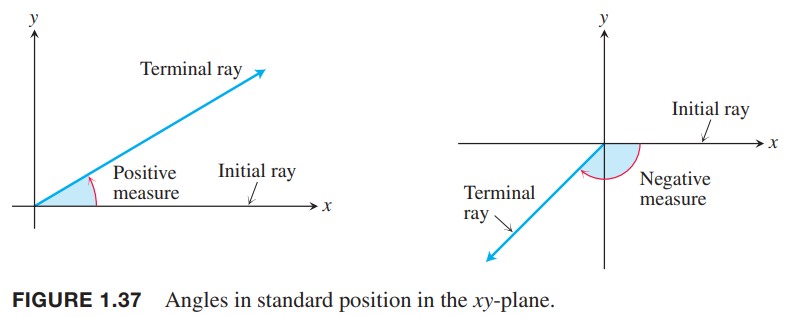  
逆时针的角度的大小可以任意大，远超$2\pi$，类似的，顺时针的角度也可以任意大。如下图所示：  
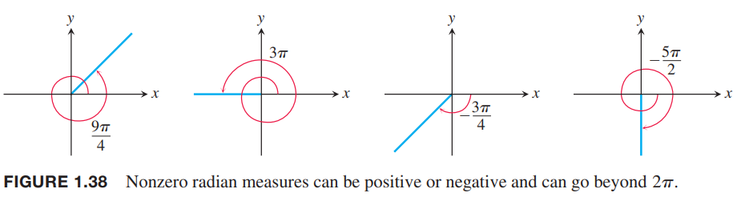  
本书后面默认使用弧度表示，除非特别说明。当我们提及$\pi/3$的时候，指的是角度弧度是$\pi/3$（也就是$60^\circ$）而不是$\pi/3 ^\circ$。

### 六种基本的三角函数
锐角的三角函数定义如下图所示：  
  
我们把角放到坐标系的标准位置，可以扩展三角函数的定义到钝角和负角。我们用角的终止边和圆的交点$P(x,y)$来定义三角函数
$$\begin{aligned}
\text{sine}&&\sin\theta=\frac{y}{r}&&\text{cosecant}&&\csc\theta=\frac{r}{y}\\
\text{cosine}&&\cos\theta=\frac{x}{r}&&\text{secant}&&\sec\theta=\frac{r}{x}\\
\text{tangent}&&\tan\theta=\frac{y}{x}&&\text{cotangent}&&\cot\theta=\frac{x}{y}
\end{aligned}$$
  
这个扩展定义和锐角中的定义是一致的。  
当商有意义的前提下，有如下相等关系：  
$$\begin{aligned}
\tan\theta=\frac{\sin\theta}{\cos\theta}\\
\cot\theta=\frac{1}{\tan\theta}\\
\sec\theta=\frac{1}{\cos\theta}\\
\csc\theta=\frac{1}{\sin\theta}
\end{aligned}$$
$\tan\theta,\sec\theta$在$x=\cos\theta=0$的时候无定义，也就是定义域不包括$\theta=\pm\pi/2,\pm 3\pi/2\cdots$，同样的，$y=0$时$\cot\theta,\csc\theta$无定义，即$\theta=0,\pm\pi,\pm 2\pi\cdots$。  
根据下图我们可以得到一些常见的三角函数值
$$\begin{aligned}
&\sin\frac{\pi}{4}=\frac{1}{\sqrt{2}}&&\sin\frac{\pi}{6}=\frac{1}{2}&&\sin\frac{\pi}{3}=\frac{\sqrt{3}}{2}\\
&\cos\frac{\pi}{4}=\frac{1}{\sqrt{2}}&&\cos\frac{\pi}{6}=\frac{\sqrt{3}}{2}&&\cos\frac{\pi}{3}=\frac{1}{2}\\
&\tan\frac{\pi}{4}=1&&\tan\frac{\pi}{6}=\frac{1}{\sqrt{3}}&&\tan\frac{\pi}{3}=\sqrt{3}
\end{aligned}$$
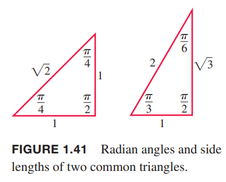  
ASTC（如下图所示）可以帮助记忆基本三角函数是正还是负。  
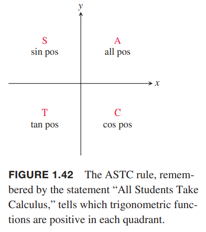  
比如从下图的三角形，可以得到
$$\begin{aligned}
\sin\frac{2\pi}{3}=\frac{\sqrt{3}}{2}\\
\cos\frac{2\pi}{3}=-\frac{1}{2}\\
\tan\frac{2\pi}{3}=-\sqrt{3}
\end{aligned}$$
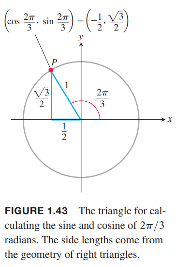  
类似的方法可以得到下表：

|||||||||||||||||
|--|--|--|--|--|--|--|--|--|--|--|--|--|--|--|--|
| Degrees | $-180$ | $-135$ | $-90$ | $-45$ | $0$ | $30$ | $45$ | $60$ | $90$ | $120$ | $135$ | $150$ | $180$ | $270$ | $360$ |
| U (radians) | $-\pi$ | $\frac{-3\pi}{4}$ | $\frac{-\pi}{2}$ | $\frac{-\pi}{4}$ | $0$ | $\frac{\pi}{6}$ | $\frac{\pi}{4}$ | $\frac{\pi}{3}$ | $\frac{\pi}{2}$ | $\frac{2\pi}{3}$ | $\frac{3\pi}{4}$ | $\frac{5\pi}{6}$ | $\pi$ | $\frac{3\pi}{2}$ | $2\pi$ |
| $\sin\theta$ | $0$ | $\frac{-\sqrt{2}}{2}$ | $-1$ | $\frac{-\sqrt{2}}{2}$ | $0$ | $\frac{1}{2}$ | $\frac{\sqrt{2}}{2}$ | $\frac{\sqrt{3}}{2}$ | $1$ | $\frac{\sqrt{3}}{2}$ | $\frac{\sqrt{2}}{2}$ | $\frac{1}{2}$ | $0$ | $-1$ | $0$ |
| $\cos\theta$ | $-1$ | $\frac{-\sqrt{2}}{2}$ | $0$ | $\frac{\sqrt{2}}{2}$ | $1$ | $\frac{\sqrt{3}}{2}$ | $\frac{\sqrt{2}}{2}$ | $\frac{1}{2}$ | $0$ | $-\frac{1}{2}$ | $\frac{-\sqrt{2}}{2}$ | $\frac{-\sqrt{3}}{2}$ | $-1$ | $0$ | $1$ |
| $\tan\theta$ | $0$ | $1$ |  | $-1$ | $0$ | $\frac{\sqrt{3}}{3}$ | $1$ | $\sqrt{3}$ |  | $-\sqrt{3}$ | $-1$ | $\frac{-\sqrt{3}}{3}$ | $0$ |  | $0$ |

### 三角函数的周期和图像
当角度为$\theta$的角和角度为$\theta+2\pi$的角都放到标准位置的时候，终止边恰好重合。因此这两个角的三角函数值是相同的：$\sin(\theta+2\pi)=\sin\theta,\cos(\theta+2\pi)=\cos\theta,\tan(\theta+2\pi)=\tan\theta$等等。类似的$\sin(\theta-2\pi)=\sin\theta,\cos(\theta-2\pi)=\cos\theta$等等。我们称这六种基本三角函数是周期函数。

**定义** 如果函数$f(x)$对于任意$x$都有一个正整数$p$使得$f(x+p)=f(x)$，那么函数是周期函数。这个最小的$p$称为函数$f$的周期（`period`）。

当我们画三角函数的时候，往往使用$x$代替$\theta$。下图是六种三角函数的图像。正切函数和余切函数的周期是$\pi$，其他四种函数周期是$2\pi$。余弦函数和正割函数是偶函数，其余四种是奇函数。  
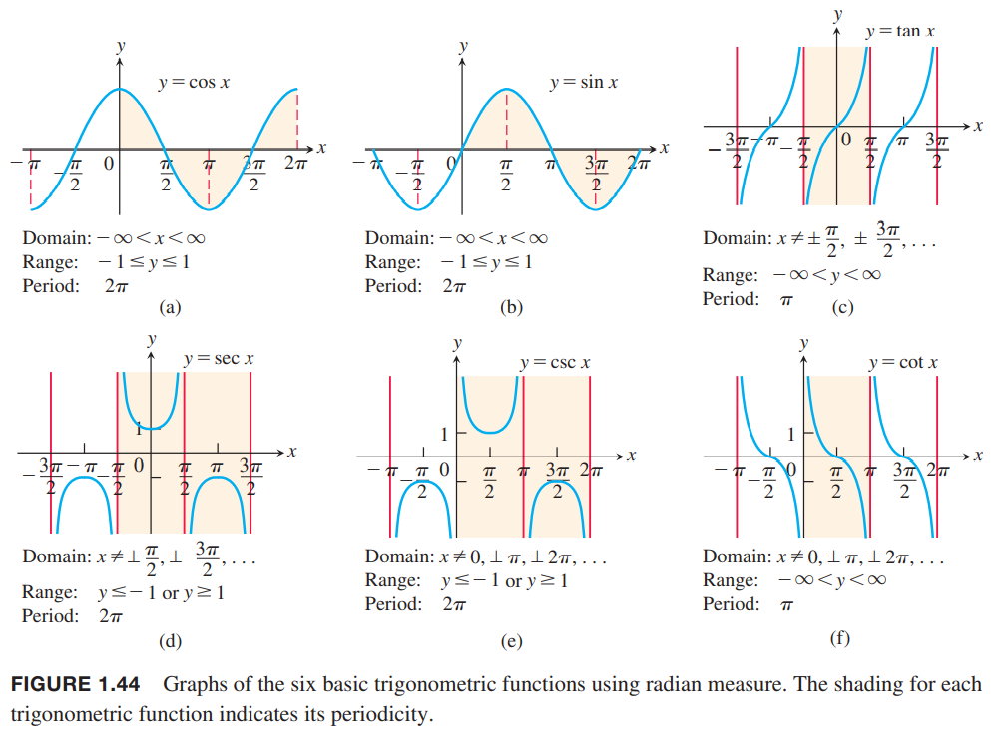

### 三角恒等变换
平面上的任意点$P(x,y)$能够用该点到原点的距离$r$和$OP$与$x$正半轴的夹角$\theta$来表示。如下图所示。因为$x/r=\cos\theta,y/r=\sin\theta$，可以得到
$$x=r\cos\theta,y=r\sin\theta$$
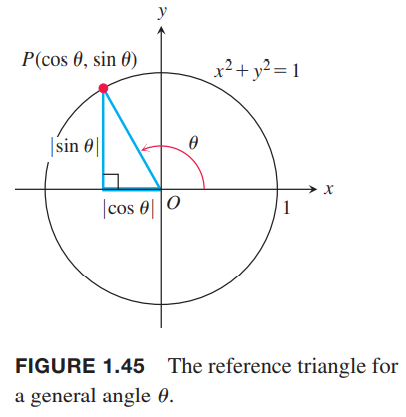  
当$r=1$时，应用毕达哥拉斯定理可以得到
$$\cos^2\theta+\sin^2\theta=1\tag{3}$$
对于所有的$\theta$，这个方程都成立，并且是三角函数最常用的恒等式。上式两边同除$\cos^2\theta,\sin^2\theta$得到
$$1+\tan^2\theta=\sec^2\theta$$
$$1+\cot^2\theta=\csc^2\theta$$
下面两个公式也是对所有的 $A,B$ 都成立（和）
$$\begin{aligned}
\cos(A+B)=\cos A\cos B-\sin A\sin B\\
\sin(A+B)=\sin A\cos B+\cos A\sin B
\end{aligned}\tag{4}$$
对于差 $\cos(A-B),\sin(A-B)$ 有类似的公式。可以利用三角函数的奇偶性将上式的 $B$ 换成 $-B$ 得到差的公式。
$$\cos(A - B) = \cos A\cos B + \sin A\sin B$$
$$\sin(A - B) = \sin A\cos B - \cos A\sin B$$
本书所有的三角恒等变换都能从公式 $(3)(4)$ 推导出来。比如用 $\theta$ 替换 $A,B$ 可以得到倍角公式
$$\begin{aligned}
\cos 2\theta=\cos^2\theta-\sin^2\theta\\
\sin 2\theta=2\sin\theta\cos\theta
\end{aligned}\tag{5}$$
将下面两个等式
$$\cos^2\theta+\sin^2\theta=1,\cos^2\theta-\sin^2\theta=\cos 2\theta$$
相加得到
$$2\cos^2\theta=1+\cos 2\theta$$
第一个式子减去第二个式子等到
$$2\sin^2\theta=1-\cos 2\theta$$
进而可以得到非常有用的半角公式
$$\cos^2\theta=\frac{1+\cos 2\theta}{2}\tag{6}$$
$$\sin^2\theta=\frac{1-\cos 2\theta}{2}\tag{7}$$

### 余弦定理
三角形$ABC$三边长$abc$，且$\theta$对的边是$c$（也就是说$\theta$是角$C$），那么
$$c^2=a^2+b^2-2ab\cos\theta\tag{8}$$
上面的方程就是余弦定理（`law of cosines`）。  
我们把点$C$放到原点，$x$正半轴沿着角$C$的一条边把三角形放到坐标系中。如下图所示。那么很容易得到$A(b,0),B(a\cos\theta,a\sin\theta)$，$AB$之间距离的平方就是
$$\begin{aligned}
c^2&=(a\cos\theta-b)^2+(a\sin\theta)^2\\
&=a^2(\cos^2\theta+\sin^2\theta)+b^2-2ab\cos\theta\\
&=a^2+b^2-2ab\cos\theta
\end{aligned}$$
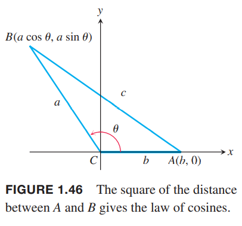  
余弦定理是毕达哥拉斯定理的泛化形式。如果$\theta=\pi/2$，那么$\cos\theta=0$，得到$c^2=a^2+b^2$。

### 两个特殊的不等式
对于任意用弧度表示的角$\theta$，正弦和余弦函数满足
$$-|\theta|\leq\sin\theta\leq |\theta|$$
$$-|\theta|\leq 1-\cos\theta\leq |\theta|$$
如下图我们画了一个非零的角在标准位置，圆是单位圆。那么$|\theta|$的长度就是弧$AP$的长度，小于$|\theta|$。  
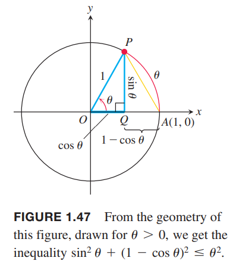  
三角形$APQ$是直角三角形，两个直角边长度是
$$QP=|\sin\theta|,AQ=1-\cos\theta$$
根据毕达哥拉斯定理和$AP<|\theta|$有
$$\sin^2\theta+(1-\cos\theta)^2=(AP)^2\leq\theta^2\tag{9}$$
上面公式左边的两项都是非零项，所以
$$\sin^2\theta\leq\theta^2, (1-\cos\theta)^2\leq\theta^2$$
取平方根，得到不等式
$$|\sin\theta|\leq|\theta|, |1-\cos\theta|\leq|\theta|$$
所以
$$-|\theta|\leq\sin\theta\leq |\theta|,-|\theta|\leq 1-\cos\theta\leq |\theta|$$
这两个公式在下一章会非常有用。

### 三角函数图像变换
下图是函数图像的平移、伸缩、翻转等规则的描述，同样适用于三角函数。  
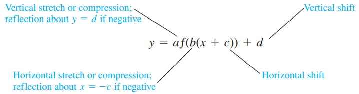  
应用这些变换规则可以得到一般地正弦函数
$$f(x)=A\sin(\frac{2\pi}{B}(x-C))+D$$
其中$|A|$是振幅（`amplitude`），$|B|$是周期（`period`），$C$是水平偏移（`horizontal shift`），$D$是垂直偏移（`vertical shift`）。图像如下所示：  

### 习题
习题中有两个是很常见且很有用的公式和定理。

55. 两个角的正切值公式如下：
$$\tan(A+B)=\frac{\tan A+\tan B}{1-\tan A\tan B}$$
证明：
$$\begin{aligned}
\tan(A+B)&=\frac{\cos(A+B)}{\sin(A+B)}\\
&=\frac{\sin A\cos B+\cos A\sin B}{\cos A\cos B-\sin A\sin B}\\
&=\frac{\tan A+\tan B}{1-\tan A\tan B}
\end{aligned}$$

61. 正弦定理 三角形 $ABC$ 对应边分别是 $a,b,c$，那么
$$\frac{\sin A}{a}=\frac{\sin B}{b}=\frac{\sin C}{c}$$
证明：$ABC$ 三者是平等的，所以下面证明等式的后半部分，前半部分同理可得。

角$C$可能是锐角、钝角和直角。  
直角最简单，此时$\sin C=1,\sin B=\frac{b}{c}$，得证。  
锐角和钝角的情况如下图所示：  
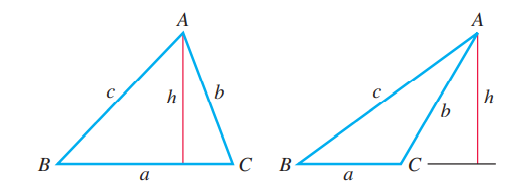  
锐角情况
$$h=c\sin B=b\sin C$$
钝角情况
$$h=c\sin B=b\sin(\pi-C)=b\sin C$$
$\sin(\pi-C)=\sin C$很容易通过两角之和公式证明。
