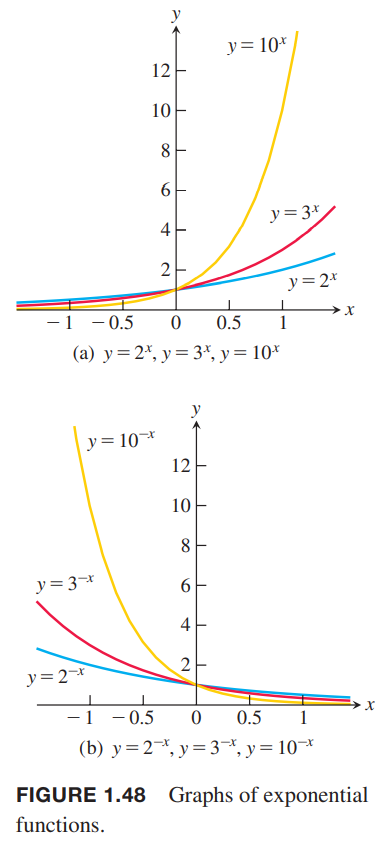
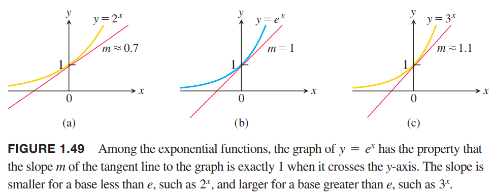
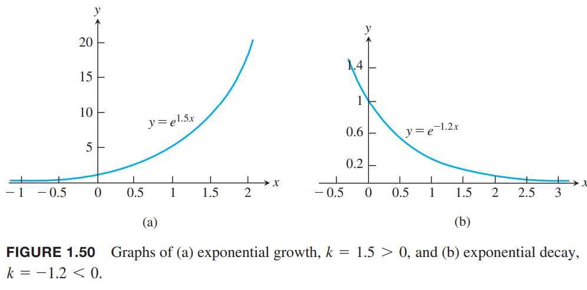

指数函数应用非常广泛，比如利率、放射衰变、人口增长、疾病传播、自然资源消耗、气压、散热冷却、化石定年等等。这一节会非正式地介绍指数函数。第七章会正式研究它们。

### 指数行为
一个正整数$P$增倍成$2P$，再倍增$2(2P)=2^2P$，第三次倍增是$2(2^2P)=2^3P$，以此类推，这让我们考虑函数$f(x)=2^x$，这是指数函数，因为$x$在指数位置。类似的$g(x)=10^x,h(x)=(1/2)^x$等都是函数。一般地，$a\neq 1$是正的常量，那么函数
$$f(x)=a^x,a>0$$
是基数为$a$的指数函数（`exponential function`）。  
例1 2014年，100元存入银行，年利率是$5.5\%$。求$x$年后账户余额。  
解：令$P=100$，第一年底余额是
$$P+(\frac{5.5}{100})P=(1+0.055)P=1.055P$$
第二年是
$$(1+0.005)(1.055P)=1.055^2P=100\cdot(1.055)^2$$
$x$年后余额是
$$A+100\cdot(1.055)^x$$
这是基数为1.055的指数函数。  
一般地，$P$是起始余额，$r$是年利率，那么$x$年后余额是$P(1+r)^x$。  
对整数和有理数来说，指数函数$f(x)=a^x$的值是一些数的积、商、根。如果$x=n$是正整数，$a^n$是$a$自乘$n$次
$$a^n=a\cdot a\cdot\cdots\cdot a$$
如果$x=0$，那么$a^0=1$。如果$x=-n$，其中$n$是正整数，那么
$$a^{-n}=\frac{1}{a^n}=(\frac{1}{a})^n$$
$x=1/n$，那么
$$a^{1/n}=\sqrt[n]{a}$$
某个数自乘$n$次之后得到$a$。$x=p/q$是任意实数，那么
$$a^{p/q}=\sqrt[q]{a^p}=(\sqrt[q]{a})^p$$
$x$是无理数，$a^x$就不这么明显了，可以通过提高$a$的指数使得越来越接近无理数$x$对应的值$a^x$。第七章会严格定义这种情况。  
下图是一些指数函数的图像。  
  
对于$x$是实数的话，可以计算出指数函数的值并描绘在图上。如果$x$是无理数，我们选择的值使得图像$a^x$没有洞也没有跳跃（用词不严谨，但是传递了思想）。第二章我们会详细描述，就是$f(x)=a^x$是连续的。这种选择使得当$a>1$时是递增函数，当$0<a<1$是递减的。  
现在我们解释下如何得到$x$是无理数时指数函数$f(x)=2^x$的值。比如计算$2^{\sqrt{3}}$，我们知道
$$\sqrt{3}=1.732050808$$
我们可以计算一系列 $2$ 的幂次的值，指数部分有越来越多位
$$2^1,2^{1.7},2^{1.73},2^{1.732},2^{1.7320},2^{1.73205},\cdots$$
那么指数部分会越来越接近$\sqrt{3}$，那么上面这个列表的数会越来越接近$2^{\sqrt{3}}$。  
我们可以得到$2^{\sqrt{3}}\approx 3.321997086$。实数的完整性（`completeness property`）保证按照这个定义只有一个值对应$2^{\sqrt{3}}$。类似的，对于任意无理数$x$，可以得到$2^x$（或$a^x,a>0$）的值。  
指数函数满足以下规律。对于实数很容易证明，第七章会对任意实数的情况证明这些规律。  

**指数规则**
如果$a>0,b>0$，下面公式对所有实数$x,y$都成立。
1. $a^x\cdot a^y=a^{x+y}$
2. $\frac{a^x}{a^y}=a^{x-y}$
3. $(a^x)^y=(a^y)^x=a^{xy}$
4. $a^x\cdot b^x=(ab)^x$
5. $\frac{a^x}{b^x}=(\frac{a}{b})^x$

例2 依次运用上面的规则，可以简化下面这些表达式
1. $3^{1.1}\cdot 3^{0.7}=3^{1.1+0.7}=3^{1.8}$
2. $\frac{(\sqrt{10})^3}{\sqrt{10}}=(\sqrt{10})^{3-1}=(\sqrt{10})^2=10$
3. $(5^{\sqrt{2}})^{\sqrt{2}}=5^{\sqrt{2}\cdot\sqrt{2}}=5^2=25$
4. $7^{\pi}\cdot 8^{\pi}=56^{\pi}$
5. $(\frac{4}{9})^{1/2}=\frac{4^{1/2}}{9^{1/2}}=\frac{2}{3}$

### 自然指数函数$e^x$
建模、物理、经济现象中最重要的指数函数是自然指数函数（`natural exponential function`），它的基数是特殊数字$e$。$e$是无理数，取小数点前九位是$2.718281828$。3.8节会给出一种计算$e$的方式。使用$e$作为基数而不是2或者10可能显得有点奇怪，但是能够简化微积分中的很多计算。  
上一段中的图像表明随着$a$的增加$y=a^x$越来越陡。这里陡峭表示的是任意一点切线的斜率。切线的详细定义在下一章，直观上说，是某一点上像圆的切线一样的最佳近似。下图展示了$y=a^x$与$y$轴交点的斜率。如果$a=e$，斜率恰好是1。当$a<e$斜率小于1，否则斜率大于1。  

### 指数增长和衰减
函数$y=y_0e^{kx}$，$k$是非零常数。当$k>0$时，是指数增长（`exponential growth`）模型，$k<0$时是指数衰减模型（`exponential decay`）。这里$y_0$是$x=0$时的初始常量。一个指数增长的例子是复合利率，$y=Pe^{rt}$，$P$是初始投资额，$r$是利率，$t$是与$r$相应单位长度的时间。指数衰减的例子有放射性元素碳14的衰减，$y=Ae^{-1.2\times 10^{-4}t}$，$A$是初始碳14的初始量，$t$是年数。碳14衰减经常用于测定年龄。下图是指数增长和衰减的图像。  
  
例3 投资公司经常用公式$y=Pe^{rt}$来计算投资增长。使用这个公式来计算2004年投资5.5%年化率100元的话资产增长情况。  
解：令$t=0$表示2014年，$t=1$表示2005年等等。$r=0.055,P=100$。比如要预测2018年资金情况，代入$t=4$即可
$$\begin{aligned}
y(4)&=100e^{0.055(4)}\\
&=100e^{0.22}\\
&=124.61
\end{aligned}$$
例4 辐射过程是放射性物质放出一些原子而剩余的原子组成了新的元素。比如碳14最终会衰变成氮，镭最终衰变成铅。如果$y_0$表示初始时放射性物质原子核的数量，随着时间的变化，原子核数是
$$y=y_0e^{-rt}$$
$r$是放射性物质的衰变速率。碳14的$r=1.2\times 10^{-4}$，预测866年后碳14的剩余量。  
解：代入公式
$$\begin{aligned}
y(866)&=y_0e^{(-1.2\times 10^{-4})(866)}\\
&\approx (0.901)y_0
\end{aligned}$$
也就是说，866年之后碳14还剩下原来的90%，而其他原子核已经衰变了。  
下一节中，我们会看到$y=a^x$和$y=e^{kx}$（$k$是常数）是等价的，同时后者更容易使用。
