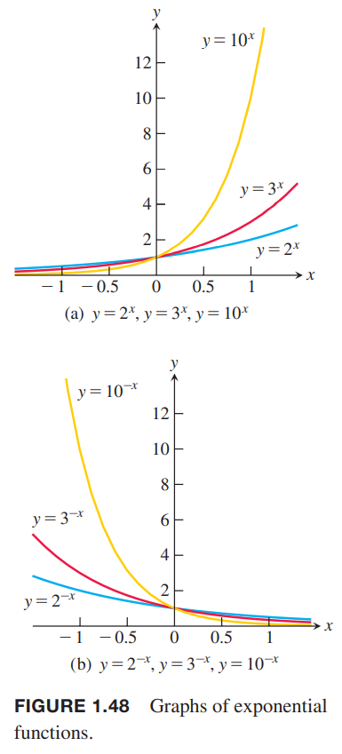
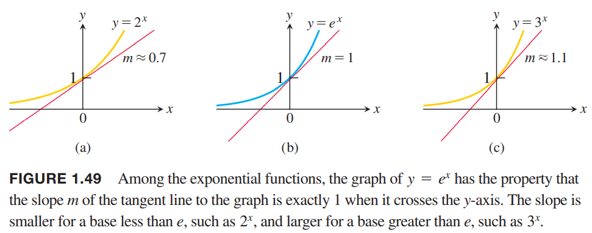
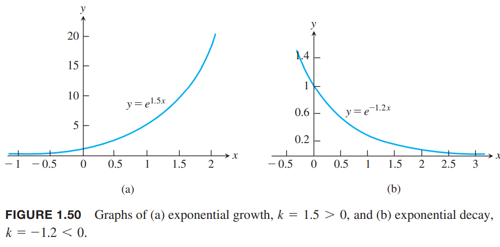

指数函数应用非常广泛，例如复利、放射性衰变、人口增长、疾病传播、自然资源消耗、气压、冷却和化石定年。本节非正式地介绍指数函数；第七章将严格研究它们。

### 指数行为

一个数量 $P$ 倍增为 $2P$，再倍增为 $2(2P)=2^2P$，第三次倍增为 $2(2^2P)=2^3P$，以此类推。这启发我们考虑函数 $f(x)=2^x$，它是指数函数，因为 $x$ 位于指数位置。类似地，$g(x)=10^x$ 和 $h(x)=(1/2)^x$ 也是指数函数。一般地，若 $a>0$ 且 $a\neq 1$ 是常量，则

$$f(x)=a^x$$

称为以 $a$ 为底数的指数函数（`exponential function`）。

例 1：2014 年将 100 元存入银行，年利率为 $5.5\%$。求 $x$ 年后的账户余额。

解：令 $P=100$。第一年年末的余额为

$$P+\left(\frac{5.5}{100}\right)P=(1+0.055)P=1.055P.$$

第二年年末的余额为

$$(1+0.055)(1.055P)=1.055^2P=100(1.055)^2.$$

因此，$x$ 年后的余额为

$$A(x)=100(1.055)^x.$$

这是底数为 $1.055$ 的指数函数。一般地，若 $P$ 是初始本金、$r$ 是年利率，则 $x$ 年后的余额为 $P(1+r)^x$。

当 $x$ 是整数或有理数时，指数函数 $f(x)=a^x$ 的值可以由乘积、商和根式定义。若 $x=n$ 是正整数，则 $a^n$ 是 $a$ 自乘 $n$ 次：

$$a^n=\underbrace{a\cdot a\cdots a}_{n\text{ 个 }a}.$$

若 $x=0$，则 $a^0=1$；若 $x=-n$，其中 $n$ 是正整数，则

$$a^{-n}=\frac{1}{a^n}=\left(\frac{1}{a}\right)^n.$$

若 $x=1/n$，则

$$a^{1/n}=\sqrt[n]{a},$$

即 $\sqrt[n]{a}$ 自乘 $n$ 次得到 $a$。若 $x=p/q$ 是有理数，则

$$a^{p/q}=\sqrt[q]{a^p}=\left(\sqrt[q]{a}\right)^p.$$

当 $x$ 是无理数时，$a^x$ 的定义不再如此直接；可以用有理数指数逼近 $x$，从而逼近对应的 $a^x$。第七章将严格定义这种情形。

下图给出一些指数函数的图像。

当 $x$ 是实数时，可以计算指数函数的值并描绘图像。对于无理数 $x$，我们定义 $a^x$ 的方式使图像没有孔洞或跳跃；严格地说，$f(x)=a^x$ 是连续函数。当 $a>1$ 时，$f$ 递增；当 $0<a<1$ 时，$f$ 递减。

现在说明如何近似得到无理数指数的值。计算 $2^{\sqrt{3}}$ 时，注意到

$$\sqrt{3}=1.732050808\ldots$$

可以计算指数的小数位逐步增加的一列数：

$$2^1,\ 2^{1.7},\ 2^{1.73},\ 2^{1.732},\ 2^{1.7320},\ 2^{1.73205},\ldots$$

这些指数逐渐逼近 $\sqrt{3}$，相应的数也逐渐逼近 $2^{\sqrt{3}}$。数的完备性（`completeness property`）保证这一过程确定唯一的值；例如，

$$2^{\sqrt{3}}\approx 3.321997086.$$

类似地，对任意无理数 $x$，均可定义 $2^x$，更一般地可定义 $a^x$（$a>0$）。

**指数规则**
> 若 $a>0$、$b>0$，则对任意实数 $x,y$ 都有：
>
> 1. $a^x\cdot a^y=a^{x+y}$；
> 2. $\dfrac{a^x}{a^y}=a^{x-y}$；
> 3. $(a^x)^y=(a^y)^x=a^{xy}$；
> 4. $a^x b^x=(ab)^x$；
> 5. $\dfrac{a^x}{b^x}=\left(\dfrac{a}{b}\right)^x$。

这些规则对有理数指数容易证明；第七章将证明它们对所有实数指数也成立。

例 2：依次运用上述规则，化简下列各式。

1. $3^{1.1}\cdot 3^{0.7}=3^{1.1+0.7}=3^{1.8}$；
2. $\dfrac{(\sqrt{10})^3}{\sqrt{10}}=(\sqrt{10})^{3-1}=(\sqrt{10})^2=10$；
3. $(5^{\sqrt{2}})^{\sqrt{2}}=5^{\sqrt{2}\cdot\sqrt{2}}=5^2=25$；
4. $7^\pi\cdot 8^\pi=56^\pi$；
5. $\left(\dfrac{4}{9}\right)^{1/2}=\dfrac{4^{1/2}}{9^{1/2}}=\dfrac{2}{3}$。

### 自然指数函数 $e^x$

建模、物理和经济现象中最重要的指数函数是自然指数函数（`natural exponential function`），其底数是特殊的数 $e$。$e$ 是无理数，取到小数点后九位为 $2.718281828$。第 3.8 节将给出一种计算 $e$ 的方法。使用 $e$ 而非 2 或 10 作为底数看似奇怪，但它能简化微积分中的许多计算。

前面的图像表明，随着 $a$ 增大，$y=a^x$ 在点 $(0,1)$ 处的切线斜率增大。切线的严格定义将在下一章给出；直观上，它是在某点对曲线的最佳直线近似。下图展示 $y=a^x$ 在 $y$ 轴交点处的斜率：当 $a=e$ 时，斜率恰为 1；当 $0<a<e$ 且 $a\neq1$ 时，斜率小于 1；当 $a>e$ 时，斜率大于 1。

### 指数增长和衰减

函数

$$y=y_0e^{kx},$$

其中 $k$ 是非零常数。当 $k>0$ 时，它是指数增长（`exponential growth`）模型；当 $k<0$ 时，它是指数衰减（`exponential decay`）模型。这里 $y_0$ 是 $x=0$ 时的初始值。复利模型 $y=Pe^{rt}$ 是指数增长的例子，其中 $P$ 是初始投资额，$r$ 是利率，$t$ 是与 $r$ 的单位相对应的时间。碳 14 衰变可用

$$y=Ae^{-1.2\times10^{-4}t}$$

描述，其中 $A$ 是初始碳 14 原子核数量，$t$ 以年为单位。碳 14 衰变常用于测定年代。

例 3：某投资在 2014 年初投入 100 元，连续复利年利率为 $5.5\%$。用 $y=Pe^{rt}$ 计算 2018 年初的资产价值。

解：令 $t=0$ 表示 2014 年初，则 2018 年初对应 $t=4$，且 $P=100$、$r=0.055$。因此

$$
\begin{aligned}
y(4)&=100e^{0.055(4)}\\
&=100e^{0.22}\\
&\approx124.61.
\end{aligned}
$$

例 4：放射性衰变过程中，放射性原子核逐渐转变为其他元素。例如，碳 14 最终衰变成氮，镭最终衰变成铅。若 $y_0$ 表示初始的放射性原子核数，则经过时间 $t$ 后，

$$y=y_0e^{-rt},$$

其中 $r$ 是衰变速率。碳 14 的 $r=1.2\times10^{-4}$。求 866 年后的剩余量。

解：代入公式可得

$$
\begin{aligned}
y(866)&=y_0e^{(-1.2\times10^{-4})(866)}\\
&\approx0.901y_0.
\end{aligned}
$$

也就是说，866 年后碳 14 约剩初始量的 $90.1\%$；其余原子核已衰变。

下一节将看到，$y=a^x$ 与 $y=e^{kx}$（$k$ 为常数）等价，而后一种形式在微积分中更易使用。
