### 一对一函数
函数是对定义域的每个值都有一个值域的值与之对应。一些函数对于定义域中的不同值对应的是同一个值域的值。比如$f(x)=x^2$，对于自变量$1,-1$都对应值$1$。类似的对于正弦函数，$\pi/3,2\pi/3$都对应值$\sqrt{3}/2$。还有一些函数值域的值就对应不多于一个定义域的值。平方根函数和立方函数总是用不同的数来对应不同的输入。

**定义** 定义域$D$中两个值$x_1\neq x_2$，如果$f(x_1)\neq f(x_2)$，那么函数$f(x)$是一对一函数。

例1 一些函数在整个定义域上都是一对一函数，其他一些函数在定义域上不是一对一函数，但是把定义域限制到一个更小的范围的时候，可以得到一个一对一函数。原始函数和限制了定义域的函数由于定义域不同，所以不是同一个函数。不过这两个函数在小的定义域上值都一样。  
（a）$f(x)=\sqrt{x}$是一对一函数，因为对于不同的$x_1\neq x_2$都有$\sqrt{x_1}\neq\sqrt{x_2}$。  
（b）$g(x)=\sin x$在区间$[0,\pi]$上不是一对一函数因为$\sin(\pi/6)=\sin(5\pi/6)$。在区间$[0, \pi/2)$的任意$x_1$都有一个区间$(\pi/2, \pi]$的$x_2$使得$\sin x_1=\sin x_2$。正弦函数在区间$[0,\pi/2]$上是一对一函数，对于不同的输入会得到不同的输出。  
一对一函数$f(x)$和水平线最多有一个交点。如果交点大于一个，意味着对于同一个$y$对应至少两个不同的$x$，那么就不是一对一函数。如下图所示：  
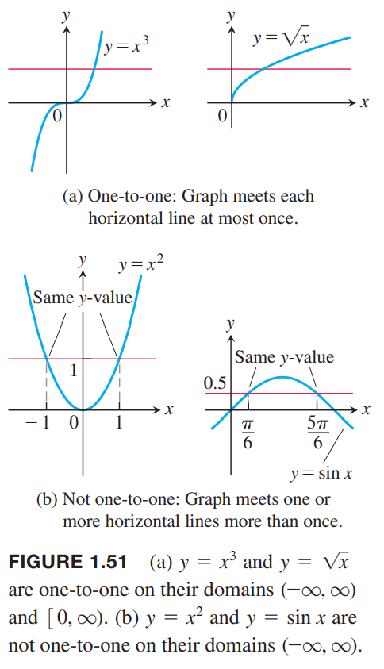

**水平线测试法** 函数$f(x)$是一对一函数，等价于它的图像和每一个水平线最多有一个交点。

### 反函数
由于对于每一个输入，一对一函数输出唯一的值，对于反函数就是将输出还原得到输入。

**定义** 给定函数$f$是定义域$D$上的一对一函数，其值域是$R$。反函数$f^{-1}$定义如下
$$f^{-1}(b)=a \text{ if } f(a)=b$$
$f^{-1}$的定义域是$R$，值域是$D$。

$f^{-1}$中的$-1$不是指数。$f^{-1}(x)$也不是$1/f(x)$。根据上面的定义，$f$和$f^{-1}$的定义域和值域互换了。  
例2 给定一对一函数$f(x)$的函数表格如下：

| $x$ | 1 | 2 | 3 | 4 | 5 | 6 | 7 | 8 |
|--|--|--|--|--|--|--|--|--|
| $f(x)$ | 3 | 4.5 | 7 | 10.5 | 15 | 20.5 | 27 | 34.5 |

那么交换$f$的输入输出就可以得到反函数$f^{-1}$的函数表格：

| $y$ | 3 | 4.5 | 7 | 10.5 | 15 | 20.5 | 27 | 34.5 |
|--|--|--|--|--|--|--|--|--|
| $f^{-1}(y)$ | 1 | 2 | 3 | 4 | 5 | 6 | 7 | 8 |

函数$f$将输入$x$映射为输出$f(x)$，$f^{-1}$将输入$f(x)$映射为$x$。类似地，取$f$值域的某个值$y$，把应用反函数$f^{-1}$得到值作为函数$f$的输入，最后得到的是$y$。将函数和其反函数组合在一起，得到原来的输入
$$(f^{-1}\circ f)(x)=x, \text{ 对所有$f$定义域的$x$成立}$$
$$(f\circ f^{-1})(y)=y, \text{ 对所有$f^{-1}$定义域的$y$成立，即$f$的定义域}$$
只有一对一函数有反函数。因为如果存在不同的输入$x_1,x_2$有$f(x_1)=y,f(x_2)=y$，那么$f^{-1}(y)$会对应两个值$f^{-1}(f(x_1))=x_1,f^{-1}(f(x_2))=x_2$。  
函数在某个区间是递增的或者是递减的，那么有反函数。既不递增也不递减也许有反函数，比如函数$f(x)=1/x, \text{ for } x\neq 0; f(0)=0$是定义在$(-\infty,\infty)$的函数，能够通过水平线测试法。

### 寻找反函数
一个函数的图像和它的反函数是紧密相关的。从图像读取某个函数值，我们往往从$x$轴的$x$点开始，垂直移动到图像，然后水平移动到$y$轴得到$y$值。将整个过程反过来，就是读取反函数值的过程。从$y$轴的$y$点开始，水平移动到$y=f(x)$图像，然后垂直移动到$x$轴得到$x=f^{-1}(y)$。如下图所示：  
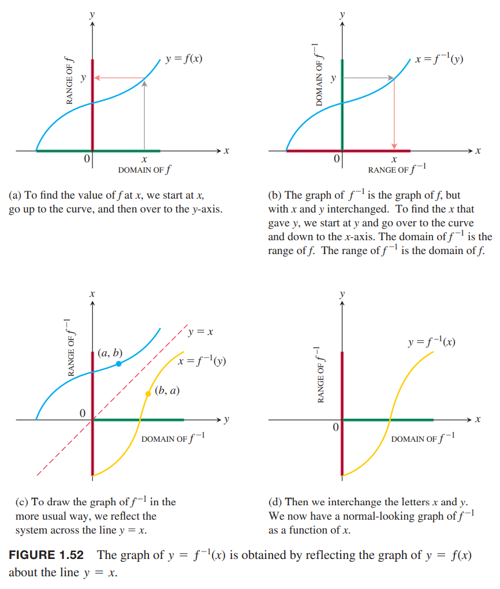  
我们想要建立$f^{-1}$的图像使得我们可以沿着$x$轴开始而不是从$y$轴开始。我们沿着$y=x$翻转图像。翻转后的图像就是$f^{-1}$。那么读取$f^{-1}(x)$的值就像之前一样了，从$x$轴开始，垂直和图像相交，然后水平移动到$y$轴。上图的后面两个图揭示了$f,f^{-1}$两者图像之间的关系。  
从$f$得到$f^{-1}$可以分成以下两步：
1. 求解$y=f(x)$，得到用$y$表示$x$的方程$x=f^{-1}(y)$；
2. 交换$x,y$这两个字母，使得回到惯常的$x$是自变量，$y$是因变量。

例3 求函数$y=\frac{1}{2}+1$的反函数。  
解：
$$\begin{aligned}
y=\frac{1}{2}x+1\\
2y=x+2\\
x=2y-2
\end{aligned}$$
所以反函数是$y=2x-2$。两个函数的图像是下图所示：  
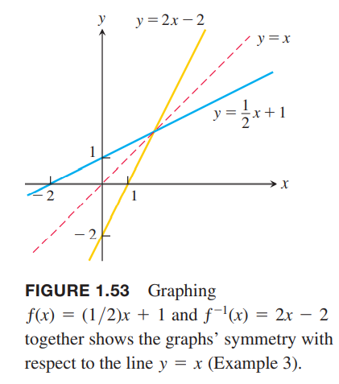  
我们可以利用函数和反函数的组合来验证：
$$f^{-1}(f(x))=2(f(x))-2=2(\frac{1}{2}x+1)-2=x+2-2=x$$
$$f(f^{-1}(x))=\frac{1}{2}f^{-1}(x)+1=\frac{1}{2}(2x-2)+1=x-1+1=x$$
例4 求$y=x^2,x\geq 0$的反函数。  
解：对于$x\geq 0$，满足水平线测试，是一对一函数，所以有反函数。
$$\begin{aligned}
y&=x^2\\
\sqrt{y}&=\sqrt{x^2}=|x|=x
\end{aligned}$$
所以反函数是$y=\sqrt{x}$。两个函数的图像如下所示：  
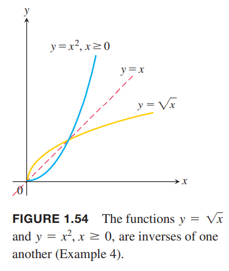  
注意，函数$y=x^2$不能通过水平线测试，不是一对一函数，故不存在反函数。

### 对数函数
$a$是除1外的任意正实数，那么底数为$a$的指数函数$f(x)=a^x$是一对一函数，所以有反函数，称为底数为$a$的对数函数（`logarithm function with base a`）。

**定义** 底数为$a$的对数函数记作$y=\log_a x$是底数为$a$的指数函数$y=a^x,a>0,a\neq 1$的反函数。

$\log_a x$的定义域是$(0, \infty)$，是$a^x$的值域，$\log_a x$的值域是$(-\infty, \infty)$，是$a^x$的定义域。  
下图第一个图像是$y=\log_2 x$的图像。当$x>0$时，$y=a^x,a>1$的图像是快速递增的，所以反函数$y=\log_a x$在$x>1$时是缓慢递增的。  
因为我们还没有工具能够求解$y=a^x$使得用$y$来表达$a$，所以无法用公式精确的计算$x$对应的对数值。不过，我们可以通过沿$y=x$来翻转$y=a^x$来获取$\log_a x$的图像。下图展示的是$a=2,a=e$两个函数图像。  
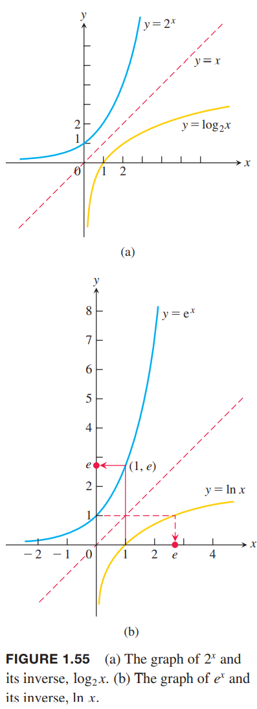  
底数为2的对数函数常常和二进制数一起出现，所以常用于计算机领域。底数$e,10$常常用于计算器的特殊值出现，很常用，所有有特殊的记号
$$\log_e x\Rightarrow \ln x$$
$$\log_{10} x\Rightarrow \log x$$
由于$e^1=e$，可以得到
$$\ln e=1$$

### 对数性质
`John Napier`发明了对数，最大的意义就是简化了有计算机之前的算术运算。乘法可以变成加法，除法可以简化成减法，一个数的指数运算可以转化成指数乘以这个数的对数。  
下面总结了一些自然对数的规则，第三章会证明它们。乘方法则中$r$可以是全部实数，不过要到第四章我们才能证明$r$是无理数的情况。对任意底数$a$的情况会到第七章就行讨论。

**定理** 自然对数的属性  
对任意数$b>0,x>0$，自然对数满足以下运算法则：  
1. 乘法法则 $\ln bx=\ln b+\ln x$
2. 除法法则 $\ln \frac{b}{x}=\ln b-\ln x$
3. 倒数法则 $\ln \frac{1}{x}=-\ln x$，这个可以看作是除法法则中$b=1$或者乘法法则中$r=-1$的特殊情况
4. 乘方法则 $\ln x^r=r\ln x$

例5 使用上述法则简化下面三个表达式  
（a）$\ln 4+\ln\sin x=\ln (4\sin x)$  
（b）$\ln\frac{x+1}{2x-3}=\ln (x+1)-\ln (2x-3)$  
（c）$\ln \frac{1}{8}=-\ln 8=-\ln 2^3=-3\ln 2$  
由于$a^x$和$\log_a x$互为反函数，那么以任意顺序组合它们都会得到恒等函数。

**$a^x$和$\log_a x$的性质**
1. 底数$a$：$a^{\log_a x}=x, \log_a a^x=x,a>0,a\neq 1,x>0$
2. 底数$e$：$e^{\ln x}=x,\ln e^x=x,x>0$

将等式$x=e^{\ln x}$中的$x$代入$a^x$使得我们可以使用$e$的幂改写任意指数函数$a^x$：
$$\begin{aligned}
a^x&=e^{\ln(a^x)}\\
&=e^{x\ln a}\\
&=e^{(\ln a)x}
\end{aligned}$$
因此，指数函数$a^x$等价于$e^{kx},k=\ln a$。  
每一个指数函数都能写作是自然指数函数的幂的形式
$$a^x=e^{x\ln a}$$
比如
$$2^x=e^{x\ln 2}, 5^{-3x}=e^{(\ln 5)(-3x)}=e^{-3x\ln 5}$$
回到$a^x$和$\log_a x$的性质，还可以得到
$$\begin{aligned}
\ln x&=\ln(a^{\log_a x})\\
&=(\log_a x)(\ln a)
\end{aligned}$$
改写公式为$\log_a x=\ln x/\ln a$可以得到每一个对数函数是自然对数函数$\ln x$的常数倍。这使得我们可以将自然对数函数的性质扩展到所有的对数函数，比如$\log_a bx=\log_a b+\log_a x$。

**换底公式** 每一个对数函数都是自然对数的常数倍。
$$\log_a x=\frac{\ln x}{\ln a}(a>0,a\neq 1)$$

### 对数应用
1.4小节有一些关于指数函数的问题，这里我们可以从对数属性的角度研究这些问题。  
例6 投资1000块钱，年化率是5.25%，那么多久账户余额会到2500块钱？  
解：使用1.4小节的公式，$P=1000,r=0.0525$，任意时间账户余额是$1000(1.0525)^t$，根据题意可以得到等式
$$1000(1.0525)^t=2500$$
那么
$$\begin{aligned}
1.0525^t&=2.5\\
\ln 1.0525^t&=\ln 2.5\\
t\ln 1.0525&=\ln 2.5\\
t&=\frac{\ln 2.5}{\ln 1.0525}\approx 17.9
\end{aligned}$$
所以大约18年会达到2500块钱（每年的利息复投）。  
例7 放射性物质的半衰期是指原子核衰变到原有数量一半需要的时间。半衰期不依赖于起始原子数目的多少而依赖于物质本身。  
为了计算半衰期，令初始时原子核数量是$y_0$，任意时间$t$时原子核数量是$y=y_0e^{-kt}$。题目是求原子核衰变至一半时的时间$t$
$$\begin{aligned}
y_0e^{-kt}&=\frac{1}{2}y_0\\
e^{-kt}&=\frac{1}{2}\\
-kt&=\ln\frac{1}{2}=-\ln 2\\
t&=\frac{\ln 2}{k}
\end{aligned}$$
元素半衰期$t$只依赖于$k$和$y_0$无关。  
钋210半衰期很短，以天计而不是数以年计。$t$天后剩余原子核数目的公式如下：
$$y=y_0e^{-5\times 10^{-3}t}$$
元素半衰期是
$$\frac{\ln 2}{k}=\frac{\ln 2}{5\times 10^{-3}}\approx 139$$
也就是大约是139天后，放射性原子核剩余$y_0$的一半，再过139天（总共278天）后，只剩余四分之一。如下图所示：  
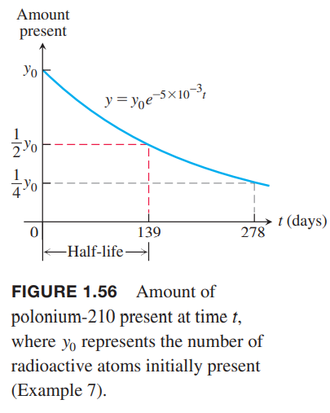

### 反三角函数
三角函数由于周期性，不是一对一函数，但是如果限制定义域的话，可以是一对一函数。正弦还是从$x=-\pi/2$的值-1增加到$x=\pi/2$的值1。在区间$[-\pi/2,\pi/2]$上是一对一函数，所以存在反函数$\arcsin x$，反正弦函数。如下图所示。  
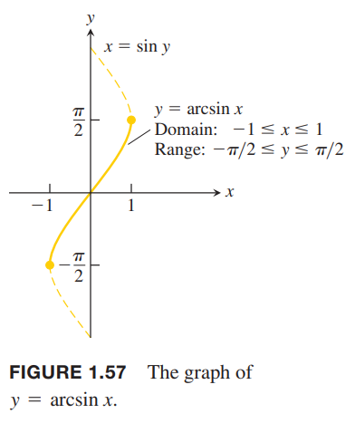  
类似的，我们可以限制所有六种三角函数的定义域。如下所示：  
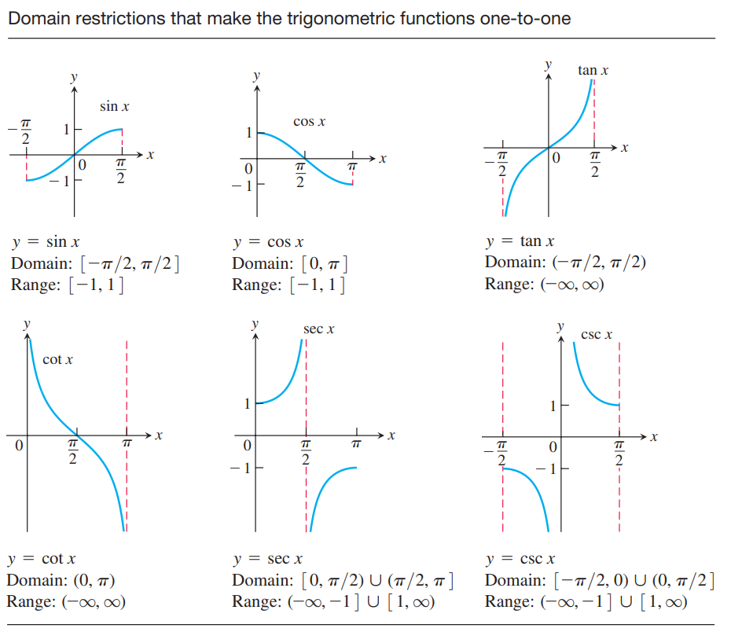  
当我们限制定义域之后的函数是一对一函数，所以有反函数，记作
$$\begin{aligned}
y&=\sin^{-1} x&\text{or}&&y=\arcsin x\\
y&=\cos^{-1} x&\text{or}&&y=\arccos x\\
y&=\tan^{-1} x&\text{or}&&y=\arctan x\\
y&=\cot^{-1} x&\text{or}&&y=\text{arccot } x\\
y&=\sec^{-1} x&\text{or}&&y=\text{arcsec } x\\
y&=\csc^{-1} x&\text{or}&&y=\text{arccsc } x
\end{aligned}$$
下图说明了$y=\arcsin x$图像的是从原函数沿$y=x$翻转而来。  
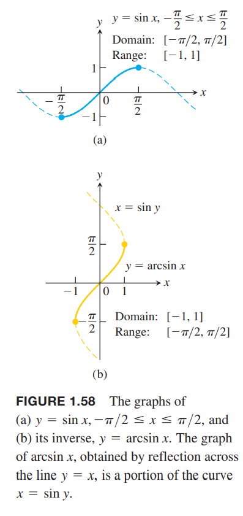  
类似地，我们可以得到六种反三角函数的图像。  
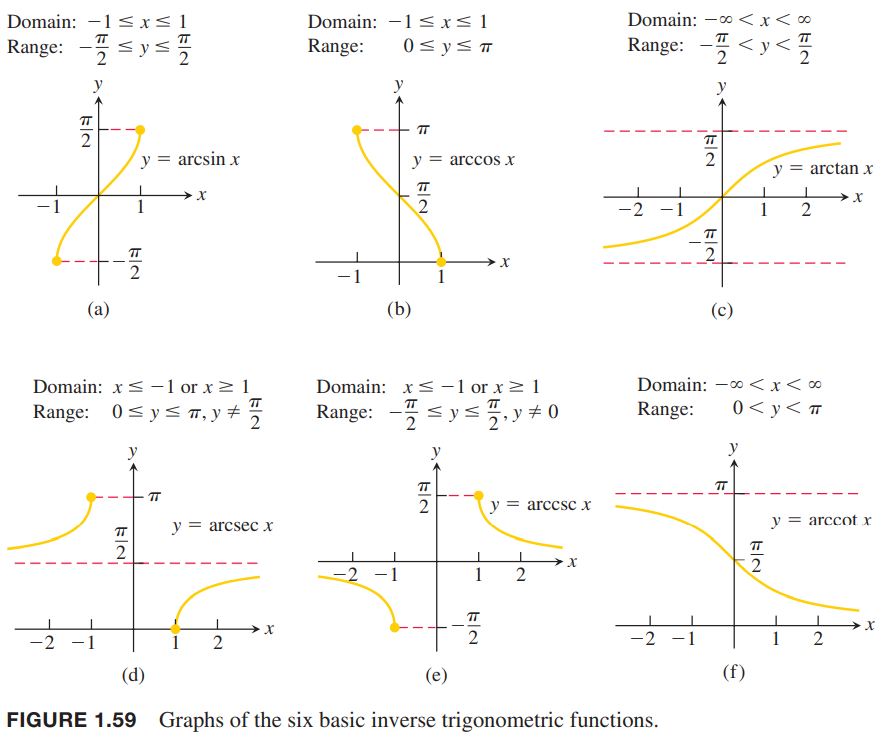

### 反正弦和反余弦函数
我们定义反正弦函数和反余弦函数的值域使用弧度表示且属于限制定义域的正弦函数和余弦函数的定义域。

**定义**  
$y=\arcsin x$是满足$\sin y=x$且在区间$[-\pi/2,\pi/2]$的值；  
$y=\arccos x$是满足$\cos y=x$且在区间$[0,\pi]$的值。

根据图1.58可以知道，$y=\arcsin x$关于原点对称，是奇函数，所以
$$\arcsin(-x)=-\arcsin x\tag{2}$$
下图是$y=\arccos x$的图像，没有任何对称性。  
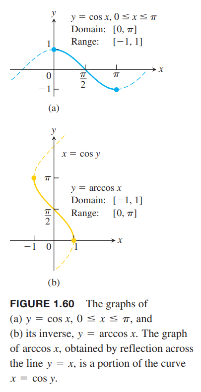  
例8 求（a）$\arcsin(\frac{\sqrt{3}}{2})$和（b）$\arccos(-\frac{1}{2})$的值。  
解：  
（a）如下图（a）所示，因为$\sin(\pi/3)=\frac{\sqrt{3}}{2}$且$\pi/3$属于反正弦函数的值域$[-\pi/2,\pi/2]$，所以
$$\arcsin(\frac{\sqrt{3}}{2})=\frac{\pi}{3}$$
（b）如下图（b）所示，因为$\cos(2\pi/3)=-1/2$且$2\pi/3$输入反余弦函数的值域$[0,\pi]$，所以
$$\arccos(-\frac{1}{2})=\frac{2\pi}{3}$$
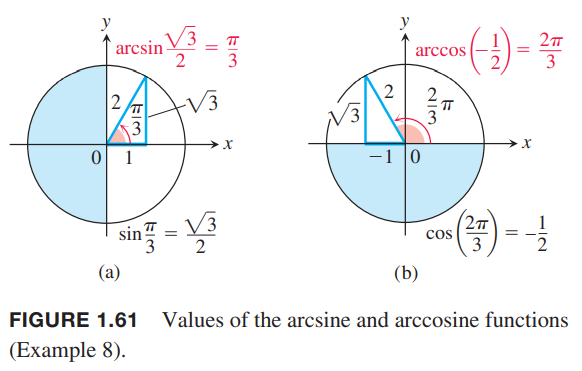  
使用例8的方法，可以得到下面关于反正弦和反余弦函数的值：  
| $x$ | $\arcsin x$ | $\arccos x$ |
|--|--|--|
| $\sqrt{3}/2$ | $\pi/3$ | $\pi/6$ |
| $\sqrt{2}/2$ | $\pi/4$ | $\pi/4$ |
| $1/2$ | $\pi/6$ | $\pi/3$ |
| $-1/2$ | $-\pi/6$ | $2\pi/3$ |
| $-\sqrt{2}/2$ | $-\pi/4$ | $3\pi/4$ |
| $-\sqrt{3}/2$ | $-\pi/3$ | $5\pi/6$ |

例9 从苏黎世飞往日内瓦的航线长度是240千米。飞行了180千米之后偏离了12千米。如下图所示。求偏离正确航线的角$a$和图中的角$b$以及偏航修正的角$c$的大小。  
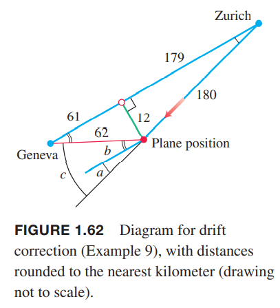  
解：由毕达哥拉斯定理可以近似计算出沿正确航线前进的距离是179千米，距离日内瓦61千米。那么飞机当前距离日内瓦的62千米。所以根据上图我们知道$180\sin a=12,62\sin b=12$，所以
$$\begin{aligned}
&a=\arcsin\frac{12}{180}&\approx 0.067 \text{ radian}&\approx 3.8^\circ\\
&b=\arcsin\frac{12}{61}&\approx 0.195 \text{ radian}&\approx 11.2^\circ\\
&c=a+b&&\approx 15^\circ
\end{aligned}$$

### 关于反正弦和反余弦函数的恒等式
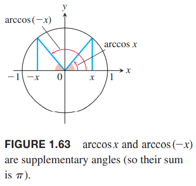  
从上图我们可以得到反余弦函数满足恒等式
$$\arccos x+\arccos (-x)=\pi\tag{3}$$
或
$$\arccos (-x)=\pi-\arccos x\tag{4}$$
从下图我们的三角形我们可以得到$x>0$时有
$$\arcsin x+\arccos x=\pi/2\tag{5}$$
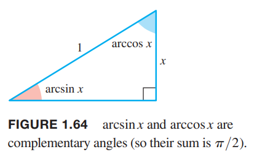  
等式$(5)$在$x\in [-1,1]$的区间上也成立，不过这一点无法从图中得出。可以从等式$(2),(4)$推出（习题80）。  

其余四种反三角函数会在3.9节给出具体的定义。我们还会用到现在讨论的恒等式得出更多关于反三角函数的性质。

### 习题
> 下面这个习题简单而不失严谨，详细的给出论证过程。

（80）上面提到等式$(5)$在$x\in [-1,1]$的区间上成立，但是图 1.64 只能得出在$(0,1)$上成立。求证在$[-1,1]$上成立。  
证：对于$x=1,0,-1$，我们可以单独验证，不再赘述。对于$x\in (-1,0)$，令$x=-a$，那么$a\in (0,1)$，所以可以得到
$$\arcsin a+\arccos a=\pi/2$$
将$a$代入公式$(3)$得到
$$\arccos a+\arccos (-a)=\pi$$
减去第一个式子得到
$$\arccos (-a)-\arcsin a=\pi/2$$
反正弦函数是奇函数，那么
$$-\arcsin a=\arcsin (-a)$$
所以
$$\arcsin(-a)+\arccos(-a)=\pi/2$$
