### 一对一函数

函数将定义域中的每个输入对应到值域中的一个输出。一些函数会将不同输入对应到同一输出，例如 $f(x)=x^2$ 中 $1$ 和 $-1$ 的函数值都为 $1$；正弦函数中 $\pi/3$ 和 $2\pi/3$ 的函数值都为 $\sqrt3/2$。另一些函数则将不同输入对应到不同输出，例如平方根函数和立方函数。

**定义**
> 设 $f$ 的定义域为 $D$。若对任意 $x_1,x_2\in D$，只要 $x_1\neq x_2$ 就有 $f(x_1)\neq f(x_2)$，则称 $f$ 是一对一函数（`one-to-one function`）。

例 1：有些函数在整个定义域上是一对一函数；另一些函数在限制为较小定义域后才是一对一函数。限制定义域后的函数与原函数定义域不同，因而是不同函数，但它们在较小定义域上的函数值相同。

1. $f(x)=\sqrt{x}$ 是一对一函数，因为 $x_1\neq x_2$ 时 $\sqrt{x_1}\neq\sqrt{x_2}$。
2. $g(x)=\sin x$ 在 $[0,\pi]$ 上不是一对一函数，因为 $\sin(\pi/6)=\sin(5\pi/6)$。但将定义域限制为 $[0,\pi/2]$ 后，正弦函数是一对一函数。

一对一函数的图像与任意水平线最多有一个交点。若某条水平线有多个交点，则同一输出值对应至少两个不同输入，函数便不是一对一函数。

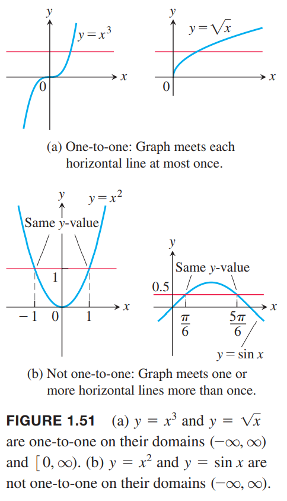

**水平线测试法**
> 函数 $f$ 是一对一函数，当且仅当其图像与每一条水平线最多有一个交点。

### 反函数

一对一函数的每个输出对应唯一输入，反函数可由该输出还原输入。

**定义**
> 设 $f$ 是定义域为 $D$、值域为 $R$ 的一对一函数。若 $f(a)=b$，则定义其反函数 $f^{-1}$ 为
>
> $$f^{-1}(b)=a.$$
>
> $f^{-1}$ 的定义域是 $R$，值域是 $D$。

$f^{-1}$ 中的 $-1$ 不是指数，$f^{-1}(x)$ 也不是 $1/f(x)$。函数 $f$ 与 $f^{-1}$ 的定义域和值域恰好互换。

例 2：给定一对一函数 $f$ 的函数表：

| $x$ | 1 | 2 | 3 | 4 | 5 | 6 | 7 | 8 |
|:--|--:|--:|--:|--:|--:|--:|--:|--:|
| $f(x)$ | 3 | 4.5 | 7 | 10.5 | 15 | 20.5 | 27 | 34.5 |

交换 $f$ 的输入和输出，可得到反函数 $f^{-1}$ 的函数表：

| $y$ | 3 | 4.5 | 7 | 10.5 | 15 | 20.5 | 27 | 34.5 |
|:--|--:|--:|--:|--:|--:|--:|--:|--:|
| $f^{-1}(y)$ | 1 | 2 | 3 | 4 | 5 | 6 | 7 | 8 |

函数 $f$ 将输入 $x$ 映射为 $f(x)$，而 $f^{-1}$ 将输入 $f(x)$ 映射回 $x$。因此

$$(f^{-1}\circ f)(x)=x\qquad\text{（对所有 }x\in D\text{）},$$

$$(f\circ f^{-1})(y)=y\qquad\text{（对所有 }y\in R\text{）}.$$

只有一对一函数才有反函数。否则若 $x_1\neq x_2$ 但 $f(x_1)=f(x_2)=y$，则 $f^{-1}(y)$ 必须同时等于 $x_1$ 和 $x_2$，不可能是函数。

严格递增或严格递减函数必是一对一函数，但一对一函数在非连通定义域上不一定单调。例如，$f(x)=1/x$ 定义在 $(-\infty,0)\cup(0,\infty)$ 上，是一对一函数，却不在整个定义域上递增或递减。

### 寻找反函数

函数及其反函数的图像紧密相关。从函数图像读取函数值时，从 $x$ 轴上的输入开始，垂直移动到图像，再水平移动到 $y$ 轴以读出输出。读取反函数值时，这一过程恰好反过来：从 $y$ 轴上的值开始，水平移动到 $y=f(x)$ 的图像，再垂直移动到 $x$ 轴以读出 $f^{-1}(y)$。

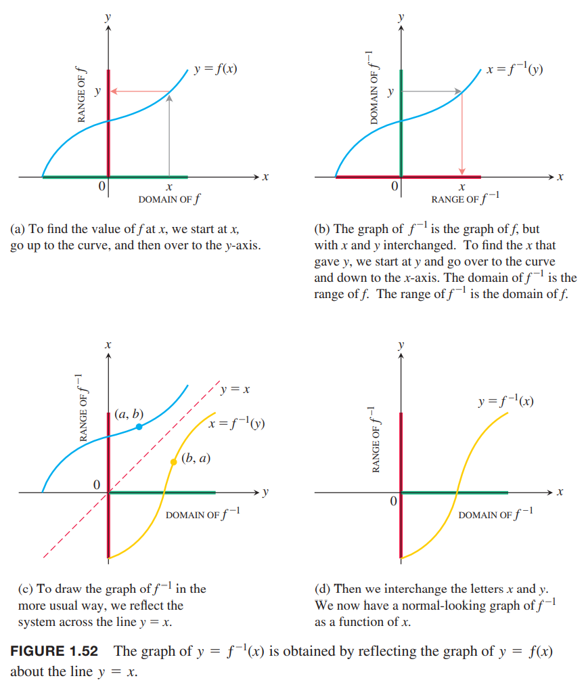

为按通常方式从 $x$ 轴读取 $f^{-1}(x)$，可将 $f$ 的图像关于 $y=x$ 对称。对称后的图像就是 $f^{-1}$ 的图像。

**求反函数的方法**
> 从 $f$ 得到 $f^{-1}$ 可按以下两步进行：
>
> 1. 解方程 $y=f(x)$，把 $x$ 表示为 $y$ 的函数，即 $x=f^{-1}(y)$；
> 2. 交换 $x,y$ 两个字母，使 $x$ 成为自变量、$y$ 成为因变量。

例 3：求函数 $y=\frac12x+1$ 的反函数。

解：

$$
\begin{aligned}
y&=\frac12x+1,\\
2y&=x+2,\\
x&=2y-2.
\end{aligned}
$$

交换 $x,y$，得到反函数

$$y=2x-2.$$

两个函数的图像如下。

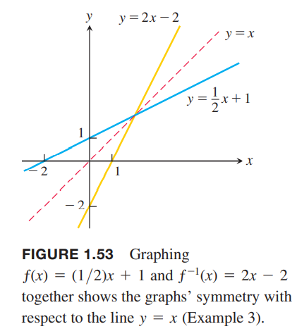

可用复合函数验证：

$$
\begin{aligned}
f^{-1}(f(x))
&=2\left(\frac12x+1\right)-2
=x,\\
f(f^{-1}(x))
&=\frac12(2x-2)+1
=x.
\end{aligned}
$$

例 4：求 $y=x^2$（$x\geq0$）的反函数。

解：在 $x\geq0$ 上，$y=x^2$ 通过水平线测试，故有反函数。

$$
\begin{aligned}
y&=x^2,\\
\sqrt{y}&=\sqrt{x^2}=|x|=x.
\end{aligned}
$$

因此反函数为 $y=\sqrt{x}$。

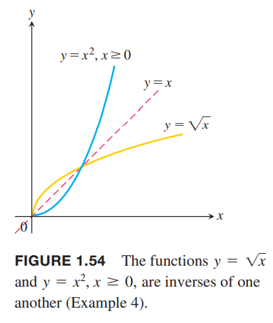

注意，未限制定义域的 $y=x^2$ 不能通过水平线测试，因而没有反函数。

### 对数函数

若 $a>0$ 且 $a\neq1$，则底数为 $a$ 的指数函数 $f(x)=a^x$ 是一对一函数，故有反函数，称为底数为 $a$ 的对数函数（`logarithmic function with base $a$`）。

**定义**
> 函数
>
> $$y=\log_a x\qquad(a>0,\ a\neq1)$$
>
> 是指数函数 $y=a^x$ 的反函数。

$\log_a x$ 的定义域为 $(0,\infty)$，即 $a^x$ 的值域；其值域为 $(-\infty,\infty)$，即 $a^x$ 的定义域。当 $a>1$ 时，$y=a^x$ 递增，故其反函数 $y=\log_a x$ 也递增，但增长缓慢。

对数的值通常不能只用有限次基本代数运算精确求出；但可将 $y=a^x$ 的图像关于 $y=x$ 对称，从而得到 $y=\log_a x$ 的图像。下图展示 $a=2$ 与 $a=e$ 时的情形。

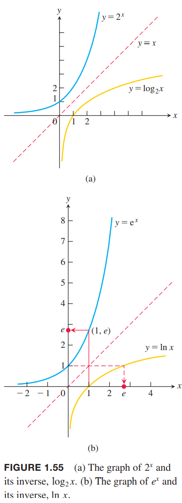

以 2 为底的对数常用于二进制和计算机领域。以 $e$ 和 10 为底的对数很常用，分别记为

$$\log_e x=\ln x,\qquad \log_{10}x=\log x.$$

由于 $e^1=e$，有 $\ln e=1$。

### 对数性质

John Napier 发明对数的重要意义，在于它使计算机出现前的算术运算大为简化：乘法转化为加法，除法转化为减法，幂运算转化为指数与对数的乘法。

**自然对数规则**
> 对任意 $b>0$、$x>0$ 以及任意实数 $r$，有：
>
> 1. $\ln(bx)=\ln b+\ln x$；
> 2. $\ln\left(\dfrac{b}{x}\right)=\ln b-\ln x$；
> 3. $\ln\left(\dfrac1x\right)=-\ln x$；
> 4. $\ln(x^r)=r\ln x$。

第三条可看作第二条取 $b=1$ 的情形。前三条在第三章证明；第四条对无理数 $r$ 的情形将在第四章证明。第七章将讨论任意底数的相应规则。

例 5：使用上述法则化简下列各式（假定各对数的真数为正）。

1. $\ln4+\ln(\sin x)=\ln(4\sin x)$；
2. $\ln\dfrac{x+1}{2x-3}=\ln(x+1)-\ln(2x-3)$；
3. $\ln\dfrac18=-\ln8=-\ln2^3=-3\ln2$。

因为 $a^x$ 和 $\log_a x$ 互为反函数，以任意顺序复合都会得到恒等函数。

**$a^x$ 与 $\log_a x$ 的性质**
> 当 $a>0$、$a\neq1$ 且 $x>0$ 时，
>
> $$a^{\log_a x}=x,\qquad \log_a(a^x)=x.$$
>
> 特别地，
>
> $$e^{\ln x}=x,\qquad \ln(e^x)=x.$$

由 $x=e^{\ln x}$，可用 $e$ 的幂改写任意指数函数：

$$
\begin{aligned}
a^x&=e^{\ln(a^x)}\\
&=e^{x\ln a}\\
&=e^{(\ln a)x}.
\end{aligned}
$$

因此，$a^x$ 等价于 $e^{kx}$，其中 $k=\ln a$。例如，

$$
2^x=e^{x\ln2},\qquad
5^{-3x}=e^{(\ln5)(-3x)}=e^{-3x\ln5}.
$$

又由

$$\ln x=\ln(a^{\log_a x})=(\log_a x)\ln a,$$

可得 $\log_a x=\ln x/\ln a$。这表明每个对数函数都是自然对数函数的常数倍，也可将自然对数的性质推广到任意底数。

**换底公式**
> 当 $a>0$、$a\neq1$、$x>0$ 时，
>
> $$\log_a x=\frac{\ln x}{\ln a}.$$

### 对数应用

第 1.4 节研究过指数函数的应用；这里从对数性质的角度继续研究。

例 6：投资 1000 元，年利率为 $5.25\%$，按年复利。账户余额何时达到 2500 元？

解：令 $P=1000$、$r=0.0525$。$t$ 年后的余额为 $1000(1.0525)^t$。由题意，

$$1000(1.0525)^t=2500.$$

因此

$$
\begin{aligned}
1.0525^t&=2.5,\\
\ln(1.0525^t)&=\ln2.5,\\
t\ln1.0525&=\ln2.5,\\
t&=\frac{\ln2.5}{\ln1.0525}\approx17.9.
\end{aligned}
$$

所以约 18 年后余额达到 2500 元。

**半衰期**
> 放射性物质的半衰期是其原子核数衰变至初始数量一半所需的时间。它取决于物质本身，而不取决于初始原子核数。

例 7：求放射性物质半衰期的通式，并计算钋 210 的半衰期。

设初始原子核数为 $y_0$，时刻 $t$ 的原子核数为 $y=y_0e^{-kt}$。令 $y=\frac12y_0$，则

$$
\begin{aligned}
y_0e^{-kt}&=\frac12y_0,\\
e^{-kt}&=\frac12,\\
-kt&=\ln\frac12=-\ln2,\\
t&=\frac{\ln2}{k}.
\end{aligned}
$$

故半衰期只依赖于 $k$，与 $y_0$ 无关。钋 210 的衰变模型为

$$y=y_0e^{-5\times10^{-3}t},$$

其中 $t$ 以天为单位。因此其半衰期为

$$\frac{\ln2}{5\times10^{-3}}\approx139\text{ 天}.$$

约 139 天后，放射性原子核剩余 $y_0$ 的一半；再过 139 天（共约 278 天）后，只剩四分之一。

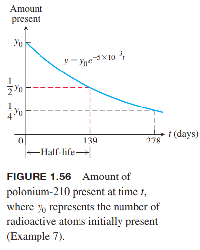

### 反三角函数

三角函数因具有周期性，通常不是一对一函数；限制定义域后可以成为一对一函数。正弦函数在 $[-\pi/2,\pi/2]$ 上从 $-1$ 增至 $1$，故在该区间是一对一函数，并有反函数 $\arcsin x$，称为反正弦函数。

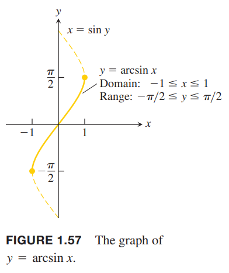

类似地，可限制所有六种三角函数的定义域，如下图所示。

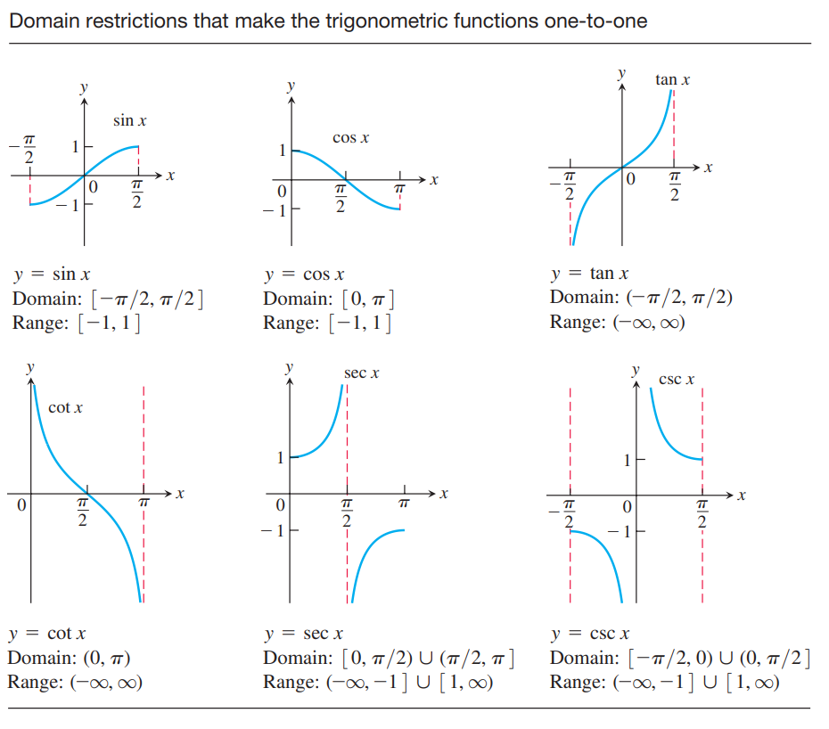

限制后的函数均为一对一函数，故有反函数，记为

$$
\begin{aligned}
y&=\sin^{-1}x&&\text{或}&&y=\arcsin x,\\
y&=\cos^{-1}x&&\text{或}&&y=\arccos x,\\
y&=\tan^{-1}x&&\text{或}&&y=\arctan x,\\
y&=\cot^{-1}x&&\text{或}&&y=\operatorname{arccot}x,\\
y&=\sec^{-1}x&&\text{或}&&y=\operatorname{arcsec}x,\\
y&=\csc^{-1}x&&\text{或}&&y=\operatorname{arccsc}x.
\end{aligned}
$$

下图说明 $y=\arcsin x$ 的图像由原函数图像关于 $y=x$ 对称得到。

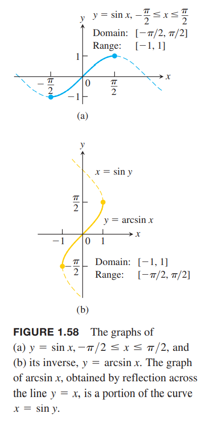

类似地，可以得到六种反三角函数的图像。

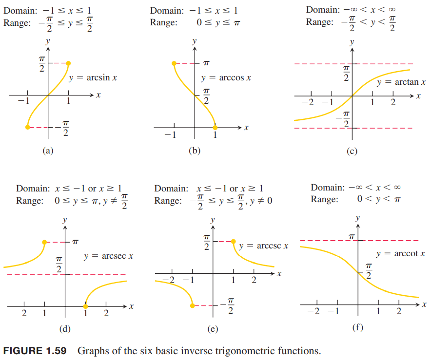

### 反正弦和反余弦函数

反正弦和反余弦函数的值域分别取为被限制的正弦函数和余弦函数的定义域，并以弧度表示。

**定义**
> - $y=\arcsin x$ 是满足 $\sin y=x$ 且 $y\in[-\pi/2,\pi/2]$ 的唯一值；
> - $y=\arccos x$ 是满足 $\cos y=x$ 且 $y\in[0,\pi]$ 的唯一值。

由图 1.58 可知，$y=\arcsin x$ 关于原点对称，故它是奇函数：

$$\arcsin(-x)=-\arcsin x.\tag{1}$$

$y=\arccos x$ 的图像没有这种对称性。

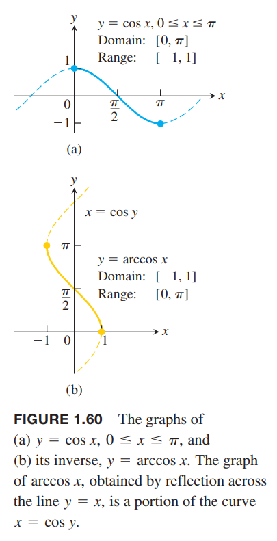

例 8：求下列值：

1. $\arcsin\left(\dfrac{\sqrt3}{2}\right)$；
2. $\arccos\left(-\dfrac12\right)$。

解：

1. 因为 $\sin(\pi/3)=\frac{\sqrt3}{2}$，且 $\pi/3\in[-\pi/2,\pi/2]$，所以

   $$\arcsin\left(\frac{\sqrt3}{2}\right)=\frac{\pi}{3}.$$

2. 因为 $\cos(2\pi/3)=-\frac12$，且 $2\pi/3\in[0,\pi]$，所以

   $$\arccos\left(-\frac12\right)=\frac{2\pi}{3}.$$

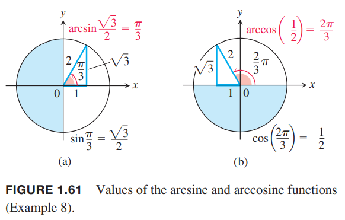

用同样方法可得到下表。

| $x$ | $\arcsin x$ | $\arccos x$ |
|:--|:--|:--|
| $\sqrt3/2$ | $\pi/3$ | $\pi/6$ |
| $\sqrt2/2$ | $\pi/4$ | $\pi/4$ |
| $1/2$ | $\pi/6$ | $\pi/3$ |
| $-1/2$ | $-\pi/6$ | $2\pi/3$ |
| $-\sqrt2/2$ | $-\pi/4$ | $3\pi/4$ |
| $-\sqrt3/2$ | $-\pi/3$ | $5\pi/6$ |

例 9：从苏黎世飞往日内瓦的航线长 240 千米。飞机飞行 180 千米后偏离航线 12 千米，如下图所示。求偏离正确航线的角 $a$、图中的角 $b$ 与修正航向的角 $c$。

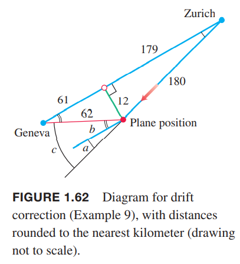

解：飞机沿正确航线前进的距离为

$$\sqrt{180^2-12^2}\approx179.6\text{ 千米},$$

故距日内瓦沿航线约 $60.4$ 千米，飞机到日内瓦的直线距离为

$$\sqrt{60.4^2+12^2}\approx61.6\text{ 千米}.$$

因此

$$
\begin{aligned}
a&=\arcsin\frac{12}{180}\approx0.067\text{ rad}\approx3.8^\circ,\\
b&=\arcsin\frac{12}{61.6}\approx0.196\text{ rad}\approx11.2^\circ,\\
c&=a+b\approx0.263\text{ rad}\approx15.0^\circ.
\end{aligned}
$$

### 关于反正弦和反余弦函数的恒等式

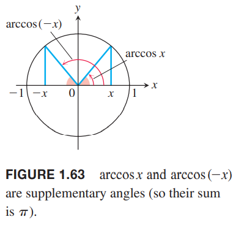

由上图可得

$$\arccos x+\arccos(-x)=\pi,\tag{2}$$

即

$$\arccos(-x)=\pi-\arccos x.\tag{3}$$

下图中的直角三角形表明，当 $x>0$ 时，

$$\arcsin x+\arccos x=\frac{\pi}{2}.\tag{4}$$

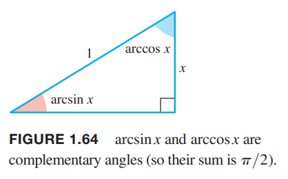

等式 (4) 对所有 $x\in[-1,1]$ 都成立，尽管这一点不能仅由图形直接看出；可由式 (1)、(3) 推出。

其余四种反三角函数将在第 3.9 节给出严格定义。还可利用这里的恒等式导出更多反三角函数性质。

### 习题

> 下题简洁但严谨地给出了等式 (4) 在整个定义域上的证明。

80. 已知图 1.64 只能直接说明式 (4) 在 $(0,1)$ 上成立。证明它在 $[-1,1]$ 上成立。

证明：当 $x=1,0,-1$ 时可直接验证。若 $x\in(-1,0)$，令 $x=-a$，则 $a\in(0,1)$。由式 (4)，

$$\arcsin a+\arccos a=\frac{\pi}{2}.$$

由式 (2)，

$$\arccos a+\arccos(-a)=\pi.$$

两式相减，得

$$\arccos(-a)-\arcsin a=\frac{\pi}{2}.$$

再由反正弦函数的奇性 $\arcsin(-a)=-\arcsin a$，可得

$$\arcsin(-a)+\arccos(-a)=\frac{\pi}{2}.$$

故式 (4) 对 $[-1,1]$ 上所有 $x$ 成立。
