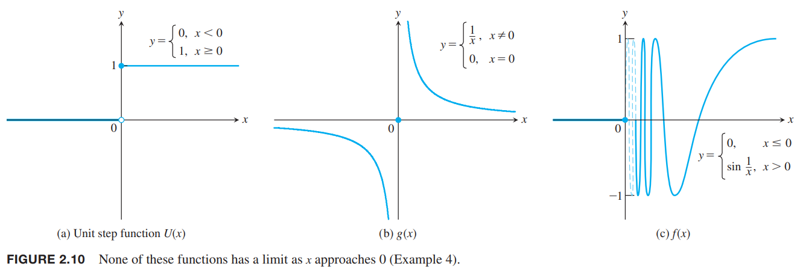

上一小节中，我们看到在寻找瞬时变化率和切线斜率时极限是如何出现的。这一节首先会给出极限的非正式定义和描述极限行为的规律。这些规律能帮助我们快速计算各种函数的极限。下一节会给出正式定义。

### 函数值的极限
研究函数$y=f(x)$时，我们会对特殊点$c$附近的行为感兴趣，而不是$c$点的函数值。一个特殊的情况就是在$c$点出现除0，这是未定义行为。上一节寻找$y$在某点瞬时速度就会遇到$\Delta y/h$，而这里的$h$就会趋于0。  
例1 描述函数在$x=1$附近的情况。
$$f(x)=\frac{x^2-1}{x-1}$$
解：函数的定义域是$x\neq 1$，排除这一点之后，我们可以化简函数
$$f(x)=\frac{(x+1)(x-1)}{x-1}=x+1,x\neq 1$$
图像如下图所示，和$y=x+1$不同的是点$(1,2)$被移除了。尽管函数在$x=1$处无定义，但是我们可以清楚的看到随着$x$越来越接近1，$f(x)$的值会越来越接近2。下面的表也能说明这一点。  

| $x$ | $f(x)=\frac{x^2-1}{x-1}$ |
|--|--|
| 0.9 | 1.9 |
| 1.1 | 2.1 |
| 0.99 | 1.99 |
| 1.01 | 2.01 |
| 0.999 | 1.999 |
| 1.001 | 2.001 |
| 0.999999 | 1.999999 |
| 1.000001 | 2.000001 |

### 函数极限的非正式描述
假设$f(x)$在$c$附近的开区间（排除$c$自身）是有定义的。如果对于$x$越来越接近$c$（不是$c$本身），$f(x)$任意接近数$L$，那么我们说$x$趋于$c$时$f$趋于极限（`limit`）$L$，记作
$$\lim_{x\to c}f(x)=L$$
例1中随着$x$趋于1时$f(x)$趋于2，写作
$$\lim_{x\to 1}f(x)=2$$
在这个非正式定义中，我们无须考虑函数在$c$点的值。  
这个定义是非正式的原因是任意接近、无限靠近这些都是不精确的描述，依赖于上下文。比如机械工程的接近是毫米量级而天文学家的接近指的是数千光年。不过，这个定义可以帮助我们计算许多函数的极限值。下一节会给出精确定义并证明关于极限的理论、学习更复杂的函数。下面给出更多的例子来阐述极限的思想。  
例2 函数的极限不依赖于函数在考察点的定义。参考下图。函数$f$在$x=1$处无定义，但是极限是2。函数$g$在$x=1$处的极限是2，但是不等于$g(1)$。函数$h$在$x=1$处的极限是2且刚好等于$h(1)$。最后这个相等$\lim_{x\to 1}h(x)=h(1)$有重要意义。这体现出了连续的概念，我们在2.6节学习连续。  
  
计算极限的过程可以分解成一系列涉及基本函数的极限和一些简单操作的步骤。下面是两个基本函数。  
例3 计算恒等函数和常值函数$x$趋于$c$时的极限。  
解：如下图（a）所示，对于恒等函数$f(x)=x$，任意$c$都有
$$\lim_{x\to c}f(x)=\lim_{x\to c}x=c$$
  
如上图（b）所示，对于常值函数$f(x)=k$，任意$c$都有
$$\lim_{x\to c}f(x)==\lim_{x\to c}k=k$$
举两个具体的例子
$$\lim_{x\to 3}x=3$$
$$\lim_{x\to -7}(4)=\lim_{x\to 2}(4)=4$$
我们会在下一小节证明这两个法则。  
一个函数或许在某个点是没有极限的。下图和下一个例子阐述了几种情况。  
  
例4 下面是上图的三个函数，解释为什么在$x\to 0$时没有极限。  
$$U(x)=\begin{cases}
0,&&x<0\\
1,&&x\geq 0
\end{cases}$$
$$g(x)=\begin{cases}
\frac{1}{x},&&x\neq 0\\
0,&&x=0
\end{cases}$$
$$f(x)=\begin{cases}
0,&&x\leq 0\\
\sin\frac{1}{x},&&x>0
\end{cases}$$
解：  
（a)单位阶跃函数（`unit step function`）在$x=0$处有跳跃。当负$x$趋于0时，极限是0，当$x$是正值且趋于0时，极限是1。当$x\to 0$时不存在单一值$L$。  
（b）当$x\to 0$时，$g$会增长到无限大。我们称这种函数是无界的。  
（c）$x\to 0$时，包含0的任意开区间上函数值都在$[-1,1]$振荡。那么在$x\to 0$时函数值不可能是单一值。

### 极限法则
一些基本规则使得我们可以将复杂函数的极限计算分解成简单函数的计算。

**定理1 极限法则**  
如果$L,M,c,k$是实数，并且
$$\lim_{x\to c}f(x)=L,\lim_{x\to c}g(x)=M$$
那么  
1. 加法规则：$\lim_{x\to c}(f(x)+g(x))=L+M$
2. 减法规则：$\lim_{x\to c}(f(x)-g(x))=L-M$
3. 常数倍法则：$\lim_{x\to c}(k\cdot f(x))=k\cdot L$
4. 乘法法则：$\lim_{x\to c}(f(x)\cdot g(x))=L\cdot M$
5. 除法法则：$\lim_{x\to c}\frac{f(x)}{g(x)}=\frac{L}{M},M\neq 0$
6. 幂次法则：$\lim_{x\to c}[f(x)]^n=L^n,n$ 是正整数
7. 根法则：$\lim_{x\to c}\sqrt[n]{f(x)}=\sqrt[n]{L}=L^{1/n}, n$ 是正整数，且如果$n$是偶数，那么需要假设$f(x)$在包含$c$的区间是非零值。

这些法则看起来都是非常直观的。法则 1-5 会在 2.3 小节证明；使用若干次法则 4 可以得到法则 6；最后一个超出了本书的讨论范围。和、差、积这些规则可以扩展到任意个函数。

例5 结合$\lim_{x\to c}k=k,\lim_{x\to c}x=c$和上面的法则，求下面函数的极限：
（a）
$$\lim_{x\to c}(x^3+4x^2-3)$$
（b）
$$\lim_{x\to c}\frac{x^4+x^2-1}{x^2+5}$$
（c）
$$\lim_{x\to -1}\sqrt{4x^2-3}$$
解：  
（a）
$$\begin{aligned}
\lim_{x\to c}(x^3+4x^2-3)&=\lim_{x\to c}x^3+\lim_{x\to c}4x^2-\lim_{x\to c}3\\
&=c^3+4c^2-3
\end{aligned}$$
（b）
$$\begin{aligned}
\lim_{x\to c}\frac{x^4+x^2-1}{x^2+5}&=\frac{\lim_{x\to c}(x^4+x^2-1)}{\lim_{x\to c}(x^2+5)}\\
&=\frac{c^4+c^2-1}{c^2+5}
\end{aligned}$$
（c）
$$\begin{aligned}
\lim_{x\to -1}\sqrt{4x^2-3}&=\sqrt{\lim_{x\to -2}(4x^2-3)}\\
&=\sqrt{4(-2)^2-3}\\
&=\sqrt{13}
\end{aligned}$$

### 多项式函数和有理函数的极限
定理1极限法则大大简化了求多项式函数和有理数函数的极限。对于多项式函数，将$x=c$代入多项式即可。对于有理函数，如果$c$不使得分母为零，直接代入即可。

**定理2 多项式的极限**  
如果$P(x)=a_nx^n+a_{n-1}x^{n-1}+\cdots+a_0$，那么
$$\lim_{x\to c}P(x)=P(c)=a_nc^n+a_{n-1}c^{n-1}+\cdots+a_0$$

**定理3 有理函数的极限**
如果$P(x),Q(x)$是多项式函数，且$Q(c)\neq 0$，那么
$$\lim_{x\to c}\frac{P(x)}{Q(x)}=\frac{P(c)}{Q(c)}$$

例6 求$\lim_{x\to -1}\frac{x^3+4x^2-3}{x^2+5}$。  
解：因为$x=-1$不会使得分母是零，所以代入$x=-1$即可。
$$\lim_{x\to -1}\frac{x^3+4x^2-3}{x^2+5}=\frac{(-1)^3+4(-1)^2-3}{(-1)^2+5}=\frac{0}{6}=0$$

### 消除分母为0的公共项
定理3只适用于在$c$处分母不为零的情况。如果分母为零，那么消除使得分母为零的项，那么可以找到化简的函数的极限值。  
例7 求
$$\lim_{x\to 1}\frac{x^2+x-2}{x^2-x}$$
解：我们不能将$x=1$代入函数，因为分母会为零。经过测试，分子也是零。所以$x-1$是分子分母的公共项，可以消除公因项。
$$\frac{x^2+x-2}{x^2-x}=\frac{(x-1)(x+2)}{x(x-1)}=\frac{x+2}{x}, x\neq 1$$
使用简化的部分，可以代入$x=1$来计算$x\to 1$时的极限。
$$\lim_{x\to 1}\frac{x^2+x-2}{x^2-x}=\lim_{x\to 1}\frac{x+2}{x}=3$$
几何意义如下图所示：  

### 使用计算机估算极限
我们可以用计算机通过数值法估计极限。不过，可以会给出一个错误的值和误导性的信息。通常，错误源于舍入误差。  
例8 估计
$$\lim_{x\to 0}\frac{\sqrt{x^2+100}-10}{x^2}$$
解：如下表，如果我们取$\pm 1,\pm 0.5,\pm 0.1,\pm 0.01$以表示$x$趋于0，那么极限值趋于0.5。  
我们取更小的$x$的值$\pm 0.0005,\pm 0.0001,\pm 0.00001,\pm 0.000001$，极限值是0。

| $x$ | $f(x)$ |
|--|--|
| $\pm 1$ | $0.049876$ |
| $\pm 0.5$ | $0.049969$ |
| $\pm 0.1$ | $0.049999$ |
| $\pm 0.01$ | $0.050000$ |
| $\pm 0.0005$ | $0.050000$ |
| $\pm 0.0001$ | $0.000000$ |
| $\pm 0.00001$ | $0.000000$ |
| $\pm 0.000001$ | $0.000000$ |

使用计算机可能给出莫能两可的值。主要原因是$x$很小的时候计算$f(x)$时会有舍入误差。我们不能代入$x=0$因为分母为零，也和例7不一样，没有明显的公共项。不过，有时可以构造公共项。  
例9 求
$$\lim_{x\to 0}\frac{\sqrt{x^2+100}-10}{x^2}$$
解：我们可以通过分子分母同乘$\sqrt{x^2+100}+10$使得分子分母有公因子。
$$\begin{aligned}
\frac{\sqrt{x^2+100}-10}{x^2}&=\frac{\sqrt{x^2+100}-10}{x^2}\cdot\frac{\sqrt{x^2+100}+10}{\sqrt{x^2+100}+10}\\
&=\frac{x^2}{x^2(\sqrt{x^2+100}+10)}\\
&=\frac{1}{\sqrt{x^2+100}+10}
\end{aligned}$$
然后就可以代入$x=0$了
$$\begin{aligned}
\lim_{x\to 0}\frac{\sqrt{x^2+100}-10}{x^2}&=\lim_{x\to 0}\frac{1}{\sqrt{x^2+100}+10}\\
&=\frac{1}{\sqrt{0^2+100}+10}\\
&=\frac{1}{20}=0.05
\end{aligned}$$
我们不能总是用这种方式来求分母为零的表达式的极限。某些情况下，我们可以用几何学论点来解（2.4节定理7），或者用 4.5节的方法。下面会学习如何用已知极限的函数来求解。

### 夹逼定理
夹逼定理（`squeeze theorem`）又称为三明治定理（`sandwich theorem`），因为要求的$f$在其他两个在$c$点极限为$L$的函数$g,h$之间。如下图所示。函数$f$在$c$点的极限值也是$L$。证明见 2.4 节。

**定理4 夹逼定理**  
对于在一些包含$c$的区间（排除$x=c$自身）的所有$x$都有$g(x)\leq f(x)\leq h(x)$，且
$$\lim_{x\to c}g(x)=\lim_{x\to c}h(x)=L$$
那么
$$\lim_{x\to c}f(x)=L$$

例10 函数$u$满足
$$1-\frac{x^2}{4}\leq u(x)\leq 1+\frac{x^2}{2}, x\neq 0$$
求$\lim_{x\to 0} u(x)$。  
解：由
$$\lim_{x\to 0}(1-\frac{x^2}{4})=1,\lim_{x\to 0}(1+\frac{x^2}{2})=1$$
可以得到
$$\lim_{x\to 0}u(x)=1$$
如下图所示：  
  
例11 使用夹逼定理证明：  
（a）$\lim_{\theta\to 0}\sin\theta=0$  
（b）$\lim_{\theta\to 0}\cos\theta=1$  
（c）对任意函数$f$，$\lim_{x\to c}|f(x)|=0$蕴涵$\lim_{x\to c}f(x)=0$  
解：  
（a）1.3节我们知道$-|\theta|\leq\sin\theta\leq |\theta|$，又因为$\lim_{\theta\to 0}(-|\theta|)=\lim_{\theta\to 0}|\theta|=0$，所以有
$$\lim_{\theta\to 0}\sin\theta=0$$
（b）1.3节我们知道$0\leq 1-\cos\theta \leq|\theta|$，又有$\lim_{\theta\to 0}(1-\cos\theta)=0$，所以
$$\lim_{\theta\to 0}\cos\theta=\lim_{\theta\to 0}1-(1-\cos\theta)=1-\lim_{\theta\to 0}(1-\cos\theta)=1-0=1$$
（c）因为$-|f(x)|\leq f(x)\leq |f(x)|$，并且$x\to c$时，$-|f(x)|,|f(x)|$的极限是0，那么$\lim_{x\to c}f(x)=0$。
