现在我们学习极限的定义。对于严格的定义而言，避免使用任意接近这种描述性的语言。  

例1 思考$y=2x-1$在$x=4$附近的情况。直觉上有$\lim_{x\to 4}f(x)=7$。考虑$x=4$附近，$x$是多么靠近4使得$y=2x-1$和7的差距是小于两个单位长度？  
解：问题本质就是使得$|y-7|<2$？
$$|2x-1-7|=|2x-8|<2$$
那么
$$\begin{aligned}
|2x-8|&<2\\
-2&<2x-8&<2\\
3&<x&<5\\
-1&<x-4&<1
\end{aligned}$$
$x$在4附近一个单位长度的范围使得$y$在7附近两个单位长度以内。如下图所示  
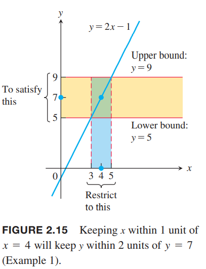

上面这个例子给了一个示例，$x$必须多么接近$c$才能保证$f(x)$在极限值$L$附近的指定区间。为了证明$x\to c$时$f(x)$的极限是$L$，我们必须能够证明$f(x)$和$L$之间的距离可以小于任意指定的误差，不管这个误差多小，总是可以通过$x$接近$c$来做到。为了描述任意指定的误差，引入两个常量，用$\delta$和$\varepsilon$。这两个量通常用于表述很小的变化。

### 极限的定义
只要 $x$ 位于距离 $c$ $\delta$ 长度附近，那么我们可以说 $f(x)$ 位于 $L$ 附近的区间 $L-(1/10),L+(1/10)$。如下图所示：

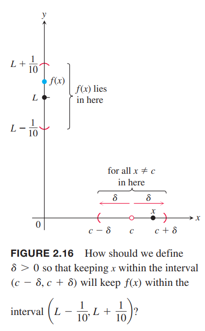

但是这不足够说明极限，因为随着$x$移向$c$，没有谁能保证始终$f(x)$位于$L$附近的区间 $L-(1/10),L+(1/10) $并趋于$L$，有可能跳到其他值。我们可以把错误区间变小，比如$1/100,1/1000$，甚至是$1/100000$。每一次，我们都能在$c$附近找到一个新的区间使得$f(x)$满足这个误差。  
下图解释了整个过程。可以想象一个怀疑者和一个学者在辩论。怀疑者给出$\varepsilon$区间以挑战极限是否存在，学者总是能在$c$附近找到一个区间$\delta$确保函数值都在$L$附近$\varepsilon$的区间。  
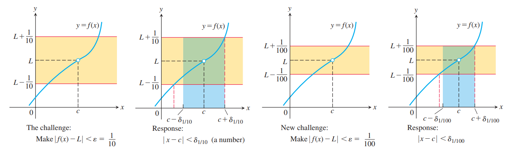  
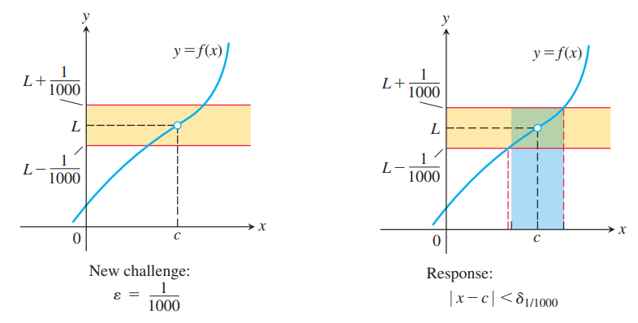  
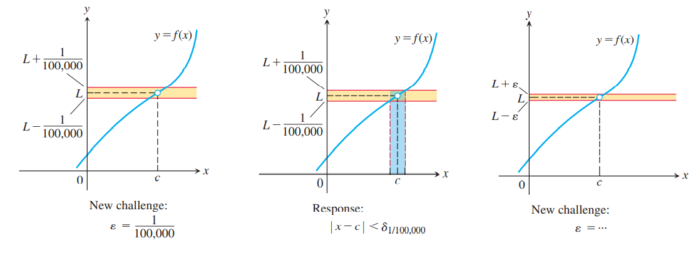  
如果停止这个过程呢？我们通过证明对于每一个错误容忍区间$\varepsilon$，我们总有一个匹配的$\delta$区间使得$x$充分接近$c$时$f(x)$的值是在$L\pm \varepsilon$这个区间内的。如下图所示：  
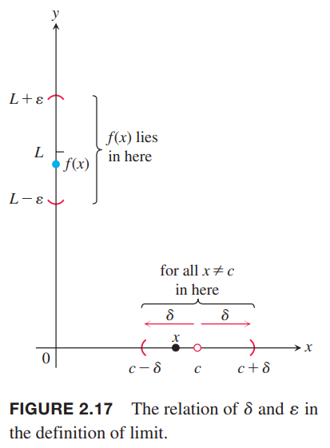

**定义** $f(x)$在$c$附近的开区间有定义，除了$c$点外。如果对于每一个$\varepsilon>0$都有一个相应的$\delta>0$使得
$$|f(x)-L|<\varepsilon \text{ whenever } 0<|x-c|<\delta$$
那么我们称$x$趋于$c$时$f(x)$的极限是$L$，写作
$$\lim_{x\to c}f(x)=L$$

### 示例：定义的应用
函数极限的定义并没有告诉我们如何计算极限，而是能够让我们验证猜想是否正确。下面的例子将说明这一点。不过定义的真实目的不是这个，而是为了证明诸如上一节中出现的定理而简化极限的计算。

例2 证明
$$\lim_{x\to 1}(5x-3)=2$$
证明：令$c=1,f(x)=5x-3,L-2$。对于任意给定的$\varepsilon>0$，我们需要找到一个合适的$\delta>0$，$x$在区间
$$0<|x-1|<\delta$$
那么$f(x)$在$L$附近区间满足
$$|f(x)-2|<\varepsilon$$
我们代入$f(x)$到包含$\varepsilon$的不等式来计算$\delta$
$$\begin{aligned}
|(5x-3)-2|=&|5x-5|&<\varepsilon\\
&5|x-1|&<\varepsilon\\
&|x-1|&<\varepsilon
\end{aligned}$$
我们可以取$\delta=\varepsilon/5$（如下图）。如果$0<|x-1|<\delta=\varepsilon/5$那么
$$\begin{aligned}|(5x-3)-2|&=|5x-5|\\&=5|x-1|&\\&<5(\varepsilon/5)=\varepsilon\end{aligned}$$
这就证明了$\lim_{x\to 1}(5x-3)=2$。  
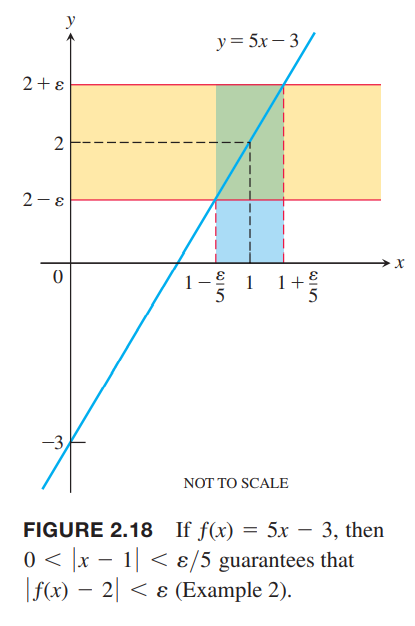  
$\delta=\varepsilon/5$不是唯一使得$0<|x-1|<\delta$蕴涵$|5x-5|<\varepsilon$。任意更小的$\delta$都是可以的。定义只不要求求最佳的$\delta$而只要有一个即可。

例3 证明2.2节的两个公式  
（a）$\lim_{x\to c} x = c$  
（b）$\lim_{x\to c} k = k$  
解：  
（a）令$\varepsilon>0$，我们需要找到$\delta>0$有
$$|x-c|<\varepsilon \text{ whenever } 0<|x-c|<\delta$$
那么取$\delta=\varepsilon$或者更小的值即可。如下图所示  
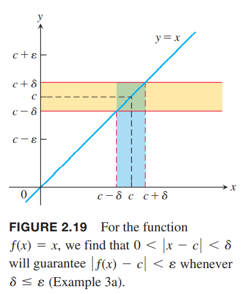  
（b）令$\varepsilon>0$，我们需要找到$\delta>0$有
$$|k-k|<\varepsilon \text{ whenever } 0<|x-c|<\delta$$
由于$k-k=0$，任意的整数$\delta$都满足。如下图所示：  
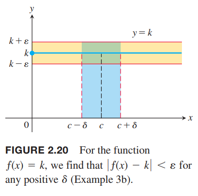

### 给定$\varepsilon$代码法计算$\delta$
上面两个例子中，$\varepsilon$总是以$L$为中心对称，$\delta$总是以$c$为中心对称。如果不对称的话，我们取$\delta$为距离$c$更近的端点。

例4 对于极限$\lim_{x\to 5}\sqrt{x-1}=2$，计算$\delta>0$使得$\varepsilon=1$，即找到一个$\delta>0$，使得
$$|\sqrt{x-1}-2|<1 \text{ whenever } 0<|x-5|<\delta$$
解：解不等式$|\sqrt{x-1}-2|<1$，来寻找包含$x=5$的区间，使得除了$x\neq 5$之外的$x$都满足不等式。
$$|\sqrt{x-1}-2|<1$$
$$-1<\sqrt{x-1}-2<1$$
$$1<\sqrt{x-1}<3$$
$$1<x-1<9$$
$$2<x<10$$
找一个$\delta$满足$5-\delta<x<5+\delta$，5距离2比较近，所以取距离2的长度（如下图），即$\delta=3$或者更小的值  
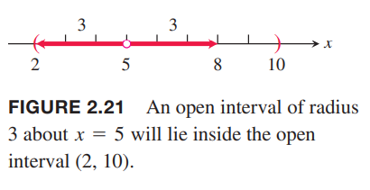
那么
$$|\sqrt{x-1}-2|<1 \text{ whenever } 0<|x-5|<3$$
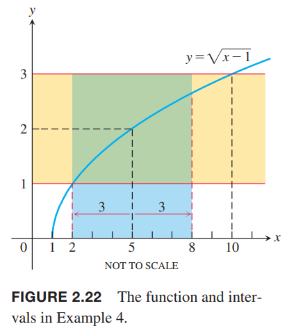

给定$f,L,c,\varepsilon>0$，如何计算$\delta$  
计算$\delta>0$使得
$$|f(x)-L|<\varepsilon \text{ whenever } 0<|x-c|<\delta$$
的过程分为以下两步：
1. 解不等式$|f(x)-L|<\varepsilon$找到一个开区间$(a,b)$，这个区间包含$c$，且所有$x\neq c$都能使不等式成立。不管$x=c$是否能使得不等式成立不影响。
2. 找一个$\delta>0$的开区间$(c-\delta,c+\delta)$，以$c$为中心，且在开区间$(a, b)$之内。那么在这个$\delta$区间内所有$x\neq c$都满足$|f(x)-L|<\varepsilon$。

例5 证明当
$$f(x)=\begin{cases}
x^2,&&x\neq 2\\
1,&&x=2
\end{cases}$$
时，$\lim_{x\to 2}f(x)=4$。  
解：我们的任务是对于任意给定的$\varepsilon>0$都存在$\delta$使得
$$|f(x)-4|<\varepsilon \text{ whenever } 0<|x-2|<\delta$$
首先解不等式$|f(x)-4|<\varepsilon,x\neq 2$，已知$f(x)=x^2,x\neq c=2$，那么就是要求解$|x^2-4|<\varepsilon$：
$$|x^2-4|<\varepsilon$$
$$-\varepsilon<x^2-4<\varepsilon$$
$$4-\varepsilon+<x^2<4+\varepsilon$$
$$\sqrt{4-\varepsilon}+<|x|<\sqrt{4+\varepsilon}$$
$$\sqrt{4-\varepsilon}+<x<\sqrt{4+\varepsilon}$$
上面求解过程假设$\varepsilon<4$。
对于所有在区间$(\sqrt{4-\varepsilon},\sqrt{4+\varepsilon})$的$x\neq 2$，都满足不等式$|f(x)-4|<\varepsilon$，如下图所示：  
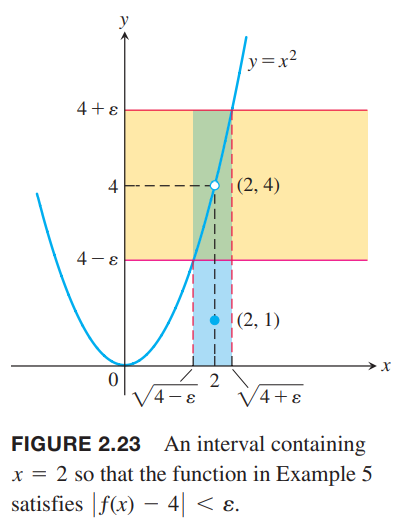  
找一个$\delta>0$使得以2为中心的开区间$(2-\delta,2+\delta)$在$(\sqrt{4-\varepsilon},\sqrt{4+\varepsilon})$区间内。  
寻找一个距离较短的端点，即$\delta=\min\{2-\sqrt{4-\varepsilon}, \sqrt{4+\varepsilon}+2\}$。  
如果$\varepsilon\geq 4$呢？那么区间是$(0, \sqrt{4+\varepsilon})$，那么$\delta=\min\{2,\sqrt{4+\varepsilon}-2\}=2$。

### 使用定义证明定理
我们通常不利用定义来求极限，更多的是使用定义来证明定理。

例6 给定$\lim_{x\to c}f(x)=L, \lim_{x\to c}g(x)=M$，求证
$$\lim_{x\to c}(f(x)+g(x))=L+M$$
证明：令$\varepsilon>0$，我们需要找到一个正数$\delta$，有
$$|f(x)+g(x)-(L+M)|<\varepsilon, \text{ whenever } 0<|x-c|<\delta$$
那么
$$\begin{aligned}
|f(x)+g(x)-(L+M)|&=|(f(x)-L)+(g(x)-M)|\\
&\leq |f(x)-L|+|g(x)-M|
\end{aligned}$$
由于$\lim_{x\to c}f(x)=L$，那么存在$\delta_1 >0$有
$$|f(x)-L|<\varepsilon/2, \text{ whenever } 0<|x-c|<\delta_1$$
类似的，由于$\lim_{x\to c}g(x)=M$，那么存在$\delta_2 >0$有
$$|g(x)-M|<\varepsilon/2, , \text{ whenever } 0<|x-c|<\delta_2$$
令$\delta=\min\{\delta_1,\delta_2\}$。如果$0<|x-c|<\delta$那么$|x-c|<\delta_1$，所以$|f(x)-L|<\varepsilon/2$，同理有$|g(x)-M|<\varepsilon/2$。因此
$$|f(x)+g(x)-(L+M)|<\frac{\varepsilon}{2}+\frac{\varepsilon}{2}=\varepsilon$$
这就证明了$\lim_{x\to c}(f(x)+g(x))=L+M$。

证明了加法规则，减法规则只需要将$g(x)$替换成$-g(x)$即可。常数倍的规则是$g(x)=k$的特例，下面证明乘法规则。

例7 证明乘法规则。  
证明：我们需要存在$\delta>0$，对于任何$\varepsilon>0$和任意属于$f,g$的定义域交集的$x$都有
$$|f(x)g(x)-LM|<\varepsilon, \text{ whenever } 0<|x-c|<\delta$$
重写
$$f(x)=L+(f(x)-L), g(x)=M+(g(x)-M)$$
那么
$$\begin{aligned}
f(x)g(x)-LM&=(L+(f(x)-L))(M+(g(x)-M))-LM\\
&=LM+L(g(x)-M)+M(f(x)-L)+(f(x)-L)(g(x)-M)-LM\\
&=L(g(x)-M)+M(f(x)-L)+(f(x)-L)(g(x)-M)
\end{aligned}$$
$x\to c$时，$f,g$的极限分别是$L,M$，所以存在$\delta_1,\delta_2,\delta_3,\delta_4$分别满足
$$\begin{aligned}
&|f(x)-L|<\sqrt{\varepsilon/3}&&\text{ whenever }&&0<|x-c|<\delta_1\\
&|g(x)-M|<\sqrt{\varepsilon/3}&&\text{ whenever }&&0<|x-c|<\delta_2\\
&|f(x)-L|<\varepsilon/(3(1+|M|))&&\text{ whenever }&&0<|x-c|<\delta_3\\
&|g(x)-M|<\varepsilon/(3(1+|L|))&&\text{ whenever }&&0<|x-c|<\delta_4
\end{aligned}$$
取四个最小值作为我们要求的$\delta$，那么有
$$\begin{aligned}
|f(x)g(x)-LM|&\leq |L||(g(x)-M)|+|M||(f(x)-L)|+|(f(x)-L)||(g(x)-M)|\\
&\leq (1+|L|)|(g(x)-M)|+(1+|M|)|(f(x)-L)|+|(f(x)-L)||(g(x)-M)|\\
&\leq \frac{\varepsilon}{3}+\frac{\varepsilon}{3}+\sqrt{\frac{\varepsilon}{3}}\sqrt{\frac{\varepsilon}{3}}=\varepsilon
\end{aligned}$$

例8 证明除法规则。  
证明：如果能证明$\lim_{x\to c}\frac{1}{g(x)}=\frac{1}{M}$，那么使用乘法规则就能完成证明。  
给定$\varepsilon>0$，需要证明存在$\delta>0$
$$\bigg|\frac{1}{g(x)}-\frac{1}{M}\bigg|<\varepsilon, \text{ whenever } 0<|x-c|<\delta$$
由于$x\to c$时$\lim_{x\to c}g(x)=M$，那么存在一个正数$\delta_1$满足
$$|g(x)-M|<\frac{M}{2}, \text{ whenever } 0<|x-c|<\delta_1$$
由三角不等式$|A|-|B|\leq |A-B|,|B|-|A|\leq |A-B|$可以得到$||A|-|B||\leq |A-B|$，那么
$$||g(x)|-|M||< |g(x)-M|$$
那么
$$||g(x)|-|M||< \frac{|M|}{2}$$
$$-\frac{|M|}{2}< |g(x)|-|M|<\frac{|M|}{2}$$
$$\frac{|M|}{2}< |g(x)|<\frac{3|M|}{2}$$
$$|M|< 2|g(x)|< 3|M|$$
$$\frac{1}{|g(x)|}<\frac{2}{|M|}<\frac{3}{|g(x)|}$$
当$0<|x-c|<\delta_1$时，
$$\begin{aligned}
\bigg|\frac{1}{g(x)}-\frac{1}{M}\bigg|&=\bigg|\frac{M-g(x)}{Mg(x)}\bigg|\\
&\leq \frac{1}{|M|}\frac{1}{|g(x)|}\cdot |M-g(x)|\\
&<\frac{1}{|M|}\frac{2}{|M|}\cdot |M-g(x)|
\end{aligned}$$
所以问题转化为$\frac{1}{|M|}\frac{2}{|M|}\cdot |M-g(x)|<\varepsilon\Rightarrow |M-g(x)|<\varepsilon|M|^2/2$
根据极限定义，存在$0<|x-c|<\delta_2$有
$$|g(x)-M|<\varepsilon|M|^2/2, \text{ whenever } 0<|x-c|<\delta_2$$
取$\delta=\min\{\delta_1,\delta_2\}$，有
$$\bigg|\frac{1}{g(x)}-\frac{1}{M}\bigg|<\varepsilon, \text{ whenever } 0<|x-c|<\delta$$
