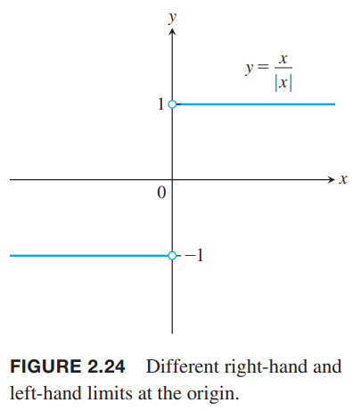
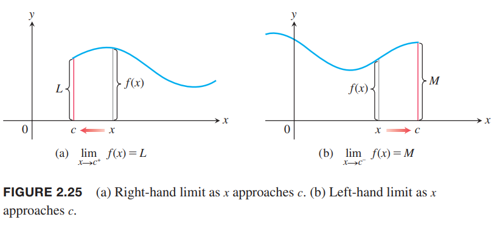
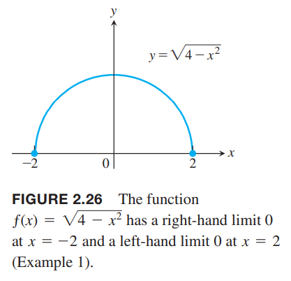
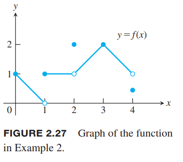
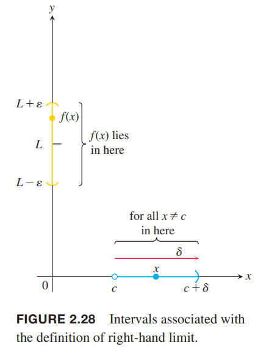
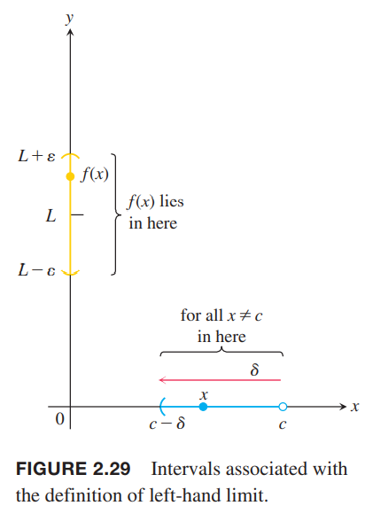
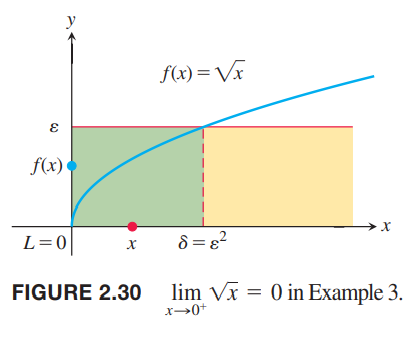
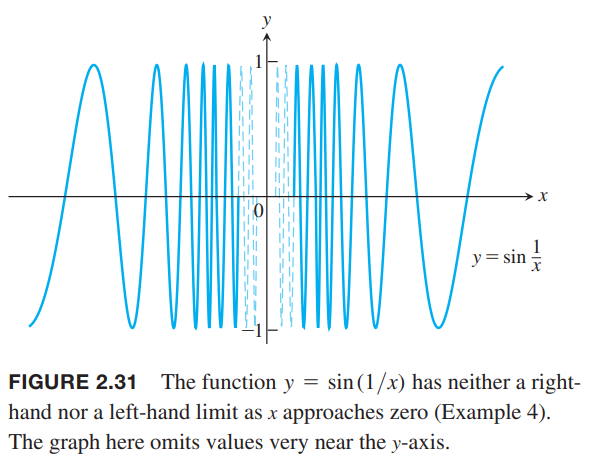
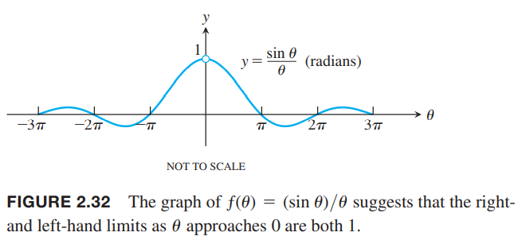
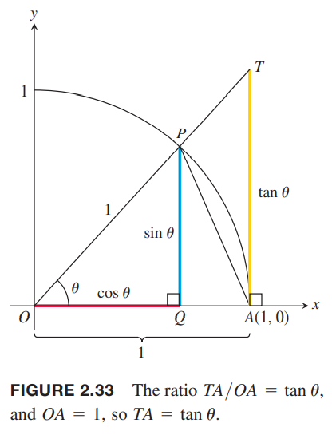

这一节会介绍单侧极限，$x$从左边靠近$c$或者是$x$从右边靠近$c$。这使得我们可以在同一个点有不同的极限，还使得在函数定义域的端点处有极限。

### 单侧极限
假设函数$f$在包含点$c$两边的区间上有定义。当$x\to c$，极限是$L$，那么从任意一边趋于$c$，极限都是$L$，因此，我们说极限是双边的（`two-sided`）。  
如果函数$f$在$c$处没有双边极限，还是有可能有单侧极限的，也就是说，从某一边靠近该点存在极限。如果是从右边趋于$c$，那么是右极限（`right-hand limit`, `limit from the right`），反之是左极限（`left-hand limit`, `limit from the left`）。  
函数$f=x/|x|$（如下图所示）的右极限是1，左极限是-1。由于两个单侧极限值不同，那么在$x\to 0$时不是一个极限值，所以不存在极限（双边）。  
  
直观地，我们只考虑区间$(c, b), c<b$的函数值$f(x)$，随着$x$接近$c$，$f(x)$无限接近$L$，那么$f$在$c$的右极限是$L$，写作
$$\lim_{x\to c^+}f(x)=L$$
$x\to c^+$表示我们只考虑大于$c$的$x$。  
类似的，左极限可以记作
$$\lim_{x\to c^-}f(x)=M$$
非正式的单侧极限定义如下图所示。  
  
图2.24对应的函数$f(x)=x/|x|$左右极限是
$$\lim_{x\to 0^+}f(x)=1,\lim_{x\to 0^-}f(x)=-1$$

我们现在给出函数在定义域边界点处的极限。这个定义和区域和空间的边界点的定义是一致的，这些第13章会讨论。当$f$定义域是在$c$的左边，比如$(a,c)$或$(a,c]$，如果在$c$处有左极限，那么我们说在$c$处有极限。类似的，定义域在$c$右边，比如$(c,b)$或$[c,b)$，如果在$c$处有右极限，那么我们说在$c$处有极限。

例1 $f(x)=\sqrt{4-x^2}$的定义域是$[-2,2]，图像是如下图所示的半圆。那么
$$\lim_{x\to -2^+}f(x)=0, \lim_{x\to 2^-}f(x)=0$$
函数在$(-2,2)$上有双边极限。$x=2$处有左极限没有右极限，$x=-2$处有右极限没有左极限。在$-2,2$两个端点没有双边极限，因为$f$在点两旁没有定义。但是这些端点处有单侧极限，所以$f$在$x=-2,x=2$有极限
$$\lim_{x\to -2}f(x)=0, \lim_{x\to 2}f(x)=0$$

2.2节的定理1对单侧极限也成立。两个函数的右极限的和是两个函数和的右极限，等等。夹逼定理也是成立的。单侧极限和极限有如下内在关系。

**定理6** 假设$f$在包含$c$的开区间有定义，$c$本身可以除外，那么$f(x)$在$c$处有极限等价于存在左极限和右极限且二者相等。
$$\lim_{x\to c} f(x)=L \Leftrightarrow \lim_{x\to c^-}f(x)=L \text{ and } \lim_{x\to c^+}f(x)=L$$
在端点处，只要单侧极限存在那么极限就存在。

例2 如下图函数：  
  
$x=0$处，$\lim_{x\to 0^-}f(x)$不存在，$\lim_{x\to 0^+}f(x)=\lim_{x\to 0}f(x)=1$；  
$x=1$处，$\lim_{x\to 1^-}f(x)=0, \lim_{x\to 1^+}f(x)=1$，$\lim_{x\to 0}f(x)$不存在；  
$x=2$处，$\lim_{x\to 2^-}f(x)=\lim_{x\to 2^+}f(x)=\lim_{x\to 2}f(x)=1$；  
$x=3$，$\lim_{x\to 3^-}f(x)=\lim_{x\to 3^+}f(x)=\lim_{x\to 3}f(x)=f(3)=2$；  
$x=4$，$\lim_{x\to 4^-}f(x)=1$，$\lim_{x\to 4^+}f(x)$不存在，$\lim_{x\to 4}f(x)=1$。  
在$[0,4]$的其余各点，$f(x)$的极限时$f(c)$。

### 单侧极限的精确定义
**定义** 假设$f$在$c$右侧区间$(c,d)$上有定义。如果对于任意$\varepsilon>0$，存在相应的$\delta>0$有
$$|f(x)-L|<\varepsilon \text{ whenever } c<x<x+\delta$$
那么$f(x)$在$c$点右极限时$L$，写作
$$\lim_{x\to c^+}f(x)=L$$
假设$f$在$c$左侧区间$(b,c)$上有定义。如果对于任意$\varepsilon>0$，存在相应的$\delta>0$有
$$|f(x)-L|<\varepsilon \text{ whenever } c-\delta<x<x$$

如下图所示：  
  

例3 证明
$$\lim_{x\to 0^+}=0$$
证明：令$\varepsilon>0$。这里$c=0,L=0$，我们需要找到$\delta>0$满足
$$|\sqrt{x}-0|<\varepsilon, \text{ whenever } 0<x<\delta$$
那么
$$\sqrt{x}<\varepsilon, \text{ whenever } 0<x<\delta$$
两边同时平方得到
$$x<\varepsilon^2, \text{ if } 0<x<\delta$$
我们取$\delta=\varepsilon^2$完成证明。示意图如下：  

例4 证明$y=\sin(1/x)$在$x$从任意一边趋于0时极限都不存在。如下图所示：  
  
解：随着$x$趋于0，$1/x$趋于无穷，$\sin(1/x)$重复的从-1到1循环，那么函数值不会稳定低接近某个值$L$。上述分析对$x$是接近0的正值和负值都成立，即这个函数既没有左极限也没有右极限。

### $(\sin\theta)/\theta$的极限
用弧度表示的话，当$\theta\to 0$时，$(\sin\theta)/\theta$的极限是1。如下图所示。我们会应用夹逼定理来证明。3.5节会说明这个极限非常有用。  

**定理7** 当$\theta\to 0$时，$(\sin\theta)/\theta$的极限是
$$\lim_{\theta\to 0}\frac{\sin\theta}{\theta}=1\tag{1}$$

证明：应用夹逼定理证明左右极限都是1，那么极限就是1。  
我们从$\theta<\frac{\pi}{2}$开始来证明右极限是1。如下图所示  
  
注意三个区域的面积有如下关系
$$S_{\triangle OAP}<S_{\text{sector } OAP}<S_{\triangle OAT}$$
使用$\theta$表示它们的面积
$$S_{\triangle OAP}=\frac{1}{2}(1)\sin\theta=\frac{\sin\theta}{2}$$
$$S_{\text{sector } OAP}=\frac{1}{2}r^2\theta=\frac{\theta}{2}$$
$$S_{\triangle OAT}=\frac{1}{2}(1)\tan\theta=\frac{\tan\theta}{2}$$
所以
$$\frac{\sin\theta}{2}<\frac{\theta}{2}<\frac{\tan\theta}{2}$$
由于$0<\theta<\pi/2$，那么$\sin\theta/2$是正数，两边同除得到
$$1<\frac{\theta}{\sin\theta}<\frac{1}{\cos\theta}$$
取倒数得到
$$1>\frac{\sin\theta}{\theta}>\cos\theta$$
2.2节得到$\lim_{\theta\to 0^+}\cos\theta=1$，由夹逼定理得到
$$\lim_{\theta\to 0^+}\frac{\sin\theta}{\theta}=1$$
现在考虑左极限。由于$\sin\theta,\theta$都是奇函数，那么$f(\theta)=\sin\theta/\theta$是偶函数，关于$y$轴对称。所以
$$\lim_{\theta\to 0^-}\frac{\sin\theta}{\theta}=1$$
证毕。

例5 证明  
（a）$\lim_{y\to 0}\frac{\cos y-1}{y}=0$  
（b）$\lim_{x\to 0}\frac{\sin 2x}{5x}=\frac{2}{5}$  
证明：  
（a）使用半角公式$\cos y=1-2\sin^2(y/2)$，那么
$$\begin{aligned}
\lim_{y\to 0}\frac{\cos y-1}{y}&=\lim_{y\to 0}-\frac{2\sin^2(y/2)}{y}\\
&=-\lim_{\theta\to 0}\frac{\sin\theta}{\theta}\sin\theta\\
&=-(1)(0)
\end{aligned}$$
（b）分子分母同乘$2/5$，那么
$$\begin{aligned}
\lim_{x\to 0}\frac{\sin 2x}{5x}&=\lim_{x\to 0}\frac{2/5\sin 2x}{(2/5)5x}\\
&=\frac{2}{5}\lim_{x\to 0}\frac{\sin 2x}{2x}\\
&=\frac{2}{5}(1)=\frac{2}{5}
\end{aligned}$$

例6 求$\lim_{t\to 0}\frac{\tan t\sec 2t}{3t}$  
解：
$$\begin{aligned}
\lim_{t\to 0}\frac{\tan t\sec 2t}{3t}&=\lim_{t\to 0}\frac{1}{3}\frac{1}{t}\frac{\sin t}{\cos t}\frac{1}{\cos 2t}\\
&=\frac{1}{3}\lim_{t\to 0}\frac{\sin t}{t}\frac{1}{\cos t}\frac{1}{\cos 2t}\\
&=\frac{1}{3}(1)(1)(1)\\
&=\frac{1}{3}
\end{aligned}$$

例7 证明对于非零常量$A,B$有
$$\lim_{\theta\to 0}\frac{\sin A\theta}{\sin B\theta}=\frac{A}{B}$$
证明：
$$\begin{aligned}
\lim_{\theta\to 0}\frac{\sin A\theta}{\sin B\theta}&=\lim_{\theta\to 0}\frac{\sin A\theta}{A\theta}A\theta\frac{B\theta}{\sin B\theta}\frac{1}{B\theta}\\
&=\lim_{\theta\to 0}\frac{\sin A\theta}{A\theta}\frac{B\theta}{\sin B\theta}\frac{A}{B}\\
&=(1)(1)\frac{A}{B}\\
&=\frac{A}{B}
\end{aligned}$$

### 证明夹逼定理
首先证明左极限。由于$\lim_{x\to c^+}g(x)=\lim_{x\to c^+}h(x)=L$，那么对于任意$\varepsilon>0$都存在$\delta>0$在区间$(c,c+\delta)$上有
$$L-\varepsilon<g(x)<L+\varepsilon,L-\varepsilon<h(x)<L+\varepsilon$$
由于总是有$g(x)\leq f(x)\leq h(x)$，所以
$$L-\varepsilon<g(x)\leq f(x)\leq h(x)<L+\varepsilon$$
$$L-\varepsilon<f(x)<L+\varepsilon$$
$$-\varepsilon<f(x)-L<\varepsilon$$
因此当$c<x<c+\delta$时，有$|f(x)-L|<\varepsilon$。  
接着证明右极限。和上面类似，唯一的不同是这里$x\in (c-\delta,c)$。  
如果$\lim_{x\to c}g(x)=\lim_{x\to c}h(x)=L$，当$x\to c^-$和$x\to c^+$时，$g(x), h(x)$的极限均为$L$，根据上面的论证有$\lim_{x\to c^-}f(x)=\lim_{x\to c^+}f(x)=L$，那么$\lim_{x\to c}=L$。
