### $x\to\pm\infty$时的极限
无穷符号$\infty$不表示任何一个实数。比如函数$f(x)=1/x,x\neq 0$的定义如下图。当$x$增大时，$1/x$减小。当$x$是负数且数值增加时类似。也就是说当$x\to\infty$或$x\to 0\infty$时，$f(x)=1/x$的极限是0。或者说0是$f(x)=1/x$在无穷处和负无穷处的极限。  
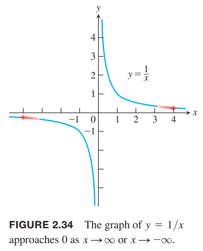

**定义**  
如果对于所有$\varepsilon>0$，都有对应的$M$使得对于$f$定义域所有的$x$都有
$$|f(x)-L|<\varepsilon, \text{ whenever } x>M$$
那么我们说$x$趋于无穷时，$f(x)$的极限是$L$，写作
$$\lim_{x\to\infty}f(x)=L$$
如果对于所有$\varepsilon>0$，都有对应的$N$使得对于$f$定义域所有的$x$都有
$$|f(x)-L|<\varepsilon, \text{ whenever } x<N$$
那么我们说$x$趋于负无穷时，$f(x)$的极限是$L$，写作
$$\lim_{x\to -\infty}f(x)=L$$

直观地，如果$\lim_{x\to\infty}f(x)=L$，那么当$x$移动的离原点越来越远，$f(x)$无限接近$L$。类似地，$\lim_{x\to-\infty}f(x)=L$，那么当$x$沿着负半轴移动的越来越远，$f(x)$无限接近$L$。  
计算$x\to\infty$或$x\to-\infty$的极限的策略和2.2节类似，那一节中我们先找到$y=x,y=k$的极限，然后应用定理1进行拓展。这里我们也要先找到$y=1/x,y=k$的极限。  
$$\lim_{x\to\pm\infty}k=k,\lim_{x\to\pm\infty}\frac{1}{x}=0\tag{1}$$
例1 给了第二个式子的证明，下面证明第一个式子 $x\to\infty$ 的情况，$x\to -\infty$ 类似。
根据定义，对任意 $\varepsilon>0$，任意 $M$ 都有
$$|f(x)-L|=|k-k|=0<\varepsilon$$
因此 $x\to\infty$ 时，$f(x)=k$ 的极限是 $k$。

例1 证明  
（a）$\lim_{x\to\infty}\frac{1}{x}=0$  
（b）$\lim_{x\to-\infty}\frac{1}{x}=0$  
证明：  
（a）令$\varepsilon>0$，我们必须找到一个$M$使得
$$|\frac{1}{x}-0|=|\frac{1}{x}|<\varepsilon, \text{ whenever } x>M$$
那么$M=1/\varepsilon$或者任意更大的正数。如下图所示：  
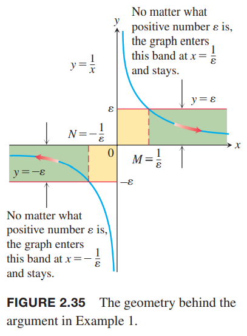  
（b）令$\varepsilon>0$，我们必须找到一个$N$使得
$$\bigg|\frac{1}{x}-0\bigg|=\bigg|\frac{1}{x}\bigg|<\varepsilon, \text{ whenever } x<N$$
那么$N=-1/\varepsilon$或者任意小于$1-\varepsilon$的负数。

**定理8** 定理1的所有法则对 $x\to\infty,x\to-\infty$ 时同样适用。

例2 计算下面两个极限值。  
（a）
$$\begin{aligned}
\lim_{x\to\infty}(5+\frac{1}{x})&=\lim_{x\to\infty}5+\lim_{x\to\infty}\frac{1}{x}
\\&=5+0=5
\end{aligned}$$
（b）
$$\begin{aligned}
\lim_{x\to -\infty}\frac{\pi\sqrt{3}}{x^2}&=\lim_{x\to -\infty}\pi\sqrt{3}\frac{1}{x}\frac{1}{x}\\
&=\lim_{x\to -\infty}\pi\sqrt{3}\cdot\lim_{x\to -\infty}\frac{1}{x}\cdot\lim_{x\to -\infty}\frac{1}{x}\\
&=\pi\sqrt{3}\cdot 0\cdot 0\\
&=0
\end{aligned}$$

### 实数函数在无穷处的极限
为了计算$x\to\pm\infty$时实数函数的极限，首先分子分母除以分母的最高次幂。结果就取决于多项式的幂次。

例3 按照上述方法计算下面两个函数的极限。  
（a）如下图所示
$$\begin{aligned}
\lim_{x\to\infty}\frac{5x^2+8x-3}{3x^2+2}&=\lim_{x\to\infty}\frac{5+(8/x)-(3/x^2)}{3+(2/x^2)}\\
&=\frac{5+0-0}{3+0}\\
&=\frac{5}{3}
\end{aligned}$$
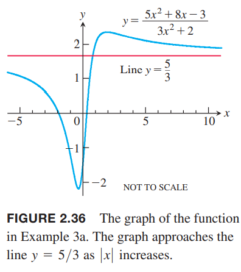  
（b）
$$\begin{aligned}
\lim_{x\to -\infty}\frac{11x+2}{2x^3-1}&=\lim_{x\to -\infty}\frac{(11/x^2)+(2/x^3)}{2-(1/x^3)}\\
&=\frac{0+0}{2-0}=0
\end{aligned}$$
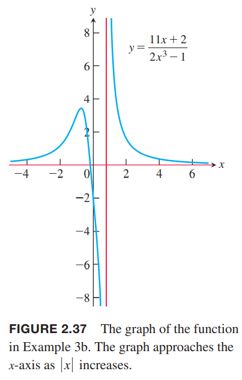

### 渐近线
图像上一个点随着距离原点越来越远，它距离某固定线的距离接近于零，我们称这个图像渐近接近这条线，这条直线是图像的渐近线（`asymptote`）。  
$x$轴是$f(x)=1/x$图像的渐近线因为
$$\lim_{x\to\infty}\frac{1}{x}=0$$
且
$$\lim_{x\to -\infty}\frac{1}{x}=0$$
我们称$x$轴是水平渐近线（`horizontal asymptote`）。

**定义** 如果
$$\lim_{x\to\infty}f(x)=b$$
或
$$\lim_{x\to -\infty}f(x)=b$$
那么$y=b$是$f(x)$的水平渐近线。

函数图像可能有零、一、二个水平线，这取决于随着$x\to\infty$或$x\to -\infty$时函数的极限。  
图 2.36 的函数
$$f(x)=\frac{5x^2+8x-3}{3x^2+2}$$
的渐近线是$y=5/3$因为
$$\lim_{x\to\infty}f(x)=\frac{5}{3},\lim_{x\to -\infty}f(x)=\frac{5}{3}$$

例4 求下面函数图像的水平渐近线
$$f(x)=\frac{x^3-2}{|x|^3+1}$$
解：求$x\to\pm\infty$时函数极限  
$x\geq 0$时
$$\lim_{x\to\infty}\frac{x^3-2}{|x|^3+1}=\lim_{x\to\infty}\frac{x^3-2}{x^3+1}=\lim_{x\to\infty}\frac{1-2/(x^3)}{1+1/(x^3)}=1$$
$x<0$时
$$\lim_{x\to\infty}\frac{x^3-2}{|x|^3+1}=\lim_{x\to\infty}\frac{x^3-2}{(-x)^3+1}=\lim_{x\to\infty}\frac{1-2/(x^3)}{-1+1/(x^3)}=-1$$
那么水平渐近线是$y=1,y=-1$，如下图所示：  

例5 $x$轴是函数$y=e^x$的水平渐近线因为
$$\lim_{x\to -\infty}e^x=0$$
下面进行证明。令$\varepsilon>0$，我们必须找到一个常量$N$使得
$$|e^x-0|<\varepsilon, \text{ whenever } x<N$$
由于$|e^x-0|=e^x$，那么当$x<N$时，需满足条件
$$e^x<\varepsilon$$
由于$e^x$是递增函数，那么$e^N=\varepsilon,N=\ln \varepsilon$或者更小能满足上述条件。如下图所示  
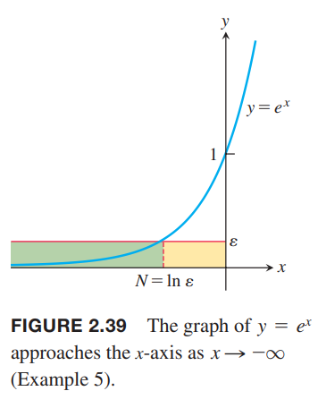

例6 求  
（a）$\lim_{x\to\infty}\sin(1/x)$  
（b）$\lim_{x\to\pm\infty}x\sin(1/x)$  
解：  
（a）令$t=1/x$，那么$x\to\infty$等价于$t\to 0^+$。因此
$$\lim_{x\to\infty}\sin(1/x)=\lim_{t\to 0^+}\sin t=0$$
（b）现在计算$x\to\infty,x\to -\infty$
$$\lim_{x\to\infty}x\sin(1/x)=\lim_{t\to 0^+}\frac{\sin t}{t}=1$$
$$\lim_{x\to -\infty}x\sin(1/x)=\lim_{t\to 0^-}\frac{\sin t}{t}=1$$
如下图所示  
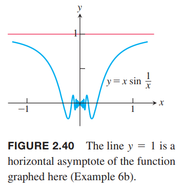  
类似的，通过研究$y=f(t),t\to\pm\infty$，可以知道函数$y=f(1/x),x\to 0$的行为。

例7 求
$$\lim_{x\to 0^-}e^{1/x}$$
解：令$t=1/x$，那么$x\to 0^-$等价于$t\to -\infty$，因此
$$\lim_{x\to 0^-}e^{1/x}=\lim_{t\to -\infty}e^t=0$$
如下图所示：  
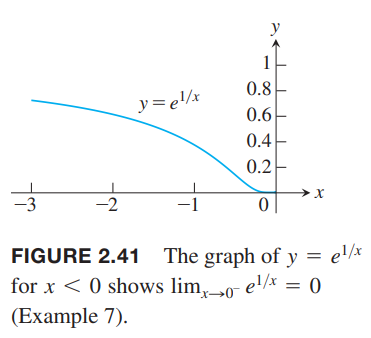

夹逼定理对$x\to\pm\infty$也成立。  
例8 使用夹逼定理求下面函数的水平渐近线
$$y=2+\frac{\sin x}{x}$$
解：因为
$$0\leq \bigg|\frac{\sin x}{x}\bigg|\leq\bigg|\frac{1}{x}\bigg|$$
因为
$$\lim_{x\to\pm\infty}|\frac{1}{x}|=0$$
所以根据夹逼定理
$$\lim_{x\to\pm\infty}\frac{\sin x}{x}=0$$
因此
$$\lim_{x\to\pm\infty}(2+\frac{\sin x}{x})=2+0=2$$
那么$y=2$是水平渐近线。如下图所示：  
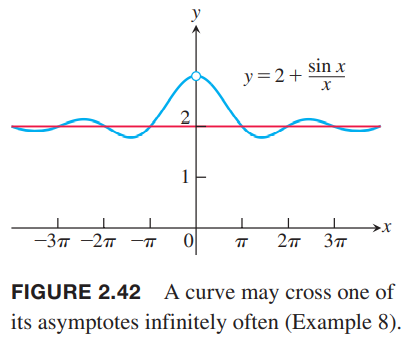  
这个例子也说明一条曲线可以和它的水平渐近线相交许多次（无限次）。

例9 求
$$\lim_{x\to\infty}(x-\sqrt{x^2+16})$$
解：$x\to\infty$时，$x$和$\sqrt{x^2+16}$都趋于无穷大，那么极限是无法确定的，因为$\infty$是个记号而不是实数，不能做减法。这种情况，分子分母同乘其共轭表达式
$$\begin{aligned}
\lim_{x\to\infty}(x-\sqrt{x^2+16})&=\lim_{x\to\infty}(x-\sqrt{x^2+16})\frac{x+\sqrt{x^2+16}}{x+\sqrt{x^2+16}}\\
&=\lim_{x\to\infty}\frac{x^2-(x^2+16)}{x+\sqrt{x^2+16}}\\
&=\lim_{x\to\infty}\frac{-16}{x+\sqrt{x^2+16}}
\end{aligned}$$
那么当$x\to\infty$时，分母趋于无穷大，所以极限值是0。

### 斜渐近线
如果一个实数函数的分子的度恰好比分母的度大1，那么图像有斜渐近线（`oblique or slant line asymptote`）。计算斜渐近线的方式是用分子除以分母，得到一个线性函数加上一个当$x\to\pm\infty$时极限是0的余数。

例10 求下面函数的斜渐近线
$$f(x)=\frac{x^2-3}{2x-4}$$
图像如下图所示  
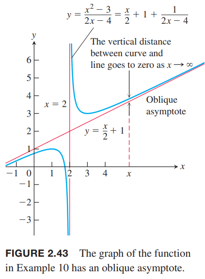  
解：通过除法我们可以得到
$$f(x)=\frac{x}{2}+1+\frac{1}{2x-4}$$
余数$\frac{1}{2x-4}$表示函数$f(x)$和直线$\frac{x}{2}+1$的垂直距离。当$x\to\pm\infty$时，余数的极限是0。所以
$$g(x)=\frac{x}{2}+1$$
是渐近线。向左和向右的渐近线都是这一条直线。

### 无穷极限
回顾函数$f(x)1/x$。当$x\to 0^+$时，$f$的值无限增长。给定任意实数$B$，$f$总有值能够比$B$还大。如下图所示：  
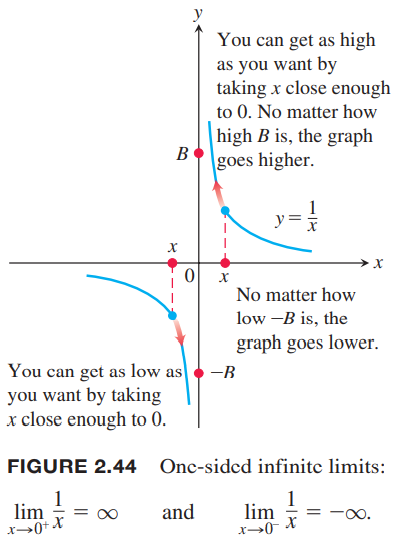  
因此$f$在$x\to 0^+$时没有极限。然而，为了描述函数$f$在$x\to 0^+$时的行为，我们称$f(x)$趋于无穷$\infty$。记作
$$\lim_{x\to 0^+}f(x)=\lim_{x\to 0^+}\frac{1}{x}=\infty$$
这么写的目的不是说极限是存在的，也不是说$\infty$是某个实数。这个式子只是在描述函数的行为：当$x\to 0^+$，$\lim_{x\to 0^+}\frac{1}{x}$的极限不存在且函数值任意大。  
$x\to 0^-$时类似，不再赘述。

例11 求
$$\lim_{x\to 1^+}\frac{1}{x-1},\lim_{x\to 1^-}\frac{1}{x-1}$$
解：从几何角度分析，函数$\frac{1}{x-1}$是函数$\frac{1}{x}$向有平移一个单位，那么它在1附近的行为和$\frac{1}{x}$在0附近的行为一致，那么
$$\lim_{x\to 1^+}\frac{1}{x-1}=\infty,\lim_{x\to 1^-}\frac{1}{x-1}=\infty$$
如下图所示：  
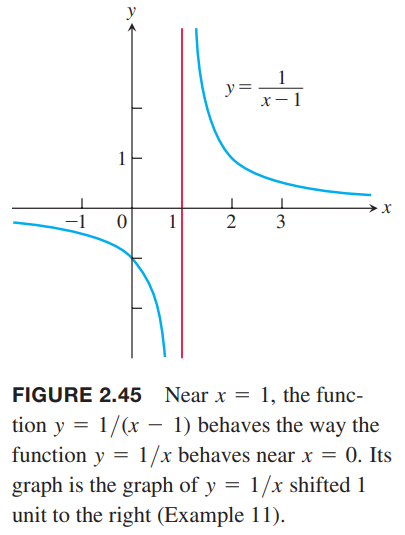  
用分析的方法着手，当$x\to 1^+$时，$(x-1)\to 0^+$，那么$1/(x-1)\to\infty$。$x\to 1^-$时类似。

例12 讨论下面函数在$x\to 0$时的行为
$$f(x)=\frac{1}{x^2}$$
解：当$x$从左右两边趋于零时，$1/x^2$的值是正的，且任意大，这意味着
$$\lim_{x\to 0}f(x)=\lim_{x\to 0}\frac{1}{x^2}=\infty$$
如下图所示  
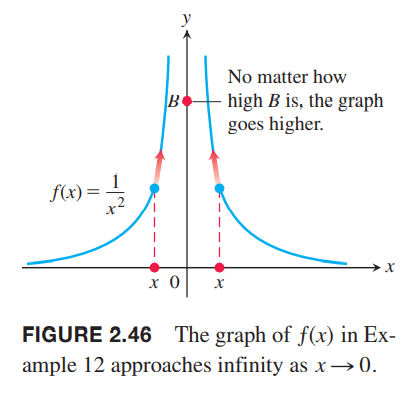  
函数$y=1/x$在$x\to 0$时行为不一致，当$x\to 0^+$时$1/x\to\infty$，但是当$x\to 0^-$时$1/x\to -\infty$，所以说$\lim_{x\to 0}(1/x)$不存在。函数$y=1/x^2$不一样，$x$从两边趋于零行为一致。

例13 下面的例子说明实数函数在分母为零的附近行为能够多变。  
（a）
$$\lim_{x\to 2}\frac{(x-2)^2}{x^2-4}=\lim_{x\to 2}\frac{x-2}{x+2}=0$$
（b）
$$\lim_{x\to 2}\frac{x-2}{x^2-4}=\lim_{x\to 2}\frac{1}{x+2}=\frac{1}{4}$$
（c）
$$\lim_{x\to 2^+}\frac{x-3}{x^2-4}=-\infty$$
（d）
$$\lim_{x\to 2^-}\frac{x-3}{x^2-4}=\infty$$
（e）下面函数的极限不存在
$$\lim_{x\to 2}\frac{x-3}{x^2-4}$$
（f）
$$\lim_{x\to 2}\frac{2-x}{(x-2)^3}=\lim_{x\to 2}\frac{-1}{(x-2)^2}=-\infty$$

例14 求
$$\lim_{x\to -\infty}\frac{2x^5-6x^4+1}{3x^2+x-7}$$
解：要求$x\to -\infty$时的极限，我们分子分母同时除以分母的最高次幂$x^2$
$$\lim_{x\to -\infty}\frac{2x^5-6x^4+1}{3x^2+x-7}=\lim_{x\to -\infty}\frac{2x^3-6x^2+x^{-2}}{3+x^{-1}-7x^{-2}}=-\infty$$
$x\to -\infty$时分子趋于$-\infty$而分母趋于3。

### 无穷极限的精确定义
**定义**  
（1）如果对于任意正数$B$都存在一个$\delta>0$使得
$$f(x)>B \text{ whenever } 0<|x-c|<\delta$$
那么我们说$x$接近$c$时，$f(x)$趋于正无穷，写作
$$\lim_{x\to c}f(x)=\infty$$
（2）如果对于任意负数$-B$都存在一个$\delta>0$使得
$$f(x)<-B \text{ whenever } 0<|x-c|<\delta$$
那么我们说$x$接近$c$时，$f(x)$趋于正无穷，写作
$$\lim_{x\to c}f(x)=-\infty$$

下面两个图解释了定义：  
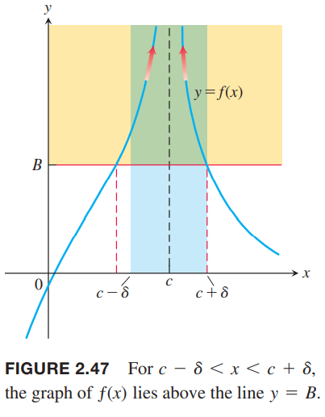  
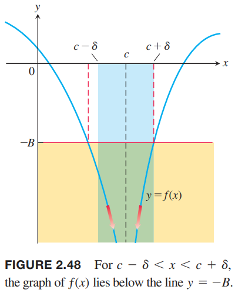

例15 求证$\lim_{x\to 0}\frac{1}{x^2}=\infty$。  
证明：给定任意$B>0$，需要找到$\delta>0$使得
$$\frac{1}{x^2}>B  \text{ whenever } 0<|x-0|<\delta$$
那么
$$\frac{1}{x^2}>B\Leftrightarrow x^2<\frac{1}{B}\Leftrightarrow |x|<\frac{1}{\sqrt{B}}$$
我们选择$\delta=1/\sqrt{B}$或者更小的正数，那么就有
$$|x|<\delta \Rightarrow \frac{1}{x^2}>\frac{1}{\delta^2}\geq B$$
因此，根据定义有
$$\lim_{x\to 0}\frac{1}{x^2}=\infty$$

### 垂直渐近线
对于函数$f(x)=1/x$的图像，当点沿着垂直方向远离原点时，该点距$y$轴趋于零。如下图所示：  
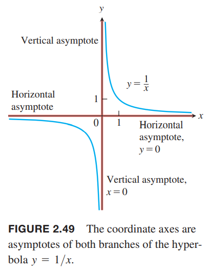  
在$x\to 0$时$f(x)=1/x$无限增长，因为
$$\lim_{x\to 0^+}\frac{1}{x}=\infty, \lim_{x\to 0^-}\frac{1}{x}=-\infty$$
我们说$x=0$，也就是$y$轴是函数$f(x)=1/x$的图像的垂直渐近线（`vertical asymptote`）。注意$x=0$时函数是无定义的。

**定义** 如果
$$\lim_{x\to a^+}f(x)=\pm\infty$$
或
$$\lim_{x\to a^-}f(x)=\pm\infty$$
其中，向一个方向无限增长即可，那么$x=a$是函数$y=f(x)$图像的垂直水平线。

例16 求曲线
$$y=\frac{x+3}{x+2}$$
的水平渐近线和垂直渐近线。  
解：改写函数
$$y=1+\frac{1}{x+2}$$
当$x\to\pm\infty$时，极限是1，所以$y=1$是水平渐近线。$x\to -2$时，值正向或负向无限增长，$x=-2$是垂直渐近线。  
从几何角度看，该曲线是$y=1/x$向上移动一个单位，向左移动两个单位，所以之前$x,y$轴是渐近线，现在是$y=1,x=-2$是渐近线。如下图所示：  
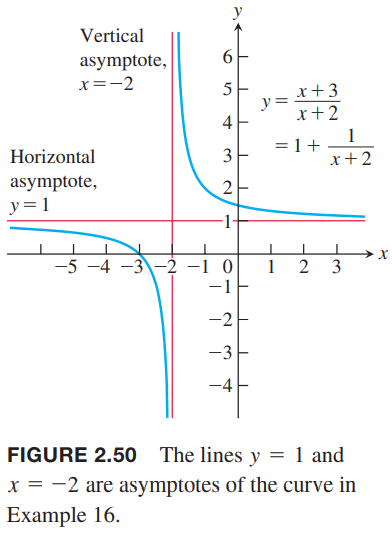

例17 求函数
$$f(x)=-\frac{8}{x^2-4}$$
图像的水平渐近线和垂直渐近线。  
解：这个函数是偶函数，所以图像关于$y$轴对称。  
（a）由于$\lim_{x\to\infty}f(x)=0$，所以$y=0$是图像右侧的渐近线。由于关于$y$轴对称，那么左侧的渐近线也是$y=0$。注意，曲线是负半区域（横坐标下方）趋近$x$轴，如图所示：  
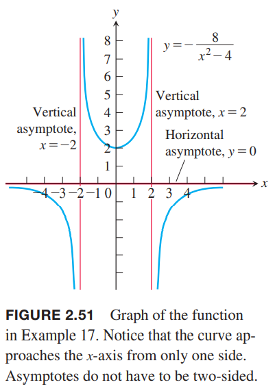  
（b）由于
$$\lim_{x\to 2^+}f(x)=-\infty,\lim_{x\to 2^-}f(x)=\infty$$
所以$x=2$是左右两侧接近的垂直渐近线。根据对称性，$x=-2$也是垂直渐近线。  
因为函数$f$在其他点都有有限极限，所以没有其他渐近线了。

例18 自然对数的图像的垂直渐近线是$y$轴。从下图我们可以看出来，沿$y=x$翻转的图象是指数函数$y=e^x$，其水平渐近线是$x$轴。
$$\lim_{x\to 0^+}\ln x=-\infty$$
这个结论对任意对数函数$y=\log_a x,a>1$都成立。  
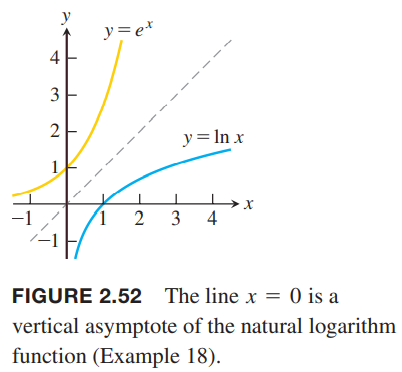

例19 曲线
$$y=\sec x=\frac{1}{\cos x},y=\tan x=\frac{\sin x}{\cos x}$$
都在$\pi/2$的奇数倍处有垂直渐近线，在这些点处有$\cos x=0$。  
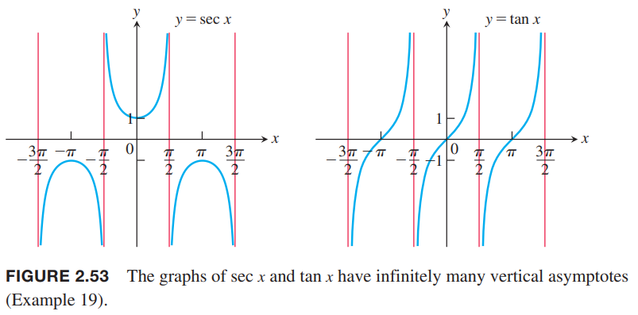

### 主项
在例10中，我们将下面的函数
$$f(x)=\frac{x^2-3}{2x-4}$$
写作一个线性函数加一个剩余项
$$f(x)=(\frac{x}{2}+1)+(\frac{1}{2x-4})$$
当$|x|$很大时，后面一项趋于0，那么
$$f(x)\approx \frac{x}{2}+1$$
在$x=2$附近时，后一项绝对值很大，那么
$$f(x)\approx \frac{1}{2x-4}$$
我们说$x\to\pm$时$(x/2)+1$占首要位置而$x\to 2$时$1/(2x-4)$占首要位置。主项（`dominant terms`）能够帮助我们预测函数的行为。

例20 令$f(x)=3x^4-2x^3+3x^2-5x+6,g(x)=3x^4$。证明尽管$f,g$在$x$不大时差异很大，但是当$|x|$很大时，两者基本一致，即$x\to\pm\infty$时比值趋于0。  
解：如下图所示，$x$很小时两者差异很大，但是$|x|$很大时两者就一样了。  
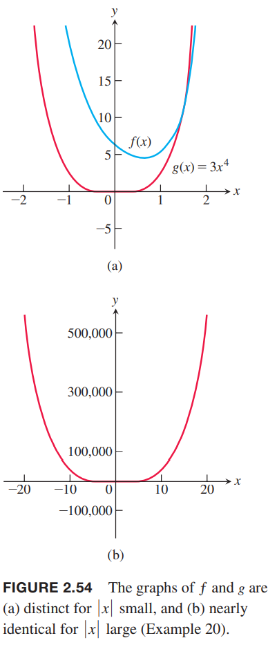  
$$\begin{aligned}
\lim_{x\to\pm\infty}\frac{f(x)}{g(x)}&=\lim_{x\to\pm\infty}\frac{3x^4-2x^3+3x^2-5x+6}{3x^4}\\
&=\lim_{x\to\pm\infty}(1-\frac{2}{3x}+\frac{1}{x^2}-\frac{5}{3x^3}+\frac{2}{x^4})\\
&=1
\end{aligned}$$
