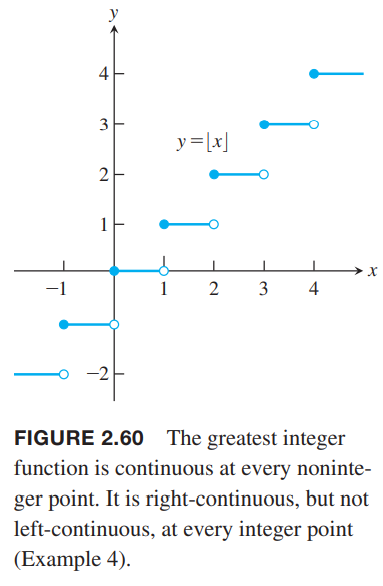
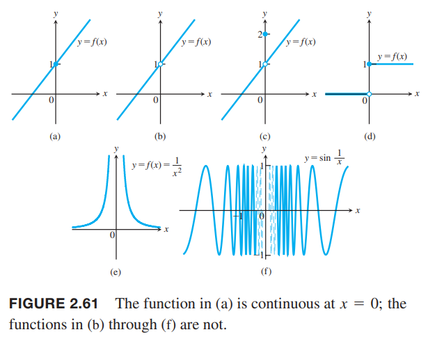

我们根据函数值画图像的时候，往往使用连续的曲线把各个点连起来，以此那些没有测量的点也有了对应的值，如下图所示。使用连续函数意味着输出是规则的、连续的，没有突然跳跃的点。直观地，任意图像在定义域连续运动的函数$y=f(x)$都是连续函数。这些函数在研究微积分及其应用时很有用。  

### 指定点处的连续性
回到2.4节研究的例2，如下图所示。  

例1 上图中的$f$有哪些不连续的点？为什么？其他点呢？  
解：首先我们只考虑在其定义域$[0,4]$上的点。从图像可以观察得到图像在$x=1,x=2,x=4$处不连续。$x=1$处函数图像有一个跳跃，称为跳跃间断点（`jump discontinuity`）。因为可以通过改变一个点处的函数值使得函数连续，$x=2$处称为可去间断点（`removable discontinuity`）。类似的，$x=4$也是可去间断点。  
在$x=1$处，函数没有极限。左极限$\lim_{x\to 1^-}=0$，右极限$\lim_{x\to 1^+}=1$，两者不相同，结果是图像上有一个跳跃。函数在$x=1$处是不连续的。不过由于$f(1)=1$和右极限相等，那么从$x=1$开始向右是连续的。  
$x=1$处，函数存在极限$\lim_{x\to 2}=1$，但是不等于$f(2)=2$，即极限值不等于函数值。因此在$x=2$处不连续。  
$x=4$处，是函数右端点，所以没有右极限。左极限$\lim_{x\to 4^-}f(x)=1$，但是函数值$f(4)=\frac{1}{2}$，和左极限不一样。  
在$x=3$，函数极限$\lim_{x\to 3}f(x)=2$。这和函数值$f(x)=2$一致，所以在此处函数是连续的。  
$x=0$处，这是函数的左端点，所以不存在左极限。右极限$\lim_{x\to 0^+}f(x)=1$和函数值$f(0)=1$一致。所以函数从$x=0$右边是连续的。  
在其余各点，极限值和函数值都是相等的，所以函数在这些地方也都是连续的。

**定义** 令$c$是函数$f$定义域上的内部点或者端点.  
如果
$$\lim_{x\to c}f(x)=f(c)$$
那么函数$f$在$c$处是连续的。  
如果
$$\lim_{x\to c+}f(x)=f(c)$$
那么函数在$c$处是右连续的。  
如果
$$\lim_{x\to c^-}f(x)=f(c)$$
那么函数在$c$处是左连续的。

回到例1，函数$f$在定义域$[0, 4]$上除了$x=1,2,4$之外的其他点都是连续的。$x=1$是右连续但不是左连续，$x=2$处既不是左连续也不是右连续，在$x=4$是左连续的。  
根据定理6可知如果在某点处左连续且右连续，那么就是连续的。如果一个函数在闭区间$[a,b]$上有定义，且在$a$处右连续，在$b$处左连续，在其余点连续，那么这个函数在该闭区间上是连续的。这个定义可以拓展到无限闭区间$[a,\infty)$或$(-\infty,b]$。

例2 函数$f(x)=\sqrt{4-x^2}$在定义域$[-2,2]$上是连续的。如下图所示。$x=-2$处是右连续，在$x=2$处是左连续。  

例3 单位阶跃函数$U(x)$如下图所示，在$x=0$处是右连续，但是不是左连续，所以不是连续的。这个点是跳跃间断点。  

**连续性测试** 函数$f(x)$是在$c$处是连续的等价于满足下面三个条件
1. $f(c)$存在
2. $\lim_{x\to c}f(x)$存在
3. $\lim_{x\to c}f(x)=f(c)$

如果是单边连续性，那么条件2和条件3改为单边极限即可。

例4 函数$y=\lfloor x\rfloor$如下图所示。  
  
在每个正数的地方都是不连续的，因为当$x\to n$时左极限不等于右极限。
$$\lim_{x\to n^-}\lfloor x\rfloor=n-1,\lim_{x\to n^+}\lfloor x\rfloor=n$$
但是在每个$n$处是右连续的。  
同时，在其他地方都是连续的，因为当$n-1<c<n$时，有
$$\lim_{x\to c}\lfloor x\rfloor=n-1=\lfloor c\rfloor$$

下图展示了几种常见的不连续的情况。  
  
（a）在$x=0$处是连续的。（b）在$x=0$处不连续，因为没有定义。（c）在$x=0$处的值是1而不是2的话就是连续的，所以是可去间断点。也就是在这个点极限是存在的，只要让函数值等于极限值就能使之连续，去除不连续性。（d）$x=0$处不连续的，因为极限不存在。当左极限不等于右极限的时候，是跳跃间断点。（e）$f(x)=\frac{1}{x^2}$在$x=0$处是无穷间断点（`infinite discontinuity`）。（f）函数有振荡间断点（`oscillating discontinuity`）：因为$x\to 0$时函数值在$[-1,1]$来回振荡无数次。

### 连续函数
如果函数在定义域的每一个点都是连续的话，那么该函数是连续函数（`continuous function`）。这是函数的属性。每个函数都有定义域，如果改变了定义域，那么就是另外一个函数了，那么连续性也许会改变。如果函数有一个或者多个不连续的点，那么函数是非连续函数。

例5  
（a）函数$f(x)=\frac{1}{x}$是连续的，因为在定义域的每个点都是连续的。注意，函数在$x=0$处是不连续的，但是该点不在定义域内。  
（b）恒等函数$f(x)=x$和常值函数$f(x)=k$在是连续函数。

定理9 连续函数的属性  
如果函数$f,g$在$x=c$处是连续的，那么下面代数组合在$x=c$处也是连续的：
1. 和。$f+g$
2. 差。$f-g$
3. 倍。$k\cdot f$
4. 积。$f\cdot g$
5. 商。$f/g, g(c)\neq 0$
6. 幂。$f^n, n$是正整数
7. 根。$\sqrt[n]{f}$，其中$n$是正整数且保证在$c$处有定义

这里的结果和2.2节定理1类似。证明第一个和的性质：
$$\begin{aligned}
\lim_{x\to c}(f+g)(x)&=\lim_{x\to c}(f(x)+g(x))\\
&=\lim_{x\to c}f(x)+\lim_{x\to c}g(x)\\
&=f(c)+g(c)\\
&=(f+g)(c)
\end{aligned}$$

例6  
（a）根据2.2节定理2，多项式$P(x)=a_nx^n+a_{n-1}x^{n-1}+\cdots+a_0$是连续函数。  
（b）根据2.2节定理3，如果$P(x),Q(x)$是多项式函数，那么实数函数$P(x)/Q(x)$在其定义域上连续。

例7 函数$f(x)=|x|$是连续函数。当$x>0$时，$f(x)=x$，是多项式函数，所以连续；当$x<0$时，$f(x)=-x$是另一个多项式函数，也连续；最后$x=0$，$\lim_{x\to 0}|x|=0=|0|$，连续。

根据 2.2 节例 11，函数 $y=\sin x,y=\cos x$ 在 $x=0$ 处是连续的。下面证明这两个函数处处连续。

如果函数 $f$ 在点 $c$ 处连续，根据定义
$$\lim_{x\to c}f(x)=f(c)$$
令 $h=x-c$，那么 $x\to c$，有 $h\to 0$，将 $x=h+c$ 代入上式
$$\lim_{h\to 0}f(h+c)=f(c)$$
以上步骤均可逆，所以如果函数 $f$ 满足上面的式子，那么 $f$ 在点 $c$ 处连续。

正弦函数满足 $\sin(h+c)=\sin h\cos c+\cos h\sin c$，那么
$$\begin{aligned}
\lim_{h\to 0}\sin(h+c)&=\lim_{h\to 0}(\sin h\cos c+\cos h\sin c)\\
&=\cos c\lim_{h\to 0}\sin h+\sin c\lim_{h\to 0}\cos h\\
&=\sin c
\end{aligned}$$
所有 $\sin x$ 在点 $c$ 处连续，而 $c$ 可以是任意值，所以 $\sin x$ 处处连续。

余弦函数有性质 $\cos(h+c)=\cos h\cos c-\sin h\sin c$，使用上面的方法即可证明 $\cos x$ 也处处连续。

根据定理 9，六个三角函数在其定义域上都是连续的。比如$y=\tan x$在$\cdots\cup(-\pi/2,\pi/2)\cup(\pi/2,3\pi/2)\cup\cdots$上是连续的。

### 反函数和连续性
如果一个连续函数在某个区间上存在反函数，那么反函数也自己的定义域上也是连续的。观察$f^{-1}$的图像，它和$f$的图像关于$y=x$对称，如果原函数没有间断，那么反函数不会有任何的不连续。严格证明需要更高等的数学知识。由此可知六个反三角函数是在其定义域上是连续的。  
1.4节给出了$y=a^x$的定义，我们用光滑的曲线连接了$x$为无理数的情况，所以它在实数范围内都是连续的。那么其反函数对数函数$y=\log_a x$也是连续函数。特别地，自然指数$e^x$和自然对数$\ln x$也是连续函数。严格的证明会在第七章给出。

### 复合函数的连续性
通过组合连续函数得到的函数也是连续函数。如果函数$f(x),g(x)$分别在$x=c,x=f(c)$处连续，那么$g\circ f$在$x=c$处也连续。如下图所示。当$x\to c$时，$g\circ f$的极限是$g(f(c))$。  
  

**定理10** 连续函数的组合
> 如果 $f$ 在 $c$ 处连续，$g$ 在 $f(c)$ 处连续，那么 $g\circ f$ 在 $c$ 处连续。

定理10是比较直观的。因为$x$趋近$c$，那么$f(x)$趋近于$f(c)$，由于$g$在$f(x)$处连续，那么$g(f(x))$趋于$g(f(c))$。  
复合函数的连续性对有限多函数都成立。唯一的条件是当应用规则时在对应点是连续的。证明大概可以参考下图。  

例8 证明下列函数是连续函数。  
（a）$y=\sqrt{x^2-2x-5}$  
（b）$y=\frac{x^{2/3}}{1+x^4}$  
（c）$y=|\frac{x-2}{x^2-2}|$  
（d）$y=|\frac{x\sin x}{x^2+2}|$  
证明：  
（a）根据定理9函数的根函数是连续的，多项式$f(x)=x^2-2x-5$是连续函数，那么$g(x)=\sqrt{f(x)}$是连续的。  
（b）分子是恒等函数的平方的立方根，是连续函数；分母是处处是正数的多项式函数，也是连续函数。商也是连续的。  
（c）商$(x-2)/(x^2-2)$对所以$x\neq \pm\sqrt{2}$都是连续的，例7告诉我们绝对值函数是连续的。  
（d）正弦函数处处连续的，分子$x\sin x$是连续函数的乘积，也是连续的，分母是连续的，所以它们的商的绝对值函数也是连续函数。下图是函数图像。  

**定理11** 连续函数的极限  
如果$\lim_{x\to c}f(x)=b$，$g$在$b$处是连续的，那么
$$\lim_{x\to c}g(f(x))=g(b)$$

证明：令$\varepsilon>0$。因为$g$在$b$点连续，那么存在$\delta_1>0$使得
$$|g(y)-g(b)|<\varepsilon, \text{ whenever } 0<|y-b|<\delta_1$$
因为$\lim_{x\to c}f(x)=b$，那么存在$\delta>0$使得
$$|f(x)-b|<\delta_1, \text{ whenever } 0<|x-c|<\delta$$
令$y=f(x)$，有
$$|y-b|<\delta_1, \text{ whenever } 0<|x-c|<\delta$$
这就蕴涵着当$0<|x-c|<\delta$，有$|g(y)-g(b)|=|g(f(x))-g(b)|<\varepsilon$。从极限的定义可知$\lim_{x\to c}g(f(x))=g(b)$。  
这个证明过程得到$c$是$f$的定义域的内点是成立的。如果$c$是端点，只需要把上述证明过程中的极限换成合适的单边极限即可。

例9 定理11的应用。  
（1）
$$\begin{aligned}
\lim_{x\to \pi/2}\cos(2x+\sin(\frac{3\pi}{2}+x))&=\cos(\lim_{x\to \pi/2}2x+\lim_{x\to \pi/2}\sin(\frac{3\pi}{2}+x))\\
&=\cos(\pi+\sin 2\pi)\\
&=\cos\pi=-1
\end{aligned}$$
（2）
$$\begin{aligned}
\lim_{x\to 1}\sin^{-1}(\frac{1-x}{1-x^2})&=\sin^{-1}(\lim_{x\to 1}\frac{1-x}{1-x^2})\\
&=\sin^{-1}(\lim_{x\to 1}\frac{1}{1+x})\\
&=\sin^{-1}\frac{1}{2}\\
&=\frac{\pi}{6}
\end{aligned}$$
（3）
$$\lim_{x\to 0}\sqrt{x+1}e^{\tan x}=\lim_{x\to 0}\sqrt{x+1}\exp(\lim_{x\to 0}\tan x)=1\cdot e^0=1$$

### 连续函数的中间值定理
**定理12** 连续函数的中间值定理（`The Intermediate Value Theorem`）  
如果函数$f$在闭区间$[a, b]$是连续函数，$y_0$是介于$f(a),f(b)$的任意值，那么存在$c\in [a,b]$使得$y_0=f(c)$。  

定理12是说在有限闭区间上的连续函数有中间值这个属性。从几何角度看，介于$f(a),f(b)$之间的水平线$y=y_0$和$f$在区间$[a,b]$上至少相交一次。  
这个定理的证明需要实数的完备性。实数完备性蕴涵着实数没有“洞”或者“间隙”。相反，如果是定义在有理数集合上的函数不满足完备性，那么也不满足中间值定理。  
$f$的连续性也是定理12的基本要素。如果$f$不连续，那么定理就可能不成立。如下图所示，$y_0$取2，3之间的话，就不存在$c$。  

定理12说明连续函数的图像没有任何间断点，可以用一个不间断的曲线连起来。它不会像取整函数那样跳跃，也不会像$1/x$分成不同的两个分支。  
方程$f(x)=0$的解是方程的根。中间值定理告诉我们如果$f$是连续的，且某个区间的值改变了符号，那么某点处值是正值，某点处的值是负值，那么这两点间存在一个点，对应的函数值是零，这个点就是根。

例10 证明$x^3-x-1=0$在1和2之间有一个根。  
证明：令$f(x)=x^3-x-1$，这是多项式函数，所以是连续的。又因为$f(1)=1-1-1=-1<0,f(2)=8-2-1=5>0$，那么存在一点$c$介于1和2之间，对应的值$y_c=0$。

例11 证明方程（如下图）
$$\sqrt{2x+5}=4-x^2$$
有一个解。  
  
证明：令$f(x)=\sqrt{2x+5}+x^2-4,g(x)=\sqrt{2x+5}$。首先证明连续性。$g(x)$是平方函数和多项式函数的复合函数，所以在定义域$[-5/2,\infty)$上是连续的，$f(x)$是$g(x)$和一个多项式函数的和，所以也是连续的。$f(0)=\sqrt{5}-4<0,f(2)=3+4-4=3>0$，而$[0,2]\subset [-5/2,\infty)$，所以在0和2之间存在某个$c$使得$f(c)=0$，而这个$c$就是原方程的解。

### 连续延拓
有时，某个函数$f$在$x=c$点处无意义导致了不连续。扩展$f$的定义域，包括$x=c$，以此构造一个新函数在$x=c$处是连续的。比如函数$y=f(x)=\sin x/x$在除了$x=0$之外都连续，这是因为$x=0$不在其定义域。定理7告诉我们$y=\sin x/x$的$x\to 0$时的极限是1，我们可以拓展函数在$x=0$处的行为使之连续。新函数是
$$F(x)=\begin{cases}
\frac{\sin x}{x}, &&x\neq 0\\
1,&&x=0
\end{cases}$$
那么新函数在$x=0$处是连续的，因为
$$\lim_{x\to 0}\frac{\sin x}{x}=1=F(0)$$
如下图所示  

更一般地，一个函数在某点无意义（没有定义），$f(c)$未定义，但是$\lim_{x\to c}f(x)=L$，那么我们定义如下新函数
$$F(x)=\begin{cases}
f(x), &&x\in D \text{ of } f\\
L, &&x=c
\end{cases}$$
函数$F$在$x=c$处连续。这称为在$c$处函数$f$的连续延拓（`continuous extension`）。

例12 证明
$$f(x)=\frac{x^2+x-6}{x^2-4}, x\neq 2$$
在$x=c$处有连续延拓，求这个延拓。  
解：尽管$x=2$处没定义，但是如果$x\neq 2$，那么
$$f(x)=\frac{x^2+x-6}{x^2-4}=\frac{(x-2)(x+3)}{(x-2)(x+2)}=\frac{x+3}{x+2}$$
新函数
$$F(x)=\frac{x+3}{x+2}$$
当$x\neq 2$时，$F(x)=f(x)$，但是在$x=2$处连续，值是$5/4$。因此$F$是$f$在$x=c$处的连续延拓，并且
$$\lim_{x\to 2}f(x)=\frac{5}{4}$$
$f$和新函数$F$如下图所示：  
  
连续延拓$F$和$f$图像一样，除了$f$在点$(2, 5/4)$有个洞之外。

### 习题
72. 证明 $\sin x,\cos x$ 是处处连续的。

证明：函数 $f(x)$ 在 点 $c$ 处连续，根据定义
$$\lim_{x\to c}f(x)=f(c)$$
令 $x=h+c$，那么
$$\lim_{h\to 0}f(c+h)=f(c)$$
当 $c$ 为任意点时，有恒等式
$$\sin (h + c) =\sin h \cos c + \cos h \sin c$$
当 $h\to 0$ 时，即 $x\to c$
$$\lim_{h\to 0}\sin (h + c)=\lim_{h\to 0}(0\cdot \cos c+1\cdot\sin c)=\sin c$$
在点 $c$ 处连续。
