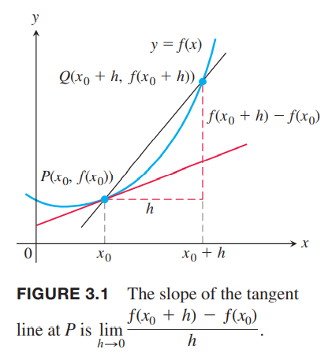
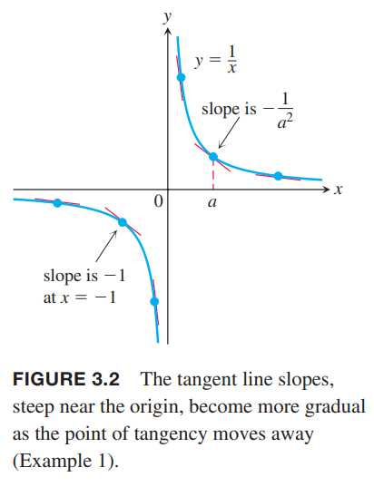
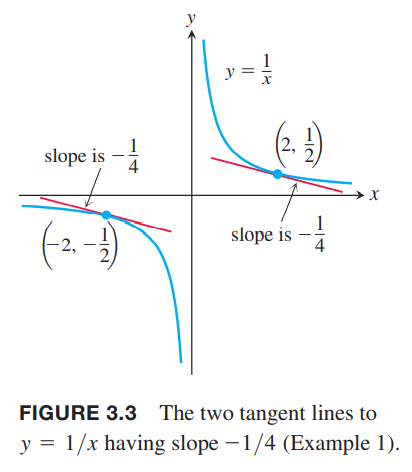

这一小节我们会定义曲线某点处的斜率和切线，还会定义一个函数在某点处的倒数。导数是求图像斜率和瞬时变化率的工具。

### 某点处的切线和导数
为了求任意曲线$y=f(x)$在某点$P(x_0,f(x_0))$处的切线，我们使用2.1节介绍的方法。我们计算通过点$P$和距离$P$很近的一点$Q(x_0+h,f(x_0+h))$的割线的斜率。然后令$h\to 0$求极限。如下图所示。如果极限存在，那么极限是$P$点处的斜率，切线就是通过$P$且斜率为极限的直线。  

**定义** 假定极限存在的情况下，曲线$y=f(x)$在点$P(x_0,f(x_0))$的斜率是
$$\lim_{h\to 0}\frac{f(x_0+h)-f(x_0)}{h}$$
曲线在$P$的切线是通过该点且斜率为极限的直线。

例1  
（a）求曲线$y=1/x$在任意点$x=a\neq 0$的斜率。$x=-1$处的斜率是多少？  
（b）哪里的斜率是$-1/4$？  
（c）随着$a$的变化，点$(a,1/a)$的切线是如何变化的？  
解：  
（a）$f(x)=1/x$，在$(a,1/a)$处的斜率是
$$\begin{aligned}
\lim_{h\to 0}\frac{f(a+h)-f(a)}{h}&=\lim_{h\to 0}\frac{\frac{1}{a+h}-\frac{1}{a}}{h}\\
&=\lim_{h\to 0}\frac{1}{h}\frac{a-(a+h)}{a(a+h)}\\
&=\lim_{h\to 0}\frac{-h}{ha(a+h)}\\
&=\lim_{h\to 0}\frac{-1}{a(a+h)}\\
&=-\frac{1}{a^2}
\end{aligned}$$
$a$可以是正，也可以是负，但是不能为零。当$a=-1$，斜率是$-1/(-1)^2=-1$。如下图所示。  
  
（b）斜率是$-1/4$，那么
$$-\frac{1}{a^2}=-\frac{1}{4}$$
那么$a=2,-2$。在点$(2,1/2),(-2,-1/2)$处的斜率是$-1/4$。  
  
（c）$a\neq 0$时斜率$-1/a^2$始终是负数。当$a\to 0^+$时，斜率趋于负无穷，切线无限的陡。当$a\to 0^-$时也是这样。当$a$远离原点的时候，斜率趋于零，那么切线变得越来越水平。

### 变化率：某点处的导数
式子
$$\frac{f(x_0+h)-f(x_0)}{h},h\neq 0$$
是函数$f$在$x_0$处增加$h$时差的商。当$h$接近于零时，差的商有极限，那么这个极限有一个特殊的名字和记号。

**定义** 在极限存在的前提下，函数$f$在$x_0$处的导数记作$f'(x_0)$，定义是
$$f'(x_0)=\lim_{h\to 0}\frac{f(x_0+h)-f(x_0)}{h}$$

导数根据不同的问题，有不同的意义。可以是曲线某点处的斜率，也可以是函数的瞬时变化率。

例2 2.1节的例1和例2中，石头下落的高度公式是$y=4.9t^2$，求$t=1$时的瞬时速度。  
解：令$f(t)=4.9t^2$，在$t=1$和$t=1+h$之间的平均速度是
$$\frac{f(1+t)-f(1)}{h}=\frac{4.9(1+h)^2-4.9\cdot 1^2}{h}=\frac{4.9(h^2+2h)}{h}=4.9(h+2)$$
那么在$t=1$的瞬时速度是
$$f'(1)=\lim_{h\to 0}4.9(h+2)=4.9(2)=9.8\text{m/s}^2$$

### 总结
曲线的斜率、切线、瞬时速度、导数这些概念的基础都是极限。下面的式子在不同场景下有各种不同的意义
$$\lim_{h\to 0}\frac{f(x_0+h)-f(x_0)}{h}$$

1. 图像$y=f(x)$在$x=x_0$处的斜率
2. 曲线$y=f(x)$在$x=x_0$处的切线的斜率
3. 函数$y=f(x)$在$x=x_0$处的变化率
4. 在$x=x_0$处的导数
