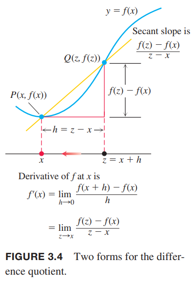

上一节中我们定义在$x=x_0$处函数$y=f(x)$的导数是
$$f'(x_0)=\lim_{h\to 0}\frac{f(x_0+h)-f(x_0)}{h}$$
现在我们要研究$f$的导数作为函数的情况，前提是对应$x$是在$f$的定义域且极限存在。

**定义** 假定极限存在。对因变量$x$，$f(x)$的导数是函数$f'$，在$x$处的值是
$$f'(x)=\lim_{h\to 0}\frac{f(x+h)-f(x)}{h}$$

定义中使用$f(x)$而不是之前的$f(x_0)$是为了强调$f'$是自变量$x$的函数。$f'$的定义域是在$f$定义域中使得极限存在的点，所以$f'$的定义域小于等于$f$的定义域。如果对于某个$x$，$f'$存在，那么我们称在$x$处$f$是可微的（`differentiable`），或可微分的、可导的。如果在$f$整个定义域上$f'$都有定义，那么称函数$f$是可导的。  
如果令$z=x+h$，那么$h=z-x$并且$h$趋于0等价于$z$趋于$x$。因此，可以得到下图所示的等价定义。这个公式有的时候会更方便。  

**公式**
$$f'(x)=\lim_{z\to x}\frac{f(z)-f(x)}{z-x}$$

### 使用定义计算导数
为了强调求导是对函数$y=f(x)$做某种操作，我们使用记号
$$\frac{d}{dx}f(x)$$
来表示导数$f'(x)$。3.1节的例1阐述了$x=a$处$y=1/x$的求导过程，用$x$表示在定义域上的任意一点，可以记作
$$\frac{d}{dx}(\frac{1}{x})=-\frac{1}{x^2}$$

例1 求$f(x)=\frac{x}{x-1}$的导数。  
解：使用定义来求解。
$$\begin{aligned}
f'(x)&=\lim_{h\to 0}\frac{f(x+h)-f(x)}{h}\\
&=\lim_{h\to 0}\frac{\frac{x+h}{x+h-1}-\frac{x}{x-1}}{h}\\
&=\lim_{h\to 0}\frac{1}{h}\cdot\frac{(x+h)(x-1)-x(x+h-1)}{(x+h-1)(x-1)}\\
&=\lim_{h\to 0}\frac{1}{h}\cdot\frac{-h}{(x+h-1)(x-1)}\\
&=\lim_{h\to 0}\frac{-1}{(x+h-1)(x-1)}\\
&=\frac{-1}{(x-1)^2}
\end{aligned}$$

例2  
（1）求导$f(x)=\sqrt{x},x>0$  
（2）求在$x=4$处$f(x)=\sqrt{x}$对应点的切线  
解：（1）使用第二个定义的公式
$$\begin{aligned}
f'(x)&=\lim_{z\to x}\frac{f(z)-f(x)}{z-x}\\
&=\lim_{z\to x}\frac{\sqrt{z}-\sqrt{x}}{z-x}\\
&=\lim_{z\to x}\frac{\sqrt{z}-\sqrt{x}}{(\sqrt{z}-\sqrt{x})(\sqrt{z}+\sqrt{x})}\\
&=\lim_{z\to x}\frac{1}{\sqrt{z}+\sqrt{x}}\\
&=\frac{1}{2\sqrt{x}}
\end{aligned}$$
（2）$x=4$时
$$f'(4)=\frac{1}{2\sqrt{4}}=\frac{1}{4}$$
那么点$(4,2)$上的切线斜率是$1/4$，方程是
$$y=2+\frac{1}{4}(x-4)=\frac{1}{4}x+1$$

### 记号
有许多记号表示函数$y=f(x)$的导数。常用的有
$$f'(x)=y'=\frac{dy}{dx}=\frac{df}{dx}=\frac{d}{dx}f(x)=D(f)(x)=D_xf(x)$$
$d/dx$和$D$表示求导（微分）操作。撇号（$y',f'$）是由牛顿发明的，$d/dx$是由莱布尼茨发明的。  
为了表示在$x=a$处的导数的值，使用下面的记号
$$f'(a)=\frac{dy}{dx}\bigg|_{x=a}=\frac{df}{dx}\bigg|_{x=a}=\frac{d}{dx}f(x)\bigg|_{x=a}$$
比如例2就可以写作
$$f'(4)=\frac{d}{dx}\sqrt{x}\bigg|_{x=4}=\frac{1}{2\sqrt{x}}\bigg|_{x=4}=\frac{1}{2\sqrt{4}}=\frac{1}{4}$$

### 做导数图像
通过估算$f$的图像的斜率，可以近似画出$y=f(x)$导数的图像。先把点$(x,f'(x))$画出来，然后用光滑的曲线连接就得到了$y=f'(x)$的图像。

例3 做下图（3.6a）中$y=f(x)$的导数的图像。  
  
解：我们在$f$上做一些点的切线，然后估算这些点对应$f'(x)$的值，我们把这些值画到（3.6b）上然后用光滑的曲线连接起来。

从$y=f'(x)$的图像能知道什么呢？
1. $f$的变化率是正的、负的或者是零；
2. 在任意$x$处，增长率的大致的大小，以及和原图相比的关系；
3. 导数自身变化是增加还是减小

### 区间上的导数；单边导数
如果函数$y=f(x)$在开区间上的每一个点都存在导数，那么函数在开区间上是可导的。它在闭区间$[a, b]$上可导，如果它在开区间$(a,b)$上可导并且极限
$$\lim_{h\to 0^+}\frac{f(a+h)-f(a)}{h}$$
$$\lim_{h\to 0^-}\frac{f(b+h)-f(b)}{h}$$
存在。如下图所示。  
  
左导数和右导数在定义域上可能存在也可能不存在。由于2.4节的定理6，函数在内部某点处有导数等价于左导数和右导数都存在且两者相等。

例4 证明函数$y=|x|$在$(-\infty,0),(0,\infty)$上可导，在$x=0$处导数不存在。  
解：由3.1小节知道$y=mx+b$的斜率是$x$，所以在原点的右侧，即$x>0$
$$\frac{d}{dx}(|x|)=\frac{d}{dx}(x)=\frac{d}{dx}(1\cdot x)=1$$
在原点左侧，$x<0$时
$$\frac{d}{dx}(|x|)=\frac{d}{dx}(-x)=\frac{d}{dx}(-1\cdot x)=-1$$
如下图所示：  
  
左右两边在原点处形成了一个角，是个不光滑拐角。在原点处导数不存在，因为右导数是
$$\lim_{h\to 0^+}\frac{|(0+h)|-|(0)|}{h}=\lim_{h\to 0^+}\frac{|h|}{h}=\lim_{h\to 0^+}\frac{h}{h}=1$$
右导数是
$$\lim_{h\to 0^-}\frac{|(0+h)|-|(0)|}{h}=\lim_{h\to 0^-}\frac{|h|}{h}=\lim_{h\to 0^-}\frac{-h}{h}=-1$$
两者不相等。

例5 例2中我们得到对于$x>0$，
$$\frac{d}{dx}\sqrt{x}=\frac{1}{2\sqrt{x}}$$
我们应用定义来检查在$x=0$处导数是否存在：
$$\lim_{h\to 0^+}\frac{\sqrt{0+h}-\sqrt{0}}{h}=\lim_{h\to 0^+}\frac{1}{\sqrt{h}}=\infty$$
由于右极限不是有限的，所以在$x=0$处不可导。连接原点和点$h,\sqrt{h}$的割线的斜率接近无穷，所以图像在原点处有垂直的切线。如下图所示：  

### 何时在某点处不可导
如果经过点$P(x_0,f(x_0))$和附近一点$Q$的斜率有限，那么函数在$x_0$有导数。直观地说，可导性说明图像是光滑的。一个函数在某点处不可导的原因是多样的，包含以下几种情况：
  
  
  
  
  
最后一个例子在$x=0$是连续的，但是在接近零时上下振荡。割线的斜率在$x$接近零时在-1和1之间振荡，不存在极限。

### 可导函数是连续的
**定理1 可导蕴涵连续** 如果函数$f$在$x=c$处有导数，那么$f$在$x=c$处连续。

证明：给定$f'(c)$存在，证明$\lim_{x\to c}f(x)=f(c)$或者$\lim_{h\to 0}f(c+h)=f(c)$。如果$h\neq 0$，那么
$$\begin{aligned}
f(c+h)&=f(c)+(f(c+h)-f(c))\\
&=f(c)+\frac{f(c+h)-f(c)}{h}\cdot h
\end{aligned}$$
现在取$h\to 0$时的极限，有
$$\begin{aligned}
\lim_{h\to 0}f(c+h)&=\lim_{h\to 0}f(c)+\lim_{h\to 0}\frac{f(c+h)-f(c)}{h}\cdot\lim_{h\to 0}h\\
&=f(c)+f'(c)\cdot 0\\
&=f(c)
\end{aligned}$$

类似的，如果函数$f$在$x=c$处单边有导数，那么$f$在$x=c$处从该边是连续的。 
定理1告诉我们如果函数在某点处是不连续的，那么在该点处不可导。最大整数函数$y=\lfloor x\rfloor$在每个整数点$x=n$处不可导。  
注意：定理1的逆命题是假。函数连续的地方不意味着一定可导。例4就是逆命题的反例。
