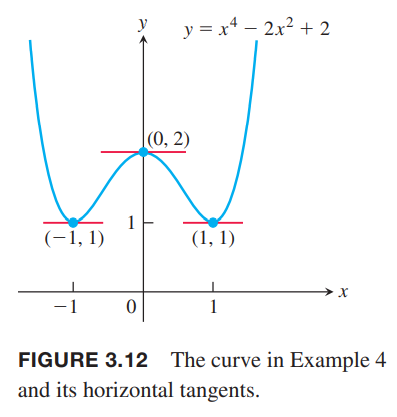
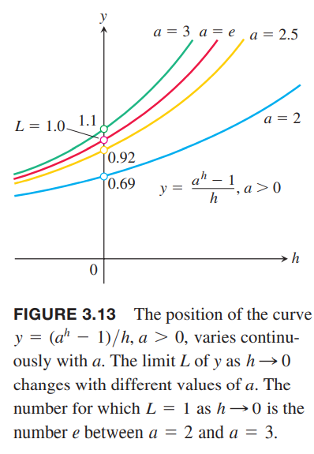
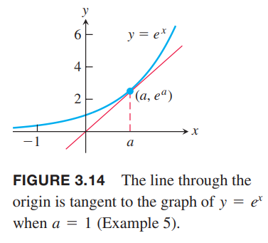

### 幂次，倍数，和，差
**常值函数的导数**  
如果函数$f$是常值函数$f(c)$，那么
$$\frac{df}{dx}=\frac{d}{dx}(c)=0$$

证明：使用定义证明$f(x)=c$的导数，每一点的值都是常数$c$，如下图所示。那么
$$f'(x)=\lim_{h\to 0}\frac{f(x+h)-f(x)}{h}=\lim_{h\to 0}\frac{c-c}{h}=\lim_{h\to c}0=0$$

从3.1节可知
$$\frac{d}{dx}(\frac{1}{x})=-\frac{1}{x^2}$$
即
$$\frac{d}{dx}(x^{-1})=-x^{-2}$$
从上一节的例2可知
$$\frac{d}{dx}(\sqrt{x})=\frac{1}{2\sqrt{x}}$$
即
$$\frac{d}{dx}(x^{1/2})=\frac{1}{2}x^{-1/2}$$
上面是阐述幂次$x^n$的求导的示例。我们首先证明$n$是正整数时的法则。

**正整数次幂的导数**  
如果$n$是正整数，那么
$$\frac{d}{dx}x^n=nx^{n-1}$$

证明：公式
$$z^n-x^n=(z-x)(z^{n-1}+z^{n-2}x+\cdots+zx^{n-1}+x^{n-1})$$
两边除以等式右边第一项有：
$$\begin{aligned}
f'(x)&=\lim_{z\to x}\frac{f(z)-f(x)}{z-x}\\
&=\lim_{z\to x}\frac{z^n-x^n}{z-x}\\
&=\lim_{z\to x}(z^{n-1}+z^{n-2}x+\cdots+zx^{n-1}+x^{n-1})\\
&=nx^{n-1}
\end{aligned}$$
幂次规律对任意实数$n$都成立。我们的示例是负数和分数的情况，$n$也能是实数。下面是更一般地版本，证明推迟到3.8节。

**幂次法则**  
如果$n$是任意实数，对任意$x^n,x^{n-1}$都有定义的$x$，都有
$$\frac{d}{dx}x^n=nx^{n-1}$$

例1 求  
（1）$x^3$  
（2）$x^{2/3}$  
（3）$x^{\sqrt{2}}$  
（4）$\frac{1}{x^4}$  
（5）$x^{-4/3}$  
（6）$\sqrt{x^{2+\pi}}$  
解：  
（1）$\frac{d}{dx}(x^3)=3x^{3-1}=3x^2$  
（2）$\frac{d}{dx}(x^{2/3})=\frac{2}{3}x^{2/3-1}=\frac{2}{3}x^{-1/3}$  
（3）$\frac{d}{dx}(x^{\sqrt{2}})=\sqrt{2}x^{\sqrt{2}-1}$  
（4）$\frac{d}{dx}(\frac{1}{x^4})=\frac{d}{dx}(x^{-4})=-4x^{-5}=-\frac{4}{x^5}$  
（5）$\frac{d}{dx}(x^{-4/3})=-\frac{4}{3}x^{-(4/3)-1}=-\frac{4}{3}x^{-7/3}$  
（6）$\frac{d}{dx}(\sqrt{x^{2+\pi}})=\frac{d}{dx}(x^{1+(\pi/2)})=(1+\frac{\pi}{2})x^{1+(\pi/2)-1}=\frac{1}{2}(2+\pi)\sqrt{x^\pi}$

下一个法则告诉我们可导函数乘以常数，导数等于原函数的导数乘以该常数。

**导数的常数倍法则**  
如果$u$是$x$的可导函数，$c$是常数，那么
$$\frac{d}{dx}(cu)=c\frac{du}{dx}$$

证明：
$$\begin{aligned}
\frac{d}{dx}cu&=\lim_{h\to 0}\frac{cu(x+h)-cu(x)}{h}\\
&=c\lim_{h\to 0}\frac{u(x+h)-u(x)}{h}\\
&=c\frac{du}{dx}
\end{aligned}$$

例2  
（1）下式
$$\frac{d}{dx}(3x^2)=3\cdot 2x=6x$$
告诉我们如果把$y=x^2$沿$y$轴乘以3倍，那么斜率也乘了3倍。如下图所示：  
  
（2）函数的负数  
上面法则代入常数$C=-1$，得到
$$\frac{d}{dx}(-u)=\frac{d}{dx}(-1\cdot u)=-1\cdot\frac{d}{dx}u=-\frac{du}{dx}$$

下一个法则告诉我们两个可导函数的和的导数是它们导数的和。

**导数的加法法则**  
如果$u,v$是$x$的可导函数，那么函数$u+v$在$u,v$都可导的点上可导，且在这些点处有
$$\frac{d}{dx}(u+v)=\frac{du}{dx}+\frac{dv}{dx}$$

证明：令$f(x)=u(x)+v(x)$
$$\begin{aligned}
\frac{d}{dx}[u(x)+v(x)]&=\lim_{h\to 0}\frac{[u(x+h)+v(x+h)]-[u(x)+v(x)]]}{h}\\
&=\lim_{h\to 0}[\frac{u(x+h)-u(x)}{h}+\frac{v(x+h)-v(x)}{h}]\\
&=\lim_{h\to 0}\frac{u(x+h)-u(x)}{h}+\lim_{h\to 0}\frac{v(x+h)-v(x)}{h}\\
&=\frac{du}{dx}+\frac{dv}{dx}
\end{aligned}$$

结合常数倍法则和加法法则可以推出导数的减法法则，即两个可导函数的差的导数等于它们导数的差：
$$\frac{d}{dx}(u-v)=\frac{d}{dx}[u+(-1)v]=\frac{du}{dx}+(-1)\frac{dv}{dx}=\frac{du}{dx}-\frac{dv}{dx}$$
加法法则可以拓展到两个以上有限多个函数。如果$u_1,u_2,\cdots,u_n$在$x$处可导，那么函数$u_1+u_2+\cdots+u_n$也可导，并且
$$\frac{d}{dx}(u_1+u_2+\cdots+u_n)=\frac{du_1}{dx}+\frac{du_1}{dx}+\cdots+\frac{du_n}{dx}$$
我们看一下三个函数的和：
$$\begin{aligned}
\frac{d}{dx}(u_1+u_2+u_3)&=\frac{d}{dx}((u_1+u_2)+u_3)\\
&=\frac{d}{dx}(u_1+u_2)+\frac{du_3}{dx}\\
&=\frac{du_1}{dx}+\frac{du_2}{dx}+\frac{du_3}{dx}
\end{aligned}$$
完整的证明需要使用递归法。

例3 求多项式$y=x^3+\frac{4}{3}x^2-5x+1$的导数。  
解：
$$\begin{aligned}
\frac{dy}{dx}&=\frac{d}{dx}x^3+\frac{d}{dx}(\frac{4}{3}x^2)-\frac{d}{dx}(5x)+\frac{d}{dx}(1)\\
&=3x^2+\frac{4}{3}\cdot 2x-5+0\\
&=3x^2+\frac{8}{3}x-5
\end{aligned}$$
我们可以按照例3的方式对多项式逐项求导。所有的多项式在任意$x$处都是可导的。

例4 曲线$y=x^4-2x^2+2$有水平切线吗？如果有，在哪些点处？  
解：如果有水平切线的话，那么斜率$dy/dx$是零。导数是
$$\frac{dy}{dx}=\frac{d}{dx}(x^4-2x^2+2)=4x^3-4x$$
现在求解方程$\frac{dy}{dx}=0$
$$\begin{aligned}
4x^3-4x&=0\\
4x(x^2-1)&=0\\
x&=0,1,-1
\end{aligned}$$
所以曲线$y=x^4-2x^2+2$的水平切线在$x=0,1,-1$处。相应的点分别是$(0,2),(1,1),(-1,1)$。如下图所示：  

### 指数函数的导数
我们使用定义来计算$f(x)=a^x$的导数
$$\begin{aligned}
\frac{d}{dx}(a^x)&=\lim_{h\to 0}\frac{a^{x+h}-a^x}{h}\\
&=\lim_{h\to 0}\frac{a^x\cdot a^h-a^x}{h}\\
&=\lim_{h\to 0}\frac{a^h-1}{h}\cdot a^x\\
&=(\lim_{h\to 0}\frac{a^h-1}{h})\cdot a^x
\end{aligned}$$
我们可以看出$a^x$的导数是$a^x$的常数倍$L$。我们之前没有遇到过这样的极限，但是我们可以知道$L=f'(0)$，因为
$$f'(0)=\lim_{h\to 0}\frac{a^h-a^0}{h}=\lim_{h\to 0}\frac{a^h-1}{h}=L$$
因此$L$是$a^x$和$y$轴交点处的斜率。第七章我们细致研究对数函数和指数函数之后，我们会证明极限$L$存在并且它的值是$\ln a$。现在，我们通过看$h$趋于零时，图像$y=(a^h-1)/h$的变化来研究$L$。如下图所示：  
  
如果$a=2$时$L$约为0.69，$a=2.5$时$L$约为0.92，$a=$时$L$约为1.1。在2.5和3之间的某个$a$，$L$是1。这个值是$a=e\approx 2.718281828$。选择这个基底，我们得到了1.4节学习的自然指数函数$f(x)=e^x$，且它满足
$$f'(0)=\lim_{h\to 0}\frac{e^h-1}{h}=1$$
因为$e^x$在$x=0$处的斜率就是1，这是人为定义的。  
极限等于1蕴涵着自然指数函数和它的对数之间的关系
$$\frac{d}{dx}(e^x)=\lim_{h\to 0}(\frac{e^h-1}{h})\cdot e^x=e^x$$
因此自然指数函数的导数是它本身。

**自然指数函数的导数**
$$\frac{d}{dx}(e^x)=e^x$$

例5 求通过原点的$y=e^x$的切线。  
解：通过原点的方程是$y=mx$，$m$是斜率。假定和$y=e^x$上的切点是$(a,e^a)$，那么斜率$m=(e^a-0)/(a-0)$。又有$e^x$在$x=a$处的导数是$e^a$，它等于切线斜率，所以$e^a=e^a/a$，所以$a=1,m=e$。切线方程是$y=ex$。如下图所示：  

我们或许想知道有没有其他函数满足函数的导数和它自身相等。答案是没有，所有满足$f(x)=f'(x)$的函数只能是自然指数函数的常数倍，即$f(x)=ce^x$。我们会在7.2节证明唯一性。自然指数函数的常数倍的导数是
$$\frac{d}{dx}ce^x=c\frac{d}{dx}e^x=ce^x$$

### 积和商
两个函数的和的导数等于两个函数的导数的和，乘积是否也满足这个规律吗？不是的。比如
$$\frac{d}{dx}(x\cdot x)=\frac{d}{dx}x^2=2x,\frac{d}{dx}x\cdot\frac{d}{dx}x=1\cdot 1=1$$
下面会说明两个函数的积的导数是两个乘积的和。

**导数的乘法法则**  
如果$u,v$在$x$处可导，那么$uv$的导数是
$$\frac{d}{dx}(uv)=u\frac{dv}{dx}+\frac{du}{dx}v$$

使用撇记号是$(uv)'=uv'+u'v$，使用函数记号是
$$\frac{d}{dx}[f(x)g(x)]=f(x)g'(x)+f'(x)g(x), (fg)'=fg'+f'g$$

例6 求  
（a）$y=\frac{1}{x}(x^2+e^x)$  
（b）$y=e^{2x}$  
的导数。  
解：  
（a）令$u=\frac{1}{x},v=x^2+e^x$，使用乘法法则
$$\begin{aligned}
\frac{d}{dx}[\frac{1}{x}(x^2+e^x)]&=\frac{1}{x}(2x+e^x)+(-\frac{1}{x^2})(x^2+e^x)\\
&=2+\frac{e^x}{x}-1-\frac{e^x}{x^2}\\
&=1+(x-1)\frac{e^x}{x^2}
\end{aligned}$$
（b）
$$\frac{d}{dx}(e^{2x})=\frac{d}{dx}(e^x\cdot e^x)=e^x\frac{de^x}{dx}+\frac{de^x}{dx}e^x=e^xe^x+e^xe^x=2e^xe^x=2e^{2x}$$

证明导数的乘法法则。  
$$\frac{d}{dx}(uv)=\lim_{h\to 0}\frac{u(x+h)v(x+h)-u(x)v(x)}{h}$$
分子减去再加上$u(x+h)v(x)$
$$\begin{aligned}
\frac{d}{dx}(uv)&=\lim_{h\to 0}\frac{u(x+h)v(x+h)-u(x+h)v(x)+u(x+h)v(x)-u(x)v(x)}{h}\\
&=\lim_{h\to 0}[u(x+h)\frac{v(x+h)-v(x)}{h}+v(x)\frac{u(x+h)-u(x)}{h}]\\
&=\lim_{h\to 0}u(x+h)\lim_{h\to 0}\frac{v(x+h)-v(x)}{h}+v(x)\lim_{h\to 0}\frac{u(x+h)-u(x)}{h}
\end{aligned}$$
$h$趋于零时，由于$u$在$x$处可导，所以$u(x+h)$趋于$u(x)$。根据定义，两个加数的后半部分恰好是$dv/dx,du/dx$，所以
$$\frac{d}{x}(uv)=u\frac{dv}{dx}+v\frac{du}{dx}$$

**导数的除法法则**  
如果$u,v$在$x$处可导且$v(x)\neq 0$，$u/v$的导数是
$$\frac{d}{dx}(\frac{u}{v})=\frac{v\frac{du}{dx}-u\frac{dv}{dx}}{v^2}$$
使用函数记号是
$$\frac{d}{dx}[\frac{f(x)}{g(x)}]=\frac{f'(x)g(x)-f(x)g'(x)}{g^2(x)}$$

例7 求下面函数的导数
（a）$y=\frac{t^2-1}{t^3+1}$  
（b）$y=e^{-x}$  
解：  
（a）
$$\begin{aligned}
\frac{dy}{dx}&=\frac{(t^3+1)(2t)-(t^2-1)(3t^2)}{(t^3+1)^2}\\
&=\frac{2t^4+2t-3t^4+3t^2}{(t^3+1)^2}\\
&=\frac{-t^4+3t^2+2t}{(t^3+1)^2}
\end{aligned}$$
（b）
$$\begin{aligned}
\frac{d}{dx}(e^{-x})&=\frac{d}{dx}\frac{1}{e^x}\\
&=\frac{e^x\cdot 0-1\cdot e^x}{(e^x)^2}\\
&=\frac{-e^x}{(e^x)^2}\\
&=\frac{-1}{e^x}=-e^{-x}
\end{aligned}$$

证明导数的除法法则。  
$$\begin{aligned}
\frac{d}{dx}\frac{u}{v}&=\lim_{h\to 0}\frac{\frac{u(x+h)}{v(x+h)}-\frac{u(x)}{v(x)}}{h}\\
&=\lim_{h\to 0}\frac{v(x)u(x+h)-u(x)v(x+h)}{hv(x+h)v(x)}
\end{aligned}$$
类似证明乘法法则，我们在分子上减去再加上$v(x)u(x)$
$$\begin{aligned}
\frac{d}{dx}\frac{u}{v}&=\lim_{h\to 0}\frac{v(x)u(x+h)-v(x)u(x)+v(x)u(x)-u(x)v(x+h)}{hv(x+h)v(x)}\\
&=\lim_{h\to 0}\frac{v(x)\frac{u(x+h)-u(x)}{h}-u(x)\frac{v(x+h)-v(x)}{h}}{v(x+h)v(x)}
\end{aligned}$$
求极限就是我们要证明的结果。

选择哪一个法则来求导数可能会有不同的难度。  
例8 求下面函数的导数
$$y=\frac{(x-1)(x^2-2x)}{x^4}$$
解：选择除法法则会很复杂，分子又需要用乘法法则，那么会有许多项需要处理。如果先简化函数
$$\begin{aligned}
y&=\frac{(x-1)(x^2-2x)}{x^4}\\
&=\frac{x^3-3x^2+2x}{x^3}\\
&=x^{-1}-3x^{-2}+2x^{-3}
\end{aligned}$$
那么使用加法法则就可以处理了
$$\begin{aligned}
\frac{dy}{dx}&=-x^{-2}+6x^{-3}-6x^{-4}\\
&=-\frac{1}{x^2}+\frac{6}{x^3}-\frac{6}{x^4}
\end{aligned}$$

### 二阶导数和高阶导数
如果$y=f(x)$是可导函数，那么导数$f'(x)$也是一个函数。如果$f'$也可导，那么对$f'$求导可以得到一个新的函数，记作$f''$，那么$f''=(f')'$。函数$f''$称为函数$f$的二阶导数（`second derivative`）。除此之外，还可以写作
$$f''(x)=\frac{d^2y}{dx^2}=\frac{d}{dx}\frac{dy}{dx}=\frac{dy'}{dx}=y''=D^2(f)(x)=D_x^2f(x)$$
其中$D^2$表示执行两次求导操作。  
如果$y=x^6$，那么$y'=6x^5$，所以
$$y''=\frac{dy'}{dx}=\frac{d}{dx}6x^5=30x^4$$
因此$D^2(x^6)=30x^4$。  
如果$y''$可导，那么它的导数$y'''=dy''/dx=d^3y/dx^3$是三阶导数（`third derivative`）。以此类推
$$y^{(n)}=\frac{d}{dx}y^{(n-1)}=\frac{d^ny}{dx^n}=D^ny$$
表示$n$阶导数，其中$n$是正整数。  
图像$y=f(x)$在某个点处的斜率的变化率就是二阶导数的意义。下一章将会阐述二阶导数会告诉我们图象是向上还是向下弯曲。下一节我们就沿直线的运动来解释二阶和三阶导数。

例9 函数$y=x^3-3x^2+2$的前四阶导数是  
一阶：$y'=3x^2-6x$  
二阶：$y''=6x-6$  
三阶：$y'''=6$  
四阶：$y^{(4)}=0$  
所有的多项式函数都可以求任意阶导数。上个例子中五阶导数以后续都是0。
