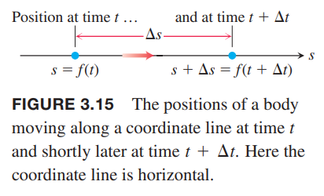
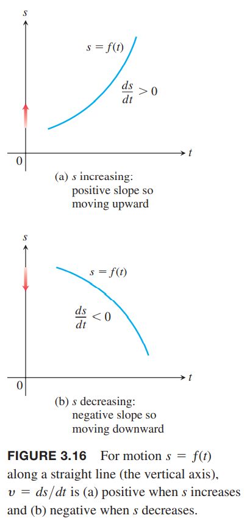

### 瞬时变化率
**定义** 在极限存在的前提下，$f$在$x=x_0$处的瞬时变化率是在该点的导数
$$f'(x_0)=\lim_{h\to 0}\frac{f(x_0+h)-f(x_0)}{h}$$

瞬时变化率是平均变化率的极限值。  
有时为了讨论方便，说变化率指的就是瞬时变化率。

例1 圆的直径和面积的关系是
$$A=\frac{\pi}{4}D^2$$
当直径是10米的时候，随着直径的增加，面积增加多快？  
解：变化率是
$$\frac{dA}{dD}=\frac{\pi}{4}\cdot 2D=\frac{\pi D}{2}$$
当$D=10\text{m}$时，变化率是$(\pi/2)10\approx 15.71\text{m}^2/\text{m}$，含义是直径增加一米，面积增加15.71平方米。

### 沿直线运动：位移，速度，速率，加速度，加速度变化率
假设一个物体沿坐标轴$s$运动，那么在坐标轴的位置$s$是时间的函数
$$s=f(t)$$
时间$t$到$t+\Delta t$物体有一段位移，
$$\Delta s=f(t+\Delta t)-f(s)$$
如下图所示：  
  
那么这一段时间的平均速度是
$$v=\frac{\Delta s}{\Delta t}=\frac{f(t+\Delta t)-f(t)}{\Delta t}$$
求在$t$时的瞬时速度，就是求$\Delta t$趋于0时的极限。

**定义** 速度是关于时间的位置函数的导数。如果$t$时位置是$s(t)$，那么此时的速度是
$$v(t)=\frac{ds}{dt}=\lim_{\Delta t\to 0}\frac{f(t+\Delta t)-f(t)}{\Delta t}$$

速度除了能告诉我们移动的快慢，还能告诉我们移动的方向。当正向移动时（$s$增加），速度是正的，否则是负数。下图表示随着时间的变化位置的变化，注意，竖轴是$s$轴，横轴是$t$，描绘的不是运动的轨迹。  

**定义** 速率是速度的绝对值。
$$\text{Speed}=|v(t)|=\bigg|\frac{ds}{dt}\bigg|$$

例2 下图是粒子沿着横轴移动的速度$v=f'(t)$和时间$t$的关系图。  
  
在速度函数的图像中，不是曲线的斜率说明沿着直线前进还是后退，而是正负号表示这一点。前三秒是前进的，接下来两秒后退，静止了一秒之后继续前进。在第一秒，速度越来越快，说明粒子是在加速运动，第二秒保持速度不变，第三秒速度越来越慢直到零。在$t=3$时，物体瞬间是静止的，因为瞬时速度是零，然后反向运动。接着反向速度越来越快，到$t=4$时速度达到最高。之后还是后退，但是速度越来越慢，直到$t=5$时停了下来。粒子保持静止了一秒，在$t=6$时开始前进，最后一秒速度越来越快。

速度的瞬时变化率是加速度，表示速度以多快或多慢加速或者减速。第十二章我们会讨论在平面和空间运动的情况，那时，加速度也会是有方向的。  
加速的变化称为 jerk（没有找到对应中文，后文写作“加速度变化率”）。

**定义** 加速度是速度的导数。如果物体在$t$时刻的位置是$s(t)$，物体在$t$时刻的加速度是
$$a(t)=\frac{dv}{dt}=\frac{d^2s}{dt^2}$$
加速度变化率是加速度的导数。
$$j(t)=\frac{da}{dt}=\frac{d^3s}{dt^3}$$

地球附近的物体以固定的加速度作自由落体运动。由伽利略实验可以得到
$$s=\frac{1}{2}gt^2$$
$s$是下落的距离，$g$是由于地球重力而产生的加速度。这个方程在真空中是成立的，因为没有空气阻力；对于密度大的重物也是近似成立的，比如岩石或者钢铁，在前一些秒的降落高度是符合这个方程的，这时空气阻力影响不大。  
$g$的大小取决于$s,t$测量的单位。通常$s$单位是米，$t$的单位是秒，那么$g$在海平面处的大小大约是$9.8\text{m/s}^2$。以上均为国际单位制。强调海平面的原因是高度对重力有一定的影响，比如珠穆朗玛峰上重力加速度略小。  
重力加速度是常数，所以加速度变化率是零：
$$j=\frac{d}{dt}g=0$$

例3 如下图所示，重物从$t=0$时开始自由落体。  
  
（a）前三秒重物下落多少米？  
（b）在$t=3$时速度、速率和加速度分别是多少？  
解：（a）自由落体公式是$s=4.9t^2$，前三秒运动了
$$s(3)-s(0)=4.9(3)^2=44.1\text{m}$$
（b）任意时刻速度是位置的导数
$$v(t)=s'(t)=\frac{d}{dt}(4.9t^2)=9.8t$$
那么$t=3$时，速度是
$$v(3)=29.4\text{m/s}$$
方向向下，$s$增加的方向。速率是
$$\text{speed}=|v(3)|=29.4\text{m/s}$$
任意时刻加速度是速度的导数
$$a(t)=v'(t)=s''(t)=9.8\text{m/s}^2$$
那么$t=3$时加速度是$9.8\text{m/s}^2$。

例4 炸药把岩石垂直崩上天。初始速度是$49\text{m/s}$，如下图所示。$t$秒后，高度是$s=49t-4.9t^2$。  
  
（a）岩石的最大高度是多少？  
（b）距离地面高度$78.4\text{m}$且往上运动时速度是多少？向下运动时呢？  
（c）飞行时任意时刻的加速度是多少？  
（d）岩石什么时候落地？  
解：（a）我们选择向上为$s$的方向（正向）。速度向上为正，向下为负。岩石飞到最高就是速度为零的时候。任意时刻速度是
$$v=\frac{ds}{dt}=\frac{d}{dt}(49t-4.9t^2)=49-9.8\text{m/s}$$
速度为零
$$49-9.8t=0$$
$$t=5$$
此时，岩石高度是
$$s_{\max}=s(5)=49(5)-4.9(5)^2=245-122.5=122.5\text{m}$$
如下图所示：  
  
（b）为了找到对应高度的速度，我们首先要找到什么时候在对应高度。
$$s(t)=49t-4.9t^2=78.4$$
$$\begin{aligned}
4.9t^2-49t+78.4&=0\\
4.9(t^2-10t+16)&=0\\
(t-2)(t-8)&=0\\
t&=2,8
\end{aligned}$$
两个时间点的速度分别是
$$v(2)=49-9.8(2)=49-19.6=29.4\text{m/s}$$
$$v(8)=49-9.8(8)=49-78.4=-29.4\text{m/s}$$
可以看出来，这两个时刻速率是一样的。不过$v(2)>0$说明是向上运动，$v(8)<0$说明是向下运动的。  
（c）在岩石飞行的任意时刻，加速度是常数
$$a=\frac{dv}{dt}=\frac{d}{dt}(4.9-9.8t)=-9.8\text{m/s}^2$$
（d）岩石回到地面，即$s$为零。
$$49t-4.9t^2=4.9t(10-t)=0$$
$t=0$时就是刚刚爆炸，岩石开始向上飞。$t=10$时岩石落回到地面。

### 导数在经济学领域的应用
经济学家使用一个专业术语边际（`marginal`）来表示变化率。  
$x$表示生成的数量，$c$表示对应的生成成本。边际成本表示生产成本的变化率$dc/dx$。  
假设$c(x)$表示一周制造$x$吨钢的成本。如果制造$x+h$吨的话，成本的差除以$h$，就是每多生成一顿钢的成本
$$\frac{c(x+h)-c(x)}{h}$$
$h\to 0$的极限就是每周在$x$的基础上多生成钢的边际成本：  
$$\frac{dc}{dx}=\lim_{h\to 0}\frac{c(x+h)-c(x)}{h}$$
  
经济学家使用三次函数估算成本
$$c(x)=\alpha x^3+\beta x^2+\gamma x+\delta$$
$\delta$表示固定成本，比如租金、设备、管理费用等。其他项表示变化成本，比如原材料、工人的费用等等。三次函数通常足够拟合现实情况了。

例5 假设生成8到30个取暖设备时生产$x$个设备的成本是
$$c(x)=x^3-6x^2+15x$$
卖出$x$个设备的收入是
$$r(x)=x^3-3x^2+12x$$
当前每天生成10个。如果多生产设备的话（比如11台）成本增加多少？多收入多少呢？  
解：边际成本是
$$c'(x)=3x^2-12x+15$$
$$c'(10)=3(100)-12(10)+15=195$$
边际收入是
$$r'(x)=3x^2-6x+12$$
$$r'(10)=3(100)-6(10)+12=252$$
如果生成11台并出售11台设备的话，会增加利润$252-195=57$。

例6 如果边际税率是28%，那么你收入每增加1000，需要额外支付280的税。这并不意味着你需要缴纳全部收入的28%。而是在收入水平为$I$，交税额为$T$时，边际税率$dT/dI=0.28$。随着收入的增加，边际税率还是增大。

### 变化灵敏度
$x$变化很小而$f(x)$变化很大，那么函数对于$x$的变化很灵敏。$f'(x)$就是计量灵敏度的。$|f'(x)|$较大，那么$f$对于$x$变化更灵敏。

例7 孟德尔是最早研究豌豆的杂交遗传问题的。  
豌豆光滑是显性基因，如果$p$是光滑豌豆的比例，那么皱豌豆的比例是$1-p$，那么后代光滑的比例是
$$y=2p(1-p)+p^2=2p-p^2$$
如下图（a）所示，当$p$比较小的时候，$y$对于$p$的变化更敏感些。如下图（b）所示即是证明。当$p$趋于零的时候，$dy/dp$趋于2，而$p$趋于1的时候，导数接近零。  
  
也就是说，把光滑豌豆和主要是皱豌豆的种子杂交，后代两者比例变化比把光滑豌豆和主要是光滑豌豆的种子杂交时要大。
