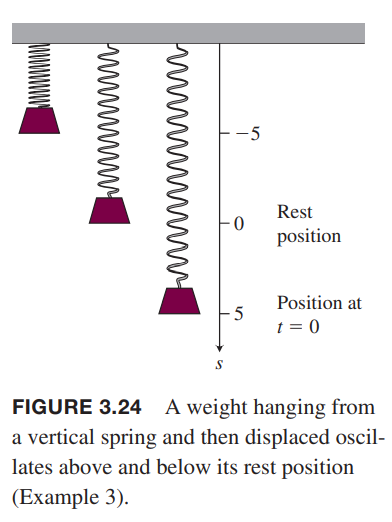
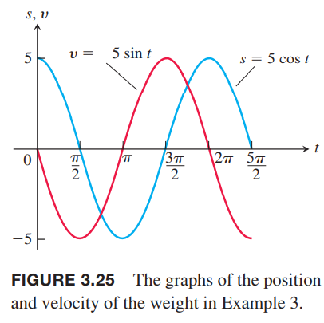

### 正弦函数的导数
$x$弧度表示，下面计算$f(x)=\sin x$的导数。正弦函数的和公式是
$$\sin(x+h)=\sin x\cos h+\cos x\sin h$$
那么
$$\begin{aligned}
f'(x)&=\lim_{h\to 0}\frac{f(x+h)-f(x)}{h}\\
&=\lim_{h\to 0}\frac{\sin(x+h)-\sin x}{h}\\
&=\lim_{h\to 0}\frac{\sin x\cos h+\cos x\sin h-\sin x}{h}\\
&=\lim_{h\to 0}\frac{\sin x(\cos h-1)+\cos x\sin h}{h}\\
&=\lim_{h\to 0}(\sin x\frac{\cos h-1}{h})+\lim_{h\to 0}(\cos x\frac{\sin h}{h})\\
&=\sin x\cdot \lim_{h\to 0}\frac{\cos h-1}{h}+\cos x\cdot\lim_{h\to 0}\frac{\sin h}{h}\\
&=\sin x\cdot 0+\cos x\cdot 1\\
&=\cos x
\end{aligned}$$
其中倒数第三步到倒数第二步利用了2.4节例5 和定理7 的结论。

**正弦函数的导数是余弦函数**
$$\frac{d}{dx}\sin x=\cos x$$

例1 求下面函数的导数  
（a）$y=x^2-\sin x$  
（b）$y=e^x\sin x$  
（c）$y=\frac{\sin x}{x}$  
解：  
（a）$y'=2x-\cos x$  
（b）$y=e^x\sin x+e^x\cos x=e^x(\sin x+\cos x)$  
（c）$y=\frac{\sin x}{x}=\frac{\cos x\cdot x-\sin x}{x^2}=\frac{x\cos x-\sin x}{x^2}$  

### 余弦函数的导数
余弦函数的和公式是
$$\cos(x+h)=\cos x\cos h-\sin x\sin h$$
那么
$$\begin{aligned}
\frac{d}{dx}\cos x&=\lim_{h\to 0}\frac{\cos(x+h)-\cos x}{h}\\
&=\lim_{h\to 0}\frac{\cos x\cos h-\sin x\sin h-\cos x}{h}\\
&=\lim_{h\to 0}\frac{\cos x(\cos h-1)-\sin x\sin h}{h}\\
&=\lim_{h\to 0}(\cos x\frac{\cos h-1}{h})-\lim_{h\to 0}(\sin x\frac{\sin h}{h})\\
&=\cos x\lim_{h\to 0}\frac{\cos h-1}{h}-\sin x\lim_{h\to 0}\frac{\sin h}{h}\\
&=\cos x\cdot 0-\sin x\cdot 1\\
&=-\sin x
\end{aligned}$$

**余弦函数的导数是负的正弦函数**
$$\frac{d}{dx}\cos x=-\sin x$$

下图显示了$y=\cos x$曲线上各点切线的斜率。  

例2 求下面函数的导数  
（a）$y=5e^x+\cos x$  
（b）$y=\sin x\cos x$  
（c）$y=\frac{\cos x}{1-\sin x}$  
解：  
（a）$y=5e^x+-\sin x$  
（b）$y=\cos x\cos x-\sin x\sin x=\cos^2 x-\sin^2 x$  
（c）$y=\frac{-\sin x(1-\sin x)-\cos x(-\cos x)}{(1-\sin x)^2}=\frac{-\sin x+\sin^2+\cos^x}{(1-\sin x)^2}=\frac{1-\sin x}{(1-\sin x)^2}=\frac{1}{1-\sin x}$  

### 简谐运动
简谐运动（`simple harmonic motion`）是在没有其他外力的情况下重物挂在弹簧的一端上下运动的模型。运动是周期性重复的，用三角函数表示。

例3 如下图所示，一个重物挂在弹簧一端，当$t=0$时弹簧延长了五个单位长度，然后上下运动，任意时刻的位置是
$$s=5\cos t$$
那么任意时刻的速度和加速度分别是多少？  
  
解：位移
$$s=5\cos t$$
速度
$$v=\frac{ds}{dt}=-5\sin t$$
加速度
$$a=\frac{dv}{dt}=-5\cos t$$
从这个问题中，我们可以知道
1. 随着时间的流逝，重物在$s=-5$和$s=5$之间上下运动。运动的振幅是5。周期是余弦函数的周期$2\pi$。
2. 当$\cos t=0$时，速度$v=-5\sin t$达到最大值5。如下图所示。速率，$|v|=5|\sin t|$，也是当$\cos t=0$取得最大值，此时$s=0$。$\sin t=0$时速度是零，此时$s=\pm 5$，也就是在两个端点处。  
   
3. 重物受到弹簧和重力的作用。当重物在平衡位置的下方时，合力往上拉；当在平衡位置上方时，合力向下拉。重物的加速度和离开平衡位置的距离成正比，这称作胡克定律（`Hooke's Law`），6.5节会深入研究。
4. 在平衡位置，$\cos t=0$，合力为零，加速度$a=-5\cos t=0$。除了平衡位置之外，合力不为零所以加速度也不为零。加速度最大值是距离平衡位置最远的地方，此时$\cos t=\pm 1$。

例4 上个例子中描述了简谐运动，加速度的变化率是
$$j=\frac{da}{dt}=5\sin t$$
其当$\sin t=\pm 1$时幅度最大，不是在端点而是在平衡位置，这里加速度变换了符号（方向）。

### 其他三角函数的导数
其余四个三角函数可以用$\sin x, \cos x$表示
$$\tan x=\frac{\sin x}{\cos x}, \cot x=\frac{\cos x}{\sin x}, \sec x=\frac{1}{\cos x}, \csc x=\frac{1}{\sin x}$$
通过导数的除法法则可以计算得到。

**三角函数导数**
$$\frac{d}{dx}\tan x=\sec^2 x$$
$$\frac{d}{dx}\cot x=-\csc^2 x$$
$$\frac{d}{dx}\sec x=\sec x\tan x$$
$$\frac{d}{dx}\csc x=-\csc x\cot x$$

下面证明正切函数的导数。  
例5 求$d\tan x/dx$。  
解：应用导数的除法法则
$$\begin{aligned}
\frac{d}{dx}&=\frac{d}{dx}\frac{\sin x}{\cos x}\\
&=\frac{d}{dx}\frac{\cos x\cos x-\sin x(-\sin x)}{\cos^2 x}\\
&=\frac{\cos^2 x+\sin^2 x}{\cos^2 x}\\
&=\frac{1}{\cos^2 x}\\
&=\sec^2 x
\end{aligned}$$

例6 求$y=\sec x$的二阶导。  
解：首先一阶导是
$$y'=\sec x\tan x$$
$$\begin{aligned}
y''&=\frac{d}{dx}\sec x\tan x\\
&=\sec x\tan x\tan x+\sec x\sec^2 x\\
&=\sec x\tan^2 x+\sec^3 x
\end{aligned}$$

三角函数在定义域上处处可导，那么定义域上处处连续。所以计算涉及三角函数的极限的时候可以直接代入即可。

例7 三家函数的极限可以直接代入，不过要小心被除数为零的情况。
$$\begin{aligned}
\lim_{x\to 0}\frac{\sqrt{2+\sec x}}{\cos(\pi - \tan x)}&=\frac{\sqrt{2+\sec 0}}{\cos(\pi - \tan x)}\\
&=\frac{\sqrt{2+1}}{\cos(\pi-0)}\\
&=\frac{\sqrt{3}}{-1}\\
&=-\sqrt{3}
\end{aligned}$$
